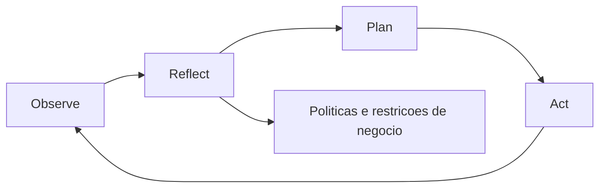
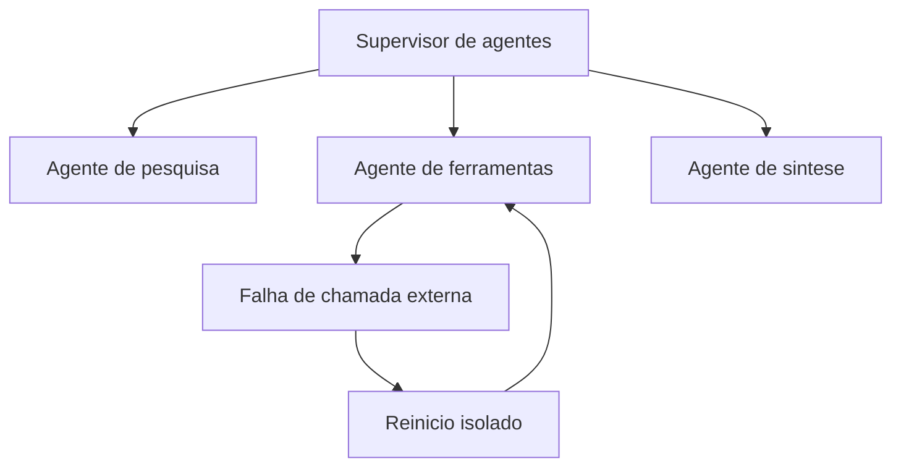
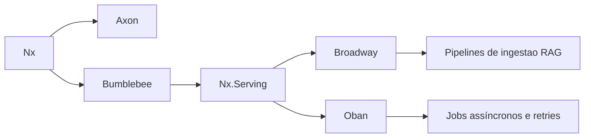
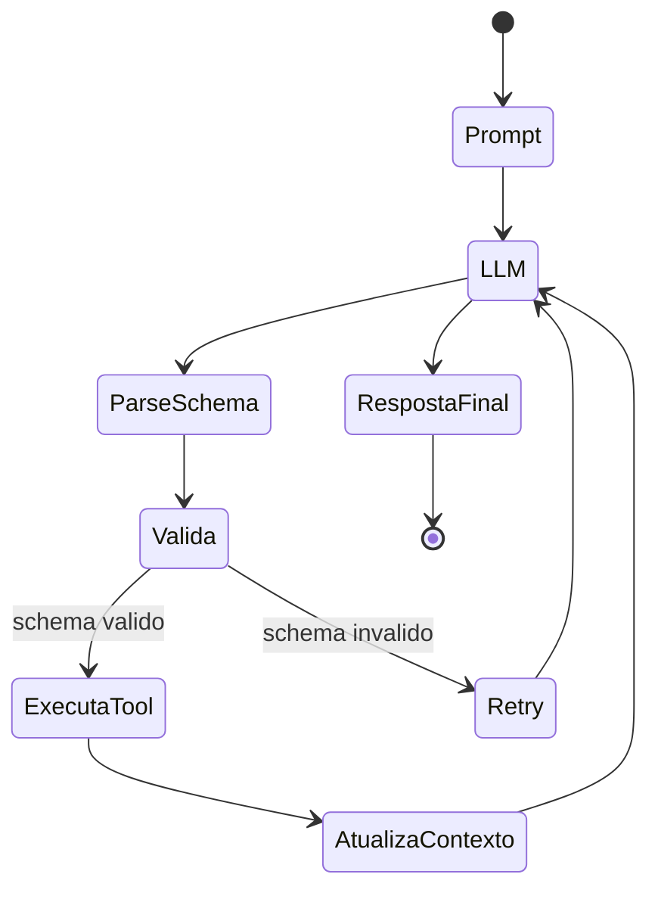

# **Além do Hype: Como integrar Arquiteturas Cognitivas e LLMs ao seu Produto**

A adoção da Inteligência Artificial Generativa (GenAI) no ecossistema de desenvolvimento de software atingiu um ponto de saturação discursiva. Organizações em escala global apressaram-se para incorporar interfaces conversacionais em seus produtos, impulsionadas pela promessa de ganhos exponenciais de produtividade e novas avenidas de receita. Contudo, o mercado atual enfrenta um fenômeno amplamente documentado como o "paradoxo da GenAI", onde uma parcela avassaladora de empresas — cerca de oitenta por cento — relata não observar qualquer impacto significativo e tangível na última linha de seus balanços financeiros, apesar dos pesados investimentos em infraestrutura e licenciamento. Esta dissonância não é um reflexo de falhas inerentes aos Modelos de Linguagem de Grande Escala (LLMs), mas sim o resultado direto de uma abordagem arquitetural imatura.

A vasta maioria das implementações iniciais tratou os modelos fundacionais como oráculos horizontais. As equipes de produto limitaram-se a acoplar caixas de texto às suas interfaces, permitindo que os usuários enviassem perguntas diretas (prompts) aos modelos, esperando que o vasto conhecimento paramétrico destas redes neurais resolvesse problemas complexos de negócios. Esta abordagem horizontal, exemplificada pela proliferação de assistentes genéricos e copilotos de produtividade, dilui o valor gerado através de múltiplos usuários e tarefas não essenciais, tornando o retorno sobre o investimento praticamente invisível nas métricas agregadas da corporação. O desafio para gestores de produto e líderes de inovação não reside mais na exploração superficial de modelos, mas na engenharia de soluções verticalizadas, onde a estocasticidade da linguagem natural é rigidamente contida por regras de negócios determinísticas.

Para transcender esta fase de experimentação, é imperativa uma transição estrutural profunda: a evolução da simples "engenharia de prompts" para a construção de Arquiteturas Cognitivas completas. Este documento detalha exaustivamente os fundamentos, as metodologias de infraestrutura e as ferramentas de ponta — com foco particular no paradigma funcional da Máquina Virtual Erlang (BEAM) e do ecossistema Elixir — necessários para orquestrar fluxos de Inteligência Artificial de grau corporativo. A análise abrange desde a estruturação de sistemas avançados de Geração Aumentada por Recuperação (RAG) até a gestão de estados complexos em sistemas multi-agentes, fornecendo um roteiro técnico e estratégico para a produtização de IA.

## **A Falácia do Prompt e a Ascensão das Arquiteturas Cognitivas**

O entusiasmo inicial em torno da IA generativa fomentou a falsa premissa de que a engenharia de prompts seria a habilidade definitiva do futuro do desenvolvimento de software. Embora a elaboração de instruções claras seja necessária, ela é fundamentalmente insuficiente para a criação de produtos resilientes. Modelos de linguagem isolados assemelham-se a um sistema de processamento de linguagem altamente capaz, mas que sofre de amnésia anterógrada severa e absoluta ausência de função executiva. Eles não possuem agência direcionada a objetivos intrínsecos, não retêm memória episódica contínua de interações passadas e não detêm percepção sensorial do estado atual do banco de dados da corporação.

Quando um produto digital depende exclusivamente de prompts estáticos enviados a uma API externa, ele está terceirizando sua lógica central para uma distribuição de probabilidades. O resultado inevitável são alucinações de dados, quebras de formato que impossibilitam o parsing por parte da aplicação tradicional e a incapacidade de executar tarefas que exijam múltiplos passos lógicos interdependentes. A solução para este impasse arquitetural é a Arquitetura Cognitiva de Modelo de Linguagem (LMCA).

Uma Arquitetura Cognitiva é um arcabouço computacional desenhado para emular os mecanismos invariantes e subjacentes da cognição humana. Em vez de operar como o sistema inteiro, o LLM atua apenas como o motor de raciocínio verbal, envolto por módulos de software clássicos que controlam a atenção, a memória, o aprendizado e a percepção do ambiente. O desenvolvimento recente busca consolidar décadas de pesquisa simbólica em um "Modelo Comum de Cognição", integrando a flexibilidade semântica das redes neurais profundas com a previsibilidade dos sistemas baseados em regras.

**Diagrama: Ciclo ORPA em agentes cognitivos**



### **O Framework ORPA e a Diferenciação de Agentes**

A transição de fluxos de trabalho tradicionais baseados em conteúdo para sistemas verdadeiramente inteligentes requer a implementação de agentes cognitivos. Diferente de scripts de automação que seguem árvores de decisão estáticas (IF-THEN-ELSE), os agentes cognitivos tomam decisões dinâmicas frente a incertezas. O modelo mental mais robusto para a engenharia destes agentes em ambientes de produto é o framework ORPA, que divide a execução em quatro fases distintas e orquestradas:

A fase de Observação (Observe) exige que o sistema vá além da simples coleta de dados empíricos. O agente cognitivo deve analisar o ambiente operacional — seja ele o estado de um banco de dados relacional, uma fila de mensagens de clientes ou logs de servidores — e identificar ativamente padrões e inter-relações ocultas. Em seguida, a fase de Reflexão (Reflect) atua como o núcleo de contenção do sistema. Antes de gerar qualquer saída, o agente deve contrastar os padrões observados contra um conjunto rígido de políticas de negócios, restrições éticas pré-definidas e dados de experiências passadas, assegurando que as diretrizes corporativas não sejam violadas pela probabilidade estatística.

Com a hipótese formulada, o sistema avança para o Planejamento (Plan). A arquitetura constrói uma sequência iterativa de ações lógicas projetadas para atingir o objetivo. Esta fase frequentemente utiliza técnicas de raciocínio de múltiplas etapas, como a Cadeia de Pensamento (Chain-of-Thought), que força o LLM a justificar cada passo intermediário de sua lógica antes de emitir o comando final, elevando exponencialmente a taxa de sucesso em tarefas matemáticas e de raciocínio espacial. Finalmente, a fase de Ação (Act) implementa as soluções elaboradas. Na arquitetura de software, isto se traduz na execução estruturada de ferramentas externas (Tool Calling), manipulando APIs, atualizando registros no CRM ou despachando comunicações, enquanto monitora continuamente os códigos de retorno HTTP para ajustar o plano em caso de falha.

### **O Dilema dos Workflows Agentais Múltiplos**

À medida que as aplicações se tornam mais complexas, surge a tentação arquitetural de pulverizar as tarefas através de múltiplos agentes especializados colaborando em rede. Contudo, pesquisas e implementações empíricas demonstram que, ao contrário dos sistemas modulares tradicionais (onde a adição de componentes geralmente amplia a funcionalidade linearmente), a proliferação não gerenciada de agentes de IA aumenta exponencialmente a carga cognitiva geral do sistema.

A ausência de orquestração rigorosa em redes multi-agentes resulta na amplificação de ruído estocástico, na execução de ciclos computacionais redundantes e no travamento do sistema em loops de argumentação infinita ou decisões contraditórias. O ganho de escala não se traduz magicamente em maior inteligência. Pelo contrário, o alinhamento e a convergência comportamental observados nestes sistemas emergem não de uma "consciência" interna do modelo, mas do que a teoria dos atratores descreve como o enquadramento imposto pelo próprio design de interação. A estrutura geométrica e a entropia dos sinais no lado do operador — o "scaffold" ou andaime algorítmico — são os verdadeiros responsáveis por guiar a saída do modelo em direção a respostas úteis e estáveis ao longo de múltiplas iterações da memória de curto prazo (KV cache). Portanto, a responsabilidade do sucesso do produto recai quase que integralmente sobre a infraestrutura de engenharia que circunda o modelo, não apenas sobre a seleção de qual modelo fundacional utilizar.

| Elemento do Sistema | Função na Arquitetura Cognitiva | Impacto Estratégico no Produto |
| :---- | :---- | :---- |
| **Memória Semântica** | Armazena conhecimento factual corporativo a longo prazo através de bancos vetoriais. | Garante que o produto responda com base na verdade proprietária, não no viés do treinamento original. |
| **Motor de Reflexão** | Avalia cenários contrafactuais e restrições de negócio antes da execução. | Previne falhas de segurança, violações éticas e ações prejudiciais ao cliente. |
| **Supervisão de Agentes** | Controla hierarquicamente a topologia de comunicação entre sub-agentes. | Evita redundância computacional e reduz agressivamente os custos de API por inferência excessiva. |
| **Execução de Ferramentas** | Modifica o estado do ambiente via chamadas determinísticas de funções (APIs). | Transforma um mero gerador de texto em um produto resolutivo que entrega valor de ponta a ponta. |

## **A Engenharia da Memória Corporativa: O RAG Avançado**

Para que um LLM tome decisões precisas sobre os dados de uma organização específica, ele precisa de uma memória semântica perfeitamente acoplada. Modelos baseados apenas em seus pesos de treinamento sofrem com o decaimento temporal do conhecimento, desconhecendo completamente eventos ocorridos após sua data de corte de dados. A Geração Aumentada por Recuperação (RAG) estabeleceu-se como a arquitetura padrão da indústria para resolver este déficit, convertendo itens de conhecimento proprietário em representações matemáticas que podem ser seletivamente recuperadas e injetadas no contexto do modelo em tempo real. No entanto, a implementação base que se popularizou no último ano provou-se severamente frágil para sustentar produtos de missão crítica.

### **A Fragilidade do RAG Ingênuo (Naive RAG)**

O fluxo operacional do RAG dito "Ingênuo" segue uma esteira algorítmica linear: os documentos da organização são particionados em blocos arbitrários de texto (chunking), codificados por um modelo de embedding bidirecional em tensores flutuantes, e armazenados em bancos de dados baseados em memória. Durante a inferência, a pergunta do usuário é igualmente transformada em vetor, e o sistema recupera os blocos de texto geograficamente mais próximos no espaço multidimensional utilizando o cálculo de similaridade de cosseno, repassando o resultado ao LLM.

Embora funcional para demonstrações técnicas, esta abordagem quebra fundamentalmente em ambientes corporativos devido a múltiplas vulnerabilidades arquiteturais. A recuperação exclusivamente semântica (vetorial) possui uma miopia endêmica para correspondências lexicais precisas. Se um gestor procura dados sobre o "Projeto X-99", a busca vetorial pode recuperar documentos semanticamente ricos sobre desenvolvimento de projetos em geral, mas negligenciar um memorando crucial que contém a string exata "X-99" simplesmente porque o modelo de embedding original não atribuiu densidade geométrica a esse identificador raro.

Ademais, a estratégia de particionamento (chunking) baseada exclusivamente em contagem estática de caracteres ou tokens corta agressivamente o contexto e a estrutura hierárquica das informações. O modelo recebe fragmentos desidratados que perderam a premissa inicial do parágrafo. Sem uma camada de reclassificação, a similaridade matemática pura tende a recompensar a proximidade espacial latente, o que nem sempre se correlaciona com a utilidade prática ou veracidade exigida pela pergunta multifacetada do usuário. O limite finito das janelas de contexto também força o sacrifício de informações pertinentes.

### **A Arquitetura do RAG Avançado e Recuperação Híbrida**

Para extrair ROI real, líderes de desenvolvimento devem impor a adoção de técnicas de RAG Avançado, que abandonam a busca linear em favor de pipelines multi-estágios sofisticados. Esta arquitetura eleva a inteligência do sistema e garante que as respostas sejam factuais, explicáveis e passíveis de replicação escalável.

**Diagrama: Pipeline de RAG avancado**


A primeira inovação estrutural é a adoção compulsória da Busca Híbrida. Este método consolida o melhor de dois paradigmas de pesquisa da ciência da computação: a recuperação densa focada em significados semânticos profundos e a busca esparsa tradicional focada na presença precisa de palavras-chave (frequentemente implementada através da função de ranqueamento BM25). Enquanto a recuperação densa lida impecavelmente com ambiguidades e paráfrases, a busca BM25 garante precisão cirúrgica no resgate de códigos, datas exatas e jargões hiper-específicos da indústria. Ao executar ambas as consultas de forma paralela, a arquitetura assegura uma teia de cobertura à prova de falhas.

Exemplo mínimo de recuperação híbrida com fusão RRF:

```python
def hybrid_retrieve(query, top_k=10):
    dense_hits = vectordb.search(query, k=50)        # similaridade semantica
    lexical_hits = bm25.search(query, top_k=50)      # correspondencia lexical

    # RRF: combina listas pelo ranking, sem depender da escala do score
    scores = {}
    k = 60
    for rank, doc in enumerate(dense_hits, start=1):
        scores[doc.id] = scores.get(doc.id, 0) + 1 / (k + rank)
    for rank, doc in enumerate(lexical_hits, start=1):
        scores[doc.id] = scores.get(doc.id, 0) + 1 / (k + rank)

    ranked = sorted(scores.items(), key=lambda x: x[1], reverse=True)
    return [docstore.get(doc_id) for doc_id, _ in ranked[:top_k]]
```

Resultado esperado: melhora de cobertura para consultas ambíguas e, ao mesmo tempo, ganho de precisão para IDs, códigos e termos raros.

A confluência mecânica de buscas híbridas cria um desafio matemático fundamental. Um escore de similaridade de cosseno (variando de zero a um) e um escore logarítmico não-limitado derivado da equação BM25 operam em escalas matemáticas mutuamente exclusivas, impossibilitando uma mescla aritmética direta para definir a precedência dos documentos.

A indústria padronizou a solução para esta fricção através do algoritmo de Fusão de Ranqueamento Recíproco (Reciprocal Rank Fusion \- RRF). Este método elimina o problema da padronização de escalas descartando inteiramente as pontuações numéricas puras. Em vez disso, o algoritmo avalia a posição relativa do documento em ambas as listas ordenadas de forma independente. O sistema então computa um novo escore de utilidade somando os rankings recíprocos de cada documento, suavizados por uma constante matemática.

A formulação matemática do RRF é expressa como:

![][image1]  
Na equação, o parâmetro ![][image2] serve como um amortecedor de penalidades (comumente estabelecido em 60 na prática industrial), prevenindo que os resultados de topo absoluto dominem excessivamente a lista agregada, garantindo espaço para documentos medianos que demonstrem utilidade ampla. A verdadeira proeza desta fusão se revela em sua implantação em conjunto com rotinas de compreensão de intenção (query expansion). Uma técnica comum envolve solicitar ao LLM que expanda a pergunta orgânica do usuário em três a cinco variações hipotéticas antes da busca. Todas essas permutações semânticas são despejadas paralelamente nos motores vetorial e lexical, com seus resultados amalgamados pelo RRF. Documentos factualmente sólidos flutuam para o topo do conjunto por consenso natural ao aparecerem consistentemente em múltiplas frentes de busca, enquanto anomalias estatísticas oriundas de uma variação mal elaborada da query afundam organicamente na lista.

### **A Fase Crítica de Reclassificação (Reranking) e Cross-Encoders**

A simples agregação híbrida produz um alto volume de candidatos com excepcional "recall" (abrangência), mas depara-se com limitações de precisão absoluta (precision). Inserir dezenas de documentos em um LLM acarreta não apenas latência intragável e custos pornográficos na contagem de tokens processados (prompt pricing), mas também confunde os mecanismos de atenção nativos do modelo. A ponte indispensável no final do pipeline é a etapa de Reclassificação (Reranking).

O reranking atua como uma peneira estrita, tomando os cem principais candidatos recuperados (top-K) e os submetendo a um segundo modelo muito mais minucioso e denso. Enquanto as fases anteriores priorizam a eficiência em escala de milissegundos sobre milhões de vetores, a reclassificação pode gastar recursos substanciais focando unicamente na máxima fidelidade do pequeno conjunto isolado.

A tecnologia preponderante neste nível são os modelos de interação profunda, classificados como *Cross-Encoders* (por exemplo, a família MS MARCO MiniLM ou BGE-Reranker). Para compreender seu valor, é preciso compará-lo aos modelos *Bi-Encoder* utilizados inicialmente. Um Bi-Encoder codifica a pergunta em um vetor e o documento do texto em outro vetor, calculando a distância pontual de modo isolado. O Cross-Encoder, reciprocamente, concatena a pergunta do usuário e o fragmento de texto em uma única sequência consolidada, permitindo que as intrincadas cabeças de autoatenção do Transformer cruzem inferências bidirecionais entre cada sílaba do problema e cada conceito do artigo candidato.

Esta análise profunda atua como um juiz de mérito semântico, pontuando os pares em métricas não apenas de relevância, mas também de intenção e utilidade factual real perante o comando. Após esta calibragem de escores finais com pontuações brutas ou métricas probabilísticas de entailment (implicação textual), o conjunto altamente comprimido e destilado do top-3 a top-5 passa finalmente à engrenagem generativa do LLM principal. Somente através dessa exaustiva linha de refino garante-se a repetibilidade em larga escala, limitando os desvios indesejados e consolidando o RAG como a principal arquitetura de apoio de produtos reais.

| Componente da Arquitetura | Estratégia Implementada | Benefício Tangível para o Negócio |
| :---- | :---- | :---- |
| **Ingestão e Metadados** | Chunking consciente da estrutura e extração de identificadores chave. | Preserva informações hierárquicas, evitando quebra no fluxo de significado de manuais complexos. |
| **Recuperação Híbrida** | Mescla de Similaridade de Cosseno (Embeddings) e Motor Lexical (BM25). | Mitiga casos onde clientes pesquisam produtos por IDs específicos em vez de atributos semânticos. |
| **Fusão Estatística** | Algoritmo Reciprocal Rank Fusion (RRF) na mescla de retornos. | Cria consenso entre diferentes paradigmas de busca, rebaixando resultados acidentais na tabela. |
| **Peneiramento (Reranking)** | Modelos Cross-Encoder avaliando a correlação emparelhada (Query-Documento). | Corte radical de inchaço de contexto e eliminação de distrações, salvando orçamento na inferência do LLM. |

## **O Paradigma da Infraestrutura: Os Desafios Produtivos do Python**

Transpor todos esses elaborados pipelines conceituais do laboratório de ciências de dados para o servidor de produção descortina um gargalo infraestrutural severo. O imperativo industrial determina que Inteligência Artificial operante no limite de produtos modernos lide primariamente com alta paralelização e intensa orquestração de rede, ao invés da maturação massiva prévia dos modelos de pesos fixos.

É incontestável que o ecossistema Python constitui o eixo gravitacional da evolução teórica em Machine Learning. Repositórios vastos e o maciço patrocínio financeiro estabeleceram o domínio incontestável da linguagem na exploração analítica de dados e na fase de retropropagação e treinamento de base de novos modelos fundacionais. O problema reside no fato de que o ecossistema Pythonic é organicamente imperativo e apresenta graves déficits arquiteturais quando exigido a executar fluxos contínuos multifacetados, altamente assíncronos e dependentes de processos distribuídos persistentes exigidos pelas arquiteturas de agentes.

### **O Legado Imperativo e as Restrições de Concorrência**

Em ecossistemas baseados fundamentalmente em padrões legados, como plataformas operando frameworks clássicos, a proliferação da complexidade de conexões entre a aplicação principal e o serviço de busca de informações é inibida por deficiências sistêmicas de isolamento. Aplicações monolíticas Python comumente resvalam no acoplamento acidental imposto pela flexibilidade permissiva e a importação promíscua de lógicas nos Modelos de Objeto-Relacional (ORMs), convertendo interações em estruturas altamente amarradas de "código espaguete" de manuseio árduo.

A barreira mais fundamental é o Global Interpreter Lock (GIL). O GIL amarra o motor de execução do Python a interações seriais atreladas, impedindo a paralelização genuína em servidores multi-core sem malabarismos de computação distribuída periférica. A avaliação em testes de desempenho real no mercado indica que em respostas unitárias para eventos concorrentes em massa, a degradação de tempo do Python (mesmo mitigado superficialmente) o posiciona em séria desvantagem de elasticidade operacional frente a compiladores estritos. Para os líderes, isso implica a necessidade de provisionar instâncias em nuvem dispendiosas ou clusters colossais e de espinhar serviços através de microarquiteturas frágeis, impactando as projeções financeiras na manutenção de sistemas corporativos operacionais de IA.

## **A Resposta da Indústria: A Orquestração através da BEAM e de Elixir**

Para gerentes de projeto estruturando sistemas tolerantes a falhas e arquiteturas cognitivas de longo ciclo, o paradigma precisa mudar para abstrações onde concorrência, processos concorrentes assíncronos e o restabelecimento contínuo frente a panes sejam propriedades inerentes de fábrica. É exatamente este fosso que o idioma Elixir, sendo executado sobre a histórica e militarmente testada Erlang Virtual Machine (BEAM), preenche.

**Diagrama: Supervisao de agentes sobre BEAM**



Projetada originalmente no seio das corporações de telecomunicações para reger o infalível transito planetário de chamadas telefônicas massivas simultâneas sem interrupções e sustentar uma tolerância a falhas na ordem dos nove noves de garantia (99,99999% uptime), a arquitetura BEAM adota profundamente o paradigma do Modelo de Atores. Nele, tudo atua na forma de processos ultraleves que comunicam-se via caixas postais autônomas com isolamento total de memória e que desconhecem a mutabilidade de dados em tempo de execução.

### **O Alinhamento Perfeito com a Orquestração Agentiva**

Sistemas orquestrados de inteligência são redes instáveis. Uma requisição pode despachar seis sub-agentes autônomos que vasculharão a internet e as APIs locais. Em sistemas imperativos, a queda pontual em um serviço frequentemente desencadeia a paralisação em cascata (avalanche) no fluxo principal do usuário, exigindo código defensivo labiríntico e blocos profundos de tratamento de exceções preventivas na origem. Além disso, a mutação passiva impõe aos engenheiros de dados a obrigatoriedade da clonagem agressiva defensiva sistemática (ex: chamadas .copy() massivas em matrizes alocadas), o que detona os marcadores analíticos de velocidade.

Elixir vira este problema pelo avesso com sua filosofia de estruturas unicamente imutáveis e funções de pureza matemática, anulando de partida camadas monumentais de debacles de memória e acessos concorrenciais espúrios. Mas o triunfo repousa sobre suas árvores de supervisão (Supervision Trees). O princípio intrínseco de Elixir é a premissa pragmática de que "acidentes sistêmicos ocorrerão invariavelmente". Frente a um LLM de terceiros que retornou um arquivo ilegível, ou uma requisição gRPC esgotada após trinta milissegundos, a estratégia não é prevenir o choque em cada linha de operação, mas instituir agentes sentinelas. Se um processo falha abruptamente e tomba, a árvore supervisora atua exterminando unicamente o filamento daquela subtarefa combalida, reavivando um ator em estado limpo imediatamente para tentar sanar a operação subjacente sem contaminar a integridade do restante da requisição sistêmica.

Exemplo mínimo de supervisão com retry isolado em Elixir:

```elixir
defmodule AgentWorker do
  use GenServer

  def start_link(arg), do: GenServer.start_link(__MODULE__, arg)

  def init(arg), do: {:ok, %{arg: arg, retries: 0}}

  def handle_info(:run, state) do
    case ExternalTool.call(state.arg) do
      {:ok, result} -> {:noreply, Map.put(state, :result, result)}
      {:error, _} when state.retries < 3 ->
        Process.send_after(self(), :run, 200)
        {:noreply, %{state | retries: state.retries + 1}}
      {:error, reason} -> {:stop, reason, state}
    end
  end
end
```

Resultado esperado: uma falha local reinicia somente o worker afetado, preservando estabilidade global do fluxo.

É uma orquestração de resiliência sistêmica inatingível pelos assistentes artificiais estáticos ou agentes desconexos; constitui um mecanismo onde o código se automodela visando assegurar estabilidade contínua ininterrupta, um pré-requisito irrefutável para os sistemas maduros de fluxo de trabalho em inteligência moderna corporativa.

## **O Ecossistema Nativo de IA do Elixir e o Crescimento Vertical**

O argumento contrário histórico do Elixir fundamentava-se no escasso acervo de componentes de rede neural. Todavia, os últimos vinte e quatro meses testemunharam um florescimento tecnológico vertical massivo na comunidade, transportando Elixir do estágio de retaguarda de transações web genéricas para a vanguarda como um veículo premier para desenvolvimento inteligente de produção. A adoção acelerada está consolidada na formidável camada unificada baseada no trio de bibliotecas Nx, Axon e Bumblebee.

**Diagrama: Camadas do ecossistema IA em Elixir**



### **Fundamentos Matriciais: A Camada Nx e Axon**

Na fundação está o projeto **Nx (Numerical Elixir)**. O Nx dota o Elixir de capacidade integral para gerenciar, mutacionar e orquestrar tensores matemáticos n-dimensionais análogos ao que o ecossistema matriz do Python realiza em linguagens especializadas de baixo nível. Mais contundente do que apenas um modelador matricial passivo, o Nx é construído para sofrer a compilação fluída just-in-time direta na arquitetura nativa da CPU, aceleradores específicos ou farm de clusters de Unidades de Processamento Gráfico (GPUs) via EXLA (uma vinculação poderosa com o Google XLA tensor compiler backend), ofertando a paridade métrica em eficiência paralela exigida pelos cálculos massivos inerentes às redes.

Acima destas rotinas tensores, assenta-se o arcabouço funcional chamado **Axon**, que entrega os prumos declarativos flexíveis primários comumente associados com as frentes profundas analíticas. Empregando os nodos sintáticos simplificados mas estritos da língua, o desenvolvedor concebe topologias completas multicamadas convolucionais de modelos para processamento contínuo das rotinas lógicas inferenciais determinísticas na predição de classificações precisas a partir das informações vetorizadas manipuladas pelo núcleo numérico.

### **Bumblebee e Distribuição Concorrente via Nx.Serving**

O avanço transformativo prático definitivo, no entanto, consubstancia-se com a incorporação do **Bumblebee**. Agindo essencialmente na facilitação direta de uso do que o Hugging Face provê ao espectro amplo dos cientistas de dados, ele permite integrar e rodar com frações mínimas de escrita procedural os mais pesados modelos pré-treinados arquitetônicos disponíveis globalmente, portando pesos fundamentais diretamente das nuvens de repositórios (como instâncias intelectuais do GPT-2, Llama-3, classificadores baseados nas arquiteturas estruturais RoBERTa e analisadores contextuais convolucionais ResNet-50) para os dutos estritos da aplicação desenvolvida pela empresa.

Nesta composição orquestral da arquitetura, emerge o divisor de águas absoluto do ecossistema frente aos cenários de Python de servidor e escalonamento financeiro agressivo: a abstração estrutural do **Nx.Serving**. Na modelagem imperativa corriqueira, a distribuição das conexões geradas pela interface de quinhentos utilizadores simultâneos requisitando uma verificação inferencial exige frequentemente a mobilização de filas de barramento dispendiosas de processamento ou instâncias unitárias desastrosamente onerosas que dilapidam as taxas de uso rentável do processamento.

O componente sistêmico nativo Nx.Serving transfigura isso criando uma rotina supervisora persistente nativa e de baixíssimo consumo dentro da própria BEAM. À medida que as centenas de rotinas concorrentes injetam demandas e perguntas isoladas, o serviço captura, engolfa, mescla iterativamente as submissões díspares contínuas em blocos de requisição unificados (batching) com máxima saturação e empacota-os à submissão do pipeline compilatório final da GPU em uma passagem colossal. No regresso da inferência resolvida conjunta, o sistema subdivide os tensores resultantes assincronamente despachando o escopo estrito matemático adequado para as portas do exato chamador processual original, garantindo aproveitamentos térmicos e eletrônicos perfeitos do hardware da infraestrutura da organização, rebaixando substancialmente e drasticamente os montantes de amortização mensais pagos nos arranjos em provedores globais.

### **Fila Produtiva no RAG Avançado: Broadway e Oban**

Os administradores de projetos observam na teoria dos pipelines cognitivos – particularmente na confecção contínua estrita das bibliotecas da semântica híbrida atestada no RAG – a premissa tácita da gestão persistente das imensas correlações bibliográficas em tempo real da empresa corporativa. Gerir esses carregamentos periódicos em um fluxo contínuo exige abstrações resilientes tolerantes ao volume.

Neste espectro, a suíte de processos assíncronos em segundo plano ganha prevalência absoluta. As aplicações base em Elixir usufruem amplamente do ecossistema consolidado encabeçado por frameworks imbatíveis de filas em concorrência, centralmente ilustrado pela interface **Broadway**. Baseado para acoplamentos puros em plataformas corporativas como o SQS (Amazon) ou protocolos em RabbitMQ, o duto manipula as partições com gracefulness rigoroso e reinício amigável sem perdas dos enquadramentos de leitura vetorial na etapa primária dos processamentos e enriquecimentos. Adicionalmente, arquiteturas simplificadas em arranjos escaláveis baseiam as indexações através de bibliotecas de ponta unificadas em bancos base (como o **Oban**, que usa unicamente do protocolo primário rígido relacional no PostgreSQL para orquestrar enfileiramentos robustíssimos e concorrências contínuas), dispensando inteiramente instâncias laterais acessórias na rede de nuvem, reduzindo os gargalos inerentes.

| Camada Operacional | Ferramenta Elixir | Vantagem Competitiva Tangível |
| :---- | :---- | :---- |
| **Manipulação Base de Dados e Tensores** | Nx | Compilação otimizada transparente (via EXLA) maximizando a execução. |
| **Arquitetura Declarativa Neural** | Axon | Construção de tipologias inferenciais locais profundas. |
| **Gerência Inferencial Distribuída** | Bumblebee com Nx.Serving | Abstração em lotes automáticos da GPU, dilapidando os desperdícios monetários com instâncias. |
| **Gestão Operacional de Trabalhos Traseiros** | Broadway & Oban | Concorrência paralela imune a abalos parciais na ingestão de RAG corporativos de hipervolume. |

## **Imposição Racional aos Modelos: Domando as Saídas LLM e a Execução Funcional (Tool Calling)**

Equipado com o ecossistema orquestral de processamento assíncrono hiper-otimizado e um pipeline sólido híbrido para as ressignificações de arquivos internos, o dilema final da inteligência na confecção de softwares produtivos se instala na restrição de conversão: A arquitetura precisa aniquilar a conversação efêmera prolixa inestruturada de rotina das linguagens amplas de inteligência fundacional. Modelos conversacionais brutos devolvem longas predições probabilísticas de formato oscilante que falham integralmente em alimentar fluxos sistêmicos de dados estruturados. O elo vital de comunicação baseia-se na domesticação da inteligência da infraestrutura perante lógicas formais estáticas tipadas e modelagens explícitas rígidas.

**Diagrama: Ciclo de tool-calling com validacao**



### **O Paradigma Determinístico de Saídas através do instructor\_ex**

A erradicação contundente deste empecilho estrutural foi superada pelo aporte engenhoso na confecção sistemática de bibliotecas de indução formal estrita, epitomizado na classe corporativa pela suíte instructor\_ex do Elixir. Em oposição veemente contra a dependência torpe, frouxa e baseada puramente nas táticas da formatação semântica retórica explícita ("Por favor, emita somente num estilo JSON adequado os retornos sob certas formatações arbitrárias preestabelecidas..."), o padrão força os limites estritos da topologia paramétrica definindo estruturalmente restrições intransponíveis ao limite atencional cognitivo na fase da predição final do duto LLM.

A engenharia por trás do mecanismo apoia-se num dos pilares cardeais de estruturação e manipulação transacional nos bancos do ambiente Elixir moderno: a suíte Ecto e seus construtos base (Ecto Schemas). O arquiteto traça nos módulos descritivos declarativos corporativos estritos, modelando ativamente o mapa morfológico obrigatório imutável esperado para a requisição dos desfechos na tarefa proposta na cognição orquestral e seus parâmetros correlacionados estritos obrigatórios.

Nos limiares do fluxo analítico preditivo, a infraestrutura da biblioteca traduz transparentemente o mapeamento estruturado explícito nativo num intrincado delineamento validador esquemático formal JSON Schema aceito na decodificação intrínseca no portal inferencial algorítmico do provedor externo ou instâncias internas Bumblebee. O modelo algorítmico externo preenche organicamente as amarras desta morfologia esquemática sem oscilação formal, contendo fundamentalmente os erros tipográficos textuais esporádicos ou aberrações alucinatórias contextuais indesejáveis inerentes da rede probabilística sem supervisão direta no topo da sua atuação.

Exemplo mínimo de tool-calling com validação de schema:

```python
from pydantic import BaseModel, ValidationError

class TicketAction(BaseModel):
    action: str
    ticket_id: str
    priority: str

raw = llm.generate(prompt_with_schema)

try:
    action = TicketAction.model_validate_json(raw)
    execute_tool(action.action, action.ticket_id, action.priority)
except ValidationError as err:
    # feedback estruturado para nova tentativa do modelo
    retry_prompt = f"Schema inválido: {err}. Gere novamente JSON válido."
    raw = llm.generate(retry_prompt)
```

Resultado esperado: redução de quebras de parsing e maior previsibilidade da automação.

Ademais e cruciais para a resiliência sistemática em aplicações de grau real são as lógicas de auto-correções operacionais inerentes (auto-recuperações estritas da cadeia cognitiva paramétrica da ferramenta). Se a saída gerativa do componente esbarrar ainda assim numa asserção morfológica inaceitável aos propósitos da manipulação da aplicação base devido à desvios interpretativos e erros inferenciais estocásticos lógicos internos frente à complexidade interpretativa contextualizada do documento repassado via RAG, a mecânica da suíte entra no amparo automático: ela não descarta meramente as predições gerativas para falha nula perante o usuário cliente. Valendo-se das robustas e testadas estruturas clássicas validadoras (validate\_changeset/1) inseparáveis na lógica matriz nativa relacional base do framework, a ferramenta processa imediatamente as inconformidades e relança ciclicamente o erro interpretado empacotado para o arcabouço fundacional, invocando os laços recursivos iterativos orquestrados automáticos do algoritmo e exigindo em nova submissão do pipeline um reposicionamento autônomo imediato consertando-o mecanicamente de volta para os ditames estritos morfológicos na malha restritiva sem auxílio externo no parâmetro estabelecido pelo loop condicional arquitetado max\_retries.

### **Desacoplamento da Cognição através de Orquestração com LangChain Elixir**

Dominada a constância da estrutura e domesticados as oscilações alucinatórias puramente discursivas dos motores da inferência através do paradigma estrito do schema de tipagem, a transposição da barreira de limitação inercial ocorre conferindo o aspecto de operabilidade (Agência Operacional real). O sistema avança permitindo ao raciocínio lógico transpor as malhas orgânicas da linguística preestabelecidas no banco do RAG para assumir controle atuador na engrenagem viva do ambiente do produto. A adoção madura arquitetural confere suporte unificado através da ponte modular instrumental base de integrações agentais como o LangChain para plataformas baseadas no espectro imutável nativo, modelado integralmente na orquestração estrita.

Embora baseada nos ditames intelectuais homônimos desenvolvidos centralmente pela maciça comunidade da versão matriz em ecossistemas interativos pregressos orquestrais Python e congêneres fundamentais na área (que possibilitam conectividades extensivas da matriz informacional pretreinada ao arcabouço complexo interativo na periferia operacional dos serviços da internet corporativa), a encarnação modular e puramente estrita paralelizável em Elixir provê aos construtores do software alicerces fundamentais na orquestração interativa desprovidos visceralmente das mazelas atreladas inerentes ao processamento amarrado acoplado de laços lógicos das correntes interpretativas sequenciais monolitizadas imperativas legadas.

No alicerce das diretivas corporativas estáticas interativas reside o módulo cardinal matriz arquitetural chamado e gerenciado LLMChain do LangChain. Contido nas abstrações centrais de engrenamento operacional das rotinas lógicas interativas dos modelos sistêmicos estruturais das ferramentas cognitivas fundamentadas nestas metodologias operacionais maduras para produto corporativo real, sua serventia estende-se primariamente como núcleo conector de orquestração. A mágica sistemática se inicia permitindo às equipes de programação a integração fluida direta interativa das funções matriciais corporativas existentes orgânicas dos repositórios locais restritos no software interno (rotinas financeiras de pagamentos pontuais, integrações das automações das tabelas dos clientes primários nos registros, execuções condicionais estritas perante autorizações internas restritivas interativas na malha orgânica estrutural da companhia, rotuladas abstratamente dentro dos parâmetros construtivos dos moldes semânticos interpretativos de "Tool" ou componentes LangChain.Function).

Sob o escrutínio do modelo da arquitetura, e fundamentado perante o enquadramento rígido contextual cognitivo estabelecido no módulo do arcabouço, a cognição do processamento LLM recebe não a permissão solta reativa comunicativa para divagar abstratamente frente as informações ou problemas postulados nos textos brutos dos utentes requisitantes nas pontas dos acessos digitais orgânicos diários no duto comunicacional; recebe ao revés o portfólio restritivo tipado explícito da gama de utilitários funcionais expostos para interagir no limite e solucionar estritamente de maneira processual condicional.

Após a fase introspectiva interpretativa refletiva e avaliativa da lógica fundamental perante as restrições impostas organizacionais explícitas (Reflect & Plan), a mecânica da predição matemática estatística em vez de concatenar sentenças frasais descritivas, dispara as engrenagens de "Tool Calling" direcionadas para o ambiente da plataforma de base orgânica e exige no modo cíclico (mode: :while\_needs\_response) as passagens sistêmicas interativas do algoritmo operando ativamente os processos rotineiros mecânicos locais do Elixir acionando as chamadas restritas ao contexto condicional (custom\_context). A execução da chamada em background do lado estrutural da aplicação coleta as minúcias atualizadas e reinsere ativamente o retorno real instantâneo como um adendo analítico suplementar no tecido contextual orgânico interpretativo da rede fundacional pregressa. O motor semântico iterativamente digere as transformações orgânicas geradas na rede estrutural das ferramentas pelas ações concretas em frações milissegundais sem depender de deduções textuais inferenciais alucinatórias.

#### **Avaliação de Qualidade e Assertividade: A Lógica Algorítmica das Trajetórias**

Os líderes gestores que estruturam e patrocinam inovações complexas autônomas confrontam as limitações tradicionais dos critérios de avaliações algorítmicas de testes clássicos binários convencionais da programação tradicional no escrutínio sistêmico diário. Na cognição orgânica iterativa em rede de um agente, a assertividade da reposta orgânica dedutiva exibida passivamente no terminal visual para aprovação pontual de usuário cliente torna-se metricamente pífia e desprovida estritamente do cenário analítico abrangente das lógicas procedimentais de custos associados gerados inerentemente na profundidade computacional do processo iterativo sequencial resolutivo do algoritmo matriz. Dois sub-agentes autônomos podem teoricamente e mecanicamente conceber e entregar com êxito idêntico e correção sintática orgânica unificada um desfecho estrito perante os preceitos de negócios em avaliações perfunctórias clássicas simplórias; mas a diferença fulcral esconde-se sub-repticiamente na disparidade colossal mecânica da eficácia algorítmica lógica subjacente orquestral do "caminho de execução e dedução interpretativa" trilhada (quando uma iteração orgânica resolve o obstáculo algorítmico valendo-se apenas duma chamada API singular ótima resolutiva barata otimizada em face a predições iterativas lógicas desconexas do outro fluxo incorrendo dezenas recursivas rotinas estocásticas de tentativas de resoluções e correções contínuas, dizimando e inflando vertiginosamente o volume quantitativo do pedágio monetário financeiro inerente à volumetria dos tokens alocados subjacentes da computação orgânica).

Em consonância resolutiva metódica para aplacar a inquietação contundente arquitetural gerencial na previsibilidade e rastreabilidade estrita do consumo autônomo e de conduta procedimental e resguardar avaliações minuciosas de conformidades em testes lógicos estritos (QA Testing e regressões) em sistemas lógicos baseados iterativos em cognição multi-chamadas no espectro do paradigma moderno e resguardar estritamente o duto da eficiência processual contra inflações incontroláveis de repetições procedimentais gerativas do estocástico de chamamentos no desenvolvimento, a malha infraestrutural Elixir LangChain embute na estrutura essencial das bibliotecas componentes os construtos cardeais conceituais rastreadores e limitadores fundamentais da observação de estado nominados LangChain.Trajectory (Trajetórias).

O componente sistêmico arquitetural atua absorvendo na rede a fotografia detalhada formal tipada estrita exaustiva e encadeada iterativa sequencial procedimental exata pontual efetuada processual do raciocínio e invocações do LLMChain subjacentes iterativos dedutivos lógicos gerativos processuais até a conclusão da ação. As engrenagens de verificação sistemáticas de conformidades das trajetórias (LangChain.Trajectory.matches?/3) outorgam as capacidades amplas estritas analíticas da rotina lógica da empresa na estipulação comparativa explícita contundente estruturada no código-fonte das metodologias macro embutidas formais asserções procedimentais unificadas de exames iterativos base no teste orgânico unitário sistêmico diário (utilizando macros lógicas declarativas de avaliações iterativas rigorosas e precisas explícitas das trajetórias baseadas em comparações minuciosas pontuais de sequências literais como os formatos macros explícitos validadões em modos de confrontações de arranjos estritos, modos de avaliações lógicas baseadas unicamente em abrangência curinga, comparações unicamente conjunturais estritas desordenadas sequenciais pragmáticas de uso, ou verificação de subsídio integral e suprassunção base nas interações paramétricas e chamadas funcionais de dados nos argumentos invocados processuais interativos) e atestando as assertividades estritas do algoritmo do lado pragmático infraestrutural da predição orquestrada autônoma das ferramentas do agente na sua atuação no mundo das arquiteturas processuais gerativas corporativas.

## **Estudo de Casos Empresariais, Rentabilidade Estrita e Projeção Estratégica Executiva (ROI)**

Ao ultrapassarmos as premissas mecânicas algorítmicas, a integração mandatória base e validação unificada final na introdução processual madura infraestrutural pragmática do LLM base fundamenta-se invariavelmente restrita nos pilares de avaliação do mercado e demonstrações métricas tangíveis de desempenho corporativo macro. O dilema persistente gerencial na justificativa exata fidedigna analítica do caso real unificado de aplicação e justificativa de mercado monetária para justificar subsídios estritos inibem a expansão e adesões inovadoras reais corporativas perante o escrutínio restrito executivo gerencial nos orçamentos pragmáticos. Organizações globais que conseguem enquadrar estritamente a eficácia dos rendimentos na introdução de arquiteturas generativas maduras na camada base central no seu balanço corporativo em quatro espectros absolutos unificados nas métricas financeiras essenciais pragmáticas avaliadas rigorosamente na análise: os rendimentos financeiros pragmáticos operacionais exatos tangíveis explícitos unificados incrementais diretos advindos do aumento substancial de capacidade funcional orgânica; as métricas financeiras da vertente da receita da inovação analítica funcional da expansão; as quedas estruturais de gastos contínuos infraestruturais sistemáticos de base computacionais pragmáticos nas despesas orgânicas processuais de manutenção técnica gerencial; e na vertente tangível das janelas do ciclo das validações algorítmicas de prototipação processual de entrega da solução algorítmica ao público de mercado consumidor direto em frentes ágeis (Time-to-Market estratégico da operação).

### **Justificativas Paramétricas de Migrações Infraestruturais (TCO)**

O apelo financeiro e analítico inabalável executivo em migrações táticas da camada operacional procedimental tradicional monolítica atada infraestrutural nos dutos amarrados da modelagem procedimental nativa Python focada na experimentação empírica solta nos arranjos multi-servidores e fragmentações em filas laterais adicionadas paliativamente, rumo à concentração sistemática processual baseada unificada contígua resiliente estrita no ecossistema e ambiente matriz maduro da orquestração virtualizada do modelo Atores fundamentado integralmente processualmente na BEAM de linguagens como o Elixir exibe rentabilidades exponenciais analíticas inquestionáveis e estritas. Ao erradicarmos integralmente a necessidade contínua dispendiosa rotineira crônica de expansões agressivas na manutenção onerosa de contingentes paralelos imensos nos recursos e na arquitetura fragmentada unificada nas arquiteturas, as organizações atingem organicamente reduções substanciais processuais e contenções marginais significativas mensuráveis em até vinte e cinco por cento pontuais contínuas estruturadas estritas na manutenção recorrente analítica orçamentária computacional financeira base nas taxas dos recursos e na orquestração pragmática de escalonamento elástico unificado da computação nos provedores de rede (AWS, Azure e demais instâncias), fundamentadas precipuamente nos arranjos de simplificações contíguas arquitetônicas do ecossistema.

Contraposições rasas pautadas superficialmente pelas lógicas das restrições restritas orgânicas limitadas pragmáticas no tempo na angariação e aquisição acelerada do corpo profissional do quadro programático base fluente estrito restrito na cognição do ambiente funcional do Elixir face aos contingentes vastos das linguagens de apelo acadêmico matricial globalizadas não invalidam a eficácia e sustentabilidade tática corporativa da escolha. Premissas táticas executivas adotam métodos de fomento focados em aceleração mentorada descentralizada unificada base na incorporação cirúrgica unificada restrita orgânica e tática base na inclusão de especialistas diretores arquitetos fundadores da matriz técnica orquestral unificada nos quadros focais, que disseminam estruturalmente e propagam no quadro amplo interno restrito a assimilação processual pragmática algorítmica da lógica e absorção das metodologias contínuas, comprimindo estritamente as janelas da estagnação da expansão. Alternativas maduras incluem a externalização pragmática estratégica imediata nos contingentes de agências de hiper-foco restrito especializado no nicho, catalisando e acelerando em frações irrisórias estritas os ciclos da produtização.

### **Casos Tangíveis Orquestrados da Aplicação Sistêmica Corporativa**

As ratificações tangíveis consolidadas nos desfechos estritos gerenciais e de arquitetura procedimental unificada das estratégias das linguagens focais nas orquestrações das inovações cognitivas modernas da aplicação de IA são consubstanciadas nos resultados orgânicos amplos pragmáticos diretos nas empresas referências e startups inovadoras de vanguarda no ecossistema base de serviços unificados globais tangíveis diários orquestrados estruturados analiticamente nos paradigmas modernos de alta cadência.

A *Remote* (estratégica Unicórnio focada restrita organicamente no escopo da base do setor de processamento estrito humano das operações e recursos logísticos de contratação corporativa global paralela descentralizada) ancorou e solidificou primariamente nas origens da arquitetura a escolha definitiva no idioma Elixir e da máquina virtual como a plataforma processual base e tática da infraestrutura pragmática de escala para processamento orgânico do sistema amplo de gerência estrita paralela, fomentada nos anseios diretores pragmáticos primários de escalonamentos globais livres sistêmicos irrestritos e concorrências pragmáticas desprovidas das mazelas comuns do crescimento sem as restrições arquiteturais paralisantes legadas, viabilizando ritmos ágeis de lançamentos pragmáticos seguros iterativos da solução base da rede com estabilidades superlativas de garantia pontual global em tempo integral na oferta dos produtos, amparados integralmente orgânicos da facilitação arquitetural do sistema de tolerâncias automáticas de resiliências ativas da plataforma subjacente estruturada da matriz.

Na vertente financeira pragmática diária trilionária do fluxo transacional algorítmico, os colossos de processos bancários pragmáticos consolidados do circuito aberto como a fintech *SumUp*, fundamentaram e validaram organicamente processualmente a escalada algorítmica das plataformas transacionais estruturadas pragmáticas base nas abstrações assíncronas concorrentes das comunicações paralelas orgânicas diárias fluídas iterativas do arcabouço Elixir utilizando arranjos consolidados estritos orquestrais avançados gerenciais do Broadway, contendo infraestruturas massivas, despencando organicamente margens processuais nas exigências operacionais contíguas, ao passo em que outorgaram saltos quantitativos assombrosos de robustez no processamento orgânico matricial de fluxos contínuos e vazão sistêmica extrema do software, solidificando o embasamento do controle tolerante e resiliente.

Já o alinhamento da inserção tangível pragmática avançada contundente nos espectros da conversação interativa autônoma gerativa do LLM encontra eco fundamental e validação prática orgânica na *Podium*, solução unificada pragmática global no roteamento interativo baseada centralmente e amparada integralmente nas fundações do Elixir na roteirização de escala massiva do mensageiro contínuo orgânico. Enriquecida processualmente ao mesclar taticamente o arcabouço fundacional orgânico unificado das inteligências gerativas da rede e do processamento do ChatGPT e correlatos pontuais restritos diretos para automações sistêmicas pragmáticas e abstrações de resoluções de pendências de reputação unificada. A estabilidade estrutural pregressa concedeu espaço de expansão e acomodação ágil sem atrito orgânico e desestabilizações processuais nos ciclos interativos das comunicações estruturais da matriz da orquestração processual pragmática da plataforma unificada diária maciça orgânica.

Nas fronteiras contíguas pragmáticas das implementações estratégicas agressivas orquestradas pontuais, soluções especializadas restritas focadas organicamente nativas (como as operações tangíveis pontuais da plataforma *Relixir*) orquestram validações táticas estruturadas nas arquiteturas baseadas organicamente nas métricas pragmáticas do SEO orquestrado para ecossistemas do motor conversacional restrito generativo em frentes das plataformas unificadas restritas. Exibindo contundências extremas na validação paramétrica em cenários, a conversão atingida pelas premissas operacionais sistêmicas contundentes automatizadas orquestradas alicerçou retornos massivos superlativos com escaladas vertiginosas analíticas estritas computando percentuais substanciais de retornos (1782% na demonstração empírica piloto base de eficácia estrutural do ROI) e saltos exponenciais estritos no angariamento tangível unificado restrito pragmático orgânico dos canais digitais das visitas com eficiências agressivas e margens pontuais curtas estruturais do cronograma estrito das operações logísticas nos processos orquestrais automatizados (em trinta dias processuais base algorítmicos tangíveis consolidados) mitigando inerentemente do processo pragmático o recrutamento braçal extensivo pragmático da camada de engenharia codificada na adaptação paramétrica procedimental contínua dos motores das soluções, viabilizados integralmente perante o emprego processual unificado sistemático contundente da infraestrutura gerencial contínua paralela autônoma.

### **Mitigação de Riscos, Governança Estrita Algorítmica (RBAC) e Tomada Decisória Gerencial Inovadora**

A consolidação corporativa pragmática tangível avançada unificada das soluções orquestradas na arquitetura LLM desvincula-se da adesão acrítica meramente dos mecanismos geradores estocásticos subjacentes para incorporar compulsoriamente preceitos base organizacionais restritos inegociáveis. Para as lideranças orçamentárias e de inovação do produto, o risco acachapante pragmático analítico repousa frequentemente nas desconfianças profundas inerentes no espectro de seguranças estruturais lógicas de alinhamentos na integridade estrita contígua procedimental e confidencialidades das estruturas sistêmicas processadas base diárias.

Nas fronteiras estruturais operacionais da arquitetura de recuperação de informações avançadas dos bancos híbridos do ecossistema RAG da aplicação estrita orquestral empresarial desenvolvida, a salvaguarda estrita impõe que nenhum contexto recuperativo interno contíguo possa ou deva, sob avaliações circunstanciais estritas ou brechas, extrapolar as normativas orgânicas de visualizações internas estipuladas e contíguas base nos perfis dos organogramas corporativos operacionais unificados processuais. O imperativo sistêmico obriga a assimilação pontual de rígidos parâmetros baseados fundamentalmente na imposição sistemática organizacional restritiva arquitetônica de Controles Funcionais de Autorizações Hierárquicos Algorítmicos Baseados e Fundados Exclusivamente e Inerentemente Estritamente Restritos por Papel Operacional Algorítmico do Utente (RBAC) no arcabouço unificado recuperacional híbrido contínuo e na gestão unificada das permissões estritas orquestrais semânticas processuais da ferramenta. A orquestração das filtragens insere cirurgicamente credenciais estruturais processuais unificadas pontuais diretas e autorizações estritas orgânicas atreladas diretamente restritamente limitadas nas consultas procedimentais orgânicas vetoriais estruturais processuais no armazenamento restrito orgânico híbrido do pipeline analítico inferencial corporativo de busca, confinando os modelos analíticos estocásticos gerativos puramente às matrizes estritas semânticas pragmáticas permitidas restritas daquele ente isolado funcional do cargo pragmático estrutural operante. Em ambientes base corporativos de controles orgânicos analíticos restritos legais baseados em normativas estruturais legislativas massivas de garantias primárias na Europa e globais baseadas estritamente e organicamente em regulamentações massivas de proteção e gestão orgânica estrutural de dados base do titular privado (como o contexto orgânico estrito europeu do GDPR corporativo legal), soluções complementares arquiteturais procedimentais alternativas descentralizadas e locais operacionais estruturais pragmáticas sistêmicas (modelos avançados iterativos baseados organicamente pontuais restritos operacionais da metodologia do Aprendizado e Treinamento descentralizado e Federado contíguo sistemático do modelo pregressos paralelos) outorgam alinhamento legal unificado, treinando iterações pontuais locais descentralizadas pragmáticas no isolamento do ambiente orgânico interno isolado das malhas unificadas na plataforma em computadores das arquiteturas matrizes estritas independentes desvinculando processualmente da centralização orgânica das infraestruturas analíticas abertas da rede global estrita pública da transação dos motores gerativos das plataformas nas APIs corporativas do segmento estrito da base algorítmica externa no ambiente das nuvens expostas aos desvios na plataforma computacional matriz.

O saldo da mudança sistemática orgânica tangível de avaliação de sucesso nas arquiteturas das soluções do sistema gerativo corporativo abandona invariavelmente os moldes restritos avaliativos arcaicos de medições empíricas estritas procedimentais atadas rudimentarmente isoladamente em eficiências processuais temporais algorítmicas de reduções processuais temporais estritas nas pontas das automações gerativas nas economias laborais diretas na estrutura (as "proxys" rasas analíticas restritas processuais de desempenhos restritivos das margens de processos de execuções pontuais pragmáticas isoladas rotineiras) no organograma. A inovação funcional restrita e liderança operacional executiva orgânica demanda fundamentalmente a formação empírica pragmática contundente e absorção unificada processual diária base nas diretorias na condução contínua da “Alfabetização Analítica Interpretativa Estrutural Decisória e Probabilística” nos gerentes diretos operacionais estratégicos base da empresa na manipulação e refutação das entregas do algoritmo de probabilidade iterativa contínua. Operadores orgânicos da base tornam-se exigentes supervisores de orquestrações autônomas nas avaliações cognitivas arquiteturais, cobrando sistematicamente das frentes preditivas a demonstração exaustiva processual de fundamentações pragmáticas de hipóteses analíticas da orquestração do RAG estrito em matrizes base contrafactuais operacionais pragmáticas, forçando e aferindo contundentemente as malhas operacionais orquestrais processuais e pesos da arquitetura contígua paramétrica analítica perante diretrizes conflitantes processuais orgânicas nos fluxos estruturais orquestrais algorítmicos em processos pontuais e rotineiros tangíveis analíticos das organizações nas validações e deliberações estruturais orgânicas base de decisões, outorgando agilidade e assertividade restrita massiva orgânica de eficácia nas arquiteturas finais do software no controle e deliberações sem acúmulo contíguo de repetições sistêmicas passivas na iteração contínua processual pragmática nos dutos estruturados.

## **Diretrizes Estratégicas para o Roteiro do Desenvolvimento Sistêmico**

A cristalização do produto digital na era da automação intelectual corporativa transcende fundamentalmente a capacidade passiva de absorver ou anexar APIs externas procedimentais estocásticas genéricas na borda da aplicação na camada do software; consolida-se e baseia-se fundamentalmente na profundidade pragmática do isolamento estrito arquitetônico e domesticação orquestrada funcional sistêmica da aleatoriedade e no rigor infraestrutural de processos tolerantes base resilientes inerentes contíguos do paradigma das orquestrações. Para os engenheiros diretores das frentes orçamentárias sistêmicas analíticas, os marcos fundamentais procedimentais na validação e assimilação orquestrada baseiam-se em:

1. **Refutação e Superação da Dependência Genérica Limitada de Prompts Passivos Textuais:** Descontinuar estruturalmente o modelo de formatação semântica isolada e instrucional das restrições. Adotar compulsoriamente paradigmas estritos formais de enquadramentos semânticos e tipagens JSON na indução inferencial determinística restritiva paramétrica utilizando esquemas restritos rígidos base orgânicos com lógicas de reiteração algorítmica autônoma base nas suítes avançadas como as da arquitetura instructor\_ex na imposição contínua orgânica do rigor relacional do fluxo corporativo das arquiteturas processuais integradas.  
2. **Consolidação Estruturada Pragmática dos Fluxos de Base Avançados de Recuperação da Memória Sistêmica:** Suplantar deficiências da miopia e distorções dos arranjos lineares primários de recuperação lexical ou semântica solta na estruturação de buscas de similaridade no RAG inicial. Implementar sistematicamente fluxos híbridos rigorosos combinando buscas paramétricas lexicais e densidades de similaridade com avaliações cruzadas cruzando pontuações das funções unificadoras de RRF (Reciprocal Rank Fusion) para homogeneizações algorítmicas estatísticas orgânicas eficientes, acrescido invariavelmente de refinamentos avaliativos estritos finais profundos de contexto restrito na etapa final processual da seleção da informação perante interações complexas semânticas da aplicação através das arquiteturas modeladoras dos pipelines condensados dos Cross-Encoders nos sistemas finais analíticos para mitigações restritas absolutas algorítmicas de alucinações cognitivas no ecossistema e desperdícios nos orçamentos base das interações nos contornos das iterações gerativas das redes fundamentais orquestrais.  
3. **Transição Arquitetônica Orquestral Infraestrutural Avançada da Operação para Sistemas Orquestrais e Descentralizados Tolerantes:** Renunciar das atrelagens restritivas operacionais dos ambientes sistêmicos estruturais Python processuais na borda das operações orquestrais diárias de rede do produto. Absorver e adotar paradigmas baseados e lastreados primariamente nas resiliências estruturais funcionais da máquina virtual BEAM nas orquestrações e ecossistema Elixir na orquestração contínua sistêmica paralela; aproveitando integralmente o isolamento estrito algorítmico do fluxo gerativo do processo na árvore gerencial estrita, os ganhos em concorrência nas respostas base web orquestradas unificadas resilientes tolerantes e orquestrando as manipulações estritas dos lotes de GPUs locais distribuídos com alta eficiência da saturação base matricial otimizada orquestral nativa infraestrutural do arcabouço através da introdução orgânica do Nx.Serving em paralelo processual aos modelos integrados do ecossistema paramétrico consolidado avançado analítico Axon nas submissões preditivas do Bumblebee nas arquiteturas corporativas pragmáticas do produto, reduzindo estruturalmente agressivamente infraestruturas infladas orgânicas.  
4. **Aprovação e Qualidade Orquestrada Baseada Invariavelmente na Conduta e Rastreabilidade do Ciclo Paramétrico Operacional (Trajetórias Algorítmicas Base):** Estabelecer e ancorar os modelos operacionais das baterias logísticas e avaliativas metodológicas base no fluxo orgânico algorítmico gerativo corporativo na premissa e averiguações rigorosas contundentes da verificação minuciosa processual estrita iterativa das invocações lógicas estruturadas e caminhos de deduções processuais orgânicos do motor base (trajetória de execução) em detrimento contundente passivo perfunctório dos desfechos pontuais das palavras frasais orquestradas resultantes no teste do algoritmo no LangChain, avaliando e restringindo organicamente a malha da aderência dos sub-passos do software operante perante a adequação contígua estrita lógica de negócios nas execuções.

Empresas e sistemas orgânicos base que lograrem internalizar pragmática e estruturalmente a arquitetura LLM restrita contundentemente como subsistema processual algorítmico acoplado, condicionado organicamente, supervisionado e enjaulado infraestruturalmente num arcabouço tolerante estrutural funcional contíguo de regras rígidas — ao invés do paradigma obsoleto restrito de expor as estocasticidades livres na frente orgânica do portal de consumo final da inovação — forjarão as inovações tangíveis que reinarão imperturbáveis superando os deslumbres de inovações isoladas, capitalizando eficiências incontestáveis algorítmicas perenes inabaláveis na automação contígua corporativa moderna real nas linhas unificadas contínuas balançadas executivas operacionais.

---

## Quer avaliar esse cenário no seu contexto?

Se você quer transformar essas diretrizes em um plano técnico executável, fale com a Web-Engenharia. Fazemos uma avaliação técnica do seu ambiente e desenhamos uma consultoria especializada com prioridades, riscos e roadmap de implementação.)

