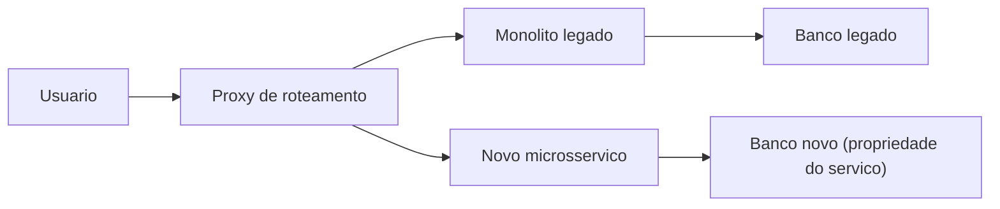
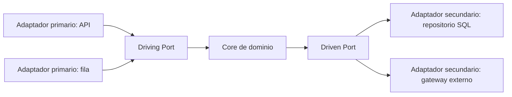
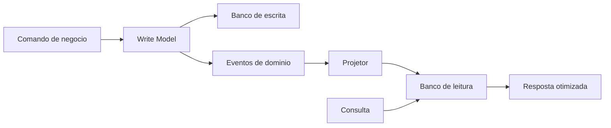
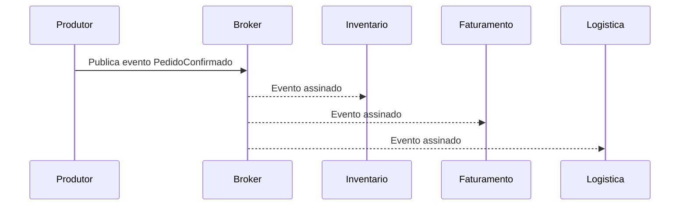
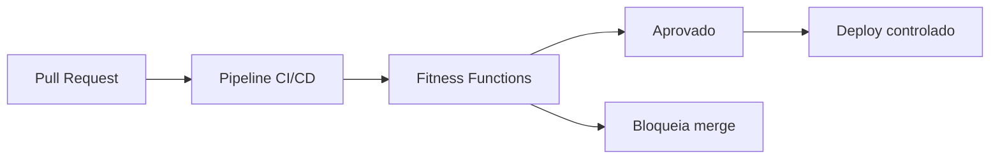

# **Construindo Sistemas Resilientes: O Valor de Negócio por trás das Arquiteturas Orientadas a Eventos e CQRS**

## **O Imperativo da Modernização Estratégica**

No cenário digital contemporâneo, a agilidade da arquitetura de software transcende a mera eficiência técnica para se consolidar como um diferencial competitivo primário e um imperativo de sobrevivência de negócios. Organizações em todos os setores enfrentam uma pressão inexorável para inovar, adaptar-se às demandas voláteis do mercado e entregar experiências de usuário em tempo real. Contudo, essa aceleração colide violentamente com a realidade de infraestruturas legadas. Sistemas construídos há décadas operam como âncoras corporativas: são inflexíveis, perigosamente caros para manter e frequentemente incompatíveis com os requisitos modernos de integração e escala. Para Diretores de Tecnologia (CTOs) e Lideranças Técnicas (Tech Leads), a administração desses sistemas traduz-se em uma luta diária contra gargalos de performance, ciclos de implantação prolongados e uma dívida técnica asfixiante.

A modernização de aplicações legadas deixou de ser vista como um centro de custo puramente operacional para ser entendida como o destravamento de valor estratégico. Sistemas monolíticos, onde a interface do usuário, a lógica de negócios e as camadas de acesso a dados estão intrinsecamente acopladas e executadas em um único processo, apresentam limitações severas quando o dimensionamento (scaling) se faz necessário. O acoplamento rígido dita que, se uma única funcionalidade requer mais poder computacional, a aplicação inteira deve ser replicada, resultando em desperdício crônico de recursos em nuvem. Mais criticamente, a arquitetura monolítica amplifica o "raio de explosão" de falhas: um erro em um módulo de geração de relatórios pode exaurir a memória do servidor, derrubando o sistema de processamento de pagamentos crítico.

A transição para arquiteturas reativas, modulares e evolucionárias — com ênfase particular na Arquitetura Orientada a Eventos (EDA), Segregação de Responsabilidade de Comando e Consulta (CQRS) e Arquitetura Hexagonal (Ports & Adapters) — propõe uma cura sistêmica para essas patologias arquiteturais. Contudo, esta jornada requer uma mudança profunda de paradigma não apenas na escrita de código, mas na forma como as organizações encaram a engenharia de software como um ativo econômico e na maneira como estruturam suas equipes e processos operacionais.

## **A Economia da Modernização: Mensurando a Dívida Técnica e o Retorno sobre Investimento (ROI)**

Para justificar a migração de arquiteturas cristalizadas para modelos distribuídos complexos, a liderança técnica deve articular os benefícios em uma linguagem financeira irrefutável. A dívida técnica não deve ser tratada como um conceito abstrato de engenharia, mas quantificada como um passivo financeiro real nos balanços da organização, acumulando "juros" através da degradação da qualidade do código, falhas de sistema, perda de velocidade de desenvolvimento e desgaste da equipe.

A avaliação do Retorno sobre o Investimento (ROI) em iniciativas de modernização exige uma análise forense do estado atual. Considera-se o cenário comum de uma corporação operando um sistema de planejamento de recursos corporativos (ERP) com duas décadas de idade. Os custos anuais associados a este sistema frequentemente ultrapassam centenas de milhares de dólares, englobando taxas exorbitantes de suporte a fornecedores para manutenção de software obsoleto, custos de oportunidade vinculados a paralisações não planejadas e uma substancial perda de produtividade dos engenheiros que lutam contra uma base de código incompreensível.

Ao quantificar o impacto da modernização, as organizações frequentemente testemunham métricas financeiras transformadoras. Organizações de saúde que implementaram estratégias de modernização alcançaram um ROI de 206% ao longo de três anos, com o período de recuperação do investimento (payback) ocorrendo em menos de seis meses. Esses resultados foram viabilizados por ganhos diretos de 30% na produtividade das equipes de operações de TI. A mitigação de riscos também traduz-se em benefícios financeiros formidáveis: estudos indicam uma redução de 50% na exposição a violações de segurança e diminuição dos custos de conformidade regulatória por meio de processamento automatizado.

### **Métricas de Velocidade e o Horizonte de Avaliação**

O impacto mais significativo da modernização manifesta-se no aumento exponencial da velocidade de desenvolvimento. Organizações frequentemente observam a taxa de entrega de novas funcionalidades dobrar ou triplicar após a consolidação de uma arquitetura baseada em microsserviços bem delimitados. Isso possibilita que a mesma contagem de engenheiros entregue ordens de grandeza a mais em valor comercial, reduzindo drasticamente o *time-to-market*. Se um concorrente é capaz de lançar uma nova capacidade em duas semanas devido à sua arquitetura orientada a eventos, enquanto a sua organização demanda três meses para alterar um monolito frágil, os benefícios da modernização superam amplamente as economias de custo, impactando diretamente o posicionamento de mercado e a receita.

Contudo, a articulação deste ROI demanda rigor metrológico. A principal falha em projetos de transformação é a ausência de linhas de base (baselines) rigorosas capturadas antes do início da modernização. Lideranças devem documentar frequências de implantação, *Lead Time* para alterações, Tempo Médio de Recuperação (MTTR), taxas de defeitos e custos granulares de infraestrutura por no mínimo três meses pré-modernização.

| Fase da Modernização | Dinâmica de Custos | Impacto no ROI (Horizonte 3-5 Anos) |
| :---- | :---- | :---- |
| **Ano: Transição** | Altíssimo. Esforço de reengenharia e custos de infraestrutura em paralelo (Sistemas Legado \+ Novos). | Negativo. Investimento de capital intensivo. |
| **Ano: Otimização** | Médio. Redimensionamento de instâncias e desativação progressiva do legado. | Break-even. Os ganhos de velocidade e resiliência começam a superar os custos de transição. |
| **Anos 3 a: Estado Estacionário** | Baixo. Infraestrutura puramente baseada em uso (*pay-as-you-go*) e alta automação. | Retorno massivo (200% a 304%). Agilidade total. |

A avaliação econômica de decisões infraestruturais e mudanças de plataforma na nuvem não deve basear-se em janelas de 12 meses. Em horizontes curtos, o custo de paralelismo faz qualquer migração parecer inviável. No entanto, ao projetar os custos para o terceiro ao quinto ano, o ponto de virada financeiro torna-se evidente, evidenciando que a modernização é o investimento tecnológico de maior valor absoluto a longo prazo.

## **Estratégias de Decomposição: Desconstruindo o Monolito sem Interrupções**

Decidida a migração e garantido o orçamento através de um caso de negócios orientado por dados, o desafio técnico primordial é executar a substituição sem interromper as operações correntes. A abordagem "Big Bang" — que prescreve reescrever o sistema inteiro a portas fechadas e alternar todo o tráfego em uma janela de manutenção em um fim de semana — é universalmente reconhecida como a estratégia de maior risco e taxa de falha na indústria.

A mitigação deste risco exige a adoção rigorosa de padrões de migração incrementais que tratam a disponibilidade de *zero downtime* (tempo de inatividade zero) como uma restrição não negociável.

**Diagrama: Decomposicao incremental com Strangler Fig**



### **O Padrão Strangler Fig e o Domain-Driven Design (DDD)**

A metodologia definitiva para o estrangulamento seguro de sistemas legados é o Padrão *Strangler Fig* (Figueira Estranguladora). Esta estratégia propõe o desenvolvimento de novos microsserviços na periferia do sistema antigo. Uma camada de roteamento (proxy) intercepta todas as requisições de entrada; se a funcionalidade solicitada já foi migrada, a requisição é direcionada ao novo microsserviço; caso contrário, é encaminhada de volta ao monolito.

A execução deste padrão requer a paralisação de novos desenvolvimentos (congelamento de funcionalidades) no monolito, forçando que qualquer nova capacidade de negócios seja construída na nova arquitetura. Em seguida, a identificação de candidatos à extração é balizada pelos princípios de *Domain-Driven Design* (DDD). O DDD dita que os microsserviços não devem ser particionados por camadas tecnológicas (um serviço para Banco de Dados, um para UI, um para Regras de Negócio), mas sim fatiados verticalmente em torno de "Contextos Delimitados" (Bounded Contexts) que representem capacidades de negócios tangíveis, como "Gestão de Catálogo" ou "Processamento de Pagamentos". O isolamento rigoroso permite que cada contexto defina sua própria ubiquidade de linguagem e possua autonomia sobre seu ciclo de vida.

O imperativo absoluto do DDD na decomposição de microsserviços é a propriedade descentralizada de dados. Um microsserviço deve ter posse exclusiva de seu banco de dados, sendo o único componente com permissão para realizar escritas diretamente em seu esquema. A prática nociva de extrair lógicas de aplicação em dezenas de serviços enquanto todos continuam se conectando a um banco de dados relacional monolítico compartilhado cria o antipadrão do "Monolito Distribuído", que combina os piores atributos de latência de rede com a incapacidade de escalar componentes individualmente de forma isolada.

### **Migração de Dados Críticos e Tráfego de Sombra (Shadow Traffic)**

A dissociação do banco de dados representa o desafio técnico mais formidável do processo. Para migrações críticas que suportam alta transacionalidade, a simples cópia offline não é tolerável. Estratégias sofisticadas de evolução de esquema são necessárias para que o banco de dados possa servir tanto a versão N (legada) quanto a versão N+1 (nova) simultaneamente.

O mecanismo de Migração de Tabela Sombra (Shadow Table) e o espelhamento de tráfego são cruciais. A aplicação de Tráfego de Sombra pode ser conduzida por meio do servidor ou do dispositivo. No paradigma orientado pelo servidor, um serviço de roteamento clona silenciosamente as requisições de produção recebidas, encaminhando uma cópia para a infraestrutura legada e outra cópia idêntica (frequentemente contendo identificadores exclusivos para correlação) para o novo sistema reescrito. O servidor legada atende ao usuário, enquanto as respostas e os efeitos colaterais gerados pelo novo serviço são registrados e validados de forma assíncrona contra os resultados do legado. Este padrão permite validar exaustivamente a nova lógica de domínio em condições exatas de produção sem colocar o usuário final em risco. O corte definitivo (cutover) para o novo serviço ocorre apenas quando a paridade de estado e performance é estatisticamente comprovada e os esquemas estão completamente sincronizados.

O padrão *Leave-and-Layer* demonstra aplicabilidade primorosa neste contexto. A aplicação legada continua funcionando perfeitamente, servindo aos clientes sem interrupção. Uma fina camada de publicação de eventos é anexada a ela (frequentemente usando captura de dados de alteração \- Change Data Capture, ou CDC, no nível do banco de dados), emitindo eventos de mudança de estado para um barramento centralizado (como o AWS EventBridge). As novas lógicas de negócios e serviços modernos subscrevem-se a esse barramento para consumir atualizações, integrando-se assincronamente à base de dados central sem nunca afetar a disponibilidade do sistema de origem.

## **Isolando a Lógica de Domínio: A Supremacia da Arquitetura Hexagonal (Ports & Adapters)**

À medida que novos microsserviços nascem para absorver os domínios extraídos do monolito, o principal vetor de degradação interna e dívida técnica a ser combatido é o acoplamento tecnológico. Tradicionalmente, frameworks de aplicação orientavam o design do código: lógicas de negócios complexas "vazavam" fatalmente para dentro de controladores web HTTP, ou regras de faturamento eram codificadas diretamente nas anotações das entidades do Object-Relational Mapper (ORM). Como consequência dessa arquitetura em camadas ingênua (onde a lógica de negócios depende diretamente da camada de banco de dados), uma alteração no fornecedor de banco de dados ou a atualização de um framework web exigiria a reescrita de regras de negócio fundamentais.

A Arquitetura de Portas e Adaptadores (Ports & Adapters), posteriormente batizada de Arquitetura Hexagonal por Alistair Cockburn, emerge como a resposta estrutural para a imunidade tecnológica. Seu postulado central é subversivamente simples: a aplicação deve ser o artefato central e independente do sistema. Ela deve permitir ser controlada igualmente por usuários web, chamadas de Programas (APIs), testes automatizados extensivos ou scripts de processamento em lote (batch scripts), enquanto permanece completamente isolada e alheia aos seus dispositivos de tempo de execução e tecnologias de banco de dados. O "Hexágono" não reflete uma limitação de seis lados, mas ilustra topologicamente que um software pode possuir múltiplos pontos arbitrários de entrada e saída independentes.

**Diagrama: Arquitetura Hexagonal (Ports & Adapters)**



### **Anatomia da Abstração: Portas, Adaptadores Primários e Secundários**

O princípio central da Arquitetura Hexagonal é a Inversão de Dependência, operando estritamente de fora para dentro: todas as camadas técnicas e de infraestrutura externas devem depender exclusivamente da camada interna de negócio (o núcleo ou *core*), mas o núcleo jamais deve depender de qualquer detalhe externo. Esse encapsulamento formidável é alcançado mediante o estabelecimento de dois conceitos cruciais:

1. **Portas (Ports):** Representam os contratos (frequentemente implementados como interfaces abstratas em linguagens de programação) que definem como a aplicação interage com o universo exterior. A lógica de negócios declara precisamente o que ela precisa receber ou enviar através destas portas, de forma agnóstica em relação ao consumidor. As portas dividem-se em *Driving Ports* (Interfaces que expõem os Casos de Uso que a aplicação oferece) e *Driven Ports* (Interfaces que requerem serviços que a aplicação necessita do mundo exterior, como armazenar um dado).  
2. **Adaptadores (Adapters):** São os componentes concretos que habitam o anel exterior à aplicação, atuando como tradutores entre o idioma sujo dos protocolos de tecnologia específicos e o idioma puro do domínio.  
   * **Adaptadores Primários (Driving / Inbound):** Encontram-se no lado esquerdo do hexágono conceptual, acionando a aplicação. Controladores HTTP RESTful, manipuladores de GraphQL, ouvintes de filas do RabbitMQ ou interfaces CLI são adaptadores primários. Eles recebem o estímulo tecnológico, o desembrulham e invocam a *Driving Port* (o Caso de Uso injetado).  
   * **Adaptadores Secundários (Driven / Outbound):** Encontram-se no lado direito, sendo comandados pela aplicação para executar efeitos colaterais no mundo exterior. Conexões SQL via ORM, clientes para chamadas em APIs de terceiros (como Gateways de Pagamento) ou publicadores de eventos em tópicos do Kafka. O domínio chama a *Driven Port* (por exemplo, IRepositorioDePagamento), e a injeção de dependência fornece, em tempo de execução, o adaptador concreto (por exemplo, AdaptadorDePagamentoStripe) que realiza a operação.

### **O Valor Comercial Incomensurável da Isolação e Testabilidade**

Para os CTOs, a mitigação de riscos associada à adoção desta arquitetura excede os custos iniciais de curva de aprendizado da equipe. O principal retorno tangível ocorre na aceleração maciça da cobertura de testes automatizados de alta fidelidade.

Em arquiteturas convencionais, o teste da lógica de processamento de compras exige a instanciação de um banco de dados real e de toda a árvore do servidor web, tornando os testes de integração lentos (minutos a horas), o que estrangula as práticas de Integração e Implantação Contínua (CI/CD). Com a Arquitetura Hexagonal, a equipe de engenharia pode criar simulações (*mocks* ou *stubs*) perfeitamente isoladas das portas secundárias na memória. Assim, milhares de cenários de negócios complexos, englobando todas as permutações de regras do domínio, podem ser testados em milissegundos, com confiança determinística, sem nunca inicializar um contêiner de banco de dados real.

Ademais, a arquitetura provê proteção suprema contra o *Vendor Lock-In* (aprisionamento tecnológico imposto por fornecedores de nuvem). Se uma decisão de diretoria determina a migração de um serviço de busca baseado no Apache Solr para o Elasticsearch por motivos de licenciamento, o esforço de reengenharia limita-se exclusivamente ao desenvolvimento de um novo AdaptadorSecundarioElasticsearch implementando a porta existente de busca. A vasta camada de casos de uso de negócio que orquestram a busca, processam resultados e aplicam regras de segurança permanecerá absoluta e comprovadamente intocada, reduzindo um projeto de meses a semanas de execução segura.

## **Resolvendo o Gargalo de Leitura e Escrita: A Segregação via CQRS**

Apesar de a Arquitetura Hexagonal blindar o código contra o acoplamento tecnológico, o design transacional inerente aos sistemas de negócios maduros cria gargalos de performance colossais no armazenamento de dados. O padrão ubíquo CRUD (Create, Read, Update, Delete) manipula a mesma representação estrutural da entidade de domínio — o mesmo modelo relacional de banco de dados — independentemente se a ação subjacente for uma atualização minuciosa de saldo ou uma vasta consulta de relatório financeiro agregado.

À medida que o software corporativo escala, evidencia-se que os requisitos transacionais (escritas) competem ferozmente com os requisitos de visualização (leituras). O dimensionamento assimétrico é uma realidade inegável na indústria de software: a esmagadora maioria das aplicações modernas atende a taxas onde o volume de leituras é dezenas ou centenas de vezes superior ao volume de mutações de estado (escritas). Quando submetido a essas cargas simultâneas em um modelo único (Single Data Store), o banco de dados sofre contenção de bloqueios (lock contention), índices conflitantes e degradação catastrófica na capacidade de resposta.

O Padrão CQRS (*Command Query Responsibility Segregation* — Segregação de Responsabilidade de Comando e Consulta) fratura intencionalmente o modelo de dados, declarando que o fluxo arquitetural que altera o estado do sistema e o fluxo que o consulta devem existir em paralelos absolutos e ser otimizados separadamente.

**Diagrama: Fluxo CQRS com projecoes**



Ilustrativo (TypeScript): o mesmo caso de uso separa intenção de mutação (comando) de leitura sem efeitos colaterais.

```typescript
// Comando de escrita — valida invariantes e persiste no write model
type ConfirmarEmbarque = { pedidoId: string; sku: string };

async function handleConfirmarEmbarque(cmd: ConfirmarEmbarque): Promise<void> {
  // regras de domínio + emissão de eventos para projeções
}

// Consulta — apenas leitura do read model (desnormalizado)
type ResumoPedido = { pedidoId: string; status: string; total: number };

async function obterResumoPedido(pedidoId: string): Promise<ResumoPedido> {
  return readStore.buscarPorId(pedidoId); // sem JOINs pesados na hora
}
```

### **A Dicotomia de Modelos: Comandos versus Consultas**

A adoção do CQRS requer uma modelagem rigorosa e intencional do tráfego:

* **Lado do Comando (O Modelo de Escrita):** É estritamente projetado para processar operações que alteram os dados persistidos no sistema. Em vez de atualizações anêmicas baseadas em campos técnicos (ex: UPDATE Status \= 2), os comandos encapsulam a intenção semântica rica do negócio (ex: ConfirmarEmbarqueDoProduto). O modelo de escrita é o guardião inabalável das regras e invariantes do domínio; ele consolida a validação de segurança complexa e é otimizado para a integridade puramente transacional (garantias ACID), tipicamente alocando dados altamente normalizados na Terceira Forma Normal (3NF) para erradicar anomalias de atualização.  
* **Lado da Consulta (O Modelo de Leitura):** Por oposição, não realiza qualquer alteração de estado. Seu objetivo único é recuperar informações em altíssima velocidade e formatá-las apropriadamente para a interface do usuário sem conter fragmentos indesejados da lógica de domínio. Otimizações de banco de dados para o modelo de leitura preferem esquemas severamente desnormalizados, frequentemente "achatando" entidades complexas para evitar agregações ou operações de junção (*JOINs*) onerosas durante a execução da consulta.

### **Projeções Materializadas e Desempenho Implacável**

O benefício terminal em escalabilidade oferecido pelo padrão CQRS é extraído quando os modelos não são apenas logicamente separados em código, mas fisicamente separados em bancos de dados distintos. O modelo de escrita pode residir em um cluster de banco de dados relacional parrudo (como PostgreSQL) adequado ao cumprimento estrito da atomicidade, enquanto o modelo de leitura pode ser uma base de documentos hiper-escalável (como MongoDB) ou um índice otimizado para pesquisa de texto (como Elasticsearch).

Essa separação física viabiliza o uso da **Materialização de Projeções** (Projection Materialization) para extinguir latências em consultas complexas. Em um sistema monolítico sem CQRS, a exigência de construir o "Dashboard Consolidado do Cliente" demanda requisições complexas que unem (*JOIN*) dezenas de tabelas relativas a pedidos históricos, status de faturamento, chamados de suporte e devoluções sempre que a página carrega, consumindo tempo de I/O de disco maciço a cada visita e impactando usuários que tentam realizar compras.

Com CQRS e projeções, o cálculo laborioso não é efetuado "sob demanda". À medida que atualizações ou compras individuais (eventos) ocorrem em background, rotinas escutam essas alterações e transformam iterativamente o evento em um fragmento já processado do dashboard. Esses documentos pré-calculados (materializados) são atualizados silenciosamente no modelo de leitura. Quando o usuário efetivamente acessa o dashboard, o modelo de leitura realiza uma busca simples e de custo computacional pífio por uma chave primária, obtendo instantaneamente o resultado consolidado e retornando em tempos de resposta de microssegundos. O modelo de gravação foca puramente no rendimento das transações (throughput de escritas) e o modelo de leitura não onera a escrita em circunstância alguma.

| Característica | Padrão Monolítico (CRUD Clássico) | Padrão Segregado (CQRS com Projeções Físicas) |
| :---- | :---- | :---- |
| **Arquitetura de Banco de Dados** | Esquema Único, altamente acoplado. | Bancos diferentes; esquemas adequados ao propósito. |
| **Acesso a Dados em Leitura** | Execução de *JOINs* complexos on-the-fly. | Recuperação simples de documentos pré-calculados e desnormalizados. |
| **Dimencionamento de Infraestrutura** | Escalonamento vertical oneroso obrigatório; impossibilidade de distinguir gargalos. | Escalonamento assimétrico (Escalabilidade horizontal infinita apenas da malha de servidores de leitura). |
| **Complexidade de Código** | Lógicas de apresentação vazam para regras de atualização via ORMs gigantes. | Separação brutal; comandos puros baseados na intenção do negócio vs. recuperações simplificadas. |

### **Trade-offs de Consistência Eventual**

O CTO e os Tech Leads que optam por essa arquitetura sofisticada devem imperativamente compreender e gerir o seu trade-off fundacional: a **Consistência Eventual**. A dissociação dos fluxos implica que a atualização feita com sucesso no modelo de gravação não é propagada instantaneamente para a camada de visualização em todos os casos.

A replicação dos dados de comando para os dados desnormalizados de consulta impõe latências que podem variar de milissegundos a segundos. Consequentemente, a interface do usuário poderia registrar a modificação transacional mas exibir o registro defasado na leitura subsequente imediata. Este "consumer lag" transitório exige que o desenvolvimento da interface humana (Frontend) empregue artifícios para tolerância, seja disfarçando a requisição com respostas otimistas visuais, informando que os dados estão em processamento ou forçando recargas por curtos intervalos (polling adaptativo). Instituições financeiras altamente rigorosas superam esta barreira de latência construindo mecanismos compensatórios na arquitetura EDA paralela para garantir sincronização final exata em milissegundos críticos. Não existe sincronização instantânea em sistemas fisicamente distribuídos e o CQRS abraça a assincronicidade inerente ao invés de suprimi-la por meio de caríssimos esquemas de lock distribuído em duas fases (2-Phase Commits).

## **O Sistema Nervoso Corporativo: Arquitetura Orientada a Eventos (EDA)**

A eficácia insuperável do modelo CQRS em escala depende intrinsecamente de como a sincronização entre o lado da Escrita e o Lado da Leitura ocorre. A tecnologia vital que possibilita a transição perfeita de mudanças de estado entre esses domínios independentes, sem criar gargalos de dependência síncrona, é a Arquitetura Orientada a Eventos (Event-Driven Architecture – EDA).

Em sistemas não voltados a eventos, quando o Serviço de Pedidos processa o checkout do e-commerce, ele aciona comandos síncronos HTTP diretos para o Serviço de Inventário (para diminuir o estoque), o Serviço de Faturamento (para gerar a cobrança) e o Serviço de Logística (para despachar o produto). Esta cadeia profunda (RPC calls) amarra fatalmente as aplicações. Se o módulo de Notificações por E-mail estiver inativo, a transação de compra inteira corre risco de falha ou retarda toda a jornada do consumidor final.

O advento da EDA instaura um paradigma radicalmente desconectado e assíncrono. A aplicação que gerou a mudança vital ("O Produtor") não conhece ou se importa com a existência daqueles que precisam agir ("Os Consumidores"). A lógica baseia-se em produzir, anunciar as reações à ocorrência em tempo real e liberar imediatamente os recursos.

**Diagrama: Cadeia produtor broker consumidores**



Nesse contexto, os microsserviços utilizam um intermediário robusto (Message Broker ou Backbone de Stream) – frequentemente orquestrado através do ecossistema de infraestrutura de alto desempenho do Apache Kafka, soluções nativas gerenciadas como AWS EventBridge ou redes robustas de mensagens via Apache Pulsar. O Produtor deposita silenciosamente o fato ("O Evento") no broker, como TransacaoRealizada. Os consumidores subscrevem os canais e tomam ação isoladamente e em seus próprios tempos de processamento.

### **As Categorias de Propagação: Da Notificação ao Event Sourcing**

A complexidade e a finalidade arquitetural orientam três sub-padrões vitais dentro da malha de eventos:

1. **Notificação de Eventos (Event Notification):** O sinal mais rudimentar. O microsserviço de Gestão de Usuários transmite um evento parcimonioso como UsuarioDeletado(ID=990). O sinal serve unicamente para advertir os ouvintes; caso necessitem de informações profundas para auditorias contextuais, precisarão despachar novas solicitações independentes. Embora simples e de baixo consumo de largura de banda, essa mecânica carrega o custo de forçar os serviços assíncronos a recaírem em invocações síncronas de resgate na fonte original, incorrendo em latências agregadas indesejadas.  
2. **Transferência de Estado Dirigida a Eventos (Event-Carried State Transfer \- ECST):** Este modelo aprimora formidavelmente a independência. O evento flui encapsulando não apenas a ocorrência do fato, mas também carregando integralmente todos os atributos imutáveis que descrevem a nova realidade. O evento PedidoConfirmado traciona atrelado a ele não só a Chave ID, mas os detalhes de todos os itens do carrinho, total faturado, método de pagamento e endereço final do consumidor. Sistemas de CRM, plataformas de entrega ou faturamento consomem essas estruturas hiper-densas e populam imediatamente seus bancos de dados locais privados. O tráfego redundante de retorno ao núcleo (buscas subsequentes por mais informações do domínio originário) é mitigado quase completamente, infundindo resiliência total nos consumidores, que continuam funcionando com base em suas cópias ativas caso o monolito de origem sofra apagões.

Exemplo mínimo de *payload* em ECST (no broker, o contrato costuma ser versionado com Avro ou JSON Schema):

```json
{
  "type": "PedidoConfirmado",
  "version": 1,
  "pedidoId": "ped-8831",
  "itens": [{ "sku": "SKU-1", "qtd": 2, "precoUnitario": 49.9 }],
  "total": 99.8,
  "metodoPagamento": "pix",
  "enderecoEntrega": { "cep": "01310-100", "cidade": "São Paulo" }
}
```

3. **Event Sourcing (Armazenamento de Estado por Eventos):** Esta técnica redefine as fundações tecnológicas da camada de banco de dados. O estado final não é gravado, mas sim as transições individuais; cada entidade passa a ser representada exclusivamente por uma sequência crônica e imutável de deltas de mudanças ao longo da vida, salvos em arquivos indexados orientados ao armazenamento apensável (*append-only logs*). Quando um software precisa reconstituir a quantia disponível na conta de um correntista, ele calcula isso de forma determinística aplicando – evento por evento, através de reprodução contínua e imutável (Replaying) – cada histórico individual de SaqueEfetivado e DepositoEfetivado registrados contra aquela identificação de agregação bancária desde a abertura primária até o momento requerido no tempo.  
   Adotar Event Sourcing combinado a CQRS permite a recuperação atemporal em desastres, garantindo trilhas de auditorias impenetráveis por natureza na indústria financeira. Uma base imensa de bancos dependem das ferramentas dedicadas como o EventStoreDB ou infraestruturas logarítmicas do Kafka para fornecer esta perenidade contra adulterações indesejadas. Essa força destrutiva de replicação determinística vem acompanhada do custo avassalador em complexidade arquitetônica (curva de aprendizagem extrema, uso massivo e perpétuo de armazenamento e necessidade de rotinas periódicas de 'Snapshotting' que evitam que se recalcule históricos com milhões de registros).

### **Mitigando Falhas Sistêmicas com Resiliência Inerente e Elasticidade**

Para entender as ramificações comerciais e a defesa incontestável por CTOs sobre a malha de Eventos (EDA), o benefício vital foca-se no isolamento de tempestades de gargalos no ambiente de Nuvem. Ao desacoplar dependências severas durante os pulsos atípicos de hiper-tráfego em momentos vitais corporativos como Black Fridays, o volume imenso do excesso inesperado da demanda — os carrinhos transbordando num curto prazo — flui para serem amortecidos no repositório dos Event Brokers ou sistemas de filas tolerantes ao preenchimento de disco sem quebra abrupta.

A Shopify documenta o tráfego estonteante administrado pelas espinhas dorsais de tópicos Kafka processando cerca de 66 milhões de mensagens agregadas operando por milissegundo de estabilidade elástica extrema, permitindo reações modulares contínuas. Diferente do padrão tradicional atrelado que força o acréscimo desesperado vertical global de força de processamento computacional da AWS (fatorando a conta ao extremo e não reagindo à demanda ágil), a estrutura focada na Assincronicidade Orientada ao Evento deflete os picos brutais para repousarem na malha segura do Broker de espera contínua.

Mesmo com sistemas periféricos e dependências de pagamento indisponíveis devido à latência, nenhum registro ou fluxo original primário de jornada é corrompido, e cada elemento será reativado para buscar ativamente a continuação no momento da restauração automática, poupando quedas crônicas em cascatas ou telas contendo erros (Timeouts Fatais) ao cliente em finalização da compra transacional.

### **O Lado Obscuro Operacional e Desafios de Governança na EDA**

Contudo, nenhum paradigma vem desprovido de fardos ocultos a serem mitigados por lideranças técnicas seniores. Sistemas estritamente orientados a eventos, enquanto promovem a libertação de dependências em nível de infraestrutura, impõem armadilhas conceituais profundas:

* **Lag dos Consumidores e Observabilidade Limitada:** Caso o aplicativo emita os eventos excessivamente acima do limite que as partições downstream são capazes de sugar (Throughput), a latência do esvaziamento da fila de retenção empilhará (Consumer Lag backlog), estrangulando na prática e invalidando a natureza tempo-real propagada. Lidar com orquestrações independentes dificulta drasticamente rastrear falhas espalhadas: onde exato um erro assíncrono morou numa cadeia longa entre dezenas de microsserviços? É mandatório incutir na transição pesada dos sistemas metodologias absolutas e custosas de rastreamento com identificadores estritos repassados desde a emissão na camada frontal cruzando por DataDog, CloudWatch e New Relic (Distributed Tracing Instrumentation) atrelados à observação minuciosa do comportamento das partições e da sanidade operacional temporal de todos os brokers.  
* **Ameaça Sistêmica da Duplicação de Entregas (Semântica Exactly-Once x At-Least-Once):** Falhas em conexões rotineiras farão o ecossistema disparar invariavelmente retransmissões automáticas do mesmo sinal de fato preenchido para o assinante que o perdeu no vazio ("Semântica At-least-Once"). Executar múltiplas vezes mensagens desapercebidas por engenharia medíocre pode causar catástrofes irretratáveis empresariais, como processar reembolsos duplos indesejados à base. É de preceito obrigatório codificar os sistemas com lógica universal *Idempotente* em suas camadas para proteger que reprocessamentos causais sucessivos contínuos do próprio fato singular jamais manifestem as corrupções sistêmicas adjacentes sobre estados do destino posterior ao evento originário inicial.

Defesa típica contra reentregas (*at-least-once*): registrar o identificador do evento antes de aplicar efeitos colaterais irreversíveis.

```typescript
async function processarReembolso(
  eventoId: string,
  payload: ReembolsoPayload
): Promise<void> {
  if (await jaProcessado(eventoId)) return;
  await aplicarCredito(payload);
  await marcarProcessado(eventoId);
}
```

* **Governança Rígida e Rupturas de Esquemas (Schema Breaking):** Semelhante às atualizações diretas restritivas (APIs quebra-dependência), modificar imprudentemente as nomenclaturas ou exclusão de atributos obrigatórios nos tópicos imutáveis de barramentos destrói irreversivelmente sub-ecossistemas silenciosamente amarrados ao recebimento do layout antigo e específico de campos. Governança rígida arquitetada via controle forçado automatizado em repositórios isolados (Schema Registry Validation) impõe contratos rígidos que asseguram atualizações controladas, documentadas globalmente sob formatos padronizados na infraestrutura, validando se são versões que guardam aderência à transição retroativa universal (Backward Compatibility Policy).

## **Garantindo a Fidelidade: Arquitetura Evolucionária e Fitness Functions**

A concepção da estrutura descentralizada assíncrona orientada por domínios baseados em portas rigorosamente delineadas em Arquiteturas Hexagonais dita a excelência no nascimento do ecossistema. Todavia, os ecossistemas envelhecem amargamente e arquiteturas erguidas degradam em acoplamentos caóticos com a contínua movimentação na rotação intensa da força técnica, somados às pressões de mercado pelo lançamento frenético imediato para o lançamento de novas capacidades de inovação na agilidade estipulada.

Preservar a disciplina exigirá, incontestavelmente, adotar mecanismos estruturados que garantam as avaliações sem atrito contínuo manual por seres falhos humanos. A metodologia base desta mitigação automática responde por meio das diretrizes batizadas formalmente pela indústria de **Arquitetura Evolucionária (Evolutionary Architecture)**, focada integralmente em construir sistemas que possuam tolerância natural que apóia e norteia as contínuas mudanças evolutivas controladas simultaneamente nas múltiplas matrizes essenciais não-funcionais (escalabilidade, segurança e confiabilidade).

Para ancorar solidamente essa maleabilidade sistêmica com salvaguarda sem entraves e estagnações na governança e processos, CTOs adotam a engenharia de **Funções de Adequação Arquitetural (Architectural Fitness Functions)**, espelhando fortemente o sucesso de práticas do desenvolvimento baseados unicamente em testes (Test-Driven Development \- TDD). Assim como a equipe escreve blocos mínimos e limitados que validam a lógica e saídas antes das construções integrais do software, as *Fitness Functions* compreendem regras estritas codificadas, em que a sua invocação contínua confere integridade tangível imediata às regras de fronteira estrutural exigidas, verificando alinhamentos restritivos essenciais à padronização, bloqueando desvios.

**Diagrama: Pipeline de governanca arquitetural**



### **ArchUnit e a Fiscalização Efetiva da Fronteira Hexagonal**

Sistemas focados puramente nos limites do DDD via Hexágono necessitam do isolamento blindado em suas bordas, e a dependência cíclica que vaza de fora a dentro destruirá silenciosamente o princípio cardeal. Em uma base corporativa e ampla adotada por ecossistemas robustos de mercado desenvolvidos em Java e TypeScript, o cerceamento da contaminação arquitetural manifesta-se no bloqueio ostensivo da integração automatizada acoplando validação explícita de bibliotecas avaliatórias potentes que analisam sintaxes estruturais, dependências cíclicas entre repositórios profundos e lógicas internas em tempo de compilação sem intervenção externa ou opiniões do time: a adoção vital do ferramental **ArchUnit**.

Exemplo de *fitness function* em Java (regra que falha o build se o pacote de domínio passar a depender de Spring ou JPA):

```java
import com.tngtech.archunit.junit.AnalyzeClasses;
import com.tngtech.archunit.junit.ArchTest;
import com.tngtech.archunit.lang.ArchRule;

import static com.tngtech.archunit.lang.syntax.ArchRuleDefinition.noClasses;

@AnalyzeClasses(packages = "com.empresa")
class FronteiraHexagonalTest {

  @ArchTest
  static final ArchRule dominio_isolado =
      noClasses()
          .that().resideInAPackage("..domain..")
          .should().dependOnClassesThat()
          .resideInAnyPackage("org.springframework..", "jakarta.persistence..");
}
```

Por meio destas suítes implacáveis inseridas nos pipelines centrais da cadeia nativa de implantação constante CI/CD da organização, lideranças e engenheiros seniores estabelecem testes definitivos programáticos expressando que jamais classes presentes unicamente em pastas de pacote denominadas estruturalmente por "Domain" possam referenciar internamente lógicas nativas, chamadas web abstratas diretas restritivas provindas da plataforma corporativa Spring Framework corporativa base. Ao menor import sutil da dependência indevida arquitetando acoplamento do motor de banco ou conexões web dentro da região de domínio limpo em revisões isoladas imaturas de PRs (Pull Requests), o código viola ativamente o princípio arquitetural subjacente, fazendo as suítes das *Fitness Functions* de ArchUnit reprovarem imediato globalmente e bloquearem implacavelmente qualquer submissão aos repositórios primários da nuvem para aprovação sem chance de mesclagem indesejada ao código central corporativo protegido. Adicionam-se travas métricas automatizadas impondo rejeição às amarrações circulares cruzadas que devastam a evolução das funcionalidades nos sistemas ou estancando classes que engrossem excessivamente suas funções a despeito de complexidades cognitivas severamente desbalanceadas predefinidas internamente em limiares (Cyclomatic Complexity metrics).

### **Evoluindo a Governança Transversal**

Em adição incondicional a limites expressos das fundações no código via ferramentas estáticas para acoplamento, implementam-se ativamente também monitorações contínuas abrangentes por sistemas voltadas puramente às manifestações observáveis vivas de comportamentos dinâmicos das malhas (Dynamic/Runtime Fitness Functions). Configuram-se disparos rígidos nas malhas observacionais na malha AWS atreladas ao Datadog para interceder ativamente sempre que reações encadeadas lentas dos eventos entre micro aplicações cruzem o balizador de tempo de resposta esperado ou excedam o atraso admissível estipulado nos brokers do event-loop limitados da empresa, anulando, dessa forma, perdas gradativas perigosas e crônicas causadas nas reengenharias e deploys progressivos que falhariam em respeitar a adequação a curto ou médio prato nas arquiteturas ativas (Regression Performance Alerts). Até balizadores ecológicos intrincados monitoram sistematicamente os gargalos na Nuvem sob exigências rigorosas que avaliam pegadas de rastros de emissão do Carbono operacionais no processamento dinâmico em Data Centers, através do aferidor *ecoCode* integrados de Sustentabilidade em Requisitos Não Funcionais da organização (NFRs).

## **Frameworks Executivos de Decisão e Estruturação de Governança (Liderança CTO)**

Todo pilar denso focado nos fundamentos e nas engenharias das transições abordado nesta exploração técnica requer unificação à camada holística gerencial pragmática, em prol de extrair o ganho e evitar armadilhas contraintuitivas que ameaçam as adoções nas companhias estruturadas na realidade e recursos limitados. A avaliação técnica cruza invariavelmente o mundo da complexidade econômica, e a liderança executiva técnica (CTOs e Tech Leads seniores) molda obrigatoriamente mecanismos para classificar metodicamente prioridades mitigando impactos arriscados, avaliando caminhos e formalizando documentações e compromissos que suprimirão entraves políticos imprevistos ou reversões caras operacionais na organização (Veto Culture Governance Strategy).

O embasamento da conversão destas diretrizes cruza por metodologias e marcos consolidados adotados nos sistemas globais mais perigosos operados no setor, e baseia a taxonomia em:

1. **A Filosofia de Portas de Retorno Simples e Múltiplas (One-way vs. Two-way Doors):**  
   Esta matriz concebida pelas lógicas diretivas operacionais fundamentadas dentro das práticas nativas eficientes da Amazon prega classificar todas as implementações sistêmicas que exijam definições na transição técnica separando categoricamente seus retornos:  
   * **Decisões Unidirecionais Categóricas (One-way doors):** Escolhas de profundo peso, custo elevadíssimo, perigosas e que atam permanentemente a base organizacional a laços intrínsecos severamente enraizados sem possibilidade amigável de recuo seguro. Investir maciçamente e alterar a base primária inteira forçando a transição do ecossistema a focar unicamente o processamento restritivo via log de trilhas no Event Sourcing nativo, desprendendo bases SQL puras universais, requer tempo absoluto imenso investido, migrações intensas, alteração cognitiva radical corporativa completa da equipe ou seleção de infraestrutura fundacional de Cloud. Reversões forçam abandono bilionário ou meses reescritos exaustivamente sob pressões desastrosas e punições regulatórias (Risk Buffers Severos). Demandam análise aprofundada global rigorosíssima.  
   * **Decisões Bidirecionais Flexíveis (Two-way doors):** São deliberações transitórias de arquitetura e tecnologia de atrito raso nas esferas de desenvolvimento, capazes e orientadas de serem desativadas, experimentadas, revogadas, ou substituídas localmente de forma extremamente limpa, simples, de custo ignorável e risco inofensivo à camada crítica vital de lógicas em negócios resguardados. Versões internas efêmeras em bibliotecas contidas puramente nas portas primárias locais ou adoções menores em sistemas acessórios são o exemplo de decisões ágeis bidirecionais livres de lentidão de burocracia de conselhos executivos da base para impulsionar a agilidade imediata irrestrita contínua a inovações.  
2. **Cimentação Operacional Pós-Decisões (Arquiteturas Registradas em ADRs):** Compreendida as vertentes avaliatórias das One-way doors que ditam rumos das evoluções estruturais ou fatiamentos críticos aos módulos vitais nas modernizações de legado via CQRS, a mitigação real do CTO baseia-se contra atritos gerados pela rotatividade volátil crônica das próprias equipes futuras questionando o legado do projeto e interrompendo ritmos constantes da obra sistêmica em litígios fúteis (Relitigating Choices). O artefato primário exigido nas organizações de engenharia eficaz e seniores é a criação sumária e sistemática em registros rastreáveis contidos estritamente no próprio controle da base atrelados ao código fonte e imutável das justificativas contextuais que basearam o desenho técnico em vigor na ocasião, conhecidos no meio de desenvolvimento por *Architecture Decision Records (ADRs)*. Em documentos markdown ágeis dispostos universalmente sob sete seções limpas, delimitam de forma cirúrgica e unânime: A motivação essencial (O Contexto Base na escolha pelo CQRS para desanuviar a contenção perigosa dos locks nos módulos do monolito saturado de consultas do BI atreladas a picos de vendas na interface primária), A Estratégia Acatada (Isolamento em Cluster Físicos Mongo/PostgreSQL), As Consequências e Fardos Absurdos Acordados do Projeto (Adoção das complexidades de gerenciar consistências eventuais problemáticas para suprir aos diretores da base de clientes), e os Modelos de Soluções Competidores Rejeitados formalmente nos laudos e o Por quê fundamentado desta abdicação temporal.  
3. **Democracia Vacinada ao Desastre (O Conselho de Governança EA / ARB e Matriz RACI):** Com a governança, as Lideranças e diretores da arquitetura consolidada limitam entraves perigosos estruturais nas matrizes em paralisações excessivas, utilizando a segregação universal na delegação e responsabilidade transparente delimitando estritamente os donos da implementação global entre partes via uso clássico da alocação na Matriz Executiva "RACI" em arquiteturas de decisões amplas orientadas a portas de risco (Responsável isolado e final prestador de contas "Accountable"; Desenvolvedores "Responsible"; Redução a micro quadros de consultores para conselhos de base "Consulted" que bloqueiem análises de paralisia fatal de vetos espalhados sem necessidade gerencial nas One-way doors; E vasta notificação informativa da camada aos observadores passivos "Informed" do quadro nas alterações amplas da base organizacional). Em conjunção e direcionamentos estratégicos de porte absoluto que impulsionem modernizações vitais às grandes plataformas da base que exigirão integrações colossais com esferas não técnicas cruzadas de companhias regulamentadas (Bancos e Health Care complexos multicanais em modernizações pesadas transacionais), fundar o painel executivo e diversificado do Conselho Executivo de Análises a Padrões de Evolução de Diretrizes (Architecture Review Board \- ARB), assegurando na essência que todas transições de legado profundas submetam-se à verificação estruturada em fóruns diretos executivos da organização alinhando sistematicamente com o objetivo vital da empresa a fim de proteger o retorno do valor contínuo e blindar as arquiteturas, mas cientes de ceder ativamente lugar livre da engessante hiper-governança com adoções pragmáticas puras via Fitness Functions contínuas e invisíveis codificadas às equipes e times.

Para líderes moldando resiliência perpétua da organização contemporânea com base escalonável ilimitada através dos princípios sinérgicos modulares de Ports & Adapters, a complexidade técnica extrema suportada nos padrões analíticos do CQRS espelhados nos pulsos vitais de sistemas reativos das malhas assíncronas do EDA não formam metodologias avulsas para mitigar limitações de escalabilidade simples; formam o arsenal coeso tático mandatório a fim de converter de forma definitiva todas limitações e passivos operacionais cristalizados nas heranças da ineficiência nas bases legadas obsoletas no capital intelectual competitivo, autônomo, modular, reativo e imortal aos desafios implacáveis escalares e perenes em mercados globais dinâmicos.

---

## Quer avaliar esse cenário no seu contexto?

Se você quer transformar essas diretrizes em um plano técnico executável, fale com a Web-Engenharia. Fazemos uma avaliação técnica do seu ambiente e desenhamos uma consultoria especializada com prioridades, riscos e roadmap de implementação.)

