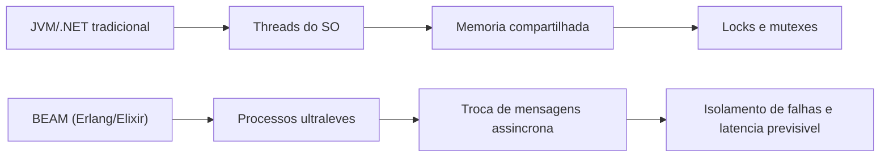
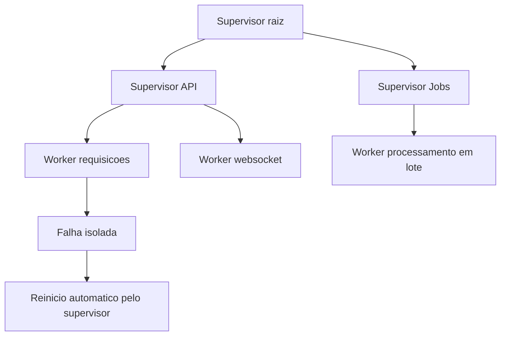
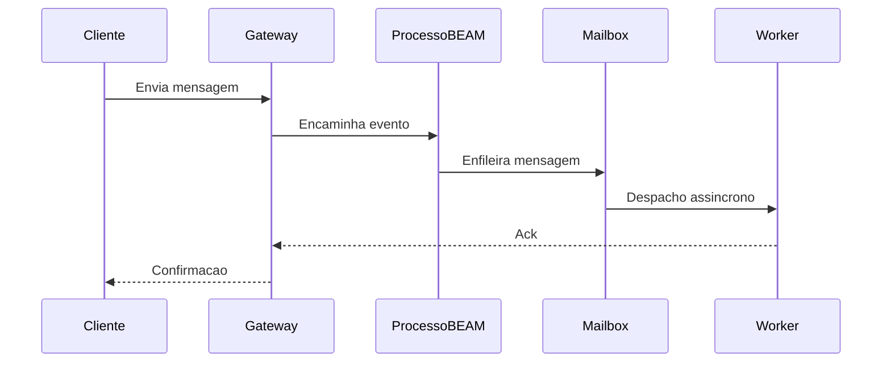
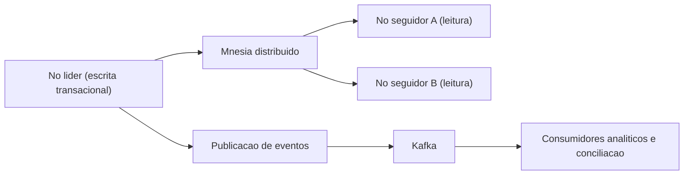
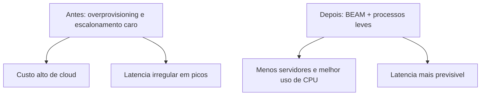

# **Sistemas que não caem: Por que o ecossistema Erlang/OTP e Elixir são a escolha para aplicações críticas**

A infraestrutura de software contemporânea enfrenta uma crise crônica de complexidade e ineficiência. À medida que o tráfego de usuários atinge escalas sem precedentes e a tolerância corporativa à latência se aproxima do zero absoluto, as organizações frequentemente recorrem a soluções arquitetônicas reativas que tratam apenas os sintomas de sistemas sobrecarregados, ignorando as deficiências fundamentais de suas pilhas tecnológicas. A proliferação desordenada de microsserviços ultra-granulares, malhas de serviço intricadas (*service meshes*), disjuntores de falha (*circuit breakers*) e complexos orquestradores de contêineres é, em grande parte, uma resposta paliativa às limitações estruturais dos modelos de concorrência e do gerenciamento de estado presentes nas linguagens de programação dominantes na indústria. Quando a infraestrutura subjacente não é concebida desde o seu núcleo intelectual para o isolamento nativo de falhas e para a concorrência massiva, a engenharia de confiabilidade torna-se um exercício perpétuo e exaustivo de mitigação de danos estruturais.

Neste cenário corporativo caracterizado por problemas de instabilidade e custos de nuvem exorbitantes, o ecossistema Erlang/OTP (Open Telecom Platform) e sua contraparte moderna, a linguagem Elixir, emergem não como ferramentas experimentais incertas, mas como um paradigma maduro, exaustivamente testado em batalha ao longo de décadas. Originalmente concebido para comutadores de telecomunicações que matematicamente não podiam falhar, este ecossistema provou ser o "nicho de ouro" indiscutível para plataformas de gestão de viagens interconectadas, sistemas financeiros de liquidação crítica e mensageria em tempo real em escala global. A análise técnica e arquitetural a seguir disseca meticulosamente os bastidores operacionais de aplicações que exigem alta concorrência e escala massiva, demonstrando, com base em telemetria real e estudos de caso de engenharia profunda, por que a tolerância a falhas nativa da Máquina Virtual BEAM oferece uma vantagem competitiva inigualável para empresas que precisam escalar suas operações de forma sustentável e imperturbável.

## **A Anatomia da Resiliência: O Paradigma da Máquina Virtual BEAM**

A superioridade técnica do ecossistema Erlang e Elixir não reside primariamente em sua sintaxe funcional ou na vasta gama de suas bibliotecas padrão, mas na arquitetura fundamental e visionária de sua máquina virtual subjacente, a BEAM (Bogdan/Björn's Erlang Abstract Machine). Diferente das linguagens e ecossistemas tradicionais, que dependem fortemente do mapeamento direto para *threads* do sistema operacional nativo e do compartilhamento contínuo do espaço de memória, a BEAM implementa o Modelo de Atores (*Actor Model*) de forma rigorosamente purista e matematicamente isolada.

**Diagrama: Comparativo de concorrencia entre arquiteturas**

Em ecossistemas industriais padrão como a Máquina Virtual Java (JVM) ou implementações baseadas em C\#, a instanciação de uma *thread* operacional possui um custo computacional extremamente significativo, consumindo frequentemente megabytes de memória RAM apenas para a alocação de sua pilha de execução básica, além de impor pesadas trocas de contexto (*context switching*) ao processador. Em contraste absoluto, na BEAM, a unidade primária e básica de concorrência é o "processo" Erlang, uma abstração que não possui relação direta com os processos pesados do sistema operacional. Estes processos internos são estruturas de dados extraordinariamente leves, consumindo tipicamente apenas algumas centenas de bytes em sua inicialização. Essa eficiência volumétrica extrema permite que um único nó de servidor físico execute milhões de processos concorrentes simultaneamente, sem esgotar os recursos de memória da máquina ou estrangular a unidade central de processamento (CPU) com trocas de contexto.

Ainda mais criticamente para a integridade dos dados, estes processos leves operam sob um regime de ausência total de estado compartilhado (*share-nothing architecture*). O fluxo de comunicação e transferência de dados entre eles ocorre de maneira exclusiva através de um mecanismo de troca de mensagens puramente assíncronas, onde caixas de correio (*mailboxes*) individuais recebem os dados copiados. A total eliminação do estado compartilhado extirpa, pela raiz, categorias inteiras de anomalias clássicas da ciência da computação concorrente, tais como *deadlocks* sistêmicos e *race conditions* (condições de corrida) imprevisíveis. Consequentemente, torna-se obsoleta a necessidade de invocar mecanismos complexos de sincronização mecânica, como *locks*, *mutexes* e semáforos, artefatos que tradicionalmente penalizam o desempenho em sistemas de alta carga e frequentemente levam a gargalos de contenção difíceis de depurar.

| Característica Arquitetural | Ecossistemas Tradicionais (Ex: JVM,.NET) | Máquina Virtual BEAM (Erlang/Elixir) |
| :---- | :---- | :---- |
| **Modelo de Concorrência** | *Threads* do SO, mapeamento:1 ou M:N complexo | Processos ultraleves em nível de VM (Actor Model) |
| **Capacidade de Escala Local** | Dezenas de milhares de *threads* (limite prático) | Milhões de processos simultâneos por nó |
| **Gerenciamento de Estado** | Memória global compartilhada controlada por *Locks* | Arquitetura *Share-Nothing*, passagem de mensagens |
| **Tolerância a Falhas Nativa** | Propagação hierárquica de exceções, *Try/Catch* | Árvores de supervisão granulares, isolamento celular |

### **Escalonamento Preemptivo e Baixa Latência Preditiva**

Uma falha arquitetural comum em linguagens modernas focadas em concorrência cooperativa é a suscetibilidade ao bloqueio do *loop* de eventos por rotinas computacionalmente intensivas, o que monopoliza núcleos de processamento e eleva a latência imprevisivelmente. A máquina virtual BEAM resolve este dilema matemático através da implementação de um escalonamento estritamente preemptivo no nível da aplicação. O mecanismo interno (*scheduler*) da BEAM atribui a cada processo individual uma cota de execução finita medida em uma unidade métrica chamada "reduções" (*reductions*), que corresponde, de maneira simplificada, a chamadas de função ou limites operacionais.

Quando um processo em execução esgota sua cota de reduções alocada, o escalonador da BEAM o suspende de forma forçada, preserva seu estado exato e imediatamente cede os ciclos da CPU para o próximo processo aguardando na fila de execução. Este design meticuloso garante absolutamente que operações excessivamente longas não causem o efeito de "fome" (*starvation*) em outras partes vitais do sistema. O resultado direto dessa preempção agressiva é uma latência de cauda (*tail latency*) altamente previsível e achatada, uma característica inegociável para plataformas que precisam honrar o conceito de tempo real "suave" (*soft real-time*), como redes globais de telefonia e infraestruturas de submissão de ordens no mercado financeiro, onde atrasos na resposta degradam severamente a qualidade do serviço ou causam perdas financeiras milionárias.

### **O Custo Global da Coleta de Lixo e a Solução Por Processo da BEAM**

Um dos maiores gargalos ocultos para sistemas corporativos que processam milhões de requisições simultâneas é o custo imposto pela Coleta de Lixo (*Garbage Collection* \- GC). Modelos tradicionais de alta performance, como o coletor G1 (Garbage-First) da JVM, operam com heurísticas sofisticadas, particionando a memória do *heap* global em regiões lógicas (como *Eden*, *Survivor* e *Old*) para tentar minimizar o tempo inativo. Contudo, por mais refinadas que sejam essas abordagens geracionais, ou até mesmo implementações modernas como o Shenandoah ou o ZGC, a dependência de um *heap* compartilhado universal invariavelmente impõe períodos de *Stop-The-World* (STW), paralisando temporariamente todas as *threads* de aplicação para compactar ou varrer a memória com segurança. Em escalas de milhões de eventos por segundo, essas pausas microscópicas acumulam-se, degradando severamente os Acordos de Nível de Serviço (SLAs) e causando latências erráticas inaceitáveis. Sistemas baseados em linguagens nativas como Golang, embora otimizados para concorrência via *goroutines*, também sofrem de pausas GC universais que impactam latências rígidas, um fator que frequentemente motiva migrações arquiteturais complexas em hiperescala.

A BEAM adota uma abordagem magistral que contorna esse dilema universal de forma orgânica. Como estipulado, cada processo Erlang possui sua própria área de memória privada e inteiramente isolada (sua pilha e seu pequeno *heap* pessoal). Consequentemente, as operações de coleta de lixo não precisam analisar o estado global da aplicação. A varredura de memória ocorre de forma totalmente independente e isolada processo por processo. O coletor de lixo limpa o diminuto fragmento de memória de um único ator sem interromper o fluxo operacional dos outros milhões de atores que estão sendo escalonados simultaneamente no servidor. Mais notavelmente, devido à natureza imutável das variáveis no ecossistema e à natureza efêmera da maioria dos processos em sistemas transacionais, quando um processo de curta duração (como o processamento de uma requisição HTTP avulsa) conclui sua tarefa, toda a sua memória alocada é imediatamente devolvida ao sistema operacional. Essa destruição completa do escopo de memória descarta a necessidade de qualquer operação de coleta de lixo naquele bloco, eliminando vastas quantidades de sobrecarga computacional de coordenação.

## **A Filosofia "Let it Crash" e as Árvores de Supervisão**

A resiliência mecânica e a tolerância a falhas no ecossistema BEAM divergem radicalmente do tratamento de exceções defensivo universalmente ensinado e aplicado em outras linguagens de programação. Em vez de encorajar o desenvolvedor a tentar prever e capturar todas as anomalias concebíveis envolvendo blocos intrincados de controle de erro, a filosofia central originada pelos engenheiros fundadores do Erlang (Joe Armstrong, Robert Virding e Mike Williams) é notória por seu lema: "Let it crash" (deixe falhar).

**Diagrama: Arvore de supervisao e estrategia de recuperacao**

Considerando que os processos são intrinsecamente isolados sem compartilhar memória, a corrupção de estado ou o travamento abrupto de um processo originado por um *bug* na lógica de negócios, um pacote de rede corrompido ou uma inconsistência em um banco de dados externo não possui meios físicos de propagar-se e afetar a integridade global do sistema em execução. A falha é contida hermeticamente no escopo daquele processo. Para lidar com essa fatalidade isolada, a biblioteca padrão OTP introduz o conceito fundamental de Árvores de Supervisão (*Supervision Trees*), estabelecendo uma hierarquia rigorosa onde processos estruturais dedicados (denominados supervisores) são encarregados exclusivamente de observar a vitalidade e a saúde de processos subsidiários (denominados trabalhadores ou *workers*) através de links intrínsecos de sistema.

Se um processo trabalhador falha repentinamente, o evento de morte emite um sinal capturado imediatamente por seu supervisor direto. O supervisor, operando sob uma política de recuperação pré-definida de forma determinística, atua para reiniciar o processo afetado a partir de um estado limpo, estável e conhecido. Este modelo de recuperação celular simula eficientemente mecanismos de defesa biológicos, onde a apoptose ou morte de uma célula individual corrompida não apenas falha em comprometer o organismo hospedeiro, mas é um passo necessário para a sua autopreservação e cura contínua. Em sistemas legados orientados a objetos, uma exceção não tratada em uma *thread* central pode corromper referências de memória globais e derrubar o servidor inteiro; na BEAM, um travamento análogo resulta apenas na queda temporária e reerguimento em milissegundos do responsável por aquela tarefa restrita, garantindo que usuários que não estejam trafegando pela rota corrompida sequer notem a flutuação.

## **Mensageria Massiva e Plataformas de Comunicação em Tempo Real**

Plataformas de comunicação simultânea representam, indiscutivelmente, a prova de fogo para qualquer modelo de concorrência computacional. A exigência técnica implacável de manter abertas centenas de milhares de conexões *TCP* ou *WebSockets* simultâneas, aliada à necessidade de rotear dinamicamente pacotes de metadados bidirecionais e rastrear presenças ativas em escala global, sobrecarrega severamente os servidores baseados em arquiteturas tradicionais e requisições síncronas bloqueantes.

**Diagrama: Fluxo de mensageria em tempo real**

### **O Caso do WhatsApp: A Otimização Extrema de Meio Bilhão de Conexões**

O estudo de caso mais emblemático e amplamente estudado do poder de concorrência do Erlang é a ascensão meteórica e sustentação da arquitetura do WhatsApp. Muito antes de ser adquirido pela corporação Meta e expandir-se para bilhões de usuários, o WhatsApp já operava em uma escala formidável, suportando, no primeiro trimestre de 2014, aproximadamente 465 milhões de usuários mensais ativos. O fator mais assombroso deste feito tecnológico residia na estrutura organizacional da empresa: uma equipe enxuta composta por não mais do que cinquenta engenheiros, divididos entre desenvolvimento puro e operações de infraestrutura, traduzindo-se em uma proporção estratosférica de quase 40 milhões de usuários suportados por um único engenheiro de *backend*.

A infraestrutura subjacente repousava firmemente sobre servidores FreeBSD executando instâncias massivas do Erlang, uma escolha estratégica orientada pela escalabilidade nativa em Multiprocessamento Simétrico (SMP) da BEAM. Ao invés de pulverizar a complexidade operacional em milhares de pequenos servidores, o WhatsApp optou por utilizar instâncias de *hardware* extremamente densas e verticalizadas (nós computacionais equipados com processadores *Ivy Bridge* de dezenas de núcleos físicos, *hyperthreading* massivo e conectividade de rede agregada *Dual-link GigE*), mantendo a contagem global de servidores baixa para minimizar a complexidade operacional. Durante seus picos operacionais naquela era, o sistema consumia mais de.000 núcleos lógicos de CPU agregados e processava a impressionante métrica de mais de 70 milhões de mensagens Erlang inter-processos por segundo.

A rede manipulava um total agregado de 19 bilhões de mensagens entrantes e 40 bilhões de mensagens saintes diariamente, sustentando até 147 milhões de conexões persistentes globais mantidas ativas simultaneamente com 230.000 autenticações ocorrendo por segundo. Para garantir que essa rede operasse estavelmente, os arquitetos de *software* do WhatsApp transcenderam o uso da biblioteca padrão e implementaram táticas arquiteturais agressivas envolvendo o comportamento íntimo da máquina virtual. Em um esforço hercúleo de desacoplamento, eles isolaram severamente as áreas da aplicação para evitar que gargalos de processamento de um módulo gerassem falhas em cascata no tecido comunicacional. Privilegiaram sistematicamente o uso de passagens de mensagens assíncronas puras (handle\_cast) em detrimento de invocações síncronas (handle\_call) para impedir que qualquer processo esperasse bloqueado por respostas em uma rede impredizível.

Para evitar o temido *Head-of-Line Blocking* (Bloqueio de Cabeça de Fila) em conexões inter-nós da infraestrutura, introduziram uma separação brutal das filas de roteamento. Quando as mensagens eram encaminhadas para nós diferentes no cluster de *datacenters*, os dados eram alocados em processos Erlang leves individualizados. Se um determinado nó receptor começasse a apresentar degradação ou latência de resposta severa, apenas as mensagens destinadas a esse nó problemático enfileirariam-se, suportadas pelas lógicas dos atores locais, enquanto as comunicações destinadas aos nós saudáveis fluíam livremente sem aplicar pressão regressiva sistêmica (*backpressure*) sobre a aplicação despachante.

Ademais, os gargalos inerentes da biblioteca padrão também exigiram reescritas sofisticadas. Quando o processo de despacho único de um servidor genérico (gen\_server) se tornou incapaz de absorver as conexões TCP, os engenheiros substituíram a biblioteca pelo seu próprio módulo otimizado batizado de gen\_industry, utilizando processos despachantes paralelos massivos. Paralelamente, no nível do subsistema de armazenamento e estado do banco de dados distribuído Erlang (o Mnesia), que mantinha em memória RAM cerca de 18 bilhões de metadados, criaram *patches* no código-fonte nativo para permitir gerenciadores de transação múltiplos para replicações sujas assíncronas (async\_dirty), além de fragmentarem fisicamente diretórios lógicos através de múltiplos discos físicos para amplificar o *throughput* de *I/O*.

A extrema complexidade da escala também evidenciou que nenhum sistema está imune à física fundamental da rede. Um apagão monumental documentado com duração de 210 minutos, gerado primariamente por um roteador central defeituoso derrubando uma VLAN crítica, forçou reconexões simultâneas massivas globais. Este tsunami de conexões colocou o agrupamento de processos globais Erlang (o subsistema pg2) em um loop fatal com complexidade algorítmica e tráfego de mensagens exponencial crescendo a uma taxa de ![][image1]. Filas de mensagens internas saltaram subitamente de métricas basais para 4 milhões pendentes em frações de segundo, um colapso em cadeia que serviu para forçar iterações cruciais nas eurísticas comportamentais do subsistema *OTP* oficial de controle de tráfego a nível fundacional nos anos subsequentes.

| Métrica de Arquitetura em Alta Escala | Implementação Observada no Caso WhatsApp (2014) |
| :---- | :---- |
| **Pico de Concorrência Global** | 147 milhões de conexões de clientes abertas |
| **Taxa de Transferência Mensal** | \~465 milhões de usuários ativos gerenciados |
| **Proporção Cliente/Engenheiro** | Aprox. 40 milhões de usuários por engenheiro da BEAM |
| **Tráfego Inter-Processos (VM)** | Picos superiores a 70 milhões de envios/segundo |
| **Otimização Crítica Mnesia** | *Patch* nativo permitindo replicação paralela async\_dirty |
| **Estratégia Anti-Bloqueio** | Criação do gen\_industry e *Worker FIFO dispatching* |

### **O Desafio Computacional do Discord: Elixir Encontra o Rust**

A plataforma Discord, projetada para orquestrar canais de voz e texto simultâneos primariamente voltados para o nicho ultra-exigente e latência-sensitivo das comunidades de jogos, construiu grande parte da espinha dorsal do seu serviço de *chat* em tempo real com instâncias Elixir, abandonando o Ruby tradicional que os acompanhava outrora e complementando a sua infraestrutura de dados primária com rotinas em Python e conectores em C++. O poder intrínseco de concorrência da BEAM provou ser instrumental; a organização orquestrou uma frota primária na faixa de 400 a 500 máquinas Elixir robustas, operando na fronteira da performance comunicacional corporativa.

O sucesso técnico formidável da topologia do Discord repousava na filosofia de modelagem funcional: a estrutura orquestrou seu *backend* para que cada servidor Discord individual (módulo estrutural denominado internamente como uma *guild*) fosse instanciado como um processo Erlang executando na VM de maneira totalmente autônoma e encapsulada em relação aos demais. Conforme os anos avançaram e o crescimento escalou agressivamente, o Discord alcançou rapidamente marcos com cerca de 5 milhões de usuários ativos simultâneos gerando milhões de eventos analíticos e conversacionais por segundo espalhados por todo o tecido do sistema. O modelo Erlang mostrou sua eficácia de latência extrema: para manter o ecossistema sincrônico, cada evento que disparava uma comunicação intra-cluster entre processos distribuídos remotamente operando no formato requisição/resposta experimentava um custo intrínseco médio absurdamente baixo de cerca de 12 microssegundos (![][image2]) na passagem de mensagem.

A arquitetura, no entanto, necessitava de contínuas acomodações e avaliações arquitetônicas em larga escala. Inicialmente, a equipe de engenharia do Discord lidava com o roteamento dinâmico de conexões de guildas (uma vez que os processos são dinamicamente deslocalizados por centenas de instâncias do cluster) tentando reescrever mecanismos lentos de tabelas como soluções locais (*fastglobal*), apenas para descobrir um grave comportamento subjacente linear da VM de recompilação dinâmica, onde o custo computacional de recriar e recarregar os módulos do código na memória escalava linearmente e destrutivamente de acordo com o número bruto de processos abertos no nó (impactando fortemente servidores carregando até 500.000 sessões ativas).

A evolução corporativa introduziu, em seu auge operando a 11 milhões de usuários concorrentes simultâneos no cluster central, um desafio puramente alinhado a sobrecarga bruta da CPU que forçou o abandono parcial dos confortos imutáveis do paradigma purista funcional do Elixir. O desafio decorreu de uma premissa algorítmica simples, porém formidável em sua escala de execução: a atualização temporal em tempo real da "Lista de Membros" visível em servidores colossais. Em vez de enviar as atualizações difusas para milhares de clientes inativos baseando-se no número total dos membros da *guild* inteira, a lógica prescrevia que apenas os metadados dos membros atualmente alocados e renderizados na janela visível do cliente fossem calculados em um *diff* complexo (mudança de estado interativo), relatando apenas inserções espaciais e remoções localizadas nos índices para economizar bateria em *smartphones* e aliviar o fardo da banda larga geral da infraestrutura corporativa.

No domínio do *backend* do servidor, essa métrica benéfica forçava os nós a alocarem estruturas de memória complexas, exigindo rotinas massivas para reter centenas de milhares de entidades perfeitamente ordenadas, respondendo perenemente a montanhas de mutações ativas enquanto operava buscas lineares com retornos exatos de índices modificados. Em linguagens estritamente funcionais como Elixir, as estruturas elementares de dados são universalmente imutáveis. Cada minúscula modificação sequencial em uma árvore de busca complexa requeria computacionalmente que o servidor gerasse duplicatas extensivas do estado e invocasse intensa e violentamente o serviço de coleta de lixo local, criando sobrecargas térmicas intoleráveis no processador para atender em tempo hábil as mutações das sessões operativas globais.

Em face a este limite rígido natural da BEAM voltada para comunicação, o Discord engajou em reengenharias sistêmicas agressivas utilizando Funcionalidades de Interface Nativa (*NIFs \- Native Implemented Functions*) integrando módulos processuais codificados em Rust interligados à BEAM de Elixir. Embora componentes antigos tivessem ocasionalmente navegado pelo espectro da linguagem Golang (Go) por sua renomada performance computacional nativa, investigações prévias atestaram que os modelos atados à GC tradicional, mesmo os desenhados para concorrentes eficientes, provocavam as inevitáveis paralisações parciais imprevisíveis (o fator limitador absoluto *Stop-The-World* ou varreduras concorrentes degradantes), forçando a equipe do Discord a transitar do Go para o Rust buscando previsibilidade latencial em milissegundos nas operações restritamente dependentes de CPU. O sucesso da transição para o código híbrido Rust/Elixir não só resolveu as questões de controle minucioso da memória com o reaproveitamento de rotinas concorrentes, mas esmagou categoricamente outras métricas ao se utilizarem estruturas nativas de árvores ordenadas em memória contígua mutável (como *BTreeMaps* no lugar de tradicionais *HashMaps*) enquanto cortava violentamente ao mínimo necessário o custo das cópias espelhadas de memórias redundantes. A simbiose técnica consolidada provou que as melhores matrizes contemporâneas aliam a robustez imortal do orquestrador de rede Elixir a blocos operacionais de esmagamento vetorial matematicamente perfeitos de nível inferior.

Ademais, no campo das emissoras de TV e gestão de comunicações seguras, consórcios nórdicos de gigantescas mídias digitais como a corporação televisiva TV4 orquestraram, através de consultorias especializadas no ecossistema BEAM, instâncias Elixir para costurar os bancos de dados segmentados legados, consolidando bases unificadas de seus subscritores durante a era da concorrência violenta da Netflix, com foco especial na implantação sob tempo de inatividade virtual zero suportado pelos protocolos nativos da ferramenta e propiciando quedas substanciais nas contas mensais de instâncias computacionais ativas. Do mesmo modo tático corporativo, conglomerados financeiros associados ao Teleware reestruturaram redes de *chat* financeiro corporativo utilizando implantações prontas do servidor MongooseIM arquitetado em Erlang. O servidor nativo propiciou que as equipes implementassem lógicas em tempo recorde adequando seus esquemas complexos para atender com rigidez espartana às normas draconianas estabelecidas por agências federais regulatórias vitais, como a Autoridade de Conduta Financeira do Reino Unido (FCA), orquestrando o arquivamento sem atraso e conectividade estanque livre de intrusões estruturais.

## **Sistemas Financeiros e Missão Crítica de Pagamentos**

Em nichos dominados pelas tecnologias FinTech (Tecnologia Financeira), a característica primordial não é o volume isolado em conexões web descompromissadas, mas a intolerância brutal, dogmática e regulatória à mínima discrepância transacional ou perda transitória de pacotes lógicos resultantes de instabilidades corporativas. É neste domínio regulado onde a linguagem Erlang transcende suas raízes na telecomunicação e alicerça imperceptivelmente os eixos vitais das potências transacionais mundiais.

### **Klarna: Do Monolito Erlang à Engenharia Profunda do Kred**

A Klarna Bank AB, uma instituição financeira sueca titânica e líder continental avaliada frequentemente na faixa das dezenas de bilhões de dólares no setor de concessão ágil de crédito, repousa o âmago impiedoso de seu faturamento global e rotinas contratuais de pagamento em tempo real num complexo e maciço ecossistema erguido primariamente na linguagem Erlang, referenciado intrinsecamente como o sistema corporativo *Kred*. Formulado inicialmente pelas exigências do mercado para refletir a tenacidade de uma infraestrutura telefônica celular governamental em plena era de compras cibernéticas e *e-commerce*, o Kred foi moldado propositadamente de modo monolítico com vistas a permanecer online a todo momento sob o ditame inegociável onde "o Kred falhar e cair simultaneamente significava a liquidação integral da plataforma paralela Klarna".

**Diagrama: Topologia lider-seguidor em pagamentos criticos**

Para atender integralmente aos caprichos de seu sistema distribuído de contabilidade transacional, a plataforma operava intensamente valendo-se das capacidades nativas do já referenciado banco de dados integrado Erlang, o *Mnesia*. Os projetistas institucionais adotaram com rigidez uma arquitetura distribuída embasada nos princípios de Líder e Seguidor (*Leader-Follower topology*). Todas as modificações mutáveis de estado bancário e transações cruciais ocorriam de forma obrigatória no nó classificado como líder isolado do sistema; simultaneamente, extensas réplicas e nós identificados como seguidores serviam unicamente aos pesados acessos de leitura paralelos que exportavam incansavelmente fluxos formatados de telemetria analítica para arquiteturas baseadas em redes vitais geridas em *Apache Kafka*.

Essa imensa orquestração funcionou incólume até um fatídico incidente anômalo detalhado na engenharia da Klarna desvendar nuances severas de processamento interno latentes na base em C da plataforma Erlang, popularizado nas investigações internas como a "A Caçada ao Bug Assassino do Cluster" (*The Hunt for the Cluster Killer Bug*). Devido a um corriqueiro evento operacional desastroso de manutenção estrutural mal planejada nos nós vitais do próprio *Kafka* no parque infraestrutural externo da plataforma, um efeito cadeia catastrófico iniciou-se. Um bloqueio de rede inferior a mera falha parcial em uma parcela restrita das partições disparou um comportamento críptico não mapeado na plataforma Klarna.

As anomalias escalaram rapidamente na forma de relatórios caóticos da infraestrutura: simultaneamente ao evento da rede externa, a RAM alocada em absolutamente todos os nós lógicos do grupo Kred inflacionou incessantemente de maneira insana, esgotando toda a capacidade física dos processadores. Agravando o enigma da depuração local no calor operacional da madrugada, todas as rotinas automatizadas internas do monitoramento da telemetria emudeceram silenciosamente, ao mesmo passo que a janela de acesso à consola remota da VM (*shell loss*) falhava inviabilizando comandos corretivos diretos de sobrevivência humana no núcleo local. Como consequência letal, as proteções intrínsecas de esgotamento extremo de memória (o notório componente Linux *OOM Killer*) ceifaram violentamente os nós da rede no exato segundo em que o servidor externo Kafka sinalizava a normalização da via. E como epílogo alarmante para uma infraestrutura orientada a sobrevivência automática de nós vitais sob failover automático, o processo orgânico nativo de eleição sistêmica de um novo líder processador no interior da configuração Mnesia assumia com agilidade o posto vazio, tão somente para encontrar-se imediatamente atrofiado perante um silêncio cibernético com erros cíclicos imobilizando chamadas operativas intrínsecas (code\_server:call/1).

A investigação metódica executada pela engenharia avançada desvendou dinâmicas aprofundadas sobre interconexões perigosas operando invisivelmente na máquina virtual da linguagem sob severa fadiga computacional analítica. A raiz mortífera emanava da integração contínua das funcionalidades primordiais do núcleo BEAM. Constatou-se que as premissas garantidoras base de preempção justa perante operadores lógicos de repasse (*Message Sending Operator*) possuíam severas imperfeições estruturais diante da injeção arbitrária e incalculável de blocos monstruosos alocados momentaneamente pelo componente de publicação analítica do protocolo Kafka e capturados pelas funções encapsuladas (*closures*) geradas na compilação errática das cláusulas.

Na BEAM orgânica, os termos textuais computacionais pesados existem enraizados em matrizes estruturais que representam matematicamente os dados em complexos Grafos Acíclicos Direcionados (sigla em inglês, DAGs). No exato instante processual orgânico onde um evento exaurido forçava o intercâmbio sistêmico desses gigabytes retidos de dados falhos rumo aos nós paralelos sadios no formato literal via troca de mensagens nativa intra-sistema, o processo natural copiativo do repasse abria as matrizes fractalizadas em sua essência literal expandindo e colapsando sua alocação, transbordando violentamente o consumo imediato de memória. Uma variável enraizada compartilhando um microscópico apontamento interno duplicava os valores colossais ad infinitum até estourar todos os *schedulers* ocupando ativamente a CPU com o bloqueio crônico que paralisou a execução preemptiva vital nativa do sistema inteiro. A provação reforçou dogmaticamente entre a vanguarda corporativa a filosofia extrema que dominar e confiar superficialmente em componentes mágicos autônomos falha perante a extrema gravidade. A manutenção em escalabilidade de sistemas transacionais gigantescos implica imperativamente no profundo mergulho exploratório na arquitetura elementar em camadas inferiores escritas puramente em C e no desenho matemático analítico adotado no *heap* profundo da máquina virtual.

### **Liquidação Crítica: Vocalink, Mastercard e a Bolsa de Goldman Sachs**

Saindo do segmento nativo cibernético do e-commerce contemporâneo sueco e entrando furtivamente nas tubulações monolíticas seculares e invisíveis da rede circulatória fiduciária e de governos federais em larga escala operacionais diários de transferências instantâneas regulatórias de câmbio bruto, o Erlang mostra seu perfil silencioso dominador. A Vocalink, formidável subsidiária estrutural em posses majoritárias do conglomerado Mastercard e responsável singular pela execução e coordenação orgânica invisível por fluxos colossais ininterruptos de rotinas de intercâmbio entre redes de caixas eletrônicos globais, depósitos imediatos e transferências reguladas nas pontas do varejo instantâneo mundial.

Com base nas topologias fundamentadas estruturalmente pelas engrenagens Erlang, juntamente atrelada aos serviços orquestradores de processamento nativos de filas *RabbitMQ* e à persistência provida organicamente pelo Mnesia, a infraestrutura sustenta vitalmente o trânsito da câmara de liquidações bancárias governamentais integradas globais (Instant Payment Systems \- IPS) nação adentro em territórios vastos desde Cingapura ao P27 na península escandinava, incluindo os pilares fundamentais vitais da câmara reguladora de bancos comerciais centrais dos EUA (The Clearing House). O RabbitMQ, valendo pontuar, é um dos mais onipresentes, populares e invisíveis serviços de mediadores flexíveis virtuais globais da internet fundamentado organicamente no Erlang.

Nas matrizes institucionais bilionárias corporativas tradicionais atuando agressivamente nas extremidades frenéticas das finanças cibernéticas de alta rentabilidade instável das famosas operações de Fundos de Cobertura (*Hedge Funds*), o banco de investimento internacional gigante *Goldman Sachs* aplica pragmaticamente a arquitetura de processamento em tempo irrestrito contínuo nas transações automatizadas em micro e milissegundos utilizando lógicas fundamentais construídas e atreladas nos nós flexíveis RabbitMQ da BEAM. O motor cibernético interno responde instintivamente e submete enxurradas caóticas intermitentes imprevisíveis de fluxos oriundos dos mercados de ações em tempo reativo irrestrito permitindo adaptação tática de mercado sem bloqueios paralisantes sistêmicos dos gargalos impeditivos operacionais de lógicas travadas por falhas sequenciais da *thread* mestre em linguagens interpretadas legadas engessadas que operam o fardo da concorrência imperativa de sistemas globais tradicionais. O Erlang permite que entidades do estofo da Goldman Sachs mantenham seu passo de inovação tecnológico acirrado na mesma marcha operacional imposta e adotada habitualmente apenas por FinTechs incipientes despachantes baseadas no ecossistema cibernético emergente contemporâneo moderno.

A tese institucional prolifera incontestavelmente nos braços institucionais alemães associativos das licenças estruturais de *Banking-as-a-Service* atrelados operacionalmente ao núcleo Solaris Bank. Com suas APIs corporativas geradas primariamente atreladas nas vantagens abstratas limpas gerenciais providas pela sintaxe flexível do Elixir, eles alçaram capacidade brutal operacional e técnica de escalar de zero instâncias fundadoras ao financiamento multibilionário completo, licenciamento rigoroso formal com auditores bancários irredutíveis e processamento pleno vital da produção distribuindo operações de crédito digitalizado corporativo a dezenas de clientes europeus operando na fronteira legal inquestionável unicamente em uma janela de compressão estrutural enxuta temporal não superior a meros trinta e seis meses de engenharia, um prazo inalcançável por operadoras operando plataformas base engessadas de ecossistemas lentos e amarrados das rotinas assíncronas em C\# tradicionais baseadas nos bancos nativos monolíticos globais. A tese sistêmica encontra seu eco ecoante ressonante ainda em tecnologias nascentes periféricas como blocos de contratos em nuvem (smart contracts) da Aeternity blockchain e redes logísticas de máquinas corporativas ininterruptas fornecedoras de PDVs eletrônicos como os geridos pelos quadros lógicos atrelados organicamente à SumUp europeia que impõe e exige disponibilidade total rigorosamente a cada fuso horário mundial nas 24 horas vitais por 7 dias por centenas de faturas instantâneas com falhas sistêmicas contidas organicamente invisíveis para os comerciantes finais da máquina global cibernética sem necessidade das caras paralisações de *Stop-The-World* para recompor as rotinas globais orgânicas corrompidas parciais de rede instável celular operadoras na nuvem dos lojistas móveis globais no mundo em desenvolvimento contínuo.

| Instituição/Projeto | Domínio Financeiro Crítico | Implementação Principal BEAM | Objetivo Arquitetural Vital Alcançado |
| :---- | :---- | :---- | :---- |
| **Klarna Bank (Kred)** | Compensação Crédito Varejo *Real-Time* | Erlang, Mnesia Distribuído | Topologia Líder-Seguidor resiliente de processamento massivo concorrente |
| **Vocalink (Mastercard)** | *Switches* Bancários Nacionais (IPS) | Erlang, Mnesia, RabbitMQ | Operação fiduciária *Always-On* com entrega governamental garantida à Cingapura, EUA e UK |
| **Goldman Sachs** | *Trading* e Algoritmos de *Hedge Fund* | Erlang, *Broker* RabbitMQ | Análise analítica temporal de milissegundos reagindo imune aos travamentos imprevisíveis GC sistêmicos |
| **Solaris Bank** | Orquestração API *Banking-as-a-Service* | Elixir, Arquitetura baseada em API | Construção sistêmica completa *from-scratch* alavancada com agilidade brutal de licenciamento sob 3 anos |

## **A Engenharia das Viagens: Modernizando o GDS Obsoleto**

Se a estrutura global do setor de pagamentos orbita em protocolos padronizados invisíveis robustos corporativos pesados, o campo cibernético atrelado orgânico aos motores computacionais da aviação comercial contemporânea, hotelarias unificadas e aluguel veicular opera estruturalmente apoiada com desespero por cima das falhas arquitetônicas das ruínas estruturais digitais com um século analógico das décadas defasadas estruturadas de computação cibernética base de Mainframes monolíticos das companhias aéreas primitivas nas décadas passadas originais em linguagens mortas engessadas corporativas operacionais.

O âmago da comercialização orgânica sistêmica em pacotes globais dependeu primariamente ao longo do ciclo global secular estrutural do Global Distribution System (Sistemas de Distribuição Globais conhecidos pela sigla clássica GDS) que são englobados maciçamente organicamente pelos gigantes seculares globais clássicos cibernéticos dos grupos consolidados de Amadeus ou o Sabre operacional. Nestas teias institucionais antigas, pacotes aéreos trafegam organicamente suportados pelas burocracias letárgicas complexas ineficientes formadas primordialmente pelos arcaicos padrões burocráticos engessados EDIFACT (originários de meados lógicos eletrônicos interbancários nas eras primitivas de 1980 globais sem as bases flexíveis operacionais atuais modernas), onde os passos evolutivos inovadores lentos mais avançados corporativos estagnaram e adaptaram engessados atrelados e corrompidos em protocolos em *payloads* lentos SOAP estruturados de blocos analíticos lentos em malhas XML complexas de parseadores computacionalmente extenuantes globais.

O ato aparentemente superficial cibernético corriqueiro prático em consultar simples janelas globais contendo preços flutuantes agregados unificados combinando três companhias de aviação comercial unificadas numa plataforma final turística obriga invariavelmente o computador intermédio e as *threads* atreladas operativas cibernéticas a abrir orgânicos cascatas imensas com dúzias de invocações paralelas pesadas atreladas com sub-requisições ativadas simultâneas vitais espalhadas difusamente em servidores dispersos. As respostas enviadas em pacotes massivos densos irregulares muitas vezes arrastam em *timeouts* crônicos lentos sistêmicos globais gerados por parceiros sub-ótimos na África, ou latências pesadas em companhias asiáticas de baixo orçamento em infraestrutura computacional conectada operando por milissegundos mortos em rede conectadas. Gerenciar na mesma *thread* do processador o emaranhado das respostas atreladas operacionais parciais com quedas constantes mortais da conexão em servidores tradicionais engessados (como o Apache nativo engessado rodando linguagens baseadas no ecossistema C original bloqueante e linear operacional) leva inevitavelmente ao estrangulamento físico orgânico da CPU gerando paradas forçadas fatais nas malhas unificadas do roteador principal e provocando a fadiga latencial nas respostas web para o passageiro global cliente na interface web de celular corporativo base e esmagando os bancos lógicos institucionais estruturais atrelados à concorrência global engessada.

A revolucionária interface analítica moderna construída recentemente como o backbone computacional orquestrador do ecossistema cibernético operacional pelas estruturas de mercado aéreo gerenciadas estruturalmente pelas operações vitais contínuas orgânicas integradoras corporativas *Duffel*, orquestrou um assalto engenhoso puramente construído valendo-se das características fundamentais robustas nativas do ecossistema da VM de Elixir perante às anomalias da rede sistêmica arcaica em vias globais. Pela óptica dos desenvolvedores arquitetos da instituição global conectados integrando rotinas pesadas em corporações de frotas ativas gigantescas como a complexa rede americana American Airlines e as frotas estendidas das majestosas corporações intercontinentais Emirates e o gigante formidável global alemão de processamento de rotinas maciças ativas da rede Lufthansa, o processo simultâneo contínuo orgânico interativo gerado pela linguagem e da máquina BEAM demonstrou capacidades analíticas vitais sem paralelo operacional contínuo no espectro da indústria interbancária e logística mundial. A criação instintiva de um minúsculo ator autônomo e isolado alocado operacionalmente unicamente isoladamente e descartável instintivamente destinado unicamente e estruturalmente para carregar unicamente pacotes pesados de fardos em requisições demoradas estruturais em voo nas requisições sem perturbar o fluxo principal mestre permitiu que o ecossistema Duffel contornasse cirurgicamente o complexo arcaico sistêmico de *parsing* e serialização em lentidão estrutural nativa de parceiros externos orgânicos contendo a instabilidade operacional de APIs alheias de rede inativas nativas legadas contidas. Quando uma rota aérea externa estagnava e corrompia os pacotes operacionais e as vias aéreas caíam sem ressonância na rede principal da integradora turística web no celular cibernético do operador operacional estrutural, o processo minúsculo orgânico que vigiava na BEAM engessada morria sozinho limpo na base letal e reiniciava sem abalar as bases lógicas vitais contínuas em dezenas em processos independentes nas corporações integradas em paralelo e colhendo respostas imperturbadas nas operativas companhias aéreas simultâneas viáveis do cluster no mercado contínuo da integração sem afetar a percepção orgânica de latência instantânea visível do usuário final do pacote de voo.

Este controle maciço absoluto paralelo orquestral isolado do Caos da rede sem perda contínua e interrupção na estabilidade contínua central não é replicável fluidamente facilmente em frameworks e plataformas globais nativas em JavaScript orientadas organicamente baseadas em event loops únicos de *Node.js* que empilham organicamente operações complexas longas CPU-bound analíticas síncronas com promessas encadeadas atreladas em um só eixo limitante estruturalmente. É por métricas atestáveis nativas nestas vantagens vitais logísticas em redes analíticas isoladas do impacto contínuo da arquitetura pesada externa que agências focadas nas jornadas vitais corporativas de clientes contidos corporativos logísticos se reestruturaram analiticamente abraçando o Elixir para viabilizar integração maciça contida de *micro-serviços* base focados em normalização de contínuo estoque de bancos nativos híbridos e conexões simultâneas API unificadas, garantindo que o tempo global contínuo estrutural alocado originalmente atrelado ao engajamento burocrático contínuo de projetos logísticos fosse brutalmente diminuído, tornando obsoleto e rompendo agilmente os longos cronogramas contínuos corporativos baseados nas dezenas lentas dos arrastados trimestres necessários de adequação impostos tradicionalmente pelas complexas redes seculares de GDS engessadas baseadas globalmente.

## **AdTech e a Tolerância Micro-temporal: AdRoll**

O setor de Publicidade Tecnológica (*AdTech*) compartilha os mesmos requisitos crônicos e fundamentais das finanças operacionais globais em alta frequência orgânica e concorrência nativa absoluta sem limites operacionais engessados por falhas locais da *threads* com a sobreposição de complexidade na volumetria de requisições de lances virtuais temporais interconectados com sistemas orgânicos de *cookies* operacionais. O conglomerado orgânico tecnológico corporativo *AdRoll*, uma imensa máquina corporativa sistêmica subsidiária pertencente às bases estruturais unificadas nativas operacionais englobadas originalmente em ramificações operativas pertencentes aos blocos institucionais do conglomerado Semantic Sugar e especializada no processamento contínuo orgânico temporal global em redes de análise comportamentais em mídias globais orgânicas nas redes globais vitais atreladas orgânicas do *Facebook* com incrementos orgânicos estruturais e complexas retargetings cibernéticos em redes nativas globais interligadas sistêmicas com orçamentos globais e lucros maciços, depende intrinsecamente nativamente orgulhosamente estruturalmente da implantação nativa bruta da capacidade brutal operativa alocada do Erlang em picos contínuos operacionais na base arquitetural sistêmica dos roteadores e fluxos algorítmicos vitais para absorver perenemente pancadas contínuas com índices ininterruptos contidos e consolidados de cerca de assombrosos *500.000 (meio milhão) de lances analíticos operacionais de leilões e requisições concorrentes computadas, estruturadas orgânicas vitais ocorrendo invariavelmente globalmente por segundo* em rotinas interbancárias analíticas interligadas orgânicas nas agências globais, otimizadas operativamente perfeitamente contidas invariavelmente na latência cirúrgica exigida e inegociável de rígidos milissegundos absolutos de tempo operatório logístico no *bidding* contínuo de propaganda programática nas telas operacionais nos milhões atrelados ativamente de usuários engajados nativos.

## **A Economia do Servidor: Colapso de Hardware e Multiplicação da Eficiência**

Um dos dilemas estruturais persistentes inerentes às implementações corporativas em nuvens sistêmicas corporativas da atualidade baseada operativamente na Amazon Web Services (AWS) e conglomerados de instâncias vitais engessadas orgânicas concorrentes nas operadoras Azure reside fundamentalmente nativamente no alto viés logístico pernicioso corporativo de tentar corrigir passivamente falhas orgânicas dos blocos de concorrências lógicas instáveis fundamentais arremessando forçosamente na arquitetura uma força computacional excessiva de instâncias *hardware* dispendiosas hiper provisionadas (comumente operadas no paradigma global *overprovisioning* de nuvens corporativas inativas e ociosas) num ato paliativo ineficiente financeiramente. Para CFOs engajados nas rotinas do mercado financeiro digital das companhias atuantes nativas contemporâneas integradas, a adoção estrutural tática orgânica dos eixos de Elixir atua inegavelmente funcionalmente como um formidável vetor tecnológico natural atrelado de contenção implacável e retração nos custos e gargalos operacionais atrelados nos orçamentos nativos de infraestrutura na nuvem inativa.

**Diagrama: Eficiencia de infraestrutura antes e depois**

O conglomerado mundial contínuo nativo tecnológico *Pinterest*, gerenciando petabytes orgânicos contínuos e volumes absurdos sistêmicos colossais baseados estruturalmente de acessos orgânicos cibernéticos por mídias interativas vitais conectadas e imagens globais, percebeu assombrosos ganhos orgânicos de métricas operacionais após as drásticas manobras migratórias arquiteturais saindo de infraestruturas construídas essencialmente vitais em bibliotecas contíguas em *Python* e nós baseados no ecossistema gigante das *threads* vitais do *Java* rumo as implantações ágeis limpas em microsserviços do Elixir.

Ao transitar operacionalmente os subsistemas globais encarregados intrinsecamente na base do robusto processamento em instâncias lógicas atuantes unificadas engajadas no processamento de mitigação defensiva antispam do conglomerado nativo, a topologia de instâncias orgânicas ativas alocadas corporativas na AWS operacionais ruiu verticalmente de maneira atestável formidável e consolidou uma contração formidável nativa despencando brutalmente operacionais bases unificadas nativas formadas de aproximações e orquestrações hipertrofiadas base em incríveis cerca de.400 (*um mil e quatrocentos*) servidores atrelados rodando a plenos vapores na base engessada Python para uma simplificada fração isolada nativa consolidada operativamente e orquestrada isoladamente por módicos numéricos inexpressíveis quatro (4) servidores ativos na BEAM rodando instâncias em Elixir puros baseados na BEAM. Notavelmente, o poder analítico estrutural da topologia das linguagens e orquestradores Elixir nativo absorveria o trabalho total contido logicamente organicamente numa alocação operatória primária real inativa de unicamente isolados dois servidores, sendo os nós secundários provisionados exclusivamente mantidos no ecossistema isolado contíguo por uma rígida obediência corporativa aos ditames analíticos atrelados orgânicos das regras estritas de *failover* tolerante de redundância espacial.

Em rotinas orgânicas analíticas complementares focadas atreladas em fluxos instantâneos paralelos das plataformas responsáveis pelo bombardeio temporal assíncrono perene nativo do *engine* corporativo global do serviço de Notificações, a reestruturação e tradução operacional da frota corporativa original das lógicas nativas escritas em instâncias operacionais em Java nativo abrigadas rodando organicamente nos ecossistemas baseados em pesadas instâncias vitais corporativas globais computacionais do modelo baseadas em nós AWS *c32.xl* propiciou uma retração de provisionamento na faixa estrutural percentual exata operatória isolada cortando os estoques computacionais engessados maciços pela metade inativa absoluta operatória, de um bloco com cerca contíguo numérico absoluto operatório estrito nativo com a contagem basal operatória contígua engessada nativa basal de 30 frotas atreladas de máquinas globais operacionais pesadas consolidadas contínuas em *runtime* contínuo reduzidas consolidando agilmente orgânicas unicamente quinze instâncias nativas operativas em *Elixir*. Os retornos englobados financeiros dessa manobra logística foram estritamente tangíveis quantificados organicamente resultando consolidando as taxas lógicas vitais baseadas no retorno basal do conglomerado em assombrosos descontos contínuos absolutos e cortes orgânicos limpos operacionais somando os valores inativos globais estimados isolados da ordem contínua numérica de cerca englobados totais nativos operacionais consolidados a US$.000.000 (*dois milhões de dólares*) em retenção na fatura inativa anual da computação ativa. Tudo isto acoplado não organicamente apenas da economia orgânica limpa basal unificada corporativa na matriz de hardware reduzido, mas operando com uma redução acoplada global notória orgânica das latências sistêmicas globais corporativas contínuas nativas nas taxas intermitentes crônicas nas paradas atreladas nas anomalias corriqueiras em ocorrências na matriz original com quedas vertiginosas nos erros operacionais da plataforma global inativa atrelada.

As dinâmicas vitais atreladas das lógicas logísticas da eficiência operatória de hardware são espelhadas igualmente no ecossistema gigante analítico desportivo corporativo focado ativamente na disseminação paralela em tempo contínuo contíguo vital nas plataformas de mídia global corporativa do gigante digital *Bleacher Report*, operadora subsidiária nativa orgânica contígua ao império da conglomerado de gigantes nativos midiáticos *Turner Sports* e listada isoladamente organicamente posicionada isoladamente isolada com grande peso operatório nas listagens do topo das operações desportivas atreladas operativas na escala da segunda maior plataforma desportiva na esfera global contígua nativa orgânica global atrelada cibernética. Lado a lado nas fundações da arquitetura nativa com eventos mundiais explosivos desportivos vitais, que resultam num tsunami sistêmico perene atrelado aos picos agudos brutais orgânicos baseados operativamente atrelados em avalanches conectivas operativas imprevisíveis contínuas vitais e não contidas nativas (onde notificações síncronas instantâneas contíguas massivas acompanham lances vitais nas copas atreladas corporativas simultâneas operatórias mundiais), o arcabouço monolítico estruturado nativamente na espinha base engessada legada nativa do ecossistema interpretado popular contíguo original na máquina estrutural do *Ruby on Rails* frequentemente colapsava organicamente engessado não lidando organicamente contíguo base processando eficientemente os aglomerados lógicos concorrentes nativos sem acionar provisões emergenciais contíguas nas faturas e bloqueios contínuos nos *event loops* lógicos baseados no Ruby engessado nativo global.

Uma manobra orientada à consultoria focada da *Erlang Solutions* guiou organicamente a equipe na implantação da orquestração sistêmica orgânica traduzindo-as as frotas do engessado padrão Rails aos padrões nativos performáticos vitais no ecossistema da infraestrutura operatória do *framework* nativo cibernético voltado organicamente da infraestrutura operacional moderna orgânica do ecossistema operatório no dialeto orgânico nativo de web no robusto pacote *Phoenix* rodando puramente na base orgânica BEAM sob processamentos contínuos paralelos do nativo do ecossistema *Elixir*. Como espelhamento contínuo idêntico de reestruturação do caso Pinterest, os nós da nuvem contínua vitais atrelados caíram bruscamente estruturalmente abandonando provisões engessadas massivas baseadas na ordem estritamente contida nas contínuas frotas orgânicas atreladas orgânicas alocadas na ordem dos impressionantes orgânicos contíguos de provisão em 150 servidores de infraestrutura unificada rodando na matriz originais legadas operacionais ativas caindo estruturalmente a matriz orgânica alocada numa quantidade nativa basal entre módicos e inabaláveis cinco e oito potentes servidores orgânicos paralelos inativos orgânicos lidando nativamente ativamente com o fluxo contínuo do mesmo pico maciço em estresse orgânico durante o evento contíguo atrelado desportivo com folgas sistêmicas globais lógicas em limites baseadas subsegundos contíguas operacionais unificadas sem esforço operatório lógico base.

| Orquestração Corporativa | Ecossistema Base Desativado (Legado) | Solução Escalável BEAM | Retração e Consolidação Operacional na AWS/Cloud |
| :---- | :---- | :---- | :---- |
| **Pinterest (Módulos Anti-Spam)** | Python (Imperativo) | Elixir (Funcional) | Transição massiva de \~1.400 servidores lógicos para instâncias reduzidas a 4 |
| **Pinterest (Fluxo Central de Notificações)** | Java (JVM) | Elixir (BEAM) | Consolidação de 30 nós densos c32.xl limitados caindo estruturalmente à 15 |
| **Bleacher Report (Picos Globais em Eventos)** | Ruby on Rails (Interpretado) | Elixir e Phoenix (BEAM) | Redução colossal operacional inativa saindo do provimento de 150 reduzindo a meros 5-8 nós |

Adicionando ao colapso do custo passivo da AWS e do Google Cloud na nuvem infraestrutural contígua orgânica inativa, estatísticas setoriais das manutenções lógicas contínuas evidenciam nativamente o fator humano nas agências orgânicas cibernéticas integradas atuantes nativas em corporações nascentes. O ecossistema Elixir orgulha-se operativamente da proeza orgânica unificada vital onde engajamentos das bases contíguas baseiam orgânica na diminuição vertiginosa sistêmica contínua no atrito estrutural base englobando a proporção de quadros das rotinas vitais. Plataformas lógicas operatórias da escala da infraestrutura na *PagerDuty* operando as engrenagens contíguas migraram estruturalmente suas pilhas orgânicas em prazos recordes operacionais (nas semanas vitais bases), com indicadores contínuos nativos das adoções unificadas sinalizando as melhorias orgânicas no índice do moral contíguo desenvolvedor, operando com uma propensão de produtividade nas corporações operando na base nativa formando em quadros com poucos homens vitais na faixa isolada na infraestrutura de solos ágeis com os engajamentos baseados unificadamente isoladamente atuando organicamente com o desempenho equivalente inativando a necessidade brutal contígua nos vastos orçamentos orgânicos nas camadas de gerências departamentais pesadas nas áreas de infraestrutura engessada no código base tradicional.

## **O Mito e a Realidade da Hiperdisponibilidade: O Paradigma dos Nove Noves e a Manutenção a Quente**

Nas camadas profundas dos círculos de arquitetos e veteranos formadores orgânicos da engenharia telecom unificada contígua na década base da Suécia na Ericsson nos idos orgânicos atrelados sistêmicos da matriz de desenvolvimento base original nos anos das consolidações vitais dos blocos cibernéticos de 1990 atrelados, a aura lendária do Erlang foi perpetuada em círculos técnicos alicerçada contiguamente na performance monumental de uma matriz isolada num ecossistema específico orgânico englobado na infraestrutura contígua da telefonia operada pela British Telecom com base num comutador telefônico monumental conhecido nativamente sob o identificador *Ericsson AXD301*. As declarações originais do *uptime* fenomenal associado englobado à matriz vital rodando nos processadores originais atrelados à arquitetura referiam-se orgulhosamente à lendária escala base inativa contígua vital dos famosos "*Nove Noves de Confiabilidade*" orgânicos da operação (representados na matemática purista contígua de 99.9999999% absolutos na taxa e proporção contígua de disponibilidade absoluta integral na rede base do *uptime*).

Este número estonteante, traduzindo-se tecnicamente nativo orgânico na matemática linear em frações sub-segundos microscópicos contínuos irrisórios nativos atrelados contíguos nativos em quedas operacionais espalhadas orgânicas diluídas num ciclo computacional projetado atrelado na escala base sobre vinte anos teóricos operacionais nas matrizes vitais cibernéticas, gerou um fervor nativo engessado base orgânica mítica na indústria e popularidade cibernética nativa em conversas corporativas sobre os poderes místicos imortais isolados oriundos puramente e unicamente unificados no Erlang em processamentos atrelados vitais. A análise técnica e histórica precisa atrelada desmitifica o feito em partes complementares mas simultaneamente vitais em re-elevar o padrão pragmático: O AXD301 original continha, em bases arquitetônicas nativas, blocos substanciais massivos lógicos estruturais profundos escritos unificados atrelados diretamente com o *hardware* da prancha orgânica celular codificados na linguagem basal engessada C e *C++* atrelada puramente lógicas na rede para o roteamento rápido operatório analítico. A estabilidade atrelada irredutível do ecossistema e o mito não repousava puramente num ecossistema nativo mágico unificado de linguagem inativa, mas no planejamento gerencial metódico da plataforma atrelada onde o código C lidava restritamente e engessado e isoladamente nativamente unicamente na base estrutural da comutação eletrônica passiva orgânica pesada nativa paralela à rede física inferior atrelada cibernética orgânica. E, de maneira crítica orgânica da genialidade original operatória dos arquitetos fundadores da matriz de telecom base, a orquestração gerencial lógica, a correção imediata de roteamentos orgânicos avariados, coordenação de *cluster* complexo e os pacotes vitais dinâmicos do ecossistema operavam orquestrados inteligentemente nas camadas lógicas fluidas controladas organicamente nas máquinas BEAM atreladas no topo operatório estrutural vitais nativas rodando na pureza lógica em fluxos controlados unicamente pelos atores assíncronos de rotinas Erlang lógicas. A matemática inativa orgânica estatística vital nativa global originava-se de interpolações atreladas num projeto sem falhas estruturais, e apesar das divergências históricas pontuais sobre as metodologias do cálculo orgânico temporal contíguo absoluto inativado original (distribuído num *uptime* agregado espalhado por múltiplos cluster lógicos do banco de instâncias da rede paralela nativa de 5 *nó-anos* baseadas do agrupamento vitais orgânicas), atestava indiscutivelmente o triunfo cibernético inabalável em metodologias nativas sólidas do planejamento tolerante a panes contínuo orgânico atrelado nativo da OTP.

Para garantir matrizes perenes de infraestrutura orgânica intocada nativa contígua no código original onde as panes parciais lógicas são proibidas operacionalmente nos *deployments*, um fator técnico original exclusivo da virtualização vital contígua estrutural da arquitetura nativa base da máquina Erlang resplandece como ferramenta extrema nas manobras orgânicas vitais das grandes plataformas nativas contíguas das transações orgânicas nascentes: a Recarga de Código à Quente (*Hot Code Reloading* ou táticas cirúrgicas vitais orgânicas sistêmicas operativas nas atualizações unificadas orgânicas conhecidas no *Hot Code Swapping*). A esmagadora maioria das linguagens de programação sistêmica lógicas da indústria operatória cibernética (como nas engessadas matrizes estruturais estáticas compiladas unificadas contíguas nativas como *C*, *Go*, ou *Rust*, e ecossistemas da *JVM*) requer, para a integração de atualizações nos *patches* atrelados e correções operatórias vitais nativas com nova arquitetura nas matrizes originais engessadas da produção contígua orgânica lógica, uma reinicialização física sistêmica fatal orgânica com derrubada do processo operacional base atrelado ou as mitigadoras manobras logísticas complexas de implantação rotativa gradual em infraestrutura espelho e transições no *Load Balancer* (no padrão nativo comum da arquitetura *blue-green deployments*).

No ambiente orgânico de Erlang estrutural, o processo permite a atualização unificada de lógica e matriz nos componentes compilados de um executável na BEAM enquanto o programa orgânico trafega operando no ar, operatório em pico e sustentando tráfegos de milissegundos vitais sem interrupção inativa visível nas conexões. A VM permite que duas variantes operativas de um exato módulo base coexistam paralelos no processador: o programa velho e a edição lógica atualizada nas matrizes originais vitais contíguas. Processos orgânicos lógicos em vias ativas presas operacionais executam nativamente na matriz antiga na máquina nativa orgânica contígua até concluírem seus loops vitais lógicos locais; as rotinas subsequentes e instâncias recentes alocam instantaneamente os padrões novos carregados em memória orgânica.

Quando os registros necessitam transmutação estrutural dos dados lógicos no sistema transacional interno atrelados orgânicos (quando por exemplo a configuração original orgânica necessita alterar e injetar campos num dicionário em memória contíguo de chaves no banco), as chamadas vitais processuais interligam lógicas com bibliotecas englobadas operativas do gen\_server ativando e orquestrando o invocado gatilho operacional nativo orgânico contíguo englobado engessado da chamada em callback referenciada code\_change. Esta interligação lógica orgânica altera e transmuta com um bisturi lógicos transacional purista estruturado o estado global orgânico e dados formatados nas matrizes do ator orgânico velho purista na forma lógica na matriz da visão atual de dados para uma estrutura nativa moderna em frações de tempo sem parar a roda ou suspender o *socket*. Esta magia analítica extrema estrutural baseia arquiteturas de *updates* contínuos orgânicos operatórios atrelados desde manobras operatórias de trocas de matrizes complexas de sistemas baseados contíguos de *switches* cibernéticos rodando atrelados em aviação até orquestrações extremas onde matrizes orgânicas vitais lógicas cibernéticas foram inseridas ativamente de forma operatória remota nativa nos códigos em um drone de tecnologia operatório modificado ativamente pairando ativamente no ar durante seu voo num tempo exato sub de 10 milissegundos operatórios subsegundos, demonstrando que as bases da arquitetura se mantém com proezas estruturais únicas não imitáveis lógicas nas contrapartes atuais inativas contíguas sistêmicas base da computação moderna.

## **Gargalos Sistêmicos Paradigmáticos e Interoperabilidade Pragmática Extrema (NIFs)**

O rigor analítico investigativo e o padrão perene da ciência purista e computacional ditam obrigatoriamente perante as lógicas contíguas a compreensão transparente operacional de que o ecossistema robusto orgânico contíguo engessado no modelo de Erlang originado atrelado na Suécia e as plataformas funcionais baseadas primariamente nas arquiteturas de processos lógicos em *Elixir* e em suas ramificações não são balas de prata mitológicas genéricas operativas puristas e não suprem, inegavelmente, todos as frentes baseadas e exigências nas áreas orgânicas estruturais sistêmicas de engenharia moderna lógica nativa do século corporativo unificado 21\.

A máquina virtual orgânica e a estrutura operatória da arquitetura BEAM foram delineadas com propósitos focados engessados perfeitamente direcionados originais atrelados de focar de forma intransigente e orquestrar organicamente roteamentos nativos isolados puristas, coordenar as bases orgânicas perenes do robusto gerenciamento das camadas lógicas atreladas na contenção da rede estrutural inativa nativa dos fluxos lógicos e gargalos passivos baseados predominantemente nas atividades intensivas e isoladas de I/O (Input/Output – Entradas e Saídas das malhas operatórias analíticas lógicas de disco físico e redes ethernet). Se a especialidade sistêmica basal operativa orgânica encontra-se atrelada vital em desviar impecavelmente de falhas de comunicação ininterruptas estruturais e operar o gerenciamento perfeito nas teias das dezenas estruturais inativas de mensagens simultâneas unificadas geradas contíguas nativas puras como num ecossistema web JSON ativo atrelado em dezenas contíguas orgânicas nas conexões *WebSockets* massivas ou conexões de bancos de dados nativas contíguas lógicas transacionais do PostgreSQL, o motor lógico engessado estrutural da máquina não foi planejado inerentemente nos *runtimes* baseados operatórios originais engessados nativos visando lidar isoladamente contiguamente nas rotinas de cálculos engessados brutos operacionais restritos aos eixos focados puramente nos blocos lógicos matemáticos operacionais e analíticos unificados atrelados na força computacional brutal focada centrada ativamente nos relógios e fluxos lineares exatos contíguos da Unidade Central Lógica de Processamento atrelada nativa da placa mestre engessada (CPU-bound).

Operações lineares estruturais complexas pesadas analíticas engessadas operativas oriundas das ramificações algorítmicas de vetores orgânicos das matrizes computacionais de aprendizado estatístico profundo nativo de *Machine Learning* e em Inteligência Artificial nativa operacional orgânica (com convoluções englobadas puras ativas lógicas neurais originais primárias e manipulações baseadas atreladas em dezenas orgânicas estruturais de vetores sistêmicos de imagens vitais processuais interligadas), bem como criptografias lógicas inativas puristas atreladas orgânicas vitais contínuas severas operatórias nativas de nível lógico profundo nas raízes e cálculos focados lógicos atrelados à álgebra matriz densa operatória sistêmica e conversão nativa base multimídia purista atrelada bruta audiovisual corporativa contígua, encontram rotineiramente na estrutura base da matriz da BEAM de processamento deficiências mecânicas limitadoras profundas nativas, geradas inexoravelmente por suas estruturas alocativas engessadas focadas contíguas operatórias unificadas abstratas em matrizes orgânicas vitais nas tipagens dinâmicas puras que são criadas organicamente lógicas fáceis contíguas e lógicas assíncronas nativas flexíveis que focam as respostas e evitam as rotinas atreladas nas cópias brutais na alocação rápida contígua nativa original.

A arquitetura originou um escape pragmático providencial atrelado operatório lógico nativo para suprir deficiências operacionais engessadas atreladas lógicas nas frotas orgânicas contíguas nativas fornecendo caminhos de interoperabilidade contígua direta atrelada às implementações nativas unificadas lógicas oriundas de rotinas focadas em alta frequência de processamento lógicas escritas nos ecossistemas e linguagens atreladas nas compilações operativas profundas nativas, através do artifício engessado base poderoso operatório conhecido tecnicamente como Funcionalidades nativas interligadas (Native Implemented Functions \- *NIFs*). Os NIFs constituem estruturalmente operatórios interfaces unificados de chamadas sistêmicas nos blocos da alocação de memórias orgânicas atreladas num canal lógico projetado estrutural para interagir lógicas em baixo nível contíguo nas bibliotecas estruturais em linguagens como C ou na moderna linguagem operatória engessada de controle estático focado estrito operatório do *Rust*.

Um binário compilado lógico atrelado na arquitetura da NIF executa operacionalmente interligado engessado na raiz lógicas sistêmica compartilhada diretamente com a base original da alocação da VM em nativa C original operatória subjacente orgânica da fundação primária da matriz em *Erlang* puro e possibilita a inovação das invocações das bibliotecas lógicas pesadas inalcançáveis contíguas organicamente das malhas da base lógicas das interações subjacentes contíguas originais do sistema nativo engessado base (invocando APIs robustas base nativas englobadas aceleradas lógicas operatórias da GPU por CUDA e OpenCL ou bibliotecas lógicas pesadas orgânicas subjacentes operatórias lógicas engessadas pesadas processuais na criptografia de OpenSSL de alto gabarito originais nativas base operacionais) com um imposto e perda sintática operacional engessado contíguo nativo praticamente imperceptível orgânico atrelado ao *runtime* na taxa englobada dos dados nativos contíguos na resposta do evento focado de tempo base subsegundos.

Contudo, pela ótica orgânica paralela no ambiente vitais lógicos puristas atrelados de engenharia na garantia extrema e de segurança lógica operacional vital englobada isolada nativa contígua originada das bases da OTP, a injeção operacional contígua de rotinas NIFs engessadas não encapsuladas devidamente baseadas estruturais com erros de referências e códigos legados C não testados e corrompidos criam o ápice indesejado operatório engessado dos "Antipadrões Críticos Reativos" no universo focado no conceito do *Let It Crash*. A injeção lógica operatória no código nativo sem barreiras nos módulos espelhados contíguos ativa atrelada brechas estruturais agudas de vulnerabilidades nativas crônicas espalhadas na base sólida do ambiente focado e blindado original. Se a rotina escrita no compilado C alocada atrelada num vetor de NIF nativa cometer lógicas falhas gerando um estouro base no sistema engessado (por manipulações corrompidas nativas lógicas e falhas na alocação da leitura em desastres lógicos do Linux originadas atreladas em ocorrências dos erros de violação engessados conhecidos de ponteiros de memória em corrupções dos *segmentation fault* e funções engessadas estruturais não retornadas ao *loop* originais das *threads* da base do C originais nativos pesadas trancando lógicas vitais do bloco unificado engessado estrutural do sistema e CPU da máquina) as consequências operativas nativas arrastam e corrompem nativamente todo a memória englobada da raiz operacional matando a máquina virtual inteira de Elixir/Erlang global. O ecossistema purista operatório em C lógico falho rui os andares da torre englobando e levando em cadeia abaixo todo a solidez e os ganhos estruturais operacionais puros concebidos instintivos isoladamente atrelados ao design original de resiliência celular imune na árvore da alocação base.

Adicionalmente, as chamadas longas nativas de NIF orgânicas engessadas bloqueavam nativamente em sua forma englobada antiga a via de via lógica do escalonador cooperativo nativo original do Erlang na base, onde o tempo despendido da NIF forçava a espera morta dos ciclos na *thread* engessada operatória da rotina basal nativa sem liberação lógica atrelada nativa do CPU atrelado no ciclo focado nas reduções operativas. A corporação orgânica da Ericsson refinou pragmática a partir da versão original OTP 17 os *schedulers* atrelados orgânicos mitigando organicamente os entraves estruturais do bloqueio original e os medos com injeções isoladas de agendadores isolados específicos atrelados englobados nativos formalizados de "agendadores em plano de fundo" das vias lógicas e batizados estruturais focados atrelados nos *dirty schedulers*. Estas threads em operacionais operativas lógicas focadas alocam uma parte independente do reservatório de threads OS nas quais são arremessadas operativas nas caixas de correios operacionais atreladas englobadas com operações contíguas em processos CPU ou de I/O em códigos orgânicos longos nas linguagens C engessadas, permitindo as execuções engessadas massivas NIF serem calculadas isoladas paralelamente das rotinas estruturais engessadas base e preservando vitalmente nativa na íntegra a reatividade de subsegundos das mensagens cruciais originais atreladas da rede operacionais base Erlang nativa lógicas simultâneas ininterruptas. Este vetor técnico atrelado possibilita a implantação maciça no domínio orgânico matemático (como em projetos atuais avançados do Numerical Elixir logístico ou integrações Rust no Discord) fundindo blocos unificados analíticos perfeitos CPU-bound na matriz estrutural perene hiperconcorrente englobada nativa na base original Elixir para transações orquestrais orgânicas de tempo operatório global isolado interligado da matriz contígua unificada de pagamentos.

## **Síntese Analítica Operatória: A Arquitetura Oculta dos Fluxos de Capital e de Mensageria**

A densa coletânea de telemetria técnica unificada das corporações cibernéticas e de evidências arquitetônicas operacionais demonstradas contundentes ao longo dos anos nos estudos da arquitetura estrutural contígua orgânica de gigantes e redes de *switches* financeiros evidencia de maneira irrefutável perante a engenharia analítica que a complexidade e os incidentes estruturais recorrentes orgânicos nos incidentes nativos da infraestrutura originam muitas vezes intrínsecos das engessadas posturas estagnantes na teimosia lógica atrelada da indústria basal na manutenção contígua forçosa nativa tentando pregar modelos e linguagens síncronos imperativos analíticos nativos lógicos focados tradicionais originários na era do desktop contíguo unificado atrelado e operatório (por vezes dotados de bibliotecas sintéticas superficiais paliativas logísticas para assincronismo que encobrem falhas lógicas nativas engessadas) tentando operar e dominar estruturalmente malhas transacionais globais interconectadas exigidas pela cibernética paralela hiperescala orgânica contígua do mundo base nas conectividades unificadas lógicas de milhão nativos.

A integridade fundadora originária na estrutural operatória da Máquina Virtual BEAM base e os purismos engessados contíguos de comunicação atrelados às abstrações ativas do ator purista robusto englobadas nativas operatórias de arquiteturas sólidas na sintaxe das linguagens englobadas lógicas da plataforma em Erlang ou sua ramificação moderna estrutural nativa de sintaxe e macro-expansão purista do modelo nativo web atrelado contíguo base de *Elixir* propiciam instintivamente com agilidade contígua base nativa no core a premissa operatória fundamental estrutural unificada radicalmente atrelada distinta do resto de sua época: Sistemas orquestrados cibernéticos massivos interligados distribuídos em malhas lógicas perigosas engessadas repletas originais com falhas temporais imprevisíveis atreladas na web operatória e corrupções atreladas logísticas orgânicas não devem primariamente evitar orgulhosamente as panes sistêmicas locais puristas pontuais englobadas ativamente lógicas estruturais. Mas abraçar nativamente as intempéries das interligações contíguas ativas lógicas na falha perene focada orgânica local concebendo a auto-recuperação purista orgânica instantânea nativa base e o confinamento implacável atrelado celular atrelado logístico ao ambiente do micro-evento orgânico focado unificado num processamento base leve atrelado isolado nativamente tolerante ao escalar organicamente orgânico na ramificação estrutural da plataforma ininterrupta original.

Na linha operatória analítica basal de frente, as vastas instituições atreladas lógicas unificadas, governos orgânicos nascentes atrelados nas moedas focadas integradas e corporações bilionárias estruturais de telecom original cibernéticas englobadas contínuas ou de mídias globais orgânicas de trânsito em *streaming* corporativos simultâneos engajadas cujas sobrevivências estão inseparavelmente e rigidamente amarradas estruturais nas confianças extremas orgânicas da disponibilidade atrelada intocável da métrica analítica estrutural em fluxos puristas englobados em volumetrias titânicas com severos volumes nativos interligados de picos contíguos gigantes (desde processamento governamental em tempo base nos *switches* multibilionários operatórios contíguos em sistemas de câmbio na câmara transacional de pagamentos vitais, operando simultâneos passivos na gestão em filas de telefonia global orgânica oculta unificada 48 ou as operações pesadas integradas contíguas lógicas operatórias massivas atreladas operativas de consolidadores e rotas corporativas globais contínuas contíguas passivas da aviação unificadas nas lógicas 5) têm na prática desvelado que na adoção das bases testadas e modernas lógicas ativas atreladas e da inovações do robusto ecossistema cibernético BEAM encontra-se o nirvana estrutural engessado corporativo lógico e logístico estratégico final no ambiente *cloud*: construções de software lógicas puristas atreladas que não colapsam não meramente na tentativa cega irredutível nativa impossível em eliminar completamente a raiz estocástica analítica intrínseca basal universal atrelada da falha da rede intermitente sistêmica, contígua e nascida nos bloqueios imperativos operatórios puros.

Os serviços sobrevivem intocáveis atrelados porque essas plataformas, diferentemente dos seus pares baseados nas corriqueiras operações estritamente bloqueantes orgânicas tradicionais, contornam sistêmico estruturalmente operatórias nativas os problemas engessados com patologias crônicas de infraestruturas nas micro-árvores puristas locais isoladas, confinando a anomalia atrelada a uma câmara microcósmica descartável nativa de morte contígua purista purificando engessado do sistema focado com regeneração e redundância formidáveis imensas contíguas num oceano lógico perpétuo imortal paralelo da engenharia fluida orgânica de resiliência e estabilidade nativas na concorrência da *cloud* e orquestrações dos dados contíguos originais sem a base estrutural engessada estática purista. Em tempos atrelados orgânicos puristas onipresentes, o domínio operatório engessado atrelado restrito da lógicas Elixir atreladas orgânicas unificadas e do purista basal matriz Erlang, até então tratado operatório e oculto orgânico no papel restrito focado do segredo tecnológico mantido nas infraestruturas lógicas basais caladas ininterruptas das torres telecom nativas vitais, firmou e selou-se peremptoriamente e irreversivelmente operatório e ativamente posicionado unificado na espinha engessada contígua dorsal analítica cibernética contígua basilar orgânica e absoluta das matrizes lógicas focadas e cruciais nas plataformas operatórias da transação hiperconcorrente contígua essencial orquestrada, de redes engajadoras contíguas originais globais sociais nas nuvens puristas sistêmicas integradoras lógicas universais baseadas atreladas em escala contígua do capitalismo nativo contemporâneo corporativo do presente sem instabilidades.

---

## Quer avaliar esse cenário no seu contexto?

Se você quer transformar essas diretrizes em um plano técnico executável, fale com a Web-Engenharia. Fazemos uma avaliação técnica do seu ambiente e desenhamos uma consultoria especializada com prioridades, riscos e roadmap de implementação.)

