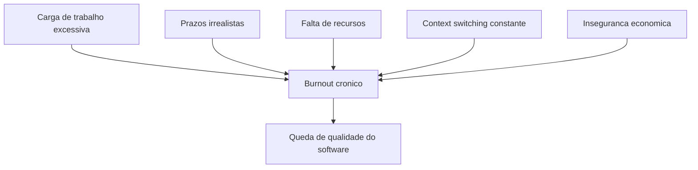
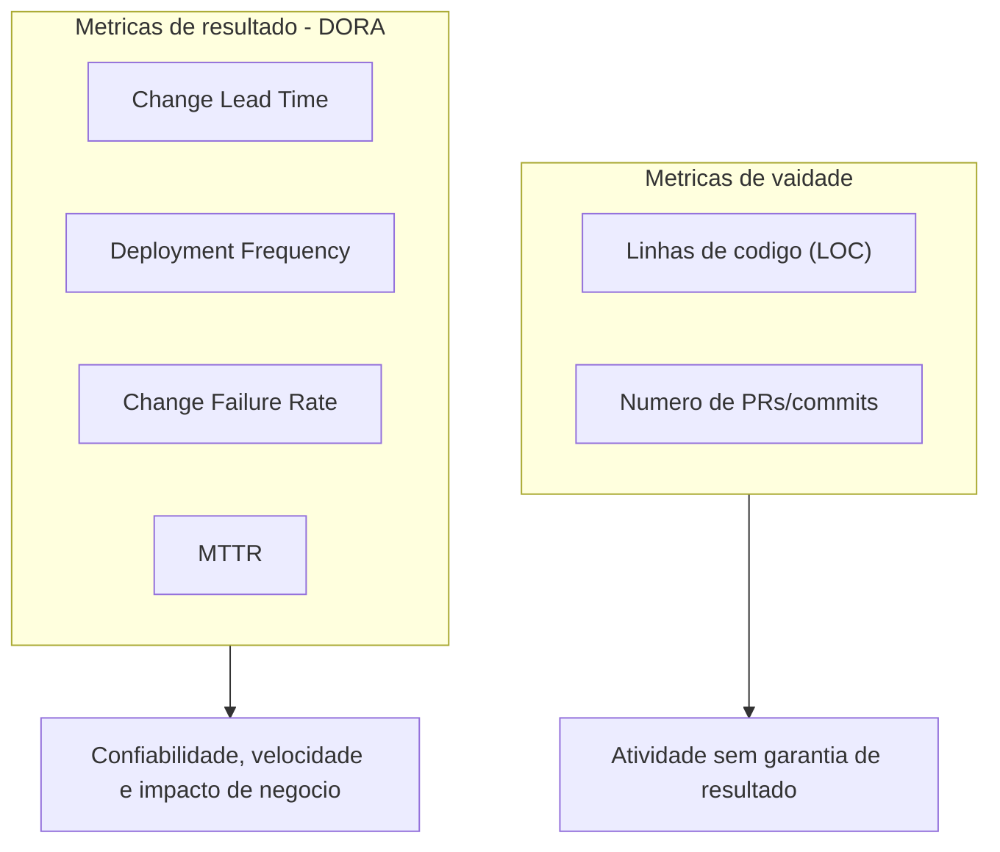
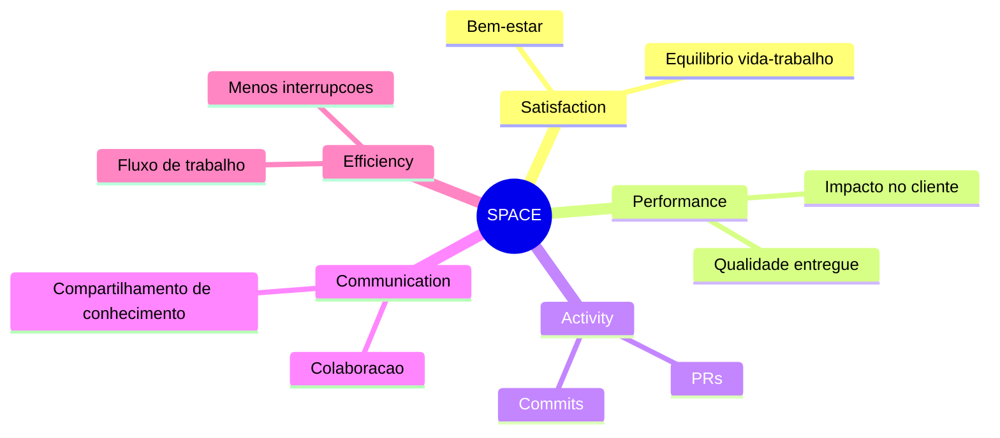
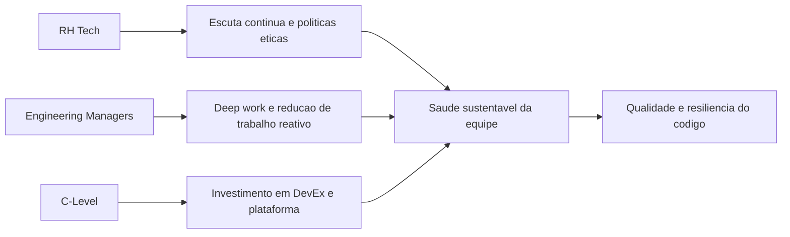

# **A métrica invisível: Como a saúde e o bem-estar do desenvolvedor impactam a qualidade do código**

A engenharia de software contemporânea repousa sobre um paradoxo estrutural profundo: embora a infraestrutura tecnológica seja projetada com redundâncias massivas para alcançar escalabilidade, resiliência e alta disponibilidade, a infraestrutura humana que a constrói e mantém é frequentemente levada ao ponto de falha sistêmica. Historicamente, a indústria de tecnologia e o capital de risco têm avaliado o sucesso da engenharia por meio de métricas de produção puramente mecanicistas, focando em velocidade de entrega, volume de código e tempo de atividade dos servidores. No entanto, uma análise empírica e rigorosa do ciclo de vida do desenvolvimento de software (SDLC) revela que a qualidade do código base, a segurança da arquitetura e a estabilidade das aplicações estão umbilicalmente ligadas a uma métrica frequentemente invisível nos painéis corporativos: a saúde mental, o bem-estar psicológico e a carga cognitiva dos desenvolvedores.

O desenvolvimento de software é uma atividade inerentemente sociotécnica e altamente cerebral, exigindo estados prolongados de concentração profunda, resolução criativa de problemas e constante adaptação a novas linguagens, frameworks e paradigmas operacionais. Quando os profissionais que executam essas tarefas operam sob estresse crônico, ocorre uma degradação mensurável em suas capacidades cognitivas. Essa degradação não se manifesta apenas como insatisfação no trabalho; ela se traduz diretamente em falhas lógicas na arquitetura, aumento exponencial da densidade de defeitos e introdução de vulnerabilidades críticas nos sistemas em produção. Este relatório analisa exaustivamente a intersecção entre o monitoramento proativo da saúde da equipe técnica, a mitigação estrutural do esgotamento profissional (burnout) e a garantia da qualidade do software, fornecendo um arcabouço estratégico fundamentado em dados para líderes de engenharia, gestores de Recursos Humanos com foco em tecnologia (RH Tech) e fundadores de startups.

## **O Panorama do Esgotamento Tecnológico: Uma Crise Sistêmica e Quantificável**

O estado atual da força de trabalho de engenharia de software indica uma crise sistêmica de exaustão, impulsionada por ciclos de sprint implacáveis, sobrecarga digital, proliferação de ferramentas e mudanças macroeconômicas severas. Pesquisas recentes traçam um quadro alarmante da deterioração do bem-estar na indústria global de tecnologia, provando que o burnout não é um jargão passageiro, mas uma epidemia ocupacional. Um amplo levantamento da indústria projetado para 2024 e 2025 revelou que 68% dos trabalhadores de tecnologia relataram experimentar sintomas agudos de burnout, representando um aumento substancial em relação aos 49% registrados apenas três anos antes.

**Diagrama: Vetores estruturais de burnout**



Em mercados específicos e em levantamentos direcionados estritamente a desenvolvedores, a situação apresenta contornos ainda mais críticos. Quase três quartos (73%) dos profissionais de Tecnologia da Informação europeus relataram sofrer de estresse ou burnout relacionado ao trabalho de forma contínua. Outros estudos independentes focados em plataformas de análise de engenharia indicaram taxas de esgotamento atingindo assustadores 83% entre os programadores. Esses dados evidenciam que a exaustão se tornou o estado padrão de operação, e não uma anomalia temporária.

| Métrica de Esgotamento | Porcentagem Reportada | Contexto da Pesquisa e Fatores Contribuintes |
| :---- | :---- | :---- |
| **Sintomas de Burnout (Geral)** | 68% | Aumento em relação aos 49% de três anos antes; impulsionado por sobrecarga digital e velocidade de inovação. |
| **Estresse/Burnout (Europa)** | 73% | 61% atribuem a cargas de trabalho pesadas; 44% a prazos apertados; 43% à falta de recursos. |
| **Risco de Burnout em Tech** |,1% | Trabalhadores classificados como estando em "alto risco" de esgotamento iminente. |
| **Esgotamento de Desenvolvedores** | 83% | Relatado em estudos de plataformas de análise de desenvolvedores, focando na falta de autonomia e propósito. |

*Tabela: Síntese estatística do esgotamento profissional na indústria de tecnologia (2024-2025).*

As raízes desse esgotamento são multifacetadas e vão consideravelmente além do simples excesso de horas trabalhadas. A exaustão é catalisada por expectativas irreais de produtividade linear, arquiteturas de sistemas excessivamente complexas ou monolíticas e uma montanha de dívida técnica legada que torna qualquer alteração no código um campo minado. Mais de 60% dos profissionais atribuem o estresse no trabalho a cargas excessivas de tarefas, enquanto fatores estruturais como prazos irrealisticamente apertados e falta crônica de recursos afetam mais de 40% da força de trabalho. A cultura do trabalho ininterrupto, exacerbada por políticas de trabalho remoto mal estruturadas, diluiu severamente as fronteiras entre a vida profissional e pessoal. A maioria esmagadora dos desenvolvedores relata que continua a codificar, ou a resolver mentalmente problemas de arquitetura de software, fora do horário de trabalho convencional.

Um fenômeno demográfico particularmente preocupante revelado nas pesquisas mais recentes é a mudança no perfil do profissional afetado. Historicamente, o esgotamento era frequentemente associado a desenvolvedores juniores lutando para se adaptar à curva de aprendizado íngreme e à pressão das primeiras entregas. Contudo, dados recentes indicam que o burnout no meio da carreira está atingindo níveis epidêmicos, com desenvolvedores seniores relatando taxas de satisfação significativamente menores do que seus colegas juniores. Esses profissionais seniores não estão apenas exaustos pelas demandas mecânicas de codificação, mas pela proliferação insustentável de reuniões, mudanças constantes de contexto (context switching), responsabilidades de mentoria não estruturadas e o peso psicológico de manter sistemas críticos em funcionamento sob alta pressão e plantões on-call.

A esse cenário intrínseco à engenharia, soma-se o impacto psicológico devastador da instabilidade macroeconômica. Relatórios focados na liderança em engenharia apontam que 40% dos gestores e líderes técnicos observam suas equipes significativamente menos motivadas devido à sombra das demissões no setor de tecnologia. A insegurança no emprego não é uma preocupação abstrata; ela gera uma ansiedade crônica que consome a largura de banda cognitiva necessária para a programação complexa. Quando uma organização falha em fornecer estabilidade, recursos adequados ou transparência executiva, a motivação intrínseca entra em colapso total, minando a eficácia independentemente da habilidade do gerente direto. O esgotamento, portanto, transcende a fadiga individual; ele é um indicador inequívoco de um ambiente de trabalho patológico onde a pressão cognitiva supera largamente os recursos de enfrentamento do indivíduo e da equipe.

## **A Neurociência do Desenvolvimento de Software e a Gênese dos Bugs Críticos**

Para compreender a mecânica exata de como o declínio do bem-estar impacta diretamente a estabilidade do código em produção, é necessário abandonar as analogias de manufatura e examinar o ato de programar através de uma lente estritamente neurocognitiva. A compreensão de arquiteturas abstratas, o rastreamento do fluxo de dados e a escrita de código-fonte são tarefas que exigem recursos massivos da memória de trabalho (working memory) do cérebro humano. Quando a carga cognitiva de um desenvolvedor se aproxima ou ultrapassa os limites fisiológicos dessa memória de trabalho, sua capacidade de compreensão e visualização de sistemas complexos desmorona, tornando-o exponencialmente mais propenso a cometer erros de lógica que se materializam como defeitos de software.

A ligação indelével entre o estado emocional, a carga mental excessiva e a introdução de bugs críticos tem sido substanciada por investigações empíricas de ponta utilizando eletroencefalografia (EEG) e ressonância magnética funcional (fMRI). A taxonomia cognitiva sobre as causas de erros humanos corrobora a ideia contraintuitiva para muitos gestores de que o esquecimento, lapsos de atenção e a sobrecarga mental são os verdadeiros vetores para vulnerabilidades de software, e não apenas a falta de habilidade técnica. Estudos pioneiros demonstraram que as emoções influenciam diretamente a qualidade da tarefa de programação, com a métrica de assimetria frontal (Frontal Asymmetry Index) servindo como um biomarcador viável para prever o desempenho e a atenção durante a codificação.

Análises profundas utilizando EEG para mapear a sobrecarga cognitiva confirmam essas hipóteses. A investigação neurocientífica contemporânea transcendeu as avaliações subjetivas de estresse, mapeando o cérebro do desenvolvedor durante a execução de tarefas reais. Estudos evidenciam que tarefas de desenvolvimento de software exigem intensa atividade na região da Ínsula, uma área cerebral amplamente associada a processos cognitivos de alta ordem e resolução de problemas complexos. A análise sistemática de biomarcadores neurológicos, especificamente a Atividade do parâmetro de Hjorth e a Potência Total nos canais frontais e centrais (F4, FC4 e C4), revela que o esgotamento é uma falha fisiológica mensurável.

As descobertas dessas intersecções entre neurociência e engenharia de software são incisivas: se um programador está operando sob alta sobrecarga cognitiva ou encontra-se distraído ao escrever ou revisar linhas de código, a probabilidade de introdução de bugs ou de vulnerabilidades de segurança passarem despercebidas aumenta drasticamente. Isso se torna ainda mais agudo quando o código em questão já apresenta alta complexidade ciclomática, conforme medido por métricas clássicas de análise estática. As flutuações sazonais na qualidade do código não são, portanto, o resultado de negligência voluntária, mas sim o subproduto inavitável de um cérebro operando sob condições de estresse crônico, fadiga sináptica e exaustão emocional.

Além da capacidade reduzida de processar informações de forma abstrata, o estado psicológico deteriorado afeta severamente a dinâmica metodológica do desenvolvimento, particularmente durante as fases cruciais de testes unitários e revisão de código (Code Review). A psicologia cognitiva descreve o fenômeno do "viés de confirmação" como a tendência humana instintiva de buscar, interpretar e focar em informações que verifiquem hipóteses pré-existentes em vez de tentar refutá-las. Durante a criação de testes e a revisão de pull requests, os desenvolvedores deveriam, teoricamente, tentar subverter e quebrar ativamente o próprio código. Contudo, sob pressão severa de tempo e estresse mental, o viés de confirmação é catastroficamente amplificado; os desenvolvedores exaustos buscam o caminho de menor resistência para a validação, ignorando casos de borda complexos (edge cases) e falhas arquiteturais sutis que exigiriam grande esforço cognitivo para serem rastreadas. Como resultado direto e quantificável dessa falha cognitiva induzida pelo estresse, defeitos críticos transbordam para o ambiente de produção, aumentando a densidade de defeitos do software e o risco de interrupções sistêmicas.

**Diagrama: Cadeia neurocognitiva ate bugs em producao**


A quantificação dessas falhas é frequentemente realizada através da métrica de Densidade de Defeitos (Defect Density), comumente calculada dividindo o número de defeitos confirmados pelo tamanho do módulo de software, frequentemente medido em milhares de linhas de código (KLOC) ou pontos de função. Projetos de software experimentam, em média, de 15 a 50 bugs para cada.000 linhas de código escritas. Quando a força de trabalho entra em burnout, a fadiga anula as práticas proativas de revisão, permitindo que a taxa de densidade de defeitos se aproxime do limite superior dessa média. Ademais, análises de padrões de defeitos revelam que os bugs tendem a se aglomerar em áreas específicas e hipercomplexas do código. Sem a acuidade mental necessária para navegar nessas áreas críticas, as equipes sofrem interrupções constantes.

A dimensão social e colaborativa do desenvolvimento de software também sofre colapso sob pressão. O estresse crônico contrai a colaboração interativa e a empatia profissional. Em ambientes de alta pressão e moral baixa, observa-se um declínio acentuado em práticas empíricas de garantia de qualidade que dependem da dinâmica interpessoal saudável. A programação em pares (pair programming) é abandonada, as reuniões diárias (standups) tornam-se relatórios mecânicos vazios, e ocorre um preocupante acúmulo de conhecimento em silos. Os profissionais tendem a se isolar para proteger sua escassa energia mental, hesitando em assumir a responsabilidade por refatorações de código arriscadas ou por levantar preocupações sobre a arquitetura. Esse colapso na comunicação significa que pequenos mal-entendidos sobre os requisitos de negócios evoluem silenciosamente para atrasos catastróficos e dívidas técnicas paralisantes a longo prazo.

## **A Falácia das Métricas Tradicionais e a Ascensão do Framework DORA**

A busca histórica pela quantificação do trabalho intelectual na engenharia de software tem um histórico de adoção de métricas reducionistas que frequentemente incentivam comportamentos paradoxais e prejudiciais à qualidade a longo prazo. A métrica mais clássica e indiscutivelmente mais falha, as Linhas de Código (LOC \- Lines of Code), é amplamente considerada uma métrica de vaidade. O uso irrestrito de LOC pune a eficiência algorítmica e a elegância; um desenvolvedor focado em qualidade e saúde do sistema pode resolver um problema arquitetural complexo refatorando e eliminando mil linhas de código legado, enquanto um desenvolvedor exausto pode entregar uma solução frágil e inchada de centenas de linhas apenas para sinalizar produtividade. Da mesma forma, avaliar o desempenho estritamente pela contagem de Pull Requests (PRs) ou commits mede apenas a atividade e a movimentação cinética, não o progresso real em direção aos objetivos de negócios. É uma métrica dependente do fluxo de trabalho e altamente suscetível a manipulação, onde desenvolvedores fragmentam entregas triviais para inflar números, mascarando a degradação da qualidade sistêmica.

Para superar o foco no volume bruto e na microgestão, a indústria adotou de forma massiva as métricas DORA (DevOps Research and Assessment), que revolucionaram a forma como avaliamos a eficácia da entrega de software ao atrelar práticas de desenvolvimento aos resultados organizacionais. O DORA afasta-se da contagem de linhas e examina a maturidade do pipeline de entrega e a performance operacional (Software Delivery and Operational \- SDO) focando em quatro eixos primários:

**Diagrama: Metricas tradicionais versus DORA**



1. **Tempo de Ciclo de Mudança (Change Lead Time):** O tempo decorrido desde o commit do código até a sua implantação bem-sucedida em produção.  
2. **Frequência de Implantação (Deployment Frequency):** A cadência com que a organização implanta código em produção.  
3. **Taxa de Falha de Mudança (Change Failure Rate):** A porcentagem de implantações que causam falhas em produção necessitando de remediação imediata (hotfixes, rollbacks).  
4. **Tempo Médio de Recuperação (MTTR / Failed Deployment Recovery Time):** O tempo necessário para restaurar o serviço em caso de um incidente ou falha.

A pesquisa longitudinal do DORA demonstrou conclusivamente que o desempenho na entrega de software é um preditor direto do sucesso organizacional, influenciando a lucratividade, a participação de mercado e a satisfação do cliente. Além disso, estabeleceu uma correlação inegável entre o alto desempenho de TI e o bem-estar psicológico e lealdade dos funcionários. Profissionais em organizações de alto desempenho (Elite e High) são,2 vezes mais propensos a recomendar sua empresa como um ótimo lugar para trabalhar (medido pelo eNPS).

Ao categorizar as equipes em perfis de desempenho de Elite, Alto, Médio e Baixo, a pesquisa revelou diferenças profundas e instrutivas na alocação de tempo cognitivo. O aspecto mais revelador da pesquisa DORA para líderes de RH e Engenharia preocupados com a epidemia de burnout reside em como o tempo é consumido pelas equipes, ilustrando o peso do trabalho reativo:

| Categoria de Desempenho (DORA) | Tempo Gasto em Novo Trabalho (Inovação) | Tempo Gasto em Trabalho Não Planejado e Retrabalho | Remediação Constante de Falhas de Segurança | Correção de Defeitos Identificados por Usuários |
| :---- | :---- | :---- | :---- | :---- |
| **Performers de Elite** | 50% |,5% | 5% | 10% |
| **Performers de Baixo Desempenho** | 30% | 20% | 10% | 20% |

Tabela: Alocação de esforço baseada no perfil de desempenho de entrega de software (Dados DORA Accelerate State of DevOps).

As equipes de elite desfrutam de um ciclo virtuoso de saúde mental e excelência técnica. A implementação de capacidades técnicas robustas reduz o que a pesquisa denomina de "dor de implantação" (deployment pain) — o nível de medo, ansiedade e estresse crônico que os engenheiros experimentam ao enviar código para produção. Onde as implantações são mais dolorosas e geram ansiedade noturna, encontram-se as piores culturas organizacionais e os mais baixos desempenhos de software. As equipes de elite, livres dessa dor através da automação, conseguem alocar metade do seu tempo cognitivo para a criação genuína de valor (50%).

Em contrapartida estridente, desenvolvedores em ambientes de baixo desempenho estão aprisionados em um estado reativo de sobrevivência perpétua. O dobro de seu tempo é consumido apagando incêndios, remediando falhas de segurança de última hora devido à falta de testes automatizados precoces, e corrigindo um volume avassalador de defeitos relatados diretamente pelos usuários finais frustrados. Esse trabalho reativo e não planejado (rework) é um dos vetores primários do esgotamento, caracterizado por altos níveis de cortisol e constante frustração sistêmica. A pesquisa de burnout de Christina Maslach, amplamente citada no DORA, identifica seis fatores de risco organizacionais para o burnout: sobrecarga de trabalho, falta de controle, recompensas insuficientes, colapso da comunidade, ausência de justiça e conflito de valores. O ambiente de baixo desempenho exacerba perfeitamente a sobrecarga e a falta de controle.

Para mitigar essa ansiedade e reduzir o retrabalho, o DORA prescreve a adoção rigorosa de capacidades técnicas específicas associadas à Entrega Contínua (Continuous Delivery). Práticas como automação de testes (onde desenvolvedores criam suítes confiáveis que encontram falhas reais), desenvolvimento baseado em tronco (trunk-based development, minimizando ramificações complexas que causam infernos de merge), segurança abrangente (pervasive security), arquiteturas fracamente acopladas e observabilidade abrangente não são apenas boas práticas de arquitetura. Elas são intervenções profiláticas diretas contra o esgotamento nervoso da equipe. Ao garantir que a qualidade seja "construída desde o início", as equipes não chegam exaustas ao final do ciclo de lançamento.

## **O Framework SPACE e a Operacionalização da Satisfação e Produtividade**

Apesar de seu imenso e inquestionável valor para a engenharia operacional, as métricas DORA possuem uma limitação intrínseca de escopo: elas medem com precisão a velocidade e a estabilidade mecânica do pipeline de entrega, mas não quantificam diretamente a experiência subjetiva vivida, o nível de atrito diário, o bem-estar cognitivo ou o desgaste humano crônico necessário para alimentar e manter esse pipeline funcionando. As métricas DORA capturam se a máquina de software está funcionando de forma eficiente, mas não indicam se a equipe técnica está à beira do colapso nervoso, operando além de seus limites sustentáveis para forjar essa cadência. Adicionalmente, ferramentas focadas estritamente em "ocupação" (busyness metrics) que medem o tempo em reuniões tentam olhar para o lado humano, mas falham em fornecer recomendações acionáveis para melhorar o fluxo.

Para resolver essa lacuna perigosa de visibilidade e combater a exaustão subjacente que eventualmente destruirá a performance sustentável do pipeline a longo prazo, pesquisadores especializados em engenharia de software do GitHub, Microsoft e da Universidade de Victoria colaboraram para desenvolver um framework complementar com uma perspectiva profundamente holística. O resultado foi o framework SPACE.

O SPACE rejeita veementemente a noção ultrapassada de que a produtividade intelectual pode ser reduzida a uma única dimensão de produção ou atividade. Ele propõe um modelo multifacetado construído sobre cinco eixos interdependentes, fornecendo uma visão 360 graus da eficácia da engenharia:

**Diagrama: Mapa das dimensoes do framework SPACE**



| Dimensão SPACE | Significado e Foco de Mensuração | Indicadores Típicos |
| :---- | :---- | :---- |
| **S (Satisfaction & well-being)** | O grau de felicidade, realização, segurança psicológica e ausência de fadiga no trabalho. | Satisfação com o equilíbrio vida/trabalho; níveis de estresse relatados; eficácia percebida do desenvolvedor. |
| **P (Performance)** | O impacto final do trabalho e a qualidade do software entregue aos clientes. | Satisfação do usuário final (NPS); crescimento de receita associado a features; saúde operacional e estabilidade. |
| **A (Activity)** | A contagem tradicional de saídas do processo de desenvolvimento. | Frequência de commits de código; número de pull requests revisados; tickets de incidentes fechados. |
| **C (Communication & collaboration)** | A eficácia com que a equipe se comunica, descobre dependências e colabora. | Satisfação com revisões de código; velocidade e eficácia do compartilhamento de conhecimento interdisciplinar. |
| **E (Efficiency & flow)** | A capacidade da equipe de progredir no trabalho com atrito mínimo e poucas interrupções. | Tempo de ciclo de tarefas; percepção individual de capacidade de focar profundamente sem interrupções contextuais. |

*Tabela: Desdobramento das dimensões do Framework SPACE para produtividade holística.*

O primeiro pilar do SPACE, Satisfação e Bem-estar, atua como o alicerce metodológico. Ele não é um enfeite corporativo destinado a panfletos de endomarketing; é uma alavanca quantificável e preditiva para a eficiência operacional. Os princípios fundacionais do SPACE determinam que a satisfação atua como um *indicador antecedente* (leading indicator) vital para a produtividade. A pesquisa rigorosa que sustenta o framework demonstra de forma inequívoca que o declínio na satisfação e no engajamento não é um sintoma paralelo à queda de produtividade, mas um sinal de alerta precoce de que o burnout está se aproximando e, invariavelmente, a produção e a qualidade do código desabarão na sequência.

A validade da correlação proposta pelo SPACE foi testada e expandida pelo movimento paralelo focado na Developer Experience (DevEx). Para responder à exigência de executivos por dados financeiros rigorosos que justificassem o investimento em bem-estar, a Microsoft, o GitHub e a organização de pesquisa DX conduziram estudos estatísticos extensivos sobre como a saúde do ambiente de trabalho impacta os resultados corporativos finais. A teoria subjacente, ancorada na Teoria do Design do Trabalho (Work Design Theory), postula que ambientes de trabalho otimizados reduzem o burnout e impulsionam o desempenho.

Os dados empíricos resultantes são definitivos e delineiam como a mitigação do atrito e da sobrecarga psicológica gera dividendos drásticos na qualidade técnica:

* **Foco e o Estado de Fluxo (Flow State):** Desenvolvedores que conseguem reservar blocos de tempo significativos para o trabalho profundo (deep work) — livres da constante interrupção de e-mails, alertas não urgentes ou reuniões de sincronização mal planejadas — desfrutam de um impressionante aumento de 50% em sua produtividade percebida. Além disso, desenvolvedores que encontram propósito e engajamento em suas tarefas (em oposição a executar manutenção monótona perpétua) relatam sentir-se 30% mais produtivos. Proteger o cérebro do desenvolvedor da fragmentação de atenção é a alavanca mais rápida para aumentar a qualidade das entregas.  
* **Gestão da Carga Cognitiva e Qualidade Arquitetural:** Profissionais que relatam possuir um alto grau de compreensão sobre o código base legado e a intrincada arquitetura do sistema em que operam sentem-se 42% mais produtivos em comparação com aqueles lutando na obscuridade. A dívida técnica desenfreada, a falta de documentação interna clara, on-boarding precário e a pressa constante são os maiores destruidores dessa compreensão. Quando o código é ininteligível devido à pressa de iterações passadas, a carga cognitiva (seja intrínseca ou extrínseca) esgota rapidamente o programador, levando a erros induzidos por fadiga mental. Ferramentas intuitivas e processos claros fazem os desenvolvedores se sentirem 50% mais inovadores.  
* **Velocidade dos Ciclos de Feedback (Feedback Loops):** A qualidade do software despenca quando o atrito entra no processo de revisão. O atraso excessivo no retorno sobre o código recém-escrito (code reviews estagnados, processos de aprovação burocráticos e pesados, ou builds CI/CD muito lentos) quebra violentamente a linha de raciocínio. A pesquisa revela um dado notável: equipes de desenvolvimento que conseguem responder rapidamente às dúvidas de seus colegas e que implementam revisões ágeis relatam gerar 50% menos dívida técnica corporativa. Adicionalmente, ciclos de revisão rápidos deixam os desenvolvedores 20% mais inovadores, mantendo-os em um estado de curiosidade intelectual contínua em vez de estagnação frustrante.

A evidência converge implacavelmente para uma conclusão incontestável: programadores felizes, apoiados por ferramentas adequadas e não consumidos pelo estresse logístico, são empiricamente mais produtivos, menos propensos ao esgotamento e escrevem códigos intrinsecamente mais seguros e com menos bugs. A ausência de frustrações sistêmicas sistêmicas atenua a "inflamação cognitiva", permitindo que o cérebro invista seus recursos valiosos na antecipação de falhas complexas no código, em vez de desperdiçá-los em um embate diário contra a própria burocracia corporativa.

## **O Paradoxo da Inteligência Artificial: Produtividade Aparente e Nova Carga Cognitiva**

À medida que a indústria avança rapidamente para a era da engenharia auxiliada por inteligência artificial, uma nova, ilusória e formidável camada de complexidade cognitiva é adicionada ao trabalho de desenvolvimento, cunhando o que instituições de pesquisa globais passaram a chamar de "O Paradoxo da IA" (The AI Paradox). O advento de poderosos assistentes de codificação alimentados por grandes modelos de linguagem (LLMs), como o GitHub Copilot e o conjunto de ferramentas baseadas em IA da GitLab, foi introduzido com a promessa estelar de ganhos astronômicos de produtividade. De fato, a capacidade de gerar rapidamente código boilerplate intrincado, completar rotinas matemáticas complexas, importar pacotes automaticamente e até mesmo orquestrar a geração de extensas suítes de testes unitários de forma quase instantânea altera drasticamente a fase inicial de autoria de software.

No entanto, as primeiras análises profundas e em larga escala sobre a eficácia real da IA em ambientes corporativos revelam consequências de segunda ordem severas para a saúde mental das equipes e a qualidade técnica a longo prazo, particularmente quando essas ferramentas são implementadas sem uma infraestrutura sociotécnica corretiva. Embora a IA acelere dramaticamente a velocidade mecânica de digitação e a geração de rascunhos iniciais de código, ela simultaneamente fragmenta as cadeias de ferramentas e cria novos gargalos formidáveis nas etapas posteriores de validação e segurança do ciclo de vida do desenvolvimento.

Pesquisas recentes abrangentes, como o relatório global da GitLab projetando tendências até 2026 e avaliando mais de.200 profissionais de DevSecOps, demonstraram dados contraintuitivos: as organizações estão perdendo em média 7 horas semanais valiosas (quase um dia de trabalho completo) por membro da equipe devido a ineficiências estritamente geradas pela expansão de ferramentas de IA mal integradas e processos desarticulados em torno de revisões de conformidade.

A armadilha invisível e indutora de burnout inerente à IA reside na transferência maciça da natureza da carga cognitiva. Quando um LLM gera centenas ou milhares de linhas de código em meros segundos, a responsabilidade central do desenvolvedor humano muda da *autoria* lógica passo-a-passo para a *leitura, compreensão e validação arquitetural e de segurança* de um código gerado por máquina. O trabalho fundamental se transforma. Em vez de ser o pedreiro sistemático da lógica, o engenheiro exausto subitamente deve atuar como um auditor técnico sênior de um vasto sistema construído por uma inteligência alienígena extremamente rápida, plausivelmente correta, mas notoriamente propensa a alucinações e à injeção de pacotes vulneráveis. A psicologia cognitiva demonstra que ler e auditar retrospectivamente código produzido por terceiros é empiricamente mais extenuante e dispendioso para a memória de trabalho do cérebro do que escrever e estruturar o próprio pensamento através do código.

Essa nova dinâmica acelerada resultou em um efeito colateral devastador apontado por institutos independentes de pesquisa de eficiência de software. Ao analisar milhões de linhas de código alteradas, as projeções indicam que o *code churn* (rotatividade de código) – definido como a porcentagem de linhas de código que precisam ser revertidas, corrigidas de emergência ou amplamente atualizadas menos de duas semanas após a sua inserção no sistema principal – sofreu picos dramáticos, com expectativas de dobrar de volume como resposta direta à adesão de ferramentas generativas não fiscalizadas. Essa aceleração imprudente cria uma montanha virtual de dívida técnica silenciosa que se acumula assustadoramente rápido nos repositórios.

Portanto, se o volume de Pull Requests for mantido dogmaticamente como a métrica principal de produtividade em uma era guiada por IA, os gestores estarão celebrando o movimento enquanto afundam a embarcação. O desenvolvedor assistido por IA abrirá dezenas de PRs volumosos, parecendo estatisticamente hiper-produtivo. Porém, esses PRs massivos recairão sobre seus pares humanos para revisão. Se esses desenvolvedores designados como revisores já estiverem sofrendo de burnout severo e sobrecarga, o resultado será catastrófico. Desenvolvedores cognitivamente esgotados não possuem o rigor mental, a empatia ou a paciência investigativa requerida para realizar revisões profundas de segurança sobre vastas saídas de LLMs.

Dominados pelo viés de confirmação e pela pressão dos prazos, eles invariavelmente adotarão um comportamento de aprovação automática (rubber-stamping), sancionando mecanicamente injeções de código perigosas para cumprir métricas focadas puramente na velocidade mecânica. Isso destruirá a robustez do aplicativo no ambiente de produção, garantindo noites de insônia futuras durante incidentes de falha. Para colher os dividendos prometidos pela IA sem sacrificar a sanidade da equipe ou a qualidade do código, as organizações devem investir de forma concomitante e robusta em Engenharia de Plataforma (Platform Engineering), garantindo portais de desenvolvedores internos e "caminhos dourados" (golden paths) altamente automatizados que absorvam o fardo da orquestração de infraestrutura e da varredura de segurança de rotina antes de esgotar o avaliador humano.

## **Tecnologias de Monitoramento: Da Vigilância à Inteligência Holística de Engenharia**

Compreender o embasamento teórico da carga cognitiva, DORA e SPACE é apenas a fundação; a operacionalização da mensuração tem historicamente esbarrado na dificuldade prática de extrair dados limpos de matrizes de ferramentas profundamente fragmentadas. Para superar essa barreira técnica sem recorrer a táticas hostis, surgiu nos últimos anos a disciplina avançada das plataformas de Inteligência de Engenharia (Engineering Intelligence) e a evolução das tecnologias contínuas de gestão de pessoas (People Analytics).

Ferramentas empresariais avançadas neste segmento, como DX, Jellyfish, Haystack e LinearB, diferem fundamentalmente, metodologicamente e filosoficamente dos tradicionais rastreadores de tempo, contadores de cliques ou infames softwares de vigilância corporativa (bossware/spyware). Elas operam sob o princípio do monitoramento estritamente contextual, agregado e não invasivo. Em vez de filmar telas, elas integram e cruzam metadados valiosos de repositórios Git, ferramentas de rastreamento de problemas (como Jira ou Asana) e pipelines de Integração e Implantação Contínuas (CI/CD). Essas plataformas de ponta partem da premissa de que a telemetria bruta do sistema (como tamanho do PR, taxa de abertura para fechamento e tempo de ciclo) permanece enganosamente bidimensional se não for infundida com o contexto humano subjacente.

A ferramenta DX, por exemplo, destaca-se por ter sido desenhada diretamente por pesquisadores científicos de elite (incluindo os criadores primordiais do DORA e do SPACE). Ela não confia apenas nas métricas de máquina; a plataforma funde a telemetria técnica pesada do SDLC com percepções qualitativas essenciais coletadas ininterruptamente dos próprios desenvolvedores. Através do uso inteligente de amostragem de experiência (Experience Sampling) e questionários contextuais rápidos baseados no trabalho atual do engenheiro, os gestores conseguem mapear os exatos nós de atrito onde o talento fica confuso, bloqueado ou mentalmente desgastado pela arquitetura. Isso originou o framework proprietário DX Core, focado simultaneamente em Velocidade, Efetividade, Qualidade e Impacto nos Negócios. Isso permite que líderes equilibrem suas réguas de medição, garantindo que o aplauso por "entregas mais rápidas" não ocorra enquanto a efetividade técnica e a moral despencam.

Da mesma forma, a plataforma Jellyfish atua como um tradutor vital entre o chão de fábrica da engenharia e a sala de reuniões executiva. Ela traduz os sinais mecânicos fragmentados da engenharia em uma linguagem financeira e executiva de alocação de recursos. A plataforma permite que a liderança enxergue precisamente quanto do precioso tempo, esforço humano e investimento financeiro (R\&D) está sendo sugado por um buraco negro de dívida técnica escondida ou de manutenção corretiva imprevista, em oposição à verdadeira inovação de roadmap. A capacidade analítica de demonstrar matematicamente a uma diretoria que uma equipe técnica inteira está sufocando silenciosamente sob uma carga operacional esmagadora é o primeiro passo empírico irrefutável para justificar orçamentos voltados à refatoração preventiva e à redução sistêmica do risco de burnout corporativo coletivo.

| Categoria da Ferramenta | Abordagem e Coleta de Dados Primária | Impacto no Bem-Estar e na Gestão de Qualidade | Exemplos Representativos |
| :---- | :---- | :---- | :---- |
| **Plataformas de Inteligência de Engenharia** | Cruzamento de telemetria de sistemas (Git, Jira, CI/CD) com pesquisas in-workflow de experiência do desenvolvedor. | Identifica gargalos arquiteturais precisos; mede tempos de ciclo reais; atua prevenindo a estagnação e fadiga de revisão de código. | DX, Jellyfish, Haystack, LinearB. |
| **People Analytics & HR Tech (Escuta Contínua)** | Pesquisas de pulso frequentes (eNPS), modelagem preditiva baseada em Processamento de Linguagem Natural (NLP) e métricas de feedback:1. | Avalia os fundamentos da segurança psicológica, métricas de reconhecimento, risco de burnout de equipe e alinhamento da liderança local. | Culture Amp, Lattice, Workday Peakon. |
| **Platform Engineering (Engenharia de Plataforma)** | Portais internos de desenvolvedor (IDPs), automação de pipelines, catálogos de serviços e orquestração self-service. | Reduz drasticamente a carga cognitiva automatizando aprovisionamento de ambientes, documentação e segurança, devolvendo autonomia vital ao desenvolvedor. | Backstage, Cortex, Port, Ferramentas In-house. |

*Tabela: O ecossistema moderno de ferramentas de monitoramento sociotécnico e suporte ao desenvolvedor.*

Em paralelo à adoção de ferramentas da engenharia propriamente dita, a gestão macro do bem-estar nas organizações avançou qualitativamente com a maturidade de plataformas de Escuta Contínua (Continuous Listening) geridas pelos departamentos modernos de Recursos Humanos e Operações de Pessoas. Soluções proeminentes de People Analytics, como Culture Amp, Lattice e Workday Peakon, ajudaram a aposentar a antiquada, lenta e reativa pesquisa anual de clima organizacional.

Em seu lugar, essas plataformas institucionalizaram coletas de feedback microscópicas, direcionadas e altamente frequentes (pulse surveys), integrando-se nativamente a ferramentas como Slack e Microsoft Teams. Utilizando modelos de inteligência artificial treinados em psicologia organizacional para processamento de linguagem natural, essas ferramentas analisam sentimentos anônimos em larga escala em tempo real. Isso concede à liderança o superpoder de detectar padrões emergentes de isolamento em trabalhadores remotos, queixas subjacentes de desequilíbrio entre vida pessoal e profissional, e um declínio geral na segurança psicológica meses antes que eles culminem em pedidos de demissão em massa ou em um colapso arquitetural catastrófico.

A validade metodológica de monitorar a engenharia dessa forma pode encontrar uma analogia crítica e esclarecedora na área da saúde digital e da medicina preventiva: o avanço do Monitoramento Remoto de Pacientes (Remote Patient Monitoring \- RPM) focado na saúde comportamental. Na medicina moderna, tecnologias passivas de RPM com IoT (Internet das Coisas) ou biossensores vestíveis (wearables) capturam continuamente flutuações discretas na variabilidade da frequência cardíaca (HRV), padrões de sono e tendências glicêmicas em tempo real, utilizando esses microdados para alertar a equipe médica muito antes de um evento clínico catastrófico (como um coma diabético ou uma crise aguda de pânico) se concretizar.

A liderança de engenharia e RH tecnologicamente informada de hoje está essencialmente abraçando um modelo de "RPM Organizacional". O objetivo imperativo não é, sob nenhuma circunstância, realizar uma vigilância microgerencial individual do profissional. Dados irrefutáveis comprovam que o monitoramento malicioso, focado estritamente na contagem de teclas digitadas ou na captura invasiva de telas, inevitavelmente gera paranoia severa, elimina a autonomia percebida, destrói qualquer resquício de confiança no empregador e aumenta as métricas de estresse até o ponto de ruptura. Por outro lado, o monitoramento ético, consentido, agregado e puramente compassivo, voltado exclusivamente para a identificação de atritos logísticos no sistema de desenvolvimento, atua como o sistema imunológico precoce da empresa, protegendo a equipe técnica das próprias disfunções da empresa.

## **O Impacto Econômico: Rotatividade, Qualidade e o Custo Oculto da Exaustão**

A tese de que existe uma correlação linear, severa e imediata entre as métricas intangíveis de bem-estar da equipe e a viabilidade do balanço financeiro da corporação é suportada por dados inequívocos. Essa realidade matemática refuta frontalmente a visão antiquada de muitos diretores financeiros de que o investimento em saúde mental é meramente uma iniciativa filantrópica ou de responsabilidade social corporativa restrita ao "soft HR". O custo não mitigado do estresse agudo na engenharia de software manifesta-se nos relatórios financeiros primariamente por meio do custo insustentável de rotatividade voluntária de talentos (employee turnover) e da degradação irreparável da base de código que leva à paralisação de projetos de missão crítica.

Substituir um engenheiro ou desenvolvedor sênior esgotado, que muitas vezes é o único guardião mental de um vasto e indocumentado conhecimento empírico sobre subsistemas complexos da empresa, tem impactos monetários avassaladores e imediatos. Pesquisas extensivas e revisadas por pares na área de gestão de recursos humanos demonstram de forma consistente que o verdadeiro custo corporativo de substituir um profissional altamente qualificado pode atingir um montante espantoso equivalente a até,5 vezes o valor do seu salário anual integral. Essa estimativa incorpora não apenas os custos diretos, demorados e óbvios de aquisição e recrutamento, mas os extensos períodos de treinamento formal, a ineficiência inerente da curva de aprendizado (ramp-up time) do novo membro, e o fardo devastador colocado sobre os desenvolvedores remanescentes que herdam cargas de suporte massivas, induzindo um efeito dominó secundário de exaustão na equipe.

Em contrapartida cristalina, organizações proativas que baseiam ativamente suas metodologias de trabalho e culturas organizacionais em dados métricos de bem-estar colhem reduções assombrosas nestes custos tradicionalmente considerados "ocultos". Estudos de caso pragmáticos atestam que empresas focadas na resolução de gargalos operacionais e na garantia institucional do equilíbrio entre a vida pessoal e profissional dos desenvolvedores chegam a reduzir os custos diretos relacionados à evasão de talentos na ordem de $1,2 milhão anualmente.

Para ecossistemas de startups — empresas historicamente operando sob injeções de capital de risco intensivo e cronogramas de queima de caixa (burn rate) cruéis — o burnout generalizado de seus engenheiros fundacionais ou arquitetos principais não é apenas um problema de desempenho; ele tipicamente representa o fracasso existencial premonitório da companhia. Em ambientes de startup hipercompetitivos, a metodologia de engenharia foca-se pesadamente em ciclos rápidos e agressivos de construção, medição e iteração empírica. Contudo, a tensão constante do overwork destrói de forma letal a capacidade intelectual da equipe de manter a agilidade para inovar e reagir aos feedbacks dos usuários do mercado.

Os resultados fornecidos pelas plataformas de Inteligência de Engenharia comprovam o retorno massivo sobre o investimento (ROI) da adoção de visibilidade focada no fluxo de trabalho sem fricção. Organizações e startups que adotam a telemetria sofisticada da plataforma DX ilustram essa realidade: startups focadas em biotecnologia como a Recursion conseguiram cortar passivamente sua dívida técnica sufocante em 33% identificando pontos dolorosos invisíveis no fluxo diário, enquanto empresas de infraestrutura web como a Block Labs relatam aumentos sísmicos com um salto de produtividade avaliado em 4 vezes o seu fator de linha de base original ao alinhar os processos com as percepções de gargalos apontadas por seus desenvolvedores através de questionários de pulso contínuos.

A automação da dor do desenvolvedor propaga-se diretamente para a aceleração dos lucros comerciais. A gigantesca corporação aeroespacial Airbus, por exemplo, utilizou a automação sistemática proposta por plataformas de DevOps e Integração Contínua como a GitLab para mitigar brutalmente as rotinas massivamente indutoras de fadiga humana que enervavam seus times. O resultado do investimento no alívio cognitivo de seus engenheiros não foi medido apenas em felicidade, mas com a compressão dramática do tempo de um ciclo de lançamento crítico de 24 horas laboriosas repletas de ansiedade para módicos 10 minutos de estabilidade comprovada e de baixo estresse. De forma análoga, clientes da Jellyfish, como a Five9, utilizam a percepção das métricas da engenharia como uma pedra fundamental, observando expansões operacionais profundas de 35% ao reeducarem a gerência média sobre como utilizar dados de capacidade de carga da equipe para ajustar prazos realistas com a gerência de produto. Um de seus parceiros chegou a reportar que a eficiência otimizada permitiu picos de inovação impressionantes de 80% na taxa de processamento global da equipe simplesmente redirecionando a equipe a focar nos impedimentos apontados no seu software analítico.

Manter o suporte da arquitetura psicológica e a resiliência cognitiva da força de trabalho atual não é, no final das contas, apaziguar desenvolvedores; é fundamentalmente equivalente a preservar o ativo operacional de capital primário que impulsiona a valoração de mercado da companhia de tecnologia moderna.

## **Diretrizes Estratégicas Essenciais por Papel Organizacional**

O reconhecimento da correlação irrefutável e multidimensional entre a prevalência do esgotamento do desenvolvedor de software, o colapso cognitivo e o aumento severo das taxas de falha sistêmica em produção exige um plano de ação orquestrado e tático por todos os atores da cadeia hierárquica organizacional corporativa. Para intervir sistemicamente e inverter com sucesso o declínio crônico da moral técnica e da produtividade limpa, as estratégias e protocolos não podem ser prescritos isoladamente. Elas devem abranger perfeitamente desde ajustes técnicos metodológicos diários na cultura de submissão de código (code merge) até reavaliações estruturais profundas nos métodos tradicionais de governança corporativa e gerenciamento de recursos humanos.

**Diagrama: Coordinacao entre papeis organizacionais**



### **Diretrizes Executivas para Gestores de Recursos Humanos Tech e People Analytics**

Os líderes de recursos humanos focados no talento de tecnologia precisam abandonar imediatamente qualquer persistência dogmática nas metodologias arcaicas do passado corporativo do século XX. O objetivo é estabelecer a escuta infraestrutural proativa. A reestruturação da arquitetura primária de feedback de talentos é não negociável; deve-se erradicar as avaliações de clima generalizadas, infrequentes e lentas, bem como as metodologias punitivas de revisões anuais de desempenho focadas apenas no produto bruto. Profissionais de People Analytics precisam orquestrar a implementação de plataformas tecnológicas modernas (como Lattice, Culture Amp ou equivalentes) que possibilitem e automatizem as pesquisas de escuta contínua de forma sutil, integradas ao fluxo sem perturbar o andamento de projetos. A cadência dessa amostragem deve ser regular o suficiente para alertar padrões perigosos de fadiga, cruzando o engajamento individual ou da equipe frente a históricos estatísticos internos de rotatividade.

Paralelamente, o RH Tech precisa se afirmar politicamente dentro da corporação para atuar como guardião ético na implementação de métricas de engenharia. Em conjunto com a diretoria técnica, devem educar a gestão intermediária para ancorar a definição de "desempenho exemplar" rigorosamente baseada nos pilares holísticos prescritos pelo aclamado framework SPACE (Satisfação, Desempenho, Atividade, Comunicação, Eficiência) em oposição radical a contadores brutos de tempo logado no sistema. Finalmente, e criticamente importante na era híbrida, o RH não pode tolerar a instalação sub-reptícia de softwares de monitoramento intrusivo (como registradores de webcam ou rastreadores ininterruptos de atividade do mouse). Eles devem instituir políticas draconianas garantindo que toda telemetria analisada na empresa é agregada no nível de time, rigorosamente anônima perante a alta gerência para evitar a caça às bruxas, focada inabalavelmente nos fluxos orgânicos das ferramentas (Git, Jira) e não na captura forçada da psique humana. Rastrear as dores dos sistemas operacionais revela as frustrações muito antes que elas esgotem as vidas de quem trabalha com eles.

### **Protocolos Operacionais para Gerentes de Engenharia (Engineering Managers)**

Para as lideranças táticas posicionadas diretamente nas trincheiras diárias da construção do software, a defesa agressiva do ambiente de trabalho de sua equipe é a tarefa mais vital que assegurará o cumprimento dos objetivos comerciais sem gerar bugs catastróficos. Em primeiro lugar, eles devem institucionalizar o princípio fundamental do trabalho ininterrupto ("Deep Work"). Como a telemetria irrefutável evidencia, os blocos intencionais de tempo mental isolado garantem saltos maciços na produtividade real. Os gerentes de engenharia (EMs) precisam atuar como um escudo defensivo formidável protegendo os desenvolvedores contra interrupções rasas impostas lateralmente. Isso implica instituir dogmas de agendamento sagrados, como meios dias inteiros inteiramente livres de reuniões crônicas, e policiar a comunicação no Slack ou Microsoft Teams para promover a comunicação assíncrona.

Em segundo lugar, a gestão tática da engenharia precisa confrontar a epidemia velada da dívida técnica implementando uma redução radical e persistente no volume crônico do trabalho não-planejado e do suporte perpétuo. EMs maduros devem se armar metodologicamente com a estrutura empírica baseada nos resultados analíticos das matrizes do DORA. Munidos desses relatórios, eles devem destinar dogmaticamente orçamentos substanciais de tempo isolado nos sprints iterativos – exigindo até 20% do orçamento de todo ciclo – para focar estritamente e exclusivamente em pesadas refatorações algorítmicas, eliminação sistemática de código morto e o pagamento proativo de dívidas e ineficiências na infraestrutura que arrastam a velocidade ao longo prazo. Mover o perfil da sua equipe do comportamento reativo caótico que gasta enormes porções de recursos em suporte, diretamente para o nirvana operacional das categorias Elite – em que mais de metade do valioso tempo é dedicado livremente a novas implementações criativas – é primordial.

Além disso, a inibição incansável de gargalos crônicos nos ciclos de feedback constitui a alavanca prática final para mitigar interrupções do pensamento cognitivo que fomentam o estresse. Atrasos opacos, processos mal delineados e códigos extensos esmagam completamente o engajamento intelectual motivacional e inflam severamente o atrito e as fricções indesejáveis. Os EMs devem forçar uma reengenharia severa exigindo pull requests estritamente pequenos, submetidos de forma altamente frequente, garantindo a adoção das premissas de integração de vida curta que suportam o pipeline enxuto. Arquiteturas em lotes fragmentados (small batches) eliminam o profundo terror psicológico humano incutido nas fusões monolíticas, reduzindo a exaustão emocional envolvida nas dolorosas e imprecisas inspeções manuais.

### **Estratégias Fundacionais para Empreendedores e C-Level**

Para a camada de liderança central fundadora e os tomadores de decisões a nível de diretoria de capital, a preservação do bem-estar psicológico integral não deve ser compreendida nos balanços trimestrais sob a rubrica equivocada de regalias generosas aos funcionários, mas imperativamente orçamentada como despesa principal de blindagem e maximização de capital. O comitê corporativo necessita patrocinar financeiramente os investimentos pesados necessários na aprimoração holística da "Experiência do Desenvolvedor" (DevEx). Para startups onde um produto defeituoso encerra rodadas de financiamento irremediavelmente, ferramentas sólidas de infraestrutura interna são indispensáveis. Subsidiar a arquitetura de Engenharia de Plataforma madura reduz implantações estilhaçadas caóticas, aumenta as frequências empíricas operacionais, estabiliza drasticamente a recuperação global (MTTR mais baixos) em falhas graves e elimina o desperdício das engenharias intelectuais através da padronização e abstração. Adotar plataformas analíticas transparentes que iluminam os silos escuros da produtividade permite guiar o barco executivo da inicialização por dados lógicos reais, ao invés da mera percepção subjetiva.

A transparência deve dominar também no tratamento do componente demográfico em crises temporárias, prevenindo feridas éticas. Ao administrar crises da conjuntura capitalista que exigem desligamentos laborais esporádicos do corpo corporativo, os CEOs e fundadores detêm o mandato irrecusável de manter a comunicação vertical mais sincera, crua e desobstruída concebível sobre a robustez e estabilidade financeira global presente. Abafar e acobertar rumores de reestruturação gera especulações corrosivas nas trincheiras que esgotam, por desgaste induzido pelo medo constante, a preciosa taxa de entrega intelectual diária de 40% da capacidade.

Por fim, no alvorecer transformacional induzido pelo império crescente do aprendizado de máquina adaptativo, a diretoria possui a responsabilidade suprema sobre a integração sociotécnica. O comitê de tecnologia jamais deve empurrar verticalmente e de maneira impulsiva o implemento onipresente de artefatos generativos do universo Large Language Models (LLMs) simplesmente para preencher um slide de apresentação impressionante direcionado ao corpo de conselheiros do fundo de risco investidor. Introduzir assistentes de linguagem com autonomia impensada eleva drasticamente o risco de colapso cognitivo tardio pela avalanche gerada nas auditorias exaustivas exigidas e a expansão da perigosa volatilidade crônica de código temporário (code churn). Ferramentas autônomas deverão sempre seguir submetidas e subordinadas a uma escalada metódica progressiva acompanhada por fortes infraestruturas de controle, validação programática de segurança rígida de CI/CD, aliviando o cérebro humano em vez de submetê-lo a cargas monstruosas para validar robôs alucinados em tarefas complexas.

## **Apêndice Prático (Opcional): Medindo Qualidade + Bem-Estar sem Vigilância**

Para manter este artigo no nível estratégico, o uso de código permanece mínimo e exclusivamente operacional. Os exemplos abaixo servem apenas para tornar a execução prática por time e por sprint, sem telemetria individual invasiva.

```sql
-- Exemplo conceitual: correlaciona qualidade de entrega
-- com sinais agregados de bem-estar por sprint e por time.
SELECT
  sprint_id,
  team_id,
  AVG(change_failure_rate) AS cfr_medio,
  AVG(mttr_horas) AS mttr_medio_horas,
  AVG(pulse_stress_score) AS estresse_medio,
  AVG(deep_work_horas_semanais) AS foco_medio_horas
FROM engineering_health_snapshot
WHERE snapshot_date >= CURRENT_DATE - INTERVAL '90 days'
GROUP BY sprint_id, team_id
ORDER BY sprint_id DESC, cfr_medio DESC;
```

Esse modelo evita telemetria intrusiva individual e permite enxergar tendências de sistema: quando o estresse agregado sobe e o foco profundo cai, CFR e MTTR tendem a piorar. O objetivo não é punir pessoas, mas identificar gargalos operacionais para melhoria contínua.

Um passo adicional simples e objetivo e transformar esse snapshot em um alerta de risco por equipe:

```python
def risco_operacional(cfr_medio, mttr_medio_horas, estresse_medio, foco_medio_horas):
    # pesos iniciais calibraveis com historico interno
    score = (
        0.35 * cfr_medio
        + 0.25 * (mttr_medio_horas / 24)
        + 0.25 * (estresse_medio / 5)
        + 0.15 * max(0, (20 - foco_medio_horas) / 20)
    )
    if score >= 0.70:
        return "alto"
    if score >= 0.45:
        return "moderado"
    return "baixo"
```

Esse score não deve ser usado para avaliação individual. Ele existe para priorizar intervenções de sistema: reduzir trabalho reativo, melhorar ciclos de review e proteger janelas de deep work.

## **Conclusão Sintética**

A persistência do modelo mental industrial histórico, operando sob a tentativa arbitrária corporativa de dissociar e apartar a frágil saúde e higidez psíquica da força intelectual da classe trabalhadora tecnológica contemporânea de um lado, da robustez tangível dos complexos sistemas operacionais digitais e arquiteturas escaláveis que a humanidade globalmente consome no outro extremo, constitui nada menos que uma grave e comprovada falácia empresarial. Ao ignorar as raízes neurocientíficas atreladas diretamente ao desenvolvimento abstrato, as lideranças ceifam as suas próprias bases fundadoras. Como demonstrado exaustivamente através deste minucioso reporte estatístico estruturado sobre dados de comportamento contemporâneos globais da indústria da tecnologia da informação e computação em nuvem, os fenômenos da injeção de falhas fatais no coração do software, o aumento persistente do déficit de dívidas técnicas subjacentes impagáveis em legados arquiteturais monolíticos e as derrocadas logísticas dos lançamentos corporativos ágeis conturbados e ineficientes raramente são deficiências inerentes aos quadros teóricos técnicos da ciência computacional em si mesmos.

Pelo rigoroso contrário prático exposto empiricamente pelos avanços sociotécnicos mais vanguardistas, as interrupções logísticas, as demoras onerosas no time-to-market vital dos novos produtos, bem como os pesadelos corriqueiros vivenciados ao lidar com a instabilidade descontrolada da produção diária sobem e descem correlacionados quase que integralmente sob os reflexos condicionados gerados pelo ambiente subjacente que suporta os próprios recursos neurocognitivos cerebrais daqueles a quem é repassada a missão do projeto original. Profissionais geniais em alta performance intelectual sistematicamente e irremediavelmente escorregam para exaustão e erros estúpidos perante processos opacos mal elaborados, alimentados pelas metas inalcançáveis baseadas nas estacas da métrica de volume mecânico ultrapassado.

Os paralelos biológicos diretos detectados sem viés nos eletroencefalogramas dos laboratórios de validação na investigação das respostas mentais automáticas associadas à frustração prolongada pelo esgotamento da empatia humana se materializam consistentemente numa terrível, dispendiosa e real degradação sistêmica na qualidade analítica final traduzida integralmente em milhares ou milhões de falhas no código lógico do ambiente empresarial digital vivo. Entretanto, no limiar da inovação do novo mercado do presente, perfeitamente apoiado e balizado nas potentes e incansáveis inteligências da engenharia corporativa atreladas com as métricas definitivas humanizadas das fundações do SPACE e os relatórios operacionais maduros do DORA, reverter esta epidemia devastadora crônica do setor exige coragem.

Com a devida adoção irrestrita destas plataformas avançadas da "Engineering Intelligence" mescladas adequadamente e respeitosamente aos esforços fundamentais das sondas invisíveis contínuas e compassivas das áreas ativas do People Analytics, a exatidão inabalável do panorama global em torno do desgaste e exaustão das operações intelectuais das pessoas pôde ser subtraída da esfera obscura reativa das queixas informais do final do turno para ascender à classe incontestável de telemetria baseada puramente em evidências.

Compreender com profunda compaixão sociotécnica e gerenciar proativamente a incontornável e implacável métrica invisível da saúde plena, preservando ativamente o bem-estar psicológico irredutível do indivíduo submerso ao longo da engrenagem criativa ininterrupta transformou-se sem dúvida no eixo mais imperativo para garantir o sucesso operacional da inovação capitalista moderna. A eliminação inteligente e deliberada das barreiras desnecessárias atritantes, o amparo irrestrito às políticas inquebráveis protecionistas na preservação sistemática dos espaços assíncronos das interrupções logísticas desordenadas, somados perfeitamente a uma injeção e comprometimento impetuoso aos investimentos proativos constantes sobre os recursos tecnológicos abstraídos e maduros e redução preventiva dos legados de suporte das grandes plataformas, pagam ao final resultados fabulosos. Esses lucros intangíveis e operacionais extrapolam muito meramente o alívio das margens com o aumento das famosas taxas vitais do longo período orgânico produtivo por funcionário no quadro rebaixando os encargos corporativos assombrosos de recrutamentos constantes provocados por rotatividade patológica.

Consolidar as forças nestas práticas essenciais não compõe somente uma virtude ou filosofia de RH inovador no mercado moderno das grandes concorrências na inovação, mas sim na engenharia fria, a constituição basilar das próprias fundações sobre as quais será pavimentada e erguida vitoriosamente toda plataforma de tecnologia resistente capaz de se mostrar extraordinariamente veloz à disrupção. No porvir impiedoso moldado radicalmente a longo prazo e incrivelmente acelerado num ritmo alucinante pela disrupção irreversível instaurada subitamente pela adoção ubíqua incontornável e expansão dos poderes abstratos da inteligência de máquina que agora escreve parte dos novos processos por si, assegurar a estabilidade cognitiva da equipe de humanos sentados aos lemes de supervisão final das auditorias que julgarão criticamente os rumos do ecossistema torna-se não apenas mandatório como vital. A máquina constrói para os humanos, mas necessita de humanos saudáveis a guiando. O código resiliente somente flui do cérebro intacto do engenheiro preservado que não foi esmagado e sobrepujado sob a roda inflexível impiedosa de seus próprios frameworks organizacionais deficientes e insustentáveis.
