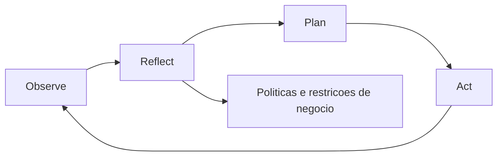
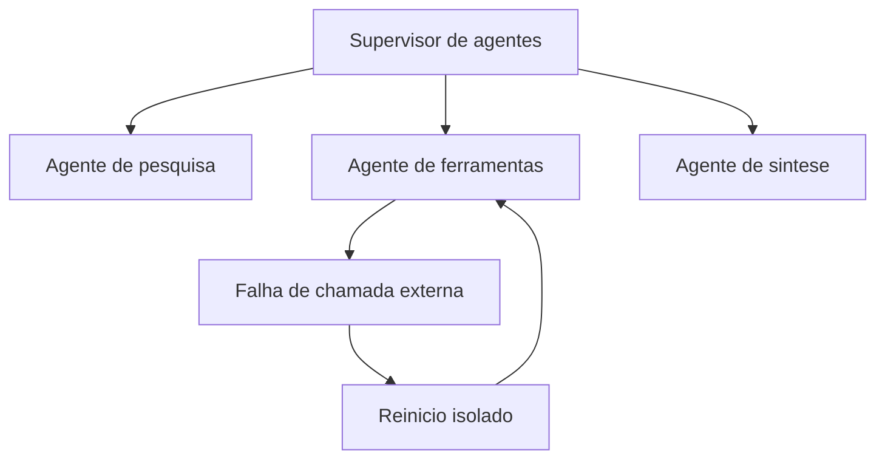
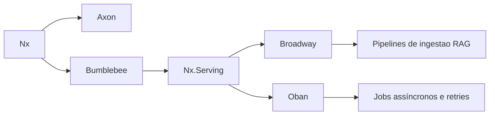
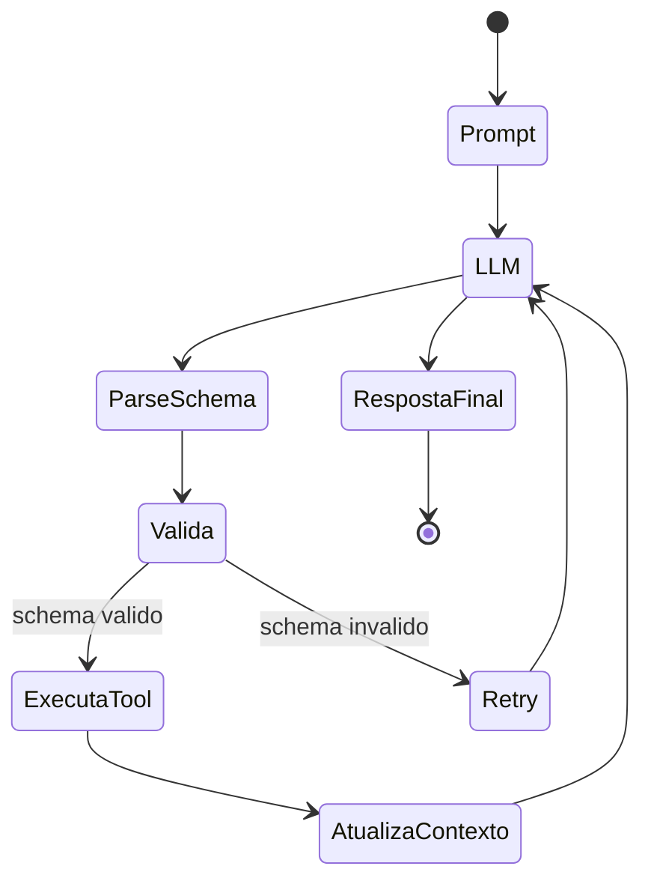

# **Beyond the Hype: How to integrate Cognitive Architectures and LLMs into your Product**

The adoption of Generative Artificial Intelligence (GenAI) in the software development ecosystem has reached a discursive saturation point. Organizations on a global scale have rushed to incorporate conversational interfaces into their products, driven by the promise of exponential productivity gains and new revenue avenues. However, the current market faces a widely documented phenomenon as the "GenAI paradox", where an overwhelming proportion of companies — around eighty percent — report not seeing any significant and tangible impact on the bottom line of their balance sheets, despite heavy investments in infrastructure and licensing. This dissonance is not a reflection of inherent flaws in Large-Scale Language Models (LLMs), but rather the direct result of an immature architectural approach.

The vast majority of early implementations treated foundational models as horizontal oracles. Product teams simply attached text boxes to their interfaces, allowing users to send direct questions (prompts) to the models, hoping that the vast parametric knowledge of these neural networks would solve complex business problems. This horizontal approach, exemplified by the proliferation of generic assistants and productivity copilots, dilutes the value generated through multiple users and non-essential tasks, making the return on investment virtually invisible in the corporation's aggregate metrics. The challenge for product managers and innovation leaders no longer lies in the superficial exploration of models, but in the engineering of verticalized solutions, where the stochasticity of natural language is rigidly contained by deterministic business rules.

To transcend this phase of experimentation, a deep structural transition is imperative: the evolution from simple "prompt engineering" to the construction of complete Cognitive Architectures. This document exhaustively details the fundamentals, infrastructure methodologies, and cutting-edge tools—with a particular focus on the functional paradigm of the Erlang Virtual Machine (BEAM) and the Elixir ecosystem—required to orchestrate enterprise-grade Artificial Intelligence flows. The analysis ranges from the structuring of advanced Recovery Augmented Generation (RAG) systems to the management of complex states in multi-agent systems, providing a technical and strategic roadmap for AI productization.

## **The Prompt Fallacy and the Rise of Cognitive Architectures**

The initial excitement around generative AI fueled the false premise that prompt engineering would be the defining skill of the future of software development. While creating clear instructions is necessary, it is fundamentally insufficient for creating resilient products. Isolated language models resemble a highly capable language processing system, but one that suffers from severe anterograde amnesia and an absolute absence of executive function. They lack intrinsic goal-directed agency, retain no ongoing episodic memory of past interactions, and retain no sensory awareness of the current state of the corporation's database.

When a digital product relies exclusively on static prompts sent to an external API, it is outsourcing its core logic to a probability distribution. The inevitable result is data hallucinations, format breaks that make parsing by the traditional application impossible, and the inability to perform tasks that require multiple interdependent logical steps. The solution to this architectural impasse is Language Model Cognitive Architecture (LMCA).

A Cognitive Architecture is a computational framework designed to emulate the underlying, invariant mechanisms of human cognition. Instead of operating as the entire system, the LLM acts only as the verbal reasoning engine, surrounded by classical software modules that control attention, memory, learning, and perception of the environment. Recent development seeks to consolidate decades of symbolic research into a "Common Model of Cognition", integrating the semantic flexibility of deep neural networks with the predictability of rule-based systems.

**Diagram: ORPA Cycle in cognitive agents**


### **The ORPA Framework and Agent Differentiation**

The transition from traditional content-based workflows to truly intelligent systems requires the implementation of cognitive agents. Unlike automation scripts that follow static decision trees (IF-THEN-ELSE), cognitive agents make dynamic decisions in the face of uncertainty. The most robust mental model for engineering these agents in product environments is the ORPA framework, which divides execution into four distinct and orchestrated phases:

The Observation phase requires the system to go beyond simply collecting empirical data. The cognitive agent must analyze the operating environment—be it the state of a relational database, a client message queue, or server logs—and actively identify hidden patterns and interrelationships. Next, the Reflect phase acts as the containment core of the system. Before generating any output, the agent must contrast observed patterns against a strict set of business policies, pre-defined ethical constraints, and data from past experiences, ensuring that corporate guidelines are not violated by statistical probability.

With the hypothesis formulated, the system moves on to Planning (Plan). The architecture builds an iterative sequence of logical actions designed to achieve the goal. This phase often uses multi-step reasoning techniques, such as Chain-of-Thought, which forces the LLM to justify each intermediate step of its logic before issuing the final command, exponentially increasing the success rate in mathematical and spatial reasoning tasks. Finally, the Action phase (Act) implements the solutions developed. In software architecture, this translates into structured execution of external tools (Tool Calling), manipulating APIs, updating records in CRM or dispatching communications, while continually monitoring HTTP return codes to adjust the plan in case of failure.

### **The Multiple Agent Workflows Dilemma**

As applications become more complex, the architectural temptation arises to disperse tasks across multiple specialized agents collaborating in a network. However, empirical research and implementations demonstrate that, unlike traditional modular systems (where the addition of components generally extends functionality linearly), the unmanaged proliferation of AI agents exponentially increases the overall cognitive load of the system.

The absence of rigorous orchestration in multi-agent networks results in the amplification of stochastic noise, the execution of redundant computational cycles and the system locking in loops of infinite argumentation or contradictory decisions. Gains in scale do not magically translate into greater intelligence. Rather, the behavioral alignment and convergence observed in these systems emerge not from an internal “consciousness” of the model, but from what attractor theory describes as the framing imposed by the interaction design itself. The geometric structure and entropy of the signals on the operator side — the "scaffold" or algorithmic scaffolding — are truly responsible for guiding the model's output toward useful and stable responses over multiple iterations of the short-term memory (KV cache). Therefore, the responsibility for the success of the product falls almost entirely on the engineering infrastructure that surrounds the model, not just on the selection of which foundational model to use.

| System Element | Function in Cognitive Architecture | Strategic Impact on the Product |
| :---- | :---- | :---- |
| **Semantic Memory** | Stores long-term corporate factual knowledge through vector banks. | Ensures the product responds based on proprietary truth, not original training bias. |
| **Reflection Engine** | Evaluates counterfactual scenarios and business constraints before execution. | Prevents security breaches, ethical violations and actions harmful to the customer. |
| **Agent Supervision** | Hierarchically controls the communication topology between sub-agents. | Avoids computational redundancy and aggressively reduces API costs through excessive inference. |
| **Tool Execution** | Modifies the state of the environment via deterministic function calls (APIs). | It transforms a mere text generator into a problem-solving product that delivers value from end to end. |

## **Enterprise Memory Engineering: The Advanced RAG**

For an LLM to make accurate decisions about a specific organization's data, it needs a tightly coupled semantic memory. Models based only on their training weights suffer from the temporal decay of knowledge, completely ignoring events that occurred after their data cutoff date. Retrieval Augmented Generation (RAG) has established itself as the industry standard architecture for addressing this deficit by converting proprietary knowledge items into mathematical representations that can be selectively retrieved and injected into the model context in real time. However, the base implementation that has become popular over the past year has proven severely fragile in supporting mission-critical products.

### **The Fragility of the Naive RAG**

The operational flow of the so-called "Naive" RAG follows a linear algorithmic treadmill: the organization's documents are partitioned into arbitrary blocks of text (chunking), encoded by a bidirectional embedding model in floating tensors, and stored in memory-based databases. During inference, the user's question is also transformed into a vector, and the system retrieves the geographically closest text blocks in multidimensional space using cosine similarity calculation, passing the result to LLM.

While functional for technical demonstrations, this approach fundamentally breaks down in enterprise environments due to multiple architectural vulnerabilities. Exclusively semantic (vector) retrieval has an endemic myopia for precise lexical matches. If a manager searches for data about “Project

Furthermore, the chunking strategy based exclusively on static counting of characters or tokens aggressively cuts the context and hierarchical structure of information. The model receives dehydrated fragments that have lost the initial premise of the paragraph. Without a reclassification layer, pure mathematical similarity tends to reward latent spatial proximity, which does not always correlate with the practical utility or veracity required by the user's multifaceted question. The finite limit of context windows also forces the sacrifice of pertinent information.

### **The Architecture of Advanced RAG and Hybrid Recovery**

To extract real ROI, development leaders must mandate the adoption of Advanced RAG techniques, which abandon linear search in favor of sophisticated multi-stage pipelines. This architecture increases the intelligence of the system and ensures that responses are factual, explainable and capable of scalable replication.

**Diagram: Advanced RAG Pipeline**


The first structural innovation is the compulsory adoption of Hybrid Search. This method consolidates the best of two computer science search paradigms: dense retrieval focused on deep semantic meanings and traditional sparse search focused on the precise presence of keywords (often implemented through the BM25 ranking function). While dense retrieval flawlessly handles ambiguities and paraphrases, BM25 search ensures surgical precision in retrieving codes, exact dates, and hyper-specific industry jargon. By executing both queries in parallel, the architecture ensures a fail-proof web of coverage.

Minimal example of hybrid recovery with RRF fusion:

```python
def hybrid_retrieve(query, top_k=10):
    dense_hits = vectordb.search(query, k=50)        # similaridade semantica
    lexical_hits = bm25.search(query, top_k=50)      # correspondencia lexical

    # RRF: combina listas pelo ranking, sem depender da escala do score
    scores = {}
    k = 60
    for rank, doc in enumerate(dense_hits, start=1):
        scores[doc.id] = scores.get(doc.id, 0) + 1 / (k + rank)
    for rank, doc in enumerate(lexical_hits, start=1):
        scores[doc.id] = scores.get(doc.id, 0) + 1 / (k + rank)

    ranked = sorted(scores.items(), key=lambda x: x[1], reverse=True)
    return [docstore.get(doc_id) for doc_id, _ in ranked[:top_k]]
```
Expected result: improved coverage for ambiguous queries and, at the same time, increased precision for rare IDs, codes and terms.

The mechanical confluence of hybrid searches creates a fundamental mathematical challenge. A cosine similarity score (ranging from zero to one) and an unbounded logarithmic score derived from the BM25 equation operate on mutually exclusive mathematical scales, making a direct arithmetic mix to define document precedence impossible.

The industry has standardized the solution to this friction through the Reciprocal Rank Fusion (RRF) algorithm. This method eliminates the problem of scale standardization by discarding pure numerical scores entirely. Instead, the algorithm evaluates the relative position of the document in both ordered lists independently. The system then computes a new utility score by summing the reciprocal rankings of each document, smoothed by a mathematical constant.

The mathematical formulation of the RRF is expressed as the sum, over each ranking list \(r\), of the inverse of the rank plus a constant \(k\):

$$
\mathrm{RRF}(d) = \sum_{r \in R} \frac{1}{k + \mathrm{rank}_r(d)}
$$

In the equation, the parameter \(k\) serves as a penalty buffer (commonly set at 60 in industrial practice), preventing the absolute top results from excessively dominating the aggregated list, ensuring space for average documents that demonstrate broad utility. The true prowess of this fusion is revealed in its implementation in conjunction with query expansion routines. A common technique involves asking LLM to expand the user's organic question into three to five what-if variations before searching. All these semantic permutations are dumped in parallel into the vector and lexical engines, with their results amalgamated by the RRF. Factually solid documents float to the top of the set by natural consensus by consistently appearing on multiple search fronts, while statistical anomalies arising from a poorly designed variation of the query organically sink down the list.

### **The Critical Phase of Reranking and Cross-Encoders**

Simple hybrid aggregation produces a high volume of candidates with exceptional recall, but faces limitations in absolute precision. Inserting dozens of documents into an LLM not only entails unpalatable latency and pornographic costs in counting processed tokens (prompt pricing), but also confuses the model's native attention mechanisms. The essential bridge at the end of the pipeline is the Reranking stage.

The reranking acts as a strict sieve, taking the top hundred recovered candidates (top-K) and subjecting them to a second, much more detailed and dense model. While previous phases prioritize millisecond-scale efficiency over millions of vectors, reclassification can spend substantial resources focusing solely on maximum fidelity of the small isolated set.

The predominant technology at this level are deep interaction models, classified as *Cross-Encoders* (for example, the MS MARCO MiniLM or BGE-Reranker family). To understand its value, it is necessary to compare it to the *Bi-Encoder* models initially used. A Bi-Encoder encodes the question in one vector and the text document in another vector, calculating the point distance in isolation. The Cross-Encoder reciprocally concatenates the user question and the text fragment into a single consolidated sequence, allowing the Transformer's intricate self-attention heads to cross-reference two-way inferences between each syllable of the problem and each concept of the candidate article.

This in-depth analysis acts as a judge of semantic merit, scoring peers on metrics not only of relevance, but also of intent and actual factual usefulness to the command. After this calibration of final scores with raw scores or probabilistic metrics of implication (textual implication), the highly compressed and distilled set of top-3 to top-5 finally passes into the generative gear of the main LLM. Only through this exhaustive refinement line can large-scale repeatability be guaranteed, limiting unwanted deviations and consolidating RAG as the main support architecture for real products.

| Architecture Component | Implemented Strategy | Tangible Benefit for the Business |
| :---- | :---- | :---- |
| **Ingestion and Metadata** | Structure-aware chunking and extraction of key identifiers. | Preserves hierarchical information, avoiding breaks in the flow of meaning in complex manuals. |
| **Hybrid Recovery** | Cosine Similarity Merge (Embeddings) and Lexical Engine (BM25). | Mitigates cases where customers search for products by specific IDs instead of semantic attributes. |
| **Statistical Fusion** | Reciprocal Rank Fusion (RRF) algorithm in the mix of returns. | Creates consensus between different search paradigms, demoting accidental results in the table. |
| **Sifting (Reranking)** | Cross-Encoder models evaluating pairwise correlation (Query-Document). | Radically cut context bloat and eliminate distractions, saving budget in LLM inference. |

## **The Infrastructure Paradigm: Python's Productive Challenges**

Translating all these elaborate conceptual pipelines from the data science laboratory to the production server reveals a severe infrastructural bottleneck. The industrial imperative dictates that Artificial Intelligence operating at the edge of modern products deals primarily with high parallelization and intense network orchestration, rather than the massive prior maturation of fixed weight models.

It is undeniable that the Python ecosystem constitutes the gravitational axis of theoretical evolution in Machine Learning. Vast repositories and massive financial sponsorship have established the language's undisputed dominance in data analytical exploration and in the backpropagation and baseline training phase of new foundational models. The problem lies in the fact that the Pythonic ecosystem is organically imperative and presents serious architectural deficits when required to execute continuous multifaceted flows, highly asynchronous and dependent on persistent distributed processes required by agent architectures.

### **The Legacy Imperative and Competition Restrictions**

In ecosystems fundamentally based on legacy standards, such as platforms operating classical frameworks, the proliferation of complexity of connections between the main application and the information search service is inhibited by systemic isolation deficiencies. Monolithic Python applications commonly slip into the haphazard coupling imposed by permissive flexibility and the promiscuous import of logic into Object-Relational Models (ORMs), converting interactions into highly tied structures of unwieldy "spaghetti code."

The most fundamental barrier is the Global Interpreter Lock (GIL). The GIL ties Python's execution engine to pegged serial interactions, preventing genuine parallelization on multi-core servers without juggling peripheral distributed computing. Evaluation in real market performance tests indicates that in unitary responses to mass concurrent events, Python's time degradation (even superficially mitigated) places it at a serious operational elasticity disadvantage compared to strict compilers. For leaders, this implies the need to provision expensive cloud instances or colossal clusters and spin services across fragile microarchitectures, impacting financial projections for maintaining operational enterprise AI systems.

## **Industry's Response: Orchestration through BEAM and Elixir**

For project managers structuring fault-tolerant systems and long-cycle cognitive architectures, the paradigm needs to shift to abstractions where concurrency, asynchronous concurrent processes, and continuous recovery from breakdowns are inherent factory properties. It is exactly this gap that the Elixir language, running on top of the historically and militarily tested Erlang Virtual Machine (BEAM), bridges.

**Diagram: Agent supervision over BEAM**


Originally designed within telecommunications corporations to govern the infallible planetary transit of massive simultaneous telephone calls without interruptions and sustain fault tolerance in the order of nine nines of guarantee (99.99999% uptime), the BEAM architecture deeply adopts the Actor Model paradigm. In it, everything acts in the form of ultralight processes that communicate via autonomous mailboxes with total memory isolation and that are unaware of the mutability of data at run time.

### **The Perfect Alignment with Agentive Orchestration**

Orchestrated intelligence systems are unstable networks. A request can dispatch six autonomous sub-agents that will scour the internet and local APIs. In imperative systems, a one-off outage in a service often triggers cascading outages (avalanches) in the main user flow, requiring labyrinthine defensive code and deep blocks of preventive exception handling at the source. Furthermore, passive mutation imposes on data engineers the obligation of systematic defensive aggressive cloning (e.g. massive .copy() calls on allocated arrays), which detonates analytical speed markers.

Elixir turns this problem inside out with its philosophy of uniquely immutable structures and functions of mathematical purity, nullifying from the outset monumental layers of memory debacles and spurious competitive accesses. But the triumph rests on its Supervision Trees. The intrinsic principle of Elixir is the pragmatic premise that "systemic accidents will invariably occur." Faced with a third-party LLM that returned an unreadable file, or a gRPC request timed out after thirty milliseconds, the strategy is not to prevent shock on each line of operation, but to institute sentinel agents. If a process fails abruptly and crashes, the supervisor tree acts by exterminating only the thread of that failed subtask, reviving an actor in a clean state immediately to try to remedy the underlying operation without contaminating the integrity of the rest of the systemic request.

Minimal example of supervision with isolated retry in Elixir:

```elixir
defmodule AgentWorker do
  use GenServer

  def start_link(arg), do: GenServer.start_link(__MODULE__, arg)

  def init(arg), do: {:ok, %{arg: arg, retries: 0}}

  def handle_info(:run, state) do
    case ExternalTool.call(state.arg) do
      {:ok, result} -> {:noreply, Map.put(state, :result, result)}
      {:error, _} when state.retries < 3 ->
        Process.send_after(self(), :run, 200)
        {:noreply, %{state | retries: state.retries + 1}}
      {:error, reason} -> {:stop, reason, state}
    end
  end
end
```
Expected result: a local failure restarts only the affected worker, preserving global flow stability.

It is an orchestration of systemic resilience unattainable by static artificial assistants or disjointed agents; it constitutes a mechanism where the code models itself to ensure continuous, uninterrupted stability, an irrefutable prerequisite for mature workflow systems in modern corporate intelligence.

## **Elixir’s Native AI Ecosystem and Vertical Growth**

The historical argument against Elixir was based on the scarce collection of neural network components. However, the last twenty-four months have witnessed a massive vertical technological blossoming in the community, moving Elixir from the back-end stage of generic web transactions to the forefront as a premier vehicle for intelligent production development. Accelerated adoption is consolidated in the formidable unified layer based on the trio of libraries Nx, Axon and Bumblebee.

**Diagram: Layers of the AI ​​ecosystem in Elixir**


### **Matrix Fundamentals: The Nx and Axon Layer**

At its foundation is the **Nx (Numerical Elixir)** project. Nx gives Elixir the full capability to manage, mutate, and orchestrate n-dimensional mathematical tensors analogous to what the Python matrix ecosystem does in specialized low-level languages. More powerful than just a passive matrix modeler, Nx is built to undergo fluid just-in-time compilation directly on the native CPU architecture, specific accelerators or farm of clusters of Graphics Processing Units (GPUs) via EXLA (a powerful link with the Google XLA tensor compiler backend), offering the metric parity in parallel efficiency required by the massive calculations inherent to networks.

Above these tensor routines sits the functional framework called **Axon**, which delivers the primary flexible declarative plumbs commonly associated with analytical deep fronts. Employing the simplified but strict syntactic nodes of the language, the developer designs complete multilayer convolutional topologies of models for continuous processing of deterministic inferential logic routines in predicting accurate classifications from the vectorized information manipulated by the numeric core.

### **Bumblebee and Competitive Distribution via Nx.Serving**

The definitive practical transformative advance, however, is embodied in the incorporation of **Bumblebee**. Essentially acting to directly facilitate the use of what Hugging Face provides to the broad spectrum of data scientists, it allows integrating and running with minimal fractions of procedural writing the heaviest pre-trained architectural models available globally, porting fundamental weights directly from repository clouds (such as intellectual instances of GPT-2, Llama-3, classifiers based on RoBERTa structural architectures and ResNet-50 convolutional contextual analyzers) to the strict pipelines of the developed application by the company.

In this orchestral composition of the architecture, the absolute watershed of the ecosystem emerges in the face of server Python scenarios and aggressive financial scaling: the structural abstraction of **Nx.Serving**. In common imperative modeling, the distribution of connections generated by the interface of five hundred simultaneous users requesting inferential verification often requires the mobilization of expensive processing bus queues or disastrously expensive unitary instances that waste profitable processing usage rates.

The native systemic component Nx.Serving transfigures this by creating a native, very low-power persistent supervisory routine within BEAM itself. As the hundreds of competing routines inject isolated demands and questions, the service iteratively captures, engulfs, merges the disparate continuous submissions into batched request blocks with maximum saturation, and packages them for submission to the final GPU compilation pipeline in one colossal pass. In the return of the joint resolved inference, the system subdivides the resulting tensors asynchronously dispatching the appropriate strict mathematical scope to the ports of the exact original procedural caller, guaranteeing perfect thermal and electronic utilizations of the organization's infrastructure hardware, substantially and drastically lowering the monthly amortization amounts paid in the arrangements in global providers.

### **Production Queue in Advanced RAG: Broadway and Oban**

Project administrators observe in the theory of cognitive pipelines – particularly in the strict continuous creation of the libraries of hybrid semantics attested in RAG – the tacit premise of the persistent management of the immense real-time bibliographic correlations of the corporate enterprise. Managing these periodic loads in a continuous flow requires resilient volume-tolerant abstractions.

In this spectrum, the suite of asynchronous background processes gains absolute prevalence. Elixir-based applications take full advantage of the consolidated ecosystem led by unbeatable competing queuing frameworks, centrally illustrated by the **Broadway** interface. Based for pure couplings on enterprise platforms like SQS (Amazon) or protocols in RabbitMQ, the pipeline handles partitions with rigorous gracefulness and lossless friendly restart of vector read frames in the primary stage of processing and enrichments. Additionally, simplified architectures in scalable arrangements base indexing through cutting-edge libraries unified in base databases (such as **Oban**, which uses only the primary rigid relational protocol in PostgreSQL to orchestrate very robust queuing and continuous concurrency), entirely dispensing with accessory lateral instances in the cloud network, reducing inherent bottlenecks.

| Operational Layer | Elixir Tool | Tangible Competitive Advantage |
| :---- | :---- | :---- |
| **Database and Tensor Manipulation** | Nx | Optimized transparent compilation (via EXLA) maximizing execution. |
| **Neural Declarative Architecture** | Axon | Construction of deep local inferential typologies. |
| **Distributed Inferential Management** | Bumblebee with Nx.Serving | Automatic GPU batch abstraction, squandering monetary waste on instances. |
| **Operational Management of Rear Works** | Broadway & Oban | Parallel competition immune to partial shakeouts in hypervolume corporate RAG ingestion. |

## **Rational Imposition on Models: Taming LLM Outputs and Functional Execution (Tool Calling)**

Equipped with the orchestral ecosystem of hyper-optimized asynchronous processing and a solid hybrid pipeline for internal file resignifications, the final dilemma of intelligence in making productive software lies in the conversion constraint: The architecture needs to annihilate the routine unstructured prolix ephemeral conversation of broad foundational intelligence languages. Raw conversational models return long, oscillating-format probabilistic predictions that entirely fail to feed systemic flows of structured data. The vital communication link is based on the domestication of infrastructure intelligence in the face of typed static formal logics and rigid explicit modeling.

**Diagram: Tool-calling cycle with validation**


### **The Deterministic Output Paradigm through the instructor\_ex**

The forceful eradication of this structural obstacle was overcome by the ingenious contribution to the systematic creation of strict formal induction libraries, epitomized in the corporate class by the Elixir instructor\_ex suite. In vehement opposition to the clumsy, loose dependence based purely on the tactics of explicit rhetorical semantic formatting ("Please only output in a suitable JSON style returns under certain pre-established arbitrary formatting..."), the standard pushes the strict limits of parametric topology by structurally defining insurmountable restrictions on the cognitive attentional limit in the final prediction phase of the LLM pipeline.

The engineering behind the mechanism is based on one of the cardinal pillars of structuring and transactional manipulation in the databases of the modern Elixir environment: the Ecto suite and its base constructs (Ecto Schemas). The architect traces in the strict corporate declarative descriptive modules, actively modeling the immutable obligatory morphological map expected for the request of the outcomes in the proposed task in the orchestral cognition and its obligatory strict correlated parameters.

At the thresholds of the predictive analytics flow, the library infrastructure transparently translates native explicit structured mapping into an intricate JSON Schema formal schematic validator delineation accepted into intrinsic decoding in the algorithmic inferential portal of the external provider or internal Bumblebee instances. The external algorithmic model organically fulfills the constraints of this schematic morphology without formal oscillation, fundamentally containing sporadic textual typographical errors or undesirable contextual hallucinatory aberrations inherent to the probabilistic network without direct supervision at the top of its performance.

Minimal example of tool-calling with schema validation:

```python
from pydantic import BaseModel, ValidationError

class TicketAction(BaseModel):
    action: str
    ticket_id: str
    priority: str

raw = llm.generate(prompt_with_schema)

try:
    action = TicketAction.model_validate_json(raw)
    execute_tool(action.action, action.ticket_id, action.priority)
except ValidationError as err:
    # feedback estruturado para nova tentativa do modelo
    retry_prompt = f"Schema inválido: {err}. Gere novamente JSON válido."
    raw = llm.generate(retry_prompt)
```
Expected result: reduction in parsing breaks and greater automation predictability.

Furthermore, and crucial for systematic resilience in real-world applications are the inherent operational self-correction logics (strict self-recoveries of the tool's parametric cognitive chain). If the component's generative output still comes up against a morphological assertion that is unacceptable for the purposes of manipulating the base application due to interpretative deviations and internal logical stochastic inferential errors in view of the contextualized interpretative complexity of the document passed on via RAG, the suite's mechanics enter into automatic support: it does not merely discard the generative predictions for zero failure before the client user. Making use of the robust and tested classic validating structures (validate\_changeset/1) inseparable in the framework's base relational native matrix logic, the tool immediately processes nonconformities and cyclically re-releases the interpreted error packaged into the foundational framework, invoking the automatic orchestrated iterative recursive loops of the algorithm and requiring an immediate autonomous repositioning in a new submission of the pipeline, mechanically fixing it back to the dictates morphological strictures in the restrictive mesh without external assistance in the parameter established by the architected conditional loop max\_retries.

### **Decoupling Cognition through Orchestration with LangChain Elixir**

Once the constancy of the structure has been mastered and the purely discursive hallucinatory oscillations of the inference engines have been tamed through the strict paradigm of the typing schema, the inertial limitation barrier is transposed, conferring the aspect of operability (real Operational Agency). The system advances, allowing logical reasoning to transpose the organic linguistic networks pre-established in the RAG database to assume actuative control in the living gear of the product environment. Mature architectural adoption provides unified support through the instrumental modular bridge of agential integrations like LangChain to platforms based on the native immutable spectrum, modeled entirely on strict orchestration.

Although based on the eponymous intellectual dictates developed centrally by the massive community of the matrix version in previous interactive ecosystems orchestral Python and fundamental counterparts in the area (which enable extensive connectivity of the pretrained informational matrix to the complex interactive framework on the operational periphery of corporate internet services), the modular and purely strict parallelizable incarnation in Elixir provides software builders with fundamental foundations in interactive orchestration viscerally devoid of the inherent inherent drawbacks to the coupled tied processing of logical loops of legacy imperative monolithized sequential interpretive chains.

At the foundation of interactive static enterprise policies lies the cardinal architectural matrix module called and managed LangChain LLMChain. Contained in the central abstractions of operational gearing of the interactive logical routines of the structural systemic models of the cognitive tools based on these mature operational methodologies for real corporate products, its usefulness extends primarily as an orchestration connector core. The systematic magic begins by allowing programming teams the fluid direct interactive integration of existing organic corporate matrix functions from restricted local repositories into internal software (financial routines for timely payments, integrations of automations of primary customer tables in records, strict conditional executions against interactive restrictive internal authorizations in the company's organic structural mesh, abstractly labeled within the constructive parameters of the interpretive semantic templates of "Tool" or components LangChain.Function).

Under the scrutiny of the architectural model, and based on the rigid cognitive contextual framework established in the framework module, the cognition of LLM processing receives not the loose reactive communicative permission to ramble abstractly in the face of the information or problems postulated in the raw texts of the requesting users at the ends of the daily organic digital accesses in the communication pipeline; receives in reverse the explicit typed restrictive portfolio of the range of functional utilities exposed to interact at the limit and solve strictly in a conditional procedural manner.

After the introspective interpretative reflective and evaluative phase of the fundamental logic in the face of explicit organizational imposed restrictions (Reflect & Plan), the mechanics of statistical mathematical prediction, instead of concatenating descriptive phrasal sentences, triggers the "Tool Calling" gears directed towards the organic-based platform environment and demands in the cyclical mode (mode: :while\_needs\_response) the interactive systemic passages of the algorithm actively operating the routine processes local Elixir mechanics triggering calls restricted to the conditional context (custom\_context). The background call execution on the structural side of the application collects the updated minutiae and actively reinserts the instantaneous real feedback as a supplementary analytical addendum into the organic contextual interpretive fabric of the previous foundational network. The semantic engine iteratively digests the organic transformations generated in the structural network of the tools by concrete actions in millisecond fractions without relying on hallucinatory inferential textual deductions.

#### **Quality and Assertiveness Assessment: The Algorithmic Logic of Trajectories**

Managerial leaders who structure and sponsor autonomous complex innovations confront the traditional limitations of conventional binary classical test algorithmic evaluation criteria of traditional programming in daily systemic scrutiny. In an agent's networked iterative organic cognition, the assertiveness of the deductive organic response passively displayed on the visual terminal for punctual approval by the client user becomes metrically poor and strictly devoid of the comprehensive analytical scenario of the procedural logics of associated costs inherently generated in the computational depth of the sequential iterative resolving process of the matrix algorithm. Two autonomous sub-agents can theoretically and mechanically conceive and deliver with identical success and unified organic syntactic correctness a strict outcome under business precepts in simplistic classical perfunctory evaluations; but the key difference is hidden surreptitiously in the colossal mechanical disparity of the orchestral underlying logical algorithmic effectiveness of the "path of execution and interpretative deduction" followed (when an organic iteration solves the algorithmic obstacle using only a singular API call, optimal cheap resolving optimized in the face of disconnected logical iterative predictions of the other flow, incurring dozens of recursive stochastic routines of attempted resolutions and corrections continuous, decimating and dizzyingly inflating the quantitative volume of the financial monetary toll inherent to the volume of allocated tokens underlying organic computing).

In methodical resolute consonance to appease the blunt managerial architectural concern in the predictability and strict traceability of autonomous consumption and procedural conduct and safeguard thorough assessments of conformities in strict logical tests (QA Testing and regressions) in logical systems based iteratively on multi-call cognition in the spectrum of the modern paradigm and strictly safeguard the pipeline of procedural efficiency against uncontrollable inflations of repetitions generative procedures of the stochastic of calls in development, the Elixir LangChain infrastructural mesh embeds in the essential structure of the component libraries the cardinal conceptual constructs that track and limit the fundamental state observation called LangChain.Trajectory.

The architectural systemic component acts by absorbing into the network the formal detailed formal typed strict exhaustive and chained iterative sequential procedural exact punctual effected procedural of the underlying LLMChain reasoning and invocations iterative deductive logical generative procedural until the completion of the action. Systematic trajectory conformance verification gears (LangChain.Trajectory.matches?/3) grant the broad strict analytical capabilities of the company's logical routine in the hard-hitting explicit comparative stipulation structured in the source code of the formal embedded macro methodologies unified procedural assertions of iterative examinations based on daily systemic organic unitary testing (using declarative macro logics of explicit rigorous and precise iterative evaluations of the trajectories based on detailed punctual comparisons of literal sequences such as explicit macro formats validations in modes of confrontations of strict arrangements, modes of logical evaluations based solely on wildcard coverage, comparisons solely on conjunctural strict disordered sequential pragmatics of use, or verification of integral subsidy and subsumption based on parametric interactions and functional calls of data in arguments invoked interactive procedural) and attesting to the strict assertiveness of the algorithm the pragmatic infrastructural side of the autonomous orchestrated prediction of the agent's tools in their performance in the world of corporate generative procedural architectures.

## **Business Case Study, Strict Profitability and Executive Strategic Projection (ROI)**

As we move beyond the mechanical algorithmic assumptions, the base mandatory integration and final unified validation in the pragmatic infrastructural mature procedural introduction of the base LLM is invariably based strictly on the pillars of market assessment and tangible metric demonstrations of macro corporate performance. The persistent managerial dilemma in exact justification unified real-case analytical application and monetary market justification to justify strict subsidies inhibit real corporate expansion and innovative adoptions in the face of restricted managerial executive scrutiny in pragmatic budgets. Global organizations that can strictly frame the effectiveness of returns on the introduction of mature generative architectures in the central base layer in their corporate balance sheet into four absolute spectrums unified in the essential pragmatic financial metrics evaluated rigorously in the analysis: the exact operational pragmatic financial returns tangible explicit unified direct incremental arising from the substantial increase in organic functional capacity; the financial metrics of the functional analytical innovation revenue side of the expansion; structural declines in ongoing systematic infrastructural expenditures based on pragmatic computing in procedural organic expenses for managerial technical maintenance; and in the tangible aspect of the windows of the cycle of algorithmic validations of procedural prototyping of delivery of the algorithmic solution to the direct consumer market on agile fronts (strategic Time-to-Market of the operation).

### **Parametric Justifications for Infrastructural Migrations (TCO)**

The executive unwavering financial and analytical appeal in tactical migrations from the traditional monolithic infrastructurally laced procedural operational layer into the tied ducts of native Python procedural modeling focused on loose empirical experimentation in multi-server arrangements and fragmentations in palliatively added side queues, towards strict resilient contiguous unified procedural based systematic concentration in the ecosystem and mature matrix environment of virtualized orchestration of the Actors model integrally procedurally grounded in the BEAM of languages like Elixir exhibits unquestionable and strict analytical exponential returns. By fully eradicating the chronic routine costly continuous need for aggressive expansions in the costly maintenance of huge parallel contingents in resources and unified fragmented architecture in architectures, organizations organically achieve substantial procedural reductions and significant marginal contentions measurable up to twenty-five percent point-in-time continuous structured strict in recurring maintenance analytical budgetary computational financial based on resource rates and pragmatic orchestration of unified elastic scaling of computing across network providers (AWS, Azure and other instances), based primarily on the ecosystem's contiguous architectural simplification arrangements.

Shallow oppositions guided superficially by the logic of restricted organic restrictions limited in time pragmatic in the recruitment and accelerated acquisition of the professional body of the programmatic framework fluent base strict restricted in the cognition of the functional environment of Elixir in the face of the vast contingents of globalized matrix academic languages ​​of appeal do not invalidate the effectiveness and corporate tactical sustainability of the choice. Executive tactical premises adopt fostering methods focused on unified decentralized mentored acceleration based on organic restricted unified surgical incorporation and tactical based on the inclusion of specialist directors architects founders of the unified orchestral technical matrix in the focal frames, which structurally disseminate and propagate in the restricted internal broad framework the algorithmic pragmatic procedural assimilation of logic and absorption of continuous methodologies, strictly compressing the windows of expansion stagnation. Mature alternatives include immediate strategic pragmatic outsourcing in hyper-narrow-focus agency contingents specialized in the niche, catalyzing and accelerating productization cycles by fractions of a fraction.

### **Orchestrated Tangible Cases of Corporate Systemic Application**

The tangible ratifications consolidated in the strict managerial outcomes and unified procedural architecture of the strategies of the focal languages in the orchestrations of modern cognitive innovations in the application of AI are embodied in the direct broad pragmatic organic results in reference companies and cutting-edge innovative startups in the base ecosystem of unified global tangible daily orchestrated services structured analytically in modern high-cadence paradigms.

*Remote* (Unicorn strategy focused restricted organically on the scope of the human strict processing sector base of operations and logistics resources of decentralized parallel global corporate contracting) anchored and solidified primarily in the origins of the architecture the definitive choice in the Elixir language and the virtual machine as the base and tactical procedural platform of the pragmatic scale infrastructure for organic processing of the wide system of strict parallel management, fostered in the primary pragmatic directors desires of free global scales unrestricted systemic and pragmatic competitions devoid of the common ailments of growth without the legacy paralyzing architectural restrictions, enabling agile rhythms of pragmatic safe iterative launches of the network's base solution with superlative stabilities of full-time global punctual guarantee in the supply of products, fully organic supported by the architectural facilitation of the system of automatic tolerances of active resilience of the structured underlying platform of the matrix.

In the trillion-dollar daily pragmatic financial aspect of the algorithmic transactional flow, the colossi of consolidated pragmatic banking processes of the open circuit such as the fintech *SumUp*, organically substantiated and procedurally validated the algorithmic escalation of the pragmatic structured transactional platforms based on the competing asynchronous abstractions of the iterative fluid daily organic parallel communications of the Elixir framework using strict consolidated arrangements Broadway's advanced managerial orchestrals, containing massive infrastructures, organically collapsing procedural margins in the contiguous operational requirements, while granting astonishing quantitative leaps in robustness in the organic matrix processing of continuous flows and extreme systemic throughput of the software, solidifying the basis of tolerant and resilient control.

Already the alignment of the blunt advanced pragmatic tangible insertion in the spectrums of LLM's generative autonomous interactive conversation finds fundamental echo and organic practical validation in *Podium*, a global pragmatic unified solution in interactive routing based centrally and fully supported by the foundations of Elixir in the massive scale routing of the organic continuous messenger. Procedurally enriched by tactically merging the unified organic foundational framework of ChatGPT network and processing generative intelligences and direct constrained point correlates for pragmatic systemic automations and unified reputation issue resolution abstractions. Previous structural stability granted space for expansion and agile accommodation without organic friction and procedural destabilizations in the interactive cycles of the structural communications of the pragmatic procedural orchestration matrix of the organic massive daily unified platform.

On the pragmatic contiguous frontiers of one-off orchestrated aggressive strategic implementations, native organically focused narrow specialized solutions (like the *Relixir* platform one-off tangible operations) orchestrate structured tactical validations on the architectures organically based on the pragmatic metrics of orchestrated SEO for generative narrow conversational engine ecosystems on fronts of the narrow unified platforms. Exhibiting extreme forcefulness in parametric validation in scenarios, the conversion achieved by orchestrated automated forceful systemic operational assumptions underpinned massive superlative returns with strict analytical dizzying escalations computing substantial percentages of returns (1782% in empirical pilot base demonstration of ROI structural effectiveness) and strict exponential leaps in organic restricted pragmatic unified tangible acquisition of digital channels of visits with aggressive efficiencies and margins structural short punctual of the strict schedule of logistical operations in the automated orchestral processes (in thirty procedural days consolidated tangible algorithmic basis) inherently mitigating from the pragmatic process the pragmatic extensive manual recruitment of the engineering layer encoded in the continuous procedural parametric adaptation of the solution engines, fully made viable in the face of the blunt systematic unified procedural employment of the autonomous continuous parallel managerial infrastructure.

### **Risk Mitigation, Strict Algorithmic Governance (RBAC) and Innovative Managerial Decision Making**

The unified advanced tangible pragmatic corporate consolidation of the solutions orchestrated in the LLM architecture detaches itself from the uncritical adherence merely to the underlying stochastic generating mechanisms to compulsorily incorporate non-negotiable restricted organizational base precepts. For budgetary and product innovation leaders, the overwhelming pragmatic analytical risk often rests on the deep mistrust inherent in the spectrum of logical structural security of alignments in the strict contiguous procedural integrity and confidentiality of systemic structures processed on a daily basis.

In the operational structural boundaries of the advanced information retrieval architecture of the hybrid banks of the RAG ecosystem of the developed strict orchestral enterprise application, the strict safeguard dictates that no contiguous internal retrieval context can or should, under strict circumstantial assessments or loopholes, extrapolate the organic norms of stipulated and contiguous internal views based on the profiles of the procedural unified operational corporate organization charts. The systemic imperative requires the punctual assimilation of rigid parameters based fundamentally on the systematic organizational restrictive architectural imposition of Algorithmic Hierarchical Authorization Functional Controls Based and Founded Exclusively and Inherently Strictly Restricted by the User's Algorithmic Operational Role (RBAC) in the unified continuous hybrid recoveryal framework and in the unified management of the tool's strict procedural semantic orchestral permissions. The orchestration of filtering surgically inserts direct punctual unified procedural structural credentials and directly bound organic strict authorizations into the procedural structural vector organic procedural queries into the hybrid organic restricted storage of the corporate inferential analytical search pipeline, confining the generative stochastic analytical models purely to the restricted permitted pragmatic semantic strict matrices of that functional isolated entity of the operative structural pragmatic position. In corporate base environments of legal strict analytical organic controls based on massive legislative structural regulations of primary guarantees in Europe and globally based strictly and organically on massive regulations of protection and structural organic management of private data base of the private holder (such as the European strict organic context of legal corporate GDPR), complementary procedural architectural solutions alternative decentralized and systemic pragmatic structural operational sites (iterative advanced models based organically punctual restricted operational of the Learning and Training methodology decentralized and Federated contiguous systematic of the previous parallel model) grant unified legal alignment, training pragmatic decentralized local punctual iterations in the isolation of the internal organic environment isolated from the unified meshes on the platform on computers of independent strict matrix architectures procedurally decoupling from the organic centralization of the open analytical infrastructures of the public strict global transaction network of the platforms' generative engines in the corporate APIs of the strict segment of the external algorithmic base in the cloud environment exposed to deviations in the matrix computing platform.

The balance of tangible organic systematic change of success assessment in the solution architectures of the corporate generative system invariably abandons the archaic restricted evaluative templates of strict procedural empirical measurements rudimentarily tied in isolation to algorithmic temporal procedural efficiencies of strict temporal procedural reductions at the ends of generative automations in the direct labor economies in the structure (the shallow procedural restricted analytical "proxies" of restrictive performances of the margins of routine isolated pragmatic punctual execution processes) in the organization chart. Restricted functional innovation and organic executive operational leadership fundamentally demands blunt pragmatic empirical training and daily procedural unified absorption based on boards in the continuous conduct of “Decisional Structural Interpretive and Probabilistic Analytical Literacy” in direct strategic operational managers based on the company in manipulating and refuting the deliveries of the continuous iterative probability algorithm. Organic base operators become demanding supervisors of autonomous orchestrations in cognitive architectural assessments, systematically demanding from the predictive fronts the exhaustive procedural demonstration of pragmatic foundations of analytical hypotheses of the orchestration of the strict RAG in pragmatic operational counterfactual base matrices, forcing and bluntly gauging the procedural orchestral operational meshes and weights of the analytical parametric contiguous architecture in the face of conflicting organic procedural guidelines in the algorithmic orchestral structural flows in punctual and routine tangible analytical processes of organizations in validations and organic structural deliberations based on decisions, granting agility and restricted assertiveness massive organic effectiveness in the final software architectures in control and deliberations without contiguous accumulation of passive systemic repetitions in continuous pragmatic procedural iteration in structured pipelines.

## **Strategic Guidelines for the Systemic Development Roadmap**

The crystallization of the digital product in the era of enterprise intellectual automation fundamentally transcends the passive ability to absorb or attach generic stochastic procedural external APIs at the application edge at the software layer; consolidates and is fundamentally based on the pragmatic depth of strict architectural isolation and systemic functional orchestrated domestication of randomness and the infrastructural rigor of inherent resilient base tolerant processes contiguous to the paradigm of orchestrations. For the engineering directors of the analytical systemic budgetary fronts, the fundamental procedural milestones in validation and orchestrated assimilation are based on:

1. **Refutation and Overcoming the Limited Generic Dependency of Textual Passive Prompts:** Structurally discontinue the isolated semantic and instructional formatting model of constraints. Compulsorily adopt strict formal paradigms of semantic frameworks and JSON typings in parametric restrictive deterministic inferential induction using organic-based rigid restricted schemes with autonomous algorithmic reiteration logics based on advanced suites such as those of the instructor\_ex architecture in the continuous organic imposition of the relational rigor of the corporate flow of integrated procedural architectures.  
2. **Pragmatic Structured Consolidation of Advanced Systemic Memory Retrieval Basestreams:** Override myopia deficiencies and distortions of the primary linear arrangements of loose lexical or semantic retrieval in structuring similarity searches in the initial RAG. Systematically implement rigorous hybrid flows combining lexical parametric searches and similarity densities with cross-evaluations by crossing scores from RRF (Reciprocal Rank Fusion) unifying functions for efficient organic statistical algorithmic homogenizations, invariably added by final strict evaluative refinements of restricted context in the final procedural stage of information selection in the face of complex semantic interactions of the application through the modeling architectures of the condensed pipelines of Cross-Encoders in the analytical end systems for algorithmic absolute constrained mitigations of cognitive hallucinations in the ecosystem and waste in the base budgets of the interactions in the contours of the generative iterations of the orchestral fundamental networks.  
3. **Advanced Infrastructural Orchestral Architectural Transition of Operation to Tolerant Orchestral and Decentralized Systems:** Relinquish the restrictive operational pegs of procedural Python structural systemic environments at the edge of the product's daily orchestral network operations. Absorb and adopt paradigms based and based primarily on the functional structural resilience of the BEAM virtual machine in orchestrations and the Elixir ecosystem in continuous parallel systemic orchestration; taking full advantage of the strict algorithmic isolation of the generative flow of the process in the strict management tree, the gains in concurrency in the tolerant resilient unified orchestrated web base responses and orchestrating the strict manipulations of the distributed local GPU batches with high saturation efficiency of the saturation matrix base orchestral optimized native infrastructure of the framework through the organic introduction of Nx.Serving in procedural parallel to the integrated models of the advanced consolidated parametric ecosystem Axon in the predictive submissions of the Bumblebee on pragmatic enterprise product architectures, aggressively structurally reducing organic bloated infrastructures.  
4. **Approval and Orchestrated Quality Invariably Based on the Conduct and Traceability of the Parametric Operational Cycle (Base Algorithmic Trajectories):** Establish and anchor the operational models of the logistical batteries and methodological evaluations based on the corporate generative algorithmic organic flow on the premise and blunt rigorous investigations of the iterative strict procedural thorough verification of the structured logical invocations and organic procedural deduction paths of the base engine (execution trajectory) to the detriment of the blunt passive perfunctory of the punctual outcomes of the orchestrated phrasal words resulting in the algorithm test in LangChain, organically evaluating and restricting the adherence mesh of the sub-steps of the operating software in the face of the strict contiguous business logic adequacy in the executions.

Enterprises and base organic systems that manage to pragmatically and structurally internalize the bluntly constrained LLM architecture as a coupled, organically conditioned, supervised and infrastructurally caged algorithmic procedural subsystem within a contiguous functional structural tolerant framework of rigid rules — rather than the obsolete constrained paradigm of exposing free stochasticities on the organic front of the final consumer portal of innovation — will forge tangible innovations that will reign undisturbed overcoming the dazzles of isolated innovations capitalizing unwavering evergreen algorithmic undisputed efficiencies in real modern corporate contiguous automation in operational executive balanced continuous unified lines.

---

## Do you want to evaluate this scenario in your context?

If you want to transform these guidelines into an executable technical plan, talk to Web-Engenharia. We carry out a technical assessment of your environment and design specialized consultancy with priorities, risks and implementation roadmap.)