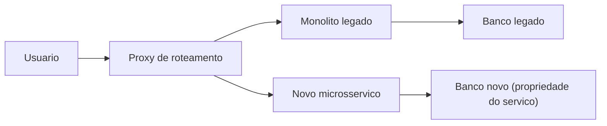
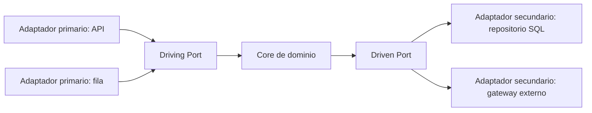
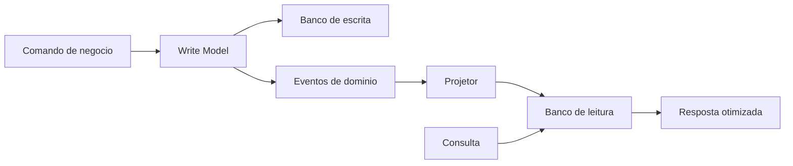
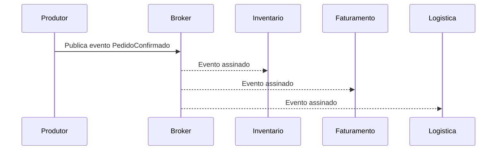
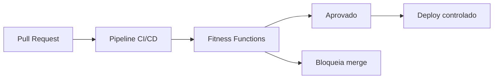

# **Building Resilient Systems: The Business Value behind Event-Driven Architectures and CQRS**

## **The Imperative of Strategic Modernization**

In the contemporary digital scenario, the agility of software architecture transcends mere technical efficiency to consolidate itself as a primary competitive differentiator and an imperative for business survival. Organizations across industries face inexorable pressure to innovate, adapt to volatile market demands, and deliver real-time user experiences. However, this acceleration collides violently with the reality of legacy infrastructures. Systems built decades ago operate like corporate anchors: they are inflexible, dangerously expensive to maintain, and often incompatible with modern integration and scaling requirements. For Technology Directors (CTOs) and Technical Leads (Tech Leads), the administration of these systems translates into a daily struggle against performance bottlenecks, prolonged implementation cycles and suffocating technical debt.

The modernization of legacy applications is no longer seen as a purely operational cost center to be understood as the unlocking of strategic value. Monolithic systems, where the user interface, business logic and data access layers are intrinsically coupled and run in a single process, present severe limitations when scaling is necessary. Tight coupling dictates that if a single functionality requires more computing power, the entire application must be replicated, resulting in chronic waste of cloud resources. Most critically, the monolithic architecture amplifies the "blast radius" of failures: an error in a reporting module can exhaust server memory, bringing down the critical payment processing system.

The transition to reactive, modular, and evolutionary architectures — with particular emphasis on Event-Driven Architecture (EDA), Command and Query Responsibility Segregation (CQRS), and Hexagonal Architecture (Ports & Adapters) — proposes a systemic cure for these architectural pathologies. However, this journey requires a profound paradigm shift not only in writing code, but in the way organizations view software engineering as an economic asset and in the way they structure their teams and operational processes.

## **The Economics of Modernization: Measuring Technical Debt and Return on Investment (ROI)**

To justify moving from crystallized architectures to complex distributed models, technical leadership must articulate the benefits in compelling financial language. Technical debt should not be treated as an abstract engineering concept, but quantified as a real financial liability on the organization's balance sheets, accruing "interest" through degradation of code quality, system failures, loss of development speed and team burnout.

Assessing Return on Investment (ROI) in modernization initiatives requires a forensic analysis of the current state. Consider the common scenario of a corporation operating a two-decade-old enterprise resource planning (ERP) system. The annual costs associated with this system often exceed hundreds of thousands of dollars, encompassing exorbitant vendor support fees for maintaining obsolete software, opportunity costs tied to unplanned downtime, and substantial lost productivity for engineers struggling with an incomprehensible code base.

When quantifying the impact of modernization, organizations often witness transformative financial metrics. Healthcare organizations that implemented modernization strategies achieved a 206% ROI over three years, with the payback period occurring in less than six months. These results were made possible by direct gains of 30% in the productivity of IT operations teams. Risk mitigation also translates into formidable financial benefits: studies indicate a 50% reduction in exposure to security breaches and decreased regulatory compliance costs through automated processing.

### **Speed ​​Metrics and the Evaluation Horizon**

The most significant impact of modernization is manifested in the exponential increase in the speed of development. Organizations often see the delivery rate of new functionality double or triple after consolidating an architecture based on well-defined microservices. This enables the same engineer count to deliver orders of magnitude more in commercial value, drastically reducing *time-to-market*. If a competitor is able to launch a new capability in two weeks due to its event-driven architecture, while your organization requires three months to change a fragile monolith, the benefits of modernization far outweigh the cost savings, directly impacting market positioning and revenue.

However, articulating this ROI demands metrological rigor. The main flaw in transformation projects is the absence of rigorous baselines captured before modernization begins. Leadership must document deployment frequencies, *Lead Time* for changes, Mean Time to Recovery (MTTR), defect rates and granular infrastructure costs for at least three months pre-modernization.

| Modernization Phase | Cost Dynamics | Impact on ROI (Horizon 3-5 Years) |
| :---- | :---- | :---- |
| **Year: Transition** | Most High. Reengineering effort and infrastructure costs in parallel (Legacy \+ New Systems). | Negative. Capital intensive investment. |
| **Year: Optimization** | Average. Instance resizing and legacy phase-out. | Breakeven. The gains in speed and resilience begin to outweigh the transition costs. |
| **Years 3 to: Steady State** | Low. Purely usage-based infrastructure (*pay-as-you-go*) and high automation. | Massive return (200% to 304%). Total agility. |

Economic evaluation of infrastructure decisions and cloud platform changes should not be based on 12-month windows. Over short horizons, the cost of parallelism makes any migration seem unfeasible. However, when projecting costs for the third to fifth year, the financial turning point becomes evident, showing that modernization is the technological investment with the greatest absolute value in the long term.

## **Decomposition Strategies: Deconstructing the Monolith without Interruptions**

Once the migration has been decided and the budget secured through a data-driven business case, the primary technical challenge is to execute the replacement without disrupting current operations. The "Big Bang" approach—which prescribes rewriting the entire system behind closed doors and switching all traffic in a weekend maintenance window—is universally recognized as the highest risk and failure rate strategy in the industry.

Mitigating this risk requires rigorous adoption of incremental migration standards that treat *zero downtime* availability as a non-negotiable constraint.

**Diagram: Incremental decomposition with Strangler Fig**


### **The Strangler Fig Pattern and Domain-Driven Design (DDD)**

The definitive methodology for securely throttling legacy systems is the *Strangler Fig* Pattern. This strategy proposes the development of new microservices on the periphery of the old system. A routing layer (proxy) intercepts all incoming requests; if the requested functionality has already been migrated, the request is directed to the new microservice; otherwise, it is routed back to the monolith.

Executing this pattern requires halting new development (feature freezing) on ​​the monolith, forcing any new business capabilities to be built on the new architecture. Next, the identification of extraction candidates is guided by the principles of *Domain-Driven Design* (DDD). DDD dictates that microservices should not be partitioned by technological layers (one service for Database, one for UI, one for Business Rules), but rather sliced ​​vertically around "Bounded Contexts" that represent tangible business capabilities, such as "Catalog Management" or "Payment Processing". Strict isolation allows each context to define its own language ubiquity and have autonomy over its life cycle.

The absolute imperative of DDD in decomposing microservices is decentralized data ownership. A microservice must have exclusive ownership of its database, being the only component allowed to write directly to its schema. The harmful practice of extracting application logic across dozens of services while they all continue to connect to a shared monolithic relational database creates the "Distributed Monolith" anti-pattern, which combines the worst attributes of network latency with the inability to scale individual components in isolation.

### **Critical Data Migration and Shadow Traffic**

Database decoupling represents the most formidable technical challenge in the process. For critical migrations that support high transactionality, simple offline copying is not tolerable. Sophisticated schema evolution strategies are required so that the database can serve both version N (legacy) and version N+1 (new) simultaneously.

The Shadow Table Migration mechanism and traffic mirroring are crucial. The Shadow Traffic application can be conducted through the server or the device. In the server-driven paradigm, a routing service silently clones incoming production requests, forwarding one copy to the legacy infrastructure and another identical copy (often containing unique identifiers for correlation) to the new rewritten system. The legacy server serves the user, while the responses and side effects generated by the new service are recorded and validated asynchronously against the legacy results. This standard allows you to exhaustively validate new domain logic under exact production conditions without putting the end user at risk. The definitive cutover for the new service only occurs when state and performance parity is statistically proven and the schemes are completely synchronized.

The *Leave-and-Layer* pattern demonstrates excellent applicability in this context. The legacy application continues to run smoothly, serving customers without interruption. A thin event publishing layer is attached to it (often using change data capture \- Change Data Capture, or CDC, at the database level), emitting state change events to a centralized bus (such as AWS EventBridge). New business logic and modern services subscribe to this bus to consume updates, asynchronously integrating with the central database without ever affecting the availability of the source system.

## **Isolating Domain Logic: The Supremacy of Hexagonal Architecture (Ports & Adapters)**

As new microservices are born to absorb domains extracted from the monolith, the main vector of internal degradation and technical debt to combat is technological coupling. Traditionally, application frameworks drove code design: complex business logics were fatally "leaked" into HTTP web controllers, or billing rules were coded directly into Object-Relational Mapper (ORM) entity annotations. As a consequence of this naive layered architecture (where business logic directly depends on the database layer), a change in database vendor or update of a web framework would require rewriting fundamental business rules.

The Ports & Adapters Architecture, later named Hexagonal Architecture by Alistair Cockburn, emerges as the structural answer to technological immunity. Its central postulate is subversively simple: the application must be the central and independent artifact of the system. It must be capable of being controlled equally by web users, API calls, extensive automated testing, or batch scripts, while remaining completely isolated and oblivious to its runtime devices and database technologies. The "Hexagon" does not reflect a six-sided limitation, but topologically illustrates that software can have multiple arbitrary independent input and output points.

**Diagram: Hexagonal Architecture (Ports & Adapters)**


### **Anatomy of Abstraction: Ports, Primary and Secondary Adapters**

The central principle of Hexagonal Architecture is Dependency Inversion, operating strictly from the outside in: all external technical and infrastructure layers must depend exclusively on the internal business layer (the core), but the core must never depend on any external detail. This formidable encapsulation is achieved by establishing two crucial concepts:

1. **Ports:** Represent contracts (often implemented as abstract interfaces in programming languages) that define how the application interacts with the outside world. The business logic declares precisely what it needs to receive or send through these ports, in a consumer-agnostic manner. The ports are divided into *Driving Ports* (Interfaces that expose the Use Cases that the application offers) and *Driven Ports* (Interfaces that require services that the application needs from the outside world, such as storing data).  
2. **Adapters:** These are the concrete components that inhabit the ring outside the application, acting as translators between the dirty language of specific technology protocols and the pure language of the domain.  
   * **Primary Adapters (Driving / Inbound):** They are found on the left side of the conceptual hexagon, activating the application. RESTful HTTP controllers, GraphQL handlers, RabbitMQ queue listeners, or CLI interfaces are primary adapters. They receive the technological stimulus, unwrap it and invoke the *Driving Port* (the injected Use Case).  
   * **Secondary Adapters (Driven / Outbound):** They are found on the right side, being controlled by the application to execute side effects in the outside world. SQL connections via ORM, clients for calls to third-party APIs (such as Payment Gateways), or event publishers in Kafka topics. The domain calls the *Driven Port* (for example, IRepositorioDePagamento), and dependency injection provides, at run time, the concrete adapter (for example, AdaptadorDePagamentoStripe) that performs the operation.

### **The Immeasurable Business Value of Isolation and Testability**

For CTOs, the risk mitigation associated with adopting this architecture exceeds the initial team learning curve costs. The main tangible payoff is in the massive acceleration of high-fidelity automated test coverage.

In conventional architectures, testing purchasing processing logic requires the instantiation of a real database and the entire web server tree, making integration tests slow (minutes to hours), which strangles Continuous Integration and Continuous Deployment (CI/CD) practices. With the Hexagonal Architecture, the engineering team can create simulations (*mocks* or *stubs*) perfectly isolated from the secondary ports in memory. Thus, thousands of complex business scenarios, encompassing all permutations of domain rules, can be tested in milliseconds, with deterministic confidence, without ever initializing an actual database container.

Furthermore, the architecture provides supreme protection against *Vendor Lock-In* (technological lock-in imposed by cloud providers). If a board decision mandates the migration of an Apache Solr-based search service to Elasticsearch for licensing reasons, the reengineering effort is limited exclusively to the development of a new Elasticsearch Secondary Adapter implementing the existing search port. The vast layer of business use cases that orchestrate the search, process results, and apply security rules will remain absolutely and demonstrably untouched, reducing a project from months to weeks of secure execution.

## **Solving the Reading and Writing Bottleneck: Segregation via CQRS**

Although Hexagonal Architecture shields code from technological coupling, the transactional design inherent in mature business systems creates colossal performance bottlenecks in data storage. The ubiquitous CRUD (Create, Read, Update, Delete) pattern manipulates the same structural representation of the domain entity—the same relational database model—regardless of whether the underlying action is a fine-grained balance update or a vast aggregated financial report query.

As enterprise software scales, it becomes clear that transactional requirements (writes) compete fiercely with visualization requirements (reads). Asymmetric scaling is an undeniable reality in the software industry: the overwhelming majority of modern applications serve rates where the volume of reads is tens or hundreds of times greater than the volume of state mutations (writes). When subjected to these simultaneous loads in a single model (Single Data Store), the database suffers from lock contention, conflicting indexes and catastrophic degradation in responsiveness.

The CQRS Standard (*Command Query Responsibility Segregation*) intentionally fractures the data model, declaring that the architectural flow that changes the state of the system and the flow that queries it must exist in absolute parallel and be optimized separately.

**Diagram: CQRS flow with projections**


Illustrative (TypeScript): The same use case separates mutation intent (command) from reading without side effects.

```typescript
// Comando de escrita — valida invariantes e persiste no write model
type ConfirmarEmbarque = { pedidoId: string; sku: string };

async function handleConfirmarEmbarque(cmd: ConfirmarEmbarque): Promise<void> {
  // regras de domínio + emissão de eventos para projeções
}

// Consulta — apenas leitura do read model (desnormalizado)
type ResumoPedido = { pedidoId: string; status: string; total: number };

async function obterResumoPedido(pedidoId: string): Promise<ResumoPedido> {
  return readStore.buscarPorId(pedidoId); // sem JOINs pesados na hora
}
```
### **The Model Dichotomy: Commands versus Queries**

Adopting CQRS requires rigorous and intentional traffic modeling:

* **Command Side (The Writing Model):** It is strictly designed to process operations that change the data persisted in the system. Instead of anemic updates based on technical fields (e.g. UPDATE Status \= 2), commands encapsulate rich semantic business intent (e.g. ConfirmProductShipping). The writing model is the steadfast guardian of the rules and invariants of the domain; it consolidates complex security validation and is optimized for purely transactional integrity (ACID guarantees), typically allocating highly normalized data in Third Normal Form (3NF) to eradicate update anomalies.  
* **Query Side (The Reading Model):** By contrast, it does not perform any state changes. Its sole purpose is to retrieve information at very high speed and format it appropriately for the user interface without containing unwanted fragments of domain logic. Database optimizations for the read model prefer severely denormalized schemas, often "flattening" complex entities to avoid costly aggregations or join operations (*JOINs*) during query execution.

### **Materialized Projections and Relentless Performance**

The terminal scalability benefit offered by the CQRS standard is realized when models are not only logically separated in code, but physically separated into distinct databases. The writing model can reside in a beefy relational database cluster (such as PostgreSQL) suited to strict atomicity compliance, while the reading model can be a hyper-scalable document base (such as MongoDB) or an index optimized for text search (such as Elasticsearch).

This physical separation makes it possible to use **Projection Materialization** to eliminate latencies in complex queries. In a monolithic system without CQRS, the requirement to build the "Consolidated Customer Dashboard" demands complex requests that join (*JOIN*) dozens of tables relating to historical orders, billing status, support tickets and returns every time the page loads, consuming massive disk I/O time with each visit and impacting users trying to make purchases.

With CQRS and projections, the laborious calculation is not performed “on demand”. As updates or individual purchases (events) occur in the background, routines listen to these changes and iteratively transform the event into an already processed fragment of the dashboard. These pre-calculated (materialized) documents are silently updated in the reading model. When the user actually accesses the dashboard, the reading model performs a simple and low computational cost search for a primary key, instantly obtaining the consolidated result and returning in response times of microseconds. The write model focuses purely on transaction performance (write throughput) and the read model does not burden writing under any circumstances.

| Feature | Monolithic Pattern (Classic CRUD) | Segregated Standard (CQRS with Physical Projections) |
| :---- | :---- | :---- |
| **Database Architecture** | Single, highly coupled scheme. | Different banks; schemes fit for purpose. |
| **Access to Data while Reading** | Execution of complex *JOINs* on-the-fly. | Simple recovery of pre-calculated and denormalized documents. |
| **Infrastructure Dimensioning** | Mandatory costly vertical scaling; impossibility of distinguishing bottlenecks. | Asymmetric scaling (Infinite horizontal scalability of the read server fabric only). |
| **Code Complexity** | Presentation logic leaks into update rules via giant ORMs. | Brutal separation; pure commands based on business intent vs. simplified recoveries. |

### **Eventual Consistency Trade-offs**

The CTO and Tech Leads who opt for this sophisticated architecture must imperatively understand and manage their foundational trade-off: **Eventual Consistency**. The decoupling of streams implies that the update made successfully to the recording model is not propagated instantly to the visualization layer in all cases.

Replication of command data to denormalized query data imposes latencies that can range from milliseconds to seconds. Consequently, the user interface could record the transactional modification but display the delayed record on immediate subsequent reading. This transient "consumer lag" requires the development of the human interface (Frontend) to employ tolerance devices, whether disguising the request with optimistic visual responses, informing that the data is being processed or forcing reloads for short intervals (adaptive polling). Highly stringent financial institutions overcome this latency barrier by building compensatory mechanisms into the parallel EDA architecture to ensure accurate final synchronization within critical milliseconds. There is no instant synchronization in physically distributed systems and CQRS embraces the inherent asynchronicity instead of suppressing it through expensive two-phase distributed locking schemes (2-Phase Commits).

## **The Enterprise Nervous System: Event-Driven Architecture (EDA)**

The unsurpassed effectiveness of the CQRS model at scale intrinsically depends on how the synchronization between the Writing side and the Reading side occurs. The vital technology that enables the seamless transition of state changes between these independent domains, without creating synchronous dependency bottlenecks, is Event-Driven Architecture (EDA).

In non-event-driven systems, when the Order Service processes the e-commerce checkout, it triggers direct HTTP synchronous commands to the Inventory Service (to reduce inventory), the Billing Service (to generate billing) and the Logistics Service (to ship the product). This deep chain (RPC calls) fatally ties up applications. If the Email Notifications module is down, the entire purchase transaction is at risk of failure or slowing down the entire end consumer journey.

The advent of EDA establishes a radically disconnected and asynchronous paradigm. The application that generated the vital change ("The Producer") does not know or care about the existence of those who need to act ("The Consumers"). The logic is based on producing, announcing reactions to the occurrence in real time and immediately releasing resources.

**Diagram: Producer broker consumer chain**


In this context, microservices utilize a robust intermediary (Message Broker or Stream Backbone) – often orchestrated through the high-performance infrastructure ecosystem of Apache Kafka, managed native solutions like AWS EventBridge, or robust messaging networks via Apache Pulsar. The Producer silently deposits the fact ("The Event") with the broker, as TransacaoRealizada. Consumers subscribe to channels and take action independently and within their own processing times.

### **Propagation Categories: From Notification to Event Sourcing**

Architectural complexity and purpose drive three vital sub-patterns within the event fabric:

1. **Event Notification:** The most rudimentary signal. The User Management microservice broadcasts a parsimonious event as UserDeleted(ID=990). The signal serves only to warn listeners; If they need deep information for contextual audits, they will need to dispatch new independent requests. Although simple and low bandwidth, this mechanic carries the cost of forcing asynchronous services to fall back on synchronous rescue invocations on the original source, incurring unwanted aggregate latencies.  
2. **Event-Carried State Transfer \- ECST):** This model greatly improves independence. The event flows encapsulating not only the occurrence of the fact, but also fully carrying all the immutable attributes that describe the new reality. The OrderConfirmed event links to it not only the ID Key, but the details of all items in the cart, total billed, payment method and final address of the consumer. CRM systems, delivery or billing platforms consume these hyper-dense structures and immediately populate their private local databases. Redundant back-to-core traffic (subsequent searches for more information from the originating domain) is mitigated almost completely, instilling full resiliency in the consumers, which continue to function based on their active copies if the originating monolith experiences blackouts.

Minimum example of *payload* in ECST (in the broker, the contract is usually versioned with Avro or JSON Schema):

```json
{
  "type": "PedidoConfirmado",
  "version": 1,
  "pedidoId": "ped-8831",
  "itens": [{ "sku": "SKU-1", "qtd": 2, "precoUnitario": 49.9 }],
  "total": 99.8,
  "metodoPagamento": "pix",
  "enderecoEntrega": { "cep": "01310-100", "cidade": "São Paulo" }
}
```
3. **Event Sourcing:** This technique redefines the technological foundations of the database layer. The final state is not recorded, but the individual transitions are; each entity is represented exclusively by a chronic and immutable sequence of deltas of changes throughout life, saved in indexed files oriented to appendable storage (*append-only logs*). When software needs to reconstitute the amount available in an account holder's account, it calculates this in a deterministic way by applying – event by event, through continuous and immutable reproduction (Replaying) – each individual history of Withdrawal and Deposit recorded against that bank aggregation identification from the primary opening to the required moment in time.  
   Adopting Event Sourcing combined with CQRS enables timeless disaster recovery, ensuring audit trails that are inherently impenetrable in the financial industry. A huge base of banks depend on dedicated tools like EventStoreDB or Kafka logarithmic infrastructures to provide this perenniality against unwanted tampering. This destructive force of deterministic replication is accompanied by an overwhelming cost in architectural complexity (extreme learning curve, massive and perpetual use of storage and the need for periodic 'Snapshotting' routines that prevent recalculation of histories with millions of records).

### **Mitigating Systemic Failures with Inherent Resilience and Elasticity**

To understand the business ramifications and undisputed advocacy by CTOs over Event Mesh (EDA), the vital benefit focuses on isolating bottleneck storms in the Cloud environment. By decoupling severe dependencies during atypical pulses of hyper-traffic at vital corporate moments like Black Fridays, the immense volume of unexpected excess demand—carts overflowing at short notice—flows to be buffered in the Event Broker repository or queuing systems tolerant to disk fill without abrupt crash.

Shopify documents the dizzying traffic handled by Kafka topic backbones processing around 66 million aggregated messages operating per millisecond of extreme elastic stability, enabling continuous modular reactions. Unlike the traditional pegged pattern that forces the desperate global vertical addition of AWS computing power (factoring the bill to the extreme and not reacting to agile demand), the Event-Driven Asynchronicity-focused structure deflects the brutal spikes to rest in the Broker's secure mesh of continuous waiting.

Even with peripheral systems and payment dependencies unavailable due to latency, no record or original primary journey flow is corrupted, and each element will be reactivated to actively seek continuation at the time of automatic restoration, saving chronic cascades or screens containing errors (Fatal Timeouts) for the customer at checkout transactional purchase.

### **The Operational Dark Side and Governance Challenges at EDA**

However, no paradigm is devoid of hidden burdens to be mitigated by senior technical leadership. Strictly event-driven systems, while promoting the release of infrastructure-level dependencies, impose profound conceptual pitfalls:

* **Consumer Lag and Limited Observability:** If the application emits events excessively above the limit that the downstream partitions are capable of sucking (Throughput), the latency of emptying the retention queue will stack (Consumer Lag backlog), throttling in practice and invalidating the propagated real-time nature. Dealing with independent orchestrations makes it drastically difficult to track widespread failures: where exactly did an asynchronous error live in a long chain across dozens of microservices? It is mandatory to instill in the heavy transition of systems absolute and costly tracking methodologies with strict identifiers passed on from the issuance in the front layer through DataDog, CloudWatch and New Relic (Distributed Tracing Instrumentation) linked to the detailed observation of the behavior of the partitions and the temporal operational health of all brokers.  
* **Systemic Threat of Duplication of Deliveries (Exactly-Once x At-Least-Once Semantics):** Failures in routine connections will cause the ecosystem to invariably trigger automatic retransmissions of the same actually filled signal to the subscriber who lost it in the void ("At-least-Once Semantics"). Executing messages multiple times unnoticed by poor engineering can cause irreversible business catastrophes, such as processing unwanted double refunds on the basis. It is a mandatory precept to encode systems with *Idempotent* universal logic in their layers to protect that continuous successive causal reprocessings of the singular fact itself never manifest adjacent systemic corruptions on states of destiny subsequent to the initial originating event.

Typical defense against redeliveries (*at-least-once*): record the event identifier before applying irreversible side effects.

```typescript
async function processarReembolso(
  eventoId: string,
  payload: ReembolsoPayload
): Promise<void> {
  if (await jaProcessado(eventoId)) return;
  await aplicarCredito(payload);
  await marcarProcessado(eventoId);
}
```
* **Strict Governance and Schema Breaking:** Similar to restrictive direct updates (dependency-breaking APIs), recklessly modifying naming or deleting mandatory attributes on immutable bus topics irreversibly destroys sub-ecosystems silently tied to receiving the old, specific field layout. Strict governance architected via automated forced control in isolated repositories (Schema Registry Validation) imposes rigid contracts that ensure controlled updates, documented globally under standardized formats in the infrastructure, validating whether they are versions that adhere to the universal retroactive transition (Backward Compatibility Policy).

## **Ensuring Fidelity: Evolutionary Architecture and Fitness Functions**

The design of the asynchronous decentralized structure driven by domains based on rigorously delineated ports in Hexagonal Architectures dictates excellence in the birth of the ecosystem. However, ecosystems age bitterly and built architectures degrade into chaotic couplings with the continuous movement in the intense rotation of technical force, added to market pressures for the immediate frenetic launch of new innovation capabilities within the stipulated agility.

Preserving discipline will undoubtedly require adopting structured mechanisms that guarantee assessments without continuous manual friction by human failures. The base methodology for this automatic mitigation responds through guidelines formally named by the industry as **Evolutionary Architecture**, focused entirely on building systems that have natural tolerance that supports and guides continuous evolutionary changes controlled simultaneously in multiple essential non-functional matrices (scalability, security and reliability).

To solidly anchor this systemic malleability with safeguards without obstacles and stagnations in governance and processes, CTOs adopt **Architectural Fitness Functions** engineering, strongly mirroring the success of development practices based solely on tests (Test-Driven Development \- TDD). Just as the team writes minimal, bounded blocks that validate logic and outputs before full software builds, *Fitness Functions* comprise hard-coded rules, where their continuous invocation gives immediate tangible integrity to the required structural boundary rules, verifying constraining alignments essential to standardization, blocking deviations.

**Diagram: Architectural governance pipeline**


### **ArchUnit and Effective Surveillance of the Hexagonal Border**

Systems focused purely on the limits of the DDD via the Hexagon require armored isolation at their edges, and the cyclic dependency that leaks from the outside to the inside will silently destroy the cardinal principle. On an enterprise-wide basis adopted by robust market ecosystems developed in Java and TypeScript, the curbing of architectural contamination manifests itself in the overt blocking of automated integration by coupling explicit validation of powerful evaluative libraries that analyze structural syntaxes, cyclic dependencies between deep repositories and internal logics at compile time without external intervention or team opinions: the vital adoption of **ArchUnit** tooling.

Example of *fitness function* in Java (rule that fails the build if the domain package starts to depend on Spring or JPA):

```java
import com.tngtech.archunit.junit.AnalyzeClasses;
import com.tngtech.archunit.junit.ArchTest;
import com.tngtech.archunit.lang.ArchRule;

import static com.tngtech.archunit.lang.syntax.ArchRuleDefinition.noClasses;

@AnalyzeClasses(packages = "com.empresa")
class FronteiraHexagonalTest {

  @ArchTest
  static final ArchRule dominio_isolado =
      noClasses()
          .that().resideInAPackage("..domain..")
          .should().dependOnClassesThat()
          .resideInAnyPackage("org.springframework..", "jakarta.persistence..");
}
```
1. **The Philosophy of Single and Multiple Return Doors (One-way vs. Two-way Doors):**  
   This matrix conceived by operational directive logics based on Amazon's efficient native practices seeks to classify all systemic implementations that require definitions in the technical transition, categorically separating their returns:  
   * **Categorical Unidirectional Decisions (One-way doors):** Choices of profound weight, extremely high cost, dangerous and that permanently tie the organizational base to severely rooted intrinsic ties with no possibility of friendly safe retreat. Investing massively and changing the entire primary base forcing the transition of the ecosystem to focus solely on restrictive processing via trail logging in native Event Sourcing, detaching universal pure SQL bases, requires an absolute immense amount of time invested, intense migrations, complete corporate radical cognitive change of the team or selection of foundational Cloud infrastructure. Reversals force billionaire abandonment or months of exhaustive rewrites under disastrous pressures and regulatory punishments (Severe Risk Buffers). They demand very rigorous global in-depth analysis.  
   * **Flexible Bidirectional Decisions (Two-way doors):** These are transient deliberations of architecture and technology with shallow friction in the development spheres, capable and oriented of being deactivated, tried, revoked, or replaced locally in an extremely clean, simple way, with ignorable cost and harmless risk to the vital critical layer of logic in protected businesses. Ephemeral internal releases in libraries contained purely in local primary ports or smaller adoptions in accessory systems are the example of two-way agile decisions freed from bureaucratic slowdowns of grassroots executive boards to drive immediate agility unrestricted continuous innovations.  
2. **Post-Decision Operational Cementation (Architectures Registered in ADRs):** Understanding the evaluation aspects of the One-way doors that dictate the direction of structural evolutions or critical slicing of vital modules in legacy modernizations via CQRS, the real mitigation of the CTO is based on friction generated by the chronic volatile turnover of the future teams themselves, questioning the legacy of the project and interrupting constant rhythms of the systemic work in litigation futile (Relitigating Choices). The primary artifact required in effective and senior engineering organizations is the summary and systematic creation in traceable records contained strictly in the base control itself linked to the source code and immutable of the contextual justifications that based the technical design in force at the time, known in the development environment as *Architecture Decision Records (ADRs)*. In agile markdown documents arranged universally under seven clean sections, they delimit in a surgical and unanimous way: The essential motivation (The Base Context in the choice of CQRS to alleviate the dangerous containment of locks in the modules of the monolith saturated with BI queries linked to sales spikes in the primary interface), The Accepted Strategy (Isolation in Mongo/PostgreSQL Physical Clusters), The Consequences and Absurd Burdens Project Agreed (Adoption of the complexities of managing eventual problematic consistencies to supply the directors of the client base), and the Competing Solution Models Formally rejected in the reports and the reason behind this temporal abdication.  
3. **Disaster-Inoculated Democracy (The EA/ARB Governance Board and RACI Matrix):** With governance, the Leadership and directors of the consolidated architecture limit dangerous structural obstacles in the headquarters in excessive shutdowns, using universal segregation in delegation and transparent responsibility, strictly delimiting the owners of the global implementation between parties via the classic use of the allocation in the "RACI" Executive Matrix in broad decision architectures oriented to risk ports (Isolated responsibility and final accountability provider "Accountable"; Developers "Responsible"; Reduction to micro boards of consultants for base councils "Consulted" that block analyzes of fatal paralysis of vetoes spread without managerial need in One-way doors; And vast informative layer notification to passive observers "Informed" of the board in broad changes to the organizational base). In conjunction with strategic directions of absolute size that

and drive vital modernizations to large base platforms that will require colossal integrations with cross non-technical spheres of regulated companies (Banks and Health Care multichannel complexes in heavy transactional modernizations), found the executive and diverse panel of the Executive Board of Reviews on Standards of Guideline Evolution (Architecture Review Board \- ARB), essentially ensuring that all deep legacy transitions undergo structured verification in direct executive forums of the organization systematically aligning with the vital objective of the company in order to protect the return of continuous value and shield the architectures, but aware of actively giving way free from the rigid hyper-governance with pure pragmatic adoptions via continuous and invisible Fitness Functions coded to the teams and teams.

Through these relentless suites inserted into the central pipelines of the organization's native CI/CD constant deployment chain, leaders and senior engineers establish programmatic definitive tests expressing that classes present solely in package folders structurally called "Domain" can never internally reference native logic, so-called restrictive direct abstract web coming from the base corporate Spring Framework corporate platform. At the slightest subtle import of undue dependency on architecting database engine coupling or web connections within the clean domain region on immature isolated reviews of PRs (Pull Requests), the code actively violates the underlying architectural principle, causing ArchUnit's *Fitness Functions* suites to fail immediately globally and ruthlessly block any submission to the cloud's primary repositories for approval with no chance of unwanted merge into the protected corporate core code. Automated metric locks are added, imposing rejection of the crossed circular ties that devastate the evolution of functionalities in systems or stopping classes that excessively enlarge their functions despite severely unbalanced cognitive complexities internally predefined in thresholds (Cyclomatic Complexity metrics).

### **Evolving Transversal Governance**

In addition to the express limits of the foundations in the code via static coupling tools, comprehensive continuous monitoring by systems aimed purely at live observable manifestations of dynamic mesh behaviors (Dynamic/Runtime Fitness Functions) is also actively implemented. Rigid triggers are configured in the observational meshes in the AWS mesh linked to Datadog to actively intercede whenever slow chained reactions of events between micro applications cross the expected response time benchmark or exceed the allowable delay stipulated in the company's limited event-loop brokers, thus nullifying dangerous and chronic gradual losses caused by re-engineering and progressive deployments that would fail to respect the short or medium-term adaptation in active architectures (Regression Performance Alerts). Even intricate ecological beacons systematically monitor bottlenecks in the Cloud under rigorous requirements that evaluate operational Carbon footprints in dynamic processing in Data Centers, through the *ecoCode* integrated Sustainability gauge in the organization's Non-Functional Requirements (NFRs).

## **Executive Decision and Governance Structuring Frameworks (CTO Leadership)**

Every dense pillar focused on the fundamentals and engineering of transitions covered in this technical exploration requires unification with the holistic pragmatic management layer, in order to extract the gain and avoid counterintuitive traps that threaten adoptions in companies structured in reality and limited resources. Technical assessment invariably crosses the world of economic complexity, and technical executive leadership (CTOs and senior Tech Leads) necessarily shapes mechanisms to methodically classify priorities, mitigating risky impacts, evaluating paths and formalizing documentation and commitments that will eliminate unforeseen political obstacles or costly operational reversals in the organization (Veto Culture Governance Strategy).

The basis for converting these guidelines is based on consolidated methodologies and milestones adopted in the most dangerous global systems operated in the sector, and bases the taxonomy on:

For leaders shaping the perpetual resilience of the contemporary organization with an unlimited scalable basis through the modular synergistic principles of Ports & Adapters, the extreme technical complexity supported in the analytical standards of CQRS mirrored in the vital pulses of reactive systems of the asynchronous meshes of EDA do not form separate methodologies to mitigate simple scalability limitations; form the mandatory cohesive tactical arsenal in order to definitively convert all operational limitations and liabilities crystallized in the legacies of inefficiency in obsolete legacy bases into competitive, autonomous, modular, reactive and immortal intellectual capital to relentless scalar and perennial challenges in dynamic global markets.

---

## Do you want to evaluate this scenario in your context?

If you want to transform these guidelines into an executable technical plan, talk to Web-Engenharia. We carry out a technical assessment of your environment and design specialized consultancy with priorities, risks and implementation roadmap.)