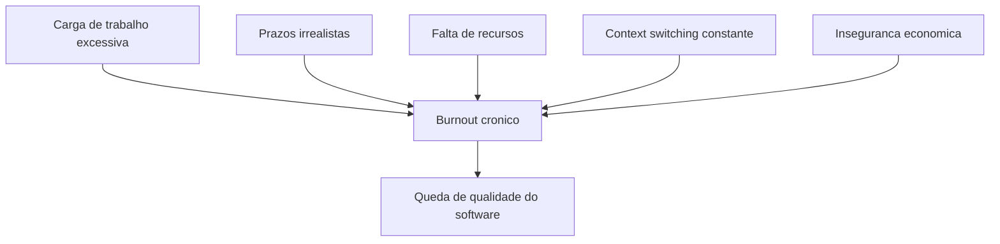
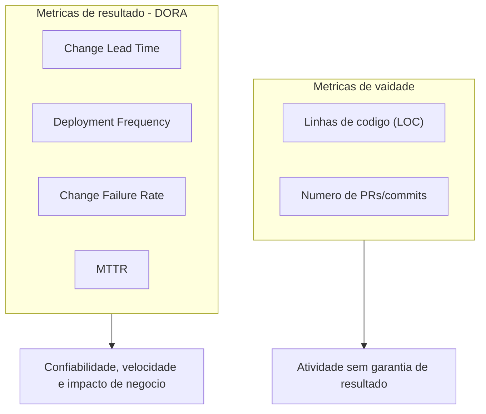
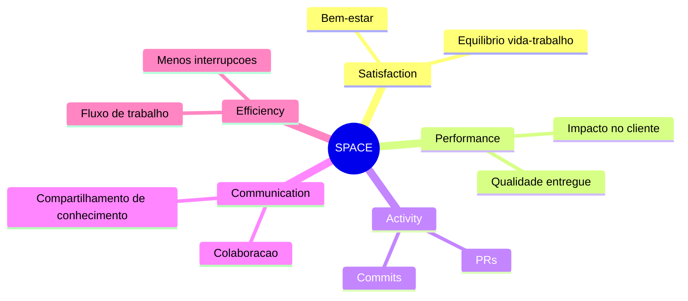
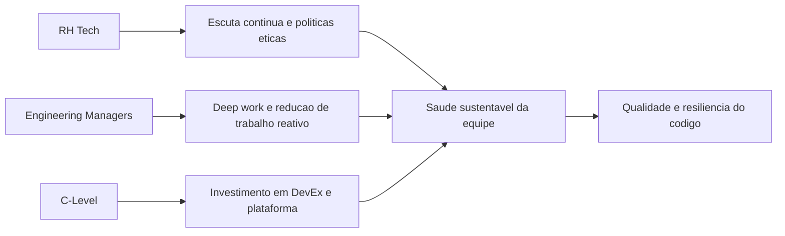

# **The Invisible Metric: How Developer Health and Wellbeing Impacts Code Quality**

Contemporary software engineering rests on a deep structural paradox: although technological infrastructure is designed with massive redundancies to achieve scalability, resilience, and high availability, the human infrastructure that builds and maintains it is often pushed to the point of systemic failure. Historically, the technology industry and venture capital have evaluated engineering success through purely mechanistic production metrics, focusing on delivery speed, code volume, and server uptime. However, a rigorous empirical analysis of the software development life cycle (SDLC) reveals that the quality of the code base, the security of the architecture and the stability of applications are umbilically linked to a metric often invisible on corporate dashboards: the mental health, psychological well-being and cognitive load of developers.

Software development is an inherently sociotechnical and highly cerebral activity, requiring prolonged states of deep concentration, creative problem solving and constant adaptation to new languages, frameworks and operational paradigms. When professionals performing these tasks operate under chronic stress, there is a measurable degradation in their cognitive capabilities. This degradation doesn’t just manifest as job dissatisfaction; it directly translates into logical flaws in the architecture, exponential increase in the density of defects and the introduction of critical vulnerabilities in production systems. This report comprehensively analyzes the intersection between proactive technical team health monitoring, structural burnout mitigation, and software quality assurance, providing a data-driven strategic framework for engineering leaders, technology-focused Human Resources managers (HR Tech), and startup founders.

## **The Panorama of Technological Exhaustion: A Systemic and Quantifiable Crisis**

The current state of the software engineering workforce indicates a systemic burnout crisis, driven by relentless sprint cycles, digital overload, tool proliferation, and severe macroeconomic shifts. Recent research paints an alarming picture of deteriorating well-being in the global technology industry, proving that burnout is not a passing buzzword but an occupational epidemic. An industry-wide survey projected for 2024 and 2025 revealed that 68% of technology workers reported experiencing acute symptoms of burnout, representing a substantial increase from the 49% recorded just three years earlier.

**Diagram: Structural vectors of burnout**


In specific markets and in surveys aimed strictly at developers, the situation is even more critical. Almost three-quarters (73%) of European Information Technology professionals reported experiencing ongoing work-related stress or burnout. Other independent studies focused on engineering analytics platforms have indicated burnout rates reaching a frightening 83% among programmers. These data show that exhaustion has become the default state of operation, and not a temporary anomaly.

| Depletion Metric | Percentage Reported | Research Context and Contributing Factors |
| :---- | :---- | :---- |
| **Burnout Symptoms (General)** | 68% | Increase compared to 49% three years before; driven by digital overload and speed of innovation. |
| **Stress/Burnout (Europe)** | 73% | 61% attribute it to heavy workloads; 44% to tight deadlines; 43% due to lack of resources. |
| **Risk of Burnout in Tech** |.1% | Workers classified as being at "high risk" of imminent burnout. |
| **Developer Burnout** | 83% | Reported in developer analytics platform studies, focusing on lack of autonomy and purpose. |

*Table: Statistical summary of professional burnout in the technology industry (2024-2025).*

The roots of this burnout are multifaceted and go considerably beyond simply working too many hours. Burnout is catalyzed by unrealistic expectations of linear productivity, overly complex or monolithic system architectures, and a mountain of legacy technical debt that makes any code change a minefield. More than 60% of professionals attribute stress at work to excessive task loads, while structural factors such as unrealistically tight deadlines and chronic lack of resources affect more than 40% of the workforce. The culture of around-the-clock work, exacerbated by poorly structured remote work policies, has severely blurred the boundaries between work and personal life. The overwhelming majority of developers report that they continue to code, or mentally solve software architecture problems, outside of conventional work hours.

A particularly worrying demographic phenomenon revealed in the most recent research is the change in the profile of the affected professional. Historically, burnout was often associated with junior developers struggling to adapt to the steep learning curve and pressure of early deliveries. However, recent data indicates that mid-career burnout is reaching epidemic levels, with senior developers reporting significantly lower satisfaction rates than their junior counterparts. These senior professionals are not only exhausted by the mechanical demands of coding, but by the unsustainable proliferation of meetings, constant context switching, unstructured mentoring responsibilities, and the psychological toll of keeping critical systems running under high pressure and on-call shifts.

In addition to this scenario intrinsic to engineering, there is the devastating psychological impact of macroeconomic instability. Reports focused on engineering leadership indicate that 40% of managers and technical leaders see their teams being significantly less motivated due to the shadow of layoffs in the technology sector. Job insecurity is not an abstract concern; it generates chronic anxiety that consumes the cognitive bandwidth needed for complex programming. When an organization fails to provide stability, adequate resources, or executive transparency, intrinsic motivation completely collapses, undermining effectiveness regardless of the direct manager's skill. Burnout, therefore, transcends individual fatigue; it is an unequivocal indicator of a pathological work environment where cognitive pressure far exceeds the individual's and team's coping resources.

## **The Neuroscience of Software Development and the Genesis of Critical Bugs**

To understand the exact mechanics of how declining welfare directly impacts the stability of code in production, it is necessary to abandon manufacturing analogies and examine the act of programming through a strictly neurocognitive lens. Understanding abstract architectures, tracking data flow, and writing source code are tasks that require massive resources from the human brain's working memory. When a developer's cognitive load approaches or exceeds the physiological limits of this working memory, their ability to understand and visualize complex systems crumbles, making them exponentially more likely to make logic errors that materialize as software defects.

The indelible link between emotional state, excessive mental load and the introduction of critical bugs has been substantiated by cutting-edge empirical investigations using electroencephalography (EEG) and functional magnetic resonance imaging (fMRI). The cognitive taxonomy on the causes of human errors corroborates the counterintuitive idea for many managers that forgetfulness, lapses in attention and mental overload are the true vectors for software vulnerabilities, and not just a lack of technical skill. Pioneering studies have demonstrated that emotions directly influence the quality of the programming task, with the Frontal Asymmetry Index serving as a viable biomarker for predicting performance and attention during coding.

In-depth analyzes using EEG to map cognitive overload confirm these hypotheses. Contemporary neuroscientific research has transcended subjective assessments of stress by mapping the developer's brain while performing real tasks. Studies show that software development tasks require intense activity in the Insula region, a brain area widely associated with high-order cognitive processes and complex problem solving. Systematic analysis of neurological biomarkers, specifically Hjorth parameter Activity and Total Power in the frontal and central channels (F4, FC4 and C4), reveals that burnout is a measurable physiological failure.

The findings from these intersections between neuroscience and software engineering are incisive: If a programmer is operating under high cognitive overload or is distracted when writing or reviewing lines of code, the likelihood of bugs being introduced or security vulnerabilities going unnoticed increases dramatically. This becomes even more acute when the code in question already has high cyclomatic complexity, as measured by classical static analysis metrics. Seasonal fluctuations in code quality are therefore not the result of willful neglect, but rather the inevitable byproduct of a brain operating under conditions of chronic stress, synaptic fatigue, and emotional exhaustion.

In addition to the reduced ability to process information abstractly, the deteriorated psychological state severely affects the methodological dynamics of development, particularly during the crucial phases of unit testing and code review. Cognitive psychology describes the phenomenon of "confirmation bias" as the instinctive human tendency to seek, interpret, and focus on information that verifies pre-existing hypotheses rather than attempting to refute them. When creating tests and reviewing pull requests, developers should theoretically try to actively subvert and break their own code. However, under severe time pressure and mental stress, confirmation bias is catastrophically amplified; Exhausted developers seek the path of least resistance to validation, ignoring complex edge cases and subtle architectural flaws that would require great cognitive effort to track down. As a direct and quantifiable result of this stress-induced cognitive failure, critical defects spill over into the production environment, increasing software defect density and the risk of systemic outages.

**Diagram: Neurocognitive chain to bugs in production**


Quantifying these failures is often performed using the Defect Density metric, commonly calculated by dividing the number of confirmed defects by the size of the software module, often measured in thousands of lines of code (KLOC) or function points. Software projects experience, on average, 15 to 50 bugs for every,000 lines of code written. When the workforce burns out, fatigue overrides proactive review practices, allowing the defect density rate to approach the upper limit of this average. Furthermore, analysis of defect patterns reveals that bugs tend to cluster in specific, hypercomplex areas of the code. Without the mental acuity needed to navigate these critical areas, teams experience constant interruptions.

The social and collaborative dimension of software development also collapses under pressure. Chronic stress undermines interactive collaboration and professional empathy. In high-pressure, low-morale environments, there is a sharp decline in empirical quality assurance practices that rely on healthy interpersonal dynamics. Pair programming is abandoned, daily meetings (standups) become empty mechanical reports, and there is a worrying accumulation of knowledge in silos. Professionals tend to isolate themselves to protect their scarce mental energy, hesitant to take responsibility for risky code refactorings or raising architectural concerns. This breakdown in communication means that small misunderstandings about business requirements silently evolve into catastrophic delays and crippling long-term technical debt.

## **The Fallacy of Traditional Metrics and the Rise of the DORA Framework**

The historical quest to quantify intellectual work in software engineering has a history of adopting reductionist metrics that often encourage paradoxical behaviors that are detrimental to long-term quality. The most classic and arguably most flawed metric, Lines of Code (LOC \- Lines of Code), is widely considered a vanity metric. Unrestricted use of LOC punishes algorithmic efficiency and elegance; a developer focused on quality and system health may solve a complex architectural problem by refactoring and eliminating a thousand lines of legacy code, while an exhausted developer may deliver a brittle, bloated solution of hundreds of lines just to signal productivity. Likewise, evaluating performance strictly by counting Pull Requests (PRs) or commits only measures activity and kinetic movement, not actual progress toward business objectives. It is a workflow-dependent metric and highly susceptible to manipulation, where developers fragment trivial deliverables to inflate numbers, masking systemic quality degradation.

To overcome the focus on gross volume and micromanagement, the industry massively adopted DORA (DevOps Research and Assessment) metrics, which revolutionized the way we evaluate the effectiveness of software delivery by linking development practices to organizational results. DORA moves away from line counting and examines delivery pipeline maturity and operational performance (Software Delivery and Operational \- SDO) focusing on four primary axes:

**Diagram: Traditional metrics versus DORA**


1. **Change Lead Time:** The time elapsed from code commit to successful deployment in production.  
2. **Deployment Frequency:** The cadence with which the organization deploys code to production.  
3. **Change Failure Rate:** The percentage of deployments that cause failures in production requiring immediate remediation (hotfixes, rollbacks).  
4. **Mean Recovery Time (MTTR / Failed Deployment Recovery Time):** The time required to restore service in the event of an incident or failure.

DORA longitudinal research has conclusively demonstrated that software delivery performance is a direct predictor of organizational success, influencing profitability, market share and customer satisfaction. Furthermore, it has established an undeniable correlation between high IT performance and employee psychological well-being and loyalty. Professionals in high-performing organizations (Elite and High) are 2 times more likely to recommend your company as a great place to work (measured by eNPS).

By categorizing teams into Elite, High, Average and Low performance profiles, the research revealed profound and instructive differences in the allocation of cognitive time. The most revealing aspect of the DORA survey for HR and Engineering leaders concerned about the burnout epidemic lies in how time is consumed by teams, illustrating the burden of reactive work:

| Performance Category (DORA) | Time Spent on New Work (Innovation) | Time Spent on Unplanned Work and Rework | Constant Remediation of Security Flaws | Correction of Defects Identified by Users |
| :---- | :---- | :---- | :---- | :---- |
| **Elite Performers** | 50% |.5% | 5% | 10% |
| **Low Performance Performers** | 30% | 20% | 10% | 20% |

Table: Effort allocation based on software delivery performance profile (DORA Accelerate State of DevOps Data).

Elite teams enjoy a virtuous cycle of mental health and technical excellence. Implementing robust technical capabilities reduces what research calls "deployment pain" — the level of fear, anxiety, and chronic stress that engineers experience when shipping code to production. Where deployments are most painful and generate nightly anxiety are the worst organizational cultures and lowest software performance. Elite teams, freed from this pain through automation, are able to allocate half of their cognitive time to genuine value creation (50%).

In stark contrast, developers in low-performance environments are trapped in a reactive state of perpetual survival. Twice as much time is consumed putting out fires, remediating last-minute security holes due to a lack of early automated testing, and fixing an overwhelming volume of defects reported directly by frustrated end users. This reactive and unplanned work (rework) is one of the primary vectors of burnout, characterized by high levels of cortisol and constant systemic frustration. Christina Maslach's burnout research, widely cited in DORA, identifies six organizational risk factors for burnout: work overload, lack of control, insufficient rewards, community breakdown, lack of justice, and values ​​conflict. The low-performance environment perfectly exacerbates overload and lack of control.

To mitigate this anxiety and reduce rework, DORA prescribes the rigorous adoption of specific technical capabilities associated with Continuous Delivery. Practices such as test automation (where developers create reliable suites that find real faults), trunk-based development, minimizing complex branches that cause merge hell), pervasive security, loosely coupled architectures and comprehensive observability are not just good architectural practices. They are direct prophylactic interventions against team nervous exhaustion. By ensuring quality is “built in from the ground up,” teams don’t arrive exhausted at the end of the release cycle.

## **The SPACE Framework and the Operationalization of Satisfaction and Productivity**

Despite their immense and unquestionable value to operational engineering, DORA metrics have an intrinsic limitation in scope: they accurately measure the speed and mechanical stability of the delivery pipeline, but they do not directly quantify the subjective lived experience, level of daily friction, cognitive well-being, or chronic human exhaustion required to fuel and keep that pipeline running. DORA metrics capture whether the software machine is running efficiently, but they do not indicate whether the technical team is on the verge of nervous breakdown, operating beyond its sustainable limits to forge that cadence. Additionally, tools focused strictly on "busyness metrics" that measure time in meetings attempt to look at the human side, but fail to provide actionable recommendations to improve flow.

To address this dangerous visibility gap and combat the underlying exhaustion that will eventually destroy long-term sustainable pipeline performance, software engineering researchers from GitHub, Microsoft, and the University of Victoria collaborated to develop a complementary framework with a deeply holistic perspective. The result was the SPACE framework.

SPACE strongly rejects the outdated notion that intellectual productivity can be reduced to a single dimension of production or activity. It proposes a multifaceted model built on five interdependent axes, providing a 360-degree view of engineering effectiveness:

**Diagram: Map of SPACE framework dimensions**


| SPACE dimension | Meaning and Focus of Measurement | Typical Indicators |
| :---- | :---- | :---- |
| **S (Satisfaction & well-being)** | The degree of happiness, fulfillment, psychological security and absence of fatigue at work. | Satisfaction with life/work balance; reported stress levels; perceived developer effectiveness. |
| **P (Performance)** | The final impact of the work and the quality of the software delivered to customers. | End user satisfaction (NPS); revenue growth associated with features; operational health and stability. |
| **A (Activity)** | The traditional count of development process outputs. | Frequency of code commits; number of pull requests reviewed; closed incident tickets. |
| **C (Communication & collaboration)** | How effectively the team communicates, discovers dependencies, and collaborates. | Satisfaction with code reviews; speed and effectiveness of interdisciplinary knowledge sharing. |
| **E (Efficiency & flow)** | The team's ability to progress work with minimal friction and few interruptions. | Task cycle time; individual perception of ability to focus deeply without contextual interruptions. |

*Table: Breakdown of the SPACE Framework dimensions for holistic productivity.*

The first pillar of SPACE, Satisfaction and Well-being, acts as the methodological foundation. It is not a corporate decoration intended for internal marketing pamphlets; it is a quantifiable and predictive lever for operational efficiency. The founding principles of SPACE determine that satisfaction acts as a vital leading indicator for productivity. The rigorous research underpinning the framework demonstrates unequivocally that declines in satisfaction and engagement are not a parallel symptom of falling productivity, but an early warning sign that burnout is approaching and, invariably, production and code quality will collapse in its wake.

The validity of the correlation proposed by SPACE was tested and expanded by the parallel movement focused on Developer Experience (DevEx). To respond to executives' demand for rigorous financial data to justify investing in well-being, Microsoft, GitHub and research organization DX conducted extensive statistical studies on how workplace health impacts corporate bottom lines. The underlying theory, anchored in Work Design Theory, posits that optimized work environments reduce burnout and boost performance.

The resulting empirical data is definitive and outlines how mitigating friction and psychological overload yields drastic dividends in technical quality:

* **Focus and Flow State:** Developers who can set aside significant blocks of time for deep work — free from the constant interruption of emails, non-urgent alerts, or poorly planned sync meetings — enjoy an impressive 50% increase in their perceived productivity. Additionally, developers who find purpose and engagement in their tasks (as opposed to performing perpetual monotonous maintenance) report feeling 30% more productive. Protecting the developer's brain from attention fragmentation is the quickest lever to increase the quality of deliveries.  
* **Cognitive Load Management and Architectural Quality:** Professionals who report possessing a high degree of understanding of the legacy code base and the intricate architecture of the system they operate on feel 42% more productive compared to those struggling in obscurity. Rampant technical debt, lack of clear internal documentation, poor on-boarding and constant rush are the biggest destroyers of this understanding. When code is unintelligible due to the rush of past iterations, the cognitive load (whether intrinsic or extrinsic) quickly exhausts the programmer, leading to mental fatigue-induced errors. Intuitive tools and clear processes make developers feel 50% more innovative.  
* **Speed ​​of Feedback Loops:** Software quality plummets when friction enters the review process. The excessive delay in feedback on newly written code (stagnant code reviews, cumbersome and bureaucratic approval processes, or very slow CI/CD builds) violently breaks the line of reasoning. The research reveals a remarkable finding: development teams that can quickly respond to their colleagues' queries and that implement agile reviews report generating 50% less corporate technical debt. Additionally, rapid review cycles make developers 20% more innovative, keeping them in a state of continuous intellectual curiosity rather than frustrating stagnation.

The evidence relentlessly converges on an indisputable conclusion: happy programmers, supported by adequate tooling and not consumed by logistical stress, are empirically more productive, less prone to burnout, and write intrinsically safer, less buggy code. The absence of systemic systemic frustrations mitigates "cognitive inflammation", allowing the brain to invest its valuable resources in anticipating complex flaws in the code, rather than wasting them in a daily struggle against corporate bureaucracy itself.

## **The Paradox of Artificial Intelligence: Apparent Productivity and New Cognitive Load**

As the industry rapidly advances into the era of artificial intelligence-aided engineering, an elusive and formidable new layer of cognitive complexity is added to the development work, coining what global research institutions have come to call "The AI Paradox." The advent of powerful coding assistants powered by large language models (LLMs), like GitHub Copilot and GitLab's suite of AI-based tools, was introduced with the stellar promise of astronomical productivity gains. In fact, the ability to quickly generate intricate boilerplate code, complete complex mathematical routines, automatically import packages, and even orchestrate the generation of extensive unit test suites almost instantly drastically changes the initial phase of software authoring.

However, the first large-scale, in-depth analyzes of the actual effectiveness of AI in corporate environments reveal severe second-order consequences for the mental health of teams and long-term technical quality, particularly when these tools are implemented without remedial socio-technical infrastructure. While AI dramatically accelerates the mechanical speed of typing and the generation of initial code drafts, it simultaneously fragments toolchains and creates formidable new bottlenecks in the later validation and security stages of the development lifecycle.

Comprehensive recent research, such as GitLab's global report projecting trends through 2026 and surveying more than 200 DevSecOps professionals, has demonstrated counterintuitive data: organizations are losing an average of 7 valuable hours per week (nearly a full workday) per team member due to inefficiencies strictly driven by the expansion of poorly integrated AI tools and disjointed processes around compliance reviews.

The invisible, burnout-inducing trap inherent in AI lies in the massive transfer nature of cognitive load. When an LLM generates hundreds or thousands of lines of code in mere seconds, the human developer's core responsibility shifts from *authoring* step-by-step logic to *reading, understanding, and architecturally and security validating* machine-generated code. The fundamental work transforms. Instead of being the systematic bricklayer of logic, the exhausted engineer must suddenly act as a senior technical auditor of a vast system built by an alien intelligence that is extremely fast, plausibly correct, but notoriously prone to hallucinations and the injection of vulnerable packets. Cognitive psychology demonstrates that reading and retrospectively auditing code produced by others is empirically more strenuous and costly to the brain's working memory than writing and structuring one's own thoughts through code.

This new accelerated dynamic resulted in a devastating side effect pointed out by independent software efficiency research institutes. When analyzing millions of changed lines of code, projections indicate that *code churn* – defined as the percentage of lines of code that need to be rolled back, emergency fixed or extensively updated less than two weeks after being introduced into the main system – has seen dramatic spikes, with volume expected to double as a direct response to the adoption of unsupervised generative tools. This reckless acceleration creates a virtual mountain of silent technical debt that accumulates alarmingly fast in repositories.

Therefore, if Pull Request volume is dogmatically maintained as the primary productivity metric in an AI-driven era, managers will be celebrating movement while sinking the ship. The AI-assisted developer will open dozens of voluminous PRs, appearing statistically hyper-productive. However, these massive PRs will fall to their human peers for review. If these developers designated as reviewers are already suffering from severe burnout and overload, the result will be catastrophic. Cognitively exhausted developers do not possess the mental rigor, empathy, or investigative patience required to perform in-depth security reviews of vast LLM outputs.

Dominated by confirmation bias and deadline pressure, they will invariably adopt rubber-stamping behavior, mechanically sanctioning dangerous code injections to meet metrics focused purely on mechanical speed. This will destroy the robustness of the application in the production environment, guaranteeing future sleepless nights during failure incidents. To reap the dividends promised by AI without sacrificing team sanity or code quality, organizations must invest concurrently and robustly in Platform Engineering, ensuring internal developer portals and highly automated "golden paths" that absorb the burden of infrastructure orchestration and routine security scanning before exhausting the human evaluator.

## **Monitoring Technologies: From Surveillance to Holistic Engineering Intelligence**

Understanding the theoretical basis of cognitive load, DORA and SPACE is just the foundation; The operationalization of measurement has historically run up against the practical difficulty of extracting clean data from deeply fragmented tool matrices. To overcome this technical barrier without resorting to hostile tactics, the advanced discipline of Engineering Intelligence platforms and the evolution of continuous people management technologies (People Analytics) have emerged in recent years.

Advanced enterprise tools in this segment, such as DX, Jellyfish, Haystack and LinearB, differ fundamentally, methodologically and philosophically from traditional time trackers, click counters or infamous corporate surveillance software (bossware/spyware). They operate under the principle of strictly contextual, aggregated and non-invasive monitoring. Instead of filming screens, they integrate and cross-reference valuable metadata from Git repositories, issue tracking tools (like Jira or Asana), and Continuous Integration and Deployment (CI/CD) pipelines. These cutting-edge platforms start from the premise that raw system telemetry (such as PR size, open-to-close ratio, and cycle time) remains deceptively two-dimensional if not infused with underlying human context.

The DX tool, for example, stands out because it was designed directly by elite scientific researchers (including the original creators of DORA and SPACE). It doesn't just rely on machine metrics; the platform fuses heavy technical telemetry from the SDLC with essential qualitative insights collected seamlessly from the developers themselves. Through the intelligent use of Experience Sampling and quick contextual questionnaires based on the engineer's current work, managers can map the exact nodes of friction where talent becomes confused, blocked or mentally worn out by the architecture. This gave rise to the proprietary DX Core framework, focused simultaneously on Speed, Effectiveness, Quality and Business Impact. This allows leaders to balance their measuring sticks, ensuring that applause for "faster deliveries" does not occur while technical effectiveness and morale plummet.

Likewise, the Jellyfish platform acts as a vital translator between the engineering shop floor and the executive boardroom. It translates the fragmented mechanical signals of engineering into the financial and executive language of resource allocation. The platform allows leadership to see precisely how much of precious time, human effort and financial investment (R\&D) is being sucked into a black hole of hidden technical debt or unanticipated corrective maintenance, as opposed to true roadmap innovation. The analytical ability to mathematically demonstrate to a board that an entire technical team is silently suffocating under an overwhelming operational load is the first irrefutable empirical step to justifying budgets aimed at preventive refactoring and systemic reduction of the risk of collective corporate burnout.

| Tool Category | Approach and Primary Data Collection | Impact on Wellbeing and Quality Management | Representative Examples |
| :---- | :---- | :---- | :---- |
| **Engineering Intelligence Platforms** | Cross-checking system telemetry (Git, Jira, CI/CD) with in-workflow research on developer experience. | Identifies precise architectural bottlenecks; measures actual cycle times; works by preventing stagnation and code review fatigue. | DX, Jellyfish, Haystack, LinearB. |
| **People Analytics & HR Tech (Continuous Listening)** | Frequent pulse surveys (eNPS), Natural Language Processing (NLP)-based predictive modeling, and feedback metrics:1. | Assesses the fundamentals of psychological safety, recognition metrics, team burnout risk, and local leadership alignment. | Culture Amp, Lattice, Workday Peakon. |
| **Platform Engineering** | Internal developer portals (IDPs), pipeline automation, service catalogs and self-service orchestration. | Dramatically reduces cognitive load by automating environment provisioning, documentation and security, returning vital autonomy to the developer. | Backstage, Cortex, Port, In-house Tools. |

*Table: The modern ecosystem of socio-technical monitoring and developer support tools.*

In parallel to the adoption of engineering tools itself, the macro management of well-being in organizations has advanced qualitatively with the maturity of Continuous Listening platforms managed by modern Human Resources and People Operations departments. Prominent People Analytics solutions like Culture Amp, Lattice, and Workday Peakon have helped retire the antiquated, slow, and reactive annual organizational climate survey.

In their place, these platforms have institutionalized microscopic, targeted, and highly frequent feedback collections (pulse surveys), integrating natively with tools like Slack and Microsoft Teams. Using artificial intelligence models trained in organizational psychology for natural language processing, these tools analyze anonymous sentiment at scale in real time. This gives leadership the superpower to detect emerging patterns of isolation in remote workers, underlying complaints of work-life imbalance, and a general decline in psychological safety months before they culminate in mass layoffs or a catastrophic architectural collapse.

The methodological validity of monitoring engineering in this way can find a critical and enlightening analogy in the area of ​​digital health and preventive medicine: the advancement of Remote Patient Monitoring (RPM) focused on behavioral health. In modern medicine, passive IoT (Internet of Things) RPM technologies or wearable biosensors continuously capture discrete fluctuations in heart rate variability (HRV), sleep patterns and glycemic trends in real time, using this microdata to alert medical staff long before a catastrophic clinical event (such as a diabetic coma or an acute panic attack) materializes.

Today's technologically informed engineering and HR leadership is essentially embracing an "Organizational RPM" model. The imperative objective is not, under any circumstances, to carry out individual micromanagerial surveillance of the professional. Irrefutable data proves that malicious monitoring, focused narrowly on counting keystrokes or invasive screen captures, inevitably generates severe paranoia, eliminates perceived autonomy, destroys any shred of trust in the employer, and increases stress metrics to the breaking point. On the other hand, ethical, consented, aggregated and purely compassionate monitoring, aimed exclusively at identifying logistical frictions in the development system, acts as the company's early immune system, protecting the technical team from the company's own dysfunctions.

## **The Economic Impact: Turnover, Quality and the Hidden Cost of Exhaustion**

The thesis that there is a linear, severe and immediate correlation between intangible team well-being metrics and the viability of the corporation's financial statement is supported by unequivocal data. This mathematical reality bluntly refutes the antiquated view of many chief financial officers that investment in mental health is merely a philanthropic or corporate social responsibility initiative restricted to “soft HR.” The unmitigated cost of acute stress in software engineering manifests itself in financial reporting primarily through the unsustainable cost of voluntary employee turnover and the irreparable degradation of the code base that leads to the shutdown of mission-critical projects.

Replacing a burned-out senior engineer or developer, who is often the sole mental custodian of vast, undocumented empirical knowledge about the company's complex subsystems, has immediate, overwhelming monetary impacts. Extensive, peer-reviewed research in the field of human resource management consistently demonstrates that the true corporate cost of replacing a highly qualified professional can be a staggering amount equivalent to up to .5 times the value of their full annual salary. This estimate incorporates not only the direct, time-consuming and obvious costs of acquisition and recruitment, but the extensive formal training periods, the inherent inefficiency of the new member's ramp-up time, and the devastating burden placed on remaining developers who inherit massive support loads, inducing a secondary domino effect of team burnout.

In contrast, proactive organizations that actively base their work methodologies and organizational cultures on well-being metrics reap staggering reductions in these costs traditionally considered "hidden." Pragmatic case studies attest that companies focused on resolving operational bottlenecks and institutionally guaranteeing the balance between developers' personal and professional lives can reduce direct costs related to talent attrition by around $1.2 million annually.

For startup ecosystems—companies historically operating under intensive venture capital injections and brutal burn rate schedules—the widespread burnout of their foundational engineers or lead architects is not just a performance issue; he typically represents the premonitory existential failure of the company. In hypercompetitive startup environments, engineering methodology focuses heavily on fast, aggressive cycles of build, measure, and empirically iterate. However, the constant tension of overwork lethally destroys the team's intellectual capacity to maintain agility to innovate and react to feedback from market users.

The results provided by Engineering Intelligence platforms prove the massive return on investment (ROI) of adopting visibility focused on frictionless workflow. Organizations and startups adopting the DX platform's sophisticated telemetry illustrate this reality: biotech-focused startups like Recursion have managed to passively cut their suffocating technical debt by 33% by identifying invisible pain points in the daily flow, while web infrastructure companies like Block Labs report seismic increases with a productivity leap valued at 4 times their original baseline factor by aligning processes with bottleneck insights highlighted by their developers through pulse questionnaires continuous.

Automating developer pain ripples directly into accelerating business profits. The giant aerospace corporation Airbus, for example, used the systematic automation proposed by DevOps and Continuous Integration platforms like GitLab to brutally mitigate the massive human fatigue-inducing routines that unnerved its teams. The payoff of the investment in cognitive relief for its engineers was not just measured in happiness, but in the dramatic compression of time from a critical release cycle from 24 laborious, anxiety-filled hours to a modest 10 minutes of proven, low-stress stability. Similarly, Jellyfish customers like Five9 use engineering metrics insight as a cornerstone, seeing deep operational expansions of 35% by re-educating middle management on how to use team load capacity data to adjust realistic deadlines with product management. One of their partners even reported that optimized efficiency enabled impressive innovation spikes of 80% in the team's overall processing rate simply by redirecting the team to focus on the impediments highlighted in their analytics software.

Maintaining the support of the psychological architecture and cognitive resilience of today's workforce is not ultimately about appeasing developers; It is fundamentally equivalent to preserving the primary capital operating asset that drives the market valuation of the modern technology company.

## **Essential Strategic Guidelines by Organizational Role**

Recognizing the irrefutable, multidimensional correlation between the prevalence of software developer burnout, cognitive collapse, and the severe increase in systemic failure rates in production requires an orchestrated and tactical plan of action by all actors in the corporate organizational hierarchy chain. To intervene systemically and successfully reverse the chronic decline in technical morale and clean productivity, strategies and protocols cannot be prescribed in isolation. They must range seamlessly from daily technical methodological adjustments in the code merge culture to deep structural reassessments in traditional methods of corporate governance and human resources management.

**Diagram: Coordination between organizational roles**


### **Executive Guidelines for Human Resources Tech and People Analytics Managers**

Human resources leaders focused on technology talent need to immediately abandon any dogmatic persistence in the archaic methodologies of the 20th century corporate past. The goal is to establish proactive infrastructural listening. Restructuring the primary talent feedback architecture is non-negotiable; Pervasive, infrequent and slow climate assessments, as well as punitive annual performance review methodologies focused solely on gross product, must be eradicated. People Analytics professionals need to orchestrate the implementation of modern technological platforms (such as Lattice, Culture Amp or equivalent) that enable and automate continuous listening research in a subtle way, integrated into the flow without disturbing the progress of projects. The cadence of this sampling must be regular enough to alert dangerous fatigue patterns, crossing individual or team engagement against internal statistical turnover histories.

At the same time, HR Tech needs to assert itself politically within the corporation to act as an ethical guardian in the implementation of engineering metrics. Together with the technical board, they must educate middle management to anchor the definition of "exemplary performance" rigorously based on the holistic pillars prescribed by the acclaimed SPACE framework (Satisfaction, Performance, Activity, Communication, Efficiency) in radical opposition to raw time counters logged into the system. Finally, and critically important in the hybrid era, HR cannot tolerate the surreptitious installation of intrusive monitoring software (such as webcam loggers or 24/7 mouse activity trackers). They must institute draconian policies ensuring that all telemetry analyzed across the enterprise is aggregated at the team level, strictly anonymous to senior management to avoid witch hunts, unwaveringly focused on the organic flows of tools (Git, Jira) and not the forced capture of the human psyche. Tracking the pain points of operating systems reveals frustrations long before they drain the lives of those who work with them.

### **Operational Protocols for Engineering Managers**

For tactical leaders positioned directly in the daily trenches of building software, aggressively defending their team's work environment is the most vital task that will ensure business objectives are met without generating catastrophic bugs. First, they must institutionalize the fundamental principle of uninterrupted work ("Deep Work"). As irrefutable telemetry evidences, intentional blocks of isolated mental time guarantee massive leaps in real productivity. Engineering managers (EMs) need to act as a formidable defensive shield protecting developers from laterally imposed shallow outages. This entails instituting sacred scheduling dogmas, like full half-days entirely free of chronic meetings, and policing communication on Slack or Microsoft Teams to promote asynchronous communication.

Second, tactical engineering management needs to confront the veiled epidemic of technical debt by implementing a radical and persistent reduction in the volume of chronic unplanned work and perpetual support. Mature EMs must arm themselves methodologically with the empirical framework based on the analytical results of the DORA matrices. Armed with these reports, they must dogmatically allocate substantial budgets of isolated time in iterative sprints – requiring up to 20% of the entire cycle budget – to focus strictly and exclusively on heavy algorithmic refactorings, systematic elimination of dead code, and the proactive repayment of infrastructure debts and inefficiencies that drag down long-term velocity. Moving your team's profile from chaotic reactive behavior that spends huge portions of resources on support, directly to the operational nirvana of Elite categories - where more than half of the valuable time is freely dedicated to new creative implementations - is paramount.

Furthermore, relentlessly inhibiting chronic bottlenecks in feedback loops constitutes the ultimate practical lever for mitigating stress-fostering disruptions to cognitive thinking. Opaque delays, poorly designed processes, and extensive codes completely crush motivational intellectual engagement and severely inflame unwanted friction and friction. EMs must force severe reengineering by requiring strictly small pull requests, submitted on a highly frequent basis, ensuring adoption of the short-lived integration assumptions that support the lean pipeline. Small batch architectures eliminate the deep human psychological terror instilled in monolithic mergers, reducing the emotional exhaustion involved in painful, imprecise manual inspections.

### **Foundational Strategies for Entrepreneurs and C-Level**

For the founding core leadership layer and capital board-level decision makers, the preservation of integral psychological well-being should not be understood in quarterly balance sheets under the misguided rubric of generous employee perks, but imperatively budgeted as a core capital shielding and maximizing expense. The corporate committee needs to financially sponsor the heavy investments required in holistically enhancing the “Developer Experience” (DevEx). For startups where a faulty product ends funding rounds beyond repair, solid internal infrastructure tools are indispensable. Underpinning mature Platform Engineering architecture reduces chaotic shard deployments, increases empirical operational frequencies, dramatically stabilizes global recovery (lower MTTR) in severe failures, and eliminates intellectual engineering waste through standardization and abstraction. Adopting transparent analytics platforms that illuminate the dark silos of productivity allows you to steer the startup executive ship by real logical data rather than mere subjective perception.

Transparency must also dominate when dealing with the demographic component in temporary crises, preventing ethical wounds. When managing crises in the capitalist situation that require sporadic work layoffs from the corporate body, CEOs and founders have the irrefutable mandate to maintain the most sincere, raw and unobstructed vertical communication conceivable about the present global financial strength and stability. Stifling and covering up rumors of restructuring generates corrosive speculation in the trenches that deplete, through wear and tear induced by constant fear, the precious daily intellectual delivery rate of 40% of capacity.

Finally, in the transformational dawn induced by the growing empire of adaptive machine learning, the board has ultimate responsibility for socio-technical integration. The technology committee should never vertically and impulsively push the ubiquitous implement of generative artifacts from the Large Language Models (LLMs) universe simply to fill an impressive presentation slide aimed at the investing venture fund's board of advisors. Introducing language assistants with thoughtless autonomy drastically increases the risk of late cognitive collapse due to the avalanche generated by the exhaustive audits required and the expansion of dangerous chronic volatility of temporary code (code churn). Autonomous tools must always remain subjected and subordinated to a progressive methodical escalation accompanied by strong control infrastructures, programmatic validation of rigid CI/CD security, relieving the human brain instead of subjecting it to monstrous loads to validate crazy robots in complex tasks.

## **Practical Appendix (Optional): Measuring Quality + Well-Being without Surveillance**

To keep this article at a strategic level, code usage remains minimal and exclusively operational. The examples below are just to make execution practical by team and by sprint, without invasive individual telemetry.

```sql
-- Exemplo conceitual: correlaciona qualidade de entrega
-- com sinais agregados de bem-estar por sprint e por time.
SELECT
  sprint_id,
  team_id,
  AVG(change_failure_rate) AS cfr_medio,
  AVG(mttr_horas) AS mttr_medio_horas,
  AVG(pulse_stress_score) AS estresse_medio,
  AVG(deep_work_horas_semanais) AS foco_medio_horas
FROM engineering_health_snapshot
WHERE snapshot_date >= CURRENT_DATE - INTERVAL '90 days'
GROUP BY sprint_id, team_id
ORDER BY sprint_id DESC, cfr_medio DESC;
```
This model avoids intrusive individual telemetry and allows you to see system trends: when aggregate stress rises and deep focus falls, CFR and MTTR tend to worsen. The objective is not to punish people, but to identify operational bottlenecks for continuous improvement.

An additional simple and objective step is to transform this snapshot into a risk alert per team:

```python
def risco_operacional(cfr_medio, mttr_medio_horas, estresse_medio, foco_medio_horas):
    # pesos iniciais calibraveis com historico interno
    score = (
        0.35 * cfr_medio
        + 0.25 * (mttr_medio_horas / 24)
        + 0.25 * (estresse_medio / 5)
        + 0.15 * max(0, (20 - foco_medio_horas) / 20)
    )
    if score >= 0.70:
        return "alto"
    if score >= 0.45:
        return "moderado"
    return "baixo"
```
This score should not be used for individual assessment. It exists to prioritize system interventions: reduce reactive work, improve review cycles and protect deep work windows.

## **Synthetic Conclusion**

The persistence of the historical industrial mental model, operating under the arbitrary corporate attempt to dissociate and separate the fragile health and psychic health of the intellectual strength of the contemporary technological working class on the one hand, from the tangible robustness of the complex digital operating systems and scalable architectures that humanity globally consumes on the other extreme, constitutes nothing less than a serious and proven corporate fallacy. By ignoring the neuroscientific roots directly linked to abstract development, leaders reap their own founding bases. As exhaustively demonstrated through this thorough structured statistical report on global contemporary behavioral data from the information technology and cloud computing industry, the phenomena of the injection of fatal flaws into the heart of software, the persistent increase in the deficit of unpayable underlying technical debts in monolithic architectural legacies, and the logistical downfalls of troubled and inefficient agile enterprise launches are rarely deficiencies inherent in the technical theoretical frameworks of computational science in themselves.

Due to the rigorous practical opposite exposed empirically by the most avant-garde socio-technical advances, logistical interruptions, costly delays in the vital time-to-market of new products, as well as the everyday nightmares experienced when dealing with the uncontrolled instability of daily production rise and fall correlated almost entirely under the conditioned reflexes generated by the underlying environment that supports the brain's own neurocognitive resources of those to whom the mission of the original project is passed on. Genius professionals with high intellectual performance systematically and irremediably slip into exhaustion and stupid mistakes in the face of poorly designed opaque processes, fueled by unattainable goals based on outdated mechanical volume metrics.

The direct biological parallels detected without bias in the electroencephalograms of validation laboratories in the investigation of automatic mental responses associated with prolonged frustration due to the depletion of human empathy consistently materialize in a terrible, costly and real systemic degradation in the final analytical quality translated in full into thousands or millions of flaws in the logical code of the living digital business environment. However, on the threshold of innovation in today's new market, perfectly supported and guided by the powerful and tireless intelligence of corporate engineering linked to the definitive humanized metrics of the SPACE foundations and the mature operational reports of DORA, reversing this chronically devastating epidemic in the sector requires courage.

With the due unrestricted adoption of these advanced "Engineering Intelligence" platforms properly and respectfully merged with the fundamental efforts of the continuous and compassionate invisible probes of the active areas of People Analytics, the unwavering accuracy of the global picture around the wear and tear of people's intellectual operations could be subtracted from the reactive dark sphere of informal end-of-shift complaints to ascend to the undisputed class of purely evidence-based telemetry.

Understanding with deep socio-technical compassion and proactively managing the unavoidable and relentless invisible metric of full health, actively preserving the irreducible psychological well-being of the individual submerged throughout the uninterrupted creative gear has undoubtedly become the most imperative axis to guarantee the operational success of modern capitalist innovation. The intelligent and deliberate elimination of annoying unnecessary barriers, the unrestricted support for unbreakable protectionist policies in the systematic preservation of asynchronous spaces from disorderly logistical interruptions, combined perfectly with an injection and impetuous commitment to constant proactive investments in abstracted and mature technological resources and preventive reduction of support legacies from large platforms, ultimately yield fabulous results. These intangible and operational profits go beyond the relief of margins with the increase in the famous vital rates of the long organic productive period per employee in the workforce, lowering the staggering corporate costs of constant recruitment caused by pathological turnover.

Consolidating strengths in these essential practices is not just a virtue or philosophy of innovative HR in the modern market of great competition in innovation, but rather in cold engineering, the basic constitution of the very foundations on which every resistant technology platform capable of proving extraordinarily fast to disruption will be paved and erected victoriously. In the merciless future shaped radically in the long term and incredibly accelerated at a breakneck pace by the irreversible disruption suddenly established by the unavoidable ubiquitous adoption and expansion of the abstract powers of machine intelligence that now writes part of the new processes itself, ensuring the cognitive stability of the team of humans sitting at the helm of final supervision of the audits that will critically judge the direction of the ecosystem becomes not only mandatory but vital. The machine builds for humans, but it needs healthy humans guiding it. Resilient code only flows from the intact brain of the preserved engineer that has not been crushed and overwhelmed under the merciless inflexible wheel of their own deficient and unsustainable organizational frameworks.