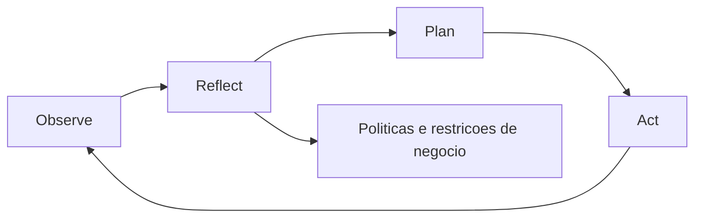
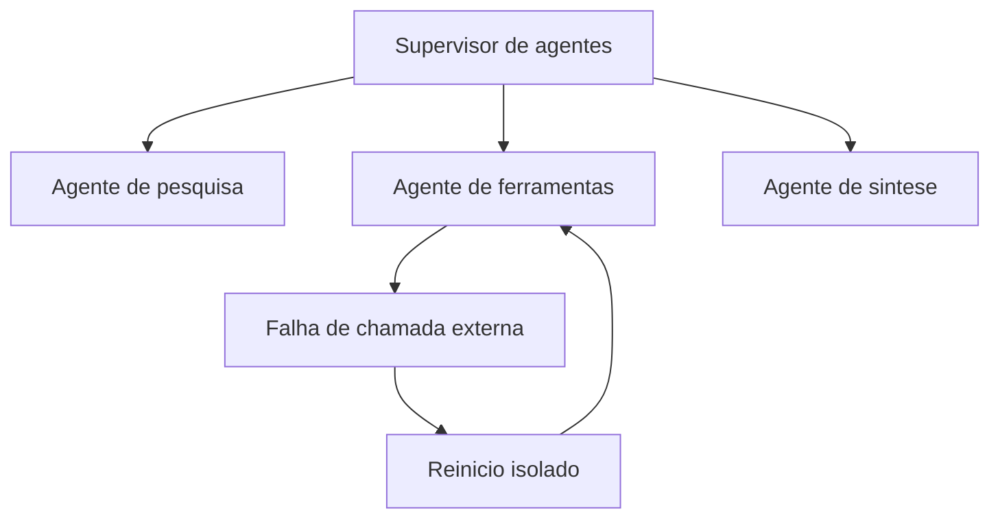
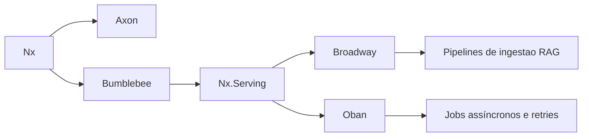
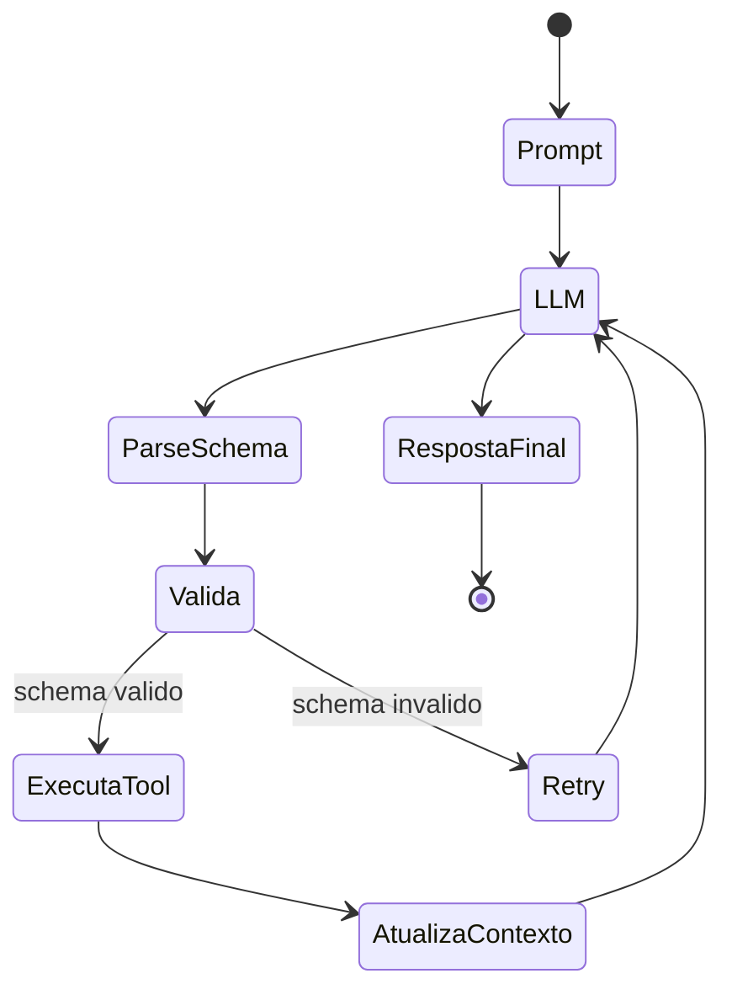

# **Más allá del bombo publicitario: cómo integrar arquitecturas cognitivas y LLM en su producto**

La adopción de la Inteligencia Artificial Generativa (GenAI) en el ecosistema de desarrollo de software ha alcanzado un punto de saturación discursiva. Las organizaciones a escala global se han apresurado a incorporar interfaces conversacionales en sus productos, impulsadas por la promesa de ganancias exponenciales de productividad y nuevas vías de ingresos. Sin embargo, el mercado actual se enfrenta a un fenómeno ampliamente documentado como la "paradoja GenAI", donde una proporción abrumadora de empresas (alrededor del ochenta por ciento) informa no haber visto ningún impacto significativo y tangible en el resultado final de sus balances, a pesar de las fuertes inversiones en infraestructura y licencias. Esta disonancia no es un reflejo de fallas inherentes a los modelos de lenguaje a gran escala (LLM), sino más bien el resultado directo de un enfoque arquitectónico inmaduro.

La gran mayoría de las primeras implementaciones trataron los modelos fundamentales como oráculos horizontales. Los equipos de producto simplemente adjuntaron cuadros de texto a sus interfaces, lo que permitió a los usuarios enviar preguntas directas (indicaciones) a los modelos, con la esperanza de que el vasto conocimiento paramétrico de estas redes neuronales resolviera problemas comerciales complejos. Este enfoque horizontal, ejemplificado por la proliferación de asistentes genéricos y copilotos de productividad, diluye el valor generado a través de múltiples usuarios y tareas no esenciales, haciendo que el retorno de la inversión sea prácticamente invisible en las métricas agregadas de la corporación. El desafío para los gerentes de producto y los líderes de innovación ya no reside en la exploración superficial de modelos, sino en la ingeniería de soluciones verticalizadas, donde la estocasticidad del lenguaje natural está rígidamente contenida por reglas comerciales deterministas.

Para trascender esta fase de experimentación, es imperativa una transición estructural profunda: la evolución de la simple "ingeniería rápida" a la construcción de Arquitecturas Cognitivas completas. Este documento detalla exhaustivamente los fundamentos, las metodologías de infraestructura y las herramientas de vanguardia, con un enfoque particular en el paradigma funcional de la máquina virtual Erlang (BEAM) y el ecosistema Elixir, necesarios para orquestar flujos de inteligencia artificial de nivel empresarial. El análisis abarca desde la estructuración de sistemas avanzados de recuperación de generación aumentada (RAG) hasta la gestión de estados complejos en sistemas multiagente, proporcionando una hoja de ruta técnica y estratégica para la productización de la IA.

## **La falacia inmediata y el surgimiento de las arquitecturas cognitivas**

El entusiasmo inicial en torno a la IA generativa alimentó la falsa premisa de que la ingeniería rápida sería la habilidad definitoria del futuro del desarrollo de software. Si bien es necesario crear instrucciones claras, es fundamentalmente insuficiente para crear productos resilientes. Los modelos de lenguaje aislados se asemejan a un sistema de procesamiento del lenguaje altamente capaz, pero que sufre de amnesia anterógrada severa y una ausencia absoluta de función ejecutiva. Carecen de agencia intrínseca dirigida a objetivos, no conservan memoria episódica continua de interacciones pasadas y no conservan conciencia sensorial del estado actual de la base de datos de la corporación.

Cuando un producto digital se basa exclusivamente en indicaciones estáticas enviadas a una API externa, está subcontratando su lógica central a una distribución de probabilidad. El resultado inevitable son alucinaciones de datos, roturas de formato que imposibilitan el análisis mediante la aplicación tradicional y la incapacidad de realizar tareas que requieren múltiples pasos lógicos interdependientes. La solución a este impasse arquitectónico es la Arquitectura Cognitiva del Modelo de Lenguaje (LMCA).

Una arquitectura cognitiva es un marco computacional diseñado para emular los mecanismos subyacentes e invariantes de la cognición humana. En lugar de funcionar como un sistema completo, el LLM actúa sólo como motor de razonamiento verbal, rodeado de módulos de software clásicos que controlan la atención, la memoria, el aprendizaje y la percepción del entorno. El desarrollo reciente busca consolidar décadas de investigación simbólica en un "modelo común de cognición", integrando la flexibilidad semántica de las redes neuronales profundas con la previsibilidad de los sistemas basados ​​en reglas.

**Diagrama: Ciclo ORPA en agentes cognitivos**


### **El marco ORPA y la diferenciación de agentes**

La transición de flujos de trabajo tradicionales basados en contenidos a sistemas verdaderamente inteligentes requiere la implementación de agentes cognitivos. A diferencia de los scripts de automatización que siguen árboles de decisión estáticos (IF-THEN-ELSE), los agentes cognitivos toman decisiones dinámicas ante la incertidumbre. El modelo mental más sólido para diseñar estos agentes en entornos de productos es el marco ORPA, que divide la ejecución en cuatro fases distintas y orquestadas:

La fase de Observación requiere que el sistema vaya más allá de la simple recopilación de datos empíricos. El agente cognitivo debe analizar el entorno operativo (ya sea el estado de una base de datos relacional, una cola de mensajes de un cliente o registros del servidor) e identificar activamente patrones e interrelaciones ocultos. A continuación, la fase Reflect actúa como núcleo de contención del sistema. Antes de generar cualquier resultado, el agente debe contrastar los patrones observados con un conjunto estricto de políticas comerciales, restricciones éticas predefinidas y datos de experiencias pasadas, asegurando que las pautas corporativas no sean violadas por la probabilidad estadística.

Con la hipótesis formulada, el sistema pasa a la Planificación (Plan). La arquitectura construye una secuencia iterativa de acciones lógicas diseñadas para lograr el objetivo. Esta fase suele utilizar técnicas de razonamiento de varios pasos, como la cadena de pensamiento, que obliga al LLM a justificar cada paso intermedio de su lógica antes de emitir la orden final, aumentando exponencialmente la tasa de éxito en las tareas de razonamiento matemático y espacial. Finalmente, la fase de Acción (Actuar) implementa las soluciones desarrolladas. En la arquitectura de software, esto se traduce en la ejecución estructurada de herramientas externas (Tool Calling), manipulación de API, actualización de registros en CRM o envío de comunicaciones, mientras se monitorea continuamente los códigos de retorno HTTP para ajustar el plan en caso de falla.

### **El dilema de los flujos de trabajo de múltiples agentes**

A medida que las aplicaciones se vuelven más complejas, surge la tentación arquitectónica de distribuir tareas entre múltiples agentes especializados que colaboran en una red. Sin embargo, la investigación empírica y las implementaciones demuestran que, a diferencia de los sistemas modulares tradicionales (donde la adición de componentes generalmente extiende la funcionalidad de manera lineal), la proliferación no administrada de agentes de IA aumenta exponencialmente la carga cognitiva general del sistema.

La ausencia de una orquestación rigurosa en redes multiagente da como resultado la amplificación del ruido estocástico, la ejecución de ciclos computacionales redundantes y el sistema encerrado en bucles de argumentación infinita o decisiones contradictorias. Los avances en escala no se traducen mágicamente en una mayor inteligencia. Más bien, el alineamiento y la convergencia conductual observados en estos sistemas emergen no de una “conciencia” interna del modelo, sino de lo que la teoría del atractor describe como el marco impuesto por el diseño de interacción en sí. La estructura geométrica y la entropía de las señales en el lado del operador (el "andamio" o andamiaje algorítmico) son verdaderamente responsables de guiar la salida del modelo hacia respuestas útiles y estables a lo largo de múltiples iteraciones de la memoria a corto plazo (caché KV). Por lo tanto, la responsabilidad del éxito del producto recae casi por completo en la infraestructura de ingeniería que rodea al modelo, no sólo en la selección de qué modelo fundamental utilizar.

| Elemento del sistema | Función en la Arquitectura Cognitiva | Impacto Estratégico en el Producto |
| :---- | :---- | :---- |
| **Memoria Semántica** | Almacena conocimiento fáctico corporativo a largo plazo a través de bancos de vectores. | Garantiza que el producto responda basándose en la verdad patentada, no en el sesgo de capacitación original. |
| **Motor de reflexión** | Evalúa escenarios contrafactuales y limitaciones comerciales antes de la ejecución. | Previene brechas de seguridad, violaciones éticas y acciones perjudiciales para el cliente. |
| **Supervisión del agente** | Controla jerárquicamente la topología de comunicación entre subagentes. | Evita la redundancia computacional y reduce agresivamente los costos de API mediante una inferencia excesiva. |
| **Ejecución de herramientas** | Modifica el estado del entorno mediante llamadas a funciones deterministas (API). | Transforma un simple generador de texto en un producto de resolución de problemas que ofrece valor de principio a fin. |

## **Ingeniería de memoria empresarial: el RAG avanzado**

Para que un LLM pueda tomar decisiones precisas sobre los datos de una organización específica, necesita una memoria semántica estrechamente acoplada. Los modelos basados ​​únicamente en sus pesos de entrenamiento sufren la decadencia temporal del conocimiento, ignorando por completo los eventos que ocurrieron después de la fecha límite de sus datos. La recuperación de generación aumentada (RAG) se ha establecido como la arquitectura estándar de la industria para abordar este déficit al convertir elementos de conocimiento patentados en representaciones matemáticas que pueden recuperarse selectivamente e inyectarse en el contexto del modelo en tiempo real. Sin embargo, la implementación básica que se ha vuelto popular durante el año pasado ha demostrado ser muy frágil para respaldar productos de misión crítica.

### **La fragilidad del RAG ingenuo**

El flujo operativo del llamado RAG "ingenuo" sigue una rutina algorítmica lineal: los documentos de la organización se dividen en bloques arbitrarios de texto (fragmentación), se codifican mediante un modelo de incrustación bidireccional en tensores flotantes y se almacenan en bases de datos basadas en memoria. Durante la inferencia, la pregunta del usuario también se transforma en un vector y el sistema recupera los bloques de texto geográficamente más cercanos en el espacio multidimensional mediante el cálculo de similitud de coseno y pasa el resultado a LLM.

Si bien es funcional para demostraciones técnicas, este enfoque falla fundamentalmente en entornos empresariales debido a múltiples vulnerabilidades arquitectónicas. La recuperación exclusivamente semántica (vectorial) tiene una miopía endémica para coincidencias léxicas precisas. Si un gerente busca datos sobre “Proyecto

Además, la estrategia de fragmentación basada exclusivamente en el recuento estático de caracteres o fichas corta agresivamente el contexto y la estructura jerárquica de la información. La modelo recibe fragmentos deshidratados que han perdido la premisa inicial del párrafo. Sin una capa de reclasificación, la similitud matemática pura tiende a recompensar la proximidad espacial latente, que no siempre se correlaciona con la utilidad práctica o la veracidad requerida por la pregunta multifacética del usuario. El límite finito de las ventanas de contexto también obliga al sacrificio de información pertinente.

### **La arquitectura de RAG avanzado y recuperación híbrida**

Para extraer un retorno de la inversión real, los líderes de desarrollo deben exigir la adopción de técnicas RAG avanzadas, que abandonan la búsqueda lineal en favor de sofisticados canales de múltiples etapas. Esta arquitectura aumenta la inteligencia del sistema y garantiza que las respuestas sean objetivas, explicables y capaces de replicarse escalablemente.

**Diagrama: Tubería RAG avanzada**


La primera innovación estructural es la adopción obligatoria de la búsqueda híbrida. Este método consolida lo mejor de dos paradigmas de búsqueda en informática: la recuperación densa centrada en significados semánticos profundos y la búsqueda dispersa tradicional centrada en la presencia precisa de palabras clave (a menudo implementada a través de la función de clasificación BM25). Mientras que la recuperación densa maneja perfectamente ambigüedades y paráfrasis, la búsqueda BM25 garantiza una precisión quirúrgica en la recuperación de códigos, fechas exactas y jerga industrial hiperespecífica. Al ejecutar ambas consultas en paralelo, la arquitectura garantiza una red de cobertura a prueba de fallos.

Ejemplo mínimo de recuperación híbrida con fusión RRF:

```python
def hybrid_retrieve(query, top_k=10):
    dense_hits = vectordb.search(query, k=50)        # similaridade semantica
    lexical_hits = bm25.search(query, top_k=50)      # correspondencia lexical

    # RRF: combina listas pelo ranking, sem depender da escala do score
    scores = {}
    k = 60
    for rank, doc in enumerate(dense_hits, start=1):
        scores[doc.id] = scores.get(doc.id, 0) + 1 / (k + rank)
    for rank, doc in enumerate(lexical_hits, start=1):
        scores[doc.id] = scores.get(doc.id, 0) + 1 / (k + rank)

    ranked = sorted(scores.items(), key=lambda x: x[1], reverse=True)
    return [docstore.get(doc_id) for doc_id, _ in ranked[:top_k]]
```
Resultado esperado: cobertura mejorada para consultas ambiguas y, al mismo tiempo, mayor precisión para identificaciones, códigos y términos raros.

La confluencia mecánica de búsquedas híbridas crea un desafío matemático fundamental. Una puntuación de similitud de coseno (que va de cero a uno) y una puntuación logarítmica ilimitada derivada de la ecuación BM25 operan en escalas matemáticas mutuamente excluyentes, lo que hace imposible una combinación aritmética directa para definir la precedencia de los documentos.

La industria ha estandarizado la solución a esta fricción mediante el algoritmo Reciprocal Rank Fusion (RRF). Este método elimina el problema de la estandarización de la escala al descartar por completo las puntuaciones numéricas puras. En cambio, el algoritmo evalúa la posición relativa del documento en ambas listas ordenadas de forma independiente. Luego, el sistema calcula una nueva puntuación de utilidad sumando las clasificaciones recíprocas de cada documento, suavizada por una constante matemática.

La formulación matemática del RRF se expresa como la suma, sobre cada lista de clasificación \(r\), de la inversa del rango más una constante \(k\):

$$
\mathrm{RRF}(d) = \sum_{r \in R} \frac{1}{k + \mathrm{rank}_r(d)}
$$

En la ecuación, el parámetro \(k\) sirve como amortiguador de penalizaciones (comúnmente fijado en 60 en la práctica industrial), evitando que los mejores resultados absolutos dominen excesivamente la lista agregada, asegurando espacio para documentos promedio que demuestran una amplia utilidad. La verdadera destreza de esta fusión se revela en su implementación junto con rutinas de expansión de consultas. Una técnica común consiste en pedirle a LLM que amplíe la pregunta orgánica del usuario en tres a cinco variaciones hipotéticas antes de realizar la búsqueda. Todas estas permutaciones semánticas se vierten en paralelo en los motores vectoriales y léxicos, y el RRF fusiona sus resultados. Los documentos objetivamente sólidos flotan hasta la cima del conjunto por consenso natural al aparecer consistentemente en múltiples frentes de búsqueda, mientras que las anomalías estadísticas que surgen de una variación mal diseñada de la consulta se hunden orgánicamente en la lista.

### **La fase crítica de reclasificación y codificadores cruzados**

La agregación híbrida simple produce un gran volumen de candidatos con un recuerdo excepcional, pero enfrenta limitaciones en cuanto a precisión absoluta. Insertar docenas de documentos en un LLM no sólo implica una latencia desagradable y costos pornográficos al contar los tokens procesados ​​(precios rápidos), sino que también confunde los mecanismos de atención nativos del modelo. El puente esencial al final del proceso es la etapa de reclasificación.

La reclasificación actúa como un filtro estricto, tomando a los cien mejores candidatos recuperados (top-K) y sometiéndolos a un segundo modelo, mucho más detallado y denso. Si bien las fases anteriores priorizan la eficiencia a escala de milisegundos sobre millones de vectores, la reclasificación puede gastar recursos sustanciales centrándose únicamente en la máxima fidelidad del pequeño conjunto aislado.

La tecnología predominante en este nivel son los modelos de interacción profunda, clasificados como *Cross-Encoders* (por ejemplo, la familia MS MARCO MiniLM o BGE-Reranker). Para comprender su valor, es necesario compararlo con los modelos *Bi-Encoder* utilizados inicialmente. Un Bi-Encoder codifica la pregunta en un vector y el documento de texto en otro vector, calculando la distancia del punto de forma aislada. El Cross-Encoder concatena recíprocamente la pregunta del usuario y el fragmento de texto en una única secuencia consolidada, permitiendo que las intrincadas cabezas de autoatención del Transformer hagan referencias cruzadas de inferencias bidireccionales entre cada sílaba del problema y cada concepto del artículo candidato.

Este análisis en profundidad actúa como un juez del mérito semántico, calificando a los pares según métricas no solo de relevancia, sino también de intención y utilidad fáctica real para el comando. Después de esta calibración de puntajes finales con puntajes brutos o métricas probabilísticas de implicación (implicación textual), el conjunto altamente comprimido y destilado del top 3 al top 5 finalmente pasa al engranaje generativo del LLM principal. Sólo a través de esta exhaustiva línea de refinamiento se puede garantizar la repetibilidad a gran escala, limitando desviaciones no deseadas y consolidando RAG como principal arquitectura de soporte de productos reales.

| Componente de arquitectura | Estrategia implementada | Beneficio tangible para el negocio |
| :---- | :---- | :---- |
| **Ingestión y metadatos** | Fragmentación y extracción de identificadores clave teniendo en cuenta la estructura. | Preserva la información jerárquica, evitando interrupciones en el flujo de significado en manuales complejos. |
| **Recuperación híbrida** | Fusión de similitud de coseno (incrustaciones) y motor léxico (BM25). | Mitiga los casos en los que los clientes buscan productos por ID específicos en lugar de atributos semánticos. |
| **Fusión estadística** | Algoritmo Reciprocal Rank Fusion (RRF) en la mezcla de rentabilidades. | Crea consenso entre diferentes paradigmas de búsqueda, degradando los resultados accidentales en la tabla. |
| **Tamizado (Reclasificación)** | Modelos Cross-Encoder que evalúan la correlación por pares (Query-Document). | Reduzca radicalmente la sobrecarga del contexto y elimine las distracciones, ahorrando presupuesto en la inferencia de LLM. |

## **El paradigma de la infraestructura: los desafíos productivos de Python**

Traducir todos estos elaborados procesos conceptuales desde el laboratorio de ciencia de datos al servidor de producción revela un grave cuello de botella en infraestructura. El imperativo industrial dicta que la Inteligencia Artificial que opera en el borde de los productos modernos se ocupa principalmente de una alta paralelización y una intensa orquestación de redes, en lugar de la maduración masiva previa de modelos de peso fijo.

Es innegable que el ecosistema Python constituye el eje gravitacional de la evolución teórica en Machine Learning. Vastos repositorios y patrocinio financiero masivo han establecido el dominio indiscutible del lenguaje en la exploración analítica de datos y en la fase de retropropagación y entrenamiento de referencia de nuevos modelos fundamentales. El problema radica en el hecho de que el ecosistema Pythonic es orgánicamente imperativo y presenta serios déficits arquitectónicos cuando se requiere ejecutar flujos multifacéticos continuos, altamente asincrónicos y dependientes de procesos distribuidos persistentes requeridos por las arquitecturas de agentes.

### **El imperativo heredado y las restricciones de competencia**

En ecosistemas basados fundamentalmente en estándares heredados, como las plataformas que operan marcos clásicos, la proliferación de la complejidad de las conexiones entre la aplicación principal y el servicio de búsqueda de información se ve inhibida por deficiencias de aislamiento sistémico. Las aplicaciones monolíticas de Python comúnmente caen en el acoplamiento desordenado impuesto por la flexibilidad permisiva y la importación promiscua de lógica en los modelos relacionales de objetos (ORM), convirtiendo las interacciones en estructuras altamente ligadas de "código espagueti" difícil de manejar.

La barrera más fundamental es el bloqueo global de intérpretes (GIL). El GIL vincula el motor de ejecución de Python a interacciones seriales vinculadas, evitando una paralelización genuina en servidores multinúcleo sin hacer malabarismos con la computación distribuida periférica. La evaluación en pruebas de rendimiento del mercado real indica que en respuestas unitarias a eventos concurrentes masivos, la degradación del tiempo de Python (incluso superficialmente mitigada) lo coloca en una seria desventaja de elasticidad operativa en comparación con los compiladores estrictos. Para los líderes, esto implica la necesidad de aprovisionar costosas instancias de nube o clústeres colosales y hacer girar servicios a través de microarquitecturas frágiles, lo que afecta las proyecciones financieras para mantener operativos los sistemas de IA empresarial.

## **Respuesta de la industria: Orquestación a través de BEAM y Elixir**

Para los gerentes de proyectos que estructuran sistemas tolerantes a fallas y arquitecturas cognitivas de ciclo largo, el paradigma debe cambiar hacia abstracciones donde la concurrencia, los procesos concurrentes asincrónicos y la recuperación continua de fallas sean propiedades inherentes de fábrica. Es exactamente esta brecha la que salva el lenguaje Elixir, que se ejecuta sobre la máquina virtual Erlang (BEAM) histórica y militarmente probada.

**Diagrama: Supervisión del agente sobre BEAM**


Originalmente diseñada dentro de las corporaciones de telecomunicaciones para gobernar el tránsito planetario infalible de llamadas telefónicas masivas simultáneas sin interrupciones y mantener una tolerancia a fallas del orden de nueve nueves de garantía (99,99999% de tiempo de actividad), la arquitectura BEAM adopta profundamente el paradigma del Modelo Actor. En él todo actúa en forma de procesos ultraligeros que se comunican a través de buzones autónomos con total aislamiento de memoria y que desconocen la mutabilidad de los datos en tiempo de ejecución.

### **La alineación perfecta con la orquestación agente**

Los sistemas de inteligencia orquestados son redes inestables. Una solicitud puede enviar seis subagentes autónomos que rastrearán Internet y las API locales. En los sistemas imperativos, una interrupción única en un servicio a menudo desencadena interrupciones en cascada (avalanchas) en el flujo principal de usuarios, lo que requiere un código defensivo laberíntico y bloques profundos de manejo preventivo de excepciones en el origen. Además, la mutación pasiva impone a los ingenieros de datos la obligación de una clonación agresiva defensiva sistemática (por ejemplo, llamadas masivas a .copy() en matrices asignadas), que detona marcadores de velocidad analítica.

Elixir le da la vuelta a este problema con su filosofía de estructuras y funciones singularmente inmutables de pureza matemática, anulando desde el principio capas monumentales de debacles de la memoria y accesos competitivos espurios. Pero el triunfo reside en sus Árboles de Supervisión. El principio intrínseco de Elixir es la premisa pragmática de que "invariablemente ocurrirán accidentes sistémicos". Frente a un LLM de terceros que devolvió un archivo ilegible, o una solicitud de gRPC cuyo tiempo de espera expiró después de treinta milisegundos, la estrategia no es evitar el shock en cada línea de operación, sino instituir agentes centinela. Si un proceso falla abruptamente y colapsa, el árbol supervisor actúa exterminando solo el hilo de esa subtarea fallida, reviviendo a un actor en un estado limpio inmediatamente para intentar remediar la operación subyacente sin contaminar la integridad del resto de la solicitud sistémica.

Ejemplo mínimo de supervisión con reintento aislado en Elixir:

```elixir
defmodule AgentWorker do
  use GenServer

  def start_link(arg), do: GenServer.start_link(__MODULE__, arg)

  def init(arg), do: {:ok, %{arg: arg, retries: 0}}

  def handle_info(:run, state) do
    case ExternalTool.call(state.arg) do
      {:ok, result} -> {:noreply, Map.put(state, :result, result)}
      {:error, _} when state.retries < 3 ->
        Process.send_after(self(), :run, 200)
        {:noreply, %{state | retries: state.retries + 1}}
      {:error, reason} -> {:stop, reason, state}
    end
  end
end
```
Resultado esperado: una falla local reinicia solo al trabajador afectado, preservando la estabilidad del flujo global.

Es una orquestación de resiliencia sistémica inalcanzable mediante asistentes artificiales estáticos o agentes inconexos; constituye un mecanismo donde el código se modela a sí mismo para garantizar una estabilidad continua e ininterrumpida, un requisito previo irrefutable para los sistemas de flujo de trabajo maduros en la inteligencia corporativa moderna.

## **Ecosistema de IA nativa y crecimiento vertical de Elixir**

El argumento histórico contra Elixir se basó en la escasa colección de componentes de redes neuronales. Sin embargo, los últimos veinticuatro meses han sido testigos de un florecimiento tecnológico vertical masivo en la comunidad, moviendo a Elixir de la etapa final de las transacciones web genéricas a la vanguardia como vehículo principal para el desarrollo de la producción inteligente. La adopción acelerada se consolida en la formidable capa unificada basada en el trío de bibliotecas Nx, Axon y Bumblebee.

**Diagrama: Capas del ecosistema de IA en Elixir**


### **Fundamentos de Matrix: La capa Nx y Axon**

En su base se encuentra el proyecto **Nx (Numerical Elixir)**. Nx le brinda a Elixir la capacidad total para administrar, mutar y orquestar tensores matemáticos de n dimensiones de manera análoga a lo que hace el ecosistema matricial de Python en lenguajes especializados de bajo nivel. Más potente que un simple modelador matricial pasivo, Nx está diseñado para someterse a una compilación fluida justo a tiempo directamente en la arquitectura nativa de la CPU, aceleradores específicos o una granja de grupos de unidades de procesamiento de gráficos (GPU) a través de EXLA (un poderoso vínculo con el backend del compilador tensor XLA de Google), ofreciendo la paridad métrica en eficiencia paralela requerida por los cálculos masivos inherentes a las redes.

Por encima de estas rutinas tensoriales se encuentra el marco funcional llamado **Axon**, que ofrece las principales plomadas declarativas flexibles comúnmente asociadas con frentes profundos analíticos. Empleando los nodos sintácticos simplificados pero estrictos del lenguaje, el desarrollador diseña topologías convolucionales multicapa completas de modelos para el procesamiento continuo de rutinas lógicas inferenciales deterministas para predecir clasificaciones precisas a partir de la información vectorizada manipulada por el núcleo numérico.

### **Bumblebee y distribución competitiva a través de Nx.Serving**

El avance transformador práctico definitivo, sin embargo, se materializa en la incorporación de **Bumblebee**. Esencialmente, actúa para facilitar directamente el uso de lo que Hugging Face proporciona al amplio espectro de científicos de datos, permite integrar y ejecutar con fracciones mínimas de escritura de procedimientos los modelos arquitectónicos pre-entrenados más pesados ​​disponibles a nivel mundial, trasladando pesos fundamentales directamente desde las nubes de repositorio (como instancias intelectuales de GPT-2, Llama-3, clasificadores basados ​​en arquitecturas estructurales RoBERTa y analizadores contextuales convolucionales ResNet-50) a los estrictos canales de la aplicación desarrollada por la empresa.

En esta composición orquestal de la arquitectura, emerge el hito absoluto del ecosistema frente a los escenarios del servidor Python y el escalamiento financiero agresivo: la abstracción estructural de **Nx.Serving**. En el modelado imperativo común, la distribución de conexiones generadas por la interfaz de quinientos usuarios simultáneos que solicitan verificación inferencial a menudo requiere la movilización de costosas colas de bus de procesamiento o instancias unitarias desastrosamente costosas que desperdician tasas de uso de procesamiento rentables.

El componente sistémico nativo Nx.Serving transfigura esto al crear una rutina de supervisión persistente nativa de muy bajo consumo dentro del propio BEAM. A medida que los cientos de rutinas en competencia inyectan demandas y preguntas aisladas, el servicio captura, engloba y fusiona iterativamente los envíos continuos dispares en bloques de solicitudes por lotes con la máxima saturación y los empaqueta para enviarlos al proceso de compilación final de la GPU en una sola pasada. En el retorno de la inferencia resuelta conjuntamente, el sistema subdivide los tensores resultantes enviando asincrónicamente el alcance matemático estricto apropiado a los puertos de la persona que llama al procedimiento original exacto, garantizando utilizaciones térmicas y electrónicas perfectas del hardware de infraestructura de la organización, reduciendo sustancial y drásticamente los montos de amortización mensual pagados en los acuerdos en proveedores globales.

### **Cola de producción en RAG avanzado: Broadway y Oban**

Los administradores de proyectos observan en la teoría de los canales cognitivos – particularmente en la estricta creación continua de las bibliotecas de semántica híbrida atestiguadas en RAG – la premisa tácita de la gestión persistente de las inmensas correlaciones bibliográficas en tiempo real de la empresa corporativa. La gestión de estas cargas periódicas en un flujo continuo requiere abstracciones resistentes y tolerantes al volumen.

En este espectro, el conjunto de procesos en segundo plano asincrónicos gana prevalencia absoluta. Las aplicaciones basadas en Elixir aprovechan al máximo el ecosistema consolidado liderado por marcos de colas competitivos imbatibles, ilustrados centralmente por la interfaz **Broadway**. Basado en acoplamientos puros en plataformas empresariales como SQS (Amazon) o protocolos en RabbitMQ, el canal maneja particiones con rigurosa gracia y reinicio amigable sin pérdidas de marcos de lectura vectorial en la etapa primaria de procesamiento y enriquecimiento. Además, las arquitecturas simplificadas en arreglos escalables basan la indexación a través de bibliotecas de vanguardia unificadas en bases de datos base (como **Oban**, que utiliza solo el protocolo relacional rígido primario en PostgreSQL para orquestar colas muy sólidas y concurrencia continua), prescindiendo por completo de instancias laterales accesorias en la red de la nube, lo que reduce los cuellos de botella inherentes.

| Capa operativa | Herramienta Elixir | Ventaja competitiva tangible |
| :---- | :---- | :---- |
| **Manipulación de bases de datos y tensores** | Nx | Compilación transparente optimizada (vía EXLA) maximizando la ejecución. |
| **Arquitectura declarativa neuronal** | Axón | Construcción de tipologías inferenciales locales profundas. |
| **Gestión Inferencial Distribuida** | Bumblebee con Nx.Serving | Abstracción automática de lotes de GPU, desperdiciando dinero en instancias. |
| **Gestión Operativa de Obras Traseras** | Broadway y Oban | La competencia paralela es inmune a las sacudidas parciales en la ingesta corporativa de RAG en gran volumen. |

## **Imposición racional en modelos: domesticación de resultados de LLM y ejecución funcional (llamada a herramientas)**

Equipado con el ecosistema orquestal de procesamiento asincrónico hiperoptimizado y una sólida canalización híbrida para resignificaciones de archivos internos, el último dilema de la inteligencia a la hora de crear software productivo radica en la restricción de conversión: la arquitectura necesita aniquilar la rutinaria, no estructurada, prolija y efímera conversación de amplios lenguajes de inteligencia fundamentales. Los modelos conversacionales en bruto arrojan predicciones probabilísticas largas y de formato oscilante que no logran alimentar flujos sistémicos de datos estructurados. El vínculo de comunicación vital se basa en la domesticación de la inteligencia de infraestructura frente a lógicas formales estáticas tipificadas y modelos explícitos rígidos.

**Diagrama: Ciclo de llamada de herramienta con validación**


### **El paradigma de salida determinista a través del instructor\_ex**

La erradicación contundente de este obstáculo estructural fue superada por la ingeniosa contribución a la creación sistemática de estrictas bibliotecas de inducción formal, personificadas en la clase corporativa por la suite Elixir instructor\_ex. En vehemente oposición a la dependencia torpe y laxa basada puramente en las tácticas de formato semántico retórico explícito ("Por favor, solo envíe resultados en un estilo JSON adecuado bajo cierto formato arbitrario preestablecido..."), el estándar empuja los límites estrictos de la topología paramétrica al definir estructuralmente restricciones insuperables en el límite de atención cognitiva en la fase de predicción final del proceso LLM.

La ingeniería detrás del mecanismo se basa en uno de los pilares cardinales de la estructuración y manipulación transaccional en las bases de datos del entorno moderno de Elixir: la suite Ecto y sus construcciones base (Ecto Schemas). El arquitecto traza en los estrictos módulos descriptivos declarativos corporativos, modelando activamente el mapa morfológico obligatorio inmutable esperado para la solicitud de los resultados en la tarea propuesta en la cognición orquestal y sus estrictos parámetros correlacionados obligatorios.

En los umbrales del flujo de análisis predictivo, la infraestructura de la biblioteca traduce de forma transparente el mapeo estructurado explícito nativo en una intrincada delineación del validador esquemático formal del esquema JSON aceptada en la decodificación intrínseca en el portal algorítmico inferencial del proveedor externo o de las instancias internas de Bumblebee. El modelo algorítmico externo cumple orgánicamente las limitaciones de esta morfología esquemática sin oscilación formal, conteniendo fundamentalmente errores tipográficos textuales esporádicos o aberraciones alucinatorias contextuales indeseables inherentes a la red probabilística sin supervisión directa en la cima de su desempeño.

Ejemplo mínimo de llamada a herramientas con validación de esquema:

```python
from pydantic import BaseModel, ValidationError

class TicketAction(BaseModel):
    action: str
    ticket_id: str
    priority: str

raw = llm.generate(prompt_with_schema)

try:
    action = TicketAction.model_validate_json(raw)
    execute_tool(action.action, action.ticket_id, action.priority)
except ValidationError as err:
    # feedback estruturado para nova tentativa do modelo
    retry_prompt = f"Schema inválido: {err}. Gere novamente JSON válido."
    raw = llm.generate(retry_prompt)
```
Resultado esperado: reducción de las pausas en el análisis y mayor previsibilidad de la automatización.

Además, y son cruciales para la resiliencia sistemática en aplicaciones del mundo real las lógicas operativas de autocorrección inherentes (autorrecuperaciones estrictas de la cadena cognitiva paramétrica de la herramienta). Si la salida generativa del componente aún se topa con una afirmación morfológica inaceptable para los fines de manipulación de la aplicación base debido a desviaciones interpretativas y errores inferenciales estocásticos lógicos internos en vista de la complejidad interpretativa contextualizada del documento transmitido a través de RAG, la mecánica de la suite entra en soporte automático: no se limita a descartar las predicciones generativas de fallo cero ante el usuario cliente. Haciendo uso de las estructuras de validación clásicas robustas y probadas (validate\_changeset/1) inseparables en la lógica matricial nativa relacional base del marco, la herramienta procesa inmediatamente las no conformidades y relanza cíclicamente el error interpretado empaquetado en el marco fundamental, invocando los bucles recursivos iterativos orquestados automáticos del algoritmo y requiriendo un reposicionamiento autónomo inmediato en una nueva presentación de la canalización, fijándola mecánicamente de nuevo a las restricciones morfológicas dictadas en el malla restrictiva sin asistencia externa en el parámetro establecido por el bucle condicional arquitectónico max\_retries.

### **Desacoplamiento de la cognición mediante la orquestación con LangChain Elixir**

Una vez dominada la constancia de la estructura y domesticadas las oscilaciones alucinatorias puramente discursivas de los motores de inferencia mediante el paradigma estricto del esquema de tipificación, la barrera de limitación inercial se transpone, confiriendo el aspecto de operabilidad (Agencia Operacional real). El sistema avanza, permitiendo que el razonamiento lógico transponga las redes lingüísticas orgánicas preestablecidas en la base de datos RAG para asumir el control accionativo en el engranaje vivo del entorno del producto. La adopción de una arquitectura madura proporciona soporte unificado a través del puente modular instrumental de integraciones de agencia como LangChain a plataformas basadas en el espectro inmutable nativo, modelado completamente en una orquestación estricta.

Aunque se basa en los dictados intelectuales del mismo nombre desarrollados centralmente por la comunidad masiva de la versión matricial en ecosistemas interactivos anteriores de Python orquestal y sus homólogos fundamentales en el área (que permiten una amplia conectividad de la matriz informativa previamente entrenada al complejo marco interactivo en la periferia operativa de los servicios corporativos de Internet), la encarnación modular y puramente estricta paralelizable en Elixir proporciona a los creadores de software bases fundamentales en la orquestación interactiva visceralmente desprovista de los inconvenientes inherentes inherentes al procesamiento acoplado de bucles lógicos de cadenas interpretativas secuenciales monolitizadas imperativas heredadas.

En la base de las políticas empresariales estáticas interactivas se encuentra el módulo de matriz arquitectónica cardinal llamado y administrado LangChain LLMChain. Contenida en las abstracciones centrales del engranaje operativo de las rutinas lógicas interactivas de los modelos sistémicos estructurales de las herramientas cognitivas basadas en estas metodologías operativas maduras para productos corporativos reales, su utilidad se extiende principalmente como un núcleo conector de orquestación. La magia sistemática comienza permitiendo a los equipos de programación la integración interactiva directa y fluida de funciones matriciales orgánicas corporativas existentes desde repositorios locales restringidos al software interno (rutinas financieras para pagos oportunos, integraciones de automatizaciones de tablas de clientes primarios en registros, ejecuciones condicionales estrictas contra autorizaciones internas restrictivas interactivas en la malla estructural orgánica de la empresa, etiquetadas de manera abstracta dentro de los parámetros constructivos de las plantillas semánticas interpretativas de "Herramienta" o componentes LangChain.Function).

Bajo el escrutinio del modelo arquitectónico, y basado en el rígido marco cognitivo contextual establecido en el módulo marco, la cognición del procesamiento LLM no recibe el permiso comunicativo reactivo y suelto para divagar de manera abstracta frente a la información o los problemas postulados en los textos sin procesar de los usuarios solicitantes al final de los accesos digitales orgánicos diarios en el canal de comunicación; recibe a la inversa el portafolio restrictivo tipificado explícito del rango de utilidades funcionales expuestas a interactuar en el límite y resolver de manera estrictamente procedimental.

Después de la fase introspectiva, interpretativa, reflexiva y evaluativa de la lógica fundamental frente a las restricciones explícitas impuestas por la organización (Reflect & Plan), la mecánica de la predicción matemática estadística, en lugar de concatenar frases descriptivas, activa los engranajes "Tool Calling" dirigidos hacia el entorno de plataforma de base orgánica y exige en el modo cíclico (modo: while\_needs\_response) los pasajes sistémicos interactivos del algoritmo que operan activamente los procesos rutinarios de la mecánica local del Elixir. desencadenar llamadas restringidas al contexto condicional (custom\_context). La ejecución de la llamada en segundo plano en el lado estructural de la aplicación recopila las minucias actualizadas y reinserta activamente la retroalimentación real instantánea como un apéndice analítico complementario en el tejido interpretativo contextual orgánico de la red fundacional anterior. El motor semántico digiere iterativamente las transformaciones orgánicas generadas en la red estructural de las herramientas mediante acciones concretas en fracciones de milisegundos sin depender de deducciones textuales inferenciales alucinatorias.

#### **Evaluación de calidad y asertividad: la lógica algorítmica de las trayectorias**

Los líderes gerenciales que estructuran y patrocinan innovaciones complejas autónomas enfrentan las limitaciones tradicionales de los criterios de evaluación algorítmica de las pruebas clásicas binarias convencionales de la programación tradicional en el escrutinio sistémico diario. En la cognición orgánica iterativa en red de un agente, la asertividad de la respuesta orgánica deductiva mostrada pasivamente en el terminal visual para la aprobación puntual por parte del usuario cliente se vuelve métricamente pobre y estrictamente desprovista del escenario analítico integral de las lógicas procedimentales de los costos asociados inherentemente generados en la profundidad computacional del proceso de resolución iterativo secuencial del algoritmo matricial. Dos subagentes autónomos pueden concebir y entregar teórica y mecánicamente con idéntico éxito y una corrección sintáctica orgánica unificada un resultado estricto bajo preceptos comerciales en evaluaciones superficiales clásicas simplistas; pero la diferencia clave se esconde subrepticiamente en la colosal disparidad mecánica de la eficacia algorítmica lógica subyacente orquestal del "camino de ejecución y deducción interpretativa" seguido (cuando una iteración orgánica resuelve el obstáculo algorítmico utilizando sólo una llamada API singular, resolución óptima barata optimizada frente a predicciones iterativas lógicas desconectadas del otro flujo, incurriendo en docenas de rutinas estocásticas recursivas de intentos de resolución y correcciones continuas, diezmando y inflar vertiginosamente el volumen cuantitativo del costo monetario financiero inherente al volumen de tokens asignados subyacentes a la computación orgánica).

En consonancia metódica y resuelta para apaciguar la preocupación arquitectónica gerencial en la previsibilidad y la estricta trazabilidad del consumo autónomo y la conducta procedimental y salvaguardar evaluaciones exhaustivas de las conformidades en pruebas lógicas estrictas (pruebas de control de calidad y regresiones) en sistemas lógicos basados iterativamente en la cognición de llamadas múltiples en el espectro del paradigma moderno y salvaguardar estrictamente la tubería de eficiencia procedimental contra inflaciones incontrolables de repeticiones de procedimientos generativos del estocástico de llamadas en desarrollo, La malla infraestructural de Elixir LangChain incorpora en la estructura esencial de las bibliotecas de componentes las construcciones conceptuales cardinales que rastrean y limitan la observación del estado fundamental llamada LangChain.Trajectory.

El componente sistémico arquitectónico actúa absorbiendo en la red el procedimiento formal detallado, formal, tipificado, estricto, exhaustivo y encadenado, iterativo, secuencial, exacto, puntual, efectuado, procesal del LLMChain subyacente, razonamiento e invocaciones, iterativo, deductivo, lógico, generativo, procesal hasta la finalización de la acción. Los engranajes sistemáticos de verificación de conformidad de trayectoria (LangChain.Trajectory.matches?/3) otorgan las amplias y estrictas capacidades analíticas de la rutina lógica de la compañía en la contundente estipulación comparativa explícita estructurada en el código fuente de las macro metodologías integradas formales afirmaciones procesales unificadas de exámenes iterativos basados en pruebas unitarias orgánicas sistémicas diarias (utilizando macro lógicas declarativas de evaluaciones iterativas explícitas, rigurosas y precisas de las trayectorias basadas en comparaciones puntuales detalladas de secuencias literales como validaciones de formatos macro explícitos en modos de confrontaciones de arreglos estrictos, modos de evaluaciones lógicas basadas únicamente en cobertura de comodines, comparaciones únicamente en pragmáticas de uso secuenciales desordenadas estrictas coyunturales, o verificación de subsidio y subsunción integrales basadas en interacciones paramétricas y llamadas funcionales de datos en argumentos invocados (procedimentales interactivos) y que atestiguan la estricta asertividad del algoritmo (el lado pragmático infraestructural de la predicción autónoma orquestada de la herramientas de los agentes en su desempeño en el mundo de las arquitecturas procedimentales generativas corporativas.

## **Estudio de caso de negocio, rentabilidad estricta y proyección estratégica ejecutiva (ROI)**

A medida que vamos más allá de los supuestos algorítmicos mecánicos, la integración básica obligatoria y la validación unificada final en la introducción procesal pragmática infraestructural madura del LLM base se basa invariablemente estrictamente en los pilares de la evaluación del mercado y las demostraciones métricas tangibles del desempeño macro corporativo. El persistente dilema gerencial en la justificación exacta unificó la aplicación analítica de casos reales y la justificación del mercado monetario para justificar subsidios estrictos inhibe la expansión corporativa real y las adopciones innovadoras frente al escrutinio ejecutivo ejecutivo restringido en los presupuestos pragmáticos. Organizaciones globales que pueden enmarcar estrictamente la efectividad de los rendimientos de la introducción de arquitecturas generativas maduras en la capa base central de su balance corporativo en cuatro espectros absolutos unificados en las métricas financieras pragmáticas esenciales evaluadas rigurosamente en el análisis: los rendimientos financieros pragmáticos operativos exactos, tangibles, explícitos, unificados, incrementales directos que surgen del aumento sustancial de la capacidad funcional orgánica; las métricas financieras del lado de los ingresos por innovación analítica funcional de la expansión; disminuciones estructurales en los gastos sistemáticos de infraestructura en curso basados ​​en la computación pragmática en los gastos orgánicos de procedimiento para el mantenimiento técnico de gestión; y en el aspecto tangible de las ventanas del ciclo de validaciones algorítmicas de prototipado procedimental de entrega de la solución algorítmica al mercado de consumo directo en frentes ágiles (Time-to-Market estratégico de la operación).

### **Justificaciones paramétricas para las migraciones de infraestructura (TCO)**

El inquebrantable atractivo financiero y analítico del ejecutivo en las migraciones tácticas desde la tradicional capa operativa monolítica de procedimientos con infraestructura estructural hacia los conductos atados del modelado de procedimientos nativo de Python se centró en la experimentación empírica flexible en arreglos de múltiples servidores y fragmentaciones en colas laterales añadidas paliativamente, hacia una concentración sistemática estricta y resiliente basada en procedimientos unificados contiguos en el ecosistema y un entorno matricial maduro de orquestación virtualizada del modelo de Actores integralmente basado en procedimientos en el BEAM de lenguajes como Elixir exhibe rendimientos exponenciales analíticos estrictos e incuestionables. Al erradicar por completo la rutina crónica, costosa y continua necesidad de expansiones agresivas en el costoso mantenimiento de enormes contingentes paralelos en recursos y arquitectura fragmentada unificada en las arquitecturas, las organizaciones logran orgánicamente reducciones sustanciales de procedimientos y contenciones marginales significativas medibles hasta un veinticinco por ciento en un punto en el tiempo continuo estructurado estricto en mantenimiento recurrente analítico presupuestario computacional financiero basado en tasas de recursos y orquestación pragmática de escalamiento elástico unificado de la computación a través de proveedores de red (AWS, Azure y otros). casos), basado principalmente en los arreglos de simplificación arquitectónica contigua del ecosistema.

Oposiciones superficiales guiadas superficialmente por la lógica de restricciones orgánicas restringidas limitadas en el tiempo pragmáticas en el reclutamiento y adquisición acelerada del cuerpo profesional del marco programático base fluida estricta restringida en el conocimiento del entorno funcional de Elixir frente a los vastos contingentes de lenguajes académicos matriciales globalizados de atractivo no invalidan la eficacia y la sostenibilidad táctica corporativa de la elección. Las premisas tácticas ejecutivas adoptan métodos de fomento centrados en la aceleración unificada descentralizada mentorizada basada en la incorporación quirúrgica unificada orgánica restringida y táctica basada en la inclusión de directores especialistas arquitectos fundadores de la matriz técnica orquestal unificada en los marcos focales, que estructuralmente difunden y propagan en el amplio marco interno restringido la asimilación algorítmica pragmática procedimental de la lógica y la absorción de metodologías continuas, comprimiendo estrictamente las ventanas de estancamiento de la expansión. Las alternativas maduras incluyen la subcontratación pragmática estratégica inmediata en contingentes de agencias con un enfoque hiperestrecho y especializados en el nicho, catalizando y acelerando los ciclos de productización en fracciones de fracción.

### **Casos tangibles orquestados de aplicación sistémica corporativa**

Las ratificaciones tangibles consolidadas en los estrictos resultados de gestión y la arquitectura procedimental unificada de las estrategias de los lenguajes focales en las orquestaciones de las innovaciones cognitivas modernas en la aplicación de la IA se materializan en los amplios resultados orgánicos pragmáticos directos en empresas de referencia y startups innovadoras de vanguardia en el ecosistema base de servicios orquestados diarios tangibles globales unificados estructurados analíticamente en paradigmas modernos de alta cadencia.

*Remoto* (estrategia Unicornio enfocada restringida orgánicamente en el alcance del sector de procesamiento estricto humano, base de operaciones y recursos logísticos de contratación corporativa global paralela descentralizada) anclado y solidificado principalmente en los orígenes de la arquitectura, la elección definitiva en el lenguaje Elixir y la máquina virtual como base y plataforma táctica procedimental de la infraestructura de escala pragmática para el procesamiento orgánico del amplio sistema de gestión paralela estricta, fomentado en los directores pragmáticos primarios deseos de escalas globales libres, sistémicas y sin restricciones. competiciones pragmáticas desprovistas de las dolencias comunes del crecimiento sin el legado que paraliza las restricciones arquitectónicas, permitiendo ritmos ágiles de lanzamientos iterativos pragmáticos seguros de la solución base de la red con estabilidades superlativas de garantía puntual global a tiempo completo en el suministro de productos, totalmente orgánico apoyado por la facilitación arquitectónica del sistema de tolerancias automáticas de resiliencia activa de la plataforma estructurada subyacente de la matriz.

En el aspecto financiero pragmático diario de un billón de dólares del flujo transaccional algorítmico, los colosos de los procesos bancarios pragmáticos consolidados del circuito abierto como la fintech *SumUp*, fundamentaron orgánicamente y validaron procedimentalmente la escalada algorítmica de las plataformas transaccionales estructuradas pragmáticas basadas en las abstracciones asincrónicas competitivas de las comunicaciones paralelas orgánicas diarias iterativas fluidas del marco Elixir utilizando estrictos acuerdos consolidados, las orquestas gerenciales avanzadas de Broadway, que contienen infraestructuras masivas, colapsando orgánicamente los márgenes de procedimiento en los requisitos operativos contiguos, al tiempo que otorga sorprendentes saltos cuantitativos en robustez en el procesamiento matricial orgánico de flujos continuos y un rendimiento sistémico extremo del software, solidificando la base de un control tolerante y resiliente.

La alineación de la inserción tangible pragmática avanzada y contundente en los espectros de la conversación interactiva generativa autónoma de LLM ya encuentra un eco fundamental y una validación práctica orgánica en *Podium*, una solución global pragmática unificada en enrutamiento interactivo basada centralmente y totalmente respaldada por los fundamentos de Elixir en el enrutamiento a escala masiva del mensajero continuo orgánico. Enriquecido procesalmente al fusionar tácticamente el marco fundacional orgánico unificado de la red ChatGPT y procesar inteligencias generativas y correlatos de puntos restringidos directos para automatizaciones sistémicas pragmáticas y abstracciones unificadas de resolución de problemas de reputación. La estabilidad estructural previa otorgaba espacio para la expansión y la acomodación ágil sin fricciones orgánicas ni desestabilizaciones procedimentales en los ciclos interactivos de las comunicaciones estructurales de la matriz de orquestación procesal pragmática de la plataforma unificada diaria masiva orgánica.

En las fronteras pragmáticas contiguas de implementaciones estratégicas agresivas orquestadas únicas, soluciones especializadas nativas enfocadas orgánicamente (como las operaciones tangibles únicas de la plataforma *Relixir*) orquestan validaciones tácticas estructuradas en las arquitecturas basadas orgánicamente en las métricas pragmáticas del SEO orquestado para ecosistemas generativos de motores conversacionales estrechos en frentes de plataformas unificadas estrechas. Exhibiendo una contundencia extrema en la validación paramétrica en escenarios, la conversión lograda mediante supuestos operativos sistémicos contundentes, automatizados y orquestados apuntalaron retornos superlativos masivos con estrictas escaladas analíticas vertiginosas que calculan porcentajes sustanciales de retornos (1782% en la demostración empírica base piloto de efectividad estructural del ROI) y saltos exponenciales estrictos en la adquisición tangible unificada pragmática orgánica restringida de canales digitales de visitas con eficiencias agresivas y márgenes estructurales cortos puntuales del estricto cronograma de operaciones logísticas en el procesos orquestales automatizados (en treinta días de procedimiento, base algorítmica tangible consolidada) que mitigan inherentemente del proceso pragmático el reclutamiento manual extensivo pragmático de la capa de ingeniería codificado en la adaptación paramétrica procedimental continua de los motores de solución, totalmente viable frente al empleo procedimental unificado, sistemático y contundente de la infraestructura administrativa paralela continua autónoma.

### **Mitigación de riesgos, gobernanza algorítmica estricta (RBAC) y toma de decisiones de gestión innovadora**

La consolidación corporativa pragmática tangible avanzada unificada de las soluciones orquestadas en la arquitectura LLM se desliga de la adhesión acrítica meramente a los mecanismos generadores estocásticos subyacentes para incorporar obligatoriamente preceptos de base organizacional restringida no negociables. Para los líderes en innovación presupuestaria y de productos, el abrumador riesgo analítico pragmático a menudo descansa en la profunda desconfianza inherente al espectro de la seguridad estructural lógica de los alineamientos en la estricta integridad procesal contigua y la confidencialidad de las estructuras sistémicas procesadas a diario.

En los límites estructurales operativos de la arquitectura avanzada de recuperación de información de los bancos híbridos del ecosistema RAG de la estricta aplicación empresarial orquestal desarrollada, la estricta salvaguardia dicta que ningún contexto de recuperación interna contiguo puede o debe, bajo estrictas evaluaciones circunstanciales o lagunas, extrapolar las normas orgánicas de vistas internas estipuladas y contiguas basadas en los perfiles de los organigramas operativos corporativos unificados de procedimiento. El imperativo sistémico requiere la asimilación puntual de parámetros rígidos basados ​​fundamentalmente en la imposición arquitectónica organizativa restrictiva sistemática de controles funcionales de autorización jerárquica algorítmica basados ​​y fundados exclusiva e inherentemente estrictamente restringidos por el rol operativo algorítmico del usuario (RBAC) en el marco de recuperación híbrido continuo unificado y en la gestión unificada de los estrictos permisos orquestales semánticos procedimentales de la herramienta. La orquestación del filtrado inserta quirúrgicamente credenciales estructurales procesales unificadas, puntuales y directas y autorizaciones estrictas orgánicas vinculadas directamente en el vector estructural procesal, consultas procesales orgánicas en el almacenamiento orgánico restringido híbrido del canal de búsqueda analítica inferencial corporativa, confinando los modelos analíticos estocásticos generativos puramente a las matrices semánticas estrictas pragmáticas permitidas restringidas de esa entidad funcional aislada de la posición pragmática estructural operativa. En entornos de base corporativa de estrictos controles orgánicos analíticos legales basados en regulaciones estructurales legislativas masivas de garantías primarias en Europa y globalmente basados estricta y orgánicamente en regulaciones masivas de protección y gestión orgánica estructural de bases de datos privadas del titular privado (como el contexto orgánico estricto europeo de GDPR legal corporativo), soluciones arquitectónicas procedimentales complementarias alternativas descentralizadas y sistémicas pragmáticas estructurales operativas (modelos avanzados iterativos basados orgánicamente puntuales operativos restringidos de la metodología de Aprendizaje y Capacitación descentralizados y federados sistemáticos contiguos del modelo paralelo anterior) otorgar una alineación legal unificada, entrenando iteraciones puntuales locales descentralizadas pragmáticas en el aislamiento del entorno orgánico interno aislado de las mallas unificadas en la plataforma en computadoras de arquitecturas matriciales estrictas independientes que se desacoplan procedimentalmente de la centralización orgánica de las infraestructuras analíticas abiertas de la red pública estricta de transacciones globales de los motores generativos de las plataformas en las API corporativas del segmento estricto de la base algorítmica externa en el entorno de la nube expuesto a desviaciones en la plataforma de computación matricial.

El equilibrio del cambio sistemático orgánico tangible de la evaluación del éxito en las arquitecturas de solución del sistema generativo corporativo abandona invariablemente las plantillas evaluativas restringidas arcaicas de medidas empíricas procedimentales estrictas rudimentariamente ligadas de forma aislada a eficiencias procedimentales temporales algorítmicas de reducciones procedimentales temporales estrictas en los extremos de las automatizaciones generativas en las economías de trabajo directo en la estructura (los "proxies" analíticos restringidos procedimentales superficiales de desempeños restrictivos de los márgenes de la rutina puntual pragmática aislada procesos de ejecución) en el organigrama. La innovación funcional restringida y el liderazgo operativo ejecutivo orgánico exigen fundamentalmente una formación empírica pragmática contundente y una absorción unificada de procedimientos diarios basada en juntas en la conducta continua de "alfabetización analítica probabilística e interpretativa estructural decisiva" en los gerentes operativos estratégicos directos basados ​​en la empresa en la manipulación y refutación de las entregas del algoritmo de probabilidad iterativo continuo. Los operadores de base orgánica se convierten en supervisores exigentes de orquestaciones autónomas en evaluaciones de arquitectura cognitiva, exigiendo sistemáticamente de los frentes predictivos la demostración procedimental exhaustiva de los fundamentos pragmáticos de las hipótesis analíticas de la orquestación del RAG estricto en matrices base contrafactuales operativas pragmáticas, forzando y calibrando sin rodeos las mallas operativas orquestales procedimentales y los pesos de la arquitectura contigua paramétrica analítica frente a pautas de procedimiento orgánicas conflictivas en los flujos estructurales algorítmicos orquestales en procesos analíticos tangibles puntuales y rutinarios de las organizaciones en validaciones y deliberaciones estructurales orgánicas basadas en decisiones, otorgando agilidad y asertividad restringida, efectividad orgánica masiva en las arquitecturas de software finales en control y deliberaciones sin acumulación contigua de repeticiones sistémicas pasivas en iteración procedimental pragmática continua en pipelines estructurados.

## **Lineamientos estratégicos para la hoja de ruta de desarrollo sistémico**

La cristalización del producto digital en la era de la automatización intelectual empresarial trasciende fundamentalmente la capacidad pasiva de absorber o adjuntar API externas de procedimientos estocásticos genéricos en el borde de la aplicación en la capa de software; se consolida y se basa fundamentalmente en la profundidad pragmática del estricto aislamiento arquitectónico y la domesticación sistémica funcional orquestada de la aleatoriedad y el rigor infraestructural de procesos tolerantes de base resilientes inherentes contiguos al paradigma de las orquestaciones. Para los directores de ingeniería de los frentes analíticos sistémicos presupuestarios, los hitos procedimentales fundamentales en la validación y asimilación orquestada se basan en:

1. **Refutación y superación de la dependencia genérica limitada de las indicaciones pasivas textuales:** Descontinuar estructuralmente el modelo de restricciones de formato semántico e instructivo aislado. Adoptar obligatoriamente paradigmas formales estrictos de marcos semánticos y tipificaciones JSON en inducción inferencial determinista restrictiva paramétrica utilizando esquemas restringidos rígidos de base orgánica con lógicas de reiteración algorítmica autónoma basadas en suites avanzadas como las de la arquitectura instructor\_ex en la imposición orgánica continua del rigor relacional del flujo corporativo de arquitecturas procedimentales integradas.  
2. **Consolidación estructurada pragmática de corrientes base de recuperación de memoria sistémica avanzada:** Anule las deficiencias de miopía y las distorsiones de las disposiciones lineales primarias de la recuperación léxica o semántica laxa al estructurar las búsquedas de similitudes en el RAG inicial. Implementar sistemáticamente flujos híbridos rigurosos que combinan búsquedas paramétricas léxicas y densidades de similitud con evaluaciones cruzadas mediante puntuaciones cruzadas de funciones unificadoras RRF (Reciprocal Rank Fusion) para homogeneizaciones algorítmicas estadísticas orgánicas eficientes, invariablemente agregadas mediante refinamientos evaluativos estrictos finales de contexto restringido en la etapa procedimental final de selección de información frente a interacciones semánticas complejas de la aplicación a través de las arquitecturas de modelado de los canales condensados de Cross-Encoders en el extremo analítico. sistemas para mitigaciones algorítmicas absolutas restringidas de alucinaciones cognitivas en el ecosistema y desperdicio en los presupuestos base de las interacciones en los contornos de las iteraciones generativas de las redes fundamentales orquestales.  
3. **Transición arquitectónica orquestal de infraestructura avanzada de operación a sistemas orquestales y descentralizados tolerantes:** Renunciar a las vinculaciones operativas restrictivas de los entornos sistémicos estructurales procedimentales de Python en el borde de las operaciones diarias de la red orquestal del producto. Absorber y adoptar paradigmas basados ​​y basados ​​principalmente en la resiliencia estructural funcional de la máquina virtual BEAM en orquestaciones y el ecosistema Elixir en orquestación sistémica paralela continua; aprovechando al máximo el aislamiento algorítmico estricto del flujo generativo del proceso en el árbol de gestión estricto, las ganancias en concurrencia en las respuestas de base web orquestadas unificadas, tolerantes y resilientes y orquestando las manipulaciones estrictas de los lotes de GPU locales distribuidos con alta eficiencia de saturación de la base de matriz de saturación infraestructura nativa orquestal optimizada del marco a través de la introducción orgánica de Nx. Sirviendo en paralelo procesal a los modelos integrados del ecosistema paramétrico consolidado avanzado Axon en las presentaciones predictivas de Bumblebee sobre arquitecturas pragmáticas de productos empresariales, reduciendo agresivamente estructuralmente las infraestructuras orgánicas infladas.  
4. **Aprobación y calidad orquestada invariablemente basada en la conducta y trazabilidad del ciclo operativo paramétrico (trayectorias algorítmicas base):** Establecer y anclar los modelos operativos de las baterías logísticas y evaluaciones metodológicas basadas en el flujo orgánico algorítmico generativo corporativo en la premisa e investigaciones rigurosas y contundentes de la verificación minuciosa procedimental estricta iterativa de las invocaciones lógicas estructuradas y las rutas de deducción procesal orgánica del motor base (trayectoria de ejecución) en detrimento de la contundente y pasiva superficialidad de los resultados puntuales de las frases orquestadas que resultan en la prueba del algoritmo en LangChain, evaluando y restringiendo orgánicamente la malla de adherencia de los subpasos del software operativo frente a la estricta adecuación de la lógica de negocios contigua en las ejecuciones.

Las empresas y los sistemas orgánicos de base que logren internalizar pragmática y estructuralmente la arquitectura LLM claramente restringida como un subsistema procedimental algorítmico acoplado, condicionado orgánicamente, supervisado y enjaulado infraestructuralmente dentro de un marco tolerante estructural funcional contiguo de reglas rígidas, en lugar del obsoleto paradigma restringido de exponer estocasticidades libres en el frente orgánico del portal de innovación del consumidor final, forjarán innovaciones tangibles que reinarán. Superación imperturbable de los deslumbramientos de innovaciones aisladas que capitalizan eficiencias algorítmicas indiscutibles e inquebrantables en la automatización contigua corporativa moderna real en líneas unificadas continuas y equilibradas ejecutivas operativas.

---

## ¿Quieres evaluar este escenario en tu contexto?

Si desea transformar estas directrices en un plan técnico ejecutable, hable con Web-Engenharia. Realizamos un diagnóstico técnico de su entorno y diseñamos una consultoría especializada con prioridades, riesgos y hoja de ruta de implementación.)