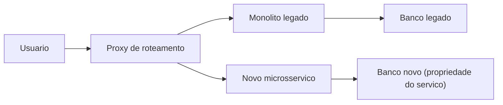
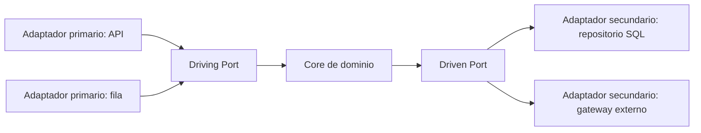
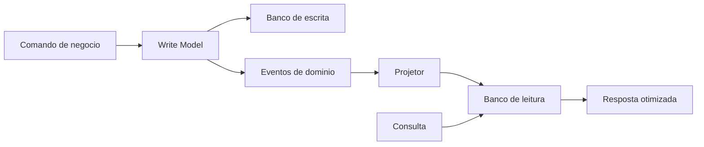
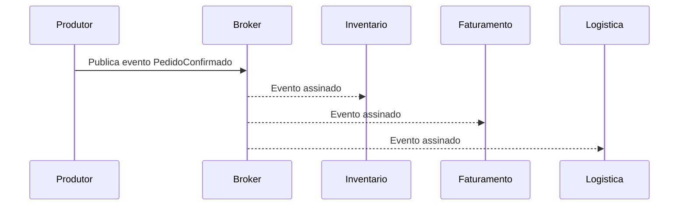
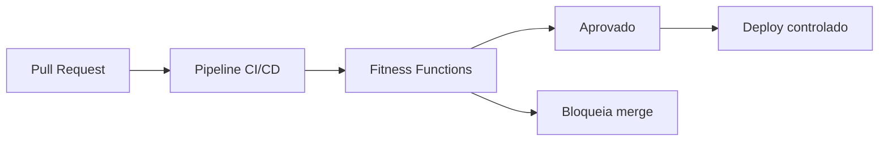

# **Construcción de sistemas resilientes: el valor empresarial detrás de las arquitecturas basadas en eventos y CQRS**

## **El imperativo de la modernización estratégica**

En el escenario digital contemporáneo, la agilidad de la arquitectura del software trasciende la mera eficiencia técnica para consolidarse como un principal diferenciador competitivo y un imperativo para la supervivencia empresarial. Las organizaciones de todos los sectores se enfrentan a una presión inexorable para innovar, adaptarse a las demandas volátiles del mercado y ofrecer experiencias de usuario en tiempo real. Sin embargo, esta aceleración choca violentamente con la realidad de las infraestructuras heredadas. Los sistemas construidos hace décadas funcionan como anclas corporativas: son inflexibles, peligrosamente costosos de mantener y, a menudo, incompatibles con los requisitos modernos de integración y escalamiento. Para los Directores de Tecnología (CTO) y Líderes Técnicos (Tech Leads), la administración de estos sistemas se traduce en una lucha diaria contra cuellos de botella en el desempeño, ciclos de implementación prolongados y una deuda técnica asfixiante.

La modernización de las aplicaciones heredadas ya no se considera un centro de costos puramente operativo, sino que se entiende como la liberación de valor estratégico. Los sistemas monolíticos, donde la interfaz de usuario, la lógica empresarial y las capas de acceso a datos están intrínsecamente acoplados y se ejecutan en un solo proceso, presentan graves limitaciones cuando es necesario escalar. El estrecho acoplamiento dicta que si una sola funcionalidad requiere más potencia informática, se debe replicar toda la aplicación, lo que resulta en un desperdicio crónico de recursos de la nube. Lo más crítico es que la arquitectura monolítica amplifica el "radio de explosión" de las fallas: un error en un módulo de informes puede agotar la memoria del servidor, provocando la caída del sistema crítico de procesamiento de pagos.

La transición a arquitecturas reactivas, modulares y evolutivas, con especial énfasis en la arquitectura basada en eventos (EDA), la segregación de responsabilidad de consultas y comandos (CQRS) y la arquitectura hexagonal (puertos y adaptadores), propone una cura sistémica para estas patologías arquitectónicas. Sin embargo, este viaje requiere un profundo cambio de paradigma no sólo en la escritura de código, sino también en la forma en que las organizaciones ven la ingeniería de software como un activo económico y en la forma en que estructuran sus equipos y procesos operativos.

## **La economía de la modernización: medición de la deuda técnica y el retorno de la inversión (ROI)**

Para justificar el paso de arquitecturas cristalizadas a modelos distribuidos complejos, el liderazgo técnico debe articular los beneficios en un lenguaje financiero convincente. La deuda técnica no debe tratarse como un concepto abstracto de ingeniería, sino cuantificarse como un pasivo financiero real en los balances de la organización, que acumula "intereses" a través de la degradación de la calidad del código, fallas del sistema, pérdida de velocidad de desarrollo y agotamiento del equipo.

Evaluar el retorno de la inversión (ROI) en iniciativas de modernización requiere un análisis forense del estado actual. Considere el escenario común de una corporación que opera un sistema de planificación de recursos empresariales (ERP) de dos décadas de antigüedad. Los costos anuales asociados con este sistema a menudo superan los cientos de miles de dólares, e incluyen tarifas exorbitantes de soporte de proveedores para mantener software obsoleto, costos de oportunidad vinculados a tiempos de inactividad no planificados y una pérdida sustancial de productividad para los ingenieros que luchan con una base de código incomprensible.

Al cuantificar el impacto de la modernización, las organizaciones suelen ser testigos de métricas financieras transformadoras. Las organizaciones de atención médica que implementaron estrategias de modernización lograron un retorno de la inversión del 206 % en tres años, y el período de recuperación se produjo en menos de seis meses. Estos resultados fueron posibles gracias a ganancias directas del 30% en la productividad de los equipos de operaciones de TI. La mitigación de riesgos también se traduce en formidables beneficios financieros: los estudios indican una reducción del 50 % en la exposición a violaciones de seguridad y menores costos de cumplimiento normativo a través del procesamiento automatizado.

### **Métricas de velocidad y el horizonte de evaluación**

El impacto más significativo de la modernización se manifiesta en el aumento exponencial de la velocidad del desarrollo. Las organizaciones a menudo ven que la tasa de entrega de nuevas funcionalidades se duplica o triplica después de consolidar una arquitectura basada en microservicios bien definidos. Esto permite que el mismo número de ingenieros entregue órdenes de magnitud mayores en valor comercial, reduciendo drásticamente el *tiempo de comercialización*. Si un competidor puede lanzar una nueva capacidad en dos semanas gracias a su arquitectura basada en eventos, mientras que su organización necesita tres meses para cambiar un monolito frágil, los beneficios de la modernización superan con creces los ahorros de costos, lo que impacta directamente el posicionamiento en el mercado y los ingresos.

Sin embargo, articular este retorno de la inversión exige rigor metrológico. El principal defecto de los proyectos de transformación es la ausencia de líneas de base rigurosas capturadas antes de que comience la modernización. El liderazgo debe documentar las frecuencias de implementación, el *Tiempo de entrega* para los cambios, el Tiempo medio de recuperación (MTTR), las tasas de defectos y los costos de infraestructura granular durante al menos tres meses antes de la modernización.

| Fase de Modernización | Dinámica de costos | Impacto en el ROI (Horizonte 3-5 años) |
| :---- | :---- | :---- |
| **Año: Transición** | Altísimo. Esfuerzo de reingeniería y costos de infraestructura en paralelo (Legacy \+ New Systems). | Negativo. Inversión intensiva en capital. |
| **Año: Optimización** | Promedio. Cambio de tamaño de instancias y eliminación de legados. | Punto de equilibrio. Los avances en velocidad y resiliencia comienzan a compensar los costos de transición. |
| **Años 3 a: Estado estacionario** | Bajo. Infraestructura puramente basada en el uso (*pago por uso*) y alta automatización. | Retorno masivo (200% a 304%). Agilidad total. |

La evaluación económica de las decisiones de infraestructura y los cambios en la plataforma de la nube no debe basarse en períodos de 12 meses. En horizontes cortos, el costo del paralelismo hace que cualquier migración parezca inviable. Sin embargo, al proyectar los costos del tercer al quinto año, el punto de inflexión financiero se hace evidente, mostrando que la modernización es la inversión tecnológica de mayor valor absoluto en el largo plazo.

## **Estrategias de descomposición: deconstruyendo el monolito sin interrupciones**

Una vez que se ha decidido la migración y se ha asegurado el presupuesto mediante un caso de negocio basado en datos, el principal desafío técnico es ejecutar el reemplazo sin interrumpir las operaciones actuales. El enfoque "Big Bang", que prescribe reescribir todo el sistema a puerta cerrada y cambiar todo el tráfico en un período de mantenimiento de fin de semana, es universalmente reconocido como la estrategia de mayor riesgo y tasa de fallas en la industria.

Mitigar este riesgo requiere la adopción rigurosa de estándares de migración incrementales que traten la disponibilidad de *tiempo de inactividad cero* como una restricción no negociable.

**Diagrama: descomposición incremental con higo estrangulador**


### **El patrón de la higuera estranguladora y el diseño basado en dominios (DDD)**

La metodología definitiva para limitar de forma segura los sistemas heredados es el patrón *Strangler Fig*. Esta estrategia propone el desarrollo de nuevos microservicios en la periferia del antiguo sistema. Una capa de enrutamiento (proxy) intercepta todas las solicitudes entrantes; si la funcionalidad solicitada ya ha sido migrada, la solicitud se dirige al nuevo microservicio; de lo contrario, se devuelve al monolito.

La ejecución de este patrón requiere detener el nuevo desarrollo (congelación de funciones) en el monolito, lo que obliga a desarrollar nuevas capacidades comerciales en la nueva arquitectura. A continuación, la identificación de los candidatos a la extracción se guía por los principios del *Diseño basado en dominios* (DDD). DDD dicta que los microservicios no deben dividirse en capas tecnológicas (un servicio para la base de datos, uno para la interfaz de usuario, otro para las reglas comerciales), sino que deben dividirse verticalmente en "contextos delimitados" que representan capacidades comerciales tangibles, como "gestión de catálogos" o "procesamiento de pagos". El aislamiento estricto permite que cada contexto defina la ubicuidad de su propia lengua y tenga autonomía sobre su ciclo de vida.

El imperativo absoluto de DDD al descomponer microservicios es la propiedad descentralizada de los datos. Un microservicio debe tener propiedad exclusiva de su base de datos, siendo el único componente al que se le permite escribir directamente en su esquema. La práctica dañina de extraer la lógica de la aplicación en docenas de servicios mientras todos continúan conectándose a una base de datos relacional monolítica compartida crea el antipatrón "Monolito distribuido", que combina los peores atributos de la latencia de la red con la incapacidad de escalar componentes individuales de forma aislada.

### **Migración de datos críticos y tráfico en la sombra**

El desacoplamiento de la base de datos representa el desafío técnico más formidable del proceso. Para las migraciones críticas que admiten una alta transaccionalidad, la simple copia fuera de línea no es tolerable. Se requieren estrategias sofisticadas de evolución de esquemas para que la base de datos pueda servir tanto la versión N (heredada) como la versión N+1 (nueva) simultáneamente.

El mecanismo de migración de la tabla en la sombra y la duplicación del tráfico son cruciales. La aplicación Shadow Traffic se puede realizar a través del servidor o del dispositivo. En el paradigma basado en servidor, un servicio de enrutamiento clona silenciosamente las solicitudes de producción entrantes, reenviando una copia a la infraestructura heredada y otra copia idéntica (que a menudo contiene identificadores únicos para correlación) al nuevo sistema reescrito. El servidor heredado atiende al usuario, mientras que las respuestas y los efectos secundarios generados por el nuevo servicio se registran y validan de forma asincrónica con los resultados heredados. Este estándar le permite validar exhaustivamente la nueva lógica de dominio en condiciones de producción exactas sin poner en riesgo al usuario final. La transición definitiva para el nuevo servicio sólo se produce cuando se demuestra estadísticamente la paridad de estado y rendimiento y los esquemas están completamente sincronizados.

El patrón *Leave-and-Layer* demuestra una excelente aplicabilidad en este contexto. La aplicación heredada continúa funcionando sin problemas y brinda servicio a los clientes sin interrupciones. Se le adjunta una capa delgada de publicación de eventos (a menudo usando captura de datos de cambios \- Captura de datos de cambios, o CDC, en el nivel de la base de datos), que emite eventos de cambios de estado a un bus centralizado (como AWS EventBridge). Nueva lógica empresarial y servicios modernos se suscriben a este bus para consumir actualizaciones, integrándose de forma asíncrona con la base de datos central sin afectar en ningún momento la disponibilidad del sistema fuente.

## **Aislar la lógica de dominio: la supremacía de la arquitectura hexagonal (puertos y adaptadores)**

A medida que nacen nuevos microservicios para absorber dominios extraídos del monolito, el principal vector de degradación interna y deuda técnica a combatir es el acoplamiento tecnológico. Tradicionalmente, los marcos de aplicaciones impulsaban el diseño de código: lógicas empresariales complejas se "filtraban" fatalmente en controladores web HTTP, o las reglas de facturación se codificaban directamente en anotaciones de entidades de Object-Relational Mapper (ORM). Como consecuencia de esta ingenua arquitectura en capas (donde la lógica empresarial depende directamente de la capa de la base de datos), un cambio en el proveedor de la base de datos o la actualización de un marco web requeriría reescribir las reglas comerciales fundamentales.

La Arquitectura de Puertos y Adaptadores, más tarde denominada Arquitectura Hexagonal por Alistair Cockburn, surge como la respuesta estructural a la inmunidad tecnológica. Su postulado central es subversivamente simple: la aplicación debe ser el artefacto central e independiente del sistema. Debe ser capaz de ser controlado por igual por usuarios web, llamadas API, pruebas automatizadas extensas o scripts por lotes, mientras permanece completamente aislado y ajeno a sus dispositivos de ejecución y tecnologías de bases de datos. El "Hexágono" no refleja una limitación de seis lados, pero ilustra topológicamente que el software puede tener múltiples puntos de entrada y salida arbitrarios e independientes.

**Diagrama: Arquitectura hexagonal (puertos y adaptadores)**


### **Anatomía de la abstracción: puertos, adaptadores primarios y secundarios**

El principio central de la Arquitectura Hexagonal es la Inversión de Dependencia, que opera estrictamente de afuera hacia adentro: todas las capas técnicas y de infraestructura externas deben depender exclusivamente de la capa empresarial interna (el núcleo), pero el núcleo nunca debe depender de ningún detalle externo. Esta formidable encapsulación se logra estableciendo dos conceptos cruciales:

1. **Puertos:** Representan contratos (a menudo implementados como interfaces abstractas en lenguajes de programación) que definen cómo interactúa la aplicación con el mundo exterior. La lógica empresarial declara precisamente lo que necesita recibir o enviar a través de estos puertos, de manera independiente del consumidor. Los puertos se dividen en *Driving Ports* (Interfaces que exponen los Casos de Uso que ofrece la aplicación) y *Driven Ports* (Interfaces que requieren servicios que la aplicación necesita del mundo exterior, como almacenamiento de datos).  
2. **Adaptadores:** Son los componentes concretos que habitan el anillo fuera de la aplicación, actuando como traductores entre el lenguaje sucio de protocolos tecnológicos específicos y el lenguaje puro del dominio.  
   * **Adaptadores Primarios (Conducción/Entrante):** Se encuentran en el lado izquierdo del hexágono conceptual, activando la aplicación. Los controladores HTTP RESTful, los controladores GraphQL, los oyentes de cola RabbitMQ o las interfaces CLI son adaptadores principales. Reciben el estímulo tecnológico, lo desenvuelven e invocan el *Driving Port* (el Caso de Uso inyectado).  
   * **Adaptadores Secundarios (Driven/Outbound):** Se encuentran en el lado derecho, siendo controlados por la aplicación para ejecutar efectos secundarios en el mundo exterior. Conexiones SQL vía ORM, clientes para llamadas a API de terceros (como Pasarelas de Pago) o publicadores de eventos en temas de Kafka. El dominio llama al *Driven Port* (por ejemplo, IRepositorioDePagamento), y la inyección de dependencia proporciona, en tiempo de ejecución, el adaptador concreto (por ejemplo, AdaptadorDePagamentoStripe) que realiza la operación.

### **El inconmensurable valor empresarial del aislamiento y la capacidad de prueba**

Para los CTO, la mitigación de riesgos asociada con la adopción de esta arquitectura supera los costos iniciales de la curva de aprendizaje del equipo. La principal recompensa tangible está en la aceleración masiva de la cobertura de pruebas automatizadas de alta fidelidad.

En las arquitecturas convencionales, probar la lógica de procesamiento de compras requiere la creación de instancias de una base de datos real y de todo el árbol de servidores web, lo que hace que las pruebas de integración sean lentas (de minutos a horas), lo que estrangula las prácticas de integración y implementación continuas (CI/CD). Con la Arquitectura Hexagonal, el equipo de ingeniería puede crear simulaciones (*mocks* o *stubs*) perfectamente aisladas de los puertos secundarios en la memoria. Por lo tanto, se pueden probar miles de escenarios comerciales complejos, que abarcan todas las permutaciones de reglas de dominio, en milisegundos, con confianza determinista, sin siquiera inicializar un contenedor de base de datos real.

Además, la arquitectura proporciona una protección suprema contra el *Vendor Lock-In* (bloqueo tecnológico impuesto por los proveedores de la nube). Si una decisión de la junta directiva exige la migración de un servicio de búsqueda basado en Apache Solr a Elasticsearch por motivos de licencia, el esfuerzo de reingeniería se limita exclusivamente al desarrollo de un nuevo adaptador secundario de Elasticsearch que implemente el puerto de búsqueda existente. La amplia capa de casos de uso empresarial que organizan la búsqueda, procesan los resultados y aplican reglas de seguridad permanecerá absoluta y demostrablemente intacta, lo que reducirá un proyecto de meses a semanas de ejecución segura.

## **Resolver el cuello de botella de lectura y escritura: segregación mediante CQRS**

Aunque la arquitectura hexagonal protege el código del acoplamiento tecnológico, el diseño transaccional inherente a los sistemas empresariales maduros crea enormes cuellos de botella en el rendimiento del almacenamiento de datos. El omnipresente patrón CRUD (Crear, Leer, Actualizar, Eliminar) manipula la misma representación estructural de la entidad del dominio (el mismo modelo de base de datos relacional) independientemente de si la acción subyacente es una actualización detallada del saldo o una consulta amplia de informes financieros agregados.

A medida que el software empresarial crece, queda claro que los requisitos transaccionales (escrituras) compiten ferozmente con los requisitos de visualización (lecturas). El escalado asimétrico es una realidad innegable en la industria del software: la inmensa mayoría de las aplicaciones modernas ofrecen velocidades en las que el volumen de lecturas es decenas o cientos de veces mayor que el volumen de mutaciones de estado (escrituras). Cuando se somete a estas cargas simultáneas en un solo modelo (Single Data Store), la base de datos sufre contención de bloqueos, índices conflictivos y una degradación catastrófica de la capacidad de respuesta.

El estándar CQRS (*Command Query Responsibility Segregation*) fractura intencionalmente el modelo de datos, declarando que el flujo arquitectónico que cambia el estado del sistema y el flujo que lo consulta deben existir en absoluto paralelo y optimizarse por separado.

**Diagrama: flujo CQRS con proyecciones**


Ilustrativo (TypeScript): el mismo caso de uso separa la intención de mutación (comando) de la lectura sin efectos secundarios.

```typescript
// Comando de escrita — valida invariantes e persiste no write model
type ConfirmarEmbarque = { pedidoId: string; sku: string };

async function handleConfirmarEmbarque(cmd: ConfirmarEmbarque): Promise<void> {
  // regras de domínio + emissão de eventos para projeções
}

// Consulta — apenas leitura do read model (desnormalizado)
type ResumoPedido = { pedidoId: string; status: string; total: number };

async function obterResumoPedido(pedidoId: string): Promise<ResumoPedido> {
  return readStore.buscarPorId(pedidoId); // sem JOINs pesados na hora
}
```
### **La dicotomía del modelo: comandos versus consultas**

La adopción de CQRS requiere un modelado de tráfico riguroso e intencional:

* **Lado del comando (el modelo de escritura):** Está estrictamente diseñado para procesar operaciones que cambian los datos persistidos en el sistema. En lugar de actualizaciones anémicas basadas en campos técnicos (por ejemplo, ACTUALIZAR Estado \= 2), los comandos encapsulan una rica intención comercial semántica (por ejemplo, ConfirmProductShipping). El modelo de escritura es el guardián inquebrantable de las reglas e invariantes del dominio; consolida una validación de seguridad compleja y está optimizado para la integridad puramente transaccional (garantías ACID), generalmente asignando datos altamente normalizados en la Tercera Forma Normal (3NF) para erradicar las anomalías de actualización.  
* **Lado de consulta (el modelo de lectura):** Por el contrario, no realiza ningún cambio de estado. Su único propósito es recuperar información a muy alta velocidad y formatearla adecuadamente para la interfaz de usuario sin contener fragmentos no deseados de lógica de dominio. Las optimizaciones de bases de datos para el modelo de lectura prefieren esquemas severamente desnormalizados, a menudo "aplanando" entidades complejas para evitar agregaciones costosas u operaciones de unión (*JOIN*) durante la ejecución de consultas.

### **Proyecciones materializadas y desempeño implacable**

El beneficio de escalabilidad del terminal que ofrece el estándar CQRS se logra cuando los modelos no sólo están separados lógicamente en el código, sino también físicamente en bases de datos distintas. El modelo de escritura puede residir en un robusto grupo de bases de datos relacionales (como PostgreSQL) adecuado para un cumplimiento estricto de la atomicidad, mientras que el modelo de lectura puede ser una base de documentos hiperescalable (como MongoDB) o un índice optimizado para búsqueda de texto (como Elasticsearch).

Esta separación física permite utilizar **Materialización de proyección** para eliminar latencias en consultas complejas. En un sistema monolítico sin CQRS, el requisito de crear el "Panel de control de clientes consolidado" exige solicitudes complejas que unen (*JOIN*) docenas de tablas relacionadas con pedidos históricos, estado de facturación, tickets de soporte y devoluciones cada vez que se carga la página, consumiendo un tiempo masivo de E/S de disco con cada visita e impactando a los usuarios que intentan realizar compras.

Con CQRS y proyecciones, el laborioso cálculo no se realiza “bajo demanda”. A medida que se producen actualizaciones o compras individuales (eventos) en segundo plano, las rutinas escuchan estos cambios y transforman iterativamente el evento en un fragmento del panel ya procesado. Estos documentos precalculados (materializados) se actualizan silenciosamente en el modelo de lectura. Cuando el usuario realmente accede al tablero, el modelo de lectura realiza una búsqueda simple y de bajo costo computacional de una clave primaria, obteniendo instantáneamente el resultado consolidado y regresando en tiempos de respuesta de microsegundos. El modelo de escritura se centra exclusivamente en el rendimiento de la transacción (rendimiento de escritura) y el modelo de lectura no sobrecarga la escritura bajo ninguna circunstancia.

| Característica | Patrón monolítico (CRUD clásico) | Estándar Segregado (CQRS con Proyecciones Físicas) |
| :---- | :---- | :---- |
| **Arquitectura de base de datos** | Esquema único y altamente acoplado. | Diferentes bancos; esquemas adecuados para su propósito. |
| **Acceso a datos mientras lee** | Ejecución de *JOINs* complejos sobre la marcha. | Recuperación sencilla de documentos precalculados y desnormalizados. |
| **Dimensionamiento de Infraestructura** | Escalamiento vertical costoso y obligatorio; imposibilidad de distinguir cuellos de botella. | Escalado asimétrico (escalabilidad horizontal infinita solo de la estructura del servidor de lectura). |
| **Complejidad del código** | La lógica de presentación se filtra en las reglas de actualización a través de ORM gigantes. | Separación brutal; Comandos puros basados ​​en la intención comercial frente a recuperaciones simplificadas. |

### **Eventuales compensaciones por coherencia**

El CTO y los líderes tecnológicos que optan por esta arquitectura sofisticada deben comprender y gestionar imperativamente su compromiso fundamental: **Consistencia eventual**. El desacoplamiento de flujos implica que la actualización realizada con éxito en el modelo de grabación no se propaga instantáneamente a la capa de visualización en todos los casos.

La replicación de datos de comandos en datos de consultas desnormalizados impone latencias que pueden variar desde milisegundos hasta segundos. En consecuencia, la interfaz de usuario podría registrar la modificación transaccional pero mostrar el registro retrasado en la lectura posterior inmediata. Este "retraso del consumidor" transitorio requiere el desarrollo de la interfaz humana (Frontend) para emplear dispositivos de tolerancia, ya sea disfrazando la solicitud con respuestas visuales optimistas, informando que los datos se están procesando o forzando recargas en intervalos cortos (sondeo adaptativo). Las instituciones financieras altamente estrictas superan esta barrera de latencia mediante la creación de mecanismos compensatorios en la arquitectura EDA paralela para garantizar una sincronización final precisa en milisegundos críticos. No hay sincronización instantánea en sistemas distribuidos físicamente y CQRS adopta la asincronicidad inherente en lugar de suprimirla mediante costosos esquemas de bloqueo distribuido de dos fases (compromisos de 2 fases).

## **El sistema nervioso empresarial: arquitectura basada en eventos (EDA)**

La eficacia insuperable del modelo CQRS a escala depende intrínsecamente de cómo se produce la sincronización entre el lado de escritura y el lado de lectura. La tecnología vital que permite la transición fluida de los cambios de estado entre estos dominios independientes, sin crear cuellos de botella de dependencia sincrónica, es la arquitectura basada en eventos (EDA).

En sistemas no controlados por eventos, cuando el Servicio de pedidos procesa el pago del comercio electrónico, activa comandos sincrónicos HTTP directos al Servicio de inventario (para reducir el inventario), al Servicio de facturación (para generar facturación) y al Servicio de logística (para enviar el producto). This deep chain (RPC calls) fatally ties up applications. Si el módulo de notificaciones por correo electrónico no funciona, toda la transacción de compra corre el riesgo de fallar o de ralentizar todo el recorrido del consumidor final.

La llegada de EDA establece un paradigma radicalmente desconectado y asincrónico. La aplicación que generó el cambio vital (“El Productor”) no conoce ni le importa la existencia de quienes necesitan actuar (“Los Consumidores”). La lógica se basa en producir, anunciar reacciones ante el suceso en tiempo real y liberar recursos inmediatamente.

**Diagrama: Cadena productor intermediario consumidor**


En este contexto, los microservicios utilizan un intermediario robusto (Message Broker o Stream Backbone), a menudo orquestado a través del ecosistema de infraestructura de alto rendimiento de Apache Kafka, soluciones nativas administradas como AWS EventBridge o redes de mensajería robustas a través de Apache Pulsar. El Productor deposita silenciosamente el hecho ("El Evento") ante el corredor, como TransacaoRealizada. Los consumidores se suscriben a canales y toman medidas de forma independiente y dentro de sus propios tiempos de procesamiento.

### **Categorías de propagación: desde la notificación hasta el abastecimiento de eventos**

La complejidad arquitectónica y el propósito impulsan tres subpatrones vitales dentro del tejido del evento:

1. **Notificación de evento:** La señal más rudimentaria. El microservicio de gestión de usuarios transmite un evento parsimonioso como UserDeleted(ID=990). La señal sólo sirve para advertir a los oyentes; Si necesitan información detallada para auditorías contextuales, deberán enviar nuevas solicitudes independientes. Aunque es simple y tiene poco ancho de banda, esta mecánica conlleva el costo de obligar a los servicios asíncronos a recurrir a invocaciones de rescate síncronas en la fuente original, lo que incurre en latencias agregadas no deseadas.  
2. **Transferencia de estado transportada por eventos \- ECST):** Este modelo mejora enormemente la independencia. El acontecimiento fluye encapsulando no sólo la ocurrencia del hecho, sino también llevando plenamente todos los atributos inmutables que describen la nueva realidad. El evento OrderConfirmed vincula no solo la clave de identificación, sino también los detalles de todos los artículos en el carrito, el total facturado, el método de pago y la dirección final del consumidor. Los sistemas CRM, las plataformas de entrega o facturación consumen estas estructuras hiperdensas e inmediatamente llenan sus bases de datos locales privadas. El tráfico redundante de regreso al núcleo (búsquedas posteriores de más información del dominio de origen) se mitiga casi por completo, inculcando total resiliencia en los consumidores, que continúan funcionando en función de sus copias activas si el monolito de origen experimenta apagones.

Ejemplo mínimo de *carga útil* en ECST (en el broker, el contrato suele estar versionado con Avro o JSON Schema):

```json
{
  "type": "PedidoConfirmado",
  "version": 1,
  "pedidoId": "ped-8831",
  "itens": [{ "sku": "SKU-1", "qtd": 2, "precoUnitario": 49.9 }],
  "total": 99.8,
  "metodoPagamento": "pix",
  "enderecoEntrega": { "cep": "01310-100", "cidade": "São Paulo" }
}
```
3. **Event Sourcing:** Esta técnica redefine los fundamentos tecnológicos de la capa de base de datos. El estado final no se registra, pero sí las transiciones individuales; cada entidad está representada exclusivamente por una secuencia crónica e inmutable de deltas de cambios a lo largo de la vida, guardados en archivos indexados orientados al almacenamiento anexable (*registros de solo adición*). Cuando el software necesita reconstituir la cantidad disponible en la cuenta de un titular de cuenta, lo calcula de manera determinista aplicando – evento por evento, a través de reproducción continua e inmutable (Reproducción) – cada historial individual de Retiro y Depósito registrado contra esa identificación de agregación bancaria desde la apertura primaria hasta el momento requerido en el tiempo.  
   La adopción de Event Sourcing combinada con CQRS permite una recuperación ante desastres atemporal, garantizando pistas de auditoría que son inherentemente impenetrables en la industria financiera. Una enorme base de bancos depende de herramientas dedicadas como EventStoreDB o infraestructuras logarítmicas de Kafka para proporcionar esta perennidad contra manipulaciones no deseadas. Esta fuerza destructiva de la replicación determinista va acompañada de un costo abrumador en complejidad arquitectónica (curva de aprendizaje extrema, uso masivo y perpetuo del almacenamiento y la necesidad de rutinas periódicas de 'instantáneas' que impiden el recálculo de historiales con millones de registros).

### **Mitigación de fallas sistémicas con resiliencia y elasticidad inherentes**

Para comprender las ramificaciones comerciales y la defensa indiscutible de los CTO sobre Event Mesh (EDA), el beneficio vital se centra en aislar las tormentas de cuellos de botella en el entorno de la nube. Al desacoplar dependencias severas durante pulsos atípicos de hipertráfico en momentos corporativos vitales como el Black Friday, el inmenso volumen de exceso de demanda inesperado (carritos desbordados en poco tiempo) fluye para ser almacenado en el repositorio de Event Broker o en sistemas de cola tolerantes al llenado del disco sin una falla abrupta.

Shopify documenta el tráfico vertiginoso manejado por las redes troncales temáticas de Kafka que procesan alrededor de 66 millones de mensajes agregados que operan por milisegundo de estabilidad elástica extrema, lo que permite reacciones modulares continuas. A diferencia del patrón fijo tradicional que obliga a la desesperada adición vertical global de potencia informática de AWS (factorizando la factura al extremo y no reaccionando a la demanda ágil), la estructura centrada en la asincronicidad impulsada por eventos desvía los picos brutales para descansar en la malla segura de espera continua del corredor.

Incluso con los sistemas periféricos y las dependencias de pago no disponibles debido a la latencia, ningún registro o flujo de viaje principal original se corrompe, y cada elemento se reactivará para buscar activamente la continuación en el momento de la restauración automática, guardando cascadas crónicas o pantallas que contengan errores (Tiempos de espera fatales) para el cliente al finalizar la compra transaccional.

### **El lado oscuro operativo y los desafíos de gobernanza en EDA**

Sin embargo, ningún paradigma está exento de cargas ocultas que el liderazgo técnico superior debe mitigar. Los sistemas estrictamente basados ​​en eventos, si bien promueven la liberación de dependencias a nivel de infraestructura, imponen profundos obstáculos conceptuales:

* **Retraso del consumidor y observabilidad limitada:** si la aplicación emite eventos excesivamente por encima del límite que las particiones posteriores son capaces de absorber (rendimiento), la latencia de vaciar la cola de retención se acumulará (acumulación de retraso del consumidor), lo que en la práctica limita e invalida la naturaleza propagada en tiempo real. Tratar con orquestaciones independientes hace que sea drásticamente difícil rastrear fallas generalizadas: ¿dónde exactamente se encontraba un error asincrónico en una larga cadena entre docenas de microservicios? Es obligatorio inculcar en la pesada transición de los sistemas metodologías de seguimiento absolutas y costosas con identificadores estrictos transmitidos desde la emisión en la capa frontal a través de DataDog, CloudWatch y New Relic (Distributed Tracing Instrumentation) vinculados a la observación detallada del comportamiento de las particiones y la salud operativa temporal de todos los corredores.  
* **Amenaza sistémica de duplicación de entregas (semántica exactamente una vez x al menos una vez):** Las fallas en las conexiones de rutina harán que el ecosistema active invariablemente retransmisiones automáticas de la misma señal realmente llena al suscriptor que la perdió en el vacío ("Semántica al menos una vez"). La ejecución de mensajes varias veces sin que una ingeniería deficiente se dé cuenta puede causar catástrofes comerciales irreversibles, como procesar reembolsos dobles no deseados sobre la base. Es un precepto obligatorio codificar sistemas con lógica universal *Idempotente* en sus capas para proteger que los continuos reprocesamientos causales sucesivos del hecho singular en sí nunca manifiesten corrupciones sistémicas adyacentes en estados de destino posteriores al evento originador inicial.

Defensa típica contra reenvíos (*al menos una vez*): registre el identificador del evento antes de aplicar efectos secundarios irreversibles.

```typescript
async function processarReembolso(
  eventoId: string,
  payload: ReembolsoPayload
): Promise<void> {
  if (await jaProcessado(eventoId)) return;
  await aplicarCredito(payload);
  await marcarProcessado(eventoId);
}
```
* **Gobernanza estricta y ruptura de esquemas:** De manera similar a las actualizaciones directas restrictivas (API que rompen la dependencia), modificar imprudentemente los nombres o eliminar atributos obligatorios en temas de bus inmutables destruye irreversiblemente los subecosistemas vinculados silenciosamente a recibir el diseño de campo antiguo y específico. Una gobernanza estricta arquitecturada mediante control forzado automatizado en repositorios aislados (Validación de Registro de Esquemas) impone contratos rígidos que aseguran actualizaciones controladas, documentadas globalmente bajo formatos estandarizados en la infraestructura, validando si son versiones que se adhieren a la transición retroactiva universal (Política de Compatibilidad Retrospectiva).

## **Garantizar la fidelidad: arquitectura evolutiva y funciones físicas**

El diseño de la estructura descentralizada asíncrona impulsada por dominios basados en puertos rigurosamente delineados en Arquitecturas Hexagonales dicta la excelencia en el nacimiento del ecosistema. Sin embargo, los ecosistemas envejecen amargamente y las arquitecturas construidas se degradan en acoplamientos caóticos con el movimiento continuo en la intensa rotación de la fuerza técnica, sumado a las presiones del mercado para el lanzamiento frenético inmediato de nuevas capacidades de innovación dentro de la agilidad estipulada.

Preservar la disciplina requerirá, sin duda, adoptar mecanismos estructurados que garanticen evaluaciones sin fricciones manuales continuas por fallas humanas. La metodología base para esta mitigación automática responde a través de lineamientos formalmente denominados por la industria como **Arquitectura Evolutiva**, enfocados íntegramente en construir sistemas que tengan una tolerancia natural que soporte y oriente cambios evolutivos continuos controlados simultáneamente en múltiples matrices no funcionales esenciales (escalabilidad, seguridad y confiabilidad).

Para anclar sólidamente esta maleabilidad sistémica con salvaguardas sin obstáculos y estancamientos en la gobernanza y los procesos, los CTO adoptan la ingeniería **Funciones de aptitud arquitectónica**, que refleja firmemente el éxito de las prácticas de desarrollo basadas únicamente en pruebas (Desarrollo basado en pruebas \- TDD). Así como el equipo escribe bloques mínimos y delimitados que validan la lógica y los resultados antes de que se cree el software completo, las *Funciones de Fitness* comprenden reglas codificadas, donde su invocación continua brinda integridad tangible inmediata a las reglas de límites estructurales requeridas, verificando las alineaciones restrictivas esenciales para la estandarización y bloqueando las desviaciones.

**Diagrama: canalización de gobernanza arquitectónica**


### **ArchUnidad y Vigilancia Efectiva del Borde Hexagonal**

Los sistemas centrados exclusivamente en los límites del DDD a través del Hexágono requieren un aislamiento blindado en sus bordes, y la dependencia cíclica que se filtra desde el exterior hacia el interior destruirá silenciosamente el principio cardinal. Sobre una base empresarial adoptada por ecosistemas de mercado robustos desarrollados en Java y TypeScript, la limitación de la contaminación arquitectónica se manifiesta en el bloqueo abierto de la integración automatizada al combinar la validación explícita de potentes bibliotecas de evaluación que analizan sintaxis estructurales, dependencias cíclicas entre repositorios profundos y lógicas internas en tiempo de compilación sin intervención externa ni opiniones del equipo: la adopción vital de las herramientas **ArchUnit**.

Ejemplo de *función de fitness* en Java (regla que falla la compilación si el paquete del dominio comienza a depender de Spring o JPA):

```java
import com.tngtech.archunit.junit.AnalyzeClasses;
import com.tngtech.archunit.junit.ArchTest;
import com.tngtech.archunit.lang.ArchRule;

import static com.tngtech.archunit.lang.syntax.ArchRuleDefinition.noClasses;

@AnalyzeClasses(packages = "com.empresa")
class FronteiraHexagonalTest {

  @ArchTest
  static final ArchRule dominio_isolado =
      noClasses()
          .that().resideInAPackage("..domain..")
          .should().dependOnClassesThat()
          .resideInAnyPackage("org.springframework..", "jakarta.persistence..");
}
```
1. **La filosofía de las puertas de retorno únicas y múltiples (puertas unidireccionales versus puertas bidireccionales):**  
   Esta matriz concebida por lógicas directivas operativas basadas en las eficientes prácticas nativas de Amazon busca clasificar todas las implementaciones sistémicas que requieren definiciones en la transición técnica, separando categóricamente sus retornos:  
   * **Decisiones Categóricas Unidireccionales (Puertas de un solo sentido):** Elecciones de profundo peso, altísimo costo, peligrosas y que atan permanentemente la base organizacional a vínculos intrínsecos severamente arraigados sin posibilidad de retirada amistosa y segura. Invertir masivamente y cambiar toda la base primaria, forzando la transición del ecosistema para centrarse únicamente en el procesamiento restrictivo a través del registro de rutas en Event Sourcing nativo, separando las bases universales de SQL puro, requiere una inmensa cantidad de tiempo invertido, migraciones intensas, un cambio cognitivo radical corporativo completo del equipo o la selección de la infraestructura de nube fundamental. Las reversiones obligan al abandono de los multimillonarios o a meses de reescrituras exhaustivas bajo presiones desastrosas y castigos regulatorios (colchones de riesgo severo). Exigen un análisis global en profundidad muy riguroso.  
   * **Decisiones Bidireccionales Flexibles (Puertas de Dos Vías):** Son deliberaciones transitorias de arquitectura y tecnología con fricciones superficiales en las esferas de desarrollo, capaces y orientadas a ser desactivadas, probadas, revocadas o reemplazadas localmente de una manera extremadamente limpia y sencilla, con costos ignorables y riesgos inofensivos para la capa crítica vital de la lógica en los negocios protegidos. Los lanzamientos internos efímeros en bibliotecas contenidas exclusivamente en puertos primarios locales o adopciones más pequeñas en sistemas accesorios son el ejemplo de decisiones ágiles bidireccionales liberadas de las desaceleraciones burocráticas de las juntas ejecutivas de base para impulsar innovaciones continuas y sin restricciones con agilidad inmediata.  
2. **Cementación operativa posterior a la decisión (Arquitecturas registradas en ADR):** Entendiendo los aspectos de evaluación de las puertas unidireccionales que dictan la dirección de las evoluciones estructurales o el corte crítico de módulos vitales en las modernizaciones heredadas a través de CQRS, la mitigación real del CTO se basa en la fricción generada por la rotación volátil crónica de los propios futuros equipos, cuestionando el legado del proyecto e interrumpiendo ritmos constantes del trabajo sistémico en litigio. inútil (Relitigar opciones). El artefacto primario requerido en organizaciones de ingeniería efectivas y de alto nivel es la creación resumida y sistemática en registros trazables contenidos estrictamente en el propio control base vinculado al código fuente e inmutables de las justificaciones contextuales que fundamentaron el diseño técnico vigente en ese momento, conocidos en el ambiente de desarrollo como *Architecture Decision Records (ADRs)*. En ágiles documentos de rebajas dispuestos universalmente en siete limpias secciones, delimitan de forma quirúrgica y unánime: La motivación esencial (El contexto base en la elección de CQRS para aliviar la peligrosa contención de bloqueos en los módulos del monolito saturados de consultas BI vinculadas a picos de ventas en la interfaz principal), La estrategia aceptada (Aislamiento en clusters físicos Mongo/PostgreSQL), Las consecuencias y cargas absurdas del proyecto acordado (Adopción de las complejidades de gestionar eventuales consistencias problemáticas para abastecer a los directores de la base de clientes), y los Modelos de Solución Competitivos rechazados formalmente en los informes y la razón detrás de esta abdicación temporal.  
3. **Democracia inoculada ante desastres (La Junta de Gobierno de EA/ARB y la Matriz RACI):** Con la gobernanza, el Liderazgo y los directores de la arquitectura consolidada limitan obstáculos estructurales peligrosos en las sedes en cierres excesivos, utilizando segregación universal en la delegación y responsabilidad transparente, delimitando estrictamente los propietarios de la implementación global entre las partes mediante el uso clásico de la asignación en la Matriz Ejecutiva "RACI" en arquitecturas de decisión amplias orientadas a los puertos de riesgo (Responsabilidad aislada y proveedor final de rendición de cuentas). "Responsables"; Desarrolladores "Responsables"; Reducción a micro juntas de consultores para consejos de base "Consultados" que bloquean análisis de parálisis fatal de vetos difundidos sin necesidad gerencial en Puertas unidireccionales y amplia capa informativa de notificación a observadores pasivos "Informados" de la junta en amplios cambios a la base organizacional). Junto con direcciones estratégicas de tamaño absoluto que

e impulsar modernizaciones vitales a grandes plataformas de base que requerirán integraciones colosales con esferas cruzadas no técnicas de empresas reguladas (Bancos y complejos multicanal de atención médica en modernizaciones transaccionales pesadas), encontró el panel ejecutivo y diverso de la Junta Ejecutiva de Revisiones sobre Estándares de Evolución de Directrices (Junta de Revisión de Arquitectura \- ARB), esencialmente asegurando que todas las transiciones heredadas profundas se sometan a una verificación estructurada en foros ejecutivos directos de la organización alineándose sistemáticamente con el objetivo vital de la empresa para proteger el retorno de valor continuo y proteger las arquitecturas, pero consciente de dar paso activamente a la hipergobernanza rígida con adopciones puramente pragmáticas a través de funciones de fitness continuas e invisibles codificadas para los equipos y equipos.

A través de estas implacables suites insertadas en los canales centrales de la cadena de implementación constante CI/CD nativa de la organización, los líderes e ingenieros senior establecen pruebas programáticas definitivas que expresan que las clases presentes únicamente en carpetas de paquetes estructuralmente llamadas "Dominio" nunca pueden hacer referencia internamente a la lógica nativa, la llamada web abstracta directa restrictiva proveniente de la plataforma corporativa base Spring Framework. A la más mínima importación sutil de dependencia indebida en la arquitectura del acoplamiento del motor de la base de datos o de las conexiones web dentro de la región del dominio limpio en revisiones aisladas inmaduras de PR (Pull Requests), el código viola activamente el principio arquitectónico subyacente, causando que las suites *Fitness Functions* de ArchUnit fallen inmediatamente globalmente y bloqueen despiadadamente cualquier envío a los repositorios primarios de la nube para su aprobación sin posibilidad de fusión no deseada en el código central corporativo protegido. Se añaden bloqueos métricos automatizados, imponiendo el rechazo de los lazos circulares cruzados que devastan la evolución de las funcionalidades en los sistemas o deteniendo clases que amplían excesivamente sus funciones a pesar de complejidades cognitivas severamente desequilibradas internamente predefinidas en umbrales (métricas de Complejidad Ciclomática).

### **Evolución de la gobernanza transversal**

Además de los límites expresos de los fundamentos en el código a través de herramientas de acoplamiento estático, también se implementa activamente un monitoreo continuo integral mediante sistemas destinados exclusivamente a manifestaciones observables en vivo de comportamientos dinámicos de malla (funciones dinámicas/de aptitud en tiempo de ejecución). Los disparadores rígidos están configurados en las mallas de observación en la malla de AWS vinculada a Datadog para interceder activamente cada vez que reacciones lentas encadenadas de eventos entre microaplicaciones cruzan el tiempo de respuesta esperado o exceden el retraso permitido estipulado en los brokers de bucle de eventos limitados de la compañía, anulando así pérdidas graduales crónicas y peligrosas causadas por reingeniería y despliegues progresivos que no respetarían la adaptación a corto o medio plazo en las arquitecturas activas (Regression Performance Alerts). Incluso intrincadas balizas ecológicas monitorean sistemáticamente los cuellos de botella en la Nube bajo requisitos rigurosos que evalúan las huellas de carbono operativas en el procesamiento dinámico en los Centros de Datos, a través del indicador de Sostenibilidad *ecoCode* integrado en los Requisitos No Funcionales (NFR) de la organización.

## **Marcos de estructuración de gobernanza y decisión ejecutiva (liderazgo CTO)**

Cada pilar denso centrado en los fundamentos y la ingeniería de las transiciones cubiertas en esta exploración técnica requiere unificación con la capa de gestión pragmática holística, para extraer ganancias y evitar trampas contraintuitivas que amenazan las adopciones en empresas estructuradas en la realidad y con recursos limitados. La evaluación técnica atraviesa invariablemente el mundo de la complejidad económica, y el liderazgo ejecutivo técnico (CTO y Tech Leads senior) necesariamente da forma a mecanismos para clasificar metódicamente prioridades, mitigar impactos riesgosos, evaluar caminos y formalizar documentación y compromisos que eliminarán obstáculos políticos imprevistos o costosos reveses operativos en la organización (Estrategia de Gobernanza de Cultura de Veto).

La base para la conversión de estas directrices se basa en metodologías consolidadas e hitos adoptados en los sistemas globales más peligrosos operados en el sector, y basa la taxonomía en:

Para los líderes que dan forma a la resiliencia perpetua de la organización contemporánea con una base escalable ilimitada a través de los principios sinérgicos modulares de Puertos y Adaptadores, la extrema complejidad técnica respaldada en los estándares analíticos de CQRS reflejada en los pulsos vitales de los sistemas reactivos de las mallas asíncronas de EDA no forman metodologías separadas para mitigar las limitaciones simples de escalabilidad; formar el arsenal táctico cohesivo obligatorio para convertir definitivamente todas las limitaciones y responsabilidades operativas cristalizadas en los legados de ineficiencia en bases heredadas obsoletas en capital intelectual competitivo, autónomo, modular, reactivo e inmortal para desafíos implacables, escalares y perennes en mercados globales dinámicos.

---

## ¿Quieres evaluar este escenario en tu contexto?

Si desea transformar estas directrices en un plan técnico ejecutable, hable con Web-Engenharia. Realizamos un diagnóstico técnico de su entorno y diseñamos una consultoría especializada con prioridades, riesgos y hoja de ruta de implementación.)