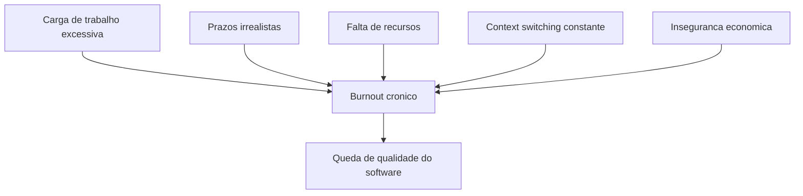
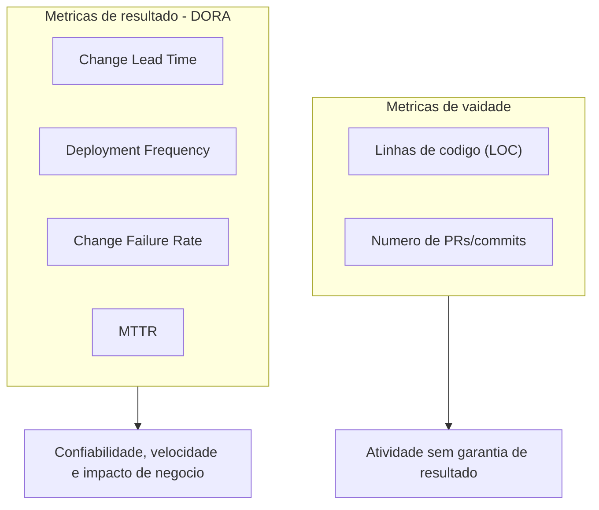
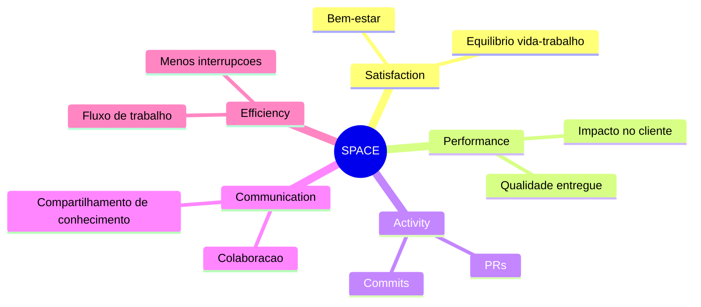
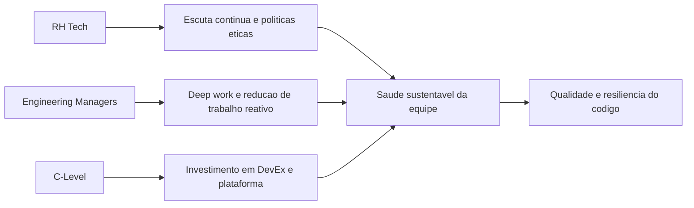

# **La métrica invisible: cómo la salud y el bienestar de los desarrolladores afectan la calidad del código**

La ingeniería de software contemporánea se basa en una profunda paradoja estructural: aunque la infraestructura tecnológica está diseñada con redundancias masivas para lograr escalabilidad, resiliencia y alta disponibilidad, la infraestructura humana que la construye y la mantiene a menudo es llevada al punto de falla sistémica. Históricamente, la industria tecnológica y el capital de riesgo han evaluado el éxito de la ingeniería a través de métricas de producción puramente mecánicas, centrándose en la velocidad de entrega, el volumen de código y el tiempo de actividad del servidor. Sin embargo, un análisis empírico riguroso del ciclo de vida del desarrollo de software (SDLC) revela que la calidad del código base, la seguridad de la arquitectura y la estabilidad de las aplicaciones están umbilicalmente vinculadas a una métrica a menudo invisible en los paneles corporativos: la salud mental, el bienestar psicológico y la carga cognitiva de los desarrolladores.

El desarrollo de software es una actividad inherentemente sociotécnica y altamente cerebral, que requiere estados prolongados de concentración profunda, resolución creativa de problemas y adaptación constante a nuevos lenguajes, marcos y paradigmas operativos. Cuando los profesionales que realizan estas tareas operan bajo estrés crónico, hay una degradación mensurable en sus capacidades cognitivas. Esta degradación no se manifiesta sólo como insatisfacción laboral; se traduce directamente en fallas lógicas en la arquitectura, un aumento exponencial en la densidad de defectos y la introducción de vulnerabilidades críticas en los sistemas de producción. Este informe analiza exhaustivamente la intersección entre el monitoreo proactivo del estado del equipo técnico, la mitigación del agotamiento estructural y el aseguramiento de la calidad del software, proporcionando un marco estratégico basado en datos para líderes de ingeniería, gerentes de Recursos Humanos (HR Tech) centrados en la tecnología y fundadores de startups.

## **El panorama del agotamiento tecnológico: una crisis sistémica y cuantificable**

El estado actual de la fuerza laboral de ingeniería de software indica una crisis de agotamiento sistémico, impulsada por ciclos de velocidad implacables, sobrecarga digital, proliferación de herramientas y cambios macroeconómicos severos. Investigaciones recientes pintan un panorama alarmante del deterioro del bienestar en la industria tecnológica global, lo que demuestra que el agotamiento no es una palabra de moda pasajera sino una epidemia ocupacional. Una encuesta de toda la industria proyectada para 2024 y 2025 reveló que el 68% de los trabajadores de tecnología informaron haber experimentado síntomas agudos de agotamiento, lo que representa un aumento sustancial con respecto al 49% registrado apenas tres años antes.

**Diagrama: Vectores estructurales del agotamiento**


En mercados específicos y en encuestas dirigidas estrictamente a promotores, la situación es aún más crítica. Casi tres cuartas partes (73%) de los profesionales europeos de tecnología de la información informaron haber experimentado estrés o agotamiento continuo relacionado con el trabajo. Otros estudios independientes centrados en plataformas de análisis de ingeniería han indicado que las tasas de agotamiento alcanzan un alarmante 83% entre los programadores. Estos datos muestran que el agotamiento se ha convertido en el estado de funcionamiento predeterminado y no en una anomalía temporal.

| Métrica de agotamiento | Porcentaje reportado | Contexto de la investigación y factores contribuyentes |
| :---- | :---- | :---- |
| **Síntomas de agotamiento (generales)** | 68% | Aumento respecto al 49% tres años antes; impulsado por la sobrecarga digital y la velocidad de la innovación. |
| **Estrés/Agotamiento (Europa)** | 73% | El 61% lo atribuye a grandes cargas de trabajo; el 44% a plazos ajustados; 43% por falta de recursos. |
| **Riesgo de agotamiento en la tecnología** |.1% | Trabajadores clasificados como de "alto riesgo" de agotamiento inminente. |
| **Agotamiento del desarrollador** | 83% | Informado en estudios de plataformas de análisis de desarrolladores, centrándose en la falta de autonomía y propósito. |

*Tabla: Resumen estadístico del burnout profesional en la industria tecnológica (2024-2025).*

Las raíces de este agotamiento son multifacéticas y van mucho más allá del simple hecho de trabajar demasiadas horas. El agotamiento es catalizado por expectativas poco realistas de productividad lineal, arquitecturas de sistemas demasiado complejas o monolíticas y una montaña de deuda técnica heredada que convierte cualquier cambio de código en un campo minado. Más del 60% de los profesionales atribuye el estrés en el trabajo a una carga excesiva de tareas, mientras que factores estructurales como plazos de entrega irrealmente ajustados y la falta crónica de recursos afectan a más del 40% de la fuerza laboral. La cultura del trabajo ininterrumpido, exacerbada por políticas de trabajo remoto mal estructuradas, ha desdibujado gravemente los límites entre el trabajo y la vida personal. La inmensa mayoría de los desarrolladores informan que continúan codificando o resolviendo mentalmente problemas de arquitectura de software, fuera del horario laboral convencional.

Un fenómeno demográfico especialmente preocupante revelado en las investigaciones más recientes es el cambio en el perfil del profesional afectado. Históricamente, el agotamiento se asociaba a menudo con desarrolladores junior que luchaban por adaptarse a la pronunciada curva de aprendizaje y la presión de las entregas tempranas. Sin embargo, datos recientes indican que el agotamiento a mitad de carrera está alcanzando niveles epidémicos, y los desarrolladores senior reportan tasas de satisfacción significativamente más bajas que sus homólogos junior. Estos profesionales de alto nivel no sólo están agotados por las demandas mecánicas de la codificación, sino también por la proliferación insostenible de reuniones, el constante cambio de contexto, las responsabilidades de tutoría no estructuradas y el costo psicológico de mantener los sistemas críticos funcionando bajo alta presión y turnos de guardia.

A este escenario intrínseco a la ingeniería se suma el devastador impacto psicológico de la inestabilidad macroeconómica. Los informes centrados en el liderazgo en ingeniería indican que el 40% de los gerentes y líderes técnicos ven que sus equipos están significativamente menos motivados debido a la sombra de los despidos en el sector tecnológico. La inseguridad laboral no es una preocupación abstracta; genera ansiedad crónica que consume el ancho de banda cognitivo necesario para una programación compleja. Cuando una organización no logra brindar estabilidad, recursos adecuados o transparencia ejecutiva, la motivación intrínseca colapsa por completo, socavando la efectividad independientemente de las habilidades del gerente directo. El agotamiento, por tanto, trasciende la fatiga individual; es un indicador inequívoco de un ambiente de trabajo patológico donde la presión cognitiva excede con creces los recursos de afrontamiento del individuo y del equipo.

## **La neurociencia del desarrollo de software y la génesis de los errores críticos**

Para comprender la mecánica exacta de cómo la disminución del bienestar afecta directamente la estabilidad del código en la producción, es necesario abandonar las analogías de fabricación y examinar el acto de programar a través de una lente estrictamente neurocognitiva. Comprender arquitecturas abstractas, rastrear el flujo de datos y escribir código fuente son tareas que requieren recursos masivos de la memoria de trabajo del cerebro humano. Cuando la carga cognitiva de un desarrollador se acerca o excede los límites fisiológicos de esta memoria de trabajo, su capacidad para comprender y visualizar sistemas complejos se desmorona, haciéndolo exponencialmente más propenso a cometer errores lógicos que se materializan como defectos de software.

El vínculo indeleble entre el estado emocional, la carga mental excesiva y la introducción de errores críticos ha sido corroborado por investigaciones empíricas de vanguardia que utilizan electroencefalografía (EEG) y resonancia magnética funcional (fMRI). La taxonomía cognitiva sobre las causas de los errores humanos corrobora la idea contraintuitiva para muchos directivos de que los olvidos, las fallas de atención y la sobrecarga mental son los verdaderos vectores de las vulnerabilidades del software, y no sólo la falta de habilidad técnica. Estudios pioneros han demostrado que las emociones influyen directamente en la calidad de la tarea de programación, y el índice de asimetría frontal sirve como un biomarcador viable para predecir el rendimiento y la atención durante la codificación.

Los análisis en profundidad que utilizan EEG para mapear la sobrecarga cognitiva confirman estas hipótesis. La investigación neurocientífica contemporánea ha trascendido las evaluaciones subjetivas del estrés al mapear el cerebro del desarrollador mientras realiza tareas reales. Los estudios muestran que las tareas de desarrollo de software requieren una intensa actividad en la región de la Ínsula, un área del cerebro ampliamente asociada con procesos cognitivos de alto orden y resolución de problemas complejos. El análisis sistemático de los biomarcadores neurológicos, específicamente el parámetro de Hjorth, Actividad y Potencia Total en los canales frontal y central (F4, FC4 y C4), revela que el agotamiento es una falla fisiológica mensurable.

Los hallazgos de estas intersecciones entre la neurociencia y la ingeniería de software son incisivos: si un programador opera bajo una alta sobrecarga cognitiva o se distrae al escribir o revisar líneas de código, la probabilidad de que se introduzcan errores o que las vulnerabilidades de seguridad pasen desapercibidas aumenta dramáticamente. Esto se vuelve aún más grave cuando el código en cuestión ya tiene una alta complejidad ciclomática, medida por las métricas de análisis estático clásico. Por lo tanto, las fluctuaciones estacionales en la calidad del código no son el resultado de una negligencia deliberada, sino más bien el subproducto inevitable de un cerebro que opera en condiciones de estrés crónico, fatiga sináptica y agotamiento emocional.

Además de la capacidad reducida para procesar información de manera abstracta, el estado psicológico deteriorado afecta gravemente la dinámica metodológica del desarrollo, particularmente durante las fases cruciales de las pruebas unitarias y la revisión del código. La psicología cognitiva describe el fenómeno del "sesgo de confirmación" como la tendencia humana instintiva a buscar, interpretar y centrarse en información que verifique hipótesis preexistentes en lugar de intentar refutarlas. Al crear pruebas y revisar solicitudes de extracción, en teoría los desarrolladores deberían intentar subvertir y descifrar activamente su propio código. Sin embargo, bajo una gran presión de tiempo y estrés mental, el sesgo de confirmación se amplifica catastróficamente; Los desarrolladores exhaustos buscan el camino de menor resistencia a la validación, ignorando casos extremos complejos y fallas arquitectónicas sutiles que requerirían un gran esfuerzo cognitivo para rastrear. Como resultado directo y cuantificable de esta falla cognitiva inducida por el estrés, los defectos críticos se extienden al entorno de producción, aumentando la densidad de defectos del software y el riesgo de interrupciones sistémicas.

**Diagrama: Cadena neurocognitiva de errores en producción**


La cuantificación de estas fallas a menudo se realiza utilizando la métrica de densidad de defectos, comúnmente calculada dividiendo la cantidad de defectos confirmados por el tamaño del módulo de software, a menudo medido en miles de líneas de código (KLOC) o puntos de función. Los proyectos de software experimentan, en promedio, entre 15 y 50 errores por cada 000 líneas de código escritas. Cuando la fuerza laboral se agota, la fatiga anula las prácticas de revisión proactiva, lo que permite que la tasa de densidad de defectos se acerque al límite superior de este promedio. Además, el análisis de los patrones de defectos revela que los errores tienden a agruparse en áreas específicas e hipercomplejas del código. Sin la agudeza mental necesaria para navegar estas áreas críticas, los equipos experimentan interrupciones constantes.

La dimensión social y colaborativa del desarrollo de software también colapsa bajo presión. El estrés crónico socava la colaboración interactiva y la empatía profesional. En entornos de alta presión y baja moral, hay una fuerte disminución de las prácticas empíricas de garantía de calidad que se basan en dinámicas interpersonales saludables. Se abandona la programación en pareja, las reuniones diarias (standups) se convierten en informes mecánicos vacíos y hay una preocupante acumulación de conocimientos en silos. Los profesionales tienden a aislarse para proteger su escasa energía mental, dudando en asumir la responsabilidad de refactorizaciones de código riesgosas o planteando preocupaciones arquitectónicas. Esta falla en la comunicación significa que pequeños malentendidos sobre los requisitos comerciales evolucionan silenciosamente hacia retrasos catastróficos y una deuda técnica paralizante a largo plazo.

## **La falacia de las métricas tradicionales y el auge del marco DORA**

La búsqueda histórica de cuantificar el trabajo intelectual en ingeniería de software tiene un historial de adopción de métricas reduccionistas que a menudo fomentan comportamientos paradójicos que son perjudiciales para la calidad a largo plazo. La métrica más clásica y posiblemente la más defectuosa, Líneas de código (LOC \- Líneas de código), se considera ampliamente una métrica vanidosa. El uso irrestricto de LOC castiga la eficiencia y elegancia algorítmica; un desarrollador centrado en la calidad y el estado del sistema puede resolver un problema arquitectónico complejo refactorizando y eliminando mil líneas de código heredado, mientras que un desarrollador agotado puede ofrecer una solución frágil e inflada de cientos de líneas sólo para indicar productividad. Del mismo modo, evaluar el desempeño estrictamente contando las solicitudes de extracción (PR) o los compromisos solo mide la actividad y el movimiento cinético, no el progreso real hacia los objetivos comerciales. Es una métrica que depende del flujo de trabajo y es muy susceptible a la manipulación, donde los desarrolladores fragmentan resultados triviales para inflar números, enmascarando la degradación sistémica de la calidad.

Para superar el enfoque en el volumen bruto y la microgestión, la industria adoptó masivamente las métricas DORA (Investigación y Evaluación de DevOps), que revolucionaron la forma en que evaluamos la efectividad de la entrega de software al vincular las prácticas de desarrollo con los resultados organizacionales. DORA se aleja del recuento de líneas y examina la madurez del proceso de entrega y el rendimiento operativo (entrega de software y operativo \- SDO) centrándose en cuatro ejes principales:

**Diagrama: Métricas tradicionales versus DORA**


1. **Tiempo de entrega del cambio:** El tiempo transcurrido desde la confirmación del código hasta la implementación exitosa en producción.  
2. **Frecuencia de implementación:** La cadencia con la que la organización implementa el código en producción.  
3. **Tasa de errores de cambio:** El porcentaje de implementaciones que provocan errores en la producción que requieren reparación inmediata (revisiones, reversiones).  
4. **Tiempo medio de recuperación (MTTR / Tiempo de recuperación de implementación fallida):** El tiempo necesario para restaurar el servicio en caso de un incidente o falla.

La investigación longitudinal de DORA ha demostrado de manera concluyente que el desempeño de la entrega de software es un predictor directo del éxito organizacional, lo que influye en la rentabilidad, la participación de mercado y la satisfacción del cliente. Además, ha establecido una correlación innegable entre el alto rendimiento de TI y el bienestar psicológico y la lealtad de los empleados. Los profesionales de organizaciones de alto rendimiento (Elite y High) tienen 2 veces más probabilidades de recomendar su empresa como un excelente lugar para trabajar (medido por eNPS).

Al clasificar a los equipos en perfiles de rendimiento Élite, Alto, Medio y Bajo, la investigación reveló diferencias profundas e instructivas en la asignación del tiempo cognitivo. El aspecto más revelador de la encuesta DORA dirigida a líderes de RR.HH. e Ingeniería preocupados por la epidemia de agotamiento radica en cómo consumen el tiempo los equipos, lo que ilustra la carga del trabajo reactivo:

| Categoría de rendimiento (DORA) | Tiempo dedicado a nuevos trabajos (innovación) | Tiempo dedicado a trabajos no planificados y retrabajos | Corrección constante de fallas de seguridad | Corrección de Defectos Identificados por los Usuarios |
| :---- | :---- | :---- | :---- | :---- |
| **Artistas de élite** | 50% |.5% | 5% | 10% |
| **Artistas de bajo rendimiento** | 30% | 20% | 10% | 20% |

Tabla: Asignación de esfuerzo basada en el perfil de rendimiento de entrega de software (DORA Accelerate State of DevOps Data).

Los equipos de élite disfrutan de un círculo virtuoso de salud mental y excelencia técnica. La implementación de capacidades técnicas sólidas reduce lo que la investigación llama "dolor de implementación": el nivel de miedo, ansiedad y estrés crónico que experimentan los ingenieros cuando envían el código a producción. Donde las implementaciones son más dolorosas y generan ansiedad nocturna es en las peores culturas organizacionales y el menor rendimiento del software. Los equipos de élite, liberados de este dolor gracias a la automatización, pueden dedicar la mitad de su tiempo cognitivo a la creación de valor genuino (50%).

En marcado contraste, los desarrolladores en entornos de bajo rendimiento están atrapados en un estado reactivo de supervivencia perpetua. Se consume el doble de tiempo apagando incendios, remediando agujeros de seguridad de último momento debido a la falta de pruebas automatizadas tempranas y solucionando un volumen abrumador de defectos reportados directamente por usuarios finales frustrados. Este trabajo reactivo y no planificado (retrabajo) es uno de los principales vectores del agotamiento, caracterizado por altos niveles de cortisol y frustración sistémica constante. La investigación sobre el agotamiento de Christina Maslach, ampliamente citada en DORA, identifica seis factores de riesgo organizacional para el agotamiento: sobrecarga de trabajo, falta de control, recompensas insuficientes, ruptura de la comunidad, falta de justicia y conflicto de valores. El entorno de bajo rendimiento agrava perfectamente la sobrecarga y la falta de control.

Para mitigar esta ansiedad y reducir el retrabajo, DORA prescribe la adopción rigurosa de capacidades técnicas específicas asociadas con la entrega continua. Prácticas como la automatización de pruebas (donde los desarrolladores crean suites confiables que encuentran fallas reales), el desarrollo basado en troncales, minimizando las ramas complejas que causan el infierno de fusiones), la seguridad generalizada, las arquitecturas poco acopladas y la observabilidad integral no son solo buenas prácticas arquitectónicas. Son intervenciones profilácticas directas contra el agotamiento nervioso del equipo. Al garantizar que la calidad esté “incorporada desde cero”, los equipos no llegan exhaustos al final del ciclo de lanzamiento.

## **El marco SPACE y la operacionalización de la satisfacción y la productividad**

A pesar de su inmenso e incuestionable valor para la ingeniería operativa, las métricas DORA tienen una limitación intrínseca en su alcance: miden con precisión la velocidad y la estabilidad mecánica de la tubería de entrega, pero no cuantifican directamente la experiencia subjetiva vivida, el nivel de fricción diaria, el bienestar cognitivo o el agotamiento humano crónico necesarios para alimentar y mantener esa tubería en funcionamiento. Las métricas de DORA capturan si la máquina de software está funcionando de manera eficiente, pero no indican si el equipo técnico está al borde de un ataque de nervios, operando más allá de sus límites sostenibles para forjar esa cadencia. Además, las herramientas centradas estrictamente en "métricas de actividad" que miden el tiempo en las reuniones intentan mirar el lado humano, pero no brindan recomendaciones prácticas para mejorar el flujo.

Para abordar esta peligrosa brecha de visibilidad y combatir el agotamiento subyacente que eventualmente destruirá el rendimiento sostenible de la tubería a largo plazo, investigadores de ingeniería de software de GitHub, Microsoft y la Universidad de Victoria colaboraron para desarrollar un marco complementario con una perspectiva profundamente holística. El resultado fue el marco SPACE.

SPACE rechaza firmemente la noción obsoleta de que la productividad intelectual puede reducirse a una única dimensión de producción o actividad. Propone un modelo multifacético construido sobre cinco ejes interdependientes, que proporciona una visión de 360 grados de la eficacia de la ingeniería:

**Diagrama: Mapa de dimensiones del marco SPACE**


| Dimensión ESPACIO | Significado y enfoque de la medición | Indicadores típicos |
| :---- | :---- | :---- |
| **S (Satisfacción y bienestar)** | El grado de felicidad, realización, seguridad psicológica y ausencia de fatiga en el trabajo. | Satisfacción con el equilibrio vida/trabajo; niveles de estrés informados; efectividad percibida del desarrollador. |
| **P (Rendimiento)** | El impacto final del trabajo y la calidad del software entregado a los clientes. | Satisfacción del usuario final (NPS); crecimiento de ingresos asociado con funciones; salud operativa y estabilidad. |
| **A (Actividad)** | El recuento tradicional de los resultados del proceso de desarrollo. | Frecuencia de confirmaciones de código; número de solicitudes de extracción revisadas; tickets de incidentes cerrados. |
| **C (Comunicación y colaboración)** | La eficacia con la que el equipo se comunica, descubre dependencias y colabora. | Satisfacción con las revisiones de código; Velocidad y eficacia del intercambio interdisciplinario de conocimientos. |
| **E (Eficiencia y flujo)** | La capacidad del equipo para progresar en el trabajo con mínima fricción y pocas interrupciones. | Tiempo del ciclo de tarea; Percepción individual de la capacidad de concentrarse profundamente sin interrupciones contextuales. |

*Tabla: Desglose de las dimensiones del Marco SPACE para la productividad holística.*

El primer pilar de SPACE, Satisfacción y Bienestar, actúa como fundamento metodológico. No es una decoración corporativa destinada a folletos de marketing interno; es una palanca cuantificable y predictiva para la eficiencia operativa. Los principios fundacionales de SPACE determinan que la satisfacción actúa como un indicador principal vital para la productividad. La rigurosa investigación que sustenta el marco demuestra inequívocamente que las disminuciones en la satisfacción y el compromiso no son un síntoma paralelo de una caída de la productividad, sino una señal de alerta temprana de que el agotamiento se acerca y, invariablemente, la producción y la calidad del código colapsarán a su paso.

La validez de la correlación propuesta por SPACE fue probada y ampliada por el movimiento paralelo centrado en Developer Experience (DevEx). Para responder a la demanda de los ejecutivos de datos financieros rigurosos que justifiquen la inversión en bienestar, Microsoft, GitHub y la organización de investigación DX llevaron a cabo extensos estudios estadísticos sobre cómo la salud en el lugar de trabajo afecta los resultados corporativos. La teoría subyacente, basada en la teoría del diseño del trabajo, postula que los entornos de trabajo optimizados reducen el agotamiento y mejoran el rendimiento.

Los datos empíricos resultantes son definitivos y describen cómo mitigar la fricción y la sobrecarga psicológica produce dividendos drásticos en calidad técnica:

* **Estado de enfoque y flujo:** Los desarrolladores que pueden reservar importantes bloques de tiempo para el trabajo profundo (sin la constante interrupción de correos electrónicos, alertas no urgentes o reuniones de sincronización mal planificadas) disfrutan de un impresionante aumento del 50 % en su productividad percibida. Además, los desarrolladores que encuentran propósito y compromiso en sus tareas (en lugar de realizar un mantenimiento monótono y perpetuo) informan que se sienten un 30% más productivos. Proteger el cerebro del desarrollador de la fragmentación de la atención es la palanca más rápida para aumentar la calidad de las entregas.  
* **Gestión de carga cognitiva y calidad arquitectónica:** Los profesionales que afirman poseer un alto grado de comprensión del código base heredado y la intrincada arquitectura del sistema en el que operan se sienten un 42 % más productivos en comparación con aquellos que luchan en la oscuridad. La deuda técnica desenfrenada, la falta de documentación interna clara, la mala incorporación y las prisas constantes son los mayores destructores de este entendimiento. Cuando el código es ininteligible debido a la avalancha de iteraciones pasadas, la carga cognitiva (ya sea intrínseca o extrínseca) agota rápidamente al programador, lo que lleva a errores inducidos por la fatiga mental. Las herramientas intuitivas y los procesos claros hacen que los desarrolladores se sientan un 50% más innovadores.  
* **Velocidad de los ciclos de retroalimentación:** La calidad del software se desploma cuando entra fricción en el proceso de revisión. El retraso excesivo en la retroalimentación sobre el código recién escrito (revisiones de código estancadas, procesos de aprobación engorrosos y burocráticos, o compilaciones de CI/CD muy lentas) rompe violentamente la línea de razonamiento. La investigación revela un hallazgo notable: los equipos de desarrollo que pueden responder rápidamente a las consultas de sus colegas y que implementan revisiones ágiles informan que generan un 50 % menos de deuda técnica corporativa. Además, los ciclos de revisión rápidos hacen que los desarrolladores sean un 20% más innovadores, manteniéndolos en un estado de curiosidad intelectual continua en lugar de un estancamiento frustrante.

La evidencia converge implacablemente en una conclusión indiscutible: los programadores felices, apoyados por herramientas adecuadas y no consumidos por el estrés logístico, son empíricamente más productivos, menos propensos al agotamiento y escriben código intrínsecamente más seguro y con menos errores. La ausencia de frustraciones sistémicas mitiga la "inflamación cognitiva", permitiendo al cerebro invertir sus valiosos recursos en anticipar fallas complejas en el código, en lugar de desperdiciarlos en una lucha diaria contra la propia burocracia corporativa.

## **La paradoja de la inteligencia artificial: productividad aparente y nueva carga cognitiva**

A medida que la industria avanza rápidamente hacia la era de la ingeniería asistida por inteligencia artificial, se añade al trabajo de desarrollo una nueva y formidable capa de complejidad cognitiva, acuñando lo que las instituciones de investigación globales han llegado a llamar "La paradoja de la IA". La llegada de potentes asistentes de codificación impulsados ​​por grandes modelos de lenguaje (LLM), como GitHub Copilot y el conjunto de herramientas basadas en inteligencia artificial de GitLab, se introdujo con la promesa estelar de ganancias astronómicas de productividad. De hecho, la capacidad de generar rápidamente código repetitivo intrincado, completar rutinas matemáticas complejas, importar paquetes automáticamente e incluso orquestar la generación de extensos conjuntos de pruebas unitarias cambia drásticamente casi instantáneamente la fase inicial de la creación de software.

Sin embargo, los primeros análisis en profundidad y a gran escala de la eficacia real de la IA en entornos corporativos revelan graves consecuencias de segundo orden para la salud mental de los equipos y la calidad técnica a largo plazo, particularmente cuando estas herramientas se implementan sin una infraestructura sociotécnica correctiva. Si bien la IA acelera drásticamente la velocidad mecánica de escritura y la generación de borradores iniciales de código, simultáneamente fragmenta las cadenas de herramientas y crea nuevos y formidables cuellos de botella en las etapas posteriores de validación y seguridad del ciclo de vida de desarrollo.

Investigaciones exhaustivas recientes, como el informe global de GitLab que proyecta tendencias hasta 2026 y encuestó a más de 200 profesionales de DevSecOps, han demostrado datos contrarios a la intuición: las organizaciones están perdiendo un promedio de 7 horas valiosas por semana (casi un día laboral completo) por miembro del equipo debido a ineficiencias estrictamente impulsadas por la expansión de herramientas de IA mal integradas y procesos inconexos en torno a las revisiones de cumplimiento.

La trampa invisible e inductora de agotamiento inherente a la IA radica en la naturaleza de transferencia masiva de la carga cognitiva. Cuando un LLM genera cientos o miles de líneas de código en cuestión de segundos, la responsabilidad principal del desarrollador humano pasa de *crear* lógica paso a paso a *leer, comprender y validar arquitectónicamente y de seguridad* el código generado por máquina. La obra fundamental transforma. En lugar de ser el albañil sistemático de la lógica, el ingeniero exhausto debe actuar de repente como auditor técnico superior de un vasto sistema construido por una inteligencia alienígena que es extremadamente rápida, plausiblemente correcta, pero notoriamente propensa a alucinaciones y a la inyección de paquetes vulnerables. La psicología cognitiva demuestra que leer y auditar retrospectivamente códigos producidos por otros es empíricamente más agotador y costoso para la memoria de trabajo del cerebro que escribir y estructurar los propios pensamientos a través de códigos.

Esta nueva dinámica acelerada tuvo como resultado un efecto secundario devastador señalado por institutos independientes de investigación sobre la eficiencia del software. Al analizar millones de líneas de código modificadas, las proyecciones indican que la *deserción de código* (definida como el porcentaje de líneas de código que deben revertirse, repararse de emergencia o actualizarse ampliamente menos de dos semanas después de su introducción en el sistema principal) ha experimentado picos dramáticos, y se espera que el volumen se duplique como respuesta directa a la adopción de herramientas generativas no supervisadas. Esta aceleración imprudente crea una montaña virtual de deuda técnica silenciosa que se acumula alarmantemente rápido en los repositorios.

Por lo tanto, si el volumen de Pull Request se mantiene dogmáticamente como la principal métrica de productividad en una era impulsada por la IA, los gerentes celebrarán el movimiento mientras hunden el barco. El desarrollador asistido por IA abrirá docenas de voluminosos PR, pareciendo estadísticamente hiperproductivo. Sin embargo, estos RP masivos recaerán en manos de sus pares humanos para su revisión. Si estos desarrolladores designados como revisores ya sufren de agotamiento y sobrecarga severos, el resultado será catastrófico. Los desarrolladores cognitivamente agotados no poseen el rigor mental, la empatía o la paciencia de investigación necesarias para realizar revisiones de seguridad en profundidad de grandes resultados de LLM.

Dominados por el sesgo de confirmación y la presión de los plazos, invariablemente adoptarán un comportamiento de aprobación, sancionando mecánicamente inyecciones de códigos peligrosos para cumplir con métricas centradas exclusivamente en la velocidad mecánica. Esto destruirá la solidez de la aplicación en el entorno de producción, garantizando futuras noches de insomnio durante incidentes de falla. Para cosechar los dividendos prometidos por la IA sin sacrificar la cordura del equipo o la calidad del código, las organizaciones deben invertir de manera simultánea y sólida en ingeniería de plataformas, garantizando portales de desarrolladores internos y "caminos dorados" altamente automatizados que absorban la carga de la orquestación de la infraestructura y el escaneo de seguridad de rutina antes de agotar al evaluador humano.

## **Tecnologías de monitoreo: de la vigilancia a la inteligencia de ingeniería holística**

Comprender la base teórica de la carga cognitiva, DORA y ESPACIO es solo la base; Históricamente, la operacionalización de la medición se ha topado con la dificultad práctica de extraer datos limpios de matrices de herramientas profundamente fragmentadas. Para superar esta barrera técnica sin recurrir a tácticas hostiles, en los últimos años han surgido la disciplina avanzada de las plataformas de Engineering Intelligence y la evolución de las tecnologías de gestión continua de personas (People Analytics).

Las herramientas empresariales avanzadas en este segmento, como DX, Jellyfish, Haystack y LinearB, difieren fundamental, metodológica y filosóficamente de los rastreadores de tiempo tradicionales, los contadores de clics o el infame software de vigilancia corporativa (bossware/spyware). Operan bajo el principio de seguimiento estrictamente contextual, agregado y no invasivo. En lugar de filmar pantallas, integran y hacen referencias cruzadas de metadatos valiosos de repositorios de Git, herramientas de seguimiento de problemas (como Jira o Asana) y procesos de integración e implementación continua (CI/CD). Estas plataformas de vanguardia parten de la premisa de que la telemetría del sistema en bruto (como el tamaño de las relaciones públicas, la relación de apertura y cierre y el tiempo del ciclo) sigue siendo engañosamente bidimensional si no se integra con el contexto humano subyacente.

La herramienta DX, por ejemplo, se destaca porque fue diseñada directamente por investigadores científicos de élite (incluidos los creadores originales de DORA y SPACE). No depende únicamente de las métricas de las máquinas; La plataforma fusiona una pesada telemetría técnica del SDLC con información cualitativa esencial recopilada sin problemas de los propios desarrolladores. Mediante el uso inteligente de Experience Sampling y cuestionarios contextuales rápidos basados ​​en el trabajo actual del ingeniero, los gerentes pueden mapear los nodos de fricción exactos donde la arquitectura confunde, bloquea o desgasta mentalmente el talento. Esto dio lugar al marco patentado DX Core, centrado simultáneamente en velocidad, eficacia, calidad e impacto empresarial. Esto permite a los líderes equilibrar sus varas de medir, asegurando que no se produzcan aplausos por "entregas más rápidas" mientras la eficacia técnica y la moral caen en picado.

Asimismo, la plataforma Jellyfish actúa como un traductor vital entre el taller de ingeniería y la sala de juntas ejecutiva. Traduce las señales mecánicas fragmentadas de la ingeniería al lenguaje financiero y ejecutivo de la asignación de recursos. La plataforma permite a los líderes ver con precisión cuánto tiempo precioso, esfuerzo humano e inversión financiera (I+D) está siendo absorbido por un agujero negro de deuda técnica oculta o mantenimiento correctivo imprevisto, en contraposición a una verdadera hoja de ruta de innovación. La capacidad analítica de demostrar matemáticamente a una junta directiva que todo un equipo técnico se está asfixiando silenciosamente bajo una carga operativa abrumadora es el primer paso empírico irrefutable para justificar presupuestos destinados a la refactorización preventiva y la reducción sistémica del riesgo de agotamiento corporativo colectivo.

| Categoría de herramienta | Enfoque y Recolección de Datos Primarios | Impacto en el Bienestar y la Gestión de la Calidad | Ejemplos representativos |
| :---- | :---- | :---- | :---- |
| **Plataformas de inteligencia de ingeniería** | Telemetría del sistema de verificación cruzada (Git, Jira, CI/CD) con investigación en el flujo de trabajo sobre la experiencia del desarrollador. | Identifica cuellos de botella arquitectónicos precisos; mide los tiempos de ciclo reales; funciona evitando el estancamiento y la fatiga de la revisión del código. | DX, Medusa, Pajar, LinealB. |
| **Análisis de personas y tecnología de recursos humanos (escucha continua)** | Encuestas de pulso frecuente (eNPS), modelado predictivo basado en procesamiento del lenguaje natural (NLP) y métricas de retroalimentación:1. | Evalúa los fundamentos de la seguridad psicológica, las métricas de reconocimiento, el riesgo de agotamiento del equipo y la alineación del liderazgo local. | Amplificador cultural, Lattice, Workday Peakon. |
| **Ingeniería de Plataforma** | Portales internos de desarrolladores (IDP), automatización de canalizaciones, catálogos de servicios y orquestación de autoservicio. | Reduce drásticamente la carga cognitiva al automatizar el aprovisionamiento, la documentación y la seguridad del entorno, devolviendo una autonomía vital al desarrollador. | Backstage, Cortex, Puerto, Herramientas internas. |

*Tabla: El ecosistema moderno de herramientas de seguimiento sociotécnico y soporte a desarrolladores.*

Paralelamente a la propia adopción de herramientas de ingeniería, la macrogestión del bienestar en las organizaciones ha avanzado cualitativamente con la madurez de las plataformas de Escucha Continua gestionadas por modernos departamentos de Recursos Humanos y Operaciones de Personas. Destacadas soluciones de People Analytics como Culture Amp, Lattice y Workday Peakon han ayudado a retirar la anticuada, lenta y reactiva encuesta anual sobre clima organizacional.

En su lugar, estas plataformas han institucionalizado recopilaciones de comentarios microscópicas, específicas y muy frecuentes (encuestas de pulso), integrándose de forma nativa con herramientas como Slack y Microsoft Teams. Utilizando modelos de inteligencia artificial entrenados en psicología organizacional para el procesamiento del lenguaje natural, estas herramientas analizan sentimientos anónimos a escala en tiempo real. Esto otorga a los líderes el superpoder para detectar patrones emergentes de aislamiento en los trabajadores remotos, quejas subyacentes de desequilibrio entre la vida laboral y personal y una disminución general de la seguridad psicológica meses antes de que culminen en despidos masivos o un colapso arquitectónico catastrófico.

La validez metodológica de la ingeniería de monitoreo de esta manera puede encontrar una analogía crítica y esclarecedora en el área de la salud digital y la medicina preventiva: el avance de la Monitorización Remota de Pacientes (RPM) enfocada en la salud conductual. En la medicina moderna, las tecnologías RPM pasivas de IoT (Internet de las cosas) o biosensores portátiles capturan continuamente fluctuaciones discretas en la variabilidad de la frecuencia cardíaca (VFC), los patrones de sueño y las tendencias glucémicas en tiempo real, utilizando estos microdatos para alertar al personal médico mucho antes de que se materialice un evento clínico catastrófico (como un coma diabético o un ataque de pánico agudo).

El liderazgo actual de ingeniería y recursos humanos, tecnológicamente informado, está adoptando esencialmente un modelo de "RPM organizacional". El objetivo imperativo no es, en ningún caso, realizar una vigilancia microgerencial individual del profesional. Datos irrefutables demuestran que la monitorización maliciosa, centrada exclusivamente en contar pulsaciones de teclas o capturas de pantalla invasivas, genera inevitablemente una paranoia grave, elimina la autonomía percibida, destruye cualquier ápice de confianza en el empleador y aumenta las métricas de estrés hasta el punto de ruptura. Por otro lado, el seguimiento ético, consentido, agregado y puramente compasivo, destinado exclusivamente a identificar fricciones logísticas en el sistema de desarrollo, actúa como el sistema inmunológico temprano de la empresa, protegiendo al equipo técnico de las propias disfunciones de la empresa.

## **El impacto económico: facturación, calidad y el coste oculto del agotamiento**

La tesis de que existe una correlación lineal, severa e inmediata entre las métricas intangibles de bienestar del equipo y la viabilidad de los estados financieros de la corporación está respaldada por datos inequívocos. Esta realidad matemática refuta rotundamente la visión anticuada de muchos directores financieros de que la inversión en salud mental es simplemente una iniciativa filantrópica o de responsabilidad social corporativa restringida a los “RR.HH. blandos”. El costo absoluto del estrés agudo en la ingeniería de software se manifiesta en los informes financieros principalmente a través del costo insostenible de la rotación voluntaria de empleados y la degradación irreparable del código base que conduce al cierre de proyectos de misión crítica.

Reemplazar a un ingeniero o desarrollador senior agotado, que a menudo es el único custodio mental de un vasto e indocumentado conocimiento empírico sobre los complejos subsistemas de la empresa, tiene impactos monetarios inmediatos y abrumadores. Una extensa investigación revisada por pares en el campo de la gestión de recursos humanos demuestra consistentemente que el verdadero costo corporativo de reemplazar a un profesional altamente calificado puede ser una cantidad asombrosa equivalente a hasta 0,5 veces el valor de su salario anual completo. Esta estimación incorpora no sólo los costos directos, obvios y que requieren mucho tiempo de adquisición y reclutamiento, sino también los extensos períodos de capacitación formal, la ineficiencia inherente del tiempo de preparación del nuevo miembro y la carga devastadora impuesta a los desarrolladores restantes que heredan cargas masivas de soporte, lo que induce un efecto dominó secundario de agotamiento del equipo.

En contraste, las organizaciones proactivas que basan activamente sus metodologías de trabajo y culturas organizacionales en métricas de bienestar obtienen reducciones asombrosas en estos costos tradicionalmente considerados "ocultos". Los estudios de casos pragmáticos atestiguan que las empresas centradas en resolver cuellos de botella operativos y garantizar institucionalmente el equilibrio entre la vida personal y profesional de los desarrolladores pueden reducir los costos directos relacionados con la pérdida de talento en alrededor de $1,2 millones al año.

Para los ecosistemas de startups (compañías que históricamente operan bajo intensivas inyecciones de capital de riesgo y calendarios de consumo brutales), el agotamiento generalizado de sus ingenieros fundacionales o arquitectos principales no es solo una cuestión de desempeño; normalmente representa el fracaso existencial premonitorio de la empresa. En entornos de startups hipercompetitivos, la metodología de ingeniería se centra en gran medida en ciclos rápidos y agresivos de construcción, medición e iteración empírica. Sin embargo, la tensión constante del exceso de trabajo destruye letalmente la capacidad intelectual del equipo para mantener la agilidad para innovar y reaccionar a la retroalimentación de los usuarios del mercado.

Los resultados proporcionados por las plataformas de Engineering Intelligence demuestran el enorme retorno de la inversión (ROI) de adoptar una visibilidad centrada en un flujo de trabajo sin fricciones. Las organizaciones y las nuevas empresas que adoptan la sofisticada telemetría de la plataforma DX ilustran esta realidad: las nuevas empresas centradas en la biotecnología como Recursion han logrado reducir pasivamente su asfixiante deuda técnica en un 33% mediante la identificación de puntos débiles invisibles en el flujo diario, mientras que las empresas de infraestructura web como Block Labs informan aumentos sísmicos con un salto de productividad valorado en 4 veces su factor de referencia original al alinear los procesos con los conocimientos de los cuellos de botella destacados por sus desarrolladores a través de cuestionarios de pulso continuo.

La automatización de los problemas de los desarrolladores repercute directamente en la aceleración de las ganancias empresariales. La gigante corporación aeroespacial Airbus, por ejemplo, utilizó la automatización sistemática propuesta por DevOps y plataformas de integración continua como GitLab para mitigar brutalmente las rutinas masivas que inducían a la fatiga humana y que ponía nerviosos a sus equipos. La recompensa de la inversión en alivio cognitivo para sus ingenieros no se midió sólo en felicidad, sino en la dramática compresión del tiempo de un ciclo de liberación crítico de 24 horas laboriosas y llenas de ansiedad a unos modestos 10 minutos de estabilidad comprobada y de bajo estrés. De manera similar, los clientes de Jellyfish como Five9 utilizan el conocimiento de las métricas de ingeniería como piedra angular, y ven ampliaciones operativas profundas del 35% al ​​reeducar a los mandos intermedios sobre cómo utilizar los datos de capacidad de carga del equipo para ajustar plazos realistas con la gestión de productos. Uno de sus socios incluso informó que la eficiencia optimizada permitió picos de innovación impresionantes del 80 % en la tasa de procesamiento general del equipo simplemente redirigiendo al equipo para que se concentrara en los impedimentos resaltados en su software de análisis.

Mantener el apoyo de la arquitectura psicológica y la resiliencia cognitiva de la fuerza laboral actual no se trata en última instancia de apaciguar a los desarrolladores; Es fundamentalmente equivalente a preservar el activo operativo de capital primario que impulsa la valoración de mercado de la empresa de tecnología moderna.

## **Lineamientos estratégicos esenciales por rol organizacional**

Reconocer la correlación irrefutable y multidimensional entre la prevalencia del agotamiento de los desarrolladores de software, el colapso cognitivo y el severo aumento de las tasas de fallas sistémicas en la producción requiere un plan de acción táctico y orquestado por parte de todos los actores en la cadena jerárquica organizacional corporativa. Para intervenir sistémicamente y revertir con éxito la caída crónica de la moral técnica y la productividad limpia, las estrategias y protocolos no pueden prescribirse de forma aislada. Deben abarcar sin problemas desde ajustes metodológicos técnicos diarios en la cultura de fusión de códigos hasta reevaluaciones estructurales profundas en los métodos tradicionales de gobierno corporativo y gestión de recursos humanos.

**Diagrama: Coordinación entre roles organizacionales**


### **Directrices ejecutivas para gerentes de tecnología de recursos humanos y análisis de personas**

Los líderes de recursos humanos centrados en el talento tecnológico deben abandonar de inmediato cualquier persistencia dogmática en las metodologías arcaicas del pasado corporativo del siglo XX. El objetivo es establecer una escucha infraestructural proactiva. La reestructuración de la arquitectura principal de retroalimentación del talento no es negociable; Deben erradicarse las evaluaciones climáticas generalizadas, infrecuentes y lentas, así como las metodologías punitivas de revisión anual del desempeño centradas únicamente en el producto bruto. Los profesionales de People Analytics necesitan orquestar la implementación de plataformas tecnológicas modernas (como Lattice, Culture Amp o equivalentes) que permitan y automaticen la investigación de escucha continua de manera sutil, integrada en el flujo sin perturbar el progreso de los proyectos. La cadencia de este muestreo debe ser lo suficientemente regular como para alertar sobre patrones de fatiga peligrosos, cruzando el compromiso individual o del equipo con los historiales estadísticos internos de rotación.

Al mismo tiempo, HR Tech necesita afirmarse políticamente dentro de la corporación para actuar como guardián ético en la implementación de métricas de ingeniería. Junto con el consejo técnico, deben educar a los mandos intermedios para que anclen rigurosamente la definición de "desempeño ejemplar" en los pilares holísticos prescritos por el aclamado marco SPACE (Satisfacción, Desempeño, Actividad, Comunicación, Eficiencia) en oposición radical a los contadores de tiempo brutos registrados en el sistema. Por último, y de importancia crítica en la era híbrida, RR.HH. no puede tolerar la instalación subrepticia de software de monitoreo intrusivo (como registradores de cámaras web o rastreadores de actividad del mouse 24 horas al día, 7 días a la semana). Deben instituir políticas draconianas que garanticen que toda la telemetría analizada en toda la empresa se agregue a nivel de equipo, sea estrictamente anónima para la alta dirección para evitar cacerías de brujas, y se centre firmemente en los flujos orgánicos de herramientas (Git, Jira) y no en la captura forzada de la psique humana. El seguimiento de los puntos débiles de los sistemas operativos revela frustraciones mucho antes de que agoten las vidas de quienes trabajan con ellos.

### **Protocolos operativos para gerentes de ingeniería**

Para los líderes tácticos ubicados directamente en las trincheras diarias de la creación de software, defender agresivamente el entorno de trabajo de su equipo es la tarea más vital que garantizará que se cumplan los objetivos comerciales sin generar errores catastróficos. En primer lugar, deben institucionalizar el principio fundamental del trabajo ininterrumpido ("Trabajo Profundo"). Como lo demuestra la telemetría irrefutable, los bloques intencionales de tiempo mental aislado garantizan saltos masivos en la productividad real. Los gerentes de ingeniería (EM) deben actuar como un formidable escudo defensivo que proteja a los desarrolladores de interrupciones superficiales impuestas lateralmente. Esto implica instituir dogmas sagrados de programación, como medias jornadas completas completamente libres de reuniones crónicas, y controlar la comunicación en Slack o Microsoft Teams para promover la comunicación asincrónica.

En segundo lugar, la gestión de la ingeniería táctica debe afrontar la epidemia velada de la deuda técnica mediante la implementación de una reducción radical y persistente del volumen de trabajo crónico no planificado y del apoyo perpetuo. Los ME maduros deben armarse metodológicamente del marco empírico basado en los resultados analíticos de las matrices DORA. Armados con estos informes, deben asignar dogmáticamente presupuestos sustanciales de tiempo aislado en sprints iterativos (que requieren hasta el 20% del presupuesto del ciclo completo) para centrarse estricta y exclusivamente en refactorizaciones algorítmicas pesadas, la eliminación sistemática de códigos muertos y el pago proactivo de deudas e ineficiencias de infraestructura que reducen la velocidad a largo plazo. Es fundamental trasladar el perfil de su equipo desde un comportamiento reactivo caótico que gasta enormes cantidades de recursos en soporte, directamente al nirvana operativo de las categorías Elite, donde más de la mitad del valioso tiempo se dedica libremente a nuevas implementaciones creativas.

Además, inhibir implacablemente los cuellos de botella crónicos en los circuitos de retroalimentación constituye la palanca práctica definitiva para mitigar las alteraciones del pensamiento cognitivo que fomentan el estrés. Los retrasos opacos, los procesos mal diseñados y los códigos extensos aplastan por completo el compromiso intelectual motivacional y inflaman gravemente fricciones y fricciones no deseadas. Los mercados emergentes deben forzar una reingeniería severa al exigir solicitudes de extracción estrictamente pequeñas, presentadas con mucha frecuencia, asegurando la adopción de los supuestos de integración de corta duración que respaldan el proceso lean. Las arquitecturas de lotes pequeños eliminan el profundo terror psicológico humano que inculcan las fusiones monolíticas, lo que reduce el agotamiento emocional que implican las inspecciones manuales dolorosas e imprecisas.

### **Estrategias fundamentales para emprendedores y C-Level**

Para la capa de liderazgo central fundador y los tomadores de decisiones a nivel de la junta de capital, la preservación del bienestar psicológico integral no debe entenderse en los balances trimestrales bajo la rúbrica equivocada de beneficios generosos para los empleados, sino presupuestarse imperativamente como un protector del capital central y un gasto que maximiza. El comité corporativo necesita patrocinar financieramente las grandes inversiones necesarias para mejorar de manera integral la "Experiencia del Desarrollador" (DevEx). Para las empresas emergentes en las que un producto defectuoso pone fin a las rondas de financiación sin posibilidad de reparación, son indispensables herramientas sólidas de infraestructura interna. Respaldar una arquitectura madura de ingeniería de plataforma reduce las implementaciones caóticas de fragmentos, aumenta las frecuencias operativas empíricas, estabiliza drásticamente la recuperación global (MTTR más bajo) en fallas graves y elimina el desperdicio de ingeniería intelectual a través de la estandarización y la abstracción. La adopción de plataformas de análisis transparentes que iluminen los oscuros silos de la productividad le permite dirigir la dirección ejecutiva de las startups mediante datos lógicos reales en lugar de una mera percepción subjetiva.

La transparencia también debe prevalecer a la hora de abordar el componente demográfico en las crisis temporales, evitando heridas éticas. Al gestionar crisis en la situación capitalista que requieren despidos laborales esporádicos de la entidad corporativa, los directores ejecutivos y fundadores tienen el mandato irrefutable de mantener la comunicación vertical más sincera, cruda y sin obstáculos imaginable sobre la actual fortaleza y estabilidad financiera global. Sofocar y encubrir los rumores de reestructuración genera especulaciones corrosivas en las trincheras que agotan, por el desgaste inducido por el miedo constante, la preciosa tasa diaria de entrega intelectual del 40% de la capacidad.

Finalmente, en el amanecer transformador inducido por el creciente imperio del aprendizaje automático adaptativo, la junta tiene la responsabilidad final de la integración sociotécnica. El comité de tecnología nunca debería impulsar vertical e impulsivamente el omnipresente instrumento de artefactos generativos del universo de los Grandes Modelos Lingüísticos (LLM, por sus siglas en inglés) simplemente para llenar una impresionante diapositiva de presentación dirigida a la junta de asesores del fondo de inversión de riesgo. Introducir asistentes lingüísticos con autonomía irreflexiva aumenta drásticamente el riesgo de colapso cognitivo tardío debido a la avalancha generada por las auditorías exhaustivas requeridas y la expansión de la peligrosa volatilidad crónica del código temporal (code churn). Las herramientas autónomas siempre deben permanecer sujetas y subordinadas a una escalada metódica progresiva acompañada de fuertes infraestructuras de control, validación programática de seguridad CI/CD rígida, aliviando el cerebro humano en lugar de someterlo a cargas monstruosas para validar robots locos en tareas complejas.

## **Apéndice Práctico (Opcional): Medición de Calidad + Bienestar sin Vigilancia**

Para mantener este artículo en un nivel estratégico, el uso del código sigue siendo mínimo y exclusivamente operativo. Los ejemplos siguientes son sólo para hacer práctica la ejecución por equipo y por sprint, sin telemetría individual invasiva.

```sql
-- Exemplo conceitual: correlaciona qualidade de entrega
-- com sinais agregados de bem-estar por sprint e por time.
SELECT
  sprint_id,
  team_id,
  AVG(change_failure_rate) AS cfr_medio,
  AVG(mttr_horas) AS mttr_medio_horas,
  AVG(pulse_stress_score) AS estresse_medio,
  AVG(deep_work_horas_semanais) AS foco_medio_horas
FROM engineering_health_snapshot
WHERE snapshot_date >= CURRENT_DATE - INTERVAL '90 days'
GROUP BY sprint_id, team_id
ORDER BY sprint_id DESC, cfr_medio DESC;
```
Este modelo evita la telemetría individual intrusiva y le permite ver las tendencias del sistema: cuando el estrés agregado aumenta y el enfoque profundo disminuye, CFR y MTTR tienden a empeorar. El objetivo no es castigar a las personas, sino identificar cuellos de botella operativos para la mejora continua.

Un paso adicional simple y objetivo es transformar esta instantánea en una alerta de riesgo por equipo:

```python
def riesgo_operacional(cfr_medio, mttr_medio_horas, estres_medio, foco_medio_horas):
    # pesos iniciales calibrables con historial interno
    score = (
        0.35 * cfr_medio
        + 0.25 * (mttr_medio_horas / 24)
        + 0.25 * (estres_medio / 5)
        + 0.15 * max(0, (20 - foco_medio_horas) / 20)
    )
    if score >= 0.70:
        return "alto"
    if score >= 0.45:
        return "moderado"
    return "bajo"
```
Esta puntuación no debe utilizarse para la evaluación individual. Existe para priorizar las intervenciones del sistema: reducir el trabajo reactivo, mejorar los ciclos de revisión y proteger las ventanas de trabajo profundo.

## **Conclusión sintética**

La persistencia del modelo mental industrial histórico, que opera bajo el arbitrario intento corporativo de disociar y separar la frágil salud y la salud psíquica de la fuerza intelectual de la clase trabajadora tecnológica contemporánea, por un lado, de la robustez tangible de los complejos sistemas operativos digitales y las arquitecturas escalables que la humanidad consume globalmente, por el otro extremo, constituye nada menos que una falacia corporativa grave y probada. Al ignorar las raíces neurocientíficas directamente vinculadas al desarrollo abstracto, los líderes cosechan sus propias bases fundacionales. Como se demuestra exhaustivamente a través de este minucioso informe estadístico estructurado sobre datos de comportamiento global contemporáneo de la industria de la tecnología de la información y la computación en la nube, los fenómenos de la inyección de fallas fatales en el corazón del software, el aumento persistente en el déficit de deudas técnicas subyacentes impagables en legados arquitectónicos monolíticos y las caídas logísticas de los lanzamientos de empresas ágiles problemáticos e ineficientes rara vez son deficiencias inherentes a los marcos teóricos técnicos de la ciencia computacional en sí mismos.

Debido al riguroso opuesto práctico expuesto empíricamente por los avances sociotécnicos más vanguardistas, las interrupciones logísticas, los costosos retrasos en el vital tiempo de comercialización de nuevos productos, así como las pesadillas cotidianas experimentadas al lidiar con la inestabilidad incontrolada de la producción diaria aumentan y disminuyen correlacionados casi en su totalidad bajo los reflejos condicionados generados por el entorno subyacente que sustenta los propios recursos neurocognitivos del cerebro de aquellos a quienes se les transmite la misión del proyecto original. Los profesionales geniales con un alto rendimiento intelectual caen sistemática e irremediablemente en el agotamiento y en errores estúpidos ante procesos opacos mal diseñados, alimentados por objetivos inalcanzables basados ​​en métricas mecánicas de volumen obsoletas.

Los paralelismos biológicos directos detectados sin sesgos en los electroencefalogramas de los laboratorios de validación en la investigación de las respuestas mentales automáticas asociadas a la frustración prolongada debido al agotamiento de la empatía humana se materializan consistentemente en una terrible, costosa y real degradación sistémica de la calidad analítica final traducida en su totalidad en miles o millones de fallas en el código lógico del entorno empresarial digital vivo. Sin embargo, en el umbral de la innovación en el nuevo mercado actual, perfectamente respaldado y guiado por la poderosa e incansable inteligencia de la ingeniería corporativa vinculada a las métricas humanizadas definitivas de las bases SPACE y a los maduros informes operativos de DORA, revertir esta epidemia crónicamente devastadora en el sector requiere valentía.

Con la debida adopción irrestricta de estas plataformas avanzadas de "Inteligencia de Ingeniería" fusionadas adecuada y respetuosamente con los esfuerzos fundamentales de las continuas y compasivas sondas invisibles de las áreas activas de People Analytics, la precisión inquebrantable de la imagen global en torno al desgaste de las operaciones intelectuales de las personas podría sustraerse de la esfera oscura reactiva de las quejas informales de fin de turno para ascender a la clase indiscutible de la telemetría puramente basada en evidencia.

Comprender con profunda compasión socio-técnica y gestionar proactivamente la inevitable e implacable métrica invisible de la salud plena, preservando activamente el irreductible bienestar psicológico del individuo sumergido en el ininterrumpido engranaje creativo se ha convertido sin duda en el eje más imperativo para garantizar el éxito operativo de la innovación capitalista moderna. La eliminación inteligente y deliberada de molestas barreras innecesarias, el apoyo irrestricto a políticas proteccionistas inquebrantables en la preservación sistemática de espacios asincrónicos de interrupciones logísticas desordenadas, combinados perfectamente con una inyección y un compromiso impetuoso con inversiones proactivas constantes en recursos tecnológicos abstractos y maduros y la reducción preventiva de los legados de apoyo de las grandes plataformas, en última instancia, arrojan resultados fabulosos. Estos beneficios intangibles y operativos van más allá del alivio de los márgenes con el aumento de las famosas tasas vitales del largo período productivo orgánico por empleado en la fuerza laboral, reduciendo los asombrosos costos corporativos de la contratación constante causada por la rotación patológica.

Consolidar fortalezas en estas prácticas esenciales no es sólo una virtud o filosofía de RR.HH. innovadores en el mercado moderno de gran competencia en innovación, sino más bien de ingeniería fría, la constitución básica de los cimientos sobre los cuales se allanará y erigirá victoriosamente toda plataforma tecnológica resistente capaz de demostrar una rapidez extraordinaria a la disrupción. En un futuro despiadado, configurado radicalmente a largo plazo e increíblemente acelerado a un ritmo vertiginoso por la disrupción irreversible repentinamente establecida por la inevitable y ubicua adopción y expansión de los poderes abstractos de la inteligencia artificial que ahora escribe parte de los nuevos procesos, garantizar la estabilidad cognitiva del equipo de humanos sentado al timón de la supervisión final de las auditorías que juzgarán críticamente la dirección del ecosistema se vuelve no sólo obligatorio sino vital. La máquina se construye para los humanos, pero necesita humanos sanos que la guíen. El código resiliente sólo fluye del cerebro intacto del ingeniero preservado que no ha sido aplastado y abrumado bajo la rueda despiadada e inflexible de sus propios marcos organizacionales deficientes e insostenibles.