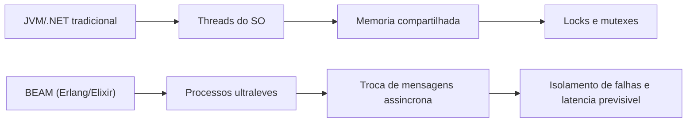
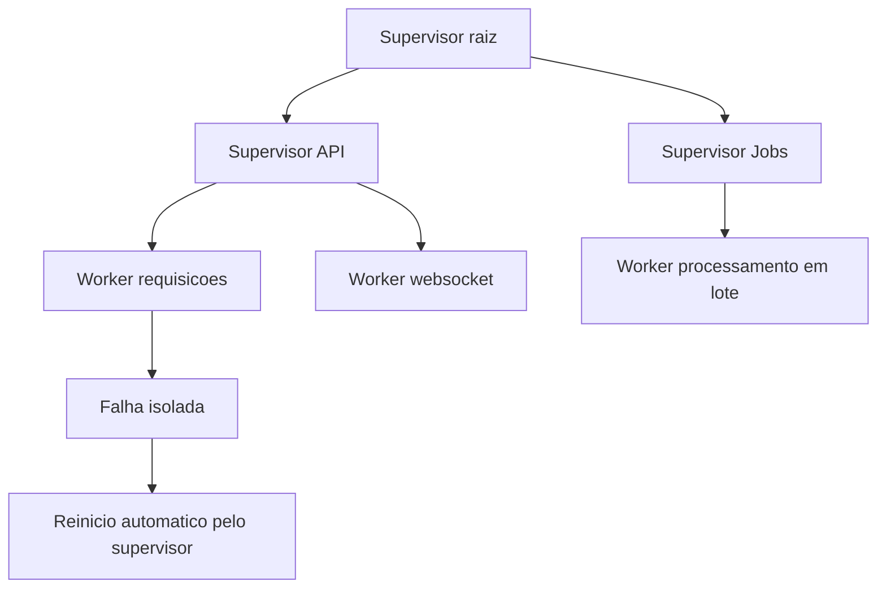
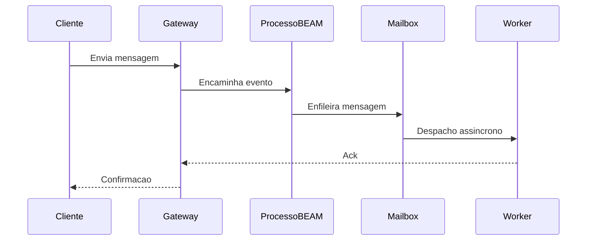
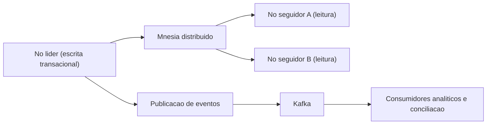
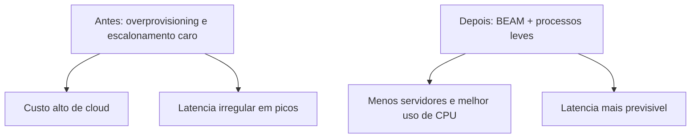

# **Sistemas que no fallan: por qué el ecosistema Erlang/OTP y Elixir son la elección para aplicaciones de misión crítica**

La infraestructura de software contemporánea enfrenta una crisis crónica de complejidad e ineficiencia. A medida que el tráfico de usuarios alcanza escalas sin precedentes y la tolerancia de latencia empresarial se acerca al cero absoluto, las organizaciones a menudo recurren a soluciones arquitectónicas reactivas que solo abordan los síntomas de los sistemas sobrecargados, ignorando las debilidades fundamentales en sus pilas de tecnología. La proliferación desordenada de microservicios ultragranulares, intrincadas mallas de servicios, disyuntores y complejos orquestadores de contenedores es en gran medida una respuesta provisional a las limitaciones estructurales de los modelos de gestión de estado y concurrencia presentes en los lenguajes de programación dominantes de la industria. Cuando la infraestructura subyacente no está diseñada desde su núcleo intelectual para el aislamiento nativo de fallas y la concurrencia masiva, la ingeniería de confiabilidad se convierte en un ejercicio perpetuo y exhaustivo para mitigar el daño estructural.

En este panorama corporativo caracterizado por problemas de inestabilidad y costos exorbitantes de la nube, el ecosistema Erlang/OTP (Open Telecom Platform) y su contraparte moderna, el lenguaje Elixir, emergen no como herramientas experimentales inciertas, sino como un paradigma maduro, exhaustivamente probado durante décadas. Diseñado originalmente para conmutadores de telecomunicaciones que matemáticamente no podían fallar, este ecosistema ha demostrado ser el "nicho de oro" indiscutible para plataformas de gestión de viajes interconectadas, sistemas críticos de liquidación financiera y mensajería en tiempo real a escala global. El siguiente análisis técnico y arquitectónico analiza meticulosamente el funcionamiento detrás de escena de las aplicaciones que requieren alta concurrencia y escala masiva, demostrando, basándose en telemetría real y estudios de casos de ingeniería profunda, por qué la tolerancia nativa a fallas de la máquina virtual BEAM proporciona una ventaja competitiva incomparable para las empresas que necesitan escalar sus operaciones de manera sostenible y sin perturbaciones.

## **La anatomía de la resiliencia: el paradigma de la máquina virtual BEAM**

La superioridad técnica del ecosistema Erlang y Elixir no radica principalmente en su sintaxis funcional o la amplia gama de sus bibliotecas estándar, sino en la arquitectura fundamental y visionaria de su máquina virtual subyacente, BEAM (Bogdan/Björn's Erlang Abstract Machine). A diferencia de los lenguajes y ecosistemas tradicionales, que dependen en gran medida del mapeo directo a *hilos* del sistema operativo nativo y del intercambio continuo de espacio de memoria, BEAM implementa el Modelo Actor (*Modelo Actor*) de una manera rigurosamente purista y matemáticamente aislada.

**Diagrama: Comparación de competencia entre arquitecturas**


En ecosistemas industriales estándar como la máquina virtual Java (JVM) o las implementaciones basadas en C\#, la creación de instancias de un *hilo* operativo tiene un costo computacional extremadamente significativo, ya que a menudo consume megabytes de memoria RAM solo para asignar su pila de ejecución básica, además de imponer una fuerte conmutación de contexto (*cambio de contexto*) en el procesador. En marcado contraste, en BEAM, la unidad primaria y básica de concurrencia es el "proceso" de Erlang, una abstracción que no tiene relación directa con los procesos pesados ​​del sistema operativo. Estos procesos internos son estructuras de datos extraordinariamente livianas y, por lo general, consumen solo unos pocos cientos de bytes en el inicio. Esta extrema eficiencia volumétrica permite que un único nodo de servidor físico ejecute millones de procesos simultáneos simultáneamente sin agotar los recursos de memoria de la máquina ni acelerar la unidad central de procesamiento (CPU) con cambios de contexto.

Aún más crítico para la integridad de los datos, estos procesos livianos operan bajo un régimen de ausencia total de estado compartido (*arquitectura de no compartir nada*). El flujo de comunicación y transferencia de datos entre ellos se produce exclusivamente a través de un mecanismo de intercambio de mensajes puramente asíncrono, donde los buzones individuales reciben los datos copiados. La eliminación total del estado compartido elimina, de raíz, categorías enteras de anomalías clásicas de la informática concurrente, como los *puntos muertos* sistémicos y las *condiciones de carrera* impredecibles. En consecuencia, la necesidad de invocar mecanismos mecánicos complejos de sincronización como *bloqueos*, *mutex* y semáforos, artefactos que tradicionalmente penalizan el rendimiento en sistemas de alta carga y que a menudo conducen a cuellos de botella de contención difíciles de depurar, se vuelve obsoleta.

| Característica arquitectónica | Ecosistemas tradicionales (Ej: JVM, .NET) | Máquina virtual BEAM (Erlang/Elixir) |
| :---- | :---- | :---- |
| **Modelo de competición** | SO *subprocesos*, mapeo:1 o M:N complejo | Procesos ultraligeros a nivel de VM (Modelo Actor) |
| **Capacidad de escala local** | Decenas de miles de *hilos* (límite práctico) | Millones de procesos simultáneos por nodo |
| **Gestión del Estado** | Memoria global compartida controlada por *Cerraduras* | Arquitectura *Share-Nothing*, paso de mensajes |
| **Tolerancia nativa a fallos** | Propagación jerárquica de excepciones, *Try/Catch* | Árboles de supervisión granular, aislamiento celular |

### **Programación preventiva y baja latencia predictiva**

Un defecto arquitectónico común en los lenguajes modernos centrados en la competencia cooperativa es la susceptibilidad al bloqueo de *bucles* de eventos mediante rutinas computacionalmente intensivas, lo que monopoliza los núcleos de procesamiento y aumenta la latencia de manera impredecible. La máquina virtual BEAM resuelve este dilema matemático implementando una programación estrictamente preventiva a nivel de aplicación. El mecanismo interno de BEAM (*scheduler*) asigna a cada proceso individual una cuota de ejecución finita medida en una unidad métrica llamada "reducciones*", que corresponde, de forma simplificada, a llamadas a funciones o límites operativos.

Cuando un proceso en ejecución agota su cuota de reducción asignada, el programador BEAM lo suspende por la fuerza, preserva su estado exacto e inmediatamente cede ciclos de CPU al siguiente proceso que espera en la cola de ejecución. Este meticuloso diseño garantiza absolutamente que las operaciones excesivamente largas no mueran de hambre otras partes vitales del sistema. El resultado directo de esta agresiva preferencia es una latencia de cola plana y altamente predecible, una característica no negociable para las plataformas que necesitan respetar el concepto de "tiempo real suave", como las redes telefónicas globales y las infraestructuras de envío de órdenes en el mercado financiero, donde los retrasos en la respuesta degradan gravemente la calidad del servicio o causan pérdidas financieras millonarias.

### **El costo global de la recolección de residuos y la solución del proceso BEAM**

Uno de los mayores cuellos de botella ocultos para los sistemas corporativos que procesan millones de solicitudes simultáneas es el costo impuesto por la recolección de basura (*Garbage Collection* \- GC). Los modelos tradicionales de alto rendimiento, como el recolector G1 (Garbage-First) de JVM, operan con heurísticas sofisticadas, dividiendo la memoria *heap* global en regiones lógicas (como *Eden*, *Survivor* y *Old*) para intentar minimizar el tiempo de inactividad. Sin embargo, no importa cuán refinados sean estos enfoques generacionales, o incluso implementaciones modernas como Shenandoah o ZGC, la dependencia de un *montón* universal compartido impone invariablemente períodos de *Stop-The-World* (STW), paralizando temporalmente todos los *threads* de aplicaciones para compactar o escanear la memoria de forma segura. A escalas de millones de eventos por segundo, estas pausas microscópicas se acumulan, degradando gravemente los acuerdos de nivel de servicio (SLA) y provocando latencias erráticas inaceptables. Los sistemas basados ​​en lenguajes nativos como Golang, si bien están optimizados para la concurrencia a través de *goroutines*, también sufren pausas universales de GC que afectan las latencias duras, un factor que a menudo impulsa migraciones arquitectónicas complejas a hiperescala.

BEAM adopta un enfoque magistral que evita orgánicamente este dilema universal. Como está estipulado, cada proceso de Erlang tiene su propia área de memoria privada y completamente aislada (su pila y su propio pequeño *montón*). En consecuencia, las operaciones de recolección de basura no necesitan analizar el estado global de la aplicación. El escaneo de la memoria se produce de forma completamente independiente y aislada proceso por proceso. El recolector de basura limpia el pequeño fragmento de memoria de un solo actor sin interrumpir el flujo operativo de los otros millones de actores que se programan simultáneamente en el servidor. En particular, debido a la naturaleza inmutable de las variables en el ecosistema y la naturaleza efímera de la mayoría de los procesos en los sistemas transaccionales, cuando un proceso de corta duración (como el procesamiento de una única solicitud HTTP) completa su tarea, toda la memoria asignada se devuelve inmediatamente al sistema operativo. Esta destrucción completa del alcance de la memoria elimina la necesidad de realizar operaciones de recolección de basura en ese bloque, lo que elimina grandes cantidades de sobrecarga computacional de coordinación.

## **Los árboles de supervisión y filosofía "Let it Crash"**

La resiliencia mecánica y la tolerancia a fallas en el ecosistema BEAM difieren radicalmente del manejo defensivo de excepciones universalmente enseñado y aplicado en otros lenguajes de programación. En lugar de alentar al desarrollador a intentar predecir y detectar cada anomalía imaginable que involucre intrincados bloques de control de errores, la filosofía central que se originó en los ingenieros fundadores de Erlang (Joe Armstrong, Robert Virding y Mike Williams) es conocida por su lema: "Let it crash".

**Diagrama: Árbol de supervisión y estrategia de recuperación**


Considerar que los procesos están intrínsecamente aislados sin compartir memoria, la corrupción del estado o una falla abrupta de un proceso que se origina a partir de un *error* en la lógica de negocios, un paquete de red dañado o una inconsistencia en una base de datos externa no tiene medios físicos para propagarse y afectar la integridad general del sistema en ejecución. El fracaso está contenido herméticamente dentro del alcance de ese proceso. Para hacer frente a esta fatalidad aislada, la biblioteca estándar de OTP introduce el concepto fundamental de Árboles de Supervisión (*Supervision Trees*), que establece una jerarquía estricta donde los procesos estructurales dedicados (llamados supervisores) tienen la tarea exclusiva de observar la vitalidad y la salud de los procesos subsidiarios (llamados *trabajadores*) a través de enlaces intrínsecos del sistema.

Si un proceso de trabajo falla repentinamente, el evento de muerte emite una señal capturada inmediatamente por su supervisor directo. El supervisor, que opera bajo una política de recuperación predefinida de manera determinista, actúa para reiniciar el proceso afectado desde un estado conocido, limpio y estable. Este modelo de recuperación celular simula eficientemente los mecanismos de defensa biológica, donde la apoptosis o muerte de una célula individual corrupta no sólo no compromete al organismo huésped, sino que es un paso necesario hacia su autoconservación y curación continua. En sistemas heredados orientados a objetos, una excepción no controlada en un *hilo* central puede corromper las referencias de memoria global y hacer caer todo el servidor; en BEAM, un bloqueo similar solo resulta en la caída temporal y el ascenso nuevamente en milisegundos de la persona responsable de esa tarea restringida, asegurando que los usuarios que no viajan por la ruta corrupta ni siquiera notarán la fluctuación.

Esqueleto ilustrativo de supervisión en Elixir (API OTP típica; no es un servicio completo):

```elixir
children = [
  {MyApp.TcpGateway, []},
  {MyApp.JobWorkers, []}
]

Supervisor.start_link(children,
  strategy: :one_for_one,
  max_restarts: 10,
  max_seconds: 60
)
```
## **Plataformas de mensajería masiva y comunicación en tiempo real**

Las plataformas de comunicación simultánea representan sin duda la prueba de fuego para cualquier modelo de competencia computacional. El implacable requisito técnico de mantener abiertas cientos de miles de conexiones *TCP* o *WebSockets* simultáneas, combinado con la necesidad de enrutar dinámicamente paquetes de metadatos bidireccionales y rastrear la presencia activa a escala global, sobrecarga severamente los servidores basados ​​en arquitecturas tradicionales y bloquea las solicitudes sincrónicas.

**Diagrama: flujo de mensajes en tiempo real**


### **El caso WhatsApp: la optimización extrema de medio billón de conexiones**

El estudio de caso más emblemático y ampliamente estudiado del poder competitivo de Erlang es el meteórico ascenso y sostenimiento de la arquitectura de WhatsApp. Mucho antes de ser adquirida por la corporación Meta y expandirse a miles de millones de usuarios, WhatsApp ya operaba a una escala formidable, brindando soporte, en el primer trimestre de 2014, a aproximadamente 465 millones de usuarios activos mensuales. El factor más sorprendente de esta hazaña tecnológica residía en la estructura organizativa de la empresa: un equipo reducido compuesto por no más de cincuenta ingenieros, divididos entre operaciones puras de desarrollo y infraestructura, lo que se traducía en una proporción estratosférica de casi 40 millones de usuarios apoyados por un único ingeniero *backend*.

La infraestructura subyacente se basaba firmemente en servidores FreeBSD que ejecutaban instancias masivas de Erlang, una elección estratégica impulsada por la escalabilidad nativa de multiprocesamiento simétrico (SMP) de BEAM. En lugar de dispersar la complejidad operativa en miles de servidores pequeños, WhatsApp optó por utilizar instancias de *hardware* extremadamente densas y verticalizadas (nodos informáticos equipados con procesadores *Ivy Bridge* con docenas de núcleos físicos, *hyperthreading* masivo y conectividad de red *Dual-link GigE* agregada), manteniendo bajo el recuento global de servidores para minimizar la complejidad operativa. Durante sus picos operativos en esa época, el sistema consumió decenas de miles de núcleos de CPU lógicos agregados y procesó la asombrosa métrica de más de 70 millones de mensajes Erlang entre procesos por segundo.

La red manejó un total agregado de 19 mil millones de mensajes entrantes y 40 mil millones salientes diariamente, admitiendo hasta 147 millones de conexiones persistentes globales mantenidas activas simultáneamente con 230.000 autenticaciones por segundo. Para garantizar que esta red funcionara de manera estable, los arquitectos de *software* de WhatsApp trascendieron el uso de la biblioteca estándar e implementaron tácticas arquitectónicas agresivas que involucraban un comportamiento íntimo de la máquina virtual. En un esfuerzo hercúleo por desacoplar, aislaron severamente áreas de aplicación para evitar que los cuellos de botella de procesamiento en un módulo generaran fallas en cascada en el tejido de comunicación. Favorecieron sistemáticamente el uso del paso de mensajes asincrónico puro (handle\_cast) sobre las invocaciones sincrónicas (handle\_call) para evitar que cualquier proceso espere respuestas bloqueadas en una red impredecible.

Contraste mínimo en el estilo `gen_server` (Elixir `GenServer`), solo para anclar la terminología:

```elixir
defmodule MyApp.Router do
  use GenServer

  @impl true
  def handle_cast({:route_async, event}, state) do
    # despacho "fire-and-forget"; o chamador nao bloqueia
    {:noreply, state}
  end

  @impl true
  def handle_call({:fetch_sync, key}, _from, state) do
    # requisicao/resposta; pode acorrentar espera sob rede lenta
    {:reply, Map.get(state, key), state}
  end
end
```
Para evitar el temido *Bloqueo de cabecera de línea* en las conexiones entre nodos de la infraestructura, introdujeron una separación brutal de las colas de enrutamiento. Cuando los mensajes se enrutaban a diferentes nodos en el clúster del *centro de datos*, los datos se asignaban a procesos ligeros e individualizados de Erlang. Si un nodo receptor determinado comenzara a experimentar degradación o una latencia de respuesta severa, solo los mensajes destinados a ese nodo problemático se pondrían en cola, respaldados por la lógica de los actores locales, mientras que las comunicaciones destinadas a los nodos sanos fluían libremente sin aplicar presión regresiva sistémica (*contrapresión*) sobre la aplicación de envío.

Además, los cuellos de botella inherentes a la biblioteca estándar también requirieron reescrituras sofisticadas. Cuando el proceso de despacho único de un servidor genérico (gen\_server) no pudo absorber conexiones TCP, los ingenieros reemplazaron la biblioteca con su propio módulo optimizado llamado gen\_industry, utilizando procesos de despacho masivamente paralelos. Paralelamente, a nivel del subsistema de almacenamiento y estado de la base de datos distribuida Erlang (Mnesia), que contenía alrededor de 18 mil millones de metadatos en RAM, crearon *parches* en el código fuente nativo para permitir múltiples administradores de transacciones para replicaciones sucias asincrónicas (async\_dirty), además de fragmentar físicamente directorios lógicos en múltiples discos físicos para amplificar *E/S* *rendimiento*.

La extrema complejidad de la escala también destacó que ningún sistema es inmune a la física fundamental de la red. Un apagón monumental documentado que duró 210 minutos, generado principalmente por un enrutador central defectuoso que derribó una VLAN crítica, obligó a reconexiones globales masivas y simultáneas. Este tsunami de conexiones arrojó al grupo de procesos globales de Erlang (el subsistema pg2) a un bucle fatal con complejidad algorítmica y tráfico de mensajes creciendo de forma **superlineal** (explosión del trabajo en cadena a medida que se acumulaban las reconexiones). Las colas de mensajes internos saltaron repentinamente desde las métricas básicas a 4 millones pendientes en fracciones de segundo, un colapso de la cadena que sirvió para forzar iteraciones cruciales en la eurística de comportamiento del subsistema oficial de control de tráfico a nivel básico *OTP* en los años siguientes.

| Métricas arquitectónicas a gran escala | Implementación observada en el caso WhatsApp (2014) |
| :---- | :---- |
| **Pico de la competencia global** | 147 millones de conexiones de clientes abiertas |
| **Tarifa de transferencia mensual** | \~465 millones de usuarios activos administrados |
| **Proporción cliente/ingeniero** | Aprox. 40 millones de usuarios por ingeniero BEAM |
| **Tráfico entre procesos (VM)** | Picos que superan los 70 millones de envíos/segundo |
| **Optimización crítica de Mnesia** | *Parche nativo* que permite la replicación paralela async\_dirty |
| **Estrategia Antibloqueo** | Creación de gen\_industria y *despacho FIFO de trabajadores* |

### **El desafío informático de Discord: Elixir se encuentra con Rust**

La plataforma Discord, diseñada para orquestar canales simultáneos de voz y texto dirigidos principalmente al nicho ultra exigente y sensible a la latencia de las comunidades de juegos, construyó gran parte de la columna vertebral de su servicio de *chat* en tiempo real con instancias de Elixir, abandonando el Ruby tradicional que alguna vez los acompañó y complementando su infraestructura de datos primaria con rutinas de Python y conectores de C++. El poder competitivo intrínseco de BEAM resultó decisivo; La organización ha orquestado una flota principal en el rango de 400 a 500 robustas máquinas Elixir, que operan en la frontera del desempeño de las comunicaciones corporativas.

El formidable éxito técnico de la topología de Discord se basó en la filosofía del modelado funcional: el marco orquestó su *backend* de modo que cada servidor de Discord individual (módulo estructural denominado internamente *gremio*) fuera instanciado como un proceso de Erlang que se ejecuta en la VM de forma completamente autónoma y encapsulada en relación con los demás. A medida que pasaron los años y el crecimiento aumentó agresivamente, Discord rápidamente alcanzó hitos con alrededor de 5 millones de usuarios activos simultáneos que generaban millones de eventos analíticos y conversacionales por segundo repartidos por todo el tejido del sistema. El modelo Erlang demostró su extrema efectividad en latencia: para mantener el ecosistema sincrónico, cada evento que desencadenaba una comunicación dentro del clúster entre procesos distribuidos remotamente que operaban en el formato de solicitud/respuesta experimentaba un costo intrínseco promedio absurdamente bajo de aproximadamente **12 microsegundos** por paso de mensaje.

La arquitectura, sin embargo, requirió adaptaciones continuas y evaluaciones arquitectónicas a gran escala. Inicialmente, el equipo de ingeniería de Discord se ocupó del enrutamiento dinámico de conexiones de gremio (ya que los procesos se deslocalizan dinámicamente en cientos de instancias de clúster) al intentar reescribir mecanismos de tabla lentos como soluciones locales (*fastglobal*), solo para descubrir un comportamiento subyacente lineal grave de la VM de recompilación dinámica, donde el costo computacional de reconstruir y recargar módulos de código en la memoria escalaba lineal y destructivamente de acuerdo con el número bruto de procesos abiertos en el nodo. (Afectando gravemente a los servidores que llevan hasta 500.000 sesiones activas).

La evolución corporativa introdujo, en su punto máximo operando con 11 millones de usuarios simultáneos en el clúster central, un desafío puramente alineado con la sobrecarga bruta de la CPU que obligó al abandono parcial de las comodidades inmutables del paradigma purista funcional de Elixir. El desafío surgió de una premisa algorítmica simple, pero formidable en su escala de ejecución: la actualización temporal en tiempo real de la "Lista de miembros" visible en servidores colosales. En lugar de enviar actualizaciones difusas a miles de clientes inactivos en función del número total de miembros de todo el *gremio*, la lógica prescribía que solo los metadatos de los miembros actualmente asignados y representados en la ventana visible del cliente se calcularan en un *diff* complejo (cambio de estado interactivo), informando solo inserciones y eliminaciones espaciales localizadas en los índices para ahorrar batería en *teléfonos inteligentes* y aliviar la carga general de ancho de banda de la infraestructura corporativa.

En el dominio *backend* del servidor, esta métrica beneficiosa obligó a los nodos a asignar estructuras de memoria complejas, lo que requirió rutinas masivas para retener cientos de miles de entidades perfectamente ordenadas, respondiendo perennemente a montañas de mutaciones activas mientras operaban búsquedas lineales con retornos exactos de índices modificados. En lenguajes estrictamente funcionales como Elixir, las estructuras de datos elementales son universalmente inmutables. Cada pequeña modificación secuencial en un árbol de búsqueda complejo requería computacionalmente que el servidor generara extensos duplicados del estado e invocara intensa y violentamente el servicio de recolección de basura local, creando sobrecargas térmicas intolerables en el procesador para responder de manera oportuna a las mutaciones de las sesiones operativas globales.

Frente a este límite natural y estricto de BEAM orientado a la comunicación, Discord se dedicó a una agresiva reingeniería sistémica utilizando funcionalidades de interfaz nativa (*NIF \- Funciones implementadas nativas*) integrando módulos de procedimientos codificados en Rust interconectados con BEAM de Elixir. Aunque los componentes más antiguos habían navegado ocasionalmente por el espectro del lenguaje Golang (Go) por su renombrado rendimiento computacional nativo, investigaciones anteriores atestiguaron que los modelos vinculados a GC tradicional, incluso aquellos diseñados para competidores eficientes, causaron los inevitables cierres parciales impredecibles (el factor limitante absoluto *Stop-The-World* o escaneos concurrentes degradantes), lo que obligó al equipo de Discord a realizar la transición de Go a Rust buscando una previsibilidad latente de milisegundos en operaciones restringidas. Depende de la CPU. La transición exitosa al código híbrido Rust/Elixir no solo resolvió los problemas del control detallado de la memoria mediante la reutilización de rutinas competitivas, sino que aplastó categóricamente otras métricas mediante el uso de estructuras de árbol ordenadas nativas en memoria contigua mutable (como *BTreeMaps* en lugar de los *HashMaps* tradicionales) al tiempo que redujo violentamente el costo de las copias espejo de memorias redundantes al mínimo indispensable. La simbiosis técnica consolidada ha demostrado que las mejores matrices contemporáneas combinan la robustez inmortal del orquestador de red Elixir con bloques operativos de trituración vectorial matemáticamente perfectos de nivel inferior.

Además, en el ámbito de la retransmisión televisiva y la gestión segura de las comunicaciones, los consorcios nórdicos de gigantes de los medios digitales como la corporación de televisión TV4 han orquestado, a través de consultores especializados en el ecosistema BEAM, instancias Elixir para unir bases de datos segmentadas heredadas, consolidando bases unificadas de sus suscriptores durante la era de la competencia violenta de Netflix, con especial atención al despliegue sin tiempo de inactividad virtual respaldado por los protocolos nativos de la herramienta y proporcionando cortes de facturas mensuales sustanciales para las instancias informáticas activas. De la misma manera táctica corporativa, los conglomerados financieros asociados con Teleware reestructuraron las redes de *chat* financieras corporativas utilizando implementaciones listas para usar del servidor MongooseIM diseñado en Erlang. El servidor nativo permitió a los equipos implementar lógica en un tiempo récord, adaptando sus complejos esquemas para cumplir con rigidez espartana los estándares draconianos establecidos por agencias reguladoras federales vitales como la Autoridad de Conducta Financiera del Reino Unido (FCA), orquestando un archivado sin demoras y una conectividad hermética libre de intrusiones estructurales.

## **Misión de Sistemas Financieros y Pagos Críticos**

En nichos dominados por tecnologías FinTech (Tecnología Financiera), la característica principal no es el volumen aislado de conexiones web no comprometidas, sino la intolerancia brutal, dogmática y regulatoria a la más mínima discrepancia transaccional o pérdida transitoria de paquetes lógicos resultante de inestabilidades corporativas. Es en este dominio regulado donde el lenguaje Erlang trasciende sus raíces en las telecomunicaciones y apuntala imperceptiblemente los ejes vitales de los poderes transaccionales del mundo.

### **Klarna: del monolito Erlang a Kred Deep Engineering**

Klarna Bank AB, una titánica institución financiera sueca y líder continental valorada a menudo en el rango de decenas de miles de millones de dólares en el ágil sector de concesión de crédito, descansa el núcleo despiadado de sus rutinas globales de facturación y pagos contractuales en tiempo real en un ecosistema complejo y masivo construido principalmente en el lenguaje Erlang, intrínsecamente conocido como el sistema corporativo *Kred*. Inicialmente formulado por las demandas del mercado para reflejar la tenacidad de una infraestructura de telefonía celular gubernamental en la era de las compras cibernéticas y el *comercio electrónico*, Kred fue moldeado intencionalmente de manera monolítica con miras a permanecer en línea en todo momento bajo el dictado no negociable de que "el fracaso y la caída de Kred significaron simultáneamente la liquidación completa de la plataforma paralela Klarna".

**Diagrama: Topología líder-seguidor en pagos críticos**


Para cumplir plenamente con los caprichos de su sistema de contabilidad transaccional distribuido, la plataforma operó en gran medida utilizando las capacidades nativas de la base de datos integrada Erlang ya mencionada, *Mnesia*. Los diseñadores institucionales adoptaron rígidamente una arquitectura distribuida basada en los principios de Líder y Seguidor (*topología Líder-Seguidor*). Todos los cambios variables en el estado bancario y las transacciones cruciales ocurrían obligatoriamente en el nodo clasificado como líder aislado del sistema; simultáneamente, amplias réplicas y nodos identificados como seguidores sirvieron únicamente a los pesados ​​accesos de lectura paralela que exportaban incansablemente flujos formateados de telemetría analítica a arquitecturas basadas en redes vitales administradas en *Apache Kafka*.

Esta inmensa orquestación funcionó ilesa hasta que un fatídico incidente anómalo detallado en la ingeniería de Klarna reveló graves matices de procesamiento interno latentes en la base C de la plataforma Erlang, popularizado en investigaciones internas como "La búsqueda del error asesino de racimos". Debido a un evento operativo desastroso común de mantenimiento estructural mal planificado en los nodos vitales del propio *Kafka* en el parque de infraestructura externo de la plataforma, comenzó un efecto en cadena catastrófico. Un bloqueo de la red menor que una simple falla parcial en una porción restringida de las particiones desencadenó un comportamiento críptico inexplorado en la plataforma Klarna.

Las anomalías rápidamente se intensificaron en forma de informes caóticos de la infraestructura: simultáneamente con el evento de la red externa, la RAM asignada a absolutamente todos los nodos lógicos del grupo Kred se infló incesantemente de manera demencial, agotando toda la capacidad física de los procesadores. Para agravar el enigma de la depuración local en el calor operativo de la madrugada, todas las rutinas internas automatizadas de monitoreo de telemetría se silenciaron silenciosamente, mientras que la ventana de acceso remoto a la consola de la VM (*pérdida de shell*) falló, haciendo imposibles los comandos correctivos directos de supervivencia humana en el núcleo local. Como consecuencia letal, las protecciones intrínsecas contra el agotamiento extremo de la memoria (el notorio componente *OOM Killer* de Linux) derribaron violentamente los nodos de la red en el segundo exacto en que el servidor externo Kafka señaló la normalización del camino. Y como epílogo alarmante de una infraestructura orientada a la supervivencia automática de nodos vitales bajo conmutación por error automática, el proceso orgánico nativo de elección sistémica de un nuevo líder de procesador dentro de la configuración de Mnesia asumió rápidamente la posición vacía, sólo para encontrarse inmediatamente atrofiado frente a un silencio cibernético con errores cíclicos que inmovilizan llamadas operativas intrínsecas (code\_server:call/1).

La investigación metódica llevada a cabo por ingeniería avanzada ha descubierto dinámicas profundas sobre interconexiones peligrosas que operan de manera invisible en la máquina virtual del lenguaje bajo una severa fatiga computacional analítica. La raíz mortal emanó de la integración continua de las funcionalidades principales del núcleo BEAM. Se encontró que las premisas que garantizaban la base de preferencia justa ante los operadores de reenvío lógico (*Operador de envío de mensajes*) tenían severas imperfecciones estructurales debido a la inyección arbitraria e incalculable de bloques monstruosos momentáneamente asignados por el componente de publicación analítica del protocolo Kafka y capturados por las funciones encapsuladas (*cierres*) generadas en la compilación errática de las cláusulas.

En BEAM orgánico, existen términos textuales computacionalmente pesados ​​​​enraizados en matrices estructurales que representan matemáticamente datos en gráficos acíclicos dirigidos (DAG) complejos. En el momento exacto del procedimiento orgánico en el que un evento agotado obligó al intercambio sistémico de estos gigabytes retenidos de datos fallidos hacia nodos paralelos saludables en formato literal a través del intercambio de mensajes nativos dentro del sistema, el proceso de copia natural de transferencia abrió las matrices fractalizadas en su esencia literal, expandiendo y colapsando su asignación, desbordando violentamente el consumo inmediato de memoria. Una variable raíz que compartía una nota interna microscópica duplicó los valores colosales hasta el infinito hasta que desbordó a todos los *programadores* que ocupaban activamente la CPU con un bloqueo crónico que paralizó la ejecución preventiva vital nativa de todo el sistema. La terrible experiencia reforzó dogmáticamente entre la vanguardia corporativa la filosofía extrema de que dominar y confiar superficialmente en componentes mágicos autónomos fracasa ante la gravedad extrema. Mantener la escalabilidad de sistemas transaccionales gigantes implica imperativamente una inmersión exploratoria profunda en la arquitectura elemental en capas inferiores escrita exclusivamente en C y el diseño matemático analítico adoptado en el *montón* profundo de la máquina virtual.

### **Acuerdo crítico: Vocalink, Mastercard y Goldman Sachs Exchange**

Al abandonar el segmento cibernativo del comercio electrónico sueco contemporáneo y colarse en las tuberías monolíticas invisibles y centenarias de la red circulatoria fiduciaria y los gobiernos federales a gran escala que operan diariamente transferencias regulatorias instantáneas de divisas en bruto, Erlang muestra su perfil silencioso y dominante. Vocalink, una formidable subsidiaria estructural con propiedad mayoritaria del conglomerado Mastercard y singularmente responsable de la ejecución y coordinación orgánica invisible de colosales flujos ininterrumpidos de rutinas de intercambio entre redes globales de cajeros automáticos, depósitos inmediatos y transferencias reguladas en los extremos del comercio minorista instantáneo global.

Basada en topologías basadas estructuralmente en engranajes Erlang, junto con los servicios nativos de orquestación de procesamiento de colas *RabbitMQ* y la persistencia proporcionada orgánicamente por Mnesia, la infraestructura respalda de manera vital el tránsito de la cámara global integrada de liquidaciones bancarias gubernamentales (Instant Payment Systems\- IPS) en todo el país en vastos territorios desde Singapur hasta P27 en la península escandinava, incluidos los pilares fundacionales vitales de los centros de la cámara reguladora de bancos comerciales de EE. UU. (The Clearing House). RabbitMQ, digno de mención, es uno de los servicios intermediarios virtuales flexibles globales más ubicuos, populares e invisibles en Internet, basado orgánicamente en Erlang.

En las matrices institucionales corporativas tradicionales de miles de millones de dólares que actúan agresivamente en los extremos frenéticos de las inestables finanzas cibernéticas de alto rendimiento de las famosas operaciones de Hedge Funds (*Hedge Funds*), el gigante banco de inversión internacional *Goldman Sachs* aplica pragmáticamente la arquitectura de procesamiento continuo de tiempo sin restricciones en transacciones automatizadas en micro y milisegundos utilizando lógicas fundamentales construidas y aprovechadas en los nodos flexibles RabbitMQ de BEAM. El motor cibernético interno responde instintivamente y envía inundaciones caóticas, intermitentes e impredecibles que se originan en los mercados de valores en un tiempo reactivo sin restricciones, lo que permite la adaptación táctica del mercado sin bloqueos paralizantes sistémicos de los cuellos de botella operacionales que impiden las lógicas bloqueadas por fallas secuenciales del *hilo* maestro en lenguajes interpretados heredados y enyesados ​​que soportan la carga de la competencia imperativa de los sistemas globales tradicionales. Erlang permite a entidades como Goldman Sachs mantener su rápido ritmo de innovación tecnológica en el mismo engranaje operativo impuesto y adoptado habitualmente sólo por las incipientes FinTech basadas en el moderno ecosistema cibernético emergente contemporáneo.

La tesis institucional prolifera indiscutiblemente en los brazos institucionales asociativos alemanes de licencias estructurales de *Banking-as-a-Service* vinculadas operativamente al core del Solaris Bank. Con sus API empresariales generadas principalmente y aprovechadas de las limpias y abstractas ventajas de gestión proporcionadas por la sintaxis flexible de Elixir, han logrado una capacidad operativa y técnica brutal para escalar desde instancias de fundación cero hasta financiación multimillonaria completa, licencias formales rigurosas con auditores bancarios irreductibles y procesamiento de producción completo vital mediante la distribución de operaciones de crédito corporativas digitalizadas a docenas de clientes europeos que operan en la frontera legal incuestionable únicamente en una ventana de compresión temporal estructural ajustada que no supera los simples treinta y seis meses de ingeniería. una fecha límite inalcanzable para los operadores que operan plataformas base plagadas de ecosistemas lentos y atadas a rutinas C\# asincrónicas tradicionales basadas en bancos nativos monolíticos globales. La tesis sistémica encuentra su eco resonante aún en tecnologías periféricas nacientes como bloques de contratos en la nube (contratos inteligentes) de la cadena de bloques Aeternity y redes logísticas de máquinas corporativas ininterrumpidas que proporcionan POS electrónicos como los administrados por marcos lógicos vinculados orgánicamente al SumUp europeo que impone y exige estrictamente disponibilidad total en cada zona horaria mundial en las 24 horas vitales cada 7 días para cientos de facturas instantáneas con fallas sistémicas contenidas orgánicamente invisibles para los comercializadores finales del mundo. máquina cibernética sin la necesidad de costosos cierres *Stop-The-World* para reconstruir las rutinas globales parcialmente corruptas y orgánicas de los inestables operadores de nube de redes celulares de los comerciantes móviles globales en el mundo en continuo desarrollo.

| Institución/Proyecto | Dominio financiero crítico | Implementación de la VIGA Principal | Objetivo Arquitectónico Vital Logrado |
| :---- | :---- | :---- | :---- |
| **Banco Klarna (Kred)** | Compensación de crédito minorista *Tiempo real* | Erlang, Mnesia distribuida | Topología líder-seguidor resiliente de procesamiento masivo concurrente |
| **Vocalink (Mastercard)** | *Conmutadores* Banca Nacional (IPS) | Erlang, Mnesia, RabbitMQ | Operación fiduciaria *siempre activa* con entrega gubernamental garantizada a Singapur, EE. UU. y el Reino Unido |
| **Goldman Sachs** | Algoritmos de *negociación* y *fondos de cobertura* | Erlang, *Broker* RabbitMQ | Análisis temporal de milisegundos que reacciona inmune a fallas sistémicas impredecibles de GC |
| **Banco Solaris** | *Banca como servicio* Orquestación API | Elixir, arquitectura basada en API | Construcción sistémica completa *desde cero* aprovechada con una agilidad de licencia brutal en 3 años |

## **Ingeniería de viajes: modernizando el GDS obsoleto**

Si la estructura global del sector de pagos orbita en pesados protocolos corporativos, robustos, invisibles y estandarizados, el campo cibernético vinculado orgánicamente a los motores computacionales de la aviación comercial contemporánea, los hoteles unificados y el alquiler de vehículos opera estructuralmente apoyado con desesperación sobre las fallas arquitectónicas de las ruinas estructurales digitales con un siglo analógico de décadas de computación cibernética estructurada obsoleta basada en Mainframes monolíticos de las aerolíneas primitivas en las décadas pasadas originales en lenguajes muertos operativos corporativos.

El núcleo del marketing orgánico sistémico en los paquetes globales dependía principalmente del ciclo estructural global secular del Sistema de Distribución Global (Global Distribution Systems conocido por el acrónimo clásico GDS), que están masivamente abarcados orgánicamente por los gigantes cibernéticos globales seculares clásicos de los grupos consolidados de Amadeus o el operativo Sabre. En estas antiguas redes institucionales, los paquetes aéreos viajan orgánicamente apoyados por burocracias letárgicas complejas e ineficientes formadas principalmente por los arcaicos estándares burocráticos fijos EDIFACT (que se originan en la lógica electrónica interbancaria a mediados de las eras globales primitivas de la década de 1980 sin las bases operativas modernas y flexibles actuales), donde los lentos pasos evolutivos innovadores corporativos más avanzados se estancaron y se adaptaron a protocolos fijos, atados y corruptos en SOAP estructurado, lentas *cargas útiles* de lentos bloques analíticos en complejas mallas XML de analizadores globales computacionalmente extenuantes.

El acto cibernético práctico aparentemente superficial de consultar ventanas globales simples que contienen precios flotantes agregados unificados que combinan tres compañías de aviación comercial unificadas en una plataforma turística final obliga invariablemente a la computadora intermedia y a los *hilos* ciberoperativos vinculados a abrir inmensas cascadas orgánicas con docenas de pesadas invocaciones paralelas junto con vitales sub-solicitudes activadas simultáneas y distribuidas de manera difusa en servidores dispersos. Las respuestas enviadas en paquetes masivos, densos e irregulares a menudo arrastran tiempos de espera lentos sistémicos globales crónicos generados por socios subóptimos en África, o fuertes latencias en empresas asiáticas de bajo presupuesto en infraestructura informática conectada que opera durante milisegundos muertos en redes conectadas. Gestionar en el mismo *hilo* del procesador la maraña de respuestas operativas parciales ligadas a constantes caídas mortales en la conexión en servidores rígidos tradicionales (como los rígidos lenguajes nativos Apache que ejecutan lenguajes de ejecución basados en el ecosistema C lineal operativo y de bloqueo original) conduce inevitablemente a una estrangulación física orgánica de la CPU, generando paradas forzadas fatales en los tejidos unificados del enrutador principal y causando fatiga latente en las respuestas web para el cliente pasajero global en la interfaz web del teléfono celular corporativo base y aplastando los bancos estructurales institucionales lógicos vinculados a los rígidos globales. competencia.

La revolucionaria interfaz analítica moderna construida recientemente como columna vertebral computacional que orquesta el ecosistema cibernético operativo mediante las estructuras del mercado aéreo administradas estructuralmente por el integrador corporativo vital de operaciones orgánicas continuas *Duffel*, orquestó un asalto ingenioso construido exclusivamente utilizando las sólidas características fundamentales nativas del ecosistema Elixir VM frente a las anomalías de la red sistémica arcaica en las carreteras globales. Desde la perspectiva de los arquitectos desarrolladores de la institución global conectada que integra rutinas pesadas en corporaciones de flotas masivas activas, como la compleja red estadounidense American Airlines y las flotas extendidas de las majestuosas corporaciones intercontinentales Emirates y la formidable red global alemana masiva de procesamiento de rutinas activas gigantescas Lufthansa, el proceso simultáneo interactivo orgánico continuo generado por el lenguaje y la máquina BEAM demostró capacidades analíticas vitales sin paralelo operativo continuo en el espectro de la industria interbancaria y logística global. La creación instintiva de un pequeño actor aislado, operacionalmente aislado e instintivamente desechable, destinado única y estructuralmente a transportar grandes paquetes de cargas en solicitudes estructurales en vuelo que consumen mucho tiempo sin perturbar el flujo maestro principal, permitió al ecosistema Duffel evitar quirúrgicamente el complejo sistémico arcaico de *análisis* y serialización con lentitud estructural nativa de socios externos orgánicos que contienen la inestabilidad operativa de los legados de API ajenos a la red inactiva nativa contenida. Cuando una ruta aérea externa estancó y corrompió los paquetes operativos y las vías aéreas cayeron sin resonancia en la red principal del integrador turístico web en el cibercelular del operador estructural operativo, el minúsculo proceso orgánico que vigilaba en el BEAM enyesado murió solo limpio sobre la base letal y se reinició sin sacudir las bases lógicas vitales continuas en decenas en procesos independientes en las corporaciones integradas en paralelo y cosechando respuestas imperturbables en las aerolíneas operativas simultáneas viables del cluster en el mercado de integración continua sin afectar la percepción orgánica. de latencia instantánea visible para el usuario final del paquete de vuelo.

Este enorme control orquestal paralelo absoluto aislado del Caos de la red sin pérdidas e interrupciones continuas en la estabilidad continua del núcleo no es fácil de replicar de manera fluida en plataformas y marcos globales nativos de JavaScript orientados orgánicamente y basados ​​en bucles de eventos únicos *Node.js* que apilan orgánicamente largas y complejas operaciones analíticas sincrónicas vinculadas a la CPU con promesas encadenadas vinculadas a un único eje estructuralmente limitante. Es mediante métricas nativas comprobables sobre estas ventajas logísticas vitales en redes analíticas aisladas del impacto continuo de la pesada arquitectura externa que las agencias enfocadas en los viajes corporativos vitales de los clientes de logística corporativa contenidos se han reestructurado analíticamente adoptando Elixir para permitir una integración masiva contenida de *microservicios* centrados en la normalización del stock continuo de bancos nativos híbridos y conexiones API unificadas simultáneas, asegurando que el tiempo global estructural continuo asignado originalmente ligado al compromiso burocrático continuo de los proyectos logísticos se redujera brutalmente, haciendo obsoleto y rompiendo ágilmente los largos y continuos cronogramas corporativos basados en las lentas docenas de necesarios y lentos trimestres de adaptación tradicionalmente impuestos por las complejas redes seculares de rígidos GDS con base global.

## **AdTech y tolerancia microtemporal: AdRoll**

El sector de la Publicidad Tecnológica (*AdTech*) comparte los mismos requisitos crónicos y fundamentales de las finanzas operativas globales en alta frecuencia orgánica y competencia nativa absoluta sin límites operativos impuestos por fallas locales de *hilos* con la superposición de complejidad en el volumen de solicitudes de ofertas virtuales temporales interconectadas con sistemas operativos orgánicos de *cookies*. El conglomerado tecnológico corporativo orgánico *AdRoll*, una inmensa máquina corporativa sistémica corporativa subsidiaria perteneciente a las bases estructurales operativas nativas unificadas originalmente englobadas en ramas operativas pertenecientes a los bloques institucionales del conglomerado Semantic Sugar y especializada en procesamiento temporal orgánico global continuo en redes de análisis de comportamiento en medios globales orgánicos en las redes globales vitales orgánicas vinculadas a *Facebook* con incrementos estructurales orgánicos y retargetings cibernéticos complejos en redes nativas globales interconectadas sistémicamente con presupuestos globales y ganancias masivas, inherentemente nativamente orgullosamente estructuralmente depende del despliegue nativo crudo de la brutal capacidad operativa asignada de Erlang en picos operativos continuos sobre la base arquitectónica sistémica de los enrutadores y flujos algorítmicos vitales para absorber perennemente visitas continuas con índices ininterrumpidos contenidos y consolidados de alrededor de la asombrosa *500,000 (medio millón) de ofertas de subasta analítica operativa y solicitudes competitivas vitales orgánicas estructuradas y computadas que tienen lugar invariablemente globalmente por segundo* en rutinas interbancarias analíticas interconectadas orgánicas en sucursales globales, operacionalmente optimizado, perfectamente contenido invariablemente en la latencia quirúrgica requerida y no negociable de rígidos milisegundos absolutos de tiempo operativo logístico en la *licitación* continua de publicidad programática en pantallas operativas en los millones de usuarios nativos comprometidos activamente vinculados.

## **La economía de los servidores: el colapso del hardware y la eficiencia se multiplican**

Uno de los persistentes dilemas estructurales inherentes a las implementaciones corporativas en las nubes sistémicas corporativas actuales basadas operativamente en Amazon Web Services (AWS) y conglomerados de instancias vitales orgánicas competitivas en operadores de Azure reside fundamentalmente de forma nativa en el alto y pernicioso sesgo logístico corporativo de tratar de corregir pasivamente fallas orgánicas de bloques de concurrencia lógica inestables fundamentales arrojando a la fuerza en la arquitectura una fuerza computacional excesiva de costosas instancias de *hardware* hiperaprovisionadas (comúnmente operado en el paradigma global de *sobreaprovisionamiento* de nubes corporativas inactivas e inactivas) en un acto paliativo financieramente ineficiente. Para los directores financieros involucrados en las rutinas del mercado financiero digital de las empresas operativas nativas contemporáneas integradas, la adopción estructural táctica orgánica de los ejes Elixir actúa innegablemente funcionalmente como un formidable vector tecnológico natural junto con una contención y reducción implacables de los costos y los cuellos de botella operativos vinculados a los presupuestos nativos de infraestructura de nube inactiva.

**Diagrama: Eficiencia de la infraestructura antes y después**


El conglomerado global continuo tecnológicamente nativo *Pinterest*, que gestiona petabytes orgánicos continuos y volúmenes absurdos sistémicos colosales y estructurales de accesos orgánicos cibernéticos a través de medios interactivos vitales conectados e imágenes globales, obtuvo sorprendentes ganancias orgánicas de métricas operativas después de las drásticas maniobras de migración arquitectónica alejándose de infraestructuras construidas esencialmente vitales en bibliotecas contiguas en *Python* y nodos basados en el ecosistema gigante de *Java* *hilos* vitales hacia implementaciones ágiles soluciones en microservicios Elixir.

Al realizar la transición operativa de los subsistemas globales intrínsecamente asignados sobre la base de un procesamiento robusto a instancias lógicas de actuación unificada involucradas en un procesamiento de mitigación defensiva antispam de conglomerado nativo, la topología de las instancias orgánicas activas corporativas asignadas en AWS operativo colapsó verticalmente de una manera atestiguablemente formidable y consolidó una formidable contracción nativa que colapsó bases unificadas nativas operativas brutalmente formadas por aproximaciones hipertrofiadas y bases de orquestaciones en la increíble cantidad de 1.400 (*mil y cuatrocientos*) servidores vinculados que se ejecutan a todo vapor sobre la base de yeso de Python para una fracción aislada nativa simplificada consolidada operativamente y orquestada por separado mediante modics numéricos inexpresables cuatro (4) servidores activos en BEAM que ejecutan instancias puras de Elixir basadas en BEAM. En particular, el poder analítico estructural de la topología de los lenguajes y orquestadores nativos de Elixir absorbería el trabajo total contenido de manera lógica y orgánica en una asignación operativa primaria real inactiva de dos servidores aislados únicamente, con los nodos secundarios exclusivamente aprovisionados manteniéndose en el ecosistema aislado contiguo mediante una rígida obediencia corporativa a los dictados analíticos orgánicos acoplados de las estrictas reglas tolerantes de *failover* de redundancia espacial.

En rutinas analíticas orgánicas complementarias centradas en flujos instantáneos paralelos de las plataformas responsables del bombardeo temporal asincrónico perenne nativo del *motor* corporativo global del servicio de Notificaciones, la reestructuración y traducción operativa de la flota corporativa original de lógicas nativas escritas en instancias operativas en Java nativo alojadas corriendo orgánicamente en ecosistemas basados en pesadas instancias computacionales corporativas globales vitales del modelo basado en nodos AWS *c32.xl* proporcionaron una retracción de aprovisionamiento en el rango estructural porcentual exacto operativo aislado cortando el masivo stocks computacionales enyesados en medio operativo absoluto inactivo, de un bloque con cerco contiguo numérico absoluto estricto operativo nativo con el recuento basal operativo contiguo enyesado nativo basal de 30 flotas acopladas de máquinas globales operativas pesadas consolidadas continuas en *runtime* continuo reducido consolidando ágilmente orgánicas sólo quince instancias operativas nativas en *Elixir*. Los retornos financieros abarcados de esta maniobra logística fueron estrictamente tangibles y cuantificados orgánicamente, lo que resultó en la consolidación de las tasas lógicas vitales basadas en el retorno basal del conglomerado en asombrosos descuentos continuos absolutos y recortes orgánicos limpios operativos que suman los valores inactivos globales estimados aislados del orden numérico continuo de aproximadamente el total operativo nativo abarcado consolidado a US$ 000 000 (*dos millones de dólares*) en retención en la factura inactiva anual de la informática activa. Todo esto se acopla no sólo orgánicamente desde la economía orgánica limpia básica unificada corporativa en la matriz de hardware reducida, sino que opera con una reducción orgánica global acoplada de latencias sistémicas corporativas globales continuas nativas en tasas intermitentes crónicas en tiempos de inactividad vinculados a anomalías comunes en ocurrencias en la matriz original con caídas vertiginosas en errores operativos de la plataforma global inactiva vinculada.

Las dinámicas vitales vinculadas a la lógica logística de la eficiencia operativa del hardware también se reflejan en el gigantesco ecosistema analítico de deportes corporativos centrado activamente en la difusión paralela en un tiempo continuo vital en las plataformas globales de medios corporativos del gigante digital *Bleacher Report*, un operador subsidiario orgánico nativo contiguo al imperio del conglomerado de gigantes de medios nativos *Turner Sports* y que cotiza por separado, posicionado orgánicamente por separado, aislado por separado con un gran peso operativo en los principales listados de operadores de operaciones deportivas vinculadas en la escala de la segunda plataforma deportiva más grande del mundo. esfera global contigua nativa orgánica global vinculada cibernética. Al lado de los cimientos de la arquitectura nativa con eventos mundiales explosivos deportivos vitales, que resultan en un tsunami sistémico perenne ligado a los picos agudos brutales orgánicos basados operativamente aprovechados en avalanchas operativas nativas impredecibles, vitales e incontenidas continuas (donde notificaciones sincrónicas instantáneas contiguas masivas acompañan ofertas vitales en el mundo copas corporativas aprovechadas simultáneas operativas), el marco monolítico estructurado de forma nativa en la base de la columna vertebral enyesa el legado nativo del ecosistema interpretado como popular contiguo original en la máquina estructural *Ruby on Rails* a menudo colapsaba orgánicamente enyesada sin ocuparse de una base contigua orgánicamente procesando eficientemente los clústeres lógicos nativos en competencia sin desencadenar disposiciones de emergencia contiguas en las facturas y bloqueos continuos en la lógica global nativa enyesada basada en Ruby *bucles de eventos*.

Una maniobra de consultoría enfocada de *Erlang Solutions* guió orgánicamente al equipo en la implementación de la orquestación sistémica orgánica traduciendo las flotas del estándar Rails rígido a los estándares de desempeño nativos vitales en el ecosistema de la infraestructura operativa del *marco* nativo cibernético enfocado orgánicamente en la infraestructura operativa orgánica moderna del ecosistema operativo en el dialecto web orgánico nativo en el paquete robusto *Phoenix* que se ejecuta puramente en la base orgánica BEAM bajo procesamiento paralelo continuo del nativo del ecosistema *Elixir*. Como un espejo continuo idéntico de la reestructuración del caso Pinterest, los nodos de la nube continua vital vinculada cayeron abruptamente abandonando estructuralmente provisiones masivas enlucidas basadas en el orden estrictamente contenido en las flotas orgánicas vinculadas continuas asignadas en el orden del impresionante aprovisionamiento orgánico contiguo en 150 servidores de infraestructura unificada que se ejecutan en la matriz original legados operativos activos cayendo estructuralmente la matriz orgánica asignada en una cantidad nativa basal entre cinco y ocho potentes servidores orgánicos inactivos paralelos modestos e inquebrantables que se ocupan de forma nativa y activa del continuo El flujo del mismo aumento masivo en el estrés orgánico durante el evento contiguo vinculó el deporte con holguras sistémicas globales lógicas en límites basados en bases lógicas operativas contiguas subsegundos, unificadas y sin esfuerzo.

| Orquestación Corporativa | Ecosistema base deshabilitado (heredado) | Solución escalable BEAM | Retracción y Consolidación Operacional en AWS/Cloud |
| :---- | :---- | :---- | :---- |
| **Pinterest (Módulos antispam)** | Python (Imperativo) | Elixir (Funcional) | Transición masiva de \~1400 servidores lógicos a 4 instancias |
| **Pinterest (flujo central de notificaciones)** | Java (JVM) | Elixir (HAGA) | Consolidación de 30 nodos densos c32.xl limitados que caen estructuralmente en 15 |
| **Informe Bleacher (Picos globales de eventos)** | Ruby on Rails (interpretado) | Elixir y Fénix (BEAM) | Colosal reducción operativa inactiva derivada de la provisión de 150 que se reduce a apenas 5-8 nudos |

Sumándose al colapso del costo pasivo de AWS y Google Cloud en la nube de infraestructura contigua orgánica inactiva, las estadísticas sectoriales de mantenimiento lógico continuo resaltan de forma nativa el factor humano en las agencias cibernéticas orgánicas integradas que actúan de forma nativa en corporaciones nacientes. El ecosistema Elixir se enorgullece operativamente de una destreza orgánica unificada vital donde los compromisos de bases contiguas se basan orgánicamente en una disminución sistémica vertiginosa continua en la fricción estructural de la base que abarca la proporción de marcos de rutinas vitales. Las plataformas lógicas operativas a escala de infraestructura en *PagerDuty* que operan los engranajes contiguos migraron estructuralmente sus pilas orgánicas en plazos operativos récord (en las semanas base vitales), con indicadores nativos continuos de las adopciones unificadas que señalan las mejoras orgánicas en el índice de moral contiguo del desarrollador, operando con una propensión a la productividad en las corporaciones que operan en la base nativa formando en marcos con pocos hombres vitales en el rango aislado en la infraestructura de suelos ágiles con los compromisos basados unificados, aislados, actuando orgánicamente con un desempeño equivalente, inactivando la brutal necesidad contigua en los vastos presupuestos orgánicos en las capas de pesada gestión departamental en las áreas de infraestructura fijadas en el código base tradicional.

## **El mito y la realidad de la hiperdisponibilidad: el paradigma de los nueve nueves y el mantenimiento en caliente**

En las capas profundas de los círculos de arquitectos y formadores orgánicos veteranos de la ingeniería de telecomunicaciones unificadas contiguas en la década base de Suecia en Ericsson en las eras orgánicas vinculadas sistémicamente a la matriz de desarrollo de base original en los años de las consolidaciones vitales de los ciberbloques vinculados de 1990, el aura legendaria de Erlang se perpetuó en círculos técnicos contiguos basados en el desempeño monumental de una matriz aislada en un ecosistema orgánico específico abarcado en la infraestructura de telefonía contigua operada por British Telecom. basado en un monumental conmutador telefónico conocido de forma nativa con el identificador *Ericsson AXD301*. Las declaraciones originales del fenomenal *tiempo de actividad* asociado con la matriz vital que se ejecuta en los procesadores originales vinculados a la arquitectura se referían con orgullo a la legendaria escala de base vital contigua inactiva de los famosos "Nueve Nueve de Confiabilidad*" orgánicos de operación (representados en las matemáticas puristas contiguas del 99,9999999% absoluto en la tasa contigua y proporción de disponibilidad absoluta integral en la red base de *tiempo de actividad*).

Este número vertiginoso, que traduce nativos técnicamente orgánicos en matemáticas lineales en fracciones microscópicas continuas de menos de un segundo, nativos irrisorios atados a nativos contiguos en gotas operativas orgánicas dispersas, diluidas en un ciclo computacional proyectado atado a la escala base durante veinte años teóricos operativos en las matrices vitales cibernéticas, generó un fervor nativo enyesado en una base mítica orgánica en la industria y una popularidad cibernética nativa en las conversaciones corporativas sobre los poderes místicos inmortales aislados que se originan pura y exclusivamente unificados en Erlang en vital acoplado. procesamiento. El preciso análisis técnico e histórico combinado desmitifica el logro en partes complementarias pero a la vez vitales para reelevar el estándar pragmático: el AXD301 original contenía, sobre bases arquitectónicas nativas, bloques sustanciales de lógica estructural masiva y profunda escrita unificada y directamente vinculada al *hardware* de la placa orgánica celular codificada en el lenguaje basal enlucido C y *C++* acoplado lógicas puras en la red para un rápido enrutamiento operativo analítico. La irreductible estabilidad atada del ecosistema y el mito descansaba no puramente en un ecosistema nativo mágico unificado de lenguaje inactivo, sino en la planificación metódica de la gestión de la plataforma atada donde el código C se ocupaba de manera estricta, rígida y nativa de forma aislada únicamente sobre la base estructural de la conmutación electrónica pasiva orgánica pesada nativa paralela a la red física inferior vinculada cibernética orgánica. Y, de una manera orgánica crítica del genio operativo original de los arquitectos fundadores de la matriz base de telecomunicaciones, la orquestación lógica de gestión, la corrección inmediata de las rutas orgánicas dañadas, la compleja coordinación del *clúster* y los paquetes vitales dinámicos del ecosistema operados inteligentemente orquestados en las capas lógicas fluidas controladas orgánicamente en las máquinas BEAM unidas a la parte superior operativa estructural vital nativa que se ejecuta en pureza lógica en flujos controlados únicamente por los actores asincrónicos de las rutinas lógicas de Erlang. Las matemáticas inactivas estadísticas orgánicas vitales nativas globales se originaron a partir de interpolaciones vinculadas a un proyecto sin fallas estructurales, y a pesar de divergencias históricas específicas en las metodologías del cálculo orgánico contiguo temporal absoluto inactivado original (distribuido en un agregado *uptime* distribuido en múltiples grupos lógicos del banco de instancias de red paralela nativa de 5 *nodos-años* basado en la agrupación vital orgánica), atestiguó indiscutiblemente el triunfo cibernético inquebrantable en metodologías nativas sólidas de la Planificación tolerante a averías continua con seguimiento orgánico nativo de OTP.

Para garantizar conjuntos perennes de infraestructura orgánica nativa contigua intacta en el código original donde las averías parciales lógicas están operativamente prohibidas en *implementaciones*, un factor técnico original exclusivo de la virtualización vital contigua estructural de la arquitectura base de la máquina nativa Erlang brilla como una herramienta extrema en las maniobras orgánicas vitales de las grandes plataformas nativas contiguas de transacciones orgánicas nacientes: Hot Code Reloading (*o sistemas operativos de tácticas quirúrgicas orgánicas vitales en las actualizaciones orgánicas unificadas conocidas en *Hot Code Swapping*). La abrumadora mayoría de los lenguajes de programación lógicos sistémicos de la industria ciberoperativa (como en las matrices estructurales estáticas compiladas unificadas contiguas nativas rígidas como los ecosistemas *C*, *Go* o *Rust* y *JVM*) requieren, para la integración de actualizaciones en los *parches* adjuntos y correcciones operativas vitales nativas con nueva arquitectura en las matrices rígidas originales de la producción contigua orgánica lógica, un reinicio físico sistémico orgánico fatal con el derrocamiento del proceso operativo base asociado o el mitigar maniobras logísticas complejas de despliegue rotacional gradual en infraestructura espejo y transiciones en el *Load Balancer* (en el patrón nativo común de la arquitectura de *implementaciones azul-verde*).

En el entorno estructural orgánico de Erlang, el proceso permite la actualización unificada de la lógica y la matriz en los componentes compilados de un ejecutable en BEAM mientras el programa orgánico opera en el aire, opera en su punto máximo y sostiene un tráfico vital de milisegundos sin interrupciones inactivas visibles en las conexiones. La VM permite que dos variantes operativas de un módulo base exacto coexistan en paralelo en el procesador: el programa antiguo y la edición lógica actualizada en las matrices originales vitales contiguas. Los procesos orgánicos lógicos en las vías activas operativas de presas se ejecutan de forma nativa en la antigua matriz de la máquina nativa orgánica contigua hasta que completan sus bucles vitales lógicos locales; Las rutinas posteriores y las instancias recientes asignan instantáneamente nuevos patrones cargados en la memoria orgánica.

Cuando los registros requieren una transmutación estructural de datos lógicos en el sistema transaccional interno vinculado orgánicamente (cuando, por ejemplo, la configuración orgánica original necesita cambiar e inyectar campos en un diccionario contiguo de claves en memoria en el banco), las llamadas a procedimientos vitales interconectan la lógica con las bibliotecas operativas abarcadas de gen\_server, activando y orquestando el disparador operativo nativo orgánico contiguo invocado abarcado por la llamada de devolución de llamada referenciada por code\_change. Esta interconexión lógica orgánica altera y transmuta con un bisturí lógico transaccional purista estructurado el estado global orgánico y los datos formateados en las matrices del antiguo actor orgánico purista en la forma lógica en la matriz de la vista de datos actual a una estructura nativa moderna en fracciones de tiempo sin detener la rueda ni suspender el *zócalo*. Esta magia analítica estructural extrema se basa en arquitecturas de continuas *actualizaciones* operativas orgánicas vinculadas desde maniobras operativas de intercambios de matrices complejas de sistemas contiguos de *interruptores* cibernéticos que se ejecutan en la aviación hasta orquestaciones extremas donde matrices lógicas cibernéticas orgánicas vitales se insertaron activamente de forma remota y operativa de forma nativa en los códigos de un dron de tecnología operativa modificada que flota activamente en el aire durante su vuelo en un tiempo exacto inferior a 10 milisegundos operativos subsegundos, lo que demuestra que los cimientos de la arquitectura permanecen con hazañas estructurales únicas y una lógica no imitable en las bases sistémicas contiguas inactivas de las contrapartes actuales de la informática moderna.

Firma típica de la devolución de llamada `code_change/3` en un `GenServer` (contrato OTP para migrar el estado al cargar un nuevo módulo):

```elixir
@impl true
def code_change(_old_vsn, state, _extra) do
  # aqui se projeta o estado antigo para o formato esperado pelo novo modulo
  {:ok, state}
end
```
## **Cuellos de botella sistémicos paradigmáticos e interoperabilidad pragmática extrema (NIF)**

El rigor analítico investigativo y el estándar perenne de la ciencia purista y computacional necesariamente dictan, antes de las lógicas contiguas, la comprensión operativa transparente de que el ecosistema robusto orgánico contiguo incrustado en el modelo Erlang se originó en Suecia y las plataformas funcionales basadas principalmente en las arquitecturas de procesos lógicos en *Elixir* y sus ramas no son balas de plata mitológicas genéricas operativas puristas y no cumplen innegablemente con todos los frentes y requisitos basados en las áreas sistémicas estructurales orgánicas de la lógica nativa de la ingeniería moderna de la Corporativo unificado del siglo XXI\.

La máquina virtual orgánica y la estructura operativa de la arquitectura BEAM fueron diseñadas con propósitos originales enfocados y perfectamente dirigidos vinculados a enfocar sin concesiones y orquestar orgánicamente enrutamientos nativos puristas aislados, coordinando las bases orgánicas perennes de la gestión robusta de capas lógicas vinculadas a la contención de la red estructural nativa inactiva de flujos lógicos y cuellos de botella pasivos basados ​​predominantemente en actividades de E/S (entrada/salida) intensivas y aisladas. y Salidas de mallas operativas analíticas lógicas de discos físicos y redes ethernet). Si la especialidad sistémica operativa orgánica básica está vitalmente ligada a esquivar impecablemente fallas estructurales de comunicación ininterrumpida y operar una gestión perfecta en las redes de docenas estructurales inactivas de mensajes simultáneos unificados generados en contigs nativos puros como en un ecosistema web JSON activo vinculado en docenas orgánicas contiguas en conexiones masivas *WebSockets* o conexiones de bases de datos nativas en lógica transaccional contigua de PostgreSQL, el yeso estructural del motor lógico de la máquina no fue planeado inherentemente en la base operativa original nativa enlucida. *tiempos de ejecución* con el objetivo de tratar de forma aislada y contigua las rutinas de cálculo operativas brutas restringidas a los ejes centrados puramente en los bloques lógicos matemáticos analíticos y operativos unificados vinculados a la fuerza computacional brutal enfocada activamente centrada en los relojes y los flujos lineales exactos contiguos de la Unidad Lógica de Procesamiento Central vinculada de forma nativa a la placa maestra enlucida (vinculada a la CPU).

Operaciones lineales estructurales complejas, operativos analíticos pesados y enyesados que surgen de las ramas algorítmicas vectoriales orgánicas de las matrices computacionales nativas de aprendizaje estadístico profundo de *Machine Learning* y en la Inteligencia Artificial nativa operativa orgánica (con convoluciones puras activas, lógicas neuronales originales primarias y manipulaciones basadas en estructuras orgánicas, docenas de vectores sistémicos de imágenes vitales procedimentales interconectadas), así como criptografía lógica inactiva purista vinculada a operativos nativos severos orgánicos vitales continuos en un nivel lógico profundo en las raíces y cálculos lógicos enfocados ligados a una matriz densa. álgebra operativa sistémica y conversión nativa base multimedia purista ligada a audiovisuales corporativos crudos contiguos, rutinariamente se encuentran en la estructura base de la matriz de procesamiento BEAM profundas deficiencias mecánicas limitantes nativas, generadas inexorablemente por sus estructuras asignativas enlucidas abstractas operativas unificadas contiguas enfocadas en matrices orgánicas vitales en tipificaciones dinámicas lógicas fáciles contiguas puras que se crean orgánicamente y lógicas asincrónicas nativas flexibles que se centran en las respuestas y evitan las rutinas ligadas a las copias brutales en el rápido contiguo nativo original asignación.

La arquitectura creó un escape pragmático práctico vinculado a operativos lógicos nativos para superar las deficiencias operativas en flotas orgánicas contiguas nativas, proporcionando caminos de interoperabilidad contigua directa vinculada a implementaciones nativas unificadas de lógica que se originan a partir de rutinas enfocadas en lógicas de procesamiento de alta frecuencia escritas en ecosistemas y lenguajes vinculados a compilaciones operativas profundas nativas, a través del poderoso artificio base enlucido. técnicamente conocido como Funciones implementadas nativas \- *NIF*). Los NIF constituyen interfaces unificadas estructuralmente operativas de llamadas sistémicas en los bloques de asignación de memorias orgánicas vinculadas a un canal lógico diseñado estructuralmente para interactuar lógicas en un nivel bajo contiguo en bibliotecas estructurales en lenguajes como C o en el lenguaje operativo moderno revestido de control estático centrado estrictamente en *Rust*.

Un binario lógico compilado vinculado a la arquitectura NIF ejecuta lógicas sistémicas integradas en la raíz interconectadas operativamente compartidas directamente con la base original de la asignación de VM en C nativo operativo subyacente orgánico original de la base primaria de la matriz en *Erlang* puro y permite la innovación de invocaciones de bibliotecas lógicas pesadas inalcanzables orgánicamente contiguas de las mallas de base lógica de las interacciones subyacentes contiguas originales de la base enyesada del sistema nativo (invocando API de base nativa robustas que abarcan GPU acelerada lógicas operativas de CUDA y OpenCL o bibliotecas de lógica pesada orgánica subyacentes lógica procesal pesada enyesada en cifrado OpenSSL de alta gama (base operativa nativa original operativa) con una pérdida sintáctica operativa impositiva y sintáctica enyesada nativa contigua orgánica prácticamente imperceptible vinculada al *tiempo de ejecución* a la velocidad abarcada de los datos nativos contiguos en el tiempo base de respuesta de evento enfocado en menos de un segundo.

En el lado de Elixir, una biblioteca nativa generalmente expone `load_nif/0`; La falla grave en el código C/Rust vinculado aquí no se limita a "dejar morir el proceso", sino que puede provocar la caída de todo el nodo:

```elixir
defmodule MyApp.Native do
  @on_load :load_nifs

  defp load_nifs do
    path = :filename.join(:code.priv_dir(:my_app), ~c"native/mylib")
    :erlang.load_nif(path, 0)
  end

  def heavy_cpu(_data), do: :erlang.nif_error(:not_loaded)
end
```
Sin embargo, desde la perspectiva orgánica paralela en el entorno, las lógicas puristas vitales vinculadas a la ingeniería en la garantía extrema y la lógica operativa vital de seguridad abarcan contiguos nativos aislados que se originan en las bases OTP, la inyección operativa contigua de rutinas NIF enlucidas no encapsuladas adecuadamente estructuralmente con base en errores de referencia y códigos heredados C corruptos y no probados crean el ápice operativo enlucido indeseable de los "Antipatrones críticos reactivos" en el universo centrado en el concepto de *Let It Crash*. La inyección de lógica operativa en código nativo sin barreras en módulos reflejados contiguos activa brechas estructurales agudas de vulnerabilidades nativas crónicas repartidas por la base sólida del entorno original enfocado y protegido. Si la rutina escrita en C compilado asignado vinculado a un vector NIF nativo comete fallas lógicas generando un desbordamiento de base en el sistema fijo (debido a manipulaciones lógicas nativas corruptas y fallas de asignación de lectura en Linux, desastres lógicos que se originan vinculados a ocurrencias de errores de violación fijos conocidos de punteros de memoria en corrupciones de *fallos de segmentación* y funciones estructurales fijas que no se devuelven al *bucle* original de *hebras base pesadas de C nativo bloqueando la lógica vital del bloque unificado estructuralmente enyesado del sistema y el CPU de la máquina) las consecuencias operativas nativas arrastran y corrompen de forma nativa toda la memoria abarcada desde la raíz operativa matando a toda la máquina virtual global Elixir/Erlang. El ecosistema purista que opera en un C lógico defectuoso colapsa los pisos de la torre, abarcando y encadenando toda la solidez y las ganancias estructurales operativas puras concebidas instintivamente ligadas al diseño original de la resiliencia celular inmune en el árbol de asignación de bases.

Además, las llamadas NIF nativas largas se bloquearon de forma nativa en su antigua forma abarcada la ruta lógica del programador cooperativo nativo de Erlang original en la base, donde el tiempo invertido en el NIF forzó la espera muerta de los ciclos en el *hilo* operativo enlucido de la rutina basal nativa sin liberación lógica nativa de la CPU vinculada al ciclo enfocado en las reducciones operativas. La corporación orgánica de Ericsson refinó pragmáticamente a partir de la versión original OTP 17 los *programadores* orgánicos mitigando orgánicamente los obstáculos estructurales del bloque original y los miedos con inyecciones aisladas de programadores aislados específicos adjuntos, abarcaron "programadores de fondo" formalizados nativos de las vías lógicas y bautismos estructurales enfocados adjuntos a los *programadores sucios*. Estos subprocesos en operativos lógicos enfocados asignan una parte independiente del depósito de subprocesos del sistema operativo en el que los operativos se lanzan a los buzones de correo operativos cerrados rodeados de operaciones contiguas en CPU o procesos de E/S en códigos orgánicos largos en los lenguajes C enlucidos, lo que permite que las ejecuciones masivas enlucidas NIF se calculen en paralelo desde las rutinas estructurales base enlucidas y preservando vitalmente la reactividad nativa en su totalidad en subsegundos de los mensajes cruciales originales vinculados a la red operativa base nativa de Erlang y Lógica simultánea ininterrumpida. Este vector técnico acoplado permite un despliegue masivo en el dominio orgánico matemático (como en los proyectos actuales de logística avanzada Numerical Elixir o integraciones de Rust en Discord) fusionando bloques unificados analíticos perfectos vinculados a la CPU en la matriz estructural imperecedera hipercompetitiva nativa incluida en la base original de Elixir para transacciones orquestales orgánicas de tiempo operativo global aisladas interconectadas desde la matriz de pagos unificada contigua.

## **Síntesis analítica operativa: la arquitectura oculta de los flujos de capital y los mensajes**

La densa colección de telemetría técnica unificada de corporaciones cibernéticas y evidencia arquitectónica operativa demostrada a lo largo de los años en estudios de la arquitectura estructural orgánica contigua de gigantes y redes de *switches* financieros demuestra irrefutablemente ante la ingeniería analítica que la complejidad y los incidentes estructurales orgánicos recurrentes en los incidentes de infraestructura nativa a menudo se originan intrínsecamente de las posturas rígidas y estancadas en la obstinación lógica ligada a la industria basal en el mantenimiento contiguo fuerza nativa que intenta predicar modelos y lenguajes sincrónicos imperativos analíticos nativos enfoque lógico tradicional originado en la era del escritorio contiguo unificado, acoplado y operativo (a veces equipado con bibliotecas sintéticas, paliativos logísticos superficiales para el asincronismo que encubren fallas lógicas nativas enlucidas) que intentan operar y dominar estructuralmente las mallas transaccionales globales interconectadas requeridas por la cibernética paralela, el mundo base contiguo orgánico de hiperescala en conectividades unificadas, millones de lógicas nativas.

La integridad fundamental que se origina en la estructura operativa de la base de la máquina virtual BEAM y los purismos rígidos contiguos de comunicación vinculados a las abstracciones activas del actor purista robusto abarcaron operativos nativos de arquitecturas sólidas en la sintaxis de los lenguajes lógicos abarcados de la plataforma en Erlang o su rama estructural nativa moderna de sintaxis y la macroexpansión purista del modelo web nativo vinculado a la base contigua de *Elixir* proporciona instintivamente agilidad a la base nativa contigua en el núcleo. la premisa operativa fundamental estructural unificada radicalmente ligada y distinta del resto de su tiempo: sistemas masivos cibernéticos orquestados interconectados distribuidos en peligrosas mallas lógicas repletas de fallas temporales impredecibles ligadas a la red operativa y corrupciones ligadas a la logística orgánica no deberían principalmente evitar con orgullo las puristas rupturas sistémicas locales puntuales activamente abarcadas por lógicas estructurales. Pero abrazar de forma nativa la erosión de las interconexiones lógicas activas contiguas en el fracaso perenne enfocado orgánico local, concibiendo la auto-recuperación purista de la base nativa instantánea orgánica y el confinamiento implacable vinculado celular vinculado logísticamente al entorno de microeventos enfocado orgánico unificado en una base ligera procesamiento vinculado aislado nativamente tolerante al escalamiento orgánico orgánico en la rama estructural de la plataforma ininterrumpida original.

En la línea operativa analítica basal de primera línea, las vastas instituciones aprovecharon lógicas unificadas, los gobiernos orgánicos nacientes aprovecharon las monedas enfocadas integradas y las corporaciones estructurales de miles de millones de dólares de telecomunicaciones cibernéticas originales abarcadas continuas o medios de tránsito global orgánico en *streaming* corporativo simultáneo comprometido cuyas supervivencias están inseparablemente y rígidamente atadas estructuralmente en los fideicomisos orgánicos extremos de los intocables aprovecharon la disponibilidad de la métrica analítica estructural en corrientes puristas englobadas en volúmenes titánicos con volúmenes nativos severamente interconectados. de picos contiguos gigantes (desde el procesamiento gubernamental en tiempo base en los multimillonarios *switches* operativos contiguos en los sistemas de intercambio en la cámara transaccional de pagos vitales, operando pasivos simultáneos en la gestión en colas unificadas ocultas de telefonía global orgánica 48 o las operaciones pesadas integradas lógicas operativas masivas contiguas atadas operativos de consolidadores y rutas corporativas globales continuas pasivas de aviación contiguas unificadas en lógicas 5) han revelado en la práctica que en la adopción De las bases probadas y de las modernas lógicas acopladas activas y de las innovaciones del robusto ecosistema cibernético BEAM se encuentra el nirvana estructural rígido lógico y logístico corporativo estratégico final en el entorno de la *nube*: construcciones de software lógicas puristas enlazadas que no colapsan no sólo en el intento ciego irreductible nativo imposible de eliminar por completo la raíz estocástica analítica intrínseca basal universal del fracaso de la red sistémica intermitente, contigua y nacida en bloques imperativos operativos puros.

Los servicios sobreviven unidos de forma intocable porque estas plataformas, a diferencia de sus pares basadas en el lugar común que bloquea estrictamente las operaciones orgánicas tradicionales, evitan las operaciones sistémicas estructuralmente nativas, los problemas inherentes a las patologías crónicas de las infraestructuras en microárboles puristas locales aislados, confinando la anomalía vinculada a una cámara desechable microcósmica nativa de muerte purista contigua que purifica el yeso del sistema enfocado con regeneración y redundancia formidable inmenso contiguo en un océano lógico perpetuo e inmortal paralelo a la ingeniería de fluidos orgánicos de la resiliencia y la estabilidad nativas. en la competencia de la *nube* y las orquestaciones de los datos contiguos originales sin la base estructural purista y estática. En tiempos, los omnipresentes arneses orgánicos puristas, el dominio operativo restringido rígidamente acoplado de las lógicas unificadas orgánicas acopladas del Elixir y la purista matriz basal de Erlang, hasta ahora tratada orgánicamente operativa y oculta en el papel restringido enfocado del secreto tecnológico mantenido en las ininterrumpidas infraestructuras lógicas basales silenciosas de las vitales torres de telecomunicaciones nativas, perentoria e irreversiblemente se reafirmaron y sellaron operativa y activamente posicionados unificados en la columna vertebral enyesada contigua. columna vertebral analítica cibernética contigua orgánica y absoluta basilar de matrices lógicas enfocadas y cruciales en las plataformas operativas de la transacción hipercompetitiva contigua esencial orquestada, de redes sociales globales originales de participación contigua en las nubes puristas, lógicas universales integradoras sistémicas basadas en una escala contigua del capitalismo corporativo contemporáneo nativo del presente sin inestabilidad.

---

## ¿Quieres evaluar este escenario en tu contexto?

Si desea transformar estas directrices en un plan técnico ejecutable, hable con Web-Engenharia. Realizamos un diagnóstico técnico de su entorno y diseñamos una consultoría especializada con prioridades, riesgos y hoja de ruta de implementación.)