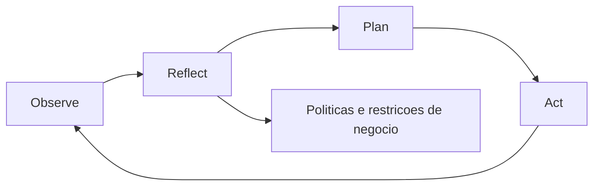
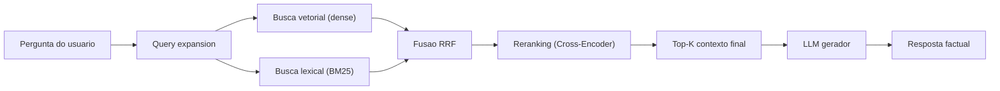
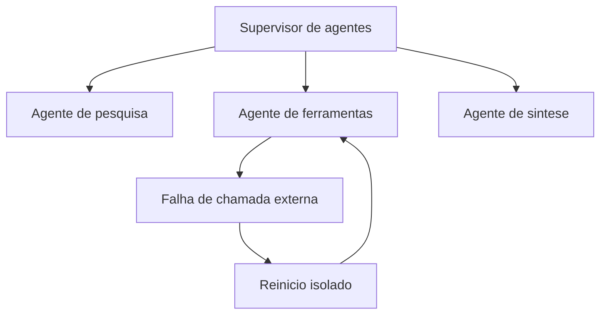
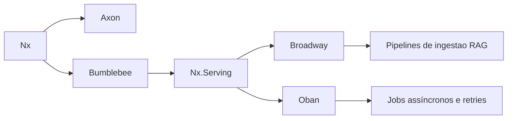
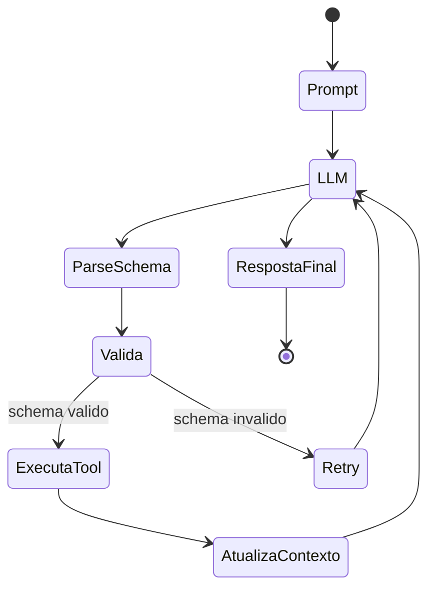

# **誇大広告を超えて: コグニティブ アーキテクチャと LLM を製品に統合する方法**

ソフトウェア開発エコシステムにおける生成人工知能 (GenAI) の導入は、議論の飽和点に達しています。世界規模の組織は、生産性の飛躍的な向上と新たな収益の道が期待できるため、自社の製品に会話型インターフェイスを急いで組み込んでいます。しかし、現在の市場は「GenAIのパラドックス」として広く文書化されている現象に直面しており、圧倒的な割合の企業（約80％）が、インフラストラクチャやライセンスへの多額の投資にもかかわらず、バランスシートの最終損益に重大かつ具体的な影響が見られないと報告している。この不協和音は、大規模言語モデル (LLM) に固有の欠陥を反映したものではなく、むしろ未熟なアーキテクチャ アプローチの直接の結果です。

初期の実装の大部分は、基礎モデルを水平的なオラクルとして扱いました。製品チームは、インターフェイスにテキスト ボックスを接続するだけで、ユーザーがモデルに直接質問 (プロンプト) を送信できるようになり、これらのニューラル ネットワークの膨大なパラメトリック知識によって複雑なビジネス上の問題が解決されることを期待していました。この水平的なアプローチは、一般的なアシスタントや生産性副操縦士の急増に代表され、複数のユーザーや重要でないタスクによって生み出される価値を薄め、企業の集計指標では投資収益率が事実上見えなくなります。プロダクト マネージャーやイノベーション リーダーにとっての課題は、もはやモデルの表面的な探索ではなく、自然言語の確率性が決定論的なビジネス ルールによって厳密に制限される垂直化されたソリューションのエンジニアリングにあります。

この実験段階を超えるには、単純な「即時エンジニアリング」から完全な認知アーキテクチャの構築への進化という、深い構造的移行が不可欠です。このドキュメントでは、エンタープライズ グレードの人工知能フローを調整するために必要な基礎、インフラストラクチャ方法論、最先端のツールについて、特に Erlang 仮想マシン (BEAM) の機能パラダイムと Elixir エコシステムに焦点を当てて詳しく説明します。分析は、高度な回復拡張生成 (RAG) システムの構築からマルチエージェント システムの複雑な状態の管理まで多岐にわたり、AI 製品化の技術的および戦略的ロードマップを提供します。

## **即時の誤謬と認知アーキテクチャの台頭**

生成 AI に関する最初の興奮は、プロンプト エンジニアリングが将来のソフトウェア開発の決定的なスキルであるという誤った前提を煽りました。明確な指示を作成することは必要ですが、回復力のある製品を作成するには根本的に不十分です。孤立した言語モデルは、非常に有能な言語処理システムに似ていますが、重度の前向性健忘症と実行機能の完全な欠如に悩まされています。彼らは本質的な目標指向の主体性を欠き、過去のやり取りの継続的なエピソード記憶を保持せず、企業のデータベースの現在の状態についての感覚的な認識を保持しません。

デジタル製品が外部 API に送信される静的プロンプトのみに依存する場合、そのコア ロジックを確率分布にアウトソーシングすることになります。避けられない結果は、データの幻覚、従来のアプリケーションによる解析を不可能にするフォーマットの破損、および複数の相互依存する論理ステップを必要とするタスクの実行不能です。このアーキテクチャ上の行き詰まりに対する解決策は、言語モデル認知アーキテクチャ (LMCA) です。

コグニティブ アーキテクチャは、人間の認知の基礎となる不変メカニズムをエミュレートするように設計された計算フレームワークです。 LLM はシステム全体として動作するのではなく、注意、記憶、学習、環境の認識を制御する古典的なソフトウェア モジュールに囲まれた言語推論エンジンとしてのみ機能します。最近の開発では、数十年にわたる記号研究を「認知の共通モデル」に統合し、ディープ ニューラル ネットワークの意味論的な柔軟性とルールベースのシステムの予測可能性を統合することを目指しています。

**図: 認知エージェントの ORPA サイクル**


### **ORPA フレームワークとエージェントの差別化**

従来のコンテンツベースのワークフローから真にインテリジェントなシステムへの移行には、コグニティブ エージェントの実装が必要です。静的な意思決定ツリー (IF-THEN-ELSE) に従う自動化スクリプトとは異なり、認知エージェントは不確実性に直面して動的な意思決定を行います。製品環境でこれらのエージェントをエンジニアリングするための最も堅牢なメンタル モデルは、実行を 4 つの異なる調整されたフェーズに分割する ORPA フレームワークです。

観察フェーズでは、システムは単に経験的データを収集するだけではありません。コグニティブ エージェントは、リレーショナル データベース、クライアント メッセージ キュー、サーバー ログの状態など、動作環境を分析し、隠れたパターンや相互関係を積極的に特定する必要があります。次に、Reflect フェーズがシステムの封じ込めコアとして機能します。出力を生成する前に、エージェントは観察されたパターンを一連の厳格なビジネス ポリシー、事前定義された倫理的制約、および過去の経験から得たデータと対比させ、企業ガイドラインが統計的確率に違反していないことを確認する必要があります。

仮説が立てられると、計画（Plan）へと進みます。このアーキテクチャは、目標を達成するために設計された論理アクションの反復シーケンスを構築します。このフェーズでは、思考連鎖などの複数ステップの推論テクニックがよく使用されます。これにより、LLM は最終コマンドを発行する前にロジックの各中間ステップを正当化するように強制され、数学的および空間的推論タスクの成功率が飛躍的に向上します。最後に、アクション フェーズ (Act) では、開発されたソリューションを実装します。ソフトウェア アーキテクチャでは、これは外部ツール (ツール呼び出し) の構造化された実行、API の操作、CRM のレコードの更新、または通信のディスパッチに変換され、同時に HTTP リターン コードを継続的に監視して障害が発生した場合に計画を調整します。

### **複数のエージェントのワークフローのジレンマ**

アプリケーションがより複雑になるにつれて、ネットワーク内で連携する複数の専門エージェントにタスクを分散させたいというアーキテクチャ上の誘惑が生じます。ただし、実証研究と実装では、従来のモジュール式システム (通常、コンポーネントの追加により機能が直線的に拡張される) とは異なり、AI エージェントの管理されていない増殖により、システム全体の認知負荷が指数関数的に増加することが実証されています。

マルチエージェント ネットワークに厳密なオーケストレーションが存在しない場合、確率的ノイズが増幅され、冗長な計算サイクルが実行され、無限の議論や矛盾した決定のループにシステムがロックされてしまいます。規模の拡大が魔法のように知性の向上につながるわけではありません。むしろ、これらのシステムで観察される行動の調整と収束は、モデルの内部の「意識」からではなく、アトラクター理論がインタラクションデザイン自体によって課せられるフレーミングとして説明するものから現れます。演算子側の信号の幾何学的構造とエントロピー (「足場」またはアルゴリズム足場) は、短期記憶 (KV キャッシュ) の複数回の反復にわたってモデルの出力を有用で安定した応答に導く役割を担っています。したがって、製品の成功に対する責任は、使用する基本モデルの選択だけではなく、モデルを取り巻くエンジニアリング インフラストラクチャにほぼ全面的にかかっています。

|システム要素 |認知アーキテクチャにおける機能 |製品への戦略的影響 |
| :---- | :---- | :---- |
| **意味記憶** |ベクトルバンクを通じて企業の事実に関する知識を長期的に保存します。 |製品が独自のトレーニングバイアスではなく、独自の真実に基づいて応答することを保証します。 |
| **リフレクション エンジン** |実行前に事実に反するシナリオとビジネス上の制約を評価します。 |セキュリティ侵害、倫理違反、顧客に有害な行為を防止します。 |
| **エージェントの監督** |サブエージェント間の通信トポロジを階層的に制御します。 |計算の冗長性を回避し、過剰な推論を通じて API コストを積極的に削減します。 |
| **ツールの実行** |決定論的関数呼び出し (API) を介して環境の状態を変更します。 |単なるテキスト ジェネレーターを、エンドツーエンドで価値を提供する問題解決製品に変えます。 |

## **エンタープライズ メモリ エンジニアリング: 高度な RAG**

LLM が特定の組織のデータについて正確な決定を下すには、密結合されたセマンティック メモリが必要です。トレーニングの重みのみに基づくモデルは、知識の一時的な減衰に悩まされ、データカットオフ日以降に発生したイベントを完全に無視します。取得拡張生成 (RAG) は、独自の知識項目を選択的に取得してリアルタイムでモデル コンテキストに注入できる数学的表現に変換することで、この欠点に対処するための業界標準アーキテクチャとしての地位を確立しています。しかし、ここ 1 年で普及した基本実装は、ミッションクリティカルな製品をサポートするには非常に脆弱であることが判明しました。

### **ナイーブ RAG の脆弱性**

いわゆる「Naive」RAG の運用フローは、線形アルゴリズムのトレッドミルに従います。組織のドキュメントは任意のテキスト ブロック (チャンキング) に分割され、浮動テンソルの双方向埋め込みモデルによってエンコードされ、メモリベースのデータベースに保存されます。推論中、ユーザーの質問もベクトルに変換され、システムはコサイン類似度計算を使用して多次元空間で地理的に最も近いテキスト ブロックを取得し、結果を LLM に渡します。

このアプローチは技術的なデモンストレーションには機能しますが、複数のアーキテクチャ上の脆弱性により、エンタープライズ環境では根本的に機能しません。排他的にセマンティック (ベクトル) 検索を行うと、正確な語彙一致が近視眼的になります。マネージャーが「プロジェクト」に関するデータを検索すると、

さらに、文字またはトークンの静的なカウントのみに基づいたチャンキング戦略は、情報のコンテキストと階層構造を積極的に切断します。モデルは、段落の最初の前提を失った脱水されたフラグメントを受け取ります。再分類層がないと、純粋な数学的類似性によって潜在的な空間的近接性が評価される傾向がありますが、これはユーザーの多面的な質問が要求する実用性や真実性と必ずしも相関するとは限りません。コンテキスト ウィンドウの有限な制限により、関連情報の犠牲も余儀なくされます。

### **高度な RAG とハイブリッド リカバリのアーキテクチャ**

真の ROI を引き出すには、開発リーダーは高度な RAG テクニックの採用を義務付ける必要があります。これは、線形検索を放棄し、洗練されたマルチステージ パイプラインを優先します。このアーキテクチャにより、システムのインテリジェンスが向上し、応答が事実に基づいており、説明可能であり、スケーラブルな複製が可能であることが保証されます。

**図: 高度な RAG パイプライン**


最初の構造革新は、ハイブリッド検索の強制導入です。この方法は、コンピュータ サイエンスの 2 つの検索パラダイムの長所を統合します。深い意味論的な意味に焦点を当てた高密度検索と、キーワードの正確な存在に焦点を当てた従来のスパース検索 (多くの場合、BM25 ランキング機能によって実装されます)。高密度検索はあいまいさや言い換えを完璧に処理しますが、BM25 検索はコード、正確な日付、および非常に特殊な業界用語を取得する際に外科的精度を保証します。両方のクエリを並行して実行することにより、このアーキテクチャは、確実にカバー範囲を確立します。

RRF 融合によるハイブリッド回復の最小限の例:

```python
def hybrid_retrieve(query, top_k=10):
    dense_hits = vectordb.search(query, k=50)        # similaridade semantica
    lexical_hits = bm25.search(query, top_k=50)      # correspondencia lexical

    # RRF: combina listas pelo ranking, sem depender da escala do score
    scores = {}
    k = 60
    for rank, doc in enumerate(dense_hits, start=1):
        scores[doc.id] = scores.get(doc.id, 0) + 1 / (k + rank)
    for rank, doc in enumerate(lexical_hits, start=1):
        scores[doc.id] = scores.get(doc.id, 0) + 1 / (k + rank)

    ranked = sorted(scores.items(), key=lambda x: x[1], reverse=True)
    return [docstore.get(doc_id) for doc_id, _ in ranked[:top_k]]
```
期待される結果: あいまいなクエリのカバレッジが向上し、同時に、まれな I​​D、コード、用語の精度が向上します。

ハイブリッド検索の機械的な合流により、基本的な数学的課題が生じます。コサイン類似度スコア (0 から 1 の範囲) と BM25 方程式から導出される無制限の対数スコアは、相互に排他的な数学的スケールで動作するため、文書の優先順位を定義するための直接的な算術混合は不可能になります。

業界は、相互ランク融合 (RRF) アルゴリズムを通じて、この摩擦に対する解決策を標準化しました。この方法では、純粋な数値スコアを完全に破棄することにより、スケールの標準化の問題が排除されます。代わりに、アルゴリズムは両方の順序付きリスト内のドキュメントの相対位置を独立して評価します。次に、システムは各ドキュメントの逆順位を合計し、数学的定数で平滑化することにより、新しいユーティリティ スコアを計算します。

RRF の数学的定式化は、各ランキング リスト \(r\) におけるランクの逆数に定数 \(k\) を加えた合計として表されます。

$$
\mathrm{RRF}(d) = \sum_{r \in R} \frac{1}{k + \mathrm{rank}_r(d)}
$$

この方程式では、パラメータ \(k\) がペナルティ バッファ (業界の実務では通常 60 に設定されます) として機能し、絶対的な上位の結果が集計リストを過度に支配するのを防ぎ、広範な有用性を実証する平均的なドキュメントのためのスペースを確保します。この融合の真の優れた点は、クエリ拡張ルーチンと組み合わせた実装で明らかになります。一般的な手法では、検索前にユーザーの自然な質問を 3 ～ 5 つの仮定のバリエーションに拡張するよう LLM に依頼します。これらすべての意味的置換はベクトル エンジンと語彙エンジンに並行してダンプされ、その結果は RRF によって統合されます。事実に基づいた確かな文書は、複数の検索フロントに一貫して表示されるため、自然なコンセンサスによってセットの上位に浮上しますが、不適切に設計されたクエリのバリエーションから生じる統計的な異常は、有機的にリストの下に沈みます。

### **リランキングとクロスエンコーダーの重要な段階**

単純なハイブリッド集計では、優れた再現率を備えた大量の候補が生成されますが、絶対精度には限界があります。 LLM に数十のドキュメントを挿入すると、処理されたトークンのカウント (即時価格設定) で不快な遅延とポルノ的なコストが発生するだけでなく、モデルのネイティブ アテンション メカニズムも混乱します。パイプラインの最後にある重要なブリッジは、再ランキング ステージです。

再ランキングは厳格なふるいとして機能し、回収された上位 100 の候補 (上位 K) を取り出し、それらを 2 番目の、より詳細で密度の高いモデルの対象にします。これまでのフェーズでは、数百万のベクトルよりもミリ秒スケールの効率を優先していましたが、再分類では、分離された小さなセットの忠実度を最大限に高めることだけに重点を置き、かなりのリソースを費やす可能性があります。

このレベルの主なテクノロジーは、*クロスエンコーダー* (MS MARCO MiniLM や BGE-Reranker ファミリなど) として分類されるディープ インタラクション モデルです。その価値を理解するには、最初に使用された *Bi-Encoder* モデルと比較する必要があります。 Bi-Encoder は、質問を 1 つのベクトルにエンコードし、テキスト ドキュメントを別のベクトルにエンコードし、ポイントの距離を個別に計算します。 Cross-Encoder はユーザーの質問とテキストの断片を相互に連結して 1 つの統合されたシーケンスにし、Transformer の複雑な自己注意ヘッドが問題の各音節と候補記事の各概念の間で双方向の推論を相互参照できるようにします。

この詳細な分析は、意味論的なメリットの判断者として機能し、コマンドに対する関連性だけでなく、意図や実際の事実上の有用性の指標に基づいてピアをスコアリングします。生のスコアまたは含意の確率的メトリクス (テキスト含意) を使用した最終スコアの調整後、高度に圧縮され抽出されたトップ 3 からトップ 5 のセットが最終的にメイン LLM の生成ギアに渡されます。この徹底的な改良ラインを通じてのみ、大規模な再現性が保証され、望ましくない逸脱が制限され、実際の製品の主要なサポート アーキテクチャとして RAG が強化されます。

|アーキテクチャコンポーネント |実行された戦略 |ビジネスへの具体的なメリット |
| :---- | :---- | :---- |
| **取り込みとメタデータ** |構造を意識したチャンキングとキー識別子の抽出。 |階層情報を保持し、複雑なマニュアルの意味の流れが途切れるのを防ぎます。 |
| **ハイブリッド リカバリ** |コサイン類似性マージ (埋め込み) および語彙エンジン (BM25)。 |顧客が意味属性ではなく特定の ID で製品を検索するケースを軽減します。 |
| **統計的融合** |リターンの組み合わせにおける相互ランク融合 (RRF) アルゴリズム。 |異なる検索パラダイム間で合意を形成し、テーブル内の偶発的な結果を降格します。 |
| **ふるい分け (再ランキング)** |ペアごとの相関関係を評価するクロスエンコーダー モデル (クエリ-ドキュメント)。 |コンテキストの肥大化を根本的に削減し、気が散る要素を排除して、LLM 推論の予算を節約します。 |

## **インフラストラクチャ パラダイム: Python の生産的な課題**

これらすべての精巧で概念的なパイプラインをデータ サイエンス ラボから運用サーバーに変換すると、深刻なインフラストラクチャのボトルネックが明らかになります。産業上の要請により、最新の製品のエッジで動作する人工知能は、固定重み付けモデルの大規模な事前成熟ではなく、主に高度な並列化と強力なネットワーク オーケストレーションを扱うことが求められています。

Python エコシステムが機械学習の理論進化の重力軸を構成していることは否定できません。広大なリポジトリと大規模な資金援助により、データ分析の探索や、新しい基礎モデルのバックプロパゲーションとベースライン トレーニングのフェーズにおいて、この言語の明白な優位性が確立されました。問題は、Python エコシステムが有機的に命令的であり、継続的な多面的なフロー、高度に非同期でエージェント アーキテクチャに必要な永続的な分散プロセスに依存するフローを実行する必要がある場合に、アーキテクチャ上の重大な欠陥が生じるという事実にあります。

### **従来の必須および競争制限**

古典的なフレームワークを運用するプラットフォームなど、基本的にレガシー標準に基づいたエコシステムでは、メイン アプリケーションと情報検索サービスの間の接続の複雑さの増大は、システム的な分離の欠陥によって抑制されます。モノリシック Python アプリケーションは一般に、寛容な柔軟性とオブジェクト リレーショナル モデル (ORM) へのロジックの無差別なインポートによって課せられる無計画な結合に陥り、相互作用を扱いにくい「スパゲッティ コード」の高度に結びついた構造に変換します。

最も基本的な障壁は、グローバル インタープリター ロック (GIL) です。 GIL は、Python の実行エンジンをペグされたシリアル インタラクションに結び付け、周辺機器の分散コンピューティングをやりくりすることなく、マルチコア サーバーでの真の並列化を防ぎます。実際の市場パフォーマンス テストでの評価では、大量の同時イベントに対する単一応答において、Python の時間劣化 (表面的には軽減されたとしても) により、厳密なコンパイラと比較して、操作上の弾力性において深刻な不利な点に置かれていることが示されています。リーダーにとって、これは、高価なクラウド インスタンスや巨大なクラスターをプロビジョニングし、脆弱なマイクロアーキテクチャ全体でサービスを回転させる必要があることを意味し、運用可能なエンタープライズ AI システムを維持するための財務予測に影響を与えます。

## **業界の対応: BEAM と Elixir によるオーケストレーション**

フォールト トレラント システムとロングサイクル コグニティブ アーキテクチャを構築するプロジェクト マネージャーにとって、パラダイムは、同時実行性、非同期同時プロセス、および故障からの継続的な回復が工場固有の特性である抽象化に移行する必要があります。歴史的かつ軍事的にテストされた Erlang Virtual Machine (BEAM) 上で動作する Elixir 言語が橋渡しするのは、まさにこのギャップです。

**図: BEAM に対するエージェントの監視**


BEAM アーキテクチャは、もともと通信企業内で、大規模な同時通話を途切れることなく地球上で確実に伝送することを管理し、99.9999% の保証 (稼働時間 99.99999%) でフォールト トレランスを維持するために設計されたもので、アクター モデル パラダイムを深く採用しています。その中では、すべてが超軽量プロセスの形で動作し、メモリが完全に分離された自律的なメールボックスを介して通信し、実行時のデータの変更可能性を認識しません。

### **エージェント オーケストレーションとの完璧な連携**

組織化されたインテリジェンス システムは不安定なネットワークです。リクエストにより、インターネットとローカル API を探索する 6 つの自律サブエージェントをディスパッチできます。命令型システムでは、サービスの 1 回限りの停止がメインのユーザー フローで連鎖的な停止 (雪崩) を引き起こすことが多く、迷路のような防御コードと、ソースでの予防的な例外処理の深いブロックが必要になります。さらに、受動的な突然変異は、データ エンジニアに体系的な防御的で積極的なクローン作成 (割り当てられた配列に対する大規模な .copy() 呼び出しなど) の義務を課し、分析速度の指標を爆発させます。

Elixir は、数学的純度の独自に不変の構造と関数の哲学によってこの問題を裏返し、メモリの大失敗と偽りの競合アクセスの巨大な層を最初から無効にします。しかし、勝利は監視ツリーにかかっています。 Elixir の本質原理は、「組織的な事故は必ず発生する」という現実的な前提です。サードパーティの LLM が読み取り不能なファイルを返したり、gRPC リクエストが 30 ミリ秒後にタイムアウトした場合の戦略は、各業務ラインへのショックを防ぐことではなく、監視エージェントを導入することです。プロセスが突然失敗してクラッシュした場合、スーパーバイザ ツリーは失敗したサブタスクのスレッドのみを削除し、アクターを即座にクリーンな状態で復活させて、残りのシステム リクエストの整合性を損なうことなく、基になる操作の修復を試みます。

Elixir での分離された再試行による監視の最小限の例:

```elixir
defmodule AgentWorker do
  use GenServer

  def start_link(arg), do: GenServer.start_link(__MODULE__, arg)

  def init(arg), do: {:ok, %{arg: arg, retries: 0}}

  def handle_info(:run, state) do
    case ExternalTool.call(state.arg) do
      {:ok, result} -> {:noreply, Map.put(state, :result, result)}
      {:error, _} when state.retries < 3 ->
        Process.send_after(self(), :run, 200)
        {:noreply, %{state | retries: state.retries + 1}}
      {:error, reason} -> {:stop, reason, state}
    end
  end
end
```
期待される結果: ローカルで障害が発生すると、影響を受けるワーカーのみが再起動され、グローバル フローの安定性が維持されます。

それは、静的な人工アシスタントやばらばらのエージェントでは達成できない、全身の回復力の調整です。これは、コード自体がモデル化され、継続的で中断のない安定性を確保するメカニズムを構成します。これは、現代の企業インテリジェンスにおける成熟したワークフロー システムの反論の余地のない前提条件です。

## **Elixir のネイティブ AI エコシステムと垂直方向の成長**

Elixir に対する歴史的な議論は、ニューラル ネットワーク コンポーネントの不足したコレクションに基づいていました。しかし、過去 24 か月間で、コミュニティ内で大規模な垂直技術が開花し、Elixir が一般的な Web トランザクションのバックエンド段階から、インテリジェントなプロダクション開発の主要な手段として最前線に躍り出ました。加速された導入は、Nx、Axon、Bumblebee の 3 つのライブラリに基づく強力な統合レイヤーに統合されます。

**図: Elixir の AI エコシステムのレイヤー**


### **マトリックスの基礎: Nx 層と軸索層**

その基礎となっているのが **Nx (Numerical Elixir)** プロジェクトです。 Nx は、Python 行列エコシステムが特殊な低レベル言語で行うことと同様に、n 次元の数学的テンソルを管理、変更、調整するための完全な機能を Elixir に提供します。単なるパッシブ マトリックス モデラーよりも強力な Nx は、ネイティブ CPU アーキテクチャ、特定のアクセラレータ、または EXLA (Google XLA テンソル コンパイラ バックエンドとの強力なリンク) を介したグラフィックス プロセッシング ユニット (GPU) のクラスター ファーム上で直接、流動的なジャストインタイム コンパイルを行うように構築されており、ネットワークに固有の大規模な計算に必要な並列効率におけるメトリック パリティを提供します。

これらのテンソル ルーチンの上には、**Axon** と呼ばれる機能フレームワークがあり、分析ディープ フロントに一般的に関連付けられている主要な柔軟な宣言的プラムを提供します。開発者は、言語の単純化されているが厳密な構文ノードを使用して、数値コアによって操作されるベクトル化された情報から正確な分類を予測する際の決定論的推論ロジック ルーチンの連続処理のためのモデルの完全な多層畳み込みトポロジを設計します。

### **Bumblebee と Nx.Serving を介した競争力のある配布**

ただし、決定的な実践的な変革の進歩は、**Bumblebee** の導入によって具体化されています。基本的に、Hugging Face が幅広いデータ サイエンティストに提供するものの使用を直接促進するように機能し、世界中で入手可能な最も重い事前トレーニング済みアーキテクチャ モデルを最小限の手続き記述で統合して実行することができ、基本的な重みをリポジトリ クラウド (GPT-2、Llama-3、RoBERTa 構造アーキテクチャに基づく分類器、ResNet-50 畳み込みコンテキスト アナライザーの知的インスタンスなど) から厳密なクラスに直接移植できます。会社が開発したアプリケーションのパイプライン。

このアーキテクチャのオーケストラ構成では、サーバー Python シナリオと積極的な財務拡張に直面して、エコシステムの絶対的な分水嶺、つまり **Nx.Serving** の構造的抽象化が現れます。一般的な命令型モデリングでは、推論検証を要求する 500 人の同時ユーザーのインターフェイスによって生成される接続を分散するには、多くの場合、高価な処理バス キューや、有益な処理使用率を無駄にする悲惨なほど高価なユニタリー インスタンスの動員が必要になります。

ネイティブのシステム コンポーネント Nx.Serving は、BEAM 自体内にネイティブの非常に低電力の永続的な監視ルーチンを作成することで、これを変更します。何百もの競合するルーチンが個別の要求と質問を注入すると、サービスは、異種の継続的な送信を繰り返しキャプチャし、飲み込んで、最大飽和度のバッチ化された要求ブロックにマージし、1 つの巨大なパスで最終的な GPU コンパイル パイプラインに送信できるようにパッケージ化します。結合解決された推論を返す際、システムは、結果として得られるテンソルを細分化し、適切な厳密な数学的スコープを正確に元の手続き呼び出し元のポートに非同期的にディスパッチし、組織のインフラストラクチャ ハードウェアの完全な熱的および電子的利用を保証し、グローバル プロバイダーとの取り決めで支払われる毎月の償却額を実質的かつ大幅に削減します。

### **Advanced RAG の制作キュー: ブロードウェイとオーバン**

プロジェクト管理者は、コグニティブ パイプラインの理論、特に RAG で証明されたハイブリッド セマンティクスのライブラリの厳密な継続的作成において、企業の膨大なリアルタイム書誌相関を永続的に管理するという暗黙の前提を観察します。継続的なフローでこれらの定期的な負荷を管理するには、復元力のあるボリューム耐性のある抽象化が必要です。

この領域では、一連の非同期バックグラウンド プロセスが絶対的に普及しています。 Elixir ベースのアプリケーションは、**Broadway** インターフェイスによって中心的に示される、無敵の競合キューイング フレームワークによって導かれる統合エコシステムを最大限に活用します。このパイプラインは、SQS (Amazon) や RabbitMQ のプロトコルなどのエンタープライズ プラットフォームでの純粋な結合に基づいており、処理とエンリッチメントの最初の段階で、厳格な優雅さでパーティションを処理し、ベクトル読み取りフレームをロスレスでフレンドリーに再起動します。さらに、スケーラブルな構成の簡素化されたアーキテクチャにより、ベース データベースに統合された最先端のライブラリ (**Oban** など) を介してインデックス作成が行われ、非常に堅牢なキューイングと継続的な同時実行を調整するために PostgreSQL の主要な厳格なリレーショナル プロトコルのみを使用し、クラウド ネットワーク内のアクセサリの横方向インスタンスが完全に不要になり、固有のボトルネックが軽減されます。

|運用層 |エリクサーツール |目に見える競争上の優位性 |
| :---- | :---- | :---- |
| **データベースとテンソルの操作** | Nx |実行を最大化する、最適化された透過的コンパイル (EXLA 経由)。 |
| **ニューラル宣言アーキテクチャ** |軸索 |深い局所推論類型学の構築。 |
| **分散推論管理** | Nx.Serving を使用したバンブルビー |自動 GPU バッチ抽象化により、インスタンスの金銭的無駄がなくなります。 |
| **後部作業の運行管理** |ブロードウェイ & オーバン |並行競争は、企業のハイパーボリュームの RAG インジェストにおける部分的な淘汰の影響を受けません。 |

## **モデルへの合理的な強制: LLM 出力と機能実行の調整 (ツール呼び出し)**

超最適化された非同期処理のオーケストレーション エコシステムと、内部ファイル再署名のための堅牢なハイブリッド パイプラインを備えた、生産性の高いソフトウェアを作成する際のインテリジェンスの最後のジレンマは、変換の制約にあります。アーキテクチャは、広範な基礎インテリジェンス言語の日常的な非構造化プロリックスの一時的な会話を消滅させる必要があります。生の会話モデルは、長い振動形式の確率的予測を返しますが、構造化データのシステム フローをまったく提供できません。重要な通信リンクは、型付き静的形式ロジックと厳密な明示的モデリングに直面したインフラストラクチャ インテリジェンスの飼いならしに基づいています。

**図: 検証を伴うツール呼び出しサイクル**


### **インストラクターによる決定論的出力パラダイム\_ex**

この構造的障害を強制的に排除することは、企業クラスでの Elixir インストラクター\_ex スイートの典型である、厳密な形式的誘導ライブラリの系統的な作成への独創的な貢献によって克服されました。明示的な修辞的なセマンティック書式設定の戦術のみに基づいた不器用で緩やかな依存 (「特定の事前に確立された任意の書式設定の下で、適切な JSON スタイルでのみ出力してください...」) に強く反対するため、この標準は、LLM パイプラインの最終予測フェーズで認知的注意限界に対する克服不可能な制限を構造的に定義することにより、パラメトリック トポロジの厳しい制限を押し広げています。

このメカニズムの背後にあるエンジニアリングは、最新の Elixir 環境のデータベースにおける構造化とトランザクション操作の基本的な柱の 1 つである Ecto スイートとその基本構成 (Ecto スキーマ) に基づいています。アーキテクトは、厳密な企業宣言型記述モジュールをトレースし、オーケストラ認知における提案されたタスクの結果の要求に期待される不変の必須の形態学的マップと、その必須の厳密な相関パラメーターを積極的にモデル化します。

予測分析フローのしきい値では、ライブラリ インフラストラクチャは、ネイティブの明示的な構造化マッピングを、外部プロバイダーまたは内部 Bumblebee インスタンスのアルゴリズム推論ポータルでの組み込みデコードに受け入れられる複雑な JSON スキーマの正式なスケマティック バリデーターの描写に透過的に変換します。外部アルゴリズム モデルは、形式的な振動を起こすことなく、この図式的な形態の制約を有機的に満たし、基本的に、パフォーマンスの最高点で直接監視されない確率的ネットワークに固有の散発的なテキストの誤字や望ましくない状況上の幻覚異常を含んでいます。

スキーマ検証を使用したツール呼び出しの最小限の例:

```python
from pydantic import BaseModel, ValidationError

class TicketAction(BaseModel):
    action: str
    ticket_id: str
    priority: str

raw = llm.generate(prompt_with_schema)

try:
    action = TicketAction.model_validate_json(raw)
    execute_tool(action.action, action.ticket_id, action.priority)
except ValidationError as err:
    # feedback estruturado para nova tentativa do modelo
    retry_prompt = f"Schema inválido: {err}. Gere novamente JSON válido."
    raw = llm.generate(retry_prompt)
```
期待される結果: 解析中断の減少と自動化の予測可能性の向上。

さらに、現実世界のアプリケーションにおける体系的な回復力にとって重要なのは、固有の運用上の自己修正ロジック (ツールのパラメトリック認知チェーンの厳密な自己回復) です。 RAG を介して渡されるドキュメントの文脈化された解釈の複雑さを考慮した解釈の逸脱や内部論理確率的推論エラーにより、コンポーネントの生成出力がベース アプリケーションを操作する目的では受け入れられない形態学的アサーションに依然として遭遇する場合、スイートのメカニズムは自動サポートに入ります。クライアント ユーザーの前で障害ゼロの生成予測を単に破棄するだけではありません。フレームワークの基本リレーショナル ネイティブ マトリックス ロジックで分離できない、堅牢でテスト済みの古典的な検証構造 (validate\_changeset/1) を利用して、このツールは不適合を即座に処理し、基本フレームワークにパッケージ化された解釈されたエラーを周期的に再解放します。これにより、アルゴリズムの自動調整された反復再帰ループが呼び出され、パイプラインの新しい送信で即時の自律的な再配置が要求され、指示された形態学的構造に機械的に修正されます。制限メッシュでは、設計された条件付きループ max\_retries によって確立されたパラメーターで外部の支援なしで実行されます。

### **LangChain Elixir を使用したオーケストレーションによる認知の分離**

構造の不変性が習得され、推論エンジンの純粋に言説的な幻覚振動がタイピング スキーマの厳密なパラダイムによって飼い慣らされると、慣性制限バリアが置き換えられ、操作性の側面が与えられます (実際の運用機関)。システムは進歩し、論理的推論により、RAG データベースに事前に確立された有機的な言語ネットワークを置き換えて、製品環境の実際の制御を引き受けることができます。成熟したアーキテクチャの採用により、完全に厳密なオーケストレーションに基づいてモデル化された、ネイティブの不変スペクトルに基づくプラットフォームへの LangChain などのエージェント統合のツールモジュラー ブリッジを通じて、統一されたサポートが提供されます。

以前のインタラクティブ エコシステムのマトリックス バージョンの大規模なコミュニティによって中心的に開発された同名の知的な指示に基づいていますが、オーケストラル Python とその領域の基本的な対応物 (企業のインターネット サービスの運用周辺部にある複雑なインタラクティブ フレームワークへの事前トレーニング済み情報マトリックスの広範な接続が可能になります)、Elixir のモジュール式で純粋に厳密な並列化が可能な化身は、ソフトウェア ビルダーに、インタラクティブ オーケストレーションの本質的な欠点を直感的に排除した、インタラクティブ オーケストレーションの基本的な基盤を提供します。従来の命令型モノリシック逐次解釈チェーンの論理ループの結合処理。

インタラクティブな静的エンタープライズ ポリシーの基礎には、LangChain LLMChain と呼ばれる基本的なアーキテクチャ マトリックス モジュールがあり、管理されます。実際の企業製品のためのこれらの成熟した運用方法論に基づくコグニティブ ツールの構造システム モデルの対話型論理ルーチンの運用ギアリングの中心的な抽象化に含まれており、その有用性は主にオーケストレーション コネクタ コアとして拡張されます。この体系的な魔法は、プログラミング チームが制限されたローカル リポジトリから内部ソフトウェアへの既存の有機的な企業マトリックス機能の流動的で直接的なインタラクティブな統合を可能にすることから始まります (タイムリーな支払いのための財務ルーチン、レコード内の主要顧客テーブルの自動化の統合、企業の有機的な構造メッシュにおけるインタラクティブな制限的な内部承認に対する厳格な条件付き実行、「ツール」またはコンポーネント LangChain.Function の解釈的意味論的テンプレートの構成パラメータ内で抽象的にラベル付けされています)。

アーキテクチャ モデルの精査の下、フレームワーク モジュールで確立された厳格な認知コンテキスト フレームワークに基づいて、LLM 処理の認知は、通信パイプラインにおける毎日の有機的なデジタル アクセスの末端で、要求側ユーザーの生のテキストで想定されている情報や問題に直面して抽象的にとりとめのない会話をする緩い反応的な通信許可を受け取りません。逆に、極限で相互作用し、条件付き手続き型で厳密に解決するように公開されている関数ユーティリティの範囲の明示的に型指定された制限的なポートフォリオを受け取ります。

組織が課した明示的な制限（反映と計画）に直面したときの基本ロジックの内省的解釈の反省と評価の段階の後、統計的数学的予測の仕組みは、説明的な句文を連結する代わりに、有機ベースのプラットフォーム環境に向けられた「ツール呼び出し」ギアをトリガーし、循環モード（モード：:while\_needs\_response）でアルゴリズムのインタラクティブなシステムパッセージを積極的に要求します。ルーチンを操作すると、条件付きコンテキスト (custom\_context) に限定された呼び出しをトリガーするローカル Elixir メカニズムが処理されます。アプリケーションの構造面でのバックグラウンド呼び出しの実行は、更新された詳細情報を収集し、補足的な分析の補足として、以前の基礎ネットワークの有機的なコンテキスト解釈構造に瞬間的な実際のフィードバックを積極的に再挿入します。セマンティック エンジンは、幻覚による推論によるテキスト演繹に頼ることなく、ミリ秒単位の具体的なアクションによってツールの構造ネットワーク内で生成される有機的変換を繰り返し消化します。

#### **品質と積極性の評価: 軌道のアルゴリズム ロジック**

自律的で複雑なイノベーションを構築し後援する経営リーダーは、日々の体系的な精査において、従来のプログラミングの従来のバイナリ古典テストアルゴリズム評価基準の伝統的な限界に直面しています。エージェントのネットワーク化された反復的有機的認知では、クライアント ユーザーによる時間厳守の承認のために視覚端末に受動的に表示される演繹的有機的応答の積極性は計量的に貧弱になり、マトリックス アルゴリズムの逐次的反復解決プロセスの計算深度で本質的に生成される関連コストの手順ロジックの包括的な分析シナリオが厳密に欠如します。 2 つの自律的なサブエージェントは、理論的かつ機械的に、単純化された古典的なおざなりな評価におけるビジネス上の原則に基づいて、同一の成功と統一された有機的な構文上の正確さを伴って厳密な結果を考案し、提供することができます。しかし、重要な違いは、その後に続く「実行と解釈の演繹の経路」のオーケストラの根底にある論理アルゴリズムの有効性の巨大な機械的差異に密かに隠されています（有機的な反復が単一の API 呼び出しのみを使用してアルゴリズムの障害を解決する場合、最適で安価な解決は、他のフローの切断された論理反復予測に直面して最適化され、解決と修正の試みの数十回の再帰的確率的ルーチンが継続的に発生し、間引きと修正が行われます）。有機的コンピューティングの基礎となる割り当てられたトークンの量に固有の金融的金銭的負担の量的量が目まぐるしく膨らむ）。

自律的消費と手続き的行為の予測可能性と厳格な追跡可能性に対する率直な管理上のアーキテクチャ上の懸念を和らげ、現代のパラダイムのスペクトルにおけるマルチコール認知に反復的に基づいた論理システムにおける厳密な論理テスト (QA テストと回帰) における適合性の徹底的な評価を保護し、制御不能な反復生成手続きの膨張から手続き効率のパイプラインを厳密に保護するための系統的で毅然とした調和において。 Elixir LangChain インフラストラクチャ メッシュは、開発中の呼び出しの確率論に基づいて、コンポーネント ライブラリの本質的な構造に、LangChain.Trajectory と呼ばれる基本的な状態の観察を追跡および制限する基本的な概念的構造を埋め込みます。

アーキテクチャ上のシステム コンポーネントは、アクションが完了するまで、基礎となる LLMChain 推論と呼び出しの反復的演繹的論理生成手続きの正式な詳細な正式な型付けされた厳密な網羅的および連鎖的な反復的逐次的手続きの正確な時間厳守の影響を受けた手続きをネットワークに吸収することによって機能します。体系的な軌道適合性検証ギア (LangChain.Trajectory.matches?/3) は、正式な組み込みマクロ手法のソース コードに構造化された、強力な明示的な比較規定における企業の論理ルーチンの広範で厳密な分析機能を付与します。 毎日の体系的な有機的単一テストに基づく反復検査の統一された手順的アサーション (詳細なデータに基づく軌道の明示的で厳密かつ正確な反復評価の宣言的マクロ ロジックを使用)厳密な取り決めの対立モードでの明示的なマクロ形式の検証、ワイルドカードの適用範囲のみに基づく論理評価のモード、使用の論理積の厳密な無秩序逐次語用論のみの比較、またはパラメトリックな相互作用と対話型手続きで呼び出される引数でのデータの関数呼び出しに基づく積分補助と包含の検証など、リテラルシーケンスの定時比較、およびアルゴリズムの厳格な主張性の証明、プラグマティックインフラストラクチャ側企業の生成手続き型アーキテクチャの世界でエージェントのツールのパフォーマンスを自律的に調整して予測します。

## **ビジネスケーススタディ、厳格な収益性および経営陣の戦略的予測 (ROI)**

機械的なアルゴリズムの前提を超えて進むにつれて、ベース LLM の実用的なインフラストラクチャの成熟した手順導入における基本的な必須の統合と最終的な統一検証は、常に市場評価とマクロ企業パフォーマンスの具体的な指標の実証という柱に厳密に基づいています。厳格な補助金を正当化するための厳密な正当化を統一した実例分析の適用と金融市場の正当化における持続的な経営者のジレンマは、実際的な予算に対する経営幹部の監視が制限されている中で、実際の企業の拡大と革新的な導入を阻害している。企業の貸借対照表の中央ベース層に成熟した生成アーキテクチャを導入した場合の利益の有効性を、分析で厳密に評価された重要な実際的な財務指標に統一された 4 つの絶対的なスペクトルに厳密に組み立てることができるグローバル組織。拡張に伴う機能分析イノベーションの収益面の財務指標。管理上の技術保守のための手続き上の有機的支出における、実用的なコンピューティングに基づく継続的な体系的なインフラ支出の構造的減少。そして、アジャイル最前線で直接消費者市場にアルゴリズムソリューションを提供する手順のプロトタイピングのアルゴリズム検証サイクルのウィンドウの具体的な側面（業務の戦略的な市場投入までの時間）。

### **インフラストラクチャ移行 (TCO) のパラメトリックな根拠**

従来のモノリシックなインフラストラクチャで組み合わされたプロシージャル操作層から、ネイティブ Python プロシージャル モデリングの結合されたダクトへの戦術的移行におけるエグゼクティブの揺るぎない財務的および分析的魅力は、マルチサーバー配置での緩い経験的実験と姑息的に追加されたサイド キューでの断片化に焦点を当て、エコシステム内での厳格な復元力のある連続した統一プロシージャ ベースの系統的集中と、アクター モデルを統合的に仮想化したオーケストレーションの成熟したマトリックス環境に向けました。 Elixir のような言語の BEAM に基づいた手続きは、疑う余地のない厳密な分析的な指数関数的なリターンを示します。リソース内の巨大な並列偶発とアーキテクチャ内の統一された断片化されたアーキテクチャのコストのかかるメンテナンスにおける、慢性的な日常的なコストのかかる継続的なコストのかかる拡張の必要性を完全に排除することにより、組織は、大幅な手順の削減と最大 25 パーセントの時点で測定可能な重大な限界競合を有機的に達成します。 継続的な構造化。定期的なメンテナンスの厳密な分析。リソース料金に基づく分析的な予算計算財務。ネットワーク プロバイダー (AWS、Azure など) 全体のコンピューティングの統合された柔軟なスケーリングの実用的なオーケストレーションです。インスタンス）、主にエコシステムの連続したアーキテクチャの単純化の取り決めに基づいています。

グローバル化された学術的言語のグローバル化されたマトリックスに直面して、エリクサーの機能的環境の認識において厳密に制限された採用における実際的な時間に制限されたプログラム的フレームワークの専門機関の取得と促進されたプログラム的フレームワークの専門機関の獲得の加速と、時間に制限された制限された有機的制限の論理によって表面的に導かれた浅い反対は、選択の有効性と企業戦術の持続可能性を無効にするものではありません。経営陣の戦術的前提は、有機的で制限された統合外科的組み込みに基づいた統合分散型メンターによる加速に焦点を当てた育成手法を採用し、焦点フレームに統一オーケストラテクニカルマトリックスの専門家ディレクターアーキテクト創設者を組み込むことに基づいた戦術を採用し、制限された内部の広範な枠組みの中で、アルゴリズムの実際的な手続き型のロジックの同化と継続的方法論の吸収を構造的に普及させ、拡大停滞の窓を厳密に圧縮します。成熟した代替案には、ニッチ分野に特化した非常に焦点の狭い代理店派遣団による即時の戦略的で実用的なアウトソーシングが含まれており、製品化サイクルをほんの少しずつ触媒して加速させます。

### **企業の組織的応用に関する組織化された具体的な事例**

AI の応用における現代の認知イノベーションのオーケストレーションにおける、厳密な管理上の成果と、焦点言語の戦略の統一された手順アーキテクチャに統合された具体的な批准は、現代のハイケイデンス パラダイムで分析的に構造化された、グローバルで統合された具体的な日常のオーケストレーション サービスの基本エコシステムにおける、参考企業や最先端の革新的な新興企業における、直接的かつ広範で実用的な有機的な結果として具体化されています。

*リモート* (分散型並列グローバル企業契約の業務ベースおよび物流リソースの人的厳密処理セクターの範囲に有機的に制限することに重点を置いたユニコーン戦略) は、主にアーキテクチャの起源に固定し、固定化しました。Elixir 言語での最終的な選択と、厳格な並列管理の広範なシステムの有機処理のための実用的スケールのインフラストラクチャのベースおよび戦術的手順プラットフォームとしての仮想マシンであり、自由なグローバル スケールのシステム的および自由なシステム的および柔軟なシステムを実現するという主要なプラグマティックなディレクターの要望で培われました。レガシーによるアーキテクチャ上の制限を麻痺させることなく、成長に共通する問題を排除した実用的な競争により、製品の供給におけるフルタイムの世界的な時間厳守保証という優れた安定性を備えたネットワークの基本ソリューションの実用的な安全な反復起動の機敏なリズムが可能になり、マトリックスの構造化された基礎となるプラットフォームのアクティブな回復力の自動許容システムのアーキテクチャ上の促進によって完全に有機的にサポートされます。

アルゴリズム取引フローの毎日の数兆ドル規模の現実的な財務側面では、フィンテック *SumUp* などのオープンサーキットの統合された現実的な銀行取引プロセスの巨像が、厳格な統合取り決めを使用した Elixir フレームワークの反復的で流動的な毎日の有機的並行通信の競合する非同期抽象化に基づいて、現実的な構造化トランザクション プラットフォームのアルゴリズム エスカレーションを有機的に実証し、手順的に検証しました。ブロードウェイの高度な管理オーケストラには、大規模なインフラストラクチャが含まれており、連続する運用要件における手続き上のマージンが有機的に崩壊する一方で、連続フローの有機マトリックス処理における堅牢性とソフトウェアの極端なシステム スループットにおいて驚くべき量的飛躍が実現され、寛容かつ回復力のある制御の基礎が強固になっています。

すでに、LLMの生成的で自律的なインタラクティブな会話のスペクトルにおける、鈍くて先進的なプラグマティックな具体的な挿入の調整は、有機的連続メッセンジャーの大規模ルーティングにおけるElixirの基盤によって集中的にサポートされ、インタラクティブルーティングにおけるグローバルなプラグマティックな統合ソリューションである*Podium*で、基本的なエコーと有機的な実用的な検証を示しています。 ChatGPT ネットワークの統合された有機的な基礎フレームワークと処理生成インテリジェンスを戦術的に統合することにより、手続きが強化され、実用的なシステム自動化と統合された評判の問題解決の抽象化のための直接制約されたポイント相関が実現されます。以前の構造的安定性により、有機的な大規模な日次統合プラットフォームの実用的な手続き型オーケストレーション マトリックスの構造的コミュニケーションのインタラクティブなサイクルにおいて、有機的な摩擦や手続き型の不安定化を伴うことなく、拡張と機敏な対応のためのスペースが確保されていました。

1 回限りの調整された積極的な戦略実装の実用的な連続フロンティアでは、ネイティブの有機的に焦点を当てた狭い特殊なソリューション (*Relixir* プラットフォームの 1 回限りの具体的な運用など) が、狭い統合プラットフォームの前面にある生成的な狭い会話エンジン エコシステムの調整された SEO の実際的な指標に基づいて、アーキテクチャ上の構造化された戦術的検証を有機的に調整します。シナリオにおけるパラメトリック検証において極めて強制力を発揮し、組織化された自動化された強制的な体系的な運用仮定によって達成された転換は、収益のかなりの割合（ROIの構造的有効性の経験的パイロットベース実証では1782%）を計算する厳格な分析的目まぐるしいエスカレーションによって大規模な最上級の収益を支え、物流業務の厳格なスケジュールの構造的に短い時間厳守の積極的な効率とマージンを備えた有機的で制限された実際的で統合された訪問のデジタルチャネルの具体的な獲得における厳格な指数関数的飛躍を支えた。自動化されたオーケストラ プロセス (30 日間の手続きで具体的なアルゴリズム ベースを統合) は、ソリューション エンジンの継続的な手続きパラメトリック適応にエンコードされたエンジニアリング層の実際的な広範な手動採用を実際的なプロセスから本質的に軽減します。これは、自律的で継続的な並行管理インフラストラクチャの鈍重で体系的な統一された手続きの採用に直面しても完全に実行可能です。

### **リスク軽減、厳格なアルゴリズム ガバナンス (RBAC)、および革新的な経営上の意思決定**

LLM アーキテクチャで組織化されたソリューションの統合された高度で具体的で実用的な企業統合は、交渉不可能で制限された組織の基本原則を強制的に組み込むために、基礎となる確率的生成メカニズムのみを無批判に遵守することから切り離されます。予算や製品のイノベーションのリーダーにとって、圧倒的な実用的な分析リスクは、日常的に処理されるシステム構造の厳密で連続した手順の整合性と機密性における調整の論理構造のセキュリティの範囲に内在する深い不信感に依存していることがよくあります。

開発された厳格なオーケストラ型エンタープライズ アプリケーションの RAG エコシステムのハイブリッド バンクの高度な情報検索アーキテクチャの運用構造境界では、厳格な安全策により、連続した内部検索コンテキストが、厳格な状況評価または抜け穴の下で、手順的に統一された運用上の企業組織図のプロファイルに基づいて規定された連続した内部ビューの有機的規範を外挿できない、または外挿すべきではないことが規定されています。システム的命令は、統一された継続的ハイブリッド回復フレームワークおよびツールの厳格な手続き的セマンティックなオーケストラ許可の統一管理において、ユーザーのアルゴリズム操作役割 (RBAC) に基づいて排他的かつ本質的に厳密に制限されるアルゴリズム階層型承認機能制御の体系的な組織的制限アーキテクチャの課制に基本的に基づいた、厳格なパラメータの時間厳守の同化を必要とします。フィルタリングのオーケストレーションは、直接の時間厳守の統一手続き型構造資格情報と、手続き型構造ベクトルに直接結合された有機的な厳密な認可を、企業の推論分析検索パイプラインのハイブリッド有機制限ストレージに直接結合した有機的な手続き型クエリに外科的に挿入し、生成確率的分析モデルを、運用可能な構造的プラグマティックな位置の機能的に分離されたエンティティの制限された許可されたプラグマティックな意味論的厳密なマトリックスに純粋に限定します。欧州における一次保証の大規模な法的構造規制に基づく法的厳密な分析的有機的管理の企業基盤環境、および個人所有者のプライベートデータベースの保護と構造的有機的管理の大規模な規制（法的企業GDPRの欧州の厳格な有機的文脈など）に厳密かつ有機的に基づいた法的厳格な分析的有機的管理の企業基盤環境では、補完的な手続き型アーキテクチャソリューション代替の分散型で体系的な実践的な構造運用サイト（分散型および連合型の学習およびトレーニング方法論の有機的に時間厳守で制限された運用に基づいた反復型高度なモデル）以前の並列モデルの連続した体系的）統一された法的調整を付与し、内部有機環境を独立した厳密なマトリックスアーキテクチャのコンピュータ上のプラットフォーム上の統一メッシュから分離して、実用的な分散型ローカル時間厳守反復をトレーニングする。公共の厳密なグローバルトランザクションネットワークのオープン分析インフラストラクチャの有機的集中化から手続き的に切り離す。プラットフォームの生成エンジンの企業APIは、クラウド環境における外部アルゴリズムベースの厳格なセグメントであり、環境の逸脱にさらされる。マトリックスコンピューティングプラットフォーム。

企業の生成システムのソリューションアーキテクチャにおける成功評価の具体的な有機的体系的変化のバランスは、構造内の直接労働経済における生成的自動化の末端での厳密な時間的手順削減のアルゴリズム的時間的手順効率と基本的に切り離して結びついた厳密な手順的経験的測定の古風で制限された評価テンプレートを常に放棄する（制限的パフォーマンスの浅い手順的制限された分析「プロキシ」）組織図における日常的な孤立した現実的な時間厳守の実行プロセスのマージン）。制限された機能革新と有機的な経営陣の運営上のリーダーシップは、基本的に、継続的反復確率アルゴリズムの提供を操作し反駁する際に会社に基づく直接の戦略的運営管理者による「意思決定構造的解釈と確率論的分析リテラシー」の継続的実施における取締役会に基づく、率直で実践的な経験的トレーニングと日々の手続きに統一された吸収を要求する。有機的なベースオペレーターは、認知アーキテクチャ評価における自律的なオーケストレーションの要求の厳しい監督者となり、プラグマティックな操作的反事実ベースマトリックスにおける厳密なRAGのオーケストレーションの分析仮説のプラグマティックな基盤の徹底的な手順的実証を予測の最前線から体系的に要求し、アルゴリズム的なオーケストラ構造フローにおける矛盾する有機的な手順ガイドラインに直面して、分析的パラメトリック連続アーキテクチャの手続き的なオーケストラ操作メッシュと重みを強制し、率直に測定する。組織の時間厳守かつ日常的な具体的な分析プロセスにおいて、意思決定に基づく検証と有機的な構造的検討において、俊敏性と制限されたアサーティブネスを付与する 構造化されたパイプラインにおける継続的な実際的な手順の反復における受動的なシステム的反復の連続的な蓄積を伴わない、制御および検討における最終的なソフトウェア アーキテクチャにおける大規模な有機的な有効性。

## **体系的な開発ロードマップの戦略的ガイドライン**

企業の知的オートメーションの時代におけるデジタル製品の結晶化は、ソフトウェア層のアプリケーションエッジで一般的な確率的手続き型外部 API を吸収または接続する受動的な能力を根本的に超えています。厳格なアーキテクチャー分離の実用的な深さと、ランダム性の体系的な機能調整と、オーケストレーションのパラダイムに隣接する固有の回復力のあるベース耐性プロセスのインフラストラクチャの厳密さを統合し、基本的に基づいています。分析システムの予算フロントのエンジニアリングディレクターにとって、検証と調整された同化における基本的な手順のマイルストーンは、以下に基づいています。

1. **テキストの受動的なプロンプトの限定された汎用依存性に対する反論と克服:** 分離されたセマンティックおよび命令形式の制約モデルを構造的に中止します。統合手続き型アーキテクチャの企業フローのリレーショナル厳密性を継続的に有機的に課す中で、インストラクター\_ex アーキテクチャなどの高度なスイートに基づく自律アルゴリズム反復ロジックを備えた有機ベースの厳格な制限付きスキームを使用した、パラメトリック制限的決定論的推論誘導におけるセマンティック フレームワークと JSON タイピングの厳密な形式的パラダイムを強制的に採用します。  
2. **高度な全身記憶検索ベースストリームの実用的な構造化統合:** 初期 RAG での類似性検索の構造化において、近視眼的な欠陥や、緩い語彙または意味論的検索の主要な線形配列の歪みをオーバーライドします。語彙パラメトリック検索と類似性密度を相互評価と組み合わせた厳密なハイブリッド フローを体系的に実装します。RRF (相互ランク融合) 統合関数からのスコアを交差させて効率的な有機的な統計アルゴリズムの均質化を実現します。これは、凝縮されたパイプラインのモデリング アーキテクチャを介したアプリケーションの複雑な意味論的な相互作用に直面して、情報選択の最終手順段階で制限されたコンテキストの最終的な厳密な評価の洗練によって常に追加されます。分析エンドシステムのクロスエンコーダーは、エコシステム内の幻覚認知と、オーケストラの基本ネットワークの生成反復の輪郭における相互作用の基本予算の無駄を、アルゴリズムによって絶対的に制約されて軽減します。  
3. **耐性のあるオーケストラおよび分散型システムへの高度なインフラストラクチャ オーケストラ アーキテクチャの運用移行:** 製品の日常的なオーケストラ ネットワーク運用のエッジにある、手続き型 Python 構造システム環境の制限的な運用ペグを放棄します。オーケストレーションにおける BEAM 仮想マシンの機能的構造的回復力と、継続的な並列システム オーケストレーションにおける Elixir エコシステムに基づいたパラダイムを吸収し、採用します。厳密な管理ツリーにおけるプロセスの生成フローの厳格なアルゴリズムによる分離を最大限に活用し、寛容で回復力のある統合されたオーケストレーションされた Web ベースの応答における同時実行性の向上と、Nx の有機的な導入によるフレームワークの飽和マトリックス ベースの高い飽和効率による分散ローカル GPU バッチの厳密な操作をオーケストレーションします。オーケストレーションに最適化されたネイティブ インフラストラクチャは、高度な統合パラメトリック エコシステム Axon の統合モデルと並行して手続き的に機能します。実用的なエンタープライズ製品アーキテクチャに関するバンブルビーの予測提案により、有機的に肥大化したインフラストラクチャを積極的に構造的に削減します。  
4. **パラメトリックな運用サイクル (基本アルゴリズムの軌道) の実行とトレーサビリティに常に基づいた承認と調整された品質:** 企業の生成アルゴリズムの有機的なフローを前提としたロジスティックバッテリーの運用モデルと方法論的評価を確立して定着させます。また、基本エンジンの構造化された論理呼び出しと有機的な手順の演繹パスの反復的な厳密な手順の徹底的な検証の単純で厳格な調査を確立して固定します。 (実行軌跡) 実行における厳密に連続したビジネス ロジックの適切性に直面して、LangChain でのアルゴリズム テストを結果としてもたらす、オーケストレーションされたフレーズ単語の時間厳守の結果の鈍くて受動的なおざなりの弊害で、オペレーティング ソフトウェアのサブステップの遵守メッシュが有機的に評価および制限されます。

イノベーションの最終消費者ポータルの有機的な前面で自由な確率論を公開するという時代遅れの制約付きパラダイムではなく、厳格なルールの連続した機能的構造耐性フレームワーク内で、結合され、有機的に調整され、監視され、インフラストラクチャ的にケージ化されたアルゴリズム手続き型サブシステムとして、露骨な制約付き LLM アーキテクチャを実用的かつ構造的に内面化する企業と基本的な有機システムは、具体的なイノベーションを生み出すことになるでしょう。それは、運用管理者のバランスが取れた連続統合ラインにおける実際の現代企業の連続オートメーションにおける、揺るぎないエバーグリーンアルゴリズムの議論の余地のない効率性を活用する、孤立したイノベーションの眩しさを克服して、邪魔されることなく君臨します。

---

## このシナリオをあなたのコンテキストで評価しますか?

これらのガイドラインを実行可能な技術計画に変換したい場合は、Web-Engenharia にご相談ください。当社はお客様の環境の技術的評価を実施し、優先順位、リスク、実装ロードマップを含む専門的なコンサルティングを設計します。)