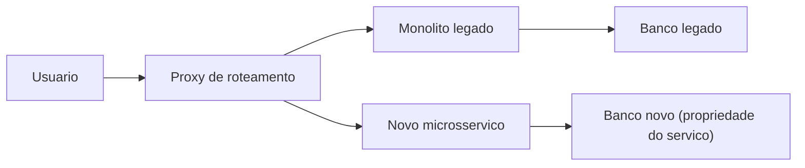
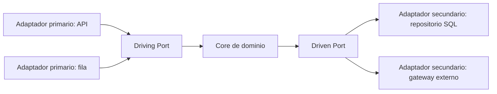
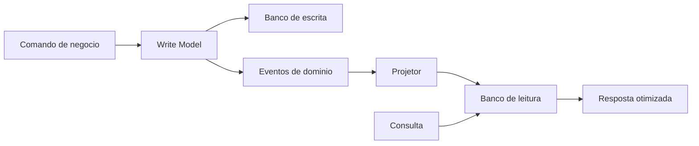
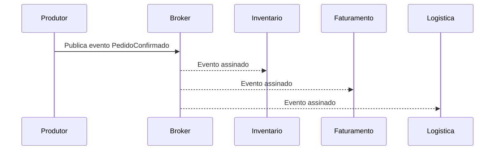
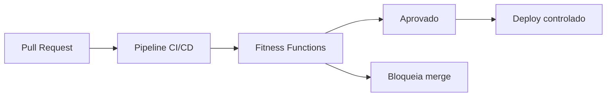

# **回復力のあるシステムの構築: イベント駆動型アーキテクチャと CQRS の背後にあるビジネス価値**

## **戦略的近代化の必須事項**

現代のデジタル シナリオでは、ソフトウェア アーキテクチャの機敏性は単なる技術効率を超えて、主要な競争上の差別化要因としての地位を確立し、ビジネス存続のための必須事項となっています。あらゆる業界の組織は、革新し、不安定な市場の需要に適応し、リアルタイムのユーザー エクスペリエンスを提供するという容赦ないプレッシャーに直面しています。ただし、この加速は、レガシー インフラストラクチャの現実と激しく衝突します。数十年前に構築されたシステムは、企業のアンカーのように動作します。柔軟性に欠け、維持費が危険なほど高くつき、多くの場合、最新の統合や拡張要件と互換性がありません。テクノロジー ディレクター (CTO) とテクニカル リード (テック リード) にとって、これらのシステムの管理は、パフォーマンスのボトルネック、実装サイクルの長期化、息詰まる技術的負債との日々の闘いとなります。

レガシー アプリケーションの最新化は、もはや純粋な運用コスト センターとは見なされず、戦略的価値の解放として理解されます。ユーザー インターフェイス、ビジネス ロジック、およびデータ アクセス層が本質的に結合され、単一のプロセスで実行されるモノリシック システムでは、スケーリングが必要な場合に厳しい制限が生じます。密結合により、単一の機能がより多くのコンピューティング能力を必要とする場合、アプリケーション全体をレプリケートする必要があり、その結果、クラウド リソースが慢性的に浪費されます。最も重要なのは、モノリシック アーキテクチャが障害の「爆発範囲」を拡大することです。レポート モジュールのエラーによりサーバーのメモリが使い果たされ、重要な支払い処理システムがダウンする可能性があります。

イベント駆動型アーキテクチャ (EDA)、コマンドとクエリの責任分離 (CQRS)、ヘキサゴナル アーキテクチャ (ポートとアダプタ) に特に重点を置いた、リアクティブ、モジュール型、進化型アーキテクチャへの移行は、これらのアーキテクチャ上の病状に対する全身的な治療法を提案します。しかし、この旅には、コードの記述だけでなく、組織がソフトウェア エンジニアリングを経済的資産として見る方法や、チームと運用プロセスを構築する方法にも大きなパラダイム シフトが必要です。

## **近代化の経済学: 技術的負債と投資収益率 (ROI) の測定**

結晶化されたアーキテクチャから複雑な分散モデルへの移行を正当化するには、技術リーダーが説得力のある財務言語でメリットを明確に説明する必要があります。技術的負債は抽象的なエンジニアリング概念として扱うべきではなく、コード品質の低下、システム障害、開発速度の低下、チームの燃え尽き症候群によって「利子」が発生する、組織の貸借対照表上の実際の財務上の負債として定量化されるべきです。

近代化への取り組みにおける投資収益率 (ROI) を評価するには、現状の法医学的分析が必要です。 20 年前に開発されたエンタープライズ リソース プランニング (ERP) システムを運用している企業の一般的なシナリオを考えてみましょう。このシステムに関連する年間コストは、古くなったソフトウェアを維持するための法外なベンダー サポート料金、計画外のダウンタイムに伴う機会費用、理解できないコード ベースに苦戦しているエンジニアの生産性の大幅な損失など、多くの場合数十万ドルを超えます。

モダナイゼーションの影響を定量化する際、組織は変革をもたらす財務指標を目にすることがよくあります。近代化戦略を導入した医療機関は、3 年間で 206% の ROI を達成し、回収期間は 6 か月未満でした。これらの結果は、IT 運用チームの生産性が 30% 向上したことによって可能になりました。リスクの軽減は、莫大な経済的利益にもつながります。調査によると、自動処理によってセキュリティ侵害のリスクが 50% 削減され、規制遵守コストが削減されることが示されています。

### **速度指標と評価範囲**

近代化の最も重要な影響は、開発速度の指数関数的な増加に現れます。組織では、明確に定義されたマイクロサービスに基づいてアーキテクチャを統合した後、新機能の配信速度が 2 倍または 3 倍になることがよくあります。これにより、同じエンジニア数で桁違いに多くの商業的価値を提供できるようになり、*市場投入までの時間*が大幅に短縮されます。競合他社がイベント駆動型のアーキテクチャにより新機能を 2 週間でリリースできる一方で、あなたの組織は脆弱なモノリスを変更するのに 3 か月かかる場合、モダナイゼーションのメリットはコスト削減をはるかに上回り、市場でのポジショニングと収益に直接影響を与えます。

ただし、この ROI を明確にするには、計測上の厳密さが必要です。変革プロジェクトの主な欠陥は、近代化を開始する前に把握された厳密なベースラインが存在しないことです。リーダーは、導入の頻度、変更の *リードタイム*、平均復旧時間 (MTTR)、欠陥率、最新化前の少なくとも 3 か月間の詳細なインフラストラクチャ コストを文書化する必要があります。

|近代化フェーズ |コストダイナミクス | ROI への影響 (期間 3 ～ 5 年) |
| :---- | :---- | :---- |
| **年: 移行** |最も高い。リエンジニアリング作業とインフラストラクチャのコストを並行して行う (レガシー \+ 新しいシステム)。 |ネガティブ。資本集約的な投資。 |
| **年: 最適化** |平均。インスタンスのサイズ変更とレガシーの段階的廃止。 |とんとん。速度と回復力の向上が移行コストを上回り始めます。 |
| **3 年目から: 定常状態** |低い。純粋な使用量ベースのインフラストラクチャ (*従量課金制*) と高度な自動化。 |大きな利益 (200% ～ 304%)。総合的な機敏性。 |

インフラストラクチャの決定とクラウド プラットフォームの変更の経済的評価は、12 か月の期間に基づいて行うべきではありません。短期的には、並列処理のコストにより、移行は不可能に思えます。しかし、3 年目から 5 年目のコストを予測すると、財務上の転換点が明らかになり、近代化が長期的に最も絶対的な価値を持つ技術投資であることがわかります。

## **分解戦略: 中断することなくモノリスを分解する**

移行が決定され、データ主導のビジネス ケースを通じて予算が確保されたら、主な技術的課題は、現在の運用を中断することなく置き換えを実行することです。システム全体を密室で書き換え、週末のメンテナンス時間帯にすべてのトラフィックを切り替えることを規定する「ビッグバン」アプローチは、業界で最もリスクと障害率が高い戦略として広く認識されています。

このリスクを軽減するには、*ゼロ ダウンタイム* の可用性を交渉の余地のない制約として扱う増分移行標準を厳密に採用する必要があります。

**図: Strangler Fig による増分分解**


### **ストラングラー フィグ パターンとドメイン駆動設計 (DDD)**

レガシー システムを安全に調整するための決定的な方法論は、*Strangler Fig* パターンです。この戦略は、古いシステムの周辺で新しいマイクロサービスを開発することを提案します。ルーティング層 (プロキシ) は、すべての受信リクエストをインターセプトします。要求された機能がすでに移行されている場合、要求は新しいマイクロサービスに送信されます。それ以外の場合は、モノリスに戻されます。

このパターンを実行するには、モノリス上での新規開発を停止 (機能の凍結) する必要があり、新しいビジネス機能は新しいアーキテクチャ上に構築する必要があります。次に、*ドメイン駆動設計* (DDD) の原則に基づいて抽出候補を特定します。 DDD では、マイクロサービスは技術レイヤー (データベース用に 1 つのサービス、UI 用に 1 つ、ビジネス ルール用に 1 つのサービス) によって分割されるのではなく、「カタログ管理」や「支払い処理」などの具体的なビジネス機能を表す「境界付きコンテキスト」を中心に垂直にスライスされる必要があると規定しています。厳密な分離により、各コンテキストが独自の言語遍在性を定義し、そのライフサイクル全体にわたって自律性を持つことができます。

マイクロサービスを分解する際の DDD の絶対的な必須事項は、データの所有権を分散化することです。マイクロサービスは、スキーマに直接書き込むことができる唯一のコンポーネントであるデータベースの排他的所有権を持っている必要があります。すべてのサービスが共有のモノリシック リレーショナル データベースに接続し続けている間に、数十のサービスにわたってアプリケーション ロジックを抽出するという有害な慣行は、ネットワーク遅延という最悪の属性と、個別のコンポーネントを個別に拡張できないことを組み合わせた「分散モノリス」アンチパターンを生み出します。

### **重要なデータの移行とシャドウ トラフィック**

データベースのデカップリングは、そのプロセスにおいて最も困難な技術的課題となります。高いトランザクション性をサポートする重要な移行の場合、単純なオフライン コピーは許容できません。データベースがバージョン N (レガシー) とバージョン N+1 (新しい) の両方に同時にサービスを提供するには、高度なスキーマ進化戦略が必要です。

シャドウ テーブル移行メカニズムとトラフィック ミラーリングは非常に重要です。シャドウ トラフィック アプリケーションは、サーバーまたはデバイスを通じて実行できます。サーバー駆動のパラダイムでは、ルーティング サービスは受信した運用リクエストをサイレントに複製し、1 つのコピーを従来のインフラストラクチャに転送し、もう 1 つの同一のコピー (多くの場合、関連付けのための一意の識別子を含む) を新しい書き換えられたシステムに転送します。従来のサーバーはユーザーにサービスを提供しますが、新しいサービスによって生成された応答と副作用は記録され、従来の結果に対して非同期的に検証されます。この標準を使用すると、エンド ユーザーを危険にさらすことなく、正確な運用条件下で新しいドメイン ロジックを徹底的に検証できます。新しいサービスの最終的なカットオーバーは、状態とパフォーマンスの同等性が統計的に証明され、スキームが完全に同期された場合にのみ発生します。

*Leave-and-Layer* パターンは、この状況において優れた適用性を示します。従来のアプリケーションは引き続きスムーズに実行され、中断することなく顧客にサービスを提供します。シン イベント パブリッシング レイヤーがそれに接続され (多くの場合、データベース レベルで変更データ キャプチャ \- 変更データ キャプチャ (CDC) を使用します)、状態変更イベントを集中バス (AWS EventBridge など) に送信します。新しいビジネス ロジックと最新のサービスは、このバスをサブスクライブして更新を消費し、ソース システムの可用性に影響を与えることなく中央データベースと非同期的に統合します。

## **ドメイン ロジックの分離: ヘキサゴナル アーキテクチャの優位性 (ポートとアダプター)**

モノリスから抽出されたドメインを吸収するために新しいマイクロサービスが誕生するにつれて、内部劣化と戦うべき技術的負債の主なベクトルは技術的な結合です。従来、アプリケーション フレームワークがコード設計を推進していました。複雑なビジネス ロジックが HTTP Web コントローラーに致命的に「漏洩」したり、請求ルールがオブジェクト リレーショナル マッパー (ORM) エンティティ アノテーションに直接コーディングされたりしていました。この単純な階層化アーキテクチャ (ビジネス ロジックがデータベース層に直接依存する) の結果として、データベース ベンダーの変更や Web フレームワークの更新には、基本的なビジネス ルールを書き直す必要があります。

後に Alistair Cockburn によって Hexagonal Architecture と名付けられたポート & アダプター アーキテクチャは、技術的な耐性に対する構造的な答えとして現れました。その中心的な公準は破壊的なほど単純です。アプリケーションはシステムの中心的かつ独立した成果物でなければなりません。ランタイム デバイスやデータベース テクノロジを完全に分離して意識せずに、Web ユーザー、API 呼び出し、広範な自動テスト、またはバッチ スクリプトによって同等に制御できなければなりません。 「六角形」は 6 面の制限を反映していませんが、ソフトウェアが複数の任意の独立した入出力ポイントを持つことができることをトポロジー的に示しています。

**図: 六角形のアーキテクチャ (ポートとアダプター)**


### **抽象化の構造: ポート、プライマリおよびセカンダリ アダプター**

ヘキサゴナル アーキテクチャの中心原理は依存関係の反転であり、厳密に外部から内部に動作します。すべての外部技術層とインフラストラクチャ層は内部ビジネス層 (コア) にのみ依存する必要がありますが、コアは外部の詳細に決して依存してはなりません。この恐るべきカプセル化は、次の 2 つの重要な概念を確立することによって実現されます。

1. **ポート:** アプリケーションが外部の世界と対話する方法を定義するコントラクト (多くの場合、プログラミング言語の抽象インターフェイスとして実装されます) を表します。ビジネス ロジックは、消費者に依存しない方法で、これらのポートを介して何を受信または送信する必要があるかを正確に宣言します。ポートは、*駆動ポート* (アプリケーションが提供するユースケースを公開するインターフェイス) と *駆動ポート* (データの保存など、アプリケーションが外部から必要とするサービスを必要とするインターフェイス) に分かれています。  
2. **アダプター:** これらは、アプリケーションの外側のリングに存在する具体的なコンポーネントであり、特定のテクノロジー プロトコルのダーティ言語とドメインの純粋な言語の間のトランスレーターとして機能します。  
   * **プライマリ アダプタ (運転 / インバウンド):** これらは概念的な六角形の左側にあり、アプリケーションをアクティブ化します。 RESTful HTTP コントローラー、GraphQL ハンドラー、RabbitMQ キュー リスナー、または CLI インターフェイスがプライマリ アダプターです。彼らは技術的な刺激を受け取り、それを解き、*駆動ポート* (注入されたユースケース) を呼び出します。  
   * **セカンダリ アダプター (駆動 / アウトバウンド):** これらは右側にあり、外部で副作用を実行するためにアプリケーションによって制御されます。 ORM 経由の SQL 接続、サードパーティ API (ペイメント ゲートウェイなど) を呼び出すためのクライアント、または Kafka トピックのイベント パブリッシャー。ドメインは *Driven Port* (IRepositorioDePagamento など) を呼び出し、実行時に依存関係の挿入により、操作を実行する具体的なアダプター (AdaptadorDePagamentoStripe など) が提供されます。

### **分離とテスト容易性の計り知れないビジネス価値**

CTO にとって、このアーキテクチャの採用に伴うリスク軽減は、チームの初期学習曲線のコストを超えます。主な具体的な成果は、高忠実度の自動テスト カバレッジの大幅な加速にあります。

従来のアーキテクチャでは、購入処理ロジックのテストには実際のデータベースと Web サーバー ツリー全体のインスタンス化が必要であり、統合テストに時間がかかり (数分から数時間)、継続的インテグレーションと継続的デプロイメント (CI/CD) の実践の妨げとなります。 Hexagonal Architecture を使用すると、エンジニアリング チームはメモリ内のセカンダリ ポートから完全に分離されたシミュレーション (*モック* または *スタブ*) を作成できます。したがって、ドメイン ルールのすべての順列を含む何千もの複雑なビジネス シナリオを、実際のデータベース コンテナを初期化することなく、確定的な信頼性を持ってミリ秒以内にテストできます。

さらに、このアーキテクチャは、*ベンダー ロックイン* (クラウド プロバイダーによって課される技術的ロックイン) に対する最高の保護を提供します。取締役会の決定により、ライセンス上の理由から Apache Solr ベースの検索サービスの Elasticsearch への移行が義務付けられた場合、再エンジニアリングの作業は、既存の検索ポートを実装する新しい Elasticsearch セカンダリ アダプターの開発のみに限定されます。検索を調整し、結果を処理し、セキュリティ ルールを適用するビジネス ユース ケースの膨大な層は、完全かつ明らかに手つかずのままになり、プロジェクトの安全な実行が数か月から数週間に短縮されます。

## **読み取りおよび書き込みのボトルネックの解決: CQRS による分離**

ヘキサゴナル アーキテクチャはコードを技術的な結合から保護しますが、成熟したビジネス システムに固有のトランザクション設計により、データ ストレージに巨大なパフォーマンスのボトルネックが生じます。ユビキタスな CRUD (作成、読み取り、更新、削除) パターンは、基礎となるアクションがきめ細かい残高更新であるか、膨大な集計財務レポート クエリであるかに関係なく、ドメイン エンティティの同じ構造表現、つまり同じリレーショナル データベース モデルを操作します。

エンタープライズ ソフトウェアが拡大するにつれて、トランザクション要件 (書き込み) が視覚化要件 (読み取り) と激しく競合することが明らかになります。非対称スケーリングは、ソフトウェア業界における紛れもない現実です。現代のアプリケーションの圧倒的多数は、読み取り量が状態の変更 (書き込み) 量の数十倍または数百倍となるレートを処理します。単一モデル (単一データ ストア) でこれらの同時負荷を受けると、データベースはロックの競合、インデックスの競合、および応答性の壊滅的な低下に悩まされます。

CQRS 標準 (*コマンド クエリ責任分離*) はデータ モデルを意図的に分割し、システムの状態を変更するアーキテクチャ フローとクエリを実行するフローが絶対的に並行して存在し、個別に最適化される必要があると宣言しています。

**図: 予測を含む CQRS フロー**


説明 (TypeScript): 同じ使用例で、副作用なしで、突然変異の意図 (コマンド) と読み取りが分離されます。

```typescript
// Comando de escrita — valida invariantes e persiste no write model
type ConfirmarEmbarque = { pedidoId: string; sku: string };

async function handleConfirmarEmbarque(cmd: ConfirmarEmbarque): Promise<void> {
  // regras de domínio + emissão de eventos para projeções
}

// Consulta — apenas leitura do read model (desnormalizado)
type ResumoPedido = { pedidoId: string; status: string; total: number };

async function obterResumoPedido(pedidoId: string): Promise<ResumoPedido> {
  return readStore.buscarPorId(pedidoId); // sem JOINs pesados na hora
}
```
### **モデルの二分法: コマンドとクエリ**

CQRS を採用するには、厳密かつ意図的なトラフィック モデリングが必要です。

* **コマンド側 (書き込みモデル):** システムに保持されているデータを変更する操作を処理するように厳密に設計されています。技術フィールドに基づいた貧弱な更新 (例: UPDATE Status \= 2) の代わりに、コマンドは豊富なセマンティック ビジネス意図 (例: confirmProduct Shipping) をカプセル化します。書き込みモデルは、ドメインのルールと不変条件をしっかりと守ります。複雑なセキュリティ検証を統合し、純粋なトランザクション整合性 (ACID 保証) 向けに最適化されており、通常、更新異常を根絶するために高度に正規化されたデータを第 3 正規形 (3NF) で割り当てます。  
* **クエリ側 (読み取りモデル):** 対照的に、状態の変更は実行されません。その唯一の目的は、ドメイン ロジックの不要な断片を含めることなく、情報を非常に高速に取得し、ユーザー インターフェイスに合わせて適切にフォーマットすることです。読み取りモデルのデータベース最適化では、厳密に非正規化されたスキーマが優先され、多くの場合、クエリ実行中のコストのかかる集計や結合操作 (*JOIN*) を避けるために複雑なエンティティを「平坦化」します。

### **具体化された予測と絶え間ないパフォーマンス**

CQRS 標準によって提供される端末のスケーラビリティの利点は、モデルがコード内で論理的に分離されるだけでなく、別個のデータベースに物理的に分離されるときに実現されます。書き込みモデルは、厳格なアトミック性準拠に適した頑丈なリレーショナル データベース クラスター (PostgreSQL など) に常駐させることができ、読み取りモデルは、ハイパースケーラブルなドキュメント ベース (MongoDB など) またはテキスト検索用に最適化されたインデックス (Elasticsearch など) にすることができます。

この物理的な分離により、**プロジェクション マテリアライゼーション** を使用して、複雑なクエリの遅延を排除することが可能になります。 CQRS のないモノリシック システムでは、「統合顧客ダッシュボード」を構築するための要件として、ページが読み込まれるたびに過去の注文、請求ステータス、サポート チケット、返品に関連する数十のテーブルを結合 (*JOIN*) する複雑なリクエストが必要となり、訪問するたびに大量のディスク I/O 時間が消費され、購入しようとするユーザーに影響を与えます。

CQRS と予測では、面倒な計算が「オンデマンド」で実行されません。更新または個別の購入 (イベント) がバックグラウンドで発生すると、ルーチンがこれらの変更をリッスンし、イベントをダッシュ​​ボードのすでに処理されたフラグメントに繰り返し変換します。これらの事前計算された (具体化された) ドキュメントは、読み取りモデル内でサイレントに更新されます。ユーザーが実際にダッシュボードにアクセスすると、読み取りモデルは主キーの単純かつ低計算コストの検索を実行し、統合された結果を即座に取得し、マイクロ秒の応答時間で返します。書き込みモデルは純粋にトランザクション パフォーマンス (書き込みスループット) に重点を置き、読み取りモデルはいかなる状況でも書き込みに負担をかけません。

|特集 |モノリシック パターン (クラシック CRUD) |分離標準 (物理投影を使用した CQRS) |
| :---- | :---- | :---- |
| **データベース アーキテクチャ** |単一の高度に結合されたスキーム。 |さまざまな銀行。目的に合ったスキーム。 |
| **読み取り中のデータへのアクセス** |複雑な *JOIN* をオンザフライで実行します。 |事前に計算され、非正規化されたドキュメントを簡単に復元します。 |
| **インフラストラクチャの寸法** |コストのかかる垂直方向のスケーリングが必須。ボトルネックを区別することが不可能。 |非対称スケーリング (読み取りサーバー ファブリックのみの無限の水平スケーラビリティ)。 |
| **コードの複雑さ** |プレゼンテーション ロジックが巨大な ORM を介して更新ルールに漏洩します。 |残忍な別離。ビジネス目的に基づいた純粋なコマンドと、単純化されたリカバリ。 |

### **最終的な整合性のトレードオフ**

この洗練されたアーキテクチャを選択する CTO と技術リーダーは、基本的なトレードオフである **最終的な一貫性** を必ず理解し、管理する必要があります。ストリームの分離は、記録モデルに対して正常に行われた更新が、すべての場合において即座に視覚化レイヤーに伝播されるわけではないことを意味します。

コマンド データを非正規化クエリ データにレプリケーションすると、ミリ秒から数秒の範囲の遅延が発生します。その結果、ユーザー インターフェイスはトランザクションの変更を記録しますが、直後の読み取り時に遅延した記録を表示する可能性があります。この一時的な「消費者ラグ」には、楽観的な視覚的応答でリクエストを偽装したり、データが処理中であることを通知したり、短い間隔でリロードを強制したり (適応ポーリング) するなど、許容デバイスを採用するヒューマン インターフェイス (フロントエンド) の開発が必要です。非常に厳格な金融機関は、パラレル EDA アーキテクチャに補償メカニズムを組み込むことで、この遅延の壁を克服し、重要なミリ秒以内の正確な最終同期を保証します。物理的に分散されたシステムには即時同期は存在せず、CQRS は、高価な 2 フェーズ分散ロック スキーム (2 フェーズ コミット) を通じて非同期性を抑制するのではなく、固有の非同期性を受け入れます。

## **エンタープライズ ナーバス システム: イベント駆動型アーキテクチャ (EDA)**

大規模な CQRS モデルの比類のない有効性は、書き込み側と読み取り側の間の同期がどのように発生するかに本質的に依存します。同期依存関係のボトルネックを生じさせることなく、これらの独立したドメイン間での状態変化のシームレスな移行を可能にする重要なテクノロジは、イベント駆動型アーキテクチャ (EDA) です。

非イベント駆動型システムでは、Order Service が電子商取引のチェックアウトを処理するときに、Inventory Service (在庫を削減するため)、Billing Service (請求書を生成するため)、および Logistics Service (製品を出荷するため) への直接 HTTP 同期コマンドをトリガーします。この深いチェーン (RPC 呼び出し) がアプリケーションを致命的に縛り付けます。電子メール通知モジュールがダウンしている場合、購入トランザクション全体が失敗するか、最終消費者のプロセス全体が遅くなるリスクがあります。

EDA の出現により、根本的に切り離された非同期のパラダイムが確立されました。重要な変化を生成したアプリケーション (「プロデューサー」) は、行動する必要がある人 (「コンシューマー」) の存在を知りませんし、気にしません。このロジックは、リソースを生成し、発生に対する反応をリアルタイムで発表し、即座に解放することに基づいています。

**図: 生産者ブローカー消費者チェーン**


この文脈において、マイクロサービスは堅牢な仲介者 (メッセージ ブローカーまたはストリーム バックボーン) を利用します。多くの場合、Apache Kafka の高性能インフラストラクチャ エコシステム、AWS EventBridge などのマネージド ネイティブ ソリューション、または Apache Pulsar を介した堅牢なメッセージング ネットワークを通じて調整されます。プロデューサーは、TransacaoRealizada として、黙って事実 (「イベント」) をブローカーに預けます。消費者はチャネルに登録し、独自の処理時間内で独立してアクションを実行します。

### **伝播カテゴリ: 通知からイベント ソーシングまで**

アーキテクチャの複雑さと目的により、イベント ファブリック内の 3 つの重要なサブパターンが推進されます。

1. **イベント通知:** 最も基本的なシグナル。ユーザー管理マイクロサービスは、節約的なイベントを UserDeleted(ID=990) としてブロードキャストします。この信号はリスナーに警告するためだけに機能します。状況に応じた監査のための詳細な情報が必要な場合は、新しい独立したリクエストを送信する必要があります。このメカニズムはシンプルで帯域幅が狭いですが、非同期サービスを元のソースでの同期レスキュー呼び出しに強制的にフォールバックさせるというコストがかかり、望ましくない総遅延が発生します。  
2. **イベント伝送状態転送 \- ECST):** このモデルは独立性を大幅に向上させます。イベント フローは、事実の発生をカプセル化するだけでなく、新しい現実を記述するすべての不変属性も完全に保持します。 Orderconfirmed イベントは、ID キーだけでなく、カート内のすべてのアイテムの詳細、請求総額、支払い方法、消費者の最終住所にもリンクしています。 CRM システム、配信または請求プラットフォームは、これらの超高密度構造を消費し、プライベート ローカル データベースに即座にデータを追加します。冗長なバックツーコア トラフィック (発信元ドメインからの詳細情報のその後の検索) がほぼ完全に軽減され、コンシューマに完全な回復力が与えられます。発信元のモノリスで停電が発生した場合でも、コンシューマはアクティブ コピーに基づいて機能し続けます。

ECST の *ペイロード* の最小例 (ブローカーでは、コントラクトは通常、Avro または JSON スキーマでバージョン管理されます):

```json
{
  "type": "PedidoConfirmado",
  "version": 1,
  "pedidoId": "ped-8831",
  "itens": [{ "sku": "SKU-1", "qtd": 2, "precoUnitario": 49.9 }],
  "total": 99.8,
  "metodoPagamento": "pix",
  "enderecoEntrega": { "cep": "01310-100", "cidade": "São Paulo" }
}
```
3. **イベント ソーシング:** この技術は、データベース層の技術的基盤を再定義します。最終状態は記録されませんが、個々の遷移は記録されます。各エンティティは、生涯にわたる変更のデルタの慢性的で不変のシーケンスによってのみ表され、追加可能なストレージ (*追加専用ログ*) 向けのインデックス付きファイルに保存されます。ソフトウェアが口座保有者の口座で利用可能な金額を再構成する必要がある場合、最初の開設から必要な時点まで、その銀行集合体 ID に対して記録された出金と入金の個々の履歴を、継続的かつ不変の複製 (リプレイ) を通じてイベントごとに適用することにより、決定論的な方法で計算します。  
   イベント ソーシングを CQRS と組み合わせて採用すると、時代を超越した災害復旧が可能になり、金融業界では本質的に侵入不可能な監査証跡が確保されます。銀行の大規模な基盤は、不要な改ざんに対する永続的な機能を提供するために、EventStoreDB や Kafka 対数インフラストラクチャなどの専用ツールに依存しています。この決定論的レプリケーションの破壊力には、アーキテクチャの複雑さによる圧倒的なコストが伴います (極端な学習曲線、ストレージの大規模かつ永続的な使用、数百万のレコードを含む履歴の再計算を妨げる定期的な「スナップショット」ルーチンの必要性)。

### **固有の回復力と弾力性によりシステム障害を軽減**

イベント メッシュ (EDA) に対する CTO によるビジネスへの影響と議論の余地のない支持を理解するために、重要な利点は、クラウド環境でのボトルネック ストームの分離に焦点を当てています。ブラック フライデーのような企業にとって重要な瞬間に、異常なトラフィックの急増が発生したときに深刻な依存関係を切り離すことで、膨大な量の予期せぬ超過需要 (すぐにカートがあふれる) がイベント ブローカー リポジトリまたはキュー システムにバッファリングされ、突然クラッシュすることなくディスクの満杯に耐えることができます。

Shopify は、1 ミリ秒あたり約 6,600 万件の集約メッセージを処理する Kafka トピック バックボーンによって処理される目まぐるしいトラフィックを記録し、非常に柔軟な安定性を実現し、継続的なモジュール反応を可能にします。 AWS コンピューティング能力の絶望的なグローバル垂直追加を強制する従来の固定パターン (請求額を極端に因数分解し、機敏な需要に反応しない) とは異なり、イベント駆動型の非同期性に焦点を当てた構造は、残忍なスパイクをそらして、継続的に待機するブローカーの安全なメッシュ内で休ませます。

遅延により周辺システムと支払いの依存関係が利用できない場合でも、レコードや元のプライマリ ジャーニー フローは破損せず、自動復元時に各要素が再アクティブ化されて積極的に継続を求め、チェックアウト トランザクション購入時に顧客の慢性的なカスケードやエラー (致命的なタイムアウト) を含む画面が節約されます。

### **EDA における運用上のダークサイドとガバナンスの課題**

しかし、どのパラダイムにも、上級技術リーダーが軽減すべき隠れた負担がないわけではありません。厳密にイベント駆動型のシステムは、インフラストラクチャ レベルの依存関係の解放を促進する一方で、概念的に重大な落とし穴を課します。

* **コンシューマ ラグと制限された可観測性:** アプリケーションがダウンストリーム パーティションが吸収できる制限 (スループット) を過度に超えるイベントを発行すると、保持キューを空にするレイテンシが積み重なり (コンシューマ ラグ バックログ)、実際にはスロットリングされ、伝播されたリアルタイム性が無効になります。独立したオーケストレーションを扱うと、広範な障害を追跡することが大幅に困難になります。非同期エラーは、数十のマイクロサービスにわたる長いチェーンのどこに存在するのでしょうか?パーティションの動作とすべてのブローカーの一時的な動作健全性の詳細な観察にリンクされた、フロントレイヤーでの発行から DataDog、CloudWatch、New Relic (分散トレース計測) を介して渡される厳密な識別子を使用した、絶対的でコストのかかる追跡手法をシステムの大量移行に組み込むことが必須です。  
* **配信の重複によるシステム的な脅威 (厳密に 1 回 x 少なくとも 1 回のセマンティクス):** 日常的な接続で障害が発生すると、エコシステムは常に、実際に入力された同じ信号を、空白で信号を失った加入者に自動再送信をトリガーします (「少なくとも 1 回のセマンティクス」)。不適切なエンジニアリングによって気付かれずにメッセージを複数回実行すると、望まない二重払い戻しをベースで処理するなど、取り返しのつかないビジネス上の大惨事が発生する可能性があります。特異な事実自体の継続的な連続的因果的再処理が、最初の発生イベント後の運命の状態に隣接するシステムの破損を決して明らかにしないことを保護するために、層内で *冪等* の普遍的なロジックを使用してシステムをエンコードすることは必須の教訓です。

再配信に対する一般的な防御 (*少なくとも 1 回*): 不可逆的な副作用を適用する前にイベント識別子を記録します。

```typescript
async function processarReembolso(
  eventoId: string,
  payload: ReembolsoPayload
): Promise<void> {
  if (await jaProcessado(eventoId)) return;
  await aplicarCredito(payload);
  await marcarProcessado(eventoId);
}
```
* **厳密なガバナンスとスキーマの破壊:** 制限的な直接更新 (依存関係を破壊する API) と同様に、不変のバス トピックの名前を無謀に変更したり、必須属性を削除したりすると、古い特定のフィールド レイアウトの受信に密接に関連付けられたサブエコシステムが不可逆的に破壊されます。隔離されたリポジトリでの自動強制制御 (スキーマ レジストリ検証) によって設計された厳格なガバナンスにより、制御された更新を保証する厳格な契約が課され、インフラストラクチャ内の標準化された形式でグローバルに文書化され、ユニバーサルな遡及移行 (下位互換性ポリシー) に準拠したバージョンであるかどうかが検証されます。

## **忠実性の確保: 進化したアーキテクチャとフィットネス機能**

Hexagonal Architecture で厳密に定義されたポートに基づくドメインによって駆動される非同期分散構造の設計が、エコシステムの誕生における卓越性を決定します。しかし、エコシステムは激しく老化し、構築されたアーキテクチャは、技術力の激しい回転の継続的な動きとの混沌とし​​た結合に劣化し、規定された俊敏性の範囲内で新しいイノベーション能力を即座に投入するという市場の圧力が加わります。

規律を維持するには、間違いなく、人的ミスによる継続的な手作業による摩擦を発生させずに評価を保証する、構造化されたメカニズムを採用する必要があります。この自動緩和の基本方法論は、業界によって正式に **進化的アーキテクチャ** と名付けられたガイドラインを通じて対応しており、複数の必須の非機能マトリックス (スケーラビリティ、セキュリティ、信頼性) で同時に制御される継続的な進化的変化をサポートおよびガイドする自然な耐性を持つシステムの構築に重点を置いています。

ガバナンスやプロセスに障害や停滞を生じさせることなく、このシステムの柔軟性を安全策でしっかりと固定するために、CTO は、テストのみに基づいた開発実践 (テスト駆動開発 \- TDD) の成功を強く反映した **アーキテクチャ フィットネス機能** エンジニアリングを採用します。チームが完全なソフトウェアを構築する前にロジックと出力を検証する最小限の境界付きブロックを作成するのと同じように、*フィットネス関数* はハードコーディングされたルールで構成され、継続的に呼び出すことで必要な構造境界ルールに即時に具体的な整合性が与えられ、標準化に不可欠な制約の調整を検証し、逸脱をブロックします。

**図: アーキテクチャ ガバナンス パイプライン**


### **ArchUnit と六角形の境界線の効果的な監視**

Hexagon を介した DDD の制限のみに焦点を当てたシステムは、エッジでの装甲分離が必要であり、外部から内部に漏れる循環依存性によって基本原理が静かに破壊されます。 Java と TypeScript で開発された堅牢な市場エコシステムによって採用された企業規模のベースでは、アーキテクチャの汚染の抑制は、外部介入やチームの意見なしでコンパイル時に構造構文、深いリポジトリ間の循環依存関係を分析する強力な評価ライブラリの明示的な検証とチームの意見を組み合わせることで、自動統合のあからさまなブロックとして現れます。つまり、**ArchUnit** ツールの重要な採用です。

Java の *フィットネス関数* の例 (ドメイン パッケージが Spring または JPA に依存し始めるとビルドに失敗するルール):

```java
import com.tngtech.archunit.junit.AnalyzeClasses;
import com.tngtech.archunit.junit.ArchTest;
import com.tngtech.archunit.lang.ArchRule;

import static com.tngtech.archunit.lang.syntax.ArchRuleDefinition.noClasses;

@AnalyzeClasses(packages = "com.empresa")
class FronteiraHexagonalTest {

  @ArchTest
  static final ArchRule dominio_isolado =
      noClasses()
          .that().resideInAPackage("..domain..")
          .should().dependOnClassesThat()
          .resideInAnyPackage("org.springframework..", "jakarta.persistence..");
}
```
1. **単一および複数の戻りドアの哲学 (一方通行ドアと双方向ドア):**  
   Amazon の効率的なネイティブプラクティスに基づいた運用指示ロジックによって考案されたこのマトリックスは、技術的移行において定義を必要とするすべての体系的な実装を分類し、それらのリターンをカテゴリー的に分離しようとします。  
   * **断定的一方向決定 (一方通行ドア):** 非常に重く、非常に高いコストがかかり、危険であり、友好的な安全な退却の可能性のない、組織基盤を厳しく根付いた本質的な結びつきに永久に結びつける選択。大規模な投資を行ってプライマリ ベース全体を変更し、ネイティブ イベント ソーシングの証跡ログによる制限的な処理のみに焦点を当ててエコシステムの移行を強制し、汎用の純粋な SQL ベースを切り離すには、絶対的に膨大な時間の投資、集中的な移行、チームの完全な企業の抜本的な認知変化、または基盤となるクラウド インフラストラクチャの選択が必要です。逆転は、悲惨な圧力と規制上の罰則の下で、億万長者を放棄するか、数か月にわたる徹底的な書き換えを余儀なくさせます（重大なリスクバッファー）。非常に厳密で世界規模の詳細な分析が必要です。  
   * **柔軟な双方向の決定 (双方向のドア):** これらは、開発領域での摩擦が浅いアーキテクチャとテクノロジの一時的な検討であり、非常にクリーンで簡単な方法でローカルで非アクティブ化、試行、取り消し、または置き換えることが可能であり、保護されたビジネスの重要なロジック層に対する無視できるほどのコストと無害なリスクを伴います。純粋にローカルのプライマリ ポートに含まれるライブラリでの一時的な内部リリースや、アクセサリ システムでの小規模な導入は、草の根執行委員会の官僚的遅滞から解放され、即座の機敏性を制限のない継続的なイノベーションを推進する双方向の機敏な意思決定の例です。  
2. **意思決定後の運用セメンテーション (ADR に登録されたアーキテクチャ):** CQRS を介したレガシーのモダナイゼーションにおける構造進化または重要なモジュールのクリティカルなスライスの方向を決定する一方通行ドアの評価側面を理解すると、CTO の本当の緩和は、将来のチーム自体の慢性的な不安定な入れ替わりによって生成される摩擦に基づいており、プロジェクトのレガシーに疑問を呈し、組織的な作業の一定のリズムを中断します。訴訟は無駄（再訴訟の選択）。効果的な上級エンジニアリング組織に必要な主な成果物は、ソース コードにリンクされ、その時点で有効な技術設計に基づいたコンテキスト上の正当性を不変に保つベース コントロール自体に厳密に含まれる、追跡可能な記録の要約と体系的な作成です。開発環境では *アーキテクチャ決定レコード (ADR)* として知られています。 7 つのクリーンなセクションの下に普遍的に配置されたアジャイル マークダウン ドキュメントでは、外科的かつ満場一致の方法で境界が定められています。 重要な動機 (プライマリ インターフェイスの売上急増に関連する BI クエリで飽和したモノリスのモジュール内のロックの危険な封じ込めを軽減するための CQRS 選択の基本コンテキスト)、受け入れられた戦略 (Mongo/PostgreSQL 物理クラスターでの分離)、結果と不条理合意された負担プロジェクト（クライアントベースのディレクターに供給するために、最終的に問題となる一貫性を管理する複雑さの採用）、および報告書で正式に拒否された競合ソリューションモデルと、この一時的な放棄の背後にある理由。  
3. **災害予防民主主義 (EA/ARB ガバナンス委員会および RACI マトリックス):** ガバナンスにより、統合アーキテクチャのリーダーシップとディレクターは、委任における普遍的な分離と透明性のある責任を使用して、過度の閉鎖時に本社の危険な構造的障害を制限し、広範な意思決定アーキテクチャ指向の「RACI」エグゼクティブ マトリックスにおける割り当ての古典的な使用を通じて当事者間のグローバル実装の所有者を厳密に制限します。リスクポートへの移行（分離された責任と最終責任の提供者「責任者」、開発者「責任者」、拠点評議会のコンサルタントのマイクロボードへの縮小「協議済み」、一方通行ドアで管理上の必要性なしに広がる拒否権の致命的麻痺の分析をブロックする。そして、組織基盤への広範な変更における取締役会の受動的な観察者への膨大な情報レイヤー通知「通知済み」）。絶対的な規模の戦略的方向性と併せて、

規制対象企業の非技術分野との大規模な統合を必要とする大規模なベース プラットフォームへの重要な最新化（大規模なトランザクションの最新化における銀行とヘルスケアのマルチチャネル複合施設）を推進するために、ガイドライン進化基準に関する審査委員会（アーキテクチャ審査委員会 \- ARB）の執行委員会および多様な委員会が設置され、基本的にすべての深いレガシー移行が組織の直接の執行フォーラムで構造化された検証を受けることを保証し、企業の重要な目的と体系的に一致しています。継続的な価値の還元を保護し、アーキテクチャを保護するためですが、チームやチームにコード化された継続的で目に見えないフィットネス機能を介して、純粋に実用的な採用により、厳格なハイパーガバナンスから積極的に自由になることを意識しています。

組織のネイティブ CI/CD 定常展開チェーンの中央パイプラインに挿入されたこれらの執拗なスイートを通じて、リーダーと上級エンジニアは、構造的に「ドメイン」と呼ばれるパッケージ フォルダー内にのみ存在するクラスが内部でネイティブ ロジック、つまり、基本的な企業 Spring Framework 企業プラットフォームからのいわゆる制限的な直接抽象 Web を参照できないことを表現するプログラムによる最終的なテストを確立します。 PR (プル リクエスト) の未熟な分離レビュー上のクリーン ドメイン領域内でのデータベース エンジンの結合または Web 接続の設計に対する不当な依存がわずかでも微妙にインポートされると、コードは基礎となるアーキテクチャ原則に積極的に違反し、ArchUnit の *フィットネス機能* スイートが即座にグローバルで失敗し、保護された企業コア コードに望ましくないマージが行われる可能性もなく、承認を求めるクラウドのプライマリ リポジトリへの送信を容赦なくブロックします。自動化されたメトリクス ロックが追加され、システムの機能の進化を破壊する交差した循環結合の拒否を課したり、しきい値 (循環的複雑さメトリクス) で内部的に事前に定義された著しくアンバランスな認知的複雑性にもかかわらず機能を過度に拡大するクラスを停止したりできます。

### **進化する横断的ガバナンス**

静的結合ツールを介したコード内の基礎の明示的な制限に加えて、動的メッシュ動作のライブ観察可能な表現 (動的/実行時フィットネス機能) のみを目的としたシステムによる包括的な継続監視も積極的に実装されています。 Datadog にリンクされた AWS メッシュの観測メッシュ内に厳格なトリガーが設定されており、マイクロ アプリケーション間のイベントの遅い連鎖反応が予想される応答時間ベンチマークを超えるか、会社の制限付きイベント ループ ブローカーで規定されている許容遅延を超えた場合に積極的に介入するため、アクティブなアーキテクチャでの短期または中期の適応を尊重できないリエンジニアリングやプログレッシブ デプロイメントによって引き起こされる危険で慢性的な段階的な損失 (回帰パフォーマンス アラート) が無効になります。複雑なエコロジー ビーコンであっても、組織の非機能要件 (NFR) に統合された *ecoCode* 統合サステナビリティ ゲージを通じて、データセンターでの動的な処理における運用上の二酸化炭素排出量を評価する厳しい要件に基づいて、クラウド内のボトルネックを体系的に監視します。

## **経営者の意思決定とガバナンスの構造化フレームワーク (CTO リーダーシップ)**

この技術調査でカバーされる移行の基礎とエンジニアリングに焦点を当てたすべての緻密な柱は、利益を引き出し、現実に構造化されリソースが限られている企業での採用を脅かす直感に反する罠を回避するために、全体的な実用的な管理層との統合を必要とします。技術的な評価は常に経済の複雑さの世界を横断しており、技術的な経営幹部 (CTO および上級技術責任者) は必然的に優先順位を系統的に分類し、リスクのある影響を軽減し、経路を評価し、組織内の予期せぬ政治的障害やコストのかかる運用の逆転を排除するための文書化とコミットメントを形式化するためのメカニズムを形成します (拒否権文化ガバナンス戦略)。

これらのガイドラインを変換する基礎は、この分野で運用されている最も危険な世界的システムで採用されている統合された方法論とマイルストーンに基づいており、分類の根拠は次のとおりです。

ポートとアダプターのモジュラー相乗原理を通じて、無制限のスケーラブルな基盤を備えた現代の組織の永続的な回復力を形成するリーダーにとって、EDA の非同期メッシュのリアクティブ システムの重要なパルスに反映される CQRS の分析標準でサポートされる極度の技術的複雑さは、単純なスケーラビリティの制限を軽減するための個別の方法論を形成するものではありません。時代遅れのレガシー基地における非効率の遺産に結晶化したすべての運用上の制限と負債を、競争力があり、自律的で、モジュール式で、事後対応型で不滅の知的資本に決定的に変換し、ダイナミックな世界市場における容赦ないスカラーで永続的な課題に取り組むために、必須の統合戦術兵器を形成する。

---

## このシナリオをあなたのコンテキストで評価しますか?

これらのガイドラインを実行可能な技術計画に変換したい場合は、Web-Engenharia にご相談ください。当社はお客様の環境の技術的評価を実施し、優先順位、リスク、実装ロードマップを含む専門的なコンサルティングを設計します。)