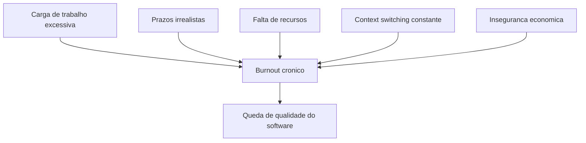
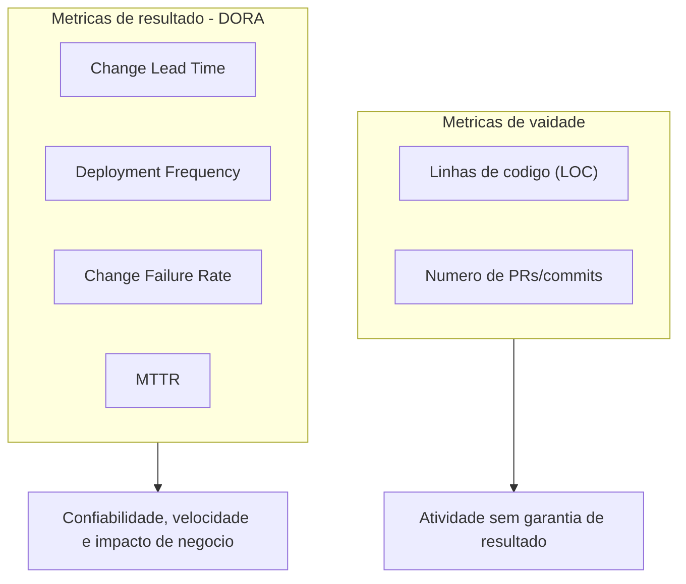
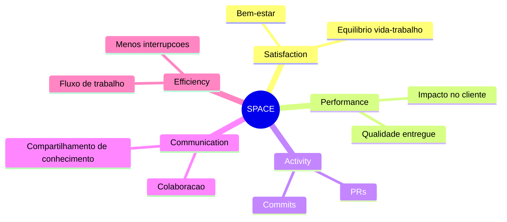
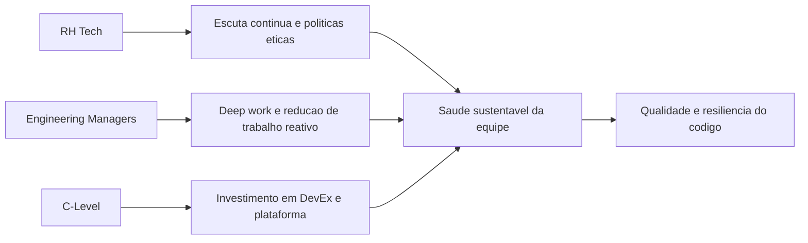

# **目に見えない指標: 開発者の健康と幸福がコードの品質に与える影響**

現代のソフトウェア エンジニアリングは、深い構造的パラドックスに基づいています。技術インフラストラクチャは、スケーラビリティ、復元力、高可用性を実現するために大規模な冗長性を持って設計されていますが、それを構築し維持する人的インフラストラクチャは、システム障害の点にまで追いやられることがよくあります。歴史的に、テクノロジー業界とベンチャー キャピタルは、配信速度、コード量、サーバーの稼働時間に重点を置き、純粋に機械的な生産指標を通じてエンジニアリングの成功を評価してきました。しかし、ソフトウェア開発ライフ サイクル (SDLC) の厳密な実証分析により、コード ベースの品質、アーキテクチャのセキュリティ、アプリケーションの安定性が、企業のダッシュボードには表示されないことが多い指標、つまり開発者のメンタルヘルス、心理的健康状態、認知負荷と臍帯で結びついていることが明らかになりました。

ソフトウェア開発は本質的に社会技術的で高度に知的な活動であり、長期間にわたる深い集中状態、創造的な問題解決、新しい言語、フレームワーク、運用パラダイムへの絶え間ない適応が必要です。これらの作業を行う専門家が慢性的なストレス下で作業を行うと、認知能力が目に見えるほど低下します。この低下は仕事への不満として現れるだけではありません。それは、アーキテクチャの論理的欠陥、欠陥密度の指数関数的増加、実稼働システムへの重大な脆弱性の導入に直接変換されます。このレポートは、プロアクティブな技術チームの健全性モニタリング、構造的燃え尽き症候群の軽減、およびソフトウェアの品質保証の間の交差点を包括的に分析し、エンジニアリング リーダー、テクノロジー中心の人事マネージャー (HR Tech)、およびスタートアップの創業者にデータ駆動型の戦略的フレームワークを提供します。

## **技術枯渇のパノラマ: 体系的かつ定量化可能な危機**

ソフトウェア エンジニアリングの従業員の現状は、容赦ないスプリント サイクル、デジタルの過負荷、ツールの急増、深刻なマクロ経済の変化によって引き起こされた、組織的な燃え尽き症候群の危機を示しています。最近の研究は、世界のテクノロジー業界における福利の悪化に関する憂慮すべき状況を明らかにし、燃え尽き症候群が一時的な流行語ではなく、職業上の伝染病であることを証明しています。 2024年と2025年に予想される業界全体の調査では、テクノロジー労働者の68％が燃え尽き症候群の急性症状を経験していると報告しており、わずか3年前に記録された49％から大幅に増加していることが明らかになった。

**図: バーンアウトの構造ベクトル**


特定の市場や開発者のみを対象とした調査では、状況はさらに危機的になります。ヨーロッパの情報技術専門家のほぼ 4 分の 3 (73%) が、継続的な仕事関連のストレスや燃え尽き症候群を経験していると報告しました。エンジニアリング分析プラットフォームに焦点を当てた他の独立した調査では、プログラマーの燃え尽き症候群率が恐ろしい 83% に達していることが示されています。これらのデータは、疲労が一時的な異常ではなく、デフォルトの動作状態になっていることを示しています。

|枯渇指標 |報告された割合 |研究背景と寄与要因 |
| :---- | :---- | :---- |
| **燃え尽き症候群の症状 (一般)** | 68% | 3 年前の 49% と比較して増加。デジタルの過負荷とイノベーションのスピードによって推進されています。 |
| **ストレス/燃え尽き症候群 (ヨーロッパ)** | 73% | 61% が重いワークロードが原因であると考えています。締め切りが厳しい場合は 44%。 43% はリソース不足によるものです。 |
| **テクノロジー業界での燃え尽き症候群のリスク** |.1% |差し迫った燃え尽き症候群の「リスクが高い」と分類された労働者。 |
| **開発者の燃え尽き症候群** | 83% |自主性と目的の欠如に焦点を当てた、開発者分析プラットフォームの調査で報告されています。 |

*表: テクノロジー業界における専門的燃え尽き症候群の統計概要 (2024 ～ 2025 年)。*

この燃え尽き症候群の原因は多面的であり、単に長時間労働をしすぎるということにとどまりません。バーンアウトは、直線的な生産性に対する非現実的な期待、過度に複雑またはモノリシックなシステム アーキテクチャ、およびコード変更を地雷原にする山ほどのレガシーな技術的負債によって引き起こされます。専門家の 60% 以上が、職場でのストレスの原因が過度のタスク負荷であると考えており、非現実的に厳しい納期や慢性的なリソース不足などの構造的要因が従業員の 40% 以上に影響を与えています。 24時間勤務の文化は、リモートワークポリシーが不十分に構築されているために悪化し、仕事と私生活の境界線を著しく曖昧にしています。圧倒的多数の開発者は、従来の勤務時間外にコーディングを行ったり、ソフトウェア アーキテクチャの問題を頭の中で解決し続けていると報告しています。

最新の研究で明らかになった特に憂慮すべき人口動態現象は、影響を受けた専門家のプロフィールの変化です。歴史的に、燃え尽き症候群は、急な学習曲線と早期納品のプレッシャーに適応するのに苦労している若手開発者と関連付けられることがよくありました。しかし、最近のデータによると、中堅の燃え尽き症候群が流行のレベルに達しており、上級開発者の満足度が若手開発者よりも大幅に低いと報告されています。これらの上級専門家は、コーディングの機械的な要求だけでなく、持続不可能な会議の増加、絶え間ないコンテキストの切り替え、構造化されていないメンタリングの責任、そして高圧とオンコールシフトの下で重要なシステムを稼働し続けることによる心理的負担によって疲弊しています。

エンジニアリングに固有のこのシナリオに加えて、マクロ経済の不安定による壊滅的な心理的影響があります。エンジニアリングのリーダーシップに焦点を当てたレポートによると、マネージャーと技術リーダーの 40% は、テクノロジー部門における人員削減の影響で、チームのモチベーションが大幅に低下していると見ています。雇用の不安は抽象的な懸念ではありません。それは慢性的な不安を引き起こし、複雑なプログラミングに必要な認知帯域幅を消費します。組織が安定性、十分なリソース、または経営陣の透明性を提供できない場合、内発的動機は完全に崩壊し、直属のマネージャーのスキルに関係なく有効性が損なわれます。したがって、燃え尽き症候群は個人の疲労を超えます。これは、認知的プレッシャーが個人やチームの対処能力をはるかに超えている、病的な労働環境を示す明確な指標です。

## **ソフトウェア開発の神経科学と重大なバグの発生**

福利厚生の低下が本番環境でのコードの安定性にどのように直接影響するかの正確な仕組みを理解するには、製造業のアナロジーを放棄し、厳密に神経認知的なレンズを通してプログラミング行為を調べる必要があります。抽象的なアーキテクチャの理解、データ フローの追跡、ソース コードの作成は、人間の脳のワーキング メモリから大量のリソースを必要とするタスクです。開発者の認知負荷がこの作業記憶の生理学的限界に近づくか超えると、複雑なシステムを理解して視覚化する能力が崩壊し、ソフトウェアの欠陥として現れる論理エラーを犯す可能性が飛躍的に高まります。

感情状態、過度の精神的負荷、重大なバグの侵入との間には消えない関連性があることが、脳波検査 (EEG) と機能的磁気共鳴画像法 (fMRI) を使用した最先端の実証研究によって実証されています。ヒューマンエラーの原因に関する認知分類法は、単なる技術スキルの欠如ではなく、物忘れ、注意力の低下、精神的過負荷がソフトウェアの脆弱性の真の媒介であるという多くの管理者の直観に反する考えを裏付けています。先駆的な研究では、感情がプログラミング タスクの品質に直接影響を与えることが実証されており、正面非対称指数はコーディング中のパフォーマンスと注意力を予測するための実行可能なバイオマーカーとして機能します。

EEGを使用して認知過負荷をマッピングした詳細な分析により、これらの仮説が確認されました。現代の神経科学研究は、実際のタスクを実行しながら開発者の脳をマッピングすることにより、ストレスの主観的な評価を超越しています。研究によると、ソフトウェア開発タスクには、高次の認知プロセスと複雑な問題解決に広く関連する脳領域である島皮質領域の激しい活動が必要です。神経学的バイオマーカー、特に前頭チャネルと中枢チャネル (F4、FC4、および C4) のヒョース パラメーターの活動と総パワーの体系的な分析により、燃え尽き症候群が測定可能な生理学的不全であることが明らかになりました。

神経科学とソフトウェア工学の間のこれらの交差点から得られた発見は鋭いものです。プログラマーが高い認知過負荷の下で作業している場合、またはコード行の作成またはレビュー中に注意力が散漫になっている場合、バグが導入されたり、セキュリティの脆弱性が気づかれない可能性が劇的に増加します。従来の静的解析メトリクスで測定されるように、問題のコードがすでに循環的複雑性を持っている場合、この問題はさらに深刻になります。したがって、コード品質の季節変動は意図的な無視の結果ではなく、むしろ慢性的なストレス、シナプス疲労、感情的疲労の条件下で動作する脳の避けられない副産物です。

情報を抽象的に処理する能力の低下に加えて、心理状態の悪化は、特に単体テストやコードレビューの重要な段階において、開発の方法論的なダイナミクスに深刻な影響を与えます。認知心理学では、「確証バイアス」の現象を、既存の仮説を反駁しようとするのではなく、既存の仮説を検証する情報を探し、解釈し、それに焦点を当てる本能的な傾向として説明します。テストを作成してプル リクエストをレビューするとき、理論的には、開発者は自分のコードを積極的に破壊して破壊しようとする必要があります。しかし、厳しい時間的プレッシャーと精神的ストレスの下では、確証バイアスは壊滅的に増幅されます。疲れ果てた開発者は、追跡するのに多大な認知的努力を必要とする複雑なエッジケースや微妙なアーキテクチャ上の欠陥を無視して、検証に対する最も抵抗の少ない道を模索します。このストレスによって引き起こされる認知機能不全の直接的かつ定量化可能な結果として、重大な欠陥が実稼働環境に波及し、ソフトウェア欠陥密度が増大し、システム停止のリスクが高まります。

**図: 運用環境におけるバグへの神経認知チェーン**


これらの障害の定量化は、多くの場合、欠陥密度メトリックを使用して実行されます。通常、確認された欠陥の数をソフトウェア モジュールのサイズで割ることによって計算され、多くの場合、数千のコード行 (KLOC) またはファンクション ポイントで測定されます。ソフトウェア プロジェクトでは、コードが 1,000 行書かれるごとに、平均して 15 ～ 50 個のバグが発生します。従業員が燃え尽きてしまうと、疲労がプロアクティブなレビューの実践を無効にし、欠陥密度率がこの平均の上限に近づく可能性があります。さらに、欠陥パターンの分析により、コードの特定の超複雑な領域にバグが集中する傾向があることが明らかになりました。これらの重要な領域をナビゲートするために必要な精神的鋭敏さがなければ、チームは絶え間ない中断に遭遇します。

ソフトウェア開発の社会的および協力的な側面も、圧力によって崩壊します。慢性的なストレスは、双方向のコラボレーションや専門的な共感を損ないます。高圧的で士気の低い環境では、健全な対人関係の力学に依存する経験的な品質保証の実践が急激に減少しています。ペアプログラミングは放棄され、毎日の会議（スタンドアップ）は空の機械的なレポートになり、サイロ化された不安な知識の蓄積が存在します。専門家は、乏しい精神エネルギーを守るために孤立する傾向があり、危険なコードのリファクタリングやアーキテクチャ上の懸念の提起に責任を負うことを躊躇します。このコミュニケーションの断絶は、ビジネス要件に関する小さな誤解が、ひっそりと致命的な遅延と長期にわたる重大な技術的負債に発展することを意味します。

## **従来のメトリクスの誤謬と DORA フレームワークの台頭**

ソフトウェア エンジニアリングにおける知的作業を定量化するという歴史的な探求には、長期的な品質に悪影響を与える逆説的な行動を奨励する還元主義的な指標が採用されてきた歴史があります。最も古典的であり、間違いなく最も欠陥のある指標であるコード行数 (LOC \- Lines of Code) は、バニティ指標であると広く考えられています。 LOC を無制限に使用すると、アルゴリズムの効率性と優雅さが損なわれます。品質とシステムの健全性を重視する開発者は、数千行のレガシーコードをリファクタリングして削除することで、複雑なアーキテクチャの問題を解決するかもしれませんが、疲れきった開発者は、生産性を示すためだけに数百行の脆弱で肥大化したソリューションを提供するかもしれません。同様に、プル リクエスト (PR) やコミットを数えることによってパフォーマンスを厳密に評価することは、ビジネス目標に向けた実際の進捗ではなく、アクティビティと動的動きを測定するだけです。これはワークフローに依存する指標であり、開発者が些細な成果物を断片化して数字を膨らませ、全体的な品質の低下を隠してしまう操作の影響を非常に受けやすくなっています。

総量とマイクロマネジメントへの焦点を克服するために、業界は DORA (DevOps Research and Assessment) メトリクスを大規模に採用しました。これは、開発実践を組織の成果に結び付けることで、ソフトウェア配信の有効性を評価する方法に革命をもたらしました。 DORA は行数カウントから離れ、次の 4 つの主軸に焦点を当てて、配信パイプラインの成熟度と運用パフォーマンス (ソフトウェア配信と運用 \- SDO) を検査します。

**図: 従来のメトリクスと DORA の比較**


1. **変更リードタイム:** コードのコミットから実稼働環境へのデプロイが成功するまでの経過時間。  
2. **展開頻度:** 組織がコードを実稼働環境に展開する頻度。  
3. **変更失敗率:** 即時の修復 (ホットフィックス、ロールバック) が必要な、運用環境での障害を引き起こした展開の割合。  
4. **平均復旧時間 (MTTR / 失敗した展開の復旧時間):** インシデントまたは障害が発生した場合にサービスを復元するのに必要な時間。

DORA の長期的調査により、ソフトウェア配信のパフォーマンスが組織の成功を直接予測し、収益性、市場シェア、顧客満足度に影響を与えることが決定的に証明されました。さらに、IT の高いパフォーマンスと従業員の心理的幸福およびロイヤルティの間には否定できない相関関係が確立されています。業績の高い組織（エリートおよびハイレベル）の専門家は、あなたの会社を素晴らしい職場として推奨する可能性が 2 倍高くなります（eNPS による測定）。

この研究では、チームをエリート、高、平均、低のパフォーマンス プロファイルに分類することで、認知時間の配分における重大で有益な違いが明らかになりました。燃え尽き症候群の蔓延を懸念する人事およびエンジニアリングのリーダーを対象とした DORA 調査で最も明らかな側面は、チームがどのように時間を費やしているかであり、事後対応的な作業の負担を示しています。

|パフォーマンスカテゴリー (DORA) |新しい仕事 (イノベーション) に費やした時間 |計画外の作業とやり直しに費やす時間 |セキュリティ上の欠陥の継続的な修復 |ユーザーによって特定された欠陥の修正 |
| :---- | :---- | :---- | :---- | :---- |
| **エリート パフォーマー** | 50% |.5% | 5% | 10% |
| **パフォーマンスの低いパフォーマー** | 30% | 20% | 10% | 20% |

表: ソフトウェア配信パフォーマンス プロファイルに基づく労力の割り当て (DORA Accelerate State of DevOps Data)。

エリート チームは、メンタルヘルスと優れた技術の好循環を享受しています。堅牢な技術機能を実装すると、研究で「導入の痛み」と呼ばれるもの、つまりコードを本番環境に移行するときにエンジニアが経験する恐怖、不安、慢性的なストレスのレベルが軽減されます。導入が最も苦痛で毎晩の不安を引き起こすのは、最悪の組織文化と最低のソフトウェア パフォーマンスです。自動化によってこの苦痛から解放されたエリート チームは、認知時間の半分 (50%) を真の価値創造に割り当てることができます。

まったく対照的に、低パフォーマンスの環境にいる開発者は、永久に生き残るという反応的な状態に閉じ込められています。消火、初期の自動テストの欠如による土壇場でのセキュリティ ホールの修正、イライラしたエンド ユーザーから直接報告された膨大な量の欠陥の修正には、2 倍の時間が費やされます。この反応的で計画外の作業 (やり直し) は燃え尽き症候群の主な媒介物の 1 つであり、高レベルのコルチゾールと絶え間ない全身性のフラストレーションによって特徴付けられます。 DORA で広く引用されているクリスティーナ・マスラッハ氏の燃え尽き症候群に関する研究では、燃え尽き症候群の 6 つの組織リスク要因が特定されています。それは、仕事の過負荷、コントロールの欠如、報酬の不足、コミュニティの崩壊、正義の欠如、価値観の不一致です。低パフォーマンスの環境は、過負荷と制御不能を完全に悪化させます。

この不安を軽減し、手戻りを減らすために、DORA は、継続的デリバリーに関連する特定の技術機能を厳密に採用することを規定しています。テストの自動化 (開発者が実際の障害を検出する信頼性の高いスイートを作成する)、トランクベースの開発、マージ地獄を引き起こす複雑なブランチの最小化)、普及型セキュリティ、疎結合アーキテクチャ、包括的な可観測性などのプラクティスは、単なる優れたアーキテクチャのプラクティスではありません。これらはチームの神経疲労に対する直接的な予防的介入です。品質が「ゼロから組み込まれている」ことを保証することで、チームはリリース サイクルの終わりに疲れきった状態で到着することはありません。

## **SPACE フレームワークと満足度と生産性の運用化**

DORA メトリクスは、運用エンジニアリングにとって計り知れない疑いの余地のない価値があるにもかかわらず、その範囲には本質的な制限があります。DORA メトリクスは、配信パイプラインの速度と機械的安定性を正確に測定しますが、主観的な生きた経験、日々の摩擦のレベル、認知的幸福度、またはパイプラインを燃料として稼働し続けるために必要な慢性的な人間の疲労度を直接定量化するものではありません。 DORA メトリクスは、ソフトウェア マシンが効率的に実行されているかどうかを把握しますが、技術チームが神経衰弱の瀬戸際にあり、そのリズムを強化するために持続可能な限界を超えて動作しているかどうかを示すものではありません。さらに、会議の時間を測定する「忙しさの指標」に厳密に焦点を当てたツールは、人間の側面に目を向けようとしますが、フローを改善するための実用的な推奨事項を提供できません。

この危険な可視性のギャップに対処し、長期的に持続可能なパイプラインのパフォーマンスを最終的に破壊する根本的な枯渇と戦うために、GitHub、Microsoft、およびビクトリア大学のソフトウェア エンジニアリングの研究者が協力して、深く全体的な視点を備えた補完的なフレームワークを開発しました。その結果誕生したのが SPACE フレームワークです。

SPACEは、知的生産性が生産や活動の単一の次元に還元される可能性があるという時代遅れの概念を強く拒否します。これは、相互に依存する 5 つの軸に基づいて構築された多面的なモデルを提案しており、エンジニアリングの有効性を 360 度見渡すことができます。

**図: SPACE フレームワークの寸法のマップ**


|スペース次元 |測定の意味と焦点 |代表的な指標 |
| :---- | :---- | :---- |
| **S (満足と幸福)** |仕事における幸福感、充実感、心理的安心感、疲労の無さの度合い。 |ライフ/ワークバランスへの満足度。報告されたストレスレベル。認識された開発者の有効性。 |
| **P (パフォーマンス)** |作業の最終的な影響と、顧客に提供されるソフトウェアの品質。 |エンドユーザー満足度 (NPS)。機能に関連した収益の増加。運用の健全性と安定性。 |
| **A (アクティビティ)** |従来の開発プロセスの出力の数。 |コードのコミット頻度。レビューされたプルリクエストの数。インシデントチケットをクローズしました。 |
| **C (コミュニケーションとコラボレーション)** |チームがどれだけ効果的にコミュニケーションし、依存関係を発見し、協力するか。 |コードレビューへの満足度。学際的な知識共有のスピードと有効性。 |
| **E (効率とフロー)** |最小限の摩擦とほとんど中断せずに作業を進めるチームの能力。 |タスクのサイクル時間。状況を中断することなく深く集中する能力に対する個人の認識。 |

*表: 全体的な生産性を実現するための SPACE Framework の寸法の内訳。*

SPACE の最初の柱である満足と幸福は、方法論的な基礎として機能します。これは社内マーケティング用パンフレットを目的とした企業装飾ではありません。これは、業務効率を定量化して予測するための手段です。 SPACE の設立原則では、満足度が生産性の重要な先行指標として機能することが定められています。このフレームワークを裏付ける厳密な調査は、満足度とエンゲージメントの低下は生産性の低下と並行する症状ではなく、燃え尽き症候群が近づいており、それに続いて必ず本番環境とコードの品質が崩壊するという早期警告の兆候であることを明確に示しています。

SPACE によって提案された相関関係の妥当性は、開発者エクスペリエンス (DevEx) に焦点を当てた並行運動によってテストされ、拡張されました。福利厚生への投資を正当化するために厳格な財務データを求める経営陣の要求に応えるために、Microsoft、GitHub、および調査組織 DX は、職場の健康が企業の収益にどのような影響を与えるかについて広範な統計調査を実施しました。 「作業デザイン理論」に基づいた基礎となる理論は、最適化された作業環境が燃え尽き症候群を軽減し、パフォーマンスを向上させると仮定しています。

結果として得られた実証データは決定的であり、摩擦と心理的過負荷を軽減することが技術的品質に劇的な利益をもたらす方法を概説しています。

* **集中力とフロー状態:** 頻繁に中断される電子メール、緊急でないアラート、または不十分に計画された同期会議から解放され、綿密な作業のためにかなりの時間を確保できる開発者は、体感的な生産性が 50% 向上するという印象的なものを享受できます。さらに、(永続的な単調なメンテナンスを実行するのとは対照的に) 目的を見つけて自分のタスクに取り組む開発者は、生産性が 30% 向上したと感じていると報告しています。注意の断片化から開発者の脳を保護することが、配信の品質を向上させる最も簡単な手段です。  
* **認知負荷管理とアーキテクチャ品質:** 従来のコード ベースと、運用しているシステムの複雑なアーキテクチャを高度に理解していると報告する専門家は、無名の中で苦労している専門家と比較して、生産性が 42% 高いと感じています。横行する技術的負債、明確な内部文書の欠如、不十分なオンボーディング、絶え間ない慌ただしさは、この理解を破壊する最大の要因です。過去の反復処理のラッシュによりコードが理解できなくなると、プログラマーは認知負荷 (固有か外部かに関係なく) によってすぐに疲弊し、精神疲労によるエラーが発生します。直観的なツールと明確なプロセスにより、開発者は 50% 革新的であると感じます。  
* **フィードバック ループの速度:** レビュー プロセスに摩擦が生じると、ソフトウェアの品質は急激に低下します。新しく書かれたコードに対するフィードバックが過度に遅れると (コードレビューの停滞、煩雑で官僚的な承認プロセス、または非常に遅い CI/CD ビルドなど)、論理的論理が大きく崩れます。この調査では、驚くべき発見が明らかになりました。同僚の質問に迅速に対応でき、アジャイル レビューを実装している開発チームは、企業の技術的負債の発生が 50% 少ないと報告しています。さらに、迅速なレビュー サイクルにより、開発者の革新性が 20% 向上し、イライラする停滞ではなく継続的な知的好奇心の状態が維持されます。

証拠は、議論の余地のない結論に容赦なく収束しています。つまり、適切なツールにサポートされ、物流上のストレスに消耗されない幸せなプログラマは、経験的に生産性が高く、燃え尽き症候群になりにくく、本質的に安全でバグの少ないコードを作成します。全身的なフラストレーションが存在しないことで「認知炎症」が軽減され、脳は企業の官僚主義そのものに対する日々の闘いに貴重なリソースを浪費するのではなく、コードの複雑な欠陥を予測することに貴重なリソースを投資できるようになります。

## **人工知能のパラドックス: 見かけの生産性と新たな認知負荷**

業界が人工知能支援エンジニアリングの時代に急速に進むにつれて、とらえどころのない恐るべき認知的複雑さの新しい層が開発作業に追加され、世界的な研究機関が「AI パラドックス」と呼ぶようになった造語が生まれています。 GitHub Copilot や GitLab の AI ベース ツール スイートのような、ラージ言語モデル (LLM) を活用した強力なコーディング アシスタントの出現は、天文学的な生産性の向上を期待して導入されました。実際、複雑なボイラープレート コードを迅速に生成し、複雑な数学的ルーチンを完了し、パッケージを自動的にインポートし、さらに広範な単体テスト スイートの生成をほぼ瞬時に調整できる機能により、ソフトウェア オーサリングの初期段階が大幅に変わります。

しかし、企業環境における AI の実際の有効性に関する最初の大規模で詳細な分析では、特にこれらのツールが社会技術的インフラストラクチャを改善することなく導入された場合に、チームの精神的健康と長期的な技術的品質に重大な二次的影響が及ぶことが明らかになりました。 AI は、タイピングの機械的速度と最初のコード ドラフトの生成を劇的に加速しますが、同時にツールチェーンを断片化し、開発ライフサイクルの後半の検証およびセキュリティ段階で新たな恐るべきボトルネックを生み出します。

2026 年までの傾向を予測し、200 人を超える DevSecOps 専門家を対象に調査した GitLab のグローバル レポートなどの包括的な最近の調査では、直感に反するデータが実証されています。統合が不十分な AI ツールの拡張とコンプライアンス レビューに関するバラバラなプロセスによって完全に非効率が引き起こされているため、組織はチーム メンバー 1 人あたり平均して週に 7 時間 (ほぼ丸一日の勤務時間) の貴重な時間を失っています。

AI に内在する、燃え尽き症候群を引き起こす目に見えない罠は、認知負荷の大量転送の性質にあります。 LLM がわずか数秒で数百行または数千行のコードを生成すると、人間の開発者の中心的な責任は、ステップバイステップのロジックを *作成する* ことから、機械生成コードを *読み取り、理解し、アーキテクチャとセキュリティを検証する* ことに移ります。根本的な仕事が変わります。疲れきったエンジニアは、論理を体系的に組み立てる職人ではなく、突然、異星人の知性によって構築された巨大なシステムの上級技術監査人として行動しなければなりません。このシステムは、非常に高速で、おそらく正しいのですが、幻覚や脆弱なパケットの注入が起こりやすいことで悪名高いものです。認知心理学では、他人が作成したコードを読んで遡及的に監査することは、コードを使って自分の考えを書いて構造化することよりも、脳の作業記憶に負担がかかり、コストがかかることが経験的に証明されています。

この新たな加速された動きは、独立したソフトウェア効率研究機関によって指摘された壊滅的な副作用をもたらしました。数百万行の変更されたコードを分析すると、*コード チャーン* (メイン システムに導入されてから 2 週間以内にロールバック、緊急修正、または大規模な更新が必要なコード行の割合として定義されます) が劇的な急増を示しており、その量は教師なし生成ツールの導入への直接的な対応として 2 倍になると予想されています。この無謀な加速により、リポジトリ内に驚くほどの速さで蓄積される、沈黙の技術的負債の仮想的な山が形成されます。

したがって、プル リクエストの量が AI 主導の時代の主要な生産性指標として独断的に維持される場合、管理者は船を沈めながらも動きを祝うことになるでしょう。 AI 支援の開発者は数十の膨大な PR を開き、統計的に非常に生産的であるように見えます。ただし、これらの大規模な PR は、レビューのために人間の同僚に委ねられます。レビュー担当者として指名された開発者がすでに深刻な燃え尽き症候群や過負荷に苦しんでいる場合、その結果は壊滅的なものになるでしょう。認知的に疲れきった開発者は、膨大な LLM 出力の詳細なセキュリティ レビューを実行するために必要な精神的な厳格さ、共感、または調査の忍耐力を持ち合わせていません。

確証バイアスと期限のプレッシャーに支配されている彼らは、純粋に機械的な速度に焦点を当てた指標を満たすために、常にゴム印のような行動をとり、危険なコードの挿入を機械的に許可します。これにより、実稼働環境でのアプリケーションの堅牢性が損なわれ、将来、障害が発生したときに眠れない夜が続くことになります。チームの健全性やコードの品質を犠牲にすることなく AI によって約束された利益を得るには、組織はプラットフォーム エンジニアリングに同時に強力に投資し、人間の評価者が疲弊する前にインフラストラクチャ オーケストレーションと日常的なセキュリティ スキャンの負担を吸収する内部開発者ポータルと高度に自動化された「ゴールデン パス」を確保する必要があります。

## **監視テクノロジー: 監視から総合的なエンジニアリング インテリジェンスまで**

認知負荷、DORA および SPACE の理論的基礎を理解することは単なる基礎です。測定の運用化は歴史的に、深く断片化されたツール マトリックスからクリーンなデータを抽出するという現実的な困難に直面してきました。敵対的な戦術に頼らずにこの技術的障壁を克服するために、エンジニアリング インテリジェンス プラットフォームの高度な分野と継続的な人材管理テクノロジ (ピープル アナリティクス) の進化が近年登場しました。

DX、Jellyfish、Haystack、LinearB などのこのセグメントの高度なエンタープライズ ツールは、従来のタイム トラッカー、クリック カウンタ、または悪名高い企業監視ソフトウェア (ボスウェア/スパイウェア) とは根本的に、方法論的、哲学的に異なります。これらは、厳密にコンテキストに応じた集約された非侵襲的なモニタリングの原則に基づいて動作します。画面を撮影する代わりに、Git リポジトリ、課題追跡ツール (Jira や Asana など)、継続的インテグレーションおよびデプロイ (CI/CD) パイプラインからの貴重なメタデータを統合し、相互参照します。これらの最先端のプラットフォームは、生のシステム テレメトリ (PR サイズ、開閉率、サイクル タイムなど) が、根底にある人間のコンテキストが注入されていない場合、一見 2 次元のままであるという前提から始まります。

たとえば、DX ツールは、エリート科学研究者 (DORA と SPACE の最初の作成者を含む) によって直接設計されたため、際立っています。マシンのメトリクスだけに依存するわけではありません。このプラットフォームは、SDLC からの大量の技術テレメトリーと、開発者自身からシームレスに収集された重要な定性的洞察を融合します。エクスペリエンス サンプリングのインテリジェントな使用と、エンジニアの現在の作業に基づいた状況に応じた簡単なアンケートを通じて、マネージャーは、人材がアーキテクチャによって混乱したり、ブロックされたり、精神的に疲弊したりする摩擦のノードを正確にマッピングできます。これにより、スピード、有効性、品質、ビジネスへの影響を同時に重視した独自の DX コア フレームワークが誕生しました。これにより、リーダーは物差しのバランスを保つことができ、技術的な有効性や士気が急落する一方で「より迅速な納品」を称賛する声が起こらないようにすることができます。

同様に、Jellyfish プラットフォームは、エンジニアリング現場と役員会議室の間の重要な翻訳者として機能します。これは、エンジニアリングの断片化された機械的信号を、リソース割り当ての財務的および経営上の言語に翻訳します。このプラットフォームを使用すると、リーダーは真のロードマップのイノベーションとは対照的に、どれだけの貴重な時間、人的労力、財務投資 (R&D) が隠れた技術的負債や予期せぬ修正メンテナンスのブラックホールに吸い込まれているかを正確に把握できます。技術チーム全体が圧倒的な運用負荷の下で黙って窒息状態にあることを取締役会に数学的に証明する分析能力は、予防的リファクタリングと企業全体の燃え尽き症候群のリスクの体系的な軽減を目的とした予算を正当化するための、反論の余地のない実証的な第一歩となります。

|ツールカテゴリ |アプローチと一次データ収集 |健康と品質管理への影響 |代表的な例 |
| :---- | :---- | :---- | :---- |
| **エンジニアリング インテリジェンス プラットフォーム** |システム テレメトリ (Git、Jira、CI/CD) と開発者のエクスペリエンスに関するワークフロー内の調査をクロスチェックします。 |アーキテクチャ上のボトルネックを正確に特定します。実際のサイクル時間を測定します。停滞やコードレビューの疲労を防ぐことで機能します。 | DX、クラゲ、ヘイスタック、リニアB。 |
| **ピープル アナリティクスと HR テクノロジー (継続的なリスニング)** |頻繁なパルス調査 (eNPS)、自然言語処理 (NLP) ベースの予測モデリング、およびフィードバック メトリクス: 1. |心理的安全性、認識指標、チームの燃え尽き症候群のリスク、および地域のリーダーシップの調整の基礎を評価します。 | Culture Amp、Lattice、Workday Peakon。 |
| **プラットフォーム エンジニアリング** |内部開発者ポータル (IDP)、パイプライン自動化、サービス カタログ、セルフサービス オーケストレーション。 |環境のプロビジョニング、文書化、セキュリティを自動化することで認知負荷を大幅に軽減し、開発者に重要な自主性を取り戻します。 |バックステージ、Cortex、ポート、社内ツール。 |

*表: 社会技術監視および開発者サポート ツールの最新のエコシステム。*

エンジニアリング ツール自体の導入と並行して、組織内の福利厚生のマクロ管理は、現代の人事部門と人事業務部門によって管理される継続的リスニング プラットフォームの成熟により、質的に進歩しました。 Culture Amp、Lattice、Workday Peakon などの著名な People Analytics ソリューションは、時代遅れで時間がかかり、後手後手の年次組織風土調査を廃止するのに役立ちました。

代わりに、これらのプラットフォームでは、対象を絞り込んだ、対象を絞った高頻度のフィードバック収集 (パルス調査) が制度化され、Slack や Microsoft Teams などのツールとネイティブに統合されています。これらのツールは、自然言語処理のために組織心理学で訓練された人工知能モデルを使用して、匿名の感情をリアルタイムで大規模に分析します。これにより、リーダーは、リモートワーカーの新たな孤立パターン、根底にあるワークライフ不均衡の不満、そして大量解雇や壊滅的な構造崩壊に至る数カ月前に心理的安全性の全般的な低下を検出できる超強力な力を得ることができます。

このようなモニタリング エンジニアリングの方法論的妥当性は、デジタル ヘルスおよび予防医学の分野で重要かつ啓発的な類似点を見つけることができます。つまり、行動の健康に焦点を当てた遠隔患者モニタリング (RPM) の進歩です。現代医学では、パッシブ IoT (モノのインターネット) RPM テクノロジーまたはウェアラブル バイオセンサーが、心拍数変動 (HRV)、睡眠パターン、血糖傾向の離散的な変動をリアルタイムで継続的に捕捉し、このマイクロデータを使用して、壊滅的な臨床事象 (糖尿病性昏睡や急性パニック発作など) が現実化するずっと前に医療スタッフに警告します。

今日のテクノロジーに精通したエンジニアリングおよび人事のリーダーシップは、基本的に「組織 RPM」モデルを採用しています。絶対的な目的は、いかなる状況においても、専門家を個別に細かく管理する監視を行うことではありません。反駁の余地のないデータは、キーストロークのカウントや侵入的な画面キャプチャに限定的に焦点を当てた悪意のある監視が、必然的に重度のパラノイアを生み出し、自律性の認識を排除し、雇用主に対する信頼の断片を破壊し、ストレス指標を限界点まで増加させることを証明しています。その一方で、開発システムにおける物流上の摩擦を特定することだけを目的とした、倫理的で同意があり、集約された、純粋に思いやりのあるモニタリングは、企業の初期の免疫システムとして機能し、企業自身の機能不全から技術チームを守ります。

## **経済的影響: 売上高、品質、そして消耗による隠れたコスト**

目に見えないチームの幸福指標と企業の財務諸表の実行可能性の間には、線形で厳密かつ即時的な相関関係があるという仮説は、明白なデータによって裏付けられています。この数学的現実は、メンタルヘルスへの投資は単に「ソフトな人事」に限定された慈善活動や企業の社会的責任の取り組みにすぎないという、多くの最高財務責任者の時代遅れの見方を真っ向から否定します。ソフトウェア エンジニアリングにおける深刻なストレスによる軽減されないコストは、主に従業員の自発的離職による持続不可能なコストと、ミッション クリティカルなプロジェクトの停止につながるコード ベースの修復不可能な劣化を通じて財務報告に現れます。

企業の複雑なサブシステムに関する文書化されていない膨大な経験的知識の唯一の精神的な管理者であることが多い、燃え尽きた上級エンジニアや開発者の代わりは、即座に圧倒的な金銭的影響を及ぼします。人事管理の分野における広範な査読済みの調査では、高度な資格を持つ専門家を交代させるための実際の企業コストは、その人の年収総額の最大 0.5 倍に相当する驚異的な金額になる可能性があることが一貫して証明されています。この見積もりには、獲得と採用にかかる直接的で時間のかかる明白なコストだけでなく、長期にわたる正式なトレーニング期間、新規メンバーの立ち上げ時間に伴う本質的な非効率性、そしてチームの燃え尽き症候群という二次的なドミノ効果を誘発する、膨大なサポート負荷を引き継ぐ残りの開発者に課せられる壊滅的な負担も組み込まれています。

対照的に、仕事の方法論や組織文化を福利厚生の指標に積極的に基づいている積極的な組織は、従来「隠れている」と考えられていたこれらのコストを驚異的に削減します。実用的なケーススタディでは、企業が運用上のボトルネックを解決し、開発者の私生活と職業生活のバランスを制度的に保証することに重点を置くことで、人材の減少に関連する直接コストを年間約 120 万ドル削減できることが証明されています。

スタートアップエコシステム（これまで集中的なベンチャーキャピタル注入と過酷なバーンレートスケジュールの下で運営されてきた企業）にとって、基礎エンジニアや主任アーキテクトの広範な燃え尽き症候群は、単なるパフォーマンスの問題ではありません。彼は通常、会社の存亡に関わる前兆を表しています。競争の激しいスタートアップ環境では、エンジニアリング方法論は、構築、測定、経験に基づく反復の高速かつ積極的なサイクルに重点を置きます。しかし、過重労働による絶え間ない緊張は、市場ユーザーからのフィードバックに革新し反応する機敏性を維持するチームの知的能力を致命的に破壊します。

Engineering Intelligence プラットフォームによって提供される結果は、摩擦のないワークフローに重点を置いた可視性の導入による巨額の投資収益率 (ROI) を証明しています。 DX プラットフォームの高度なテレメトリを採用している組織や新興企業は、この現実を例証しています。Recursion のようなバイオテクノロジーに焦点を当てた新興企業は、日々のフローにおける目に見えない問題点を特定することで、息詰まるような技術的負債を受動的に 33% 削減することに成功しました。一方、Block Labs のような Web インフラストラクチャ企業は、継続的なパルスアンケートを通じて開発者が強調したボトルネックの洞察にプロセスを合わせることで、元のベースライン係数の 4 倍に相当する生産性の飛躍的な向上を報告しています。

開発者の負担を自動化することは、ビジネス利益の加速に直接波及します。たとえば、巨大航空宇宙企業エアバスは、DevOps と GitLab などの継続的インテグレーション プラットフォームによって提案された体系的な自動化を利用して、チームを不安にさせる人間の疲労を引き起こす大規模なルーチンを大幅に軽減しました。同社のエンジニアの認知的緩和への投資の見返りは、幸福感だけでなく、重要なリリースサイクルの時間の劇的な短縮によっても測定され、骨の折れる不安に満ちた 24 時間から、実証済みの低ストレスの安定性が実証されたわずか 10 分間にまで短縮されました。同様に、Five9 のような Jellyfish の顧客は、エンジニアリング指標の洞察を基礎として使用し、チームの負荷容量データを使用して製品管理で現実的な期限を調整する方法について中間管理職を再教育することで、35% の大幅な業務拡張を実現しています。パートナーの 1 つは、分析ソフトウェアで強調表示されている障害に焦点を当てるようにチームをリダイレクトするだけで、効率が最適化され、チーム全体の処理速度が 80% という目覚ましいイノベーションの急増を可能にしたとさえ報告しました。

今日の労働力の心理的アーキテクチャと認知的回復力のサポートを維持することは、最終的には開発者をなだめることではありません。これは、現代のテクノロジー企業の市場評価を左右する主要な営業資産を維持することと基本的に同じです。

## **組織の役割別の重要な戦略ガイドライン**

ソフトウェア開発者の燃え尽き症候群や認知機能の崩壊の蔓延と、運用環境におけるシステム障害率の大幅な増加との間には、反論の余地のない多次元の相関関係があることを認識するには、企業の組織階層チェーン内のすべての関係者による、組織化された戦術的な行動計画が必要です。技術的士気とクリーンな生産性の慢性的な低下を組織的に介入してうまく逆転させるためには、戦略とプロトコルを単独で規定することはできません。コードマージ文化における日々の技術的方法論の調整から、コーポレートガバナンスや人事管理の従来の手法における構造の徹底的な再評価に至るまで、シームレスに多岐にわたる必要があります。

**図: 組織の役割間の調整**


### **人事技術および人事分析マネージャー向けの実行ガイドライン**

テクノロジー人材を重視する人事リーダーは、20世紀の企業の過去の古風な方法論への独断的な固執を直ちに放棄する必要があります。目標は、積極的なインフラストラクチャのリスニングを確立することです。主要な人材フィードバック アーキテクチャの再構築には交渉の余地がありません。蔓延し、頻度が低く、時間がかかる気候評価や、総生産のみに焦点を当てた懲罰的な年次業績評価手法は根絶されなければなりません。ピープル アナリティクスの専門家は、最新の技術プラットフォーム (Lattice、Culture Amp、または同等品など) の実装を調整する必要があります。これにより、プロジェクトの進行を妨げることなくフローに統合され、微妙な方法で継続的なリスニング調査を可能にして自動化できます。このサンプリングの頻度は、危険な疲労パターンを警告するのに十分なほど定期的であり、内部の統計的な売上高履歴に対して個人またはチームの関与を横断する必要があります。

同時に、HR Tech はエンジニアリング指標の実装における倫理の守護者として機能するために、企業内で政治的に自らを主張する必要があります。技術委員会と協力して、システムにログインされた生の時間カウンターとは根本的に対立して、評価の高い SPACE フレームワーク (満足度、パフォーマンス、アクティビティ、コミュニケーション、効率) で規定された全体的な柱に基づいて「模範的なパフォーマンス」の定義を厳密に定着させるよう中間管理職を教育する必要があります。最後に、ハイブリッド時代において非常に重要なことですが、人事部は侵入型監視ソフトウェア (Web カメラ ロガーや 24 時間年中無休のマウス アクティビティ トラッカーなど) を密かにインストールすることを容認できません。彼らは、企業全体で分析されるすべてのテレメトリーがチームレベルで集約されることを保証する厳格なポリシーを制定し、魔女狩りを避けるために上級管理者には厳密に匿名にし、人間の精神を強制的に捕捉するのではなく、ツール (Git、Jira) の有機的な流れに揺るぎなく焦点を当てる必要があります。オペレーティング システムの問題点を追跡すると、オペレーティング システムを使用して作業する人々の生活を消耗させるずっと前に、フラストレーションが明らかになります。

### **エンジニアリング マネージャー向けの運用プロトコル**

ソフトウェア構築の日常業務に直接携わる戦術的リーダーにとって、チームの作業環境を積極的に守ることは、致命的なバグを発生させることなくビジネス目標を確実に達成するための最も重要なタスクです。まず、中断のない作業 (「ディープ ワーク」) の基本原則を制度化する必要があります。遠隔測定の反論の余地のない証拠として、精神的時間を意図的に遮断することで、実際の生産性が大幅に向上することが保証されます。エンジニアリング マネージャー (EM) は、横方向に課せられた浅い停止から開発者を保護する強力な防御シールドとして機能する必要があります。これには、半日は完全に慢性的な会議を行わないなど、神聖なスケジュール設定の教義を定めたり、非同期コミュニケーションを促進するために Slack や Microsoft Teams でのコミュニケーションを規制したりすることが必要です。

第二に、戦術エンジニアリング管理者は、慢性的な計画外の作業量と永続的なサポートの抜本的かつ持続的な削減を実行することで、ベールに包まれた技術的負債の蔓延に立ち向かう必要があります。成熟した EM は、DORA マトリックスの分析結果に基づいた経験的フレームワークを方法論的に備えなければなりません。これらのレポートを武器に、反復的なスプリントに孤立した時間の相当な予算を独断的に割り当て（サイクル予算全体の最大 20% を必要とする）、大規模なアルゴリズムのリファクタリング、デッドコードの体系的な削除、長期的な速度を低下させるインフラストラクチャの負債と非効率性の積極的な返済に厳密かつ独占的に焦点を当てなければなりません。チームのプロフィールを、サポートにリソースの膨大な部分を費やす混沌とした反応的な行動から、貴重な時間の半分以上が新しいクリエイティブな実装に自由に費やされる、エリート カテゴリの運用上の至福の状態に直接移行することが最も重要です。

さらに、フィードバック ループの慢性的なボトルネックを容赦なく抑制することは、ストレスを助長する認知的思考の混乱を緩和するための究極の実用的な手段となります。不透明な遅延、不適切に設計されたプロセス、および広範なコードは、動機付けとなる知的関与を完全に打ち砕き、望ましくない摩擦と軋轢を深刻に煽ります。 EM は、非常に頻繁に送信される厳密に小規模なプル リクエストを要求することで、厳しいリエンジニアリングを強制し、リーン パイプラインをサポートする短期間の統合前提を確実に採用する必要があります。スモールバッチアーキテクチャは、モノリシック合併に植え付けられた人間の深層心理的恐怖を排除し、痛みを伴う不正確な手動検査に伴う感情的な疲労を軽減します。

### **起業家および経営幹部向けの基本戦略**

創業の中核リーダー層と資本取締役会レベルの意思決定者にとって、不可欠な心理的幸福の維持は、寛大な従業員特典という誤った基準の下で四半期貸借対照表で理解されるべきではなく、中核資本の保護と支出の最大化として緊急に予算化されるべきである。企業委員会は、「開発者エクスペリエンス」(DevEx) を総合的に強化するために必要な多額の投資を資金的に後援する必要があります。欠陥のある製品によって資金調達ラウンドが終了し、修理が不可能になったスタートアップにとって、堅牢な社内インフラストラクチャツールは不可欠です。成熟したプラットフォーム エンジニアリング アーキテクチャを支えることで、無秩序なシャード デプロイメントが削減され、経験的な運用頻度が増加し、深刻な障害時のグローバルなリカバリが劇的に安定し (MTTR が低下)、標準化と抽象化によって知的エンジニアリングの無駄が排除されます。生産性の暗いサイロを明らかにする透明な分析プラットフォームを採用すると、単なる主観的な認識ではなく、実際の論理データに基づいてスタートアップの経営陣を導くことができます。

一時的な危機における人口構成要素に対処する場合も、倫理的な傷を防ぐために透明性を重視する必要があります。企業体からの散発的な人員削減を必要とする資本主義の状況における危機に対処する際、CEO と創業者は、現在の世界的な財務力と安定性について、考えられる限り最も誠実で、生々しく、妨げられることのない垂直方向のコミュニケーションを維持するという反論の余地のない使命を負っています。リストラの噂を抑圧し隠蔽することは、塹壕で腐食的な憶測を生み出し、絶え間ない恐怖によって誘発される消耗によって、能力の40％という貴重な毎日の知的提供率を枯渇させます。

最後に、適応型機械学習の帝国の成長によって引き起こされる変革の夜明けにおいて、取締役会は社会技術的統合に対する最終的な責任を負っています。技術委員会は、投資ベンチャーファンドの顧問委員会向けの印象的なプレゼンテーションスライドを埋めるためだけに、大規模言語モデル (LLM) の世界からの生成アーティファクトのユビキタスな実装を垂直的かつ衝動的に推進すべきではありません。軽率な自律性を備えた言語アシスタントを導入すると、必要とされる徹底的な監査によって雪崩が発生し、一時コードの危険な慢性的不安定性 (コード チャーン) が拡大するため、晩期認知崩壊のリスクが大幅に増加します。自律型ツールは、強力な制御インフラストラクチャ、厳格な CI/CD セキュリティのプログラムによる検証を伴う、段階的な系統的エスカレーションに常にさらされ、それに従属する必要があり、複雑なタスクでクレイジーなロボットを検証するために人間の脳に巨大な負荷をかけるのではなく、人間の脳を解放する必要があります。

## **実践的な付録 (オプション): 監視なしで品質と幸福度を測定する**

この記事を戦略的なレベルに保つために、コードの使用は最小限に抑えられ、運用上のみ使用されます。以下の例は、個人のテレメトリを侵襲することなく、チームおよびスプリントごとに実行を実用化するためのものです。

```sql
-- Exemplo conceitual: correlaciona qualidade de entrega
-- com sinais agregados de bem-estar por sprint e por time.
SELECT
  sprint_id,
  team_id,
  AVG(change_failure_rate) AS cfr_medio,
  AVG(mttr_horas) AS mttr_medio_horas,
  AVG(pulse_stress_score) AS estresse_medio,
  AVG(deep_work_horas_semanais) AS foco_medio_horas
FROM engineering_health_snapshot
WHERE snapshot_date >= CURRENT_DATE - INTERVAL '90 days'
GROUP BY sprint_id, team_id
ORDER BY sprint_id DESC, cfr_medio DESC;
```
このモデルでは、煩わしい個別のテレメトリが回避され、システムの傾向を確認できるようになります。総ストレスが上昇し、ディープ フォーカスが低下すると、CFR と MTTR が悪化する傾向があります。目的は人々を罰することではなく、継続的な改善に向けて運用上のボトルネックを特定することです。

追加のシンプルで客観的なステップは、このスナップショットをチームごとのリスク アラートに変換することです。

```python
def risco_operacional(cfr_medio, mttr_medio_horas, estresse_medio, foco_medio_horas):
    # pesos iniciais calibraveis com historico interno
    score = (
        0.35 * cfr_medio
        + 0.25 * (mttr_medio_horas / 24)
        + 0.25 * (estresse_medio / 5)
        + 0.15 * max(0, (20 - foco_medio_horas) / 20)
    )
    if score >= 0.70:
        return "alto"
    if score >= 0.45:
        return "moderado"
    return "baixo"
```
このスコアは個人の評価には使用しないでください。これは、システム介入を優先するために存在し、事後対応作業を削減し、レビュー サイクルを改善し、深い作業ウィンドウを保護します。

## **総合的な結論**

現代の技術労働者階級の知的強さの脆弱な健康と精神的健康を、他方で人類が世界的に消費している複雑なデジタルオペレーティングシステムとスケーラブルなアーキテクチャの目に見える堅牢性から、一方では分離し分離しようとする恣意的な企業の試みの下で機能している歴史的な産業のメンタルモデルの永続は、深刻で証明された企業の誤謬にほかなりません。抽象的な開発に直接関係する神経科学のルーツを無視することで、リーダーは自らの基礎を刈り取ります。情報技術およびクラウド コンピューティング業界からの世界的な現代行動データに関するこの徹底的に構造化された統計レポートを通じて徹底的に実証されているように、ソフトウェアの心臓部への致命的な欠陥の注入という現象、モノリシック アーキテクチャの遺産における支払不能な基礎的技術的負債の赤字の継続的な増加、問題を抱え非効率的なアジャイル エンタープライズ立ち上げによる物流上の破綻は、計算科学の技術的理論的枠組み自体に固有の欠陥であることはほとんどありません。

最も前衛的な社会技術の進歩によって経験的に明らかになった厳密な実際的反対のせいで、物流の中断、新製品の重要な市場投入までの時間における多額の費用のかかる遅延、そして毎日の生産量の増減の制御不能な不安定性に対処するときに経験する日常の悪夢は、元のプロジェクトの使命を担っている人々の脳自体の神経認知リソースをサポートする根底にある環境によって生成される条件反射の下でほぼ完全に相関しています。渡されました。高い知的パフォーマンスを持つ天才的な専門家は、時代遅れの機械的体積測定基準に基づいた達成不可能な目標によって刺激され、設計が不十分で不透明なプロセスに直面して、組織的かつ取り返しのつかないほど疲労と愚かなミスに陥ります。

人間の共感力の枯渇による長期にわたるフラストレーションに関連する自動的な精神反応の調査において、検証研究所の脳波で偏りなく検出された直接的な生物学的類似点は、最終的な分析品質における恐ろしい、コストのかかる実際の全身的劣化として一貫して現実化し、生きているデジタルビジネス環境の論理コードの数千または数百万の欠陥に完全に変換されます。しかし、今日の新しい市場におけるイノベーションの入り口では、SPACE財団の決定的な人間化された指標とDORAの成熟した運用レポートにリンクされた企業エンジニアリングの強力で精力的なインテリジェンスによって完全にサポートされ、導かれ、この分野での慢性的に壊滅的な流行を逆転させるには勇気が必要です。

これらの高度な「エンジニアリング インテリジェンス」プラットフォームを適切かつ敬意を持って無制限に採用し、ピープル アナリティクスの活動領域の継続的で慈悲深い目に見えない調査の基本的な取り組みと統合することで、人々の知的活動の損耗に関する全体像の揺るぎない正確性が、非公式のシフト終了の苦情という反応的な暗い領域から差し引かれ、純粋に証拠に基づいたテレメトリの議論の余地のないクラスに昇格することができます。

深い社会技術的思いやりを持って理解し、完全な健康という避けられない執拗な目に見えない指標を積極的に管理し、中断されない創造的なギア全体に浸っている個人の還元不可能な心理的幸福を積極的に維持することは、間違いなく、現代の資本主義的イノベーションの運用上の成功を保証するための最も不可欠な軸となっています。煩わしい不必要な障壁の賢明かつ計画的な排除、無秩序な物流中断から非同期スペースを体系的に保存するという破壊できない保護主義政策への無制限の支援が、抽象化された成熟した技術リソースへの継続的な積極的な投資と大規模プラットフォームからのサポート遺産の予防的削減への注入と衝動的な取り組みと完全に組み合わされ、最終的に素晴らしい結果をもたらします。これらの目に見えない運用上の利益は、労働力の従業員一人当たりの長い有機的生産期間の有名な活力率の増加によるマージンの軽減を超え、病的な離職によって引き起こされる継続的な採用に伴う驚異的な企業コストを削減します。

これらの重要な実践において強みを強化することは、イノベーションにおける大競争の現代市場における革新的な人事の美徳や哲学であるだけでなく、むしろコールド エンジニアリングにおいて、破壊に対して並外れた速さで証明できるあらゆる耐性のあるテクノロジー プラットフォームが舗装され、勝利を収める基盤そのものの基本構成において重要です。長期的に根本的に形成され、今や新しいプロセス自体の一部を記述する機械知能の抽象的な能力の不可避のユビキタスな採用と拡大によって突然確立された不可逆的な混乱によって突然確立された不可逆的な混乱によって猛烈なペースで信じられないほど加速される無慈悲な未来では、エコシステムの方向性を批判的に判断する監査の最終監督の指揮を執る人間のチームの認知的安定性を確保することが必須であるだけでなく、不可欠なものになります。機械は人間のために作られますが、それを導く健康な人間が必要です。回復力のあるコードは、欠陥があり持続不可能な組織フレームワークの容赦ない柔軟性の下で押しつぶされたり圧倒されたりしていない、保存されたエンジニアの無傷の脳からのみ流れ出ます。