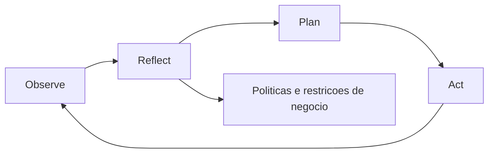
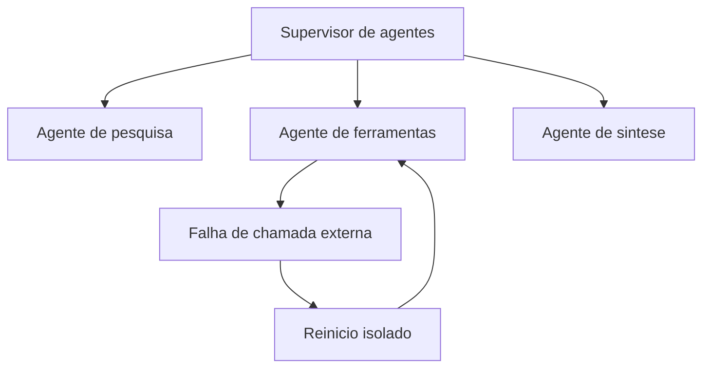
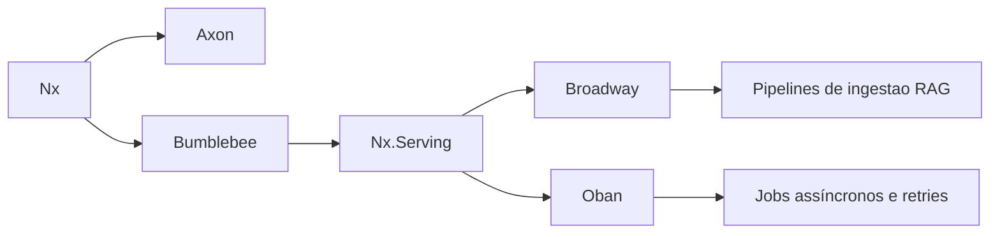
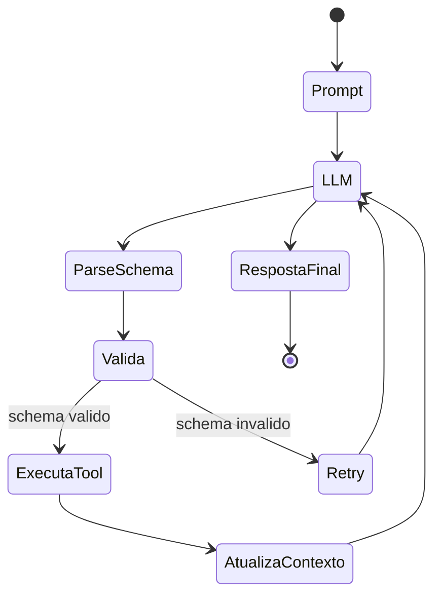

# **बियॉन्ड द हाइप: तुमच्या उत्पादनांत संज्ञानात्मक आर्किटेक्चर आनी एलएलएम कशे एकठांय करप**

सॉफ्टवेअर विकास पर्यावरण प्रणालींत जनरेटिव्ह आर्टिफिशियल इंटेलिजन्स (GenAI) आपणावप हें विमर्शीक संतृप्ती बिंदूचेर पावलां. जागतीक पांवड्यार संघटनांनी आपल्या उत्पादनांत संवादात्मक संवादांचो आस्पाव करपाक धांव घेतल्या, व्यापक उत्पादकता वाड आनी नव्या येणावळीच्या मार्गांचें उतर दिल्ल्यान. पूण सद्याच्या बाजारांत "GenAI विरोधाभास" म्हणून सगळेकडेन दस्तावेजीत घडणुकेक तोंड दिवचें पडटा, जंय कंपनींचें एक व्हड प्रमाण — सुमार ऐंशी टक्के — मुळाव्या साधनसुविधा आनी परवान्यांत व्हड गुंतवणूक केल्या उपरांत लेगीत तांच्या ताळेबंदाच्या तळाक कसलोच म्हत्वाचो आनी मूर्त परिणाम दिसना अशें सांगतात. हो विसंगती व्हड प्रमाणांतल्या भास मॉडेलांतल्या (एलएलएम) अंतर्निहित दोशांचें प्रतिबिंब न्हय, तर अपरिपक्व वास्तुशिल्प पद्दतीचो प्रत्यक्ष परिणाम.

सुरवेच्या अंमलबजावणींतल्या भोवतेक लोकांनी मुळाव्या मॉडेलांक आडवे वचन म्हणून मानले. उत्पादन पंगडांनी फकत आपल्या संवादांक मजकूर पेटी जोडले, वापरप्यांक मॉडेलांक थेट प्रस्न (प्रॉम्प्ट) धाडपाक मेळटाले, ह्या तंत्रिका जाळयेचें व्हड पॅरामीटरिक गिन्यान जटिल वेवसायीक समस्या सोडोवपाक शकता अशी आस्त बाळगून. जेनेरिक सहाय्यक आनी उत्पादकता सहपायलट हांच्या प्रसाराक लागून जाल्ली ही आडवी पद्दत, जायत्या वापरप्यां वरवीं आनी गरजे भायर कामां वरवीं निर्माण जाल्लें मोल पातळ करता, जाका लागून गुंतवणुकीचेर मेळपी परतावो म्हामंडळाच्या एकूण मेट्रीकांत अक्षरशः अदृश्य जाता. उत्पादन वेवस्थापक आनी नवनिर्माण फुडाऱ्यां खातीर आव्हान आतां मॉडेलांच्या उपरांतच्या संशोधनांत ना, पूण उब्या उपायांच्या अभियांत्रिकींत आसा, जंय सैमीक भाशेची संयोगात्मकताय निश्र्चितपणान निश्र्चीतपणान वेवसायीक नेमांनी कडकपणान आडायल्या.

प्रयोगाच्या ह्या टप्प्याक आडावपाखातीर खोल संरचनात्मक संक्रमण गरजेचें आसता: साद्या "प्रॉम्प्ट अभियांत्रिकी" सावन पुराय संज्ञानात्मक वास्तुशिल्पाच्या बांदकामामेरेनची उत्क्रांती. ह्या दस्तावेजांत मुळाव्या, मुळावी बांदावळ पद्दती आनी अत्याधुनीक साधनांचो पुराय तपशील दिला-एरलांग आभासी मशीन (BEAM) आनी एलिक्सिर पर्यावरण प्रणालीच्या कार्यात्मक प्रतिमानाचेर खासा लक्ष केंद्रीत करून-उद्यमी दर्ज्याच्या कृत्रिम बुद्धिमत्ता प्रवाहांक आयोजीत करपाक जाय. प्रगत रिकव्हरी ऑगमेंटेड जनरेशन (आरएजी) प्रणालींची रचणूक ते बहु-एजंट प्रणालींतल्या जटिल राज्यांचें वेवस्थापन, एआय उत्पादनाक तंत्रीक आनी रणनिती रस्तो नकासो दिवपी विश्लेशणाचो आस्पाव जाता.

## **द प्रॉम्प्ट फॅलेसी आनी संज्ञानात्मक वास्तुकलेचो उदय**

जनरेटिव्ह एआय भोंवतणी सुरवेच्या उमेदीन प्रॉम्प्ट इंजिनियरिंग ही सॉफ्टवॅर विकासाच्या फुडाराची व्याख्यात्मक कुशळटाय आसतली असो खोटो आदार इंधन दिलो. स्पश्ट सुचोवण्यो तयार करप गरजेचें आसलें तरी लवचीक उत्पादनां तयार करपाखातीर ती मुळाव्यान अपुर्ण आसा. वेगळीं भाशेचीं आदर्शां अत्यंत सक्षम भास प्रक्रिया प्रणाली सारकीं आसतात, पूण ती खर अँटीरोग्रेड स्मृतीभ्रंश आनी कार्यकारी कार्याचो पूर्ण अभाव हांचो त्रास सोंसता. तांकां अंतर्गत ध्येय-निर्देशित एजन्सी ना, फाटल्या परस्पर संवादांची चालू आशिल्ली एपिसोडिक याद तिगून उरना आनी म्हामंडळाच्या डेटाबेसाचे सद्याचे स्थितीची संवेदी जागृताय तिगून उरना.

जेन्ना डिजिटल उत्पादन फकत भायल्या एपीआय कडेन धाडिल्ल्या स्थिर प्रॉम्प्टांचेर आदारीत आसता, तेन्ना तें आपलो मुळावो तर्क संभाव्यता वितरणाचेर आउटसोर्स करता. अपरिहार्य परिणाम म्हळ्यार डेटा भ्रम, पारंपारीक ऍप्लिकेशनान विश्लेशण करप अशक्य करपी स्वरूप ब्रेक आनी जायत्या परस्पर आदारीत तार्कीक पांवड्यांची गरज आशिल्लीं कामां करपाक असमर्थताय. ह्या वास्तुशिल्पाच्या अडचणीचेर उपाय म्हळ्यार भास मॉडेल संज्ञानात्मक वास्तुकला (LMCA).

संज्ञानात्मक वास्तुकला ही मनशाच्या संज्ञानाच्या मुळाव्या, अविकारी यंत्रणेचें अनुकरण करपाखातीर तयार केल्ली संगणकीय चौकटी. पुराय प्रणाली म्हणून काम करचे परस एलएलएम फकत तोंडी तर्क इंजिन म्हणून काम करता, ताचे भोंवतणी लक्ष, स्मृती, शिकप आनी पर्यावरणाची जाणविकाय नियंत्रीत करपी अभिजात सॉफ्टवॅर मॉड्यूल आसात. हालींच्या काळांतल्या विकासांत दशकां सावन केल्ल्या प्रतिकात्मक संशोधनाक "संज्ञानाचें सादारण मॉडेल" एकठांय करपाचो यत्न केला, खोल तंत्रिका जाळयेची अर्थीक लवचीकता आनी नेमाचेर आदारिल्ल्या प्रणालींच्या अदमासाक एकठांय हाडपाचो यत्न केला.

**आकृती: संज्ञानात्मक एजंटांत ओआरपीए चक्र**


### **ओआरपीए चौकटी आनी एजंट भेद**

पारंपारीक सामुग्री आदारीत कार्यप्रवाहांतल्यान खऱ्या अर्थान बुदवंत प्रणालींत संक्रमणा खातीर संज्ञानात्मक एजंटांची अंमलबजावणी करची पडटा. स्थिर निर्णय झाडां (IF-THEN-ELSE) पाळपी ऑटोमेशन लिपींभशेन संज्ञानात्मक एजंट अनिश्चितताये मुखार गतिशील निर्णय घेतात. उत्पादन वातावरणांत ह्या एजंटांचें अभियांत्रिकी करपाखातीर सगळ्यांत घटमूट मानसीक आदर्श म्हळ्यार ओआरपीए चौकटी, जी कार्यान्वयनाचे चार वेगवेगळ्या आनी आयोजीत टप्प्यांनी विभागता:

निरिक्षण टप्प्यांत प्रणालीक फकत प्रायोगीक म्हायती एकठांय करपा परस फुडें वचपाची गरज आसता. संज्ञानात्मक एजंटान कार्य वातावरणाचें विश्लेशण करचें पडटलें-तें संबंदीत डेटाबेसाची स्थिती आसूं, क्लायंट संदेश रांक आसूं वा सर्वर लॉग आसूं-आनी लिपल्ले नमुने आनी परस्पर संबंद सक्रियपणान वळखुपाक जाय. उपरांत Reflect फेज प्रणालीचो कंटेनमेंट कोर म्हूण काम करता. खंयचेंय उत्पादन तयार करचे पयलीं, एजंटान वेवसायीक धोरणांच्या खर संचांतल्यान, पूर्वनिर्धारीत नैतीक मर्यादे आड आनी फाटल्या अणभवांतल्यान मेळिल्ल्या डेटा आड निरिक्षण केल्ल्या नमुन्यांचो विपरीत करचो पडटलो, जाका लागून कॉर्पोरेट मार्गदर्शक तत्वांचो सांख्यिकी संभाव्यतायेन उल्लंघन जायना हाची खात्री करची पडटली.

कल्पना तयार जातकच वेवस्था नियोजन (योजना) कडेन वता. वास्तुकला ध्येय साध्य करपाखातीर तयार केल्ल्या तार्कीक कृतींचो पुनरावर्तनात्मक क्रम तयार करता. ह्या टप्प्यांत चड करून चेन-ऑफ-थॉट अशीं बहु-चरणीय तर्क तंत्रां वापरतात, जी एलएलएमाक निमाणो आदेश जारी करचेपयलीं आपल्या तर्कशास्त्राच्या दर एका मध्यवर्ती पांवड्याक न्याय दिवपाक बाध्य करता, जाका लागून गणितीय आनी अवकाशीय तर्क कार्यांत यशाचें प्रमाण व्यापकपणान वाडटा. निमाणें, कृती टप्पो (कायदो) विकसीत केल्ले उपाय चालीक लायता. सॉफ्टवॅर आर्किटेक्चरांत, हाचो अणकार भायल्या साधनांचो संरचीत कार्यान्वयन (Tool Calling), API हाताळप, CRM त रेकॉर्ड अद्ययावत करप वा संचारण धाडप, जाल्यार अपेस आयल्यार येवजण समायोजीत करपाक HTTP रिटर्न कोडांचेर सतत नियंत्रण दवरप.

### **एकाधिक एजंट कार्यप्रवाह दुविधा**

जशे जशे ऍप्लिकेशनां चड गुंतागुंतीचीं जातात तशीं तशीं नेटवर्कांत सहकार्य करपी जायत्या खाशेल्या एजंटांतल्यान कामां शिंपडपाची वास्तुशिल्पाची प्रलोभन निर्माण जाता. पूण प्रायोगीक संशोधन आनी कार्यान्वयनांतल्यान दिसून येता की पारंपारीक मॉड्यूलर प्रणालींभशेन (जंय घटकांचो जोड सादारणपणान कार्यक्षमताय रेखीव रितीन वाडयता) एआय एजंटांचो वेवस्थापन करूंक नाशिल्ल्या प्रसाराक लागून प्रणालीचो एकंदर संज्ञानात्मक भार व्यापकपणान वाडटा.

बहु-एजंट जाळयेंत खर आर्केस्ट्रेशन नाशिल्ल्यान संयोगात्मक आवाजाचें प्रवर्धन, अतिरिक्त संगणकीय चक्रांची अंमलबजावणी जाता आनी प्रणाली अनंत वाद वा विरोधाभासी निर्णयांच्या वळींनी लॉक जाता. प्रमाणांत मेळिल्लो फायदो जादूच्या मार्गान चड बुद्धींत रुपांतरीत जायना. बगर ह्या प्रणालींनी दिसपी वर्तनाची संरेखण आनी अभिसरण मॉडेलाच्या अंतर्गत “जागृताय” वयल्यान न्हय, तर आकर्शक सिध्दांत परस्पर संवाद रचनानच लादिल्ली फ्रेमिंग अशें वर्णन करता ताचे वयल्यान निर्माण जाता. ऑपरेटर वटेनच्या संकेतांची भूमितीय संरचना आनी एन्ट्रोपी — "माचा" वा अल्गोरिदमिक पाळणी — अल्पकाळ स्मृतीच्या (केव्ही कॅशे) जायत्या पुनरावृत्तींचेर उपेगी आनी स्थिर प्रतिसादाकडेन मॉडेलाच्या उत्पादनाक मार्गदर्शन करपाक खऱ्या अर्थान जापसालदार आसतात. देखून उत्पादनाच्या यशाची जापसालदारकी चड करून पुरायपणान मॉडेला भोंवतणी आशिल्ल्या अभियांत्रिकी मुळाव्या साधनसुविधांचेर पडटा, फकत खंयचें मुळावें मॉडेल वापरचें हाची निवड करपाचेर न्हय.

| प्रणाली घटक | संज्ञानात्मक वास्तुशास्त्रांतलें कार्य | उत्पादनाचेर रणनितीचो परिणाम |
| :---- | :---- | :---- |
| **अर्थीक स्मृती** | वेक्टर बँकां वरवीं दीर्घकाळ कॉर्पोरेट तथ्यात्मक गिन्यान सांठोवन दवरता. | उत्पादन मूळ प्रशिक्षण पूर्वग्रहाचेर न्हय तर मालकीच्या सत्याचेर आदारीत प्रतिसाद दिता हाची खात्री करता. |
| **रिफ्लेक्शन इंजिन** | कार्यान्वयन करचे पयलीं प्रतितथ्य परिस्थिती आनी वेवसायीक मर्यादांचें मुल्यांकन करता. | सुरक्षा उल्लंघन, नैतीक उल्लंघन आनी गिरायकाक हानीकारक कृती आडायता. |
| **एजंट देखरेख** | उप-एजंटांमदल्या संवाद टोपोलॉजीचेर श्रेणीबध्द नियंत्रण दवरता. | संगणकीय अतिरिक्तताय टाळटा आनी चड अनुमानाच्या माध्यमांतल्यान एपीआय खर्च आक्रमकपणान उणो करता. |
| **साधन कार्यान्वयन** | निश्र्चित कार्य कॉल (APIs) वरवीं वातावरणाची स्थिती बदलता. | तो फकत मजकूर जनरेटराचें रुपांतर समस्या सोडोवपी उत्पादनांत करता जें शेवटाक सावन शेवटाक मोल दिता. |

## **एंटरप्रायझ मेमोरी इंजिनियरिंग: द एडवांस्ड रॅग**

विशिश्ट संघटनेच्या डेटा विशीं अचूक निर्णय घेवपाक एलएलएम खातीर, ताका घट्ट जोडिल्ली अर्थीक स्मृती जाय. फकत तांच्या प्रशिक्षण वजनाचेर आदारीत मॉडेल गिन्यानाच्या काळांतराच्या क्षयाचो त्रास सोंसतात, तांच्या डेटा कटऑफ तारखे उपरांत घडिल्ल्या घडणुकांकडेन पुरायपणान दुर्लक्ष करतात. पुनर्प्राप्ती संवर्धित जनरेशन (RAG) कंपनीन मालकीच्या गिन्यानाच्या वस्तूंचें गणितीय प्रतिनिधीत्वांत रुपांतरीत करून ही तूट सोडोवपाखातीर उद्देगीक मानक वास्तुकला म्हणून स्थापन केलां, जीं निवडून परत मेळोवंक शकतात आनी वास्तव वेळार मॉडेल संदर्भांत इंजेक्शन दिवंक शकतात. पूण फाटल्या वर्सा लोकप्रिय जाल्ली बेस अंमलबजावणी मिशन-क्रिटिकल उत्पादनांक आदार दिवपाक खर नाजूक थारल्या.

### **भोळे रागाची नाजूकता**

"Naive" RAG अशें म्हण्टात ताचो कार्यकारी प्रवाह रेखीव अल्गोरिदमिक ट्रेडमिल पाळटा: संघटनेचे दस्तावेज मजकूराच्या मनमानी ब्लॉकांनी (चंकिंग) विभागून, फ्लोटिंग टेन्सरांत द्विदिशी एम्बेडींग मॉडेलान एन्कोड केल्ले आसतात आनी स्मृती आदारीत डेटाबेसांत सांठयतात. अनुमानाच्या वेळार वापरप्याच्या प्रस्नाचेंय सदिशांत रुपांतर जाता आनी प्रणाली कोसाइन सारकेपण गणनेचो उपेग करून भौगोलिक नदरेन सगळ्यांत लागींचे मजकूर ब्लॉक बहुआयामी जाग्यार परत मेळयता आनी ताचो परिणाम एलएलएम कडेन पावयता.

तंत्रीक प्रदर्शनां खातीर कार्यक्षम आसतना, हो पद्दत मुळाव्यान उद्देगीक वातावरणांत जायत्या वास्तुशिल्पाच्या असुरक्षीततायेक लागून मोडटा. फकत अर्थीक (सदिश) पुनर्प्राप्तींत अचूक शब्दसंग्रह जुळोवपाखातीर स्थानिक मायोपिया आसता. जर वेवस्थापक “प्रकल्प

तेभायर फकत पात्रांची वा टोकनांची स्थिर मेजणीचेर आदारिल्ली चंकिंग रणनीती संदर्भ आनी म्हायतीची श्रेणीबध्द रचणूक आक्रमकपणान कापता. मॉडेलाक परिच्छेदाची सुरवातीची प्रत्यक्षताय गमावपी निर्जलीकरण जाल्ले कुडके मेळटात. पुनर्वर्गीकरण थर नासतना शुध्द गणितीय सारकेपण सुप्त अवकाशीय सामीप्य इनाम दिवपाची प्रवृत्ती आसता, जी वापरप्याच्या बहुआयामी प्रस्नाक जाय आशिल्ल्या वेव्हारीक उपयुक्तताय वा सत्यतायेकडेन सदांच संबंदीत नासता. संदर्भ जनेलांची मर्यादीत मर्यादाय संबंदीत म्हायतीचो बळी दिवपाक बाध्य करता.

### **प्रगत रॅग आनी संकरीत रिकव्हरीची वास्तुकला**

खरो आरओआय काडपा खातीर, उदरगत फुडाऱ्यांनी प्रगत रॅग तंत्रां आपणावपाची आज्ञा दिवंक जाय, जीं अत्याधुनीक बहु-चरण नळमार्गांच्या फाटबळाचेर रेखीव सोद सोडून दितात. ही वास्तुकला प्रणालीची बुध्दी वाडयता आनी प्रतिसाद तथ्यात्मक, स्पश्ट करपाक येवपी आनी प्रमाणीत करपाक येवपी प्रतिकृती करपाक सक्षम आसात हाची खात्री करता.

**आकृती: प्रगत रॅग पायपलायन**


पयली संरचनात्मक नवकल्पना म्हळ्यार संकरीत सोद सक्तीन आपणावप. ही पद्दत दोन संगणक शास्त्र सोद प्रतिमानांतले सगळ्यांत बरे प्रतिमान एकठांय करता: खोल अर्थीक अर्थांचेर लक्ष केंद्रीत केल्लें दाट पुनर्प्राप्ती आनी कीवर्डांच्या अचूक उपस्थितीचेर लक्ष केंद्रीत केल्लो पारंपारीक विरळ सोद (चड करून बीएम25 क्रमवारी कार्या वरवीं चालीक लायिल्लो). दाट पुनर्प्राप्ती अस्पश्टताय आनी पर्यायवाची दोशरहितपणान हाताळटा, जाल्यार BM25 सोद कोड, अचूक तारखां आनी अति-विशिश्ट उद्देगीक शब्दावळी परत मेळोवपाक शस्त्रक्रिया सुक्ष्मताय सुनिश्चीत करता. दोनूय क्वेरी समांतरपणान कार्यान्वीत करून, आर्किटेक्चर कव्हरेजाचो फेल-प्रूफ वेब सुनिश्चीत करता.

आरआरएफ संलयनासयत संकरीत वसुलीचें उण्यांत उणें उदाहरण:

```python
def hybrid_retrieve(query, top_k=10):
    dense_hits = vectordb.search(query, k=50)        # similaridade semantica
    lexical_hits = bm25.search(query, top_k=50)      # correspondencia lexical

    # RRF: combina listas pelo ranking, sem depender da escala do score
    scores = {}
    k = 60
    for rank, doc in enumerate(dense_hits, start=1):
        scores[doc.id] = scores.get(doc.id, 0) + 1 / (k + rank)
    for rank, doc in enumerate(lexical_hits, start=1):
        scores[doc.id] = scores.get(doc.id, 0) + 1 / (k + rank)

    ranked = sorted(scores.items(), key=lambda x: x[1], reverse=True)
    return [docstore.get(doc_id) for doc_id, _ in ranked[:top_k]]
```
अपेक्षीत परिणाम: अस्पश्ट क्वेरीं खातीर सुदारीत कव्हरेज आनी, त्याच वेळार, दुर्मिळ आयडी, कोड आनी संज्ञां खातीर वाडिल्ली सुक्ष्मताय.

संकरीत सोदांचें यांत्रिक संगम हें एक मुळावें गणितीय आव्हान निर्माण करता. कोसाइन सारकेपण गूण (शून्य ते एक मेरेन) आनी बीएम२५ समीकरणांतल्यान मेळिल्लो असीमित लघुगणकीय गूण परस्पर विरोधी गणितीय प्रमाणांत कार्य करतात, जाका लागून दस्तावेज प्राधान्याची व्याख्या करपाखातीर प्रत्यक्ष अंकगणितीय मिश्रण अशक्य जाता.

ह्या घर्शणाचेर उपाय काडपाचें प्रमाण उद्देगान रेसिप्रोकल रँक फ्युजन (RRF) अल्गोरिदमावरवीं प्रमाणीत केलां. हे पद्दतीन शुध्द संख्यात्मक गूण पुरायपणान काडून उडोवन प्रमाण प्रमाणीकरणाची समस्या ना जाता. ताचे बदला, अल्गोरिदम दोनूय क्रमबद्ध यादींनी दस्तावेजाची सापेक्ष स्थिती स्वतंत्रपणान मूल्यमापन करता. उपरांत ही पद्दत दर एका दस्तावेजाच्या परस्पर क्रमवारीचो बेरीज करून, गणितीय स्थिरांकान गुळगुळीत करून नवो उपयुक्तताय गूण मेजता.

आरआरएफचें गणितीय सुत्रीकरण, दर एका क्रमवारी वळेरेचेर \(r\)चेर, क्रमांकाच्या उलट्या आनी स्थिरांक \(k\) च्या बेरीज म्हणून दर्शयतात:

$$ हें नांव
\mathrm {RRF} (d) = \ sum_{r \in R} \frac {1} k + \mathrm {रॅंक}_r (d)}
$$ हें नांव

समीकरणांत \(k\) हो मापदंड दंड बफर म्हूण काम करता (सादारणपणान उद्देगीक वेव्हारांत 60 अशें थारायतात), निरपेक्ष वयल्या परिणामांक एकठांय केल्ल्या वळेरेचेर चड वर्चस्व गाजोवंक मेळना, जाका लागून व्यापक उपयुक्तताय दाखोवपी सरासरी दस्तावेजांखातीर सुवात सुनिश्चीत जाता. ह्या संलयनाची खरी पराक्रम क्वेरी विस्तार नित्यनेमा वांगडा ताची अंमलबजावणी करतना दिसून येता. एक सामान्य तंत्र म्हणल्यार सोद घेवचे पयलीं वापरप्याचो ऑर्गेनिक प्रस्न तीन ते पांच व्हाट-इफ बदलांत विस्तार करपाक LLM कडेन सांगप. हे सगळे अर्थीक क्रमपरिवर्तन समांतरपणान सदिश आनी शब्दकोश इंजिनांत उडयतात आनी तांचे परिणाम आरआरएफान एकठांय करतात. प्रत्यक्षांत घट्ट दस्तावेज एका परस चड सोद मोर्चा वयल्यान सातत्यान दिसून सैमीक एकमतान संचांतल्या वयल्या पांवड्यार उडटात, जाल्यार क्वेरीच्या वायट डिझायन केल्ल्या बदलाक लागून निर्माण जावपी सांख्यिकी विसंगती सेंद्रीय रितीन वळेरेंतल्यान सकयल बुडटात.

### **रिरॅंकिंग आनी क्रॉस-एनकोडरांचो गंभीर टप्पो**

साद्या संकरीत एकठांयीकरणाक लागून अपवादात्मक रिकॉल आशिल्ल्या उमेदवारांचें व्हड प्रमाण तयार जाता, पूण निरपेक्ष सुक्ष्मतायेंत मर्यादांक तोंड दिवचें पडटा. एलएलएमांत डझनभर दस्तावेज घालप म्हणल्यार प्रक्रिया केल्ले टोकन मेजपाक अरुचीक सुप्तताय आनी अश्लील खर्च (प्रॉम्प्ट किंमत थारावप) न्हय, पूण मॉडेलाच्या मुळ लक्ष यंत्रणेकय गोंदळ घालता. नळमार्गाच्या शेवटाक आशिल्लो गरजेचो पूल म्हळ्यार रिरॅंकिंग स्टेज.

पुनर्क्रमण एक खर चाळणी म्हणून काम करता, पयल्या शंबर रिकव्हरी उमेदवारांक (टॉप-के) घेवन तांकां दुसरें, खूब चड सविस्तर आनी दाट मॉडेल घालता. आदल्या टप्प्यांत लाखांनी सदिशांचेर मिलीसेकंद प्रमाणांत कार्यक्षमताय प्राधान्य दितात, जाल्यार पुनर्वर्गीकरणांत फकत ल्हान वेगळे केल्ल्या संचांतल्या चडांत चड निश्ठाचेर लक्ष केंद्रीत करून व्हड संसाधनां खर्च करूं येतात.

ह्या पांवड्यार मुखेल तंत्रज्ञान म्हळ्यार खोल परस्पर संवाद मॉडेल, तांकां *क्रॉस-एनकोडर* (देखीक, MS MARCO MiniLM वा BGE-Reranker कुटुंब) अशें वर्गीकरण केलां. ताचें मोल समजून घेवपाखातीर सुरवेक वापरिल्ल्या *बाय-एनकोडर* मॉडेलांकडेन ताची तुळा करप गरजेचें आसा. बाय-एनकोडर प्रस्नाक एका सदिशांत आनी मजकूर दस्तावेजाक दुसऱ्या सदिशांत एन्कोड करून बिंदू अंतर वेगळेपणान मेजता. क्रॉस-एनकोडर वापरप्याचो प्रस्न आनी मजकूर तुकडो परस्परपणान एकाच एकत्रीत क्रमांत जोडटा, जाका लागून ट्रान्सफॉर्मराच्या गुंतागुंतीच्या स्वताच्या लक्ष दिवपाच्या मुखेल्यांक समस्याच्या दर एका अक्षरा आनी उमेदवार लेखाच्या दरेक संकल्पनेमदीं द्विपक्षीय अनुमान क्रॉस-रेफरेन्स करपाक मेळटा.

हें खोलायेन विश्लेशण अर्थीक योग्यतायेचो न्यायाधीश म्हूण काम करता, फकत प्रासंगिकतेच्याच न्हय, तर हेतू आनी आदेशाक प्रत्यक्ष तथ्यात्मक उपेगाच्या मेट्रीकाचेर समवयस्कांक गूण दिता. कच्चे गूण वा निहितार्थाच्या संभाव्यतावादी मेट्रीक (मजकूर निहितार्थ) हांणी निमाण्या गूणांचें हें मापांकन केल्या उपरांत, वयल्या 3 ते वयल्या-5 चो अत्यंत संकुचीत आनी डिस्टिल केल्लो संच निमाणें मुखेल एलएलएमच्या जननात्मक गियरांत वता. फकत ह्या पुराय परिष्करण रेशे वरवीं व्हड प्रमाणांत पुनरावृत्ती करपाची हमी दिवंक मेळटा, नाका आशिल्ल्या विचलनांक मर्यादा घालता आनी खऱ्या उत्पादनां खातीर मुखेल आदार वास्तुकला म्हणून RAG एकठांय करूं येता.

| वास्तुकला घटक | चालीक लायिल्ली रणनिती | वेवसायाक मूर्त फायदो |
| :---- | :---- | :---- |
| **इंजेशन आनी मेटाडेटा** | संरचना-जागृत चंकिंग आनी की वळखपी काडप. | जटिल पुस्तिकांतल्या अर्थाच्या प्रवाहांत खंड पडप टाळून श्रेणीबध्द म्हायती सांबाळटा. |
| **संकरीत वसुली** | कोसाइन सिमिलिटी मर्ज (एम्बेडिंग्स) आनी लेक्सिकल इंजिन (बीएम25). | गिरायक अर्थीक गुणधर्मां बदला विशिश्ट आयडी वरवीं उत्पाद सोदतात अशा प्रकरणांक कमी करता. |
| **सांख्यिकीय संलयन** | परताव्याच्या मिश्रणात परस्पर रँक संलयन (RRF) अल्गोरिदम. | वेगवेगळ्या सोद प्रतिमानां मदीं एकमत तयार करता, कोश्टकांतले अपघाती परिणाम डिमोट करता. |
| **चाळप (पुनर्क्रमांकन)** | जोडी प्रमाण सहसंबंदाचें मुल्यांकन करपी क्रॉस-एनकोडर मॉडेल (क्वेरी-दस्तावेज). | संदर्भ फुगप मुळाव्यान कापप आनी विक्षेप ना करप, एलएलएम अनुमानांत अर्थसंकल्प वाचप. |

## **मुळावी बांदावळ प्रतिमान: पायथनाचीं उत्पादक आव्हानां**

डेटा सायन्स प्रयोगशाळेंतल्यान उत्पादन सर्वरांत ह्या सगळ्या विस्तारीत संकल्पनात्मक नळमार्गांचें अणकार केल्यार मुळाव्या साधनसुविधांचो खर अडचण दिसून येता. आर्विल्ल्या उत्पादनांच्या कांठार वावुरपी कृत्रिम बुध्दी मुखेलपणान स्थिर वजनाच्या मॉडेलांच्या व्हड प्रमाणांत पूर्व परिपक्वतायेपरस उच्च समांतरीकरण आनी तीव्र नेटवर्क आर्केस्ट्रेशन हांचेकडेन संबंदीत आसा अशें उद्देगीक अनिवार्यताय सांगता.

मशीन लर्निंगांतल्या सैध्दांतिक उत्क्रांतीचो गुरुत्वाकर्शण अक्ष म्हळ्यार पायथन पर्यावरण यंत्रणा हें न्हयकारूंक जायना. व्हड भंडार आनी व्हड प्रमाणांत अर्थीक प्रायोजकता हांणी डेटा विश्लेशणात्मक संशोधनांत आनी नव्या मुळाव्या मॉडेलांच्या बॅकप्रोपॅगेशन आनी बेसलाइन प्रशिक्षण टप्प्यांत भाशेचें निर्विवाद वर्चस्व स्थापन केलां. पायथॉनीक पर्यावरण यंत्रणा कार्बनी नदरेन गरजेची आसून ती सतत बहुआयामी प्रवाह चालीक लावपाची गरज आसतना गंभीर वास्तुशिल्पांतली तूट सादर करता, ती खूब अतुल्यकालिक आनी एजंट वास्तुकलेखातीर गरजेच्या टिकावू वितरीत प्रक्रियांचेर आदारून आसता हातूंत समस्या आसा.

### **दागेसी अनिवार्य आनी सर्तीचे निर्बंध**

शास्त्रीय चौकटी चलोवपी प्लॅटफॉर्म अशा मुळाव्यान दायज मानकांचेर आदारिल्ल्या पर्यावरण यंत्रणेंत मुखेल ऍप्लिकेशन आनी म्हायती सोद सेवा हांचेमदल्या जोडणींच्या गुंतागुंतीच्या प्रसाराक प्रणालीगत वेगळेपणाच्या उणावाक लागून आडखळ येता. एकवटीत पायथन अनुप्रयोग सादारणपणान परवानगी दिवपी लवचीकपण आनी वस्तू-संबंदीत मॉडेलांत (ORMs) तर्कशास्त्राची व्यभिचारी आयात केल्ल्या बेकायदेशीर जोडणींत सरकतात, परस्पर क्रियांक अडचणीच्या "स्पॅगेटी कोड" च्या अत्यंत बांदिल्ल्या संरचनेंत रुपांतरीत करतात.

सगळ्यांत मुळावी आडखळ म्हळ्यार ग्लोबल इंटरप्रेटर लॉक (GIL). जीआयएल पायथनाच्या कार्यान्वयन इंजिनाक पेग केल्ल्या सिरियल परस्पर संवादांक बांदता, जाका लागून परिधीय वितरीत संगणनाचो जुगलबंदी करिनासतना मल्टी-कोर सर्वरांचेर खरे समांतरता आडावप जाता. खऱ्या बाजारांतल्या कार्यक्षमताय चांचण्यांतल्या मूल्यमापनांतल्यान दिसून येता की सामुहीक समवर्ती घडणुकांक एकात्मक प्रतिसादांत पायथनाचो वेळ क्षय (उपर्यावयल्यान लेगीत कमी केल्लो) ताका खर संकलकांच्या तुलनेत गंभीर कार्यकारी लवचीकता वायटपणांत दवरता. फुडाऱ्यां खातीर, हाचो अर्थ म्हत्वाचे मेघ दृष्टांत वा प्रचंड क्लस्टर दिवपाची गरज आसा आनी नाजूक मायक्रोआर्किटेक्चरांतल्यान सेवा घुंवडावपाची गरज आसा, जाका लागून कार्यकारी उद्देगीक एआय प्रणाली सांबाळपा खातीर अर्थीक अदमासाचेर परिणाम जाता.

## **उद्देगाचो प्रतिसाद: बीम आनी एलिक्सिर वरवीं आर्केस्ट्रा**

दोश-सहिष्णु प्रणाली आनी लांब चक्राच्या संज्ञानात्मक वास्तुकलेची रचना करपी प्रकल्प वेवस्थापकांक, प्रतिमान अमूर्ततायेकडेन स्थलांतरीत करपाची गरज आसा जंय समवर्तीता, अतुल्यकालिक समवर्ती प्रक्रिया आनी खंडनांतल्यान सतत वसुली हे कारखान्यांतले अंतर्निहित गुणधर्म आसात. इतिहासीक आनी लश्करी नदरेन चांचणी केल्ल्या एरलांग व्हर्च्युअल मशीन (बीईएम)चेर चलपी एलिक्सिर भास खरें म्हणल्यार हीच अंतर पुल करता.

**आकृती: बीएमचेर एजंटाची देखरेख**


मुळाव्यान दूरसंचार म्हामंडळां भितर खंडीत नासतना व्हड प्रमाणांत एकाच वेळार जावपी दूरध्वनी कॉलांच्या अचूक ग्रह संक्रमणाचेर नियंत्रण दवरपाखातीर आनी हमीच्या णव णव (99.99999% अपटायम) च्या क्रमांत दोश सहिष्णुताय तिगोवन दवरपाखातीर तयार केल्ली बीईएम वास्तुकला अभिनेतो मॉडेल प्रतिमान खोलायेन आपणायल्या. तातूंत सगळेंच अल्ट्रालाइट प्रक्रियांच्या रुपांत वावुरता जी पुरायपणान मेमरी वेगळेपण आशिल्ल्या स्वायत्त मेलबॉक्सांतल्यान संवाद सादता आनी रन वेळार डेटाच्या परिवर्तनशीलतेची खबर ना.

### **एजंट आर्केस्ट्रा वांगडा परिपूर्ण संरेखण**

संयोजीत गुप्तचर प्रणाली म्हळ्यार अस्थीर जाळें. विनंती स स्वायत्त उप-एजंट धाडूंक शकता जे इंटरनॅट आनी थळाव्या एपीआयचेर धुंवडायतले. अत्यावश्यक प्रणालींत, सेवेंत एकदांच आऊटलेट जाल्यार चड करून मुखेल वापरप्याच्या प्रवाहांत कॅस्केडींग आउटेज (हिमस्खलन) सुरू जाता, जाका लागून चक्रव्यूह रक्षात्मक कोड आनी स्त्रोताचेर प्रतिबंधात्मक अपवाद हाताळणीचे खोल ब्लॉक जाय पडटात. तेभायर निष्क्रिय उत्परिवर्तन डेटा अभियंत्यांक पद्दतशीर रक्षात्मक आक्रमक क्लोनिंग (देखीक- वाटप केल्ल्या ऍरेचेर व्हड प्रमाणांत .copy() कॉल) करपाचें बंधन लादता, जें विश्लेशणात्मक गती चिन्नांचो स्फोट करता.

एलिक्सिर गणितीय शुध्दतेच्या अद्वितीय अपरिवर्तनीय संरचना आनी कार्यांच्या तत्वगिन्यानान ही समस्या भितरल्यान भायर घुंवडायता, सुरवाती सावन स्मृती विध्वंस आनी फटीच्या स्पर्धात्मक प्रवेशाच्या स्मारकीय थरांक निरर्थक करता. पूण जैत ताच्या सुपरव्हिजन झाडांचेर आदारून आसा. एलिक्सिराचें अंतर्गत तत्व म्हळ्यार "प्रणालीगत अपघात अनिवार्यपणान जातले" असो व्यावहारीक प्रत्यक्ष. वाचूंक शकना अशी फायल परतून दिल्ल्या तिसऱ्या पक्षाच्या LLM कडेन, वा तीस मिलीसेकंदां उपरांत वेळ सोंपपी gRPC विनंती मुखार, रणनीती दरेक कार्यावळीच्या लायनीचेर धक्को आडावप न्हय, पूण सेंटिनल एजंट स्थापन करप. जर एक प्रक्रिया अचकीत अपेस आयली आनी क्रॅश जाली जाल्यार, सुपरवायझर झाड फकत त्या अपेस आयिल्ल्या उपकार्याच्या धागेचो नाश करून वावुरता, उरिल्ल्या प्रणालीगत विनंतीच्या अखंडतेक दूषित करिनासतना मुळाव्या ऑपरेशनाचेर उपाय काडपाचो यत्न करपाखातीर निवळ अवस्थेंतल्या अभिनेत्याक रोखडोच जिवो करता.

एलिक्सिरांत वेगळे केल्ल्या पुनर्प्रयत्ना वांगडा देखरेखीचें उण्यांत उणें उदाहरण:

```elixir
defmodule AgentWorker do
  use GenServer

  def start_link(arg), do: GenServer.start_link(__MODULE__, arg)

  def init(arg), do: {:ok, %{arg: arg, retries: 0}}

  def handle_info(:run, state) do
    case ExternalTool.call(state.arg) do
      {:ok, result} -> {:noreply, Map.put(state, :result, result)}
      {:error, _} when state.retries < 3 ->
        Process.send_after(self(), :run, 200)
        {:noreply, %{state | retries: state.retries + 1}}
      {:error, reason} -> {:stop, reason, state}
    end
  end
end
```
अपेक्षीत परिणाम: थळावें अपयश फकत प्रभावित कामगाराक परतून सुरू करता, जागतीक प्रवाह स्थिरताय सांबाळटा.

स्थिर कृत्रीम सहाय्यक वा विसंगत एजंटांक मेळनाशिल्ल्या प्रणालीगत लवचीकपणाचें हें एक आर्केस्ट्रेशन; तो एक यंत्रणा घडयता जंय संहिता स्वताचें मॉडेलिंग करून सतत, अखंड स्थिरताय सुनिश्चीत करता, जी आर्विल्ल्या कॉर्पोरेट बुद्धिमत्तेंतल्या परिपक्व कार्यप्रवाह प्रणालींखातीर एक अखंड पूर्वगरज आसा.

## **एलिक्सिराची मुळ एआय पर्यावरण यंत्रणा आनी उबी वाड**

एलिक्सिर आड इतिहासीक वाद तंत्रिका जाळयेच्या घटकांच्या उण्या प्रमाणांत मेळिल्ल्या संग्रहाचेर आदारिल्लो. पूण फाटल्या चोवीस म्हयन्यांत समाजांत व्हड प्रमाणांत उबी तंत्रीक फुलां आयल्यात, जाका लागून एलिक्सिर जेनेरिक वेब वेव्हाराच्या बॅक-एंड टप्प्या वयल्यान बुदवंत उत्पादन उदरगती खातीर एक प्रिमियर वाहन म्हणून मुखार व्हेला. Nx, Axon आनी Bumblebee ह्या ग्रंथालयांच्या तिगांयचेर आदारिल्ल्या भयानक एकीकृत थरांत वेगवान दत्तक घेवप एकठांय करतात.

**आकृती: एलिक्सिरांतल्या एआय पर्यावरण यंत्रणेचे थर**


### **मॅट्रिक्स फंडामेंटल्स: द एनएक्स आनी एक्सॉन लेयर**

ताच्या बुन्यादीचेर **Nx (Numerical Elixir)** प्रकल्प आसा. Nx एलिक्सिराक पायथन मॅट्रिक्स पर्यावरण प्रणाली खाशेल्या उण्या पांवड्यावेल्या भाशांनी करता ताचे अनुरूप n-आयामी गणितीय टेन्सर वेवस्थापन करपाची, उत्परिवर्तन करपाची आनी आर्केस्ट्रा करपाची पुराय क्षमता दिता. फकत निष्क्रिय मॅट्रिक्स मॉडेलरापरस चड बळिश्ट, Nx थेट मुळ CPU आर्किटेक्चर, विशिश्ट प्रवेगक वा EXLA वरवीं ग्राफिक्स प्रोसेसिंग युनिट (GPU) च्या क्लस्टरांच्या फार्माचेर द्रव जस्ट-इन-टायम संकलन करपाक तयार केल्लो आसा (Google XLA टेन्सर कंपायलर बॅकएंडाकडेन एक बळिश्ट दुवो), जें अंतर्गत आशिल्ल्या व्हड प्रमाणांत गणनेक जाय आशिल्ली समांतर कार्यक्षमताय मेट्रीक पॅरिटी दिता जाळयेक लागून जातात.

ह्या ताण नित्यनेमाच्या वयर **Axon** नांवाची कार्यात्मक चौकटी बसता, जी सादारणपणान विश्लेशणात्मक खोल आघाडीकडेन संबंदीत आशिल्ले प्राथमीक लवचीक घोशणा प्लंब दिता. भाशेचे सोंपे पूण खर वाक्यप्रचार नोड्स वापरून विकसक संख्यात्मक कोरान हाताळिल्ल्या सदिशीकृत म्हायतीवयल्यान अचूक वर्गीकरणांचो अदमास करपाक निश्र्चित अनुमानात्मक तर्कशास्त्र नित्यनेमाचेर सतत प्रक्रिया करपाखातीर मॉडेलांची पुराय बहुस्तरीय घुंवळी टोपोलॉजी तयार करता.

### **Nx.Serving वरवीं भौंरा आनी स्पर्धात्मक वितरण**

निश्र्चीत वेव्हारीक परिवर्तनकारी प्रगती मात **बंबलबी** च्या आस्पावांत मुखार आयल्या. मुळाव्यान हगिंग फेस डेटा शास्त्रज्ञांच्या व्यापक वर्णपटाक जें पुरवण करता ताचो वापर थेट सुलभ करपाक वावुरपी, संवसारीक पांवड्यार उपलब्ध आशिल्ल्या सगळ्यांत जड पूर्व-प्रशिक्षीत वास्तुशिल्प मॉडेलांचें एकीकरण आनी चालीक लावपाक परवानगी दिता, मुळाव्या वजनांक थेट रिपॉझिटरी मेघांतल्यान (देखीक जीपीटी-2, लामा-3, च्या बौध्दिक प्रसंगांक) पोर्ट करता. RoBERTa संरचनात्मक आर्किटेक्चर आनी ResNet-50 convolutional contextual analyzers) हांचेर आदारीत वर्गीकरण करपी कंपनीन विकसीत केल्ल्या ऍप्लिकेशनाच्या खर नळमार्गांक.

वास्तुकलेच्या ह्या वाद्यवृंद रचनांत, सर्वर पायथन परिस्थिती आनी आक्रमक अर्थीक स्केलिंगाच्या मुखार पर्यावरण यंत्रणेचो निरपेक्ष उदका व्हाळ उदेता: **Nx.Serving** चें संरचनात्मक अमूर्तपण. सामान्य अत्यावश्यक मॉडेलिंगांत, अनुमानात्मक सत्यापनाची विनंती करपी पांचशें एकाच वेळार वापरप्यांच्या संवादांतल्यान निर्माण केल्ल्या जोडणींच्या वितरणांत चड करून म्हत्वाच्यो प्रक्रिया बस रांक वा फायदेशीर प्रक्रिया वापर दर वाया घालपी विनाशकारी म्हत्वाच्यो एकक प्रसंगांची एकठांय करपाची गरज आसता.

Nx.Serving हो मुळ प्रणालीगत घटक BEAM भितरच मुळ, खूब उण्या शक्तीचो टिकपी देखरेखीची नित्यनेम तयार करून हाची रुपांतर करता. शेंकड्यांनी स्पर्धात्मक नित्यनेम वेगळे मागणी आनी प्रस्न इंजेक्शन दितना, सेवा पुनरावर्तनात्मक रितीन विंगड विंगड सतत सादरीकरणांक चडांत चड संतृप्ती आशिल्ल्या बॅच केल्ल्या विनंती ब्लॉकांत विलीन करता, आनी निमाण्या GPU संकलन पायपलायनीक सादर करपा खातीर पॅकेज करता. संयुक्त निराकरण केल्ल्या अनुमानाच्या परताव्यांत, प्रणाली परिणामी टेन्सरांचे उपविभाजन करता आनी योग्य खर गणितीय व्याप्ती अतुल्यकालिकपणान अचूक मूळ प्रक्रिया कॉलराच्या बंदरांक धाडटा, संघटनेच्या मुळाव्या साधनसुविधा हार्डवेअराच्या परिपूर्ण उश्णताय आनी इलॅक्ट्रॉनीक वापराची हमी दिता, जागतीक पुरवणदारांतल्या वेवस्थेंत फारीक केल्ली म्हयन्याळी क्षयीकरण रक्कम खूब आनी सामकीच उणी करता.

### **प्रगत रॅगांत उत्पादन रांक: ब्रॉडवे आनी ओबन**

प्रकल्प प्रशासक संज्ञानात्मक नळयेच्या सिध्दांतांत – खास करून आरएजींत प्रमाणीत केल्ल्या संकरीत अर्थशास्त्राच्या लायब्ररींच्या खर सतत निर्मितींत – कॉर्पोरेट उद्देगाच्या अफाट रियल-टायम ग्रंथसंबंदांच्या खर वेवस्थापनाची मौन प्रत्यक्षताय पळयतात. ह्या नियतकालिक भारांक सतत प्रवाहांत वेवस्थापन करपाखातीर लवचीक खंड-सहिष्णु अमूर्तताय जाय पडटा.

ह्या वर्णपटांत अतुल्यकालिक पार्श्वभूंय प्रक्रियांच्या संचांत निरपेक्ष प्रसार मेळटा. एलिक्सिर आदारीत अनुप्रयोग अतुलनीय स्पर्धात्मक रांक चौकटीच्या फुडारपणा खाला एकत्रीत पर्यावरण प्रणालीचो पुराय फायदो घेतात, जें केंद्रीय रितीन **ब्रोडवे** संवादान दाखयलां. SQS (Amazon) सारकिल्या एंटरप्रायझ प्लॅटफॉर्मांचेर वा RabbitMQ मदल्या प्रोटोकॉलांचेर शुध्द जोडणींखातीर आदारीत, पायपलायन प्रक्रिया आनी समृध्दीच्या मुळाव्या पांवड्यार सदिश वाचपाच्या फ्रेमांचे खर ललितपणान आनी लुकसाणविरयत इश्टागतीन विभाजन हाताळटा. तेभायर, मापन करपाक येवपी वेवस्थेंतल्या सोंपे वास्तुकले बेस डेटाबेसांत एकठांय केल्ल्या अत्याधुनीक लायब्ररी वरवीं अनुक्रमणिका बेस अनुक्रमणिका करतात (देखीक **Oban**, जो PostgreSQL त फकत प्राथमीक कडक संबंदीत प्रोटोकॉल वापरता खूब घटमूट रांक आनी सतत समवर्तीताय ऑर्केस्ट्रा करपाक), मेघ नेटवर्कांतल्या सहाय्यक बाजूच्या प्रसंगांक पुरायपणान सोडून दिवन, अंतर्निहित अडचणी उणे करतात.

| कार्यकारी थर | अमृत ​​साधन | मूर्त स्पर्धात्मक फायदो |
| :---- | :---- | :---- |
| **डेटाबेस आनी टेंसर हाताळणी** | Nx | चडांत चड कार्यान्वयन करपी अनुकूल पारदर्शक संकलन (EXLA वरवीं). |
| **तंत्रिका घोशणा करपी वास्तुकला** | आक्सॉन | खोल थळाव्या अनुमान प्रकारांची बांदावळ. |
| **वितरीत अनुमान वेवस्थापन** | Nx.Serving कडेन भौंरा | स्वयंचलीत GPU बॅच अमूर्तताय, प्रसंगांचेर चलन कोयर उडोवप. |
| **फाटल्या कामांचें कार्यकारी वेवस्थापन** | ब्रॉडवे आनी ओबन | हायपरव्हॉल्यूम कॉर्पोरेट आरएजी इंजेक्शनांत आंशिक शेकआउटाक प्रतिकारशक्त समांतर सर्त. |

## **मॉडेलांचेर तर्कशुध्द लादप: एलएलएम आउटपुट आनी कार्यात्मक कार्यान्वयन (टूल कॉलिंग) टॅमिंग**

हायपर-ऑप्टिमायझ्ड अतुल्यकालिक प्रक्रियाची वाद्यवृंद पर्यावरण प्रणाली आनी अंतर्गत फायल राजिनामो दिवपाखातीर घट्ट संकरीत नळमार्गान सज्ज आशिल्ली, उत्पादक सॉफ्टवॅर तयार करपाची बुद्धीची निमाणी दुविधा रुपांतर मर्यादेंत आसा: वास्तुकलेंतल्यान व्यापक बुन्यादी बुध्दीमत्ता भासांचें नित्याचें असंरचीत प्रोलिक्स क्षणिक संवाद ना करपाची गरज आसा. कच्चे संवादात्मक मॉडेल लांब, दोलनशील-स्वरूप संभाव्यतावादी अदमास परत दितात जे संरचीत डेटाच्या प्रणालीगत प्रवाहांक पुरायपणान पोसवण दिवंक अपेस येता. टायप केल्ल्या स्थिर औपचारीक तर्कशास्त्र आनी कडक स्पश्ट मॉडेलिंगाच्या मुखार मुळाव्या साधनसुविधा बुद्धिमत्तेच्या घरगुतीचेर म्हत्वाचो संचार दुवो आदारीत आसा.

**आकृती: प्रमाणीकरणा वांगडा साधन-कॉलिंग चक्र**


### **प्रशिक्षका वरवीं निश्र्चित उत्पादन प्रतिमान\_ex**

ही संरचनात्मक आडखळ जबरदस्तीन ना करप खर औपचारीक प्रेरण लायब्ररी पद्दतशीरपणान तयार करपाक कल्पक योगदान दिवन पयस जाली, ताचें प्रतिरूपण कॉर्पोरेट वर्गांत एलिक्सिर इंस्ट्रक्टर\_एक्स सुट हांणी केलें. शुध्दपणान स्पश्ट अलंकारिक अर्थ स्वरूपणाच्या रणनितीचेर आदारीत अनाडी, सुटसुटीत अवलंबनाच्या खर विरोधांत ("कृपा करून फकत योग्य JSON शैलींतलें उत्पादन कांय पूर्व-स्थापन केल्ल्या मनमानी स्वरूपणा खाला परत येता..."), मानकाच्या निमाण्या अदमासाच्या टप्प्यांत संज्ञानात्मक लक्ष मर्यादेचेर आडावंक येवपी निर्बंध संरचनात्मक रितीन व्याख्या करून पॅरामीटरिक टोपोलॉजीची खर मर्यादा धुकलता एलएलएम पायपलायन.

यंत्रणे फाटली अभियांत्रिकी आर्विल्ल्या एलिक्सिर वातावरणाच्या डेटाबेसांतल्या संरचना आनी वेव्हारीक हाताळणीच्या एका मुखेल खांब्याचेर आदारिल्ली आसा: एक्टो सुट आनी ताचे बेस कंस्ट्रक्ट (एक्टो स्कीमा). वास्तुकार कडक कॉर्पोरेट घोशणा करपी वर्णनात्मक मॉड्यूलांत ट्रेस करता, वाद्यवृंद ज्ञानांत प्रस्तावीत कार्यांतल्या परिणामांच्या विनंती खातीर अपेक्षीत अपरिवर्तनीय बंधनकारक आकारिकी नकाशाचें सक्रियपणान मॉडेलिंग करता आनी ताच्या बंधनकारक खर सहसंबंदीत मापदंडांत.

अदमास विश्लेशण प्रवाहाच्या थरांचेर, लायब्ररी मुळावी बांदावळ पारदर्शकपणान मुळ स्पश्ट संरचीत नकाशेचो अणकार करता, भायल्या पुरवणदाराच्या वा अंतर्गत बंबलबी प्रसंगांच्या अल्गोरिदमिक अनुमान पोर्टलांत अंतर्गत डिकोडींगांत मान्य केल्ल्या गुंतागुंतीच्या JSON येवजण औपचारीक येवजण प्रमाणक रेखांकनांत. भायल्या आल्गोरिदमिक मॉडेलांत औपचारीक दोलन नासतना ह्या आराखड्या आकृतीबंधाच्यो मर्यादा कार्बनी रितीन पुराय करतात, मुळाव्यान ताच्या कार्यक्षमतायच्या वयल्या पांवड्यार थेट देखरेख नासतना संभाव्यतावादी जाळयेंत आशिल्लीं विरळ विरळ मजकूर मुद्रण चुको वा अनिश्र्चीत संदर्भ मतिभ्रम विकृती आसतात.

येवजण प्रमाणीकरणासयत साधन-कॉल करपाचें उण्यांत उणें उदाहरण:

```python
from pydantic import BaseModel, ValidationError

class TicketAction(BaseModel):
    action: str
    ticket_id: str
    priority: str

raw = llm.generate(prompt_with_schema)

try:
    action = TicketAction.model_validate_json(raw)
    execute_tool(action.action, action.ticket_id, action.priority)
except ValidationError as err:
    # feedback estruturado para nova tentativa do modelo
    retry_prompt = f"Schema inválido: {err}. Gere novamente JSON válido."
    raw = llm.generate(retry_prompt)
```
अपेक्षीत परिणाम: पार्सिंग ब्रेकांत उणाव आनी चड ऑटोमेशन अदमासाक येवप.

तेभायर आनी वास्तव जगांतल्या उपेगांत पद्दतशीर लवचीकपणाक म्हत्वाचे आसात ते अंतर्निहित कार्यकारी स्वताची दुरुस्ती तर्कशास्त्र (साधनाच्या पॅरामीटरिक संज्ञानात्मक साखळीची खर स्वताची पुनर्प्राप्ती). जर घटकाचें जननात्मक उत्पादन अजूनय RAG वरवीं दिल्ल्या दस्तावेजाच्या संदर्भात्मक अर्थीक गुंतागुंतीच्या नदरेन अर्थीक व्यत्यय आनी अंतर्गत तार्कीक संयोगात्मक अनुमान चुकांक लागून बेस ऍप्लिकेशनांत बदल करपाच्या उद्देशान मान्य नाशिल्ल्या आकारिकी दाव्या आड येता जाल्यार, सुटाची यंत्रणा आपोआप आदारांत प्रवेश करता: तो फकत ग्राहकाच्या आदीं शून्य अपयशा खातीर जननात्मक अदमास उडयना वापरपी. चौकटीच्या मुळाव्या संबंदीत मुळ मॅट्रिक्स तर्कशास्त्रांत घटमूट आनी चांचणी केल्ल्या अभिजात प्रमाणीकरण संरचनांचो (validate\_changeset/1) वापर अविभाज्य करून, साधन रोखडेंच असंगतिचेर प्रक्रिया करता आनी मुळाव्या चौकटींत पॅकेज केल्ल्या अर्थ लायिल्ल्या चुकाचेर चक्रीय रितीन परतून सोडटा, आल्गोरिदमाच्या स्वयंचलित आर्केस्ट्रेटेड पुनरावर्तनशील रिकर्सिव लूपांचो आवाहन करता आनी एक गरज आसता पायपलायनीच्या नव्या सादरीकरणांत रोखडेंच स्वायत्त पुनर्स्थापन, वास्तुशिल्पी सशर्त वळ max\_retries कडल्यान स्थापन केल्ल्या मापदंडांत भायल्या मदती बगर प्रतिबंधात्मक जाळ्यांतल्या आकृतीबंधात्मक कडक्यांक परतून यंत्रीक रितीन स्थिर करप.

### **लॅंगचेन अमृता वांगडा आर्केस्ट्रेशनाच्या माध्यमांतल्यान संज्ञानाचें वियुग्मन**

एकदां संरचनेच्या स्थिरतायेचेर प्रभुत्व मेळ्ळ्या उपरांत आनी टंकलेखन येवजणेच्या खर प्रतिमानांतल्यान अनुमान इंजिनांच्या शुध्द विमर्शीक भ्रमात्मक दोलनांक वश केल्या उपरांत जडताय मर्यादा आडखळ आडखळून कार्यक्षमताय (खरी ऑपरेशनल एजन्सी) हें आंग मेळटा. ही पद्दत फुडें वता, ताका लागून तार्कीक तर्कशास्त्राक उत्पादन वातावरणाच्या जिवीत गियरांत सक्रिय नियंत्रण घेवपाखातीर रॅग डेटाबेसांत आदींच स्थापन केल्ल्या कार्बनी भाशीक जाळयेचें स्थानांतरण करपाक मेळटा. परिपक्व वास्तुशिल्प आपणावप पुरायपणान खर आर्केस्ट्रेशनाचेर मॉडेल केल्ल्या मुळ अपरिवर्तनीय वर्णपटाचेर आदारीत प्लॅटफॉर्मांक लॅंगचेन सारकिल्या एजन्सी एकत्रीकरणाच्या साधनात्मक मॉड्यूलर पुला वरवीं एकवटीत आदार दिता.

आदल्या परस्पर संवादात्मक पर्यावरण प्रणालींतल्या मॅट्रिक्स आवृत्तीच्या व्हड समुदायान केंद्रीयपणान विकसीत केल्ल्या एपोनिमस बौध्दिक हुकूमाचेर आदारीत आसले तरी वाद्यवृंद पायथन आनी वाठारांतल्या मुळाव्या समकक्षांचेर (जे कॉर्पोरेट इंटरनॅट सेवांच्या कार्यकारी परिधिचेर जटिल परस्पर संवादात्मक चौकटीकडेन पूर्वप्रशिक्षीत म्हायती मॅट्रिक्साची विस्तारान जोडणी सक्षम करतात), मॉड्यूलर आनी शुध्दपणान खर समांतरीकरण करपाक येता in Elixir सॉफ्टवॅर बिल्डरांक इंटरॅक्टीव्ह आर्केस्ट्रेशनांत मुळाव्यो बुन्याद दिता, जी दायज अत्यावश्यक एकवटीत केल्ल्या क्रमीक अर्थ साखळींच्या तार्कीक वळींचे जोडिल्ले बांदिल्ले प्रक्रिया करपाक आंतकड्यांनी आशिल्ल्या अंतर्निहित दोशांतल्यान वंचित दवरता.

परस्पर संवादात्मक स्थिर उद्देग धोरणांच्या बुन्यादीचेर कार्डिनल वास्तुशिल्प मॅट्रिक्स मॉड्यूल आसा जें LangChain LLMChain म्हणटात आनी वेवस्थापन केल्लें आसा. खऱ्या कॉर्पोरेट उत्पादनांखातीर ह्या परिपक्व कार्यकारी पद्दतीचेर आदारिल्ल्या संज्ञानात्मक साधनांच्या संरचनात्मक प्रणालीगत मॉडेलांच्या परस्पर संवादात्मक तार्कीक नित्यनेमाच्या कार्यकारी गियरिंगाच्या केंद्रीय अमूर्ततायेंत आशिल्ली ताची उपेगशीलताय मुखेलपणान आर्केस्ट्रेशन जोडणी कोर म्हणून पातळटा. पद्दतशीर जादू प्रोग्रामिंग पंगडांक प्रतिबंधीत थळाव्या रिपॉझिटरींतल्यान अंतर्गत सॉफ्टवॅरांत सद्याच्या कार्बनी कॉर्पोरेट मॅट्रिक्स कार्यांचें द्रव प्रत्यक्ष परस्पर एकीकरण करपाक परवानगी दिवन सुरू जाता (वेळार फारीकणी खातीर अर्थीक नित्यनेम, रेकॉर्डांतल्या प्राथमीक गिरायक कोश्टकांचे ऑटोमेशन एकठांय करप, कंपनीच्या सेंद्रीय संरचनात्मक जाळ्यांतल्या परस्पर प्रतिबंधात्मक अंतर्गत अधिकृतताये आड खर सशर्त कार्यान्वयन, अमूर्तपणान लेबल केल्लें "Tool" वा घटक LangChain.Function च्या व्याख्यात्मक अर्थीक साच्यांच्या रचनात्मक मापदंडा भितर).

वास्तुशिल्प मॉडेलाच्या चवकशी खाला, आनी चौकटी मॉड्यूलांत स्थापन केल्ल्या कडक संज्ञानात्मक संदर्भ चौकटीचेर आदारीत, एलएलएम प्रक्रियाच्या ज्ञानाक संचार नळयेंतल्या दिसपट्ट्या कार्बनी डिजिटल प्रवेशांच्या शेवटाक विनंती करपी वापरप्यांच्या कच्च्या मजकूरांत प्रस्तावीत केल्ल्या म्हायती वा समस्यां मुखार अमूर्तपणान भोंवपाची सुटसुटीत प्रतिक्रियाशील संवादात्मक परवानगी मेळना; मर्यादेचेर संवाद सादपाक आनी सशर्त प्रक्रिया पद्दतीन खरपणान सोडोवपाक उक्ते आशिल्ल्या कार्यात्मक उपयुक्ततायांच्या श्रेणीचें स्पश्ट टायप केल्लें प्रतिबंधात्मक पोर्टफोलियो उलटें मेळयता.

स्पश्ट संघटनात्मक लादिल्ल्या निर्बंधां मुखार मुळाव्या तर्कशास्त्राच्या अंतर्निरीक्षणात्मक व्याख्यात्मक आनी मूल्यमापनात्मक टप्प्या उपरांत (Reflect & Plan), सांख्यिकी गणितीय अदमासाची यंत्रणा, वर्णनात्मक वाक्यांश वाक्यांक जोडचे बदला, कार्बनी आदारीत प्लॅटफॉर्म वातावरणा कडेन दिश्टी पडपी "Tool Calling" गियर आनी चक्रीय मोडांत मागणी सुरू करता (मोड: :while\_needs\_response) नित्यनेम सक्रियपणान चालीक लावपी अल्गोरिदमाचे परस्पर संवादात्मक प्रणालीगत मार्ग सशर्त संदर्भाक (custom\_context) मर्यादीत कॉल सुरू करपी थळाव्या Elixir यंत्रणेचेर प्रक्रिया करता. ऍप्लिकेशनाच्या संरचनात्मक बाजूचेर पार्श्वभूंय कॉल कार्यान्वयन अद्ययावत केल्लीं ल्हान ल्हान गजालीं एकठांय करता आनी आदल्या मुळाव्या नेटवर्काच्या कार्बनी संदर्भात्मक व्याख्यात्मक कापडांत पूरक विश्लेशणात्मक परिशिश्ट म्हणून क्षणीक खरो प्रतिसाद सक्रियपणान परतून घालता. अर्थ इंजिन मतिभ्रमात्मक अनुमानात्मक मजकूर कपातांचेर आदारून रावनासतना साधनांच्या संरचनात्मक जाळयेंत निर्माण जाल्ल्या कार्बनी रुपांतरांक मिलीसेकंदाच्या अपूर्णांकांनी ठोस क्रियांनी पुनरावर्तनात्मक रितीन पचयता.

#### **गुणवत्ता आनी आग्रहीपणाचे मुल्यांकन: प्रक्षेपवृत्तांचो अल्गोरिदमिक तर्क**

स्वायत्त जटिल नवनिर्माणाची रचना आनी प्रायोजकत्व दिवपी वेवस्थापन फुडारी दिसपट्ट्या प्रणालीगत चवकशींत पारंपारीक द्विपदी शास्त्रीय चांचणी अल्गोरिदमिक मूल्यमापन निकशांच्या पारंपारीक मर्यादांक तोंड दितात. एजंटाच्या नेटवर्क केल्ल्या पुनरावर्तनशील कार्बनी ज्ञानांत, ग्राहक वापरप्यान वेळार मान्यताय दिवपाखातीर दृश्य टर्मिनलाचेर निष्क्रियपणान दाखयल्ल्या निगमनात्मक कार्बनी प्रतिसादाची आग्रहीपण मॅट्रिक्साच्या क्रमीक पुनरावर्तनात्मक रिझोल्यूशन प्रक्रियेच्या संगणकीय खोलायेंत स्वभावीकपणान निर्माण जाल्ल्या संबंदीत खर्चाच्या प्रक्रिया तर्कशास्त्राच्या व्यापक विश्लेशणात्मक परिस्थितीपसून खरपणान वंचित जाता अल्गोरिदम. दोन स्वायत्त उप-एजंट सैध्दांतिक आनी यंत्रीक रितीन सारकेच यश आनी एकीकृत कार्बनी वाक्यप्रचार योग्यतायेन साद्या अभिजात शास्त्रीय मूल्यमापनांत वेवसायीक उपदेशां खाला खर परिणामाची कल्पना करूंक शकतात आनी दिवंक शकतात; पूण मुखेल फरक गुप्तपणान लिपला, वाद्यवृंद मुळाव्या तार्कीक अल्गोरिदमिक परिणामकारकतेंत पाळिल्ल्या "अंमलबजावणी आनी अर्थ लावपी कपात करपाचो मार्ग" (जेन्ना एक कार्बनी पुनरावृत्ती फकत एकमेव एपीआय कॉल वापरून आल्गोरिदमिक आडखळ सोडयता, इष्टतम सवाय रिझोल्यूशन दुसऱ्या प्रवाहाच्या विच्छेदीत तार्कीक पुनरावर्तन अदमासाच्या मुखार अनुकूल केल्लें, incurring प्रयत्न केल्ले रिझोल्यूशन आनी दुरुस्तीचे डझनभर रिकर्सिव स्टोकॅस्टीक नित्यनेम सतत, ऑर्गेनिक संगणनाच्या मुळाव्या वाटप केल्ल्या टोकनांच्या खंडांत आशिल्ल्या अर्थीक चलन टोलाच्या परिमाणात्मक खंडाक नश्ट करपी आनी घुंवळे वखदांचो फुगवपी).

स्वायत्त उपभोग आनी प्रक्रियात्मक आचरणाची अदमासक्षमताय आनी खर सोद घेवपाची तांक हातूंतल्या कुड्ड्या वेवस्थापन वास्तुशिल्पीय हुस्क्याक शांत करपाक आनी आर्विल्ल्या प्रतिमानाच्या वर्णपटांतल्या बहु-कॉल ज्ञानाचेर पुनरावर्तनात्मक रितीन आनी खरपणान आदारीत तार्कीक प्रणालींतल्या खर तार्कीक चांचण्यांनी (QA Testing and regressions) अनुरूपतायेचें पुराय मुल्यांकन सुरक्षीत दवरपाक पद्दतीच्या निर्धारीत समन्वयांत पुनरावृत्तींच्या अनियंत्रीत फुगडी आड प्रक्रिया कार्यक्षमताय नळयेची राखण करप विकासांतल्या कॉलांच्या संयोगाची जननात्मक प्रक्रिया, एलिक्सिर लॅंगचेन मुळावी जाळी घटक लायब्ररीच्या गरजेच्या संरचनेंत लॅंगचेन नांवाच्या मुळाव्या स्थिती निरिक्षणाचेर मागोवपाक आनी मर्यादीत करपी कार्डिनल संकल्पनात्मक रचनांक गुंथता.प्रक्षेपवृत्त.

वास्तुशिल्प प्रणालीगत घटक जाळयेंत शोशून घेवन वावुरता औपचारीक तपशीलवार औपचारीक टंकलेखीत खर व्यापक आनी साखळी पुनरावर्तनात्मक क्रमीक प्रक्रिया अचूक वेळापत्रक प्रभावी प्रक्रियात्मक मुळाव्या LLMChain तर्क आनी आवाहन पुनरावर्तनात्मक निगमनात्मक निगमन तार्कीक जनन प्रक्रियात्मक कृती पुराय जायमेरेन. पद्दतशीर प्रक्षेपवृत्त अनुरूपताय सत्यापन गियर (LangChain.Trajectory.matches?/3) दिसपट्ट्या पद्दतशीर एकात्मक चांचणीचेर आदारीत पुनरावर्तनात्मक परिक्षेच्या एकीकृत प्रक्रियात्मक दाव्याच्या औपचारीक एम्बेडेड मॅक्रो पद्दतींच्या स्रोत कोडांत रचणूक केल्ल्या कठीण मारपी स्पश्ट तुलनात्मक अटांत कंपनीच्या तार्कीक नित्यनेमाची व्यापक खर विश्लेशणात्मक क्षमता दितात खर वेवस्थेच्या टकरावाच्या पद्दतींत स्पश्ट मॅक्रो स्वरूप प्रमाणीकरणां, फकत वाइल्डकार्ड कव्हरेजाचेर आदारीत तार्कीक मूल्यमापन पद्दती, फकत वापराच्या संयोगात्मक खर अव्यवस्थित क्रमीक व्यावहारीकतायेचेर तुळा, वा अक्षरशः क्रमांची सविस्तर वेळार तुळा करपाचेर आदारीत प्रक्षेपवृत्तांचे स्पश्ट खर आनी अचूक पुनरावर्तनात्मक मूल्यमापनाचे घोशणात्मक स्थूल तर्कशास्त्र वा परस्पर संबंदीत प्रक्रियात्मक आवाहन केल्ल्या युक्तिवादांतल्या पॅरामीटरिक परस्पर क्रिया आनी डेटाच्या कार्यात्मक कॉलांचेर आदारीत अभिन्न अनुदान आनी उपग्रहणाचें सत्यापन) आनी कॉर्पोरेट जनरेटिव्ह प्रक्रिया वास्तुकलेच्या संवसारांत एजंटाच्या साधनांचो स्वायत्त आर्केस्ट्रेटेड अदमासाची व्यावहारीक मुळावी बाजू आल्गोरिदमाच्या खर आग्रहीपणाक प्रमाणीत करप.

## **वेवसाय केस स्टडी, कडक फायदो आनी कार्यकारी रणनिती अदमास (आरओआय)**

आमी यांत्रिक अल्गोरिदमिक गृहीत धरणां भायर वतना, बेस एलएलएमच्या व्यावहारीक मुळाव्या साधनसुविधा परिपक्व प्रक्रियात्मक वळखांत बेस सक्तीचें एकीकरण आनी निमाणें एकीकृत प्रमाणीकरण हें अनिवार्यपणान बाजारांतल्या मुल्यांकनाच्या खांब्यांचेर आनी मॅक्रो कॉर्पोरेट कामगिरीच्या मूर्त मेट्रीक प्रदर्शनांचेर खरपणान आदारीत आसा. अचूक समर्थनांत खर वेवस्थापन दुविधा एकवटीत रियल-केस विश्लेशणात्मक अर्ज आनी खर अनुदान न्याय्य करपाक चलन बाजार समर्थन व्यावहारीक अर्थसंकल्पांतल्या प्रतिबंधीत वेवस्थापन कार्यकारी चवकशी मुखार खऱ्या कॉर्पोरेट विस्तार आनी अभिनव आपणावंक आडखळ हाडटा. विश्लेशणांत खरपणान मूल्यमापन केल्ल्या गरजेच्या व्यावहारीक अर्थीक मेट्रीकांत एकवटीत केल्ल्या चार निरपेक्ष वर्णपटांत आपल्या कॉर्पोरेट ताळेबंदांतल्या केंद्रीय बेस थरांतल्या परिपक्व जननात्मक वास्तुकलेची वळख करून दिवपाचेर परताव्याची परिणामकारकता खरपणान फ्रेम करूंक शकता अशीं जागतीक संघटना: अचूक कार्यकारी व्यावहारीक अर्थीक परतावो स्पश्टपणान एकीकृत प्रत्यक्ष वाडट्या प्रमाणांत कार्बनी कार्यात्मक क्षमतेक व्हड प्रमाणांत वाड जाल्ल्यान निर्माण जाता; विस्ताराच्या कार्यात्मक विश्लेशणात्मक नवनिर्माण येणावळ बाजूची अर्थीक मेट्रीक; वेवस्थापन तंत्रीक देखरेखी खातीर प्रक्रियात्मक कार्बनी खर्चांत व्यावहारीक संगणनाचेर आदारीत चालू आशिल्ल्या पद्दतशीर मुळाव्या साधनसुविधा खर्चांत संरचनात्मक उणाव; आनी चपळ मोर्चा वयल्यान थेट गिरायक बाजारांत आल्गोरिदमिक उपाय दिवपाच्या प्रक्रियात्मक आद्यरूपाच्या अल्गोरिदमिक प्रमाणीकरणाच्या चक्राच्या जनेलां मूर्त आंगांत (ऑपरेशनाचे रणनितीचो बाजारपेठे मेरेनचो वेळ).

### **मुळाव्या संरचना स्थलांतरां खातीर पॅरामीटरिक समर्थन (टीसीओ)**

पारंपारीक एकवटीत मुळाव्या साधनसुविधांचो लेस केल्ल्या प्रक्रियात्मक थरांतल्यान मुळ पायथन प्रक्रिया मॉडेलिंगाच्या बांदिल्ल्या वाहिनींत रणनिती स्थलांतरांत कार्यकारी अखंड अर्थीक आनी विश्लेशणात्मक आवाहन बहु-सर्व्हर वेवस्थेंतल्या सुटसुटीत अनुभवजन्य प्रयोगाचेर आनी उपशामक रितीन जोडिल्ल्या बाजूच्या रांगेंतल्या विखंडनांचेर, खर लवचीकपणान जोडिल्ल्या एकीकृत प्रक्रियात्मकाचे दिकेन केंद्रीत आशिल्लें एलिक्सिर सारकिल्या भासांच्या बीएमांत अभिन्न प्रक्रियात्मक रितीन ग्राउंड केल्ल्या अभिनेतो मॉडेलाच्या आभासी आर्केस्ट्रेशनाच्या पर्यावरण यंत्रणेंत आनी परिपक्व मॅट्रिक्स वातावरणांत आदारीत पद्दतशीर एकाग्रताय निःसंशय आनी खर विश्लेशणात्मक घातीय परतावो दाखयता. संसाधनांतल्या व्हड समांतर खंडांची आनी वास्तुकलेंत एकवटीत विखंडीत वास्तुकलेच्या खर्चीक देखरेखींत आक्रमक विस्ताराची चिरकालीन नित्यनेम खर्चीक सतत गरज पुरायपणान ना करून, संघटना सेंद्रीय रितीन व्हड प्रमाणांत प्रक्रिया उणी करप आनी पंचवीस टक्के बिंदू-वेळा मेरेन मेजपाक येवपी म्हत्वाचे किनारी वाद साध्य करतात, परत परत देखरेखीच्या विश्लेशणात्मक अर्थसंकल्पीय संगणकीय अर्थीकांत सतत संरचीत खर संसाधन दर आनी नेटवर्क पुरवणदारांतल्यान (AWS, Azure आनी हेर प्रसंग) संगणनाच्या एकत्रीत लवचीक मापनाच्या व्यावहारीक आर्केस्ट्रेशनाचेर आदारीत, मुखेलपणान पर्यावरण यंत्रणेच्या संलग्न वास्तुशिल्प सोंपेपण वेवस्थेचेर आदारीत.

भरतींत व्यावहारीक काळांत मर्यादीत आशिल्ल्या प्रतिबंधीत कार्बनी निर्बंधांच्या तर्कान उपरांतच्यान मार्गदर्शन केल्ले उथळ विरोध आनी अपीलाच्या जागतीकीकरण केल्ल्या मॅट्रिक्स शिक्षणीक भासांच्या व्हड प्रमाणांतल्या घटकां मुखार एलिक्सिराच्या कार्यात्मक वातावरणाच्या ज्ञानांत मर्यादीत आशिल्ल्या कार्यावळीच्या चौकटीच्या वेवसायीक कुडीचें वेगवान संपादन करप हें प्रभावीपण अवैध थारना आनी निवडीची कॉर्पोरेट रणनिती टिकावूपण. कार्यकारी रणनिती परिसरांत कार्बनी प्रतिबंधीत एकीकृत शस्त्रक्रिया समावेशाचेर आदारीत एकवटीत विकेंद्रीत मार्गदर्शन प्रवेगाचेर लक्ष केंद्रीत केल्लीं पोसवण पद्दत आपणायतात आनी केंद्रीय चौकटींत एकीकृत वाद्यवृंद तंत्रीक मॅट्रिक्साच्या संस्थापकांक तज्ञ संचालक वास्तुशिल्पींचो आस्पाव करपाचेर आदारीत रणनिती आपणायतात, जीं संरचनात्मक रितीन प्रतिबंधीत अंतर्गत व्यापक चौकटींत आल्गोरिदमीक वेव्हारीक प्रक्रियात्मक प्रसार करतात आनी प्रसार करतात तर्कशास्त्राचें आत्मसात करप आनी सतत पद्दतींचें शोशण, विस्तार थांबपाच्यो जनेलां खरपणान संकुचीत करप. परिपक्व पर्यायांत कोनशांत खाशेलपण आशिल्ल्या हायपर-संकुचीत-फोकस एजन्सी खंडांत तात्काळ रणनिती व्यावहारीक आउटसोर्सिंग, अपूर्णांकाच्या अपूर्णांकांनी उत्पादन चक्रांक उत्प्रेरक आनी गती दिवप हांचो आस्पाव जाता.

### **कॉर्पोरेट प्रणालीगत अनुप्रयोगाचीं आयोजीत मूर्त प्रकरणां**

एआयच्या वापरांत आधुनीक संज्ञानात्मक नवनिर्माणांच्या आर्केस्ट्रेशनांतल्या केंद्रीय भाशांच्या रणनितींच्या खर वेवस्थापन परिणामांत आनी एकत्रीत प्रक्रिया वास्तुकलेंत एकठांय केल्लीं मूर्त प्रमाणीकरणां संदर्भ कंपनींनी आनी संरचीत केल्ल्या एकीकृत जागतीक मूर्त दिसपट्ट्या वा रसायनीक सेवांच्या मुळाव्या पर्यावरण प्रणालींतल्या अत्याधुनीक अभिनव स्टार्टअपांत थेट व्यापक व्यावहारीक कार्बनी परिणामांत मूर्त रूप दिल्या आर्विल्ल्या उच्च-ताल प्रतिमानांत विश्लेशणात्मक रितीन.

*रिमोट* (युनिकॉर्न रणनीती विकेंद्रीत समांतर जागतीक कॉर्पोरेट कंत्राटीच्या कार्यावळींच्या मनीस कडक प्रक्रिया क्षेत्र बेसाच्या व्याप्तीचेर प्रतिबंधीत सेंद्रीय रितीन केंद्रीत केंद्रीत केल्ली) मुखेलपणान वास्तुकलेच्या मूळांत लंगर घाली आनी घट्ट केली एलिक्सिर भाशेंत निश्र्चीत निवड आनी आभासी मशीनाक व्यापक प्रणालीच्या व्यावहारीक प्रमाणांतल्या मुळाव्या साधनसुविधांचो आदार आनी रणनिती प्रक्रिया मंच म्हणून खर समांतर वेवस्थापन, प्राथमीक व्यावहारीक संचालकांक मुक्त जागतीक प्रमाणांत इत्सा अनिर्बंध प्रणालीगत आनी व्यावहारीक सर्तींनी वास्तुशिल्प निर्बंधांक पक्षाघात करपी दायज नासतना वाडीच्या सामान्य दुयेंसां पासून वंचित, पुरवणांत पूर्णवेळ जागतीक वेळापत्रक हमीच्या अतिशय स्थिरताये वांगडा नेटवर्काच्या बेस सोल्युशनाच्या व्यावहारीक सुरक्षीत पुनरावर्तनात्मक लाँचांचे चपळ ताल सक्षम करप उत्पादनां, मॅट्रिक्साच्या संरचीत मुळाव्या मंचाच्या सक्रिय लवचीकपणाच्या स्वयंचलीत सहिष्णुतेच्या प्रणालीच्या वास्तुशिल्पीय सुलभतायेन आदार दिल्ल्या पुरायपणान कार्बनी.

अल्गोरिदमिक वेव्हारीक प्रवाहाच्या ट्रिलियन डॉलराच्या दिसपट्ट्या व्यावहारीक अर्थीक आंगांत, फिनटेक *SumUp* सारकिल्या मुक्त सर्किटाच्या एकत्रीत व्यावहारीक बँकींग प्रक्रियांच्या कोलोसीन, पुनरावर्तनशील द्रव दिसपट्ट्या कार्बनी समांतराच्या स्पर्धात्मक अतुल्यकालिक अमूर्ततायेचेर आदारीत व्यावहारीक संरचीत वेव्हारीक प्लॅटफॉर्मांच्या अल्गोरिदमिक एस्केलेशनाक कार्बनी प्रमाणीकरण केलें आनी प्रक्रियात्मक रितीन प्रमाणीत केलें खर एकत्रीत वेवस्था वापरून एलिक्सिर चौकटीचे संचारण ब्रॉडवेचे प्रगत वेवस्थापन वाद्यवृंद, व्हड मुळावी बांदावळ आशिल्ले, लागसारच्या कार्यकारी गरजांत प्रक्रियात्मक मार्जिन सेंद्रीय रितीन कोसळपी, तेच बरोबर सतत प्रवाह आनी सॉफ्टवॅराच्या अत्यंत प्रणालीगत थ्रूपुटाच्या कार्बनी मॅट्रिक्स प्रक्रियांत घटमूटपणांत विस्मयकारक परिमाणात्मक उडी दितात, सहिष्णु आनी लवचीक नियंत्रण.

आदींच एलएलएमच्या जननात्मक स्वायत्त परस्पर संवादात्मक संवादाच्या वर्णपटांतल्या कुड्ड्या प्रगत व्यावहारीक मूर्त अंतर्निक्षेपाच्या संरेखणाक *पोडियम* हातूंत मुळावो प्रतिध्वनी आनी कार्बनी वेव्हारीक प्रमाणीकरण मेळटा, जो केंद्रीय रितीन आदारीत आनी कार्बनी संदेशवाहकाच्या व्हड प्रमाणांतल्या मार्गांत एलिक्सिराच्या बुन्यादींचो पुरायपणान आदार दिल्ल्या परस्पर मार्गांतलें जागतीक व्यावहारीक एकीकृत उपाय आसा. ChatGPT नेटवर्काच्या एकत्रीत कार्बनी मुळाव्या चौकटीचें रणनितीन विलीन करून आनी व्यावहारीक प्रणालीगत ऑटोमेशन आनी एकीकृत प्रतिश्ठा मुद्दो निराकरण अमूर्तताये खातीर जननात्मक बुद्धिमत्ता आनी थेट मर्यादीत बिंदू सहसंबंदीत प्रक्रिया करून प्रक्रियात्मक रितीन समृध्द केल्लें. आदल्या संरचनात्मक स्थिरतायेक लागून कार्बनी व्हड दिसपट्ट्या एकीकृत मंचाच्या व्यावहारीक प्रक्रिया वाद्यवृंद मॅट्रिक्साच्या संरचनात्मक संचारणांच्या परस्पर चक्रांत कार्बनी घर्शण आनी प्रक्रिया अस्थिरताय नासतना विस्तार आनी चपळ रावपाची सुवात मेळ्ळी.

एकदां आयोजीत केल्ल्या आक्रमक रणनिती कार्यान्वयनांच्या व्यावहारीक संलग्न शिमेचेर, मुळ सेंद्रीय केंद्रीत संकुचीत खाशेले उपाय (*Relixir* प्लॅटफॉर्म एकदां मूर्त कार्यावळी सारके) संकुचीत संकुचीत संकुचीत संवादात्मक इंजिन पर्यावरण प्रणालीं खातीर संकुचीत संकुचीत संवादात्मक इंजिन पर्यावरण प्रणालीं खातीर कार्बनीपणान आदारीत वास्तुकलेचेर संरचीत रणनिती प्रमाणीकरणां ऑर्केस्ट्रा करतात एकवटीत प्लॅटफॉर्म आसात. परिस्थितींत पॅरामीटरिक प्रमाणीकरणांत अत्यंत बळगें दाखोवपी, आर्केस्ट्रा केल्ल्या स्वयंचलीत बळजबरीन प्रणालीगत कार्यकारी गृहीतकांनी मेळिल्ल्या रुपांतरान परताव्याची सारकी टक्केवारी (आरओआय संरचनात्मक परिणामकारकतेच्या प्रायोगीक पायलट बेस प्रदर्शनांत 1782%) आनी प्रतिबंधीत घातीय उडींची गणना करपी खर विश्लेशणात्मक घुंवळे वखदांचो वाडट्या प्रमाणांत व्हड सुपरलेटिव्ह परताव्याचो आदार मेळ्ळो आक्रमक कार्यक्षमताय आनी मार्जिन आशिल्ल्या भेटींच्या डिजिटल चॅनलांचें व्यावहारीक एकीकृत मूर्त संपादन स्वयंचलीत वाद्यवृंद प्रक्रियांनी लॉजिस्टीक कार्यावळींच्या खर वेळापत्रकाच्या संरचनात्मक लघु वेळार (तीस प्रक्रिया दिसांनी एकत्रीत मूर्त अल्गोरिदमिक आदाराचेर) स्वभावीकपणान व्यावहारीक प्रक्रियांतल्यान कमी करपी अभियांत्रिकी थराची व्यावहारीक विस्तारीत हाताळणी भरती स्वायत्त सतत समांतर वेवस्थापन मुळाव्या साधनसुविधांचो कुड्डो पद्दतशीर एकीकृत प्रक्रियात्मक रोजगारा मुखार पुरायपणान कार्यक्षम केल्लो सोल्युशन इंजिनांचें सतत प्रक्रियात्मक पॅरामीटरिक अनुकूलन.

### **जोखीम कमी करप, कडक अल्गोरिदमिक गव्हर्नन्स (आरबीएसी) आनी अभिनव वेवस्थापन निर्णय घेवप**

एलएलएम वास्तुकलेंत आयोजीत केल्ल्या उपायांचें एकवटीत प्रगत मूर्त व्यावहारीक कॉर्पोरेट एकवटीकरण फकत मुळाव्या संयोगात्मक उत्पन्न यंत्रणेच्या अविवेचनात्मक पालनांतल्यान वेगळें जावन वाटाघाटी करपाक शकना अशे प्रतिबंधीत संघटनात्मक आदार उपदेश सक्तीन आस्पावतात. अर्थसंकल्पीय आनी उत्पादन नवनिर्माण फुडाऱ्यां खातीर, अपुरबायेचो व्यावहारीक विश्लेशणात्मक धोको चड करून दिसपट्ट्या तत्त्वाचेर प्रक्रिया केल्ल्या प्रणालीगत संरचनेच्या खर संलग्न प्रक्रिया अखंडते आनी गुप्ततायेंतल्या संरेखणांच्या तार्कीक संरचनात्मक सुरक्षेच्या वर्णपटांत आशिल्ल्या खोल अविश्वासाचेर आदारून आसता.

विकसीत केल्ल्या कडक वाद्यवृंद उद्देगीक अनुप्रयोगाच्या आरएजी पर्यावरण प्रणालीच्या संकरीत बँकांच्या प्रगत म्हायती पुनर्प्राप्ती वास्तुकलेच्या कार्यकारी संरचनात्मक मर्यादेंत, खंयच्याच संलग्न अंतर्गत पुनर्प्राप्ती संदर्भाक खर परिस्थितीगत मुल्यांकन वा लूपहोलां खाला, थारायिल्ल्या आनी संबंदीत अंतर्गत नदरांच्या कार्बनी नेमांक बाह्यरुपण करपाक मेळचें ना वा करचें न्हय अशें खर संरक्षण सांगता प्रक्रियात्मक एकीकृत कार्यकारी कॉर्पोरेट संघटना चार्टांच्या प्रोफायलांचेर आदारीत. प्रणालीगत अनिवार्यताये खातीर एकत्रीत सतत संकरीत पुनर्प्राप्ती चौकटींत आनी वापरप्याच्या आल्गोरिदमिक कार्यकारी भुमिका (RBAC) वरवीं एकमेव आनी स्वभावीकपणान खर प्रतिबंधीत केल्ल्या आल्गोरिदमिक श्रेणीबध्द अधिकृतताय कार्यात्मक नियंत्रणांच्या पद्दतशीर संघटनात्मक प्रतिबंधात्मक वास्तुशिल्प लादपाचेर मुळाव्यान आदारीत कडक मापदंडांचें वेळार आत्मसात करपाची गरज आसा साधनाच्या खर प्रक्रियात्मक अर्थीक वाद्यवृंद परवानगींचें एकवटीत वेवस्थापन. गाळणीचें आर्केस्ट्रेशन शस्त्रक्रिया करून प्रत्यक्ष वेळार एकवटीत प्रक्रियात्मक संरचनात्मक प्रमाणपत्रां आनी थेट बांदून दवरिल्लीं कार्बनी खर अधिकृतताय प्रक्रिया संरचनात्मक सदिश कार्बनी प्रक्रिया क्वेरींत कॉर्पोरेट अनुमान विश्लेशणात्मक सोद नळयेच्या संकरीत कार्बनी प्रतिबंधीत साठवणांत घालता, जननात्मक संयोगात्मक विश्लेशणात्मक मॉडेल शुध्दपणान प्रतिबंधीत परवानगी दिल्ल्या व्यावहारीक अर्थीक कडक मॅट्रीकांत मर्यादीत करता ऑपरेटिव्ह संरचनात्मक व्यावहारीक स्थितीच्या त्या कार्यात्मक वेगळ्या अस्तित्वाचो. युरोपांतल्या प्राथमीक हमीच्या व्हड प्रमाणांत कायदेशीर संरचनात्मक नियमनाचेर आदारीत आनी संवसारीक पांवड्यार खाजगी धारकाच्या खाजगी डेटा बेसाच्या संरक्षण आनी संरचनात्मक कार्बनी वेवस्थापनाच्या व्हड प्रमाणांत नेमाचेर खर आनी सेंद्रीय रितीन आदारीत कायदेशीर खर विश्लेशणात्मक कार्बनी नियंत्रणाच्या कॉर्पोरेट बेस वातावरणांत (देखीक कायदेशीर कॉर्पोरेट जीडीपीआरचो युरोपीय खर कार्बनी संदर्भ), पूरक प्रक्रिया वास्तुशिल्प उपाय पर्यायी विकेंद्रीत आनी पद्दतशीर वेव्हारीक संरचनात्मक कार्यकारी स्थळां (शिक्षण आनी प्रशिक्षण पद्दतीच्या विकेंद्रीत आनी आदल्या समांतर मॉडेलाच्या संघराज्य संलग्न पद्दतीच्या कार्बनी वेळार प्रतिबंधीत कार्यावळीचेर आदारीत पुनरावर्तनशील प्रगत मॉडेल) एकीकृत कायदेशीर संरेखण दितात, स्वतंत्र कडक मॅट्रिक्साच्या संगणकाचेर प्लॅटफॉर्माचेर एकत्रीत जाळ्यांतल्यान वेगळे केल्ल्या अंतर्गत कार्बनी वातावरणाच्या वेगळेपणांत व्यावहारीक विकेंद्रीकृत थळाव्या वेळार पुनरावृत्ती प्रशिक्षण दितात मॅट्रिक्स संगणन प्लॅटफॉर्मांतल्या विचलनांक उक्ते आशिल्ल्या मेघ वातावरणांतल्या भायल्या अल्गोरिदमिक बेसाच्या कडक विभागाच्या कॉर्पोरेट एपीआयंतल्या प्लॅटफॉर्मांच्या जनरेटिव्ह इंजिनांच्या भौशीक कडक जागतीक वेव्हार नेटवर्काच्या उक्त्या विश्लेशणात्मक मुळाव्या संरचनेच्या कार्बनी केंद्रीकरणापसून प्रक्रियात्मक रितीन विच्छेद करपी वास्तुकले.

कॉर्पोरेट जनरेटिव्ह प्रणालीच्या उपाय वास्तुकलेंतल्या यशस्वी मूल्यमापनाच्या मूर्त कार्बनी पद्दतशीर बदलाचें समतोल प्रत्यक्ष श्रमांतल्या जननात्मक स्वयंचलीत करपाच्या शेवटाक आशिल्ल्या कडक काळांतराच्या प्रक्रियात्मक उणावांच्या अल्गोरिदमिक काळांतरान प्रक्रियात्मक कार्यक्षमतायांक एकसुरेपणान मुळाव्यान बांदिल्ल्या खर प्रक्रियात्मक प्रायोगीक मापनाच्या पुरातन मर्यादीत मूल्यमापनात्मक साच्यांक अनिवार्यपणान सोडून दिता संरचनेंत अर्थवेवस्था (निसान वेगळे केल्ल्या व्यावहारीक वेळार कार्यान्वयन प्रक्रियांच्या मार्जिनाच्या प्रतिबंधात्मक कार्यप्रदर्शनाचे उथळ प्रक्रिया प्रतिबंधीत विश्लेशणात्मक "प्रॉक्सी") संघटन आकृतीबंधांत. प्रतिबंधीत कार्यात्मक नवनिर्माण आनी सेंद्रीय कार्यकारी कार्यकारी फुडारपण मुळाव्यान सतत पुनरावर्तनात्मक संभाव्यता आल्गोरिदमाच्या वितरणांत हाताळणी आनी खंडन करपाक कंपनीचेर आदारीत थेट रणनिती कार्यकारी वेवस्थापकांत “निर्णयात्मक संरचनात्मक अर्थीक आनी संभाव्यताय विश्लेशणात्मक साक्षरता” च्या सतत संचालनांत मंडळांचेर आदारीत कुड्डो व्यावहारीक प्रायोगीक प्रशिक्षण आनी दिसपट्टें प्रक्रिया एकीकृत शोशणाची मागणी करता. ऑर्गेनिक बेस ऑपरेटर संज्ञानात्मक वास्तुशिल्पाच्या मुल्यांकनांत स्वायत्त आर्केस्ट्रेशनांचे मागणी करपी देखरेख करपी जातात, पद्दतशीरपणान अदमास मोर्चा वयल्यान व्यावहारीक ऑपरेशनल प्रतितथ्यात्मक बेस मॅट्रिक्सांतल्या कडक आरएजीच्या आर्केस्ट्रेशनाच्या विश्लेशणात्मक बुन्यादीचें पुराय प्रक्रियात्मक प्रदर्शन मागतात, प्रक्रियात्मक वाकेस्ट्रेल ऑपरेशनाक सक्ती करतात आनी कुड्डेपणान मापतात निर्णयांचेर आदारीत प्रमाणीकरण आनी कार्बनी संरचनात्मक विचारविनिमयांतल्या संघटनांच्या वेळार आनी नित्याच्या मूर्त विश्लेशणात्मक प्रक्रियांनी आल्गोरिदमिक वाद्यवृंद संरचनात्मक प्रवाहांतल्या विरोधी कार्बनी प्रक्रिया मार्गदर्शक तत्वां मुखार विश्लेशणात्मक पॅरामीटरिक संलग्न वास्तुकलेचे जाळी आनी वजन, नियंत्रण आनी संलग्न संचय करिनासतना निमाण्या सॉफ्टवेअर वास्तुकलेंत चपळाय आनी प्रतिबंधीत आग्रहीपण व्हड प्रमाणांत कार्बनी परिणामकारकता दिवप संरचीत नळमार्गांतल्या सतत व्यावहारीक प्रक्रिया पुनरावृत्तींत निष्क्रिय प्रणालीगत पुनरावृत्तींचो.

## **वेवस्थीत उदरगत रस्तो नकाशाखातीर रणनिती मार्गदर्शक तत्वां**

उद्देगीक बौध्दिक ऑटोमेशनाच्या काळांत डिजिटल उत्पादनाचें स्फटिकीकरण मुळाव्यान सॉफ्टवॅर थराचेर ऍप्लिकेशन धाराचेर सामान्य संयोगात्मक प्रक्रियात्मक भायले एपीआय शोशून घेवपाची वा जोडपाची निष्क्रिय क्षमताय आडखळून वता; एकवटीत करता आनी मुळाव्यान खर वास्तुशिल्पीय वेगळेपणाची व्यावहारीक खोलाय आनी यादस्तीकपणाची पद्दतशीर कार्यात्मक आर्केस्ट्रेटेड घरगुती आनी आर्केस्ट्रेशनांच्या प्रतिमानाक जोडिल्ल्या अंतर्निहित लवचीक बेस सहिष्णु प्रक्रियांच्या मुळाव्या साधनसुविधांचेर आदारीत आसा. विश्लेशणात्मक प्रणालीगत अर्थसंकल्पीय आघाडींच्या अभियांत्रिकी संचालकांक प्रमाणीकरण आनी आयोजीत आत्मसात करपाचे मुळावे प्रक्रिया मार्गदर्शक तत्वां आदारीत आसात:

1. **मजकूर निष्क्रिय सुचोवण्यांच्या मर्यादीत सामान्य अवलंबनाचेर खंडन आनी मात करप:** संरचनात्मक रितीन बंधनांचें वेगळें अर्थीक आनी शिकोवपाचें स्वरूपण मॉडेल बंद करचें. एकत्रीत प्रक्रिया वास्तुकलेच्या कॉर्पोरेट प्रवाहाच्या संबंदीत खरपणाच्या सतत कार्बनी लादपांत प्रशिक्षक\_एक्स वास्तुकलेच्या सारकिल्या प्रगत सुटांचेर आदारीत स्वायत्त अल्गोरिदमिक पुनरावृत्ती तर्कशास्त्रां सयत कार्बनी आदारीत कडक प्रतिबंधीत येवजण्यो वापरून पॅरामीटरिक प्रतिबंधात्मक निश्र्चीत अनुमान प्रेरणांत अर्थीक चौकटी आनी JSON टायपिंग हांचे खर औपचारीक प्रतिमान सक्तीन आपणावप.  
2. **प्रगत प्रणालीगत स्मृती पुनर्प्राप्ती मुळाव्या प्रवाहांचें व्यावहारीक संरचीत एकवटीकरण:** सुरवातीच्या आरएजींतल्या सारकेपणाच्या सोदाची रचना करपाक सुटसुटीत शब्दकोश वा अर्थ पुनर्प्राप्तीच्या प्राथमिक रेखीव वेवस्थेंतल्या मायोपिया उणाव आनी विकृतीचेर आडखळ हाडप. कार्यक्षम कार्बनी सांख्यिकी अल्गोरिदमिक एकरूपीकरणांखातीर आरआरएफ (Reciprocal Rank Fusion) एकवटीत करपी कार्यां कडल्यान गूण पार करून शब्दावली पॅरामीटरिक सोद आनी सारकेपण घनताय क्रॉस-मूल्यांकनांवांगडा जोडपी खर संकरीत प्रवाह पद्दतशीरपणान चालीक लावची, जी अनिवार्यपणान अर्जांतल्यान म्हायती निवडीच्या निमाण्या प्रक्रियात्मक पांवड्यार प्रतिबंधीत संदर्भाच्या निमाण्या खर मूल्यमापन परिष्कारांनी जोडल्या पर्यावरण यंत्रणेंतल्या संज्ञानात्मक भ्रम आनी वाद्यवृंद मुळाव्या जाळयेच्या जननात्मक पुनरावृत्तींच्या आकृतीबंधांतल्या परस्पर संबंदांच्या मुळाव्या अर्थसंकल्पांतल्या कोयराच्या अल्गोरिदमिक निरपेक्ष मर्यादीत उपायांक विश्लेशणात्मक निमाण्या प्रणालींतल्या क्रॉस-एनकोडरांच्या घनीभूत नळमार्गांची मॉडेलिंग आर्किटेक्चर.  
3. **सहिष्णु वाद्यवृंद आनी विकेंद्रीत प्रणालीं कडेन कार्यावळीचें प्रगत मुळावी बांदावळ वास्तुशिल्प संक्रमण:** उत्पादनाच्या दिसपट्ट्या वाद्यवृंद नेटवर्क कार्यावळीच्या कांठार प्रक्रियात्मक पायथन संरचनात्मक प्रणालीगत वातावरणाचे प्रतिबंधात्मक कार्यकारी खूंट सोडून दिवप. वाद्यवृंदांत बीईएम आभासी यंत्राच्या कार्यात्मक संरचनात्मक लवचीकपणाचेर आनी सतत समांतर प्रणालीगत वाद्यवृंदांत एलिक्सिर पर्यावरण प्रणालीचेर आदारिल्ले आनी मुखेलपणान आदारीत प्रतिमान आत्मसात करप आनी आपणावप; कडक वेवस्थापन झाडांतल्या प्रक्रियेच्या जनन प्रवाहाच्या खर अल्गोरिदमिक वेगळेपणाचे पुराय फायदो घेवन, सहिष्णु लवचीक एकत्रीत आर्केस्ट्रेटेड वेब बेस प्रतिसादांत समवर्तीपणांत फायदो आनी संतृप्ती मॅट्रिक्स बेस ऑर्केस्ट्रल ऑप्टिमायझ्ड मुळ मुळाव्या साधनसुविधांचो उच्च संतृप्ती कार्यक्षमताय आशिल्ल्या वितरीत थळाव्या जीपीयू बॅचांच्या खर हाताळणींचो ऑर्केस्ट्रेशन करप Nx.व्यावहारीक उद्देगीक उत्पादन वास्तुकलेचेर बंबलबीच्या अदमास सादरीकरणांत प्रगत एकत्रीत पॅरामीटरिक पर्यावरण यंत्रणेच्या एकत्रीत मॉडेलांक प्रक्रियात्मक समांतर सेवा दिवप, आक्रमकपणान संरचनात्मक रितीन कार्बनी फुगलेले मुळावे उणे करप.  
4. **पॅरामीटरिक ऑपरेशनल सायकलाच्या आचरण आनी ट्रॅसेबिलिटीचेर अनिवार्यपणान आदारीत मान्यताय आनी ऑर्केस्ट्रेटेड क्वालिटी (बेस अल्गोरिदमिक प्रक्षेपवृत्त):** पुनरावर्तनात्मक कडक प्रक्रियात्मक आल्गोरिदमिक पुरायपणान केल्ल्या प्रत्यक्षांत आनी कुड्ड्या खर तपासांचेर कॉर्पोरेट जनरेटिव्ह ऑर्गेनिक प्रवाहाचेर आदारीत लॉजिस्टीक बॅटरी आनी पद्दतीच्या मूल्यमापनांचे कार्यकारी मॉडेल स्थापन करप आनी लंगर घालप बेस इंजिनाच्या संरचीत तार्कीक आवाहनां आनी सेंद्रीय प्रक्रिया कपात मार्गांचें सत्यापन (अंमलबजावणी प्रक्षेपवृत्त) करून लॅंगचेनांतल्या अल्गोरिदम चांचणेचो परिणाम जाल्ल्या आर्केस्ट्रा केल्ल्या वाक्यांश उतरांच्या वेळार परिणामांचो कुड्डो निष्क्रिय व्यर्थताय, कडक संकुचीत वेवसायाच्या मुखार ऑपरेटिंग सॉफ्टवॅराच्या उप-पांवड्यांच्या आश्रय जाळ्याचें कार्बनीपणान मूल्यमापन आनी मर्यादा घालप फांशी दिवपांत तर्क फावो ती आसता.

कडक नेमाच्या संलग्न कार्यात्मक संरचनात्मक सहिष्णु चौकटी भितर एक जोड, कार्बनी परिस्थितीबध्द, देखरेखीखाला आनी मुळाव्यान पिंजऱ्यांत घाल्ली आल्गोरिदमिक प्रक्रिया उपप्रणाली म्हणून खरपणान मर्यादीत केल्ल्या एलएलएम वास्तुकलेचें व्यावहारीक आनी संरचनात्मक रितीन अंतर्गत करपाक येस मेळोवपी उद्देग आनी बेस कार्बनी प्रणाली — मुक्त संयोगात्मकताय उक्ती करपाच्या कालबाह्य मर्यादीत प्रतिमानापरस नवनिर्माणाचें निमाणें गिरायक पोर्टल — कार्यकारी कार्यकारी समतोल सतत एकीकृत ओळींत खऱ्या आधुनीक कॉर्पोरेट संलग्न ऑटोमेशनांत अखंड सदां पाचवी आल्गोरिदमिक निर्विवाद कार्यक्षमताय भांडवल करून वेगळे केल्ल्या नवनिर्माणांच्या चकचकीतपणाचेर मात करून अव्यवस्थितपणान राज्य करतले अशीं मूर्त नवनिर्माण तयार करतले.

--- .

## ह्या परिस्थितीचें तुमकां तुमच्या संदर्भांत मूल्यमापन करपाचें आसा?

तुमकां ह्या मार्गदर्शक तत्वांचें रुपांतर कार्यान्वयन करपाक येवपी तंत्रीक येवजणेंत करपाचें आसल्यार, Web-Engenharia कडेन उलोवचें. आमी तुमच्या वातावरणाचें तंत्रीक मुल्यांकन करतात आनी प्राधान्य, जोखीम आनी अंमलबजावणी रस्तो नकासो सयत खाशेल्या सल्लागाराची रचना करतात.)