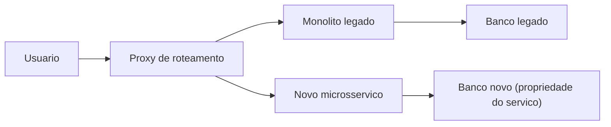
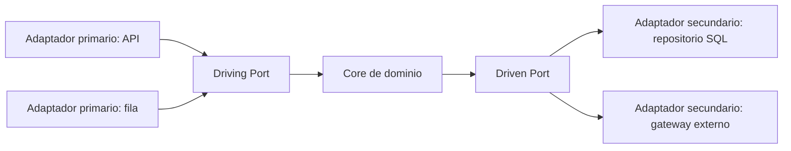
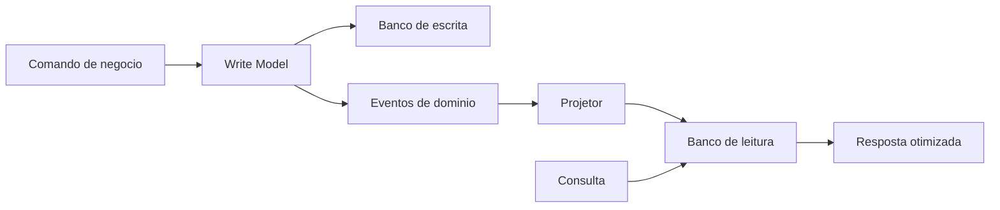
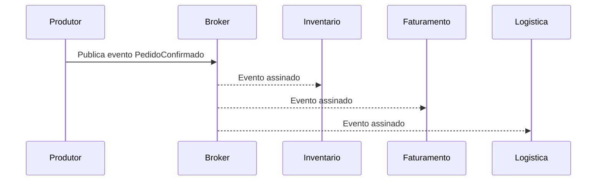
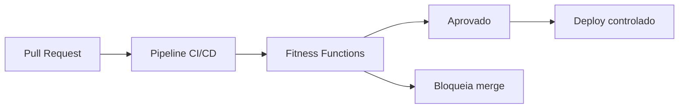

# **लवचीक प्रणाली तयार करप: इव्हेंट-ड्रायव्हन आर्किटेक्चर आनी सीक्यूआरएस हांचे फाटलें वेवसायीक मोल**

## **रणनीती आधुनिकीकरणाची अनिवार्यता**

समकालीन डिजिटल परिस्थितींत, सॉफ्टवॅर वास्तुकलेची चपळाय फकत तंत्रीक कार्यक्षमताय आडखळून स्वताक एक प्राथमीक स्पर्धात्मक भेदक आनी वेवसाय जिवीत उरपा खातीर एक अत्यावश्यक म्हणून एकठांय करता. उद्देगां मदल्या संघटणांक नवें करपाक, अस्थिर बाजारांतल्या मागणींक अनुकूल करपाक आनी रियल-टायम वापरप्यांचे अणभव दिवपाक अनिवार्य दबावाक तोंड दिवचें पडटा. पूण हो प्रवेग दायज मुळाव्या साधनसुविधांच्या वास्तवाकडेन हिंसकपणान टकराव करता. दशकां आदीं बांदिल्लीं प्रणालीं कॉर्पोरेट एंकरांभशेन काम करतात: तीं अनवचीक, सांबाळपाक धोक्याची खर्चीक आसतात आनी चड करून आधुनीक एकत्रीकरणा आनी स्केलिंग गरजांकडेन जुळनात. तंत्रज्ञान संचालक (सीटीओ) आनी तंत्रीक लीड्स (टेक लीड्स) खातीर, ह्या प्रणालींचें प्रशासन कामगिरीच्या अडचणीं आड, दीर्घकाळ चलपी अंमलबजावणी चक्रां आनी घुस्मटमार करपी तंत्रीक रिणा आड दिसपट्ट्या संघर्शांत रुपांतरीत जाता.

दायजी अनुप्रयोगांचें आधुनिकीकरण आतां रणनिती मोलाचें अनलॉक करप अशें समजून घेवपासारकें शुध्द कार्यकारी खर्च केंद्र म्हणून दिसना. एकवटीत प्रणाली, जंय वापरपी संवाद, वेवसायीक तर्कशास्त्र आनी डेटा प्रवेश थर अंतर्गतपणान जोडिल्ले आसतात आनी एकाच प्रक्रियेंत चलतात, स्केलिंग गरजेच्या वेळार खर मर्यादा सादर करतात. घट्ट जोडणी सांगता की एकाच कार्यक्षमतेक चड संगणन शक्तीची गरज आसल्यार पुराय ऍप्लिकेशनाची प्रतिकृती करची पडटली, जाका लागून मेघ संसाधनांची चिरकालीन वाड जाता. चड करून, एकवटीत वास्तुकला अपयशांची "स्फोट त्रिज्या" प्रवर्धित करता: अहवाल मॉड्यूलांतली त्रुटी सर्वर मेमरी सोंपोवंक शकता, जी गंभीर फारीकणी प्रक्रिया प्रणाली सकयल हाडटा.

प्रतिक्रियाशील, मॉड्यूलर आनी उत्क्रांती वास्तुकलेकडेन संक्रमण — इव्हेंट-ड्रायव्हन आर्किटेक्चर (EDA), कमांड आनी क्वेरी रिस्पॉन्सिबिलिटी सेग्रेगेशन (CQRS), आनी हेक्सागोनल आर्किटेक्चर (Ports & Adapters) हांचेर खासा भर दिवन — ह्या वास्तुशिल्प विकृततायेखातीर पद्दतशीर वखद प्रस्तावीत करता. पूण ह्या प्रवासांत फकत कोड बरोवपाच्या मळार न्हय, तर संघटना सॉफ्टवॅर अभियांत्रिकी एक अर्थीक मालमत्ता म्हणून पळोवपाचे पद्दतींत आनी तांच्या पंगडांची आनी कार्यकारी प्रक्रियांची रचणूक करपाचे पद्दतींत खोलायेन प्रतिमानांत बदल करपाची गरज आसा.

## **आधुनिकीकरणाचें अर्थशास्त्र: तंत्रीक रिण आनी गुंतवणूक परतावो (आरओआय) मेजप**

स्फटिकीकृत वास्तुकलेंतल्यान जटिल वितरीत मॉडेलांत वचपाक न्याय दिवपाखातीर तंत्रीक फुडारपणान फायदे आकर्शक अर्थीक भाशेंत मांडचे पडटात. तंत्रीक रिणाक अमूर्त अभियांत्रिकी संकल्पना म्हणून मानूंक फावना, पूण संघटणेच्या ताळेबंदांचेर खरी अर्थीक देयता म्हणून प्रमाणीत करचें न्हय, संहितेच्या दर्ज्याच्या उणाव, प्रणाली अपयशी जावप, विकासाची गती ना जावप आनी पंगड बर्नआउट हांचे वरवीं "व्याज" एकठांय करप.

आधुनिकीकरणाच्या उपक्रमांतल्या गुंतवणूक परताव्याचें (आरओआय) मुल्यांकन करपाक सद्याचे स्थितीचें न्यायालयीन विश्लेशण करचें पडटा. दोन दशकां पोरणी उद्देगीक संसाधन नियोजन (ईआरपी) प्रणाली चलोवपी म्हामंडळाची सामान्य परिस्थिती पळयात. हे प्रणालीकडेन संबंदीत वर्सुकी खर्च चड करून शेंकड्यांनी हजारांनी डॉलर परस चड आसता, तातूंत कालबाह्य सॉफ्टवॅर सांबाळपा खातीर व्हड प्रमाणांत विक्रेत्या आदार शुल्क, अनियोजीत डाउनटायमाक बांदिल्लो संद खर्च आनी समजूंक शकना अशा कोड बेसा कडेन झगडपी अभियंत्यांक व्हड प्रमाणांत गमावपी उत्पादकता हांचो आस्पाव जाता.

आधुनिकीकरणाच्या परिणामाचें प्रमाण थारायतना संघटना चड करून परिवर्तनकारी अर्थीक मेट्रीक पळयतात. आधुनिकीकरण रणनिती चालीक लायिल्ल्या भलायकी जतनाय संघटनांनी तीन वर्सांत 206% आरओआय मेळयलो, जातूंत स म्हयन्यां परस उण्या काळांत पेबॅक काळ जालो. आयटी ऑपरेशन्स पंगडांच्या उत्पादकतायेंत 30% थेट वाड जाल्ल्यान हे परिणाम शक्य जाले. जोखीम कमी करप हें भयानक अर्थीक फायद्यांतूय रुपांतरीत जाता: अभ्यासांतल्यान सुरक्षा उल्लंघनाच्या संपर्कांत येवपांत 50% उणाव आनी स्वयंचलीत प्रक्रिया वरवीं नियामक पालन खर्च उणो जाल्ल्याचें दिसून येता.

### **गती मेट्रीक आनी मूल्यांकन क्षितीज**

आधुनिकीकरणाचो सगळ्यांत म्हत्वाचो परिणाम उदरगतीच्या वेगांत जावपी व्यापक वाडांतल्यान दिसून येता. संघटनांक चड करून बऱ्या व्याख्या केल्ल्या मायक्रोसर्व्हिसांचेर आदारीत आर्किटेक्चर एकठांय केल्या उपरांत नव्या कार्यक्षमतायचो वितरण दर दुप्पट वा तिप्पट दिसता. हाका लागून त्याच अभियंतो काउंटाक वेपारी मोलांत चड प्रमाणांत ऑर्डर दिवपाक मेळटा, जाका लागून *बाजारांत येवपाचो वेळ* सामकोच उणो जाता. जर एक सर्तक ताच्या इव्हेंट-आदारीत वास्तुकले खातीर दोन सप्तकांत नवी क्षमता सुरू करूंक शकता, जाल्यार तुमच्या संघटणेक नाजूक मोनोलिथ बदलपाक तीन म्हयने लागतात जाल्यार, आधुनिकीकरणाचे फायदे खर्च बचती परस खूब चड आसतात, ताचो थेट परिणाम बाजारपेठेचेर आनी येणावळीचेर जाता.

पूण हो आरओआय आर्टिकुलेशन करपाक मापशास्त्रीय खरसाण जाय पडटा. परिवर्तन प्रकल्पांतलो मुखेल दोश म्हळ्यार आधुनिकीकरण सुरू जावचे पयलीं धरून घेतिल्लीं खर मुळावीं रेखांशनां नाशिल्ल्यान. फुडारपणान आधुनिकीकरणा पयलीं उण्यांत उणें तीन म्हयन्यां खातीर उपयोजन वारंवारता, *मुखेल वेळ*, पुनर्प्राप्ती मेरेनचो सरासरी वेळ (एमटीटीआर), दोश दर आनी दाणेदार मुळाव्या साधनसुविधा खर्चाचें दस्तावेजीकरण करचें पडटलें.

| आधुनिकीकरणाचो टप्पो | खर्च गतीविज्ञान | आरओआयचेर परिणाम (क्षितीज 3-5 वर्सां) |
| :---- | :---- | :---- |
| **वर्स: संक्रमण** | सगळ्यांत उंचेलें. समांतर रितीन पुनर्अभियांत्रिकी यत्न आनी मुळाव्या साधनसुविधांचो खर्च (Legacy \+ New Systems). | नकारात्मक. भांडवल सघन गुंतवणूक. |
| **वर्स: ऑप्टिमायझेशन** | सरासरी. दृष्टांत आकार बदलप आनी दायज फेज-आउट. | ब्रेकइव्हन हें नांव. गती आनी लवचीकपणांतलो फायदो संक्रमण खर्चा परस चड जावंक लागता. |
| **वर्स 3 ते: स्थिर स्थिती** | कमी. शुध्द वापराचेर आदारीत मुळावी बांदावळ (*pay-as-you-go*) आनी उच्च ऑटोमेशन. | व्हड प्रमाणांत परतावो (200% ते 304%). एकूण चपळाय. |

मुळाव्या साधनसुविधा निर्णयांचें आनी मेघ प्लॅटफॉर्म बदलांचें अर्थीक मूल्यमापन 12 म्हयन्यांच्या जनेलां वयल्यान जावंक फावना. ल्हान क्षितीजाचेर समांतरतायेच्या खर्चाक लागून खंयचेंय स्थलांतर अशक्य दिसता. पूण तिसऱ्या ते पांचव्या वर्सा खातीर खर्चाचो अदमास काडटना अर्थीक वळणदार बिंदू स्पश्ट जाता, जाका लागून आधुनिकीकरण ही दीर्घ काळांत सगळ्यांत चड निरपेक्ष मोल आशिल्ली तंत्रीक गुंतवणूक अशें दिसून येता.

## **विघटन रणनीती: व्यत्यय नासतना मोनोलिथाचें विघटन**

एकदां स्थलांतर थारायल्या उपरांत आनी डेटा चालीक लायिल्ल्या वेवसायीक प्रकरणांतल्यान अर्थसंकल्प सुरक्षीत केल्या उपरांत, सद्याच्या कार्यावळींत खंड पडनासतना बदल कार्यान्वीत करप हें मुखेल तंत्रीक आव्हान. "बिग बॅंग" पद्दत-जो बंद दारां फाटल्यान पुराय प्रणाली परतून बरोवप आनी सप्तकाच्या शेवटाक देखरेखीच्या जनेला मदीं सगळी येरादारी बदलपाची विधी दिता-उद्देगांतली सगळ्यांत चड जोखीम आनी अपेस दर रणनीती म्हणून सार्वत्रिकपणान मान्यताय मेळ्ळ्या.

हो धोको उणो करपाक *शून्य डाउनटायम* उपलब्धताय एक बिगर वाटाघाटी करपाक येवपी मर्यादा म्हणून मानपी वाडपी स्थलांतर मानक खरपणान आपणावपाची गरज आसा.

**आकृती: स्ट्रॅंगलर अंजीर घेवन वाडत वचपी विघटन**


### **द स्ट्रॅंगलर फिग पॅटर्न आनी डोमेन-ड्रायव्हन डिझायन (डीडीडी)**

दायज प्रणाली सुरक्षीतपणान गळो घालपाची निश्र्चीत पद्दत म्हळ्यार *स्ट्रॅंगलर फिग* पॅटर्न. हे रणनितींत पोरन्या प्रणालीच्या परिधिचेर नव्या सूक्ष्मसेवांचो विकास करपाचो प्रस्ताव आसा. एक मार्ग थर (प्रॉक्सी) येवपी सगळ्या विनंतींक आडायता; विनंती केल्ली कार्यक्षमताय पयलींच स्थलांतरीत केल्या जाल्यार, विनंती नव्या मायक्रोसर्व्हिसाचेर निर्देशीत जाता; नाजाल्यार ताका परतून मोनोलिथांत व्हरतात.

हो नमुनो चालीक लावपाक मोनोलिथाचेर नवी उदरगत (वैशिश्ट्य गोठण) थांबवची पडटा, जाका लागून खंयचीय नवी वेवसायीक क्षमता नव्या वास्तुकलेचेर उबारपाक लायतात. उपरांत काडपाच्या उमेदवारांची वळख *डोमेन-ड्रायव्हन डिझायन* (डीडीडी) ह्या तत्वां प्रमाण मार्गदर्शन करतात. DDD सांगता की मायक्रोसर्व्हिस तंत्रीक थरांनी विभाजीत करूंक फावना (डेटाबेसा खातीर एक सेवा, एक UI खातीर, एक वेवसायीक नेमा खातीर), पूण ताचे परस "कॅटलॉग वेवस्थापन" वा "फारीकणी प्रक्रिया" सारकिल्या मूर्त वेवसायीक क्षमतांचें प्रतिनिधित्व करपी "सीमीत संदर्भ" भोंवतणी उबे कातरून काडचे. खर एकसुरेपणाक लागून दर एका संदर्भाक आपली भाशेची सर्वव्यापीताय व्याख्या करपाक मेळटा आनी ताच्या जिवीत चक्राचेर स्वायत्तता आसता.

सूक्ष्मसेवा विघटन करपाक डीडीडीची पुराय गरज म्हळ्यार विकेंद्रीत डेटा मालकी. मायक्रोसर्व्हिसाची ताच्या डेटाबेसाची एकमेव मालकी आसूंक जाय, तो एकमेव घटक आसून ताका ताच्या येवजणेंत थेट बरोवपाक मेळटा. डझनभर सेवांनी ऍप्लिकेशन तर्क काडपाची हानीकारक पद्दत सगळे वांटून घेतिल्ल्या एकवटीत संबंदीत डेटाबेसाक जोडणी चालू दवरतात, "वितरीत एकवटीत" विरोधी नमुनो तयार करता, जो नेटवर्क सुप्ततायेचे सगळ्यांत वायट गुणधर्म आनी वैयक्तीक घटकांक वेगळेपणान स्केल करपाक असमर्थताय एकठांय करता.

### **गंभीर डेटा स्थलांतर आनी सावळी येरादारी**

डेटाबेस डिकॉप्लिंग हें प्रक्रियेंतलें सगळ्यांत भयानक तंत्रीक आव्हान दाखयता. उच्च वेव्हारीकतेक आदार दिवपी गंभीर स्थलांतरां खातीर, सादी ऑफलायन प्रत करप सोंसपासारकें ना. अत्याधुनीक येवजण उत्क्रांती रणनितीची गरज आसा, जाका लागून डेटाबेस एकाच वेळार आवृत्ती N (दायज) आनी आवृत्ती N+1 (नवी) दोनूय सेवा दिवंक शकता.

सावळी कोश्टक स्थलांतर यंत्रणा आनी येरादारी मिररिंग म्हत्वाची आसा. सावळी येरादारी ऍप्लिकेशन सर्वर वा डिव्हायसा वरवीं चालीक लावंक शकता. सर्वर-आदारीत प्रतिमानांत, मार्ग सेवा येवपी उत्पादन विनंतींचो ओगीच क्लोन करता, एक प्रत दायजी मुळाव्या संरचनेक आनी दुसरी सारकी प्रत (चड करून सहसंबंदाखातीर खाशेले वळखपी आसतात) नव्या पुनर्बरयल्ल्या प्रणालीक फुडें धाडटा. दायज सर्वर वापरप्याची सेवा करता, जाल्यार नव्या सेवेन निर्माण केल्ले प्रतिसाद आनी दुश्परिणाम दायजी परिणामां आड अतुल्यकालिक रितीन नोंद करतात आनी प्रमाणीत करतात. हो मानक तुमकां निमाण्या वापरप्याक धोक्यांत घालनासतना अचूक उत्पादन परिस्थितींत नवो डोमेन तर्क पुरायपणान प्रमाणीत करपाक परवानगी दिता. नव्या सेवे खातीर निश्र्चीत कटओव्हर फकत तेन्नाच जाता जेन्ना राज्य आनी कामगिरी समता सांख्यिकी नदरेन सिध्द जाता आनी येवजण्यो पुरायपणान समन्वयीत जातात.

*Leave-and-Layer* नमुनो ह्या संदर्भांत उत्कृश्ट लागू करपाची तांक दाखयता. दायज ऍप्लिकेशन सुटसुटीतपणान चलत आसा, गिरायकांक खंड पडनासतना सेवा दिता. ताका पातळ घडणूक प्रकाशन थर जोडिल्लो आसता (चड करून डेटाबेस पातळेचेर बदल डेटा कॅप्चर \- डेटा कॅप्चर बदलात, वा CDC, वापरून), राज्य बदल घडणुको केंद्रीकृत बसाक (देखीक AWS EventBridge) उत्सर्जीत करता. नवी वेवसायीक तर्क आनी आधुनीक सेवा अद्ययावत वापरपा खातीर हे बशीची सदस्यताय घेतात, स्त्रोत प्रणालीच्या उपलब्धतेचेर केन्नाच परिणाम करिनासतना केंद्रीय डेटाबेसा वांगडा अतुल्यकालिकपणान एकठांय करतात.

## **डोमेन तर्क वेगळो करप: षटकोनी वास्तुकलेचें वर्चस्व (पोर्ट आनी अडॅप्टर)**

मोनोलिथांतल्यान काडिल्ल्या डोमेनाक शोशून घेवपाखातीर नवी सूक्ष्मसेवा जल्माक येतनाच अंतर्गत क्षय आनी झुजपाखातीर तंत्रीक रिणाचो मुखेल वाहक म्हळ्यार तंत्रीक जोडणी. परंपरेन, ऍप्लिकेशन चौकटी कोड डिझायन चालीक लायताली: जटिल वेवसायीक तर्क HTTP वेब नियंत्रकांत घातक रितीन "लीक" जाताले, वा बिलिंग नेम थेट वस्तू-संबंदीत मॅपर (ORM) अस्तित्व टिपणींत कोड केल्ले. ह्या भोळें थरयल्ल्या वास्तुकलेचो परिणाम म्हणून (जंय वेवसाय तर्क थेट डेटाबेस थराचेर आदारून आसता), डेटाबेस विक्रेत्यांत बदल वा वेब चौकटी अद्ययावत करपाक मुळावे वेवसायीक नेम परतून बरोवचे पडटले.

उपरांत अॅलिस्टर कॉकबर्न हाणें हेक्सागोनल आर्किटेक्चर अशें नांव दिल्लें पोर्ट्स अँड अॅडॅप्टर्स आर्किटेक्चर तंत्रीक रोगप्रतिकार शक्तीची संरचनात्मक जाप म्हणून उदेता. ताचो केंद्रीय प्रस्ताव विध्वंसक सादो आसा: उपेग हो वेवस्थेचो केंद्रीय आनी स्वतंत्र कृत्रिम वस्तू आसूंक जाय. तो वेब वापरप्यांनी, एपीआय कॉलांनी, विस्तारान स्वयंचलीत चांचणी, वा बॅच स्क्रिप्टांनी सारकेच नियंत्रीत करपाक सक्षम आसूंक जाय, तेच बरोबर पुरायपणान वेगळो आनी ताच्या रनटायम साधनां आनी डेटाबेस तंत्रज्ञानां विशीं विस्मृत उरपाक जाय. "षटकोन" स वटांनी मर्यादा दाखोवंक ना, पूण टोपोलॉजिकल रितीन दाखयता की सॉफ्टवॅरांत जायते मनमानी स्वतंत्र इनपुट आनी आउटपुट बिंदू आसूं येतात.

**आकृती: षटकोनी वास्तुकला (पोर्ट्स आनी अडॅप्टर)**


### **अमूर्ततायेची शरीररचना: पोर्ट, प्राथमिक आनी माध्यमिक अडॅप्टर**

षटकोनी वास्तुकलेचें केंद्रीय तत्व म्हळ्यार अवलंबन उलटपणा, जें खरपणान भायल्यान काम करता हातूंत: सगळे भायले तंत्रीक आनी मुळावी बांदावळ थर फकत अंतर्गत वेवसायीक थराचेर (कोर) आदारून आसूंक जाय, पूण कोर केन्नाच खंयच्याय भायल्या तपशीलाचेर आदारून आसूंक फावना. हें भयानक कॅप्सूलीकरण दोन म्हत्वाचीं संकल्पना स्थापन करून साध्य जाता: १.

1. **पोर्ट:** ऍप्लिकेशन भायल्या संवसारांत कशी संवाद सादता हाची व्याख्या करपी कंत्राटांचें प्रतिनिधित्व करतात (चड करून प्रोग्रामिंग भाशांनी अमूर्त संवाद म्हणून चालीक लायतात). वेवसायीक तर्कशास्त्र ह्या बंदरां वरवीं ताका कितें मेळोवपाक वा धाडपाक जाय तें खरें जाहीर करता, गिरायक-अज्ञेयवादी पद्दतीन. पोर्टांचे *ड्रायव्हिंग पोर्ट* (ऍप्लिकेशन दिवपी वापर प्रकरणां उक्ते करपी संवाद) आनी *ड्रायव्हन पोर्ट* (एप्लिकेशनाक भायल्या संवसारांतल्यान जाय आशिल्लीं सेवां जाय आशिल्लीं संवादां, जशीं डेटा सांठोवप) अशी विभागणी केल्या.  
2. **अडॅप्टर:** हे ठोस घटक आसतात जे ऍप्लिकेशनाच्या भायर रिंगांत रावतात, विशिश्ट तंत्रज्ञान प्रोटोकॉलांची घाण भास आनी डोमेनाची शुध्द भास हांचे मदीं अणकारपी म्हणून काम करतात.  
   * **प्राथमिक अडॅप्टर (ड्रायविंग / इनबाउंड):** ते संकल्पनात्मक षटकोनाचे उजवे वटेन मेळटात, ऍप्लिकेशन सक्रिय करतात. RESTful HTTP नियंत्रक, GraphQL हॅन्डलर, RabbitMQ रांक आयकपी, वा CLI संवाद हे प्राथमीक अडॅप्टर आसात. तांकां तंत्रीक उत्तेजन मेळटा, तो उगडटा आनी *ड्रायविंग पोर्ट* (इंजेक्शन केल्लो वापर केस) आवाहन करतात.  
   * **दुय्यम अडॅप्टर (Driven / Outbound):** ते उजवे वटेन मेळटात, भायल्या संवसारांत दुश्परिणाम चालीक लावपा खातीर ऍप्लिकेशनान नियंत्रीत करतात. ORM वरवीं SQL जोडणी, तिसऱ्या पक्षाच्या API कडेन कॉल करपा खातीर क्लायंट (देखीक फारीकणी गेटवे), वा Kafka विशयांतले इव्हेंट प्रकाशक. डोमेन *Driven Port* (देखीक, IReposittorioDePagamento) कॉल करता, आनी अवलंबन इंजेक्शन, रन वेळार, ऑपरेशन करपी ठोस अडॅप्टर (देखीक, AdaptadorDePagamentoStripe) पुरवण करता.

### **एकसुरेपण आनी चांचणीक्षमतायचें अमाप वेवसायीक मोल**

सीटीओ खातीर, ही वास्तुकला आपणावपा कडेन संबंदीत जोखीम कमी करप सुरवातीच्या पंगड शिकपाच्या वक्र खर्चा परस चड आसता. मुखेल मूर्त फायदो म्हळ्यार उच्च-निश्ठा स्वयंचलीत चांचणी कव्हरेजाच्या व्हड प्रमाणांत गती दिवप.

परंपरीक वास्तुकलेंत, खरेदी प्रक्रिया तर्कशास्त्राची चांचणी करपाक खऱ्या डेटाबेसाची आनी पुराय वेब सर्वर झाडाची दृष्टांतीकरणाची गरज आसता, जाका लागून एकठांय करपाच्यो चांचण्यो मंद (मिनिटां ते वरां) जातात, जी सतत एकठांय करप आनी सतत उपयोजन (CI/CD) पद्दतींचो गळो घालता. षटकोनी वास्तुशास्त्रा वरवीं अभियांत्रिकी पंगड स्मृतींतल्या दुय्यम बंदरांपसून एकदम वेगळे केल्ले अनुकरण (*मॉक्स* वा *स्टब*) तयार करूंक शकता. अशे तरेन, डोमेन नेमाच्या सगळ्या क्रमविकासांचो आस्पाव आशिल्ल्या हजारांनी जटिल वेवसायीक परिस्थितींची, केन्नाच प्रत्यक्ष डेटाबेस कंटेनराची सुरवात करिनासतना, निश्र्चित विस्वासांतल्यान, मिलीसेकंदांत चांचणी करूं येता.

ते भायर, वास्तुकला *Vendor Lock-In* (मेघ पुरवणदारांनी लादिल्लें तंत्रीक लॉक-इन) आड सर्वोच्च संरक्षण दिता. जर मंडळाचो निर्णय परवानो कारणांक लागून Apache Solr-आधारीत सोद सेवा Elasticsearch कडेन स्थलांतर करपाक आज्ञा करता जाल्यार, पुनर्अभियांत्रिकी यत्न फकत सद्याचो सोद पोर्ट चालीक लावपी नव्या Elasticsearch दुय्यम अडॅप्टराच्या विकासा मेरेन मर्यादीत आसा. सोद, परिणाम प्रक्रिया, आनी सुरक्षा नेम लागू करपी वेवसायीक वापर प्रकरणांचो व्हड थर पुरायपणान आनी दाखोवपा सारको अस्पृश्य उरतलो, जाका लागून प्रकल्प सुरक्षीत कार्यान्वयनाच्या म्हयन्यां वयल्यान सप्तकां मेरेन उणो जातलो.

## **वाचप आनी बरोवपाची अडचण सोडोवप: सीक्यूआरएस वरवीं वेगळेपण**

हेक्सागोनल आर्किटेक्चर जरी कोडाक तंत्रीक जोडणीपसून राखण दिता तरी परिपक्व वेवसायीक प्रणालींत आशिल्ली वेव्हारीक रचना डेटा सांठवणांत व्हड प्रमाणांत कार्यक्षमताय अडचणी निर्माण करता. सर्वव्यापी CRUD (निर्मिती, वाचप, अद्ययावत करप, काडून उडोवप) नमुनो डोमेन घटकाचें तेंच संरचनात्मक प्रतिनिधीत्व हाताळटा-तेंच संबंदीत डेटाबेस मॉडेल-मुळावी कृती बारीक-कणदार शिल्लक अद्ययावत वा व्हड एकत्रीत अर्थीक अहवाल क्वेरी आसूं.

एंटरप्रायझ सॉफ्टवॅर स्केल करतना, वेव्हारीक गरजां (बरोवप) व्हिज्युअलायझेशन गरजां (वाचता) कडेन खर सर्त करतात हें स्पश्ट जाता. सॉफ्टवॅर उद्देगांतली असममित स्केलिंग ही एक न्हयकारूंक शकना अशी वास्तवताय: आर्विल्ल्या अनुप्रयोगांतले भोवतेक ऍप्लिकेशनां अशा दरांची सेवा करतात जंय वाचपाचो खंड राज्य उत्परिवर्तनाच्या खंडापरस धा वा शेंकड्यांनी पटींनी चड आसता (बरयता). एकाच मॉडेलांत (एकच डेटा स्टोर) ह्या एकाच वेळार जावपी भारांक लागून, डेटाबेसाक लॉक वाद, विरोधी अनुक्रमणिका आनी प्रतिसादांत आपत्तीजनक क्षय जाता.

CQRS मानक (*आदेश क्वेरी जापसालदारकी वेगळेपण*) डेटा मॉडेलाक मुद्दाम भग्न करता, प्रणालीची स्थिती बदलपी वास्तुशिल्प प्रवाह आनी ताका क्वेरी करपी प्रवाह निरपेक्ष समांतर अस्तित्वांत आसूंक जाय आनी वेगवेगळे अनुकूल करपाक जाय अशें जाहीर करता.

**आकृती: प्रक्षेपणां सयत सीक्यूआरएस प्रवाह**


सचित्र (TypeScript): एकूच वापर प्रकरण उत्परिवर्तन हेतू (आदेश) दुश्परिणाम नासतना वाचपा पासून वेगळो करता.

```typescript
// Comando de escrita — valida invariantes e persiste no write model
type ConfirmarEmbarque = { pedidoId: string; sku: string };

async function handleConfirmarEmbarque(cmd: ConfirmarEmbarque): Promise<void> {
  // regras de domínio + emissão de eventos para projeções
}

// Consulta — apenas leitura do read model (desnormalizado)
type ResumoPedido = { pedidoId: string; status: string; total: number };

async function obterResumoPedido(pedidoId: string): Promise<ResumoPedido> {
  return readStore.buscarPorId(pedidoId); // sem JOINs pesados na hora
}
```
### **मॉडेल द्विविधताय: आदेश विरुद्ध क्वेरी**

सीक्यूआरएस आपणावपा खातीर खर आनी हेतून येरादारी मॉडेलिंग करचें पडटा:

* **आदेश बाजू (The Writing Model):** प्रणालींत टिकून उरिल्लो डेटा बदलपी कार्यावळींचेर प्रक्रिया करपाक ती खरपणान तयार केल्ली आसा. तंत्रीक क्षेत्रांचेर आदारीत अॅनीमिक अद्ययावतां बदला (देखीक UPDATE स्थिती \= 2), आदेश गिरेस्त अर्थीक वेवसायीक हेतू (देखीक ConfirmProductShipping) कॅप्सूल करतात. लेखन मॉडेल हें डोमेनाच्या नेम आनी अपरिवर्तनीयांचें खर राखणदार आसता; तो जटिल सुरक्षा प्रमाणीकरण एकठांय करता आनी शुध्द वेव्हारीक अखंडते खातीर (ACID हमी) अनुकूल केल्लो आसता, सादारणपणान अद्ययावत विसंगती ना करपाखातीर तिसऱ्या सामान्य फॉर्मांत (3NF) चड सामान्यीकृत डेटा वाटप करता.  
* **क्वेरी सायड (द रीडिंग मॉडेल):** हाचे उरफाटें, तो कसलेच स्थिती बदल करिना. ताचो एकूच हेतू म्हळ्यार खूब व्हड गतीचेर म्हायती परत मेळोवप आनी डोमेन तर्कशास्त्राचे नाका आशिल्ले कुडके नासतना वापरप्याच्या संवादाक योग्य रितीन स्वरूपीत करप. वाचपाच्या मॉडेलाखातीर डेटाबेस ऑप्टिमायझेशनांक खर विसामान्य केल्ली येवजण पसंत करतात, चड करून क्वेरी कार्यान्वयन करतना खर्चीक एकठांय करप वा जोडणी कार्यावळी (*JOINs*) टाळपाखातीर जटिल अस्तित्वांक "सपाट" करतात.

### **भौतिक प्रक्षेपण आनी अदमती कामगिरी**

CQRS मानकान दिल्लो टर्मिनल मापनक्षमता फायदो जेन्ना मॉडेल फकत कोडांत तार्कीक रितीन वेगळे केल्ले नात, पूण भौतिक रितीन वेगवेगळ्या डेटाबेसांत वेगळे केल्ले आसतात तेन्ना साकार जाता. बरोवपाचें मॉडेल खर अणुकेंद्रीय पालन करपाक योग्य अशा मांसाळ संबंदीत डेटाबेस क्लस्टरांत (देखीक PostgreSQL) रावूं येता, जाल्यार वाचन मॉडेल हायपर-स्केल करपाक येवपी दस्तावेज बेस (देखीक MongoDB) वा मजकूर सोदाखातीर अनुकूल केल्लो अनुक्रमणिका (देखीक Elasticsearch) आसूं येता.

हे भौतिक वेगळेपणाक लागून जटिल क्वेरींतली सुप्तताय ना करपाक **प्रोजेक्शन मटेरियलायझेशन** वापरप शक्य जाता. CQRS नाशिल्ल्या एकवटीत प्रणालींत, "एकत्रीत गिरायक डॅशबोर्ड" तयार करपाची गरज इतिहासीक ऑर्डर, बिलिंग स्थिती, आदार तिकीटां संबंदीत डझनभर कोश्टकांक जोडपी (*JOIN*) जटिल विनंती मागता, दर खेपे पान लोड जातकच, दरेक भेटी वांगडा व्हड प्रमाणांत डिस्क I/O वेळ खाता आनी खरेदी करपाचो यत्न करपी वापरप्यांचेर परिणाम करता.

सीक्यूआरएस आनी अदमासां वांगडा, श्रमीक गणना “मागणें प्रमाण” जायना. जशें जशें अद्ययावत वा वैयक्तीक खरेदी (घटना) फाटभूंयेर घडटा, नित्यनेम हे बदल आयकतात आनी पुनरावर्तनात्मक रितीन घडणुकेचें डॅशबोर्डाच्या पयलींच प्रक्रिया केल्ल्या तुकड्यांत रुपांतर करतात. हे पूर्व-गणीत केल्ले (सामग्री) दस्तावेज वाचन मॉडेलांत ओगीच अद्ययावत करतात. जेन्ना वापरपी प्रत्यक्षांत डॅशबोर्डांत प्रवेश करता, तेन्ना वाचन मॉडेल प्राथमीक कळये खातीर सादो आनी उण्या संगणकीय खर्चाचो सोद करता, क्षणांत एकत्रीत परिणाम मेळयता आनी मायक्रोसेकंदाच्या प्रतिसाद वेळार परतता. बरोवपाचें मॉडेल शुध्दपणान वेव्हार कार्यप्रदर्शनाचेर (बरोवपाचें थ्रूपुट) लक्ष केंद्रीत करता आनी वाचपाचें मॉडेल खंयचेच परिस्थितींत बरोवपाचेर भार घालना.

| वैशिश्ट्य | एकांकी नमुनो (क्लासिक सीआरयूडी) | वेगळे केल्लो मानक (भौतिक अदमास आशिल्लो सीक्यूआरएस) |
| :---- | :---- | :---- |
| **डेटाबेस वास्तुकला** | एकूच, ​​चड जोडिल्ली येवजण. | वेगवेगळीं बँको; उद्देशा प्रमाण येवजण्यो. |
| **वाचतना डेटा मेळप** | जटिल *JOINs* ची ऑन-द-फ्लाय कार्यान्वयन. | पूर्व गणीत केल्ल्या आनी विसामान्य केल्ल्या दस्तावेजांची सादी वसुली. |
| **मुळावी बांदावळ परिमाणीकरण** | सक्तीचें खर्चीक उबें स्केलिंग; अडचणींचो भेद करप अशक्यताय. | असममित स्केलिंग (फकत वाचपी सर्वर कापडाची अनंत आडवी मापनक्षमता). |
| **संहिता गुंतागुंत** | सादरीकरण तर्क राक्षस ORM वरवीं अद्ययावत नेमांत लीक जाता. | क्रूरपणान वेगळेपण; वेवसायीक हेतूचेर आदारीत शुध्द आदेश विरुद्ध सोंपेपणान वसुली. |

### **अंतिम सुसंगती ट्रेड-ऑफ**

ही अत्याधुनीक वास्तुकलेची निवड करपी सीटीओ आनी टेक लीड्सांनी आपलो मुळावो वेपार-विनिमय अनिवार्यपणान समजून घेवचो आनी वेवस्थापन करचो पडटलो: **निमाणो सुसंगती**. प्रवाहांचें विच्छेदन म्हणल्यार रेकॉर्डिंग मॉडेलाक यशस्वीपणान केल्लें अद्ययावत सगळ्या प्रकरणांत व्हिज्युअलायझेशन थरांत क्षणार्धांत प्रसारीत जायना.

आदेश डेटाची प्रतिकृती विसामान्य क्वेरी डेटाचेर सुप्तताय लादता जी मिलीसेकंदां ते सेकंदां मेरेन आसूं येता. ताका लागून, वापरपी संवाद वेव्हारीक बदल रेकॉर्ड करूंक शकता पूण रोखडेंच उपरांतच्या वाचनाचेर कळाव जाल्लो रेकॉर्ड दाखोवंक शकता. ह्या क्षणिक "ग्राहक अंतराक" सहिष्णुताय साधनां वापरपा खातीर मनीस संवाद (Frontend) विकसीत करपाची गरज आसता, मागीर ती विनंती आशावादी दृश्य प्रतिसादांनी वेशभूषा करप, डेटाचेर प्रक्रिया जाता हाची म्हायती दिवप वा थोड्या अंतरां खातीर रिलोड करपाक सक्ती करप (अनुकूल मतदान). अत्यंत कडक अर्थीक संस्था समांतर ईडीए वास्तुकलेंत भरपाय यंत्रणा तयार करून गंभीर मिलीसेकंदां भितर अचूक निमाणें समन्वय सुनिश्चीत करून ही सुप्तताय आडखळ मात करतात. भौतिक रितीन वितरीत केल्ल्या प्रणालींत झटपट समन्वय ना आनी सीक्यूआरएस म्हत्वाच्या दोन फेज वितरीत लॉकिंग येवजणेवरवीं (2-फेज कमिट) ताका दामचे बदला अंतर्निहित असमकालिकताय आपणायता.

## **द एंटरप्रायझ तंत्रिका तंत्र: इव्हेंट-ड्रायव्हन आर्किटेक्चर (ईडीए)**

प्रमाणांतल्या सीक्यूआरएस मॉडेलाची अतुलनीय परिणामकारकता अंतर्गतपणान लेखन बाजू आनी वाचन बाजू हांचेमदलें समन्वय कशें जाता हाचेर आदारून आसता. ह्या स्वतंत्र डोमेनांमदीं राज्य बदलांचें विनाशिल संक्रमण सक्षम करपी म्हत्वाचें तंत्रज्ञान, समकालिक अवलंबन अडचणी निर्माण करिनासतना, इव्हेंट-ड्रायव्हन आर्किटेक्चर (EDA) आसा.

बिगर-इव्हेंट-आदारीत प्रणालींत, जेन्ना ऑर्डर सेवा ई-कॉमर्स चेकआउट प्रक्रिया करता, तेन्ना ती इन्व्हेंट्री सेवा (इन्व्हेंट्री उणी करपाक), बिलिंग सेवा (बिलिंग तयार करपाक) आनी लॉजिस्टीक सेवा (उत्पादन धाडपाक) कडेन थेट HTTP समकालिक आदेश सुरू करता. ही खोल साखळी (आरपीसी कॉल) ऍप्लिकेशनांक घातक रितीन बांदता. ईमेल अधिसुचोवण्यो मॉड्यूल बंद आसल्यार, पुराय खरेदी वेव्हार अपयशी जावपाचो वा पुराय निमाणो गिरायक प्रवास मंद जावपाचो धोको आसा.

ईडीएच्या आगमनान मुळाव्यान विच्छेदीत आनी अतुल्यकालिक प्रतिमान स्थापन जाता. म्हत्वाचो बदल निर्माण करपी ऍप्लिकेशनाक ("The Producer") वागपाची गरज आशिल्ल्यांचें अस्तित्व खबर ना वा ताची काळजी ना ("The Consumers"). तर्कशास्त्र तयार करप, घडणुकेचेर प्रतिक्रिया रियल टाईमांत जाहीर करप आनी रोखडीच संसाधनां सोडप हाचेर आदारीत आसा.

**आकृती: उत्पादक दलाल उपभोक्ता साखळी**


ह्या संदर्भांत, मायक्रोसर्व्हिसेस एक घटमूट मध्यस्थ (संदेश दलाल वा स्ट्रीम बॅकबोन) वापरतात – चड करून Apache Kafka च्या उच्च कार्यक्षमताय मुळाव्या साधनसुविधा पर्यावरण प्रणाली वरवीं, AWS EventBridge सारकिल्या वेवस्थापन केल्ल्या मुळ उपायांनी वा Apache Pulsar वरवीं घटमूट संदेशन नेटवर्कांतल्यान आर्केस्ट्रा केल्लो. निर्मातो ओगीच तथ्य ("द इव्हेंट") दलाल कडेन जमा करता, TransacaoRealizada म्हणून. गिरायक चॅनलांची सदस्यताय घेतात आनी स्वतंत्रपणान आनी स्वताच्या प्रक्रिया वेळा भितर कारवाय करतात.

### **प्रसार श्रेणी: अधिसुचोवणी ते इव्हेंट सोर्सिंग मेरेन**

वास्तुशिल्पाची गुंतागुंत आनी उद्देश इव्हेंट कापडा भितर तीन म्हत्वाचे उप-नमुने चालीक लायतात:

1. **घटना अधिसुचोवणी:** सगळ्यांत मुळावो संकेत. वापरपी वेवस्थापन मायक्रोसर्व्हिस UserDeleted(ID=990) म्हणून एक मितभाषी घडणूक प्रसारीत करता. संकेत फकत आयकप्यांक शिटकावणी दिवपाचें काम करता; संदर्भ लेखापरीक्षणा खातीर तांकां खोल म्हायती जाय जाल्यार तांकां नवी स्वतंत्र विनंती धाडची पडटली. सादी आनी उणी बँडविड्थ आसली तरी, हो यंत्रणा मूळ स्त्रोताचेर समकालिक बचाव आवाहनांचेर परतून पडपाक अतुल्यकालिक सेवांक सक्ती करपाचो खर्च व्हरता, जाका लागून नाका आशिल्ले एकत्रीत सुप्तताय येतात.  
2. **इव्हेंट-कॅरिड स्टेट ट्रान्सफर \- ईसीएसटी):** ह्या मॉडेलाक लागून स्वातंत्र्य खूब सुदारता. घडणूक फकत तथ्याची घडणूक न्हय, तर नव्या वास्तवाचें वर्णन करपी सगळे अविकारी गुणधर्म पुरायपणान व्हरून व्हांवता. OrderConfirmed घडणूक ताचे कडेन फकत ID की न्हय, तर गाडयेंतल्या सगळ्या वस्तूंचो तपशील, एकूण बिल, फारीकणी पद्दत आनी गिरायकाचो निमाणो पत्तो जोडटा. सीआरएम प्रणाली, वितरण वा बिलिंग प्लॅटफॉर्म ह्या हायपर-डेन्स संरचनांचो उपभोग करतात आनी रोखडेंच तांच्या खाजगी थळाव्या डेटाबेसांत लोकसंख्या भरतात. रिडंडंट बॅक-टू-कोर येरादारी (उपरांत उत्पत्ती डोमेना कडल्यान चड म्हायती सोद) चड करून पुरायपणान कमी जाता, गिरायकांक पुराय लवचीकता निर्माण जाता, जी मूळ मोनोलिथाक ब्लॅकआउट जाल्यार तांच्या सक्रिय प्रतींचेर आदारीत काम चालू दवरतात.

ईसीएसटींत *पेलोड* चें उण्यांत उणें उदाहरण (दलालांत, कंत्राट चड करून Avro वा JSON येवजणे कडेन आवृत्ती केल्लो आसता):

```json
{
  "type": "PedidoConfirmado",
  "version": 1,
  "pedidoId": "ped-8831",
  "itens": [{ "sku": "SKU-1", "qtd": 2, "precoUnitario": 49.9 }],
  "total": 99.8,
  "metodoPagamento": "pix",
  "enderecoEntrega": { "cep": "01310-100", "cidade": "São Paulo" }
}
```
3. **इव्हेंट सोर्सिंग:** हें तंत्र डेटाबेस थराच्या तंत्रीक बुन्यादीची नवी व्याख्या करता. निमाणी स्थिती नोंद जायना, पूण वैयक्तीक संक्रमणां अशीं; दरेक अस्तित्व फकत आयुश्यभरांतल्या बदलांच्या डेल्टाच्या चिरकालीन आनी अपरिवर्तनीय क्रमान दाखयतात, जो संलग्न करपाक येवपी साठवणेक (*फकत जोडपाक लॉग*) दिश्टी पडपी अनुक्रमीत फायलींनी जतनाय घेतात. जेन्ना सॉफ्टवॅराक खातें धारकाच्या खात्यांत उपलब्ध आशिल्ली रक्कम परतून घडोवपाची गरज आसता, तेन्ना तो लागू करून – घडणुके प्रमाण, सतत आनी अपरिवर्तनीय पुनरुत्पादना वरवीं (रिप्लेइंग) – त्या बँक एकठांय करपाच्या वळखना आड नोंद केल्लो दरेक वैयक्तीक इतिहास लागू करून निश्र्चीत पद्दतीन हाची गणना करता.  
   सीक्यूआरएसा वांगडा इव्हेंट सोर्सिंग आपणावप कालबाह्य आपत्ती पुनर्प्राप्ती सक्षम करता, अर्थीक उद्देगांत स्वभावीकपणान अभेद्य ऑडिट ट्रेल सुनिश्चीत करता. नाका आशिल्ल्या छेडछाड आड ही बारीकसाणीन पुरवण करपा खातीर बँकांचो एक व्हडलो आदार EventStoreDB वा Kafka लघुगणकीय मुळाव्या साधनसुविधां सारकिल्या समर्पीत साधनांचेर आदारून आसता. निश्र्चित प्रतिकृतीच्या ह्या विध्वंसक शक्तीवांगडा वास्तुशिल्पाच्या गुंतागुंतींत व्हड खर्च येता (अतिशय शिकपाचो वक्र, साठोवपाचो व्हड प्रमाणांत आनी सासणाचो वापर आनी लाखांनी नोंदी आशिल्ल्या इतिहासांची परतून गणना करपाक आडावपी नियतकालिक ‘स्नॅपशॉटिंग’ नित्यनेमाची गरज).

### **अंतर्निहित लवचीकता आनी लवचीकतायेन प्रणालीगत अपयश कमी करप**

इव्हेंट मेश (ईडीए) विशीं सीटीओ कडल्यान वेवसायीक फांटे आनी निर्विवाद पुरस्कार समजून घेवपा खातीर, म्हत्वाचो फायदो मेघ वातावरणांतल्या अडचणीच्या वादळांक वेगळे करपाचेर लक्ष केंद्रीत करता. ब्लॅक फ्रायडे सारक्या म्हत्वाच्या कॉर्पोरेट खिणां वेळार हायपर-ट्रॅफिकाच्या अविशिश्ट नाडींच्या वेळार खर अवलंबनाचें विच्छेदन करून, अनपेक्षीत अतिरिक्त मागणीचो अफाट खंड-अचकीत क्रॅश जावंक दिनासतना इव्हेंट ब्रोकर रिपॉझिटरींत वा डिस्क भरपाक सोंसपी रांक प्रणालींत बफर करपाक व्हांवता.

Shopify काफ्का विशय फाटीच्या कणींनी हाताळिल्ल्या घुंवळी वखदांचो दस्तावेजीकरण करता जे सुमार 66 दशलक्ष एकत्रीत संदेशांचेर प्रक्रिया करता जे दर मिलीसेकंदाक अत्यंत लवचीक स्थिरताय कार्य करता, जाका लागून सतत मॉड्यूलर प्रतिक्रिया सक्षम जाता. AWS संगणकीय शक्तीच्या निराश जागतीक उब्या जोडणीक सक्ती करपी पारंपारीक पेग केल्ल्या नमुन्या परस वेगळें (बिलाक चडांत चड फॅक्टर करप आनी चपळ मागणीचेर प्रतिक्रिया दिवंक ना), इव्हेंट-ड्रायव्हन अॅसिंक्रोनिसिटी-केंद्रीत संरचना क्रूर स्पायक वळोवन दलालाच्या सुरक्षीत जाळयेंत सतत वाट पळोवपाची विसव घेवपाक वळयता.

सुप्ततायेक लागून परिधीय प्रणाली आनी फारीकणी अवलंबना उपलब्ध नाशिल्ल्यान लेगीत, खंयचोच रेकॉर्ड वा मूळ प्राथमीक प्रवास प्रवाह भ्रश्ट ना, आनी स्वयंचलीत पुनर्स्थापनेच्या वेळार सक्रियपणान चालू दवरपाक दरेक घटक परतून सक्रिय करतले, चेकआउट वेव्हारीक खरेदी वेळार गिरायका खातीर चिरकालीन कॅस्केड वा चुको आशिल्ले पडदे (घातक कालबाह्य) वाचयतले.

### **ईडीए हांगा ऑपरेशनल डार्क सायड आनी गव्हर्नन्स आव्हानां**

पूण खंयचोच प्रतिमान वरिश्ठ तंत्रीक फुडाऱ्यांनी उणो करपाक जाय आशिल्ल्या लिपल्ले भारांतल्यान वंचित ना. खरपणान घडणुको-आदारीत प्रणाली, मुळाव्या साधनसुविधा पातळेचेर अवलंबन सोडपाक चालना दितनाच, खोल संकल्पनात्मक फांटे लादतात:

* **ग्राहक अंतर आनी मर्यादीत निरिक्षणक्षमता:** जर ऍप्लिकेशन सकयल प्रवाह विभाजन सोंसपाक सक्षम आसात त्या मर्यादे परस चड घडणुको उत्सर्जीत करता जाल्यार (थ्रूपुट), धारणा रांक रिती करपाची सुप्तताय स्टॅक जातली (ग्राहक अंतर बॅकलॉग), वेव्हारांत थ्रोटलिंग आनी प्रसारीत रियल-टायम स्वभाव अवैध करतले. स्वतंत्र आर्केस्ट्रेशनां कडेन वेव्हार केल्ल्यान व्यापक अपयशांचो मागोवप सामकें कठीण जाता: डझनभर मायक्रोसर्व्हिसांतल्यान लांब साखळींत अतुल्यकालिक त्रुटी नेमके खंय रावताली? विभाजनांच्या वागणुकेच्या सविस्तर निरिक्षणाक आनी सगळ्या दलालांच्या काळांतराच्या कार्यकारी भलायकेक जोडिल्ल्या डेटाडॉग, क्लाउडवॉच आनी न्यू रेलिक (वितरीत ट्रेसिंग इन्स्ट्रुमेंटेशन) वरवीं फुडल्या थरांतल्या जारी केल्ल्यान पारित केल्ल्या खर वळखप्यां सयत प्रणालींच्या जड संक्रमणांत निरपेक्ष आनी खर्चीक ट्रॅकिंग पद्दती रुजोवप सक्तीचें आसा.  
* **डिलिव्हरींच्या डुप्लीकेशनाची पद्दतशीर धोको (अचूक-एकदां x उण्यांत उणें-एकदां अर्थशास्त्र):** नित्याच्या जोडणींत अपेस आयल्यार पर्यावरण प्रणालीन रिकामेपणांत गमावपी ग्राहकाक त्याच प्रत्यक्षांत भरिल्ल्या संकेताचें स्वयंचलीत पुनर्प्रसारण अनिवार्यपणान सुरू करतलें ("उण्यांत उणें एकदां अर्थशास्त्र"). वायट अभियांत्रिकीच्या लक्षांत येनासतना संदेश जायते फावट कार्यान्वीत केल्यार अपरिवर्तनीय वेवसायीक संकश्ट निर्माण जावंक शकतात, जशे की नाका आशिल्ल्या दुप्पट परताव्याचेर आदाराचेर प्रक्रिया करप. एकवचन तथ्याचेरच सतत क्रमीक कारणीभूत पुनर्प्रक्रिया सुरवातीच्या उत्पत्ती घडणुके उपरांतच्या नशिबाच्या स्थितीचेर लागसारचे प्रणालीगत भ्रश्टाचार केन्नाच प्रगट जायना हाची राखण करपाखातीर *Idempotent* सार्वत्रिक तर्कशास्त्र आशिल्ल्या प्रणालींक तांच्या थरांत संकेत करप हो एक सक्तीचो उपदेश आसा.

पुनर्वितरण आड सादारण संरक्षण (*उण्यांत उणें-एकदां*): अपरिवर्तनीय दुश्परिणाम लागू करचे पयलीं घडणुकेचो वळखपी नोंद करचो.

```typescript
async function processarReembolso(
  eventoId: string,
  payload: ReembolsoPayload
): Promise<void> {
  if (await jaProcessado(eventoId)) return;
  await aplicarCredito(payload);
  await marcarProcessado(eventoId);
}
```
* **कडक शासन आनी येवजण मोडप:** प्रतिबंधात्मक थेट अद्ययावत (आश्रितताय-तोडपी एपीआय) सारकेच, बेपर्वा करून अपरिवर्तनीय बस विशयांचेर नांव दिवप वा सक्तीचे गुणधर्म काडून उडोवप, पोरणी, विशिश्ट क्षेत्र मांडावळ मेळोवपाक ओगीच बांदिल्ल्या उप-पर्यावरण प्रणालींचो अपरिवर्तनीयपणान नश्ट करता. वेगळे केल्ल्या भंडारांत स्वयंचलीत सक्तीन नियंत्रणा वरवीं बांदिल्लें खर शासन (योजना नोंदणी प्रमाणीकरण) नियंत्रीत अद्ययावत सुनिश्चीत करपी कडक करार लादता, मुळाव्या संरचनेंत प्रमाणीत स्वरूपा खाला संवसारीक पांवड्यार दस्तावेजीत केल्ले, ते सार्वत्रिक पूर्ववर्ती संक्रमणाक पाळो दिवपी आवृत्त्यो आसात काय ना हें प्रमाणीत करता (फाटीं सुसंगती धोरण).

## **निश्ठा सुनिश्चीत करप: उत्क्रांतीवादी वास्तुकला आनी फिटनेस कार्यां**

षटकोनी वास्तुकलेंत खरपणान रेखांकित केल्ल्या बंदरांचेर आदारिल्ल्या डोमेनांक लागून चलपी अतुल्यकालिक विकेंद्रीकृत संरचनेची रचना पर्यावरण यंत्रणेच्या जल्मांत उत्कृश्टताय थारायता. पूण पर्यावरण यंत्रणां कडू पिरायेंत वतात आनी तंत्रीक शक्तीच्या तीव्र घुंवपाच्या सतत हालचालींवांगडा बांदिल्लीं वास्तुकला अराजक जोडणींत उणी जातात, जाका लागून थारायिल्ल्या चपळायांतल्यान नव्या नवनिर्माण क्षमतांचो रोखडोच उन्मादीपणान सुरू करपाखातीर बाजारांतल्या दबावाक वाड जाता.

शिस्त सांबाळपा खातीर मनशाच्या अपेसाक लागून सतत हाताच्या घर्शणा बगर मुल्यांकनाची हमी दिवपी संरचीत यंत्रणा आपणावची पडटली हातूंत दुबाव ना. ह्या स्वयंचलीत उपाय येवजणेची मुळावी पद्दत उद्देगान औपचारीकपणान **उत्क्रांती वास्तुकला** अशें नांव दिल्ल्या मार्गदर्शक तत्वां वरवीं प्रतिसाद दिता, जी पुरायपणान सैमीक सहिष्णुताय आशिल्ल्या प्रणालींचेर लक्ष केंद्रीत करता जी एकाच वेळार जायत्या गरजेच्या बिगर कार्यक्षम मॅट्रिक्सांत (मापनक्षमता, सुरक्षा आनी विस्वासपात्रताय) नियंत्रीत केल्ल्या सतत उत्क्रांती बदलांक आदार दिता आनी मार्गदर्शन करता.

शासन आनी प्रक्रियांनी आडमेळीं आनी थंडसाण नासतना सुरक्षा उपायांनी ही पद्दतशीर नमनीयताय घट्टपणान नांगरपा खातीर, सीटीओ **वास्तुशिल्प फिटनेस कार्यां** अभियांत्रिकी आपणायतात, फकत चांचण्यांचेर आदारीत उदरगत पद्दतींच्या यशाचें खर प्रतिबिंबीत करतात (चांचणी-आदारीत विकास \- टीडीडी). जसो पंगड पुराय सॉफ्टवॅर तयार करचे पयलीं तर्कशास्त्र आनी उत्पादनांक प्रमाणीत करपी उण्यांत उणे, मर्यादीत ब्लॉक बरयता, तशें *फिटनेस फंक्शनां* हातूंत हार्ड-कोडेड नेम आसतात, जंय तांचें सतत आवाहन गरजेच्या संरचनात्मक मर्यादेच्या नेमांक रोखडीच मूर्त अखंडताय दिता, प्रमाणीकरणाक गरजेच्या बंधनकारक संरेखणांची खात्री करता, व्यत्यय आडावप.

**आकृती: वास्तुशिल्प शासन पायपलायन**


### **आर्कयुनिट आनी षटकोनी शिमेचेर प्रभावी पळोवणी**

शुध्दपणान षटकोनावरवीं डीडीडीच्या मर्यादेचेर लक्ष केंद्रीत केल्ल्या प्रणालींक तांच्या कांठार बखरीचें वेगळेपण गरजेचें आसता आनी भायल्यान भितरल्यान गळती जावपी चक्रीय अवलंबन कार्डिनल तत्वाचें ओगीच नश्ट करतली. जावा आनी टायपस्क्रिप्टांत विकसीत केल्ल्या घटमूट बाजारपेठेंतल्या पर्यावरण प्रणालींनी आपणायिल्ल्या उद्देग-व्यापी तत्वाचेर, बाह्य हस्तक्षेपा बगर वा संकलन वेळार संरचनात्मक वाक्यरचना, खोल भंडार आनी अंतर्गत तर्कशास्त्र हांचेमदल्या चक्रीय अवलंबनाचें विश्लेशण करपी बळिश्ट मूल्यमापन लायब्ररींच्या स्पश्ट प्रमाणीकरणाक जोडून स्वयंचलीत एकीकरणाचेर आळाबंदा हाडपांत वास्तुशिल्प दूषिततायेचेर आळाबंदा हाडपांत प्रगट जाता पंगडाचीं मतां: **ArchUnit** साधनांचो म्हत्वाचो आपणावप.

जावांतल्या *fitness function* चें उदाहरण (डोमेन पॅकेज Spring वा JPA चेर आदारून रावपाक लागलो जाल्यार बिल्डाक अपेस आयिल्लो नेम):

```java
import com.tngtech.archunit.junit.AnalyzeClasses;
import com.tngtech.archunit.junit.ArchTest;
import com.tngtech.archunit.lang.ArchRule;

import static com.tngtech.archunit.lang.syntax.ArchRuleDefinition.noClasses;

@AnalyzeClasses(packages = "com.empresa")
class FronteiraHexagonalTest {

  @ArchTest
  static final ArchRule dominio_isolado =
      noClasses()
          .that().resideInAPackage("..domain..")
          .should().dependOnClassesThat()
          .resideInAnyPackage("org.springframework..", "jakarta.persistence..");
}
```
1. **एकल आनी जायत्या परत येवपाच्या दारांचें तत्वगिन्यान (एकतरफा विरुद्ध दोन वटेनच्या दारांचें):**  
   Amazon च्या कार्यक्षम मुळ पद्दतीचेर आदारीत कार्यकारी निर्देश तर्कशास्त्रांनी कल्पिल्ली ही मॅट्रिक्स तंत्रीक संक्रमणांत व्याख्यांची गरज आशिल्ल्या सगळ्या प्रणालीगत कार्यान्वयनांचें वर्गीकरण करपाक सोदता, तांचे परतावो वर्गीकरण करून वेगळें करता:  
   * **वर्गीक एकदिशीय निर्णय (एकतरफा दारां):** खोलायेन वजन, अत्यंत चड खर्च, धोक्याची आनी इश्टागत सुरक्षीत फाटीं सरपाची शक्यताय नाशिल्ल्या खर रुजल्ल्या अंतर्गत संबंदांक संघटनात्मक आदार कायमचे बांदपी निवड. मोट्या प्रमाणांत गुंतवणूक करप आनी पर्यावरण प्रणालीच्या संक्रमणाक फकत मुळ इव्हेंट सोर्सिंगांत ट्रेल लॉगिंग वरवीं प्रतिबंधात्मक प्रक्रियाचेर लक्ष केंद्रीत करपाक बाध्य करप, सार्वत्रिक शुध्द SQL बेस वेगळे करप, गुंतवणूक केल्लो वेळ निरपेक्ष अफाट प्रमाणांत, तीव्र स्थलांतर, पंगडाचो पुराय कॉर्पोरेट आमूलाग्र संज्ञानात्मक बदल वा मुळाव्या मेघ मुळाव्या साधनसुविधांची निवड करची पडटा. उलटपणा अब्जाधीशांक सोडून दिवपाक वा म्हयनेभर विनाशकारी दबाव आनी नियामक ख्यास्त (Severe Risk Buffers) खाला पुराय पुनर्लेखन करपाक लायतात. ते खूब खर जागतीक खोलायेन विश्लेशण करपाची मागणी करतात.  
   * **लवचीक द्विदिशी निर्णय (द्विपक्षीय दारां):** हे उदरगतीच्या मळार उथळ घर्शण आशिल्ले वास्तुकला आनी तंत्रगिन्यानाचे क्षणिक विचारविनिमय आसात, जे अत्यंत निवळ, सादे पद्दतीन थळाव्या स्वरुपांत निश्क्रीय करपाक, यत्न करपाक, रद्द करपाक वा बदलपाक सक्षम आनी अभिमुख, दुर्लक्षीत खर्च आनी संरक्षित वेवसायांतल्या तर्कशास्त्राच्या म्हत्वाच्या गंभीर थराक निरुपद्रवी धोको. शुध्दपणान थळाव्या प्राथमीक बंदरांनी आशिल्ल्या वाचनालयांतलीं क्षणिक अंतर्गत प्रकाशनां वा सहाय्यक प्रणालींतली ल्हान आपणावप हें तळागाळांतल्या कार्यकारी मंडळांच्या नोकरशाही मंदतायेंतल्यान मुक्त जाल्ल्या द्विपक्षीय चपळ निर्णयांचें उदाहरण आसा, ताका लागून तात्काळ चपळाय अनिर्बंध सतत नवनिर्माण चालीक लावंक मेळटा.  
2. **निर्णय उपरांतची कार्यकारी शिमीटीकरण (एडीआरांत नोंदणीकृत वास्तुशिल्प):** सीक्यूआरएस वरवीं दायज आधुनिकीकरणांत संरचनात्मक उत्क्रांतीची दिका थारावपी एकतरफा दारांचे मूल्यांकन आंग समजून घेवप, सीक्यूआरएस वरवीं दायजी आधुनिकीकरणांत म्हत्वाच्या मॉड्यूलांचे गंभीर स्लाइसिंग करप, सीटीओचें वास्तव कमी करप फुडाराच्या चिरकालीन अस्थिर उलाढालीक लागून निर्माण जावपी घर्शणाचेर आदारीत आसा पंगड स्वता, प्रकल्पाच्या दायजाचेर प्रस्नचिन्न उबें करतात आनी दाव्यांत व्यर्थ (Relitigating Choices) प्रणालीगत कामाच्या सतत तालांक खंडीत करतात. प्रभावी आनी वरिश्ठ अभियांत्रिकी संघटनांनी जाय आशिल्ली मुखेल आर्टिफॅक्ट म्हळ्यार स्त्रोत कोडाक जोडिल्ल्या बेस नियंत्रणांतच खरपणान आशिल्ल्या आनी त्या वेळार चालीक लायिल्ल्या तंत्रीक डिझायनाचेर आदारीत आशिल्ल्या संदर्भ समर्थनांचें अविकारी, जें विकास वातावरणांत *वास्तुशिल्प निर्णय नोंदी (एडीआर)* म्हणून वळखतात, ताचो सारांश आनी पद्दतशीर निर्मिती. सात निवळ विभागां खाला सार्वत्रिकपणान वेवस्था केल्ल्या चपळ मार्कडावन दस्तावेजांत, ते शस्त्रक्रिया आनी एकमतान मर्यादा घालतात: गरजेची प्रेरणा (प्राथमीक संवादांतल्या विक्री स्पायकांक जोडिल्ल्या बीआय क्वेरींनी संतृप्त केल्ल्या मोनोलिथाच्या मॉड्यूलांतल्या लॉकांचे धोक्याचे आळाबंदा हाडपाक CQRS निवडींतलो बेस संदर्भ), द एक्सेप्टेड स्ट्रॅटेजी (मोंगो/पोस्टग्रेएसक्यूएलांत वेगळेपण फिजिकल क्लस्टर), द कॉन्सिक्यून्स आनी अॅबसर्ड बर्डेन्स प्रकल्प एकमत (ग्राहक बेसाच्या संचालकांक पुरवण करपा खातीर निमाणे समस्याप्रधान सुसंगती वेवस्थापन करपाच्यो गुंतागुंत आपणावप), आनी अहवालांत औपचारीकपणान न्हयकार दिल्ले स्पर्धात्मक उपाय मॉडेल आनी ह्या तात्पुरत्या राजत्यागा फाटलें कारण.  
3. **आपत्ती-टीका केल्ली लोकशाय (ईए/एआरबी गव्हर्नन्स बोर्ड आनी आरएसीआय मॅट्रिक्स):** शासनासयत, एकत्रीत वास्तुकलेचे फुडारपण आनी संचालक चड बंदींत मुखेल कार्यालयांतल्या धोक्याच्या संरचनात्मक आडमेळ्यांक मर्यादा घालतात, प्रतिनिधीत्वांत सार्वत्रिक वेगळेपण आनी पारदर्शक जापसालदारकेचो वापर करून, जागतीक मालकांक खर मर्यादा घालतात जोखीम बंदरां कडेन आदारीत व्यापक निर्णय वास्तुकलेंतल्या "RACI" कार्यकारी मॅट्रिक्सांतल्या वाटपाच्या अभिजात वापरा वरवीं पक्षां मदीं अंमलबजावणी (वेगळिल्ली जापसालदारकी आनी निमाणी जापसालदारकी पुरवणदार "जबाबदार"; विकसक "जबाबदार"; एकतरफा दारांत वेवस्थापकीय गरज नासतना पातळिल्ल्या व्हीटोच्या घातक पक्षाघाताचें विश्लेशण आडावपी बेस काउन्सिलां खातीर सल्लागारांच्या सूक्ष्म मंडळांक उणें करप "सल्लागार"; आनी संघटनात्मक आदाराचेर व्यापक बदलांत मंडळाच्या "माहिती" निश्क्रीय निरिक्षकांक व्हड म्हायती दिवपी थर अधिसुचोवणी). निरपेक्ष आकाराच्या रणनिती दिकांच्या संयोजनांत की

आनी नियंत्रीत कंपनींच्या क्रॉस बिगर तंत्रीक क्षेत्रां वांगडा प्रचंड एकठांय करपाची गरज आसतली (जड वेव्हारीक आधुनिकीकरणांत बँको आनी भलायकी जतनाय मल्टीचॅनल संकुल), म्हत्वाच्या आधुनिकीकरणांक व्हड बेस प्लॅटफॉर्मांचेर व्हरप, हें मार्गदर्शक तत्व उत्क्रांतीच्या मानकांचेर (वास्तुकला पुनरावलोकन मंडळ \- एआरबी) पुनरावलोकन मंडळाच्या कार्यकारी आनी विविध पॅनेलान सोदून काडलें, मुळाव्यान सगळे खोल दायज संक्रमणांची खात्री करून सतत मोलाच्या परतावाची राखण करपा खातीर आनी वास्तुकलेची राखण करपा खातीर कंपनीच्या म्हत्वाच्या उद्देशा कडेन पद्दतशीरपणान जुळपी संघटणेच्या थेट कार्यकारी मंचांत संरचीत सत्यापन करप, पूण पंगड आनी पंगडांक कोड केल्ल्या सतत आनी अदृश्य फिटनेस कार्यां वरवीं शुध्द व्यावहारीक दत्तक घेवपा वरवीं कडक हायपर-गव्हर्नन्सांतल्यान मुक्तपणान सक्रियपणान वाट दिवपाची जाणविकाय आसता.

संघटणेच्या मुळ सीआय/सीडी सतत उपयोजन साखळींत घाल्ल्या ह्या अदमती सुटांतल्यान, फुडारी आनी वरिश्ठ अभियंते फकत पॅकेज फोल्डरांत हाजीर आशिल्ल्या वर्गांक संरचनात्मक रितीन "डोमेन" नांवाच्या पॅकेज फोल्डरांनी केन्नाच अंतर्गत संदर्भ दिवंक शकना, बेस कॉर्पोरेट स्प्रिंग फ्रेमवर्क कॉर्पोरेट प्लॅटफॉर्मांतल्यान येवपी प्रतिबंधात्मक थेट अमूर्त वेब अशें म्हण्टात, अशें व्यक्त करपी प्रोग्रामेटिक निश्र्चीत चांचण्यो स्थापन करतात. पीआर (पुल रिक्वेस्ट) च्या अपरिपक्व वेगळे केल्ल्या पुनरावलोकनांचेर निवळ डोमेन प्रदेशा भितर डेटाबेस इंजिन जोडणी वा वेब जोडणी वास्तुकलेचेर अनुचित अवलंबनाची मात्शी सूक्ष्म आयात केल्यार, कोड सक्रियपणान मुळाव्या वास्तुशिल्प तत्वाचें उल्लंघन करता, जाका लागून ArchUnit च्या *फिटनेस फंक्शन्स* सुटांक जागतीक रितीन रोखडेंच अपेस येता आनी मेघाच्या खंयच्याय सबमिशनाक निर्दयपणान आडायतात संरक्षित कॉर्पोरेट कोर कोडांत नाका आशिल्ल्या विलीनीकरणाची शक्यताय नाशिल्ली मान्यताये खातीर प्राथमीक भंडार. स्वयंचलीत मेट्रीक लॉक जोडटात, प्रणालींतल्या कार्यक्षमतायांची उत्क्रांती नश्ट करपी क्रॉस केल्ल्या वर्तुळाकार संबंदांचें न्हयकार लादतात वा थरांत अंतर्गत पूर्वनिर्धारीत खर असंतुलीत संज्ञानात्मक गुंतागुंत आसून लेगीत तांचीं कार्यां चड वाडोवपी वर्ग थांबयतात (Cyclomatic Complexity metrics).

### **विकसीत जावपी आडव्या शासन**

स्थिर जोडणी साधनांवरवीं संहितेंतल्या बुन्यादींच्या स्पश्ट मर्यादेवांगडाच, शुध्दपणान गतिशील जाळी वर्तनाच्या लायव्ह निरिक्षणीय प्रकटीकरणांचो (डायनामिक/रनटायम फिटनेस फंक्शन्स) उद्देश आशिल्ल्या प्रणालींवरवीं व्यापक सतत निरिक्षणूय सक्रियपणान चालीक लायतात. जेन्ना जेन्ना सूक्ष्म अनुप्रयोगांमदल्या घडणुकांची मंद साखळी केल्ली प्रतिक्रिया अपेक्षीत प्रतिसाद वेळ बेंचमार्क पार करता वा कंपनीच्या मर्यादीत इव्हेंट-लूप दलालांनी थारायिल्ल्या परवानगी दिल्ल्या कळावापरस चड जाता तेन्ना तेन्ना सक्रियपणान मध्यस्थी करपाक डेटाडॉगाक जोडिल्ल्या AWS जाळ्यांतल्या निरिक्षण जाळांत कडक ट्रिगर संरचीत केल्ले आसतात, अशे तरेन रि-इंजिनियरिंग आनी प्रगतीशील हाका लागून जावपी धोक्याची आनी चिरकालीन ल्हवू ल्हवू लुकसाण निरर्थक जाता सक्रिय आर्किटेक्चरांतल्या अल्पकाळ वा मध्यम काळांतल्या अनुकूलनाक आदर दिवंक अपेस आयिल्लीं उपयोजनां (रिग्रेशन परफॉर्मन्स अलर्ट). गुंतागुंतीचे पर्यावरणीय बीकन लेगीत पद्दतशीरपणान मेघांतल्या अडचणींचेर नियंत्रण दवरतात जीं डेटा केंद्रांतल्या गतिशील प्रक्रियांतल्या कार्यकारी कार्बन पावलांचें मुल्यांकन करतात, संघटनेच्या बिगर-कार्यात्मक गरजां (NFRs) हातूंतल्या *ecoCode* एकत्रीत टिकावूपण मापका वरवीं.

## **कार्यकारी निर्णय आनी शासन संरचना चौकटी (सीटीओ फुडारपण)**

ह्या तंत्रीक संशोधनांत आस्पाव केल्ल्या संक्रमणांच्या मुळाव्या गजालींचेर आनी अभियांत्रिकीचेर लक्ष केंद्रीत केल्ल्या दर एका दाट खांब्याक समग्र व्यावहारीक वेवस्थापन थरासयत एकवट करपाची गरज आसता, ताका लागून फायदो काडपाक आनी वास्तवांत रचणूक केल्ल्या कंपनींनी आनी मर्यादीत साधनसंपत्तींत आपणावपाक धोको निर्माण करपी प्रतिअंतर्ज्ञानी सापळे टाळपाक जाय. तंत्रीक मुल्यांकन अर्थीक गुंतागुंतीच्या संवसाराक अनिवार्यपणान पार करता आनी तंत्रीक कार्यकारी फुडारपण (सीटीओ आनी वरिश्ठ तंत्रगिन्यान लीड्स) प्राधान्यांचें पद्दतीन वर्गीकरण करपाक, धोक्याचे परिणाम कमी करपाक, मार्गांचें मुल्यांकन करपाक आनी संघटनेंत अदमासा भायर राजकी आडमेळीं वा खर्चीक कार्यकारी उलटपणा पयस करपी दस्तावेजीकरण आनी वचनबद्धताय औपचारीक करपाक यंत्रणा तयार करप गरजेचें आसा (Veto Culture शासन रणनिती).

ह्या मार्गदर्शक तत्वांचें रुपांतर करपाचो आदार ह्या क्षेत्रांत चलपी सगळ्यांत धोक्याच्या जागतीक प्रणालींनी आपणायिल्ल्या एकत्रीत पद्दतींचेर आनी मार्गदर्शक तत्वांचेर आदारीत आसा आनी वर्गीकरणाचेर आदारीत आसा:

पोर्ट्स अँड अॅडॅप्टर्साच्या मॉड्यूलर सिनर्जिस्टीक तत्वां वरवीं अमर्यादीत मापनीय आदारान समकालीन संघटनेची सासणाची लवचीकता आकार दिवपी फुडाऱ्यां खातीर, ईडीएच्या अतुल्यकालिक जाळ्यांच्या प्रतिक्रियाशील प्रणालींच्या म्हत्वाच्या नाडींनी प्रतिबिंबीत केल्ली सीक्यूआरएसच्या विश्लेशणात्मक मानकांत आदारीत अत्यंत तंत्रीक गुंतागुंत सादी मापनक्षमता मर्यादा उणी करपाखातीर वेगळीं पद्दती तयार करिनात; कालबाह्य दायज आदारांतल्या अकार्यक्षमताय दायजांत स्फटिकीकृत जाल्ल्या सगळ्या कार्यकारी मर्यादा आनी देयदारीचें स्पर्धात्मक, स्वायत्त, मॉड्यूलर, प्रतिक्रियाशील आनी अमर बौध्दिक भांडवलांत गतीशील जागतीक बाजारपेठेंतल्या अदमती प्रमाणीत आनी बारीकसाणीन आव्हानांत निश्र्चीतपणान रुपांतर करपाखातीर सक्तीचो एकवटीत रणनिती शस्त्रागार तयार करतात.

--- .

## ह्या परिस्थितीचें तुमकां तुमच्या संदर्भांत मूल्यमापन करपाचें आसा?

तुमकां ह्या मार्गदर्शक तत्वांचें रुपांतर कार्यान्वयन करपाक येवपी तंत्रीक येवजणेंत करपाचें आसल्यार, Web-Engenharia कडेन उलोवचें. आमी तुमच्या वातावरणाचें तंत्रीक मुल्यांकन करतात आनी प्राधान्य, जोखीम आनी अंमलबजावणी रस्तो नकासो सयत खाशेल्या सल्लागाराची रचना करतात.)