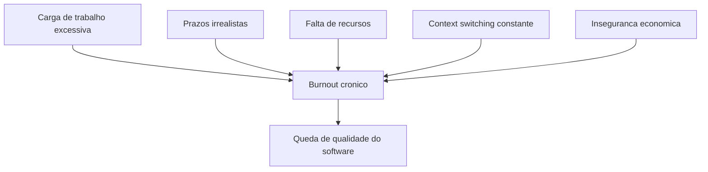
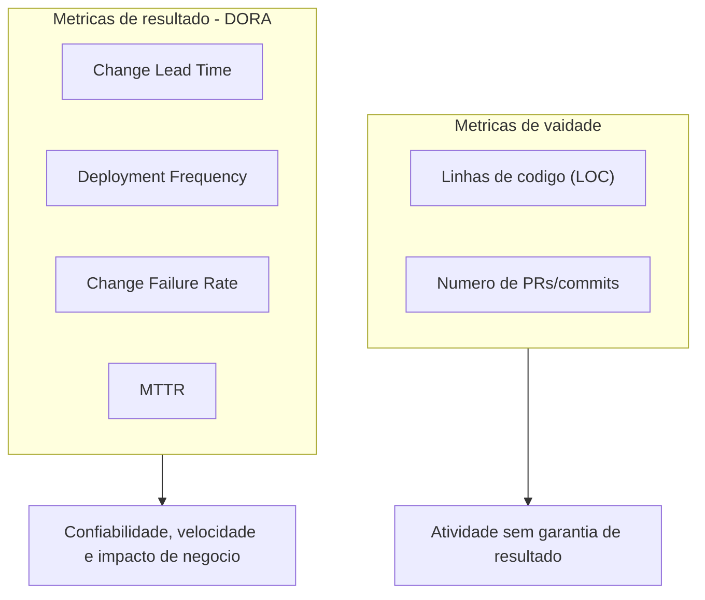
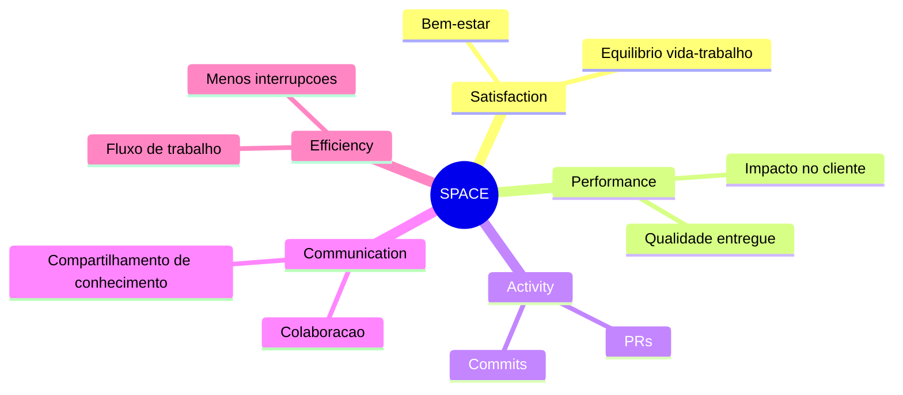
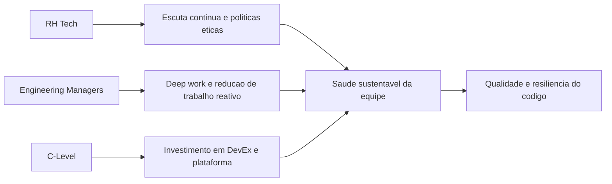

# **अदृश्य मेट्रीक: विकसक भलायकी आनी बरेपण कोड गुणवत्तेचेर कसो परिणाम करता**

समकालीन सॉफ्टवॅर अभियांत्रिकी एक खोल संरचनात्मक विरोधाभासाचेर आदारून आसा: तंत्रीक मुळावी बांदावळ जरी मापनीयता, लवचीकपण आनी उच्च उपलब्धताय मेळोवपाखातीर व्हड प्रमाणांत रिडंडन्सी घेवन तयार केल्ली आसली तरी ती बांदपी आनी सांबाळपी मनशाची मुळावी बांदावळ चड करून प्रणालीगत अपयशी जावपाचे सुवातेर धुकळटात. इतिहासीक नदरेन, तंत्रज्ञान उद्देग आनी वेंचर कॅपिटल हांणी अभियांत्रिकी यशाचें मुल्यांकन शुध्द यंत्रीक उत्पादन मेट्रीकांतल्यान केलां, वितरण गती, कोड खंड आनी सर्वर अपटायम हांचेर लक्ष केंद्रीत केलां. पूण सॉफ्टवॅर विकास जिवीत चक्राचें (SDLC) खर प्रायोगीक विश्लेशण केल्यार कोड बेसाचो दर्जो, वास्तुकलेची सुरक्षीतताय आनी ऍप्लिकेशनांचो स्थिरताय हो कॉर्पोरेट डॅशबोर्डांचेर चड करून दिसनाशिल्ल्या मेट्रीकाकडेन नाळांतल्यान जोडिल्ली आसा: विकसकांची मानसीक भलायकी, मानसीक बरी भलायकी आनी संज्ञानात्मक भार.

सॉफ्टवॅर विकास ही एक स्वभावीकपणान समाजीक तंत्रीक आनी चड मस्तिष्कांतली क्रिया आसून, तातूंत खोल एकाग्रताय, सृजनशील समस्या सोडोवप आनी नव्या भास, चौकटी आनी कार्यकारी प्रतिमान हांचेकडेन सतत जुळोवपाची दीर्घकाळाची स्थिती आसची पडटा. हीं कामां करपी वेवसायीक जेन्ना दीर्घकाळ ताणांतल्यान वावुरतात तेन्ना तांच्या संज्ञानात्मक क्षमतेंतूय मेजपासारको उणाव जाता. हें अवनती फकत नोकरीचें असंतोश म्हणून प्रगट जायना; ताचो थेट अणकार वास्तुकलेंत तार्कीक दोश, दोशांची घनताय व्यापक वाड आनी उत्पादन प्रणालींत गंभीर असुरक्षीतताय सुरू जाता. हो अहवाल सक्रिय तंत्रीक पंगड भलायकी निरिक्षण, संरचनात्मक बर्नआउट कमी करप, आनी सॉफ्टवॅर गुणवत्ता आश्वासन हांचे मदल्या आडमेळ्याचें व्यापक विश्लेशण करता, अभियांत्रिकी फुडारी, तंत्रज्ञान केंद्रीत मनीस संसाधन वेवस्थापक (एचआर टेक), आनी स्टार्टअप संस्थापकांक डेटा-आदारीत रणनिती चौकटी पुरवण करता.

## **तंत्रीक थकवाचो पॅनोरमा: एक प्रणालीगत आनी प्रमाणीत संकश्ट**

सॉफ्टवॅर अभियांत्रिकी कामगारांची सद्याची स्थिती पद्दतशीर बर्नआउट संकश्ट दाखयता, जें अदमती स्प्रिंट चक्र, डिजिटल ओव्हरलोड, साधनांचो प्रसार आनी खर स्थूल अर्थीक बदल हांकां लागून जाता. हालींच्या संशोधनांतल्यान जागतीक तंत्रगिन्यान उद्देगांतल्या बऱ्यापणाचो इबाड जावपाचें भिरांकूळ चित्र रंगयलां, जें सिद्ध करता की बर्नआउट हो पासिंग बझवर्ड न्हय तर वेवसायीक महामारी. 2024 आनी 2025 वर्सा अदमास केल्ल्या उद्देग व्यापी सर्वेक्षणांत 68% तंत्रज्ञान कामगारांनी बर्नआउटचीं तीव्र लक्षणां दिसल्यात अशें सांगलां, जें फकत तीन वर्सां आदीं नोंद जाल्ल्या 49% परस व्हड प्रमाणांत वाड दाखयता.

**आकृती: बर्नआउटचे संरचनात्मक सदिश**


विशिश्ट बाजारांत आनी खरपणान विकसकांक उद्देशून केल्ल्या सर्वेक्षणांत परिस्थिती आनीकय गंभीर आसा. युरोपीय म्हायती तंत्रज्ञान वेवसायिकां मदल्या सुमार तीन चतुर्थांश (73%) वेवसायिकांनी कामाक लागून चालू आशिल्लो ताण वा बर्नआउट जाल्ल्याचें सांगलां. अभियांत्रिकी विश्लेशण प्लॅटफॉर्मांचेर लक्ष केंद्रीत केल्ल्या हेर स्वतंत्र अभ्यासांतल्यान प्रोग्रामरांत बर्नआउट दर भिरांकूळ 83% मेरेन पावता अशें दिसून आयलां. हे डेटा दाखयतात की थकवा येवप ही कार्यप्रणालीची मुळावी स्थिती जाल्या, आनी तात्पुरती विसंगती न्हय.

| डिप्लीशन मेट्रीक | टक्केवारी कळयल्या | संशोधन संदर्भ आनी योगदान दिवपी घटक |
| :---- | :---- | :---- |
| **बर्नआउट लक्षणां (सामान्य)** | ६८% लोक | तीन वर्सां आदीं ४९% आशिल्ल्या तुळेंत वाड; डिजिटल ओव्हरलोड आनी नवनिर्माणाची गती हाका लागून चालना दिवपी. |
| **ताण/बर्नआउट (युरोप)** | ७३% लोक | ६१% लोक ताका जड कामाच्या भाराक लागून म्हणटात; 44% ते कठीण मुजती मेरेन; संसाधनांच्या उणावाक लागून 43%. |
| **टेकांत बर्नआउट जावपाचो धोको** |.1% | कामगारांक लागीं लागीं बर्नआउट जावपाचो "उंच धोको" अशें वर्गीकरण केल्लें. |
| **विकासक बर्नआउट** | ८३% लोक | स्वायत्तता आनी उद्देश नाशिल्ल्याचेर लक्ष केंद्रीत करून विकसक विश्लेशण प्लॅटफॉर्म अभ्यासांत अहवाल दिला. |

*कोश्टक: तंत्रज्ञान उद्देगांतल्या वेवसायीक बर्नआउटाचो सांख्यिकी सारांश (2024-2025).*

ह्या बर्नआउटाचीं मुळां बहुआयामी आसतात आनी फकत चड वरां काम करपा परस खूब फुडें वतात. रेखीव उत्पादकता, चड गुंतागुंतीची वा एकवटीत प्रणाली वास्तुकला आनी खंयच्याय संहितेंत खण क्षेत्रांत बदल करपी दायजी तंत्रीक रिणाचो दोंगर हाका लागून बर्नआउट उत्प्रेरक जाता. 60% परस चड वेवसायीक कामाचेर ताण चड कामाच्या भाराक लागून दितात, जाल्यार अवास्तवपणान घट्ट मुजत आनी संसाधनांचो चिरकालीन उणाव अशे संरचनात्मक घटक 40% परस चड कामगारांचेर परिणाम करतात. पयसुल्ल्या कामाच्या धोरणांनी वायट रचणूक केल्ल्यान घड्याळा भोंवतणी काम करपाची संस्कृताय वाडिल्ल्यान काम आनी वैयक्तीक जिणे मदल्यो शिमो खूब धूसर जाल्यात. भोवसंख्य विकसकांनी परंपरीक कामाच्या वेळा भायर कोडिंग चालू दवरतात, वा मानसीक रितीन सॉफ्टवॅर आर्किटेक्चर समस्या सोडोवपाक लागल्यात अशें सांगतात.

सगळ्यांत हालींच्या संशोधनांत उक्ती जाल्ली एक खासा चिंतेची लोकसंख्याशास्त्रीय घडणूक म्हळ्यार बाधित वेवसायिकाच्या स्वरूपांत जाल्लो बदल. इतिहासीक नदरेन, बर्नआउट चड करून कनिश्ट विकसकांक सुरवातीच्या डिलिव्हरीच्या खडबडीत शिकपाच्या वक्राक आनी दबावाक अनुकूल जावपाक कश्ट घेवपाक लागले. पूण हालींच्या आंकडेवारी प्रमाण मध्य करिअर बर्नआउट महामारीच्या पांवड्यार पावता, वरिश्ठ विकसकांनी आपल्या कनिश्ट समकक्षां परस समाधानाचे प्रमाण खूब उणें सांगलां. हे वरिश्ठ वेवसायीक फकत कोडिंगाच्या यांत्रिक मागण्यांक लागून न्हय, तर बसकांचे अटिकावू प्रसार, सतत संदर्भ बदलप, असंरचीत मार्गदर्शनाची जापसालदारकी आनी गंभीर प्रणालीं चड दबावा खाला आनी ऑन-कॉल शिफ्ट चलत दवरपाचो मानसीक टोल हाका लागून थकतात.

अभियांत्रिकीच्या अंतर्गत आशिल्ल्या ह्या परिस्थिती वांगडाच स्थूल अर्थीक अस्थिरतायेचो विध्वंसक मानसीक परिणाम आसा. अभियांत्रिकी फुडारपणाचेर लक्ष केंद्रीत केल्ल्या अहवालां प्रमाण तंत्रज्ञान क्षेत्रांतल्या काडून उडोवपाच्या सावळेक लागून 40% वेवस्थापक आनी तंत्रीक फुडारी आपल्या पंगडांक म्हत्वाची उणी प्रेरणा दिसता. नोकरी असुरक्षीतताय हो एक अमूर्त हुस्को न्हय; तातूंतल्यान चिरकालीन चिंता निर्माण जाता जी जटिल प्रोग्रामिंगाक जाय आशिल्ली संज्ञानात्मक बँडविड्थ खाता. जेन्ना संघटना स्थिरताय, फावो ती साधनां वा कार्यकारी पारदर्शकता दिवंक अपेस येता तेन्ना अंतर्गत प्रेरणा पुरायपणान कोसळटा, जाका लागून थेट वेवस्थापकाची कुशळटाय पळोवन परिणामकारकता उणी जाता. देखून बर्नआउट वैयक्तीक थकवाक आडखळून वता; तो एक रोगजन्य कामाच्या वातावरणाचो एक निर्विवाद निर्देशक आसा जंय संज्ञानात्मक दाब व्यक्ती आनी पंगडाच्या सामकार येवपाच्या साधनां परस खूब चड आसता.

## **सॉफ्टवेअर विकासाचें तंत्रिका शास्त्र आनी गंभीर बगांची उत्पत्ती**

उणें जावपी कल्याणाचो उत्पादनांतल्या संहितेच्या स्थिरतायेचेर थेट परिणाम कसो जाता हाची अचूक यंत्रणा समजून घेवपाखातीर उत्पादनांतलीं उपमा सोडून प्रोग्रामिंगाचे कृतीची खरपणान तंत्रिका ज्ञानात्मक भिंगांतल्यान तपासणी करप गरजेचें आसता. अमूर्त वास्तुकला समजून घेवप, डेटा प्रवाहाचेर मागोवप, स्रोत कोड बरोवप हीं कामां मनशाच्या मेंदवाच्या काम करपी स्मृतींतल्यान व्हड प्रमाणांत साधनां जाय पडटात. जेन्ना विकसकाचो संज्ञानात्मक भार ह्या काम करपी स्मृतीच्या शारिरीक मर्यादे लागीं वता वा ताचे परस चड जाता तेन्ना तांची जटिल प्रणाली समजून घेवपाची आनी दृश्टीकोन करपाची तांक कुसकुसता, जाका लागून तांकां सॉफ्टवॅर दोश म्हणून मूर्त रूप घेवपी तर्क चुको करपाची व्यापकपणान चड शक्यताय आसता.

भावनीक स्थिती, चड मानसीक भार आनी गंभीर बगांची सुरवात हांचेमदलो अमिट दुवो इलॅक्ट्रोएन्सेफॅलोग्राफी (EEG) आनी फंक्शनल मॅग्नेटिक रेझोनन्स इमेजिंग (fMRI) वापरून अत्याधुनीक प्रायोगीक संशोधनांतल्यान पुरावो मेळ्ळा. मनशाच्या चुकांच्या कारणांचेर संज्ञानात्मक वर्गीकरण जायत्या वेवस्थापकांक विसरप, लक्षांत वचप आनी मानसीक अतिभार हे सॉफ्टवॅर असुरक्षीततायेचे खरे वाहक आसात, आनी फकत तंत्रीक कुशळटायेचो उणाव न्हय अशा प्रतिअंतर्ज्ञानी कल्पनेक पुरावो दिता. आद्य अभ्यासांतल्यान दिसून आयलां की भावनांचो प्रोग्रामिंग कार्याच्या दर्ज्याचेर थेट परिणाम जाता, कोडिंग करतना कामगिरी आनी लक्ष दिवपाचो अदमास करपाखातीर फ्रंटल अॅसिमेट्री इंडेक्स हो एक कार्यक्षम जैवनिर्देशक म्हूण काम करता.

संज्ञानात्मक अतिभाराचे नकाशे तयार करपाखातीर ईईजीचो उपेग करून केल्ल्या खोलायेन विश्लेशणावरवीं ह्या कल्पनांची खात्री जाता. समकालीन तंत्रिका शास्त्रीय संशोधनान खरी कामां करतना विकसकाच्या मेंदवाचें नकाशे तयार करून ताण हांचे व्यक्तिपरक मुल्यांकन आडखळून गेलां. अभ्यासावयल्यान दिसून येता की सॉफ्टवेअर विकासाच्या कामांक इन्सुला प्रदेशांत तीव्र क्रियाशीलताय जाय पडटा, हो मेंदवाचो वाठार उच्च क्रमाच्या संज्ञानात्मक प्रक्रियांकडेन आनी जटिल समस्या सोडोवपाकडेन व्हड प्रमाणांत संबंदीत आसा. तंत्रिका तंत्राच्या जैवनिर्देशकांचें पद्दतशीर विश्लेशण, खास करून फुडल्या आनी मध्यवर्ती वाहिनींतल्या (F4, FC4 आनी C4) ह्जोर्थ पॅरामीटर एक्टिव्हिटी आनी एकूण शक्तीचें विश्लेशण केल्यार बर्नआउट हें मेजपासारकें शारिरीक अपयश आसा अशें दिसून येता.

तंत्रिका शास्त्र आनी सॉफ्टवॅर अभियांत्रिकी हांचेमदल्या ह्या आडमेळ्यांतल्यान मेळिल्ले सोद खर आसतात: प्रोग्रामर चड संज्ञानात्मक ओव्हरलोडाखाला वावुरता जाल्यार वा कोडाचीं ओळीं बरोवपाक वा नियाळ करतना विचलित जाल्यार बग सुरू जावपाची वा सुरक्षा असुरक्षीतताय लक्षांत येनासतना वचपाची शक्यताय खूब वाडटा. जेन्ना प्रस्नांतल्या संहितेंत पयलींच चड चक्रवाती गुंतागुंत आसता, अशें शास्त्रीय स्थिर विश्लेशण मेट्रीकांतल्यान मेजतात तेन्ना हें आनीकय तीव्र जाता. देखून कोड गुणवत्तेंत हंगामी उतार-चढाव हो मुद्दाम दुर्लक्षाचो परिणाम न्हय, तर चिरकालीन ताण, सिनॅप्टिक थकवा आनी भावनिक थकवाच्या परिस्थितींत काम करपी मेंदवाचें अपरिहार्य उपउत्पादन.

अमूर्तपणान म्हायतीचेर प्रक्रिया करपाची तांक उणी जावपावांगडाच, इबाडिल्ली मानसीक स्थिती उदरगतीच्या पद्दतीच्या गतीचेर खूब परिणाम करता, खास करून एकक चांचणी आनी संहिता पुनरावलोकनाच्या म्हत्वाच्या टप्प्यांत. संज्ञानात्मक मानसशास्त्रांत "पुष्टीकरण पूर्वग्रह" हे घडणुकेचें वर्णन केलां, जी मनशाची सहज प्रवृत्ती आसता, जी पूर्वस्थितींत आशिल्ल्या कल्पनांक खंडन करपाचो यत्न करचे परस तांकां सत्यापीत करपी म्हायती सोदपाची, तांचो अर्थ लावपाची आनी ताचेर लक्ष केंद्रीत करपाची आसता. चांचण्यो तयार करतना आनी पुल विनंतींचो नियाळ घेतना, विकसकांनी सैध्दांतिक रितीन स्वताचो कोड सक्रियपणान उध्वस्त करपाचो आनी मोडपाचो यत्न करचो. पूण खर काळ दाब आनी मानसीक ताण हांचेखाला पुष्टीकरण पूर्वग्रह आपत्तीजनक रितीन वाडटा; थकल्ले विकसक प्रमाणीकरणाक उण्यांत उणो प्रतिकार करपाचो मार्ग सोदतात, जटिल धार प्रकरणां आनी सूक्ष्म वास्तुशिल्प दोशांचेर दुर्लक्ष करतात जे सोदून काडपाक व्हड संज्ञानात्मक यत्न करचे पडटले. ह्या ताण-प्रेरित संज्ञानात्मक अपयशाचो प्रत्यक्ष आनी प्रमाणीत परिणाम म्हूण गंभीर दोश उत्पादन वातावरणांत शिंपडटात, जाका लागून सॉफ्टवॅर दोशांची घनताय वाडटा आनी प्रणालीगत खंड पडपाचो धोको वाडटा.

**आकृती: उत्पादनांतल्या बगांक तंत्रिका संज्ञानात्मक साखळी**


ह्या अपयशांचें प्रमाण थारावप चड करून दोश घनताय मेट्रीक वापरून करतात, सादारणपणान पुष्टी केल्ल्या दोशांची संख्या सॉफ्टवॅर मॉड्यूलाच्या आकारान भागून मेजतात, चड करून हजारांनी कोड ओळींनी (KLOC) वा फंक्शन बिंदू मेजतात. सॉफ्टवॅर प्रकल्पांक, सरासरी, दर,000 ओळींच्या कोडाक 15 ते 50 बग अणभवतात. जेन्ना कामगार बळ जळटा तेन्ना थकवा सक्रिय पुनरावलोकन पद्दतीचेर आडखळ हाडटा, जाका लागून दोश घनताय दर ह्या सरासरीच्या वयल्या मर्यादे लागीं पावपाक मेळटा. तेभायर दोश नमुन्यांचे विश्लेशण केल्यार बग संहितेच्या विशिश्ट, अतिजटिल वाठारांनी चोम्यांची प्रवृत्ती आसता अशें दिसून येता. ह्या गंभीर वाठारांनी वचपाक जाय आशिल्ली मानसीक तीक्ष्णताय नासतना पंगडांक सतत व्यत्यय येता.

सॉफ्टवॅर विकासाचो समाजीक आनी सहकार्याचो आयामूय दबावा खाला कोसळटा. चिरकालीन ताण परस्पर संवादात्मक सहकार आनी वेवसायीक सहानुभूती हांकां आडमेळीं हाडटा. उच्च दाब, उण्या मनोबलाच्या वातावरणांत भलायकेन बऱ्या परस्पर गतीविज्ञानाचेर आदारून आशिल्ल्या प्रायोगीक गुणवत्ता आश्वासन पद्दतींत व्हड प्रमाणांत उणाव येता. जोडी प्रोग्रामिंग सोडून दितात, दिसपट्ट्यो बसका (स्टँडअप) रिते यांत्रिक अहवाल जातात आनी सायलोंत गिन्यानाचो हुस्को करपा सारको संचय जाता. वेवसायीक आपली उणी मानसीक उर्जेची राखण करपा खातीर स्वताक वेगळे दवरपाची प्रवृत्ती आसता, धोक्याच्या कोड रिफॅक्टरींगाची जापसालदारकी घेवपाक वा वास्तुशिल्पाचो हुस्को निर्माण करपाक संकोच करतात. संवादांतल्या ह्या खंडनाचो अर्थ वेवसायीक गरजां विशीं ल्हान ल्हान गैरसमज ओगीच आपत्तीदायक कळाव आनी अपंग करपी दीर्घकाळ तंत्रीक रिणांत रुपांतरीत जातात.

## **पारंपारीक मेट्रीकाची भ्रम आनी डोरा चौकटीचो उदय**

सॉफ्टवॅर अभियांत्रिकींतल्या बौध्दिक वावराचें प्रमाण थारावपाच्या इतिहासीक सोदांत रिडक्शनवादी मेट्रीक आपणावपाचो इतिहास आसा जो चड करून दीर्घकाळ गुणवत्तेक हानिकारक आशिल्ल्या विरोधाभासी वागणुकेक प्रोत्साहन दिता. सगळ्यांत क्लासिक आनी वादग्रस्तपणान सगळ्यांत दोशपूर्ण मेट्रीक, लायन्स ऑफ कोड (LOC \- लायन्स ऑफ कोड) हें सगळेकडेन व्हॅनिटी मेट्रीक मानतात. एलओसीचो अनिर्बंध वापर अल्गोरिदमिक कार्यक्षमताय आनी सोबीतकायेक ख्यास्त दिता; दर्जो आनी प्रणाली भलायकेचेर लक्ष केंद्रीत केल्लो विकसक दायज कोडाची हजार ओळी रिफॅक्टर करून आनी काडून उडोवन एक जटिल वास्तुशिल्प समस्या सोडोवंक शकता, जाल्यार थकल्लो विकसक फकत उत्पादकताय संकेत करपा खातीर शेंकड्यांनी ओळींचो भंगुर, फुगल्लो उपाय दिवंक शकता. तशेंच, पुल विनंती (पीआर) वा कमिट मेजून कामगिरीचें खरपणान मूल्यमापन करप फकत क्रियाशीलता आनी गतिज हालचाल मेजता, वेवसायीक उद्दिश्टां कडेन प्रत्यक्ष प्रगती न्हय. तो एक कार्यप्रवाह-आदारीत मेट्रीक आसा आनी हाताळणीक खूब संवेदनशील आसा, जंय विकसकांक संख्या फुगवपा खातीर तुच्छ डिलिव्हरेबलांचे कुडके करतात, प्रणालीगत गुणवत्तेच्या उणावाक मास्क करतात.

एकूण खंड आनी सूक्ष्म वेवस्थापनाचेर लक्ष केंद्रीत करपाचेर मात करपा खातीर, उद्देगान व्हड प्रमाणांत DORA (DevOps Research and Assessment) मेट्रीक आपणायली, जीं विकास पद्दतींचें संघटनात्मक परिणामां कडेन जोडून आमी सॉफ्टवॅर वितरणाच्या परिणामकारकतेचें मुल्यांकन करपाचे पद्दतींत क्रांती घडोवन हाडली. DORA लायन मेजपा पासून पयस वता आनी चार प्राथमीक अक्षांचेर लक्ष केंद्रीत करून डिलिव्हरी पायपलायन परिपक्वता आनी कार्यकारी कार्यक्षमताय (सॉफ्टवेअर वितरण आनी कार्यकारी \- एसडीओ) तपासता:

**आकृती: पारंपारीक मेट्रीक विरुद्ध डोरा**


1. **लीड वेळ बदलचो:** कोड कमिटांतल्यान उत्पादनांत यशस्वी उपयोजना मेरेन गेल्लो वेळ.  
2. **उपयोजन वारंवारता:** संघटना उत्पादनाक कोड उपयोजीत करता ती ताल.  
3. **बदल अपयशी दर:** उत्पादनांत अपयश निर्माण करपी उपयोजनांची टक्केवारी जी रोखडीच उपाय करपाची गरज आसता (हॉटफिक्स, रोलबॅक).  
4. **सरासरी पुनर्प्राप्ती वेळ (MTTR / अपयशी उपयोजन पुनर्प्राप्ती वेळ):** घडणूक वा अपयशी घडणुकेंत सेवा परतून मेळोवपाक लागपी वेळ.

सॉफ्टवॅर वितरण कार्यक्षमताय संघटनात्मक येसस्वीतायेचो थेट अदमास आसा, फायदो, बाजारांतलो वाटो आनी गिरायक समाधान हांचेर परिणाम करता अशें DORA रेखांशीय संशोधनांतल्यान निश्कर्शात्मकपणान दाखयलां. ते भायर ताणें उच्च आयटी कामगिरी आनी कर्मचाऱ्यांच्या मानसीक बऱ्यापणा आनी निश्ठा हांचे मदीं न्हयकारूंक जायना असो परस्परसंबंद स्थापन केला. उच्च कार्यक्षम संघटनांतले वेवसायीक (एलिट आनी हाय) तुमच्या कंपनीची शिफारस करपाची शक्यताय 2 पटीन चड आसता, ती काम करपाक एक बरी सुवात (eNPS वरवीं मेजतात).

पंगडांक एलिट, उच्च, सरासरी आनी उण्या कामगिरीच्या स्वरूपांत वर्गीकरण करून संशोधनांतल्यान संज्ञानात्मक वेळाच्या वाटपांत खोलायेन आनी उपदेशात्मक फरक उक्ते जाले. बर्नआउट महामारीचो हुस्को आशिल्ल्या एचआर आनी अभियांत्रिकी फुडाऱ्यां खातीर केल्ल्या डोरा सर्वेक्षणांतलो सगळ्यांत उक्तो करपी आंग पंगडांनी वेळ कसो घेता हातूंत आसा, जें प्रतिक्रियाशील कामाचे भार दाखयता:

| कामगिरी श्रेणी (डोरा) | नव्या कामाक (नवीनीकरण) घालून दिल्लो वेळ | अनियोजीत काम आनी परतून काम करपाक लागपी वेळ | सुरक्षा दोशांचेर सतत निवारण करप | वापरप्यांनी वळखून घेतिल्ल्या दोशांची दुरुस्ती |
| :---- | :---- | :---- | :---- | :---- |
| **एलिट परफॉर्मर्स** | ५०% |.५% | ५% इतले | १०% इतले |
| **उण्या कामगिरीचे कामगिरी** | ३०% अशें | २०% इतले | १०% इतले | २०% इतले |

कोश्टक: सॉफ्टवॅर वितरण कार्यक्षमताय प्रोफायलाचेर आदारीत यत्न वाटप (DORA Accelerate State of DevOps Data).

एलिट पंगड मानसीक भलायकी आनी तंत्रीक उत्कृश्टतायेचें सद्गुणी चक्र भोगतात. घटमूट तंत्रीक क्षमता चालीक लावप संशोधनान "उपयोजन वेदना" म्हणटा तें उणें करता — अभियंत्यांक उत्पादनाक कोड धाडटना मेळपी भंय, चिंता आनी चिरकालीन ताण पातळी. जंय उपयोजन चड वेदनादायक आसता आनी रातची चिंता निर्माण करता थंय सगळ्यांत वायट संघटनात्मक संस्कृताय आनी सगळ्यांत उणी सॉफ्टवॅर कार्यक्षमता. ऑटोमेशनाच्या माध्यमांतल्यान हे वेदनेंतल्यान मुक्त जाल्ले एलिट पंगड आपलो अर्दो संज्ञानात्मक वेळ खऱ्या मोल निर्मिती खातीर (50%) दिवपाक सक्षम आसतात.

हाचे सामके उरफाटें, उण्या कार्यक्षमताय आशिल्ल्या वातावरणांतले विकसक सासणाचें जिवीत उरपाचे प्रतिक्रियाशील अवस्थेंत आडखळून पडटात. उजो पालोवप, सुरवातीच्या स्वयंचलीत चांचणेच्या उणावाक लागून निमाण्या खिणाक सुरक्षा बुराक सुदारप आनी निराश निमाण्या वापरप्यांनी थेट कळयल्ल्या दोशांचें व्हड प्रमाण सुदारप हातूंत दुप्पट वेळ लागता. हें प्रतिक्रियाशील आनी अनियोजीत काम (पुनर्कार्य) हें बर्नआउटाचें एक मुखेल वाहक आसून, ताचें खाशेलपण म्हळ्यार कॉर्टिसोलाची उंचेली पातळी आनी सतत प्रणालीगत निराशा. DORA हातूंत सगळेकडेन उल्लेख केल्ल्या क्रिस्टीना मास्लाच हाच्या बर्नआउट संशोधनांत बर्नआउटा खातीर स संघटनात्मक जोखीम घटक वळखतात: कामाचे चड भार, नियंत्रणाचो उणाव, फावो तें इनामां, समुदाय मोडप, न्यायाचो उणाव आनी मुल्यांचो संघर्श. उण्या कार्यक्षमतायचें वातावरण ओव्हरलोड आनी नियंत्रणाचो उणाव पुरायपणान वाडयता.

ही चिंता उणी करपाक आनी परतून काम उणें करपाक, DORA सतत वितरणाक संबंदीत विशिश्ट तंत्रीक क्षमतां खरपणान आपणावपाची विधी थारायल्या. चांचणी ऑटोमेशन (जंय विकसक खरे दोश सोदपी विस्वासपात्र सुट तयार करतात), ट्रंक आदारीत विकास, विलीनीकरण नरक निर्माण करपी जटिल फांटे उणे करप), व्यापक सुरक्षा, सुटसुटीत जोडिल्ली वास्तुकला आनी व्यापक निरिक्षणक्षमता अशो पद्दती फकत बऱ्यो वास्तुशिल्पाची पद्दत न्हय. ते पंगड तंत्रिका थकवाआड थेट रोगप्रतिकारक हस्तक्षेप आसतात. दर्जो “जमनीवयल्यान बांदला” हाची खात्री करून, रिलीज चक्राच्या निमाणें पंगड थकून पावना.

## **स्पेस फ्रेमवर्क आनी समाधान आनी उत्पादकताचें कार्यान्वयन**

कार्यकारी अभियांत्रिकी खातीर तांचें अफाट आनी निःसंशय मोल आसून लेगीत, डोरा मेट्रीकाची व्याप्तींत एक अंतर्गत मर्यादा आसा: तीं वितरण नळयेची गती आनी यांत्रिक स्थिरताय अचूकपणान मेजतात, पूण ती नळमार्ग इंधन दिवपाक आनी चालू दवरपाक लागपी व्यक्तिपरक जियेल्लो अणभव, दिसपट्ट्या घर्शणाची पातळी, संज्ञानात्मक बऱ्यापणाचो वा दीर्घकाळ मनशाचो थकवाचो थेट प्रमाण थारायना. DORA मेट्रीक सॉफ्टवॅर मशीन कार्यक्षमतेन चलता काय ना हें धरतात, पूण तंत्रीक पंगड तंत्रिका विघटनाच्या वाटेर आसा काय ना तें दाखोवंक शकनात, ती ताल तयार करपा खातीर आपले टिकावू मर्यादे भायर काम करता. ते भायर, बसकांनी वेळ मेजपी "वेवसाय मेट्रीक" चेर खरपणान लक्ष केंद्रीत केल्लीं साधनां मनशाचे वटेन पळोवपाचो यत्न करतात, पूण प्रवाह सुदारपा खातीर कृती करपाक योग्य शिफारशी दिवंक अपेस आयलां.

ही धोक्याची दृश्यताय अंतर सोडोवपाक आनी निमाणें दीर्घकाळ टिकावू पायपलायन कार्यक्षमताय नश्ट करपी मुळाव्या थकवाक आडावपा खातीर, GitHub, Microsoft आनी व्हिक्टोरिया विद्यापिठाच्या सॉफ्टवॅर अभियांत्रिकी संशोधकांनी खोलायेन समग्र नदरेन पूरक चौकटी तयार करपाक सहकार्य केलें. ताचो परिणाम म्हळ्यार स्पेस फ्रेमवर्क.

बौध्दिक उत्पादकता उत्पादन वा कार्यावळीच्या एकाच आयामांत उणी करूं येता अशी काळांतरान गेल्ली कल्पना स्पेस खरपणान न्हयकारता. तातूंत पांच परस्पर आदारीत अक्षांचेर बांदिल्लें बहुआयामी मॉडेल प्रस्तावीत केलां, जें अभियांत्रिकी परिणामकारकतेचें 360 अंशांचें दृश्य दिता:

**आकृती: SPACE फ्रेमवर्क परिमाणांचो नकासो**


| SPACE परिमाण | मापनाचो अर्थ आनी केंद्रबिंदू | सादारण निर्देशक |
| :---- | :---- | :---- |
| **S (समाधान & बरेपण)** | कामांत सुख, पूर्णताय, मानसीक सुरक्षीतताय आनी थकवाचो अभाव हांची मापां. | जिवीत/कामाच्या समतोलाचेर समाधान; ताण पातळेची म्हायती दिल्या; विकसकाची परिणामकारकता जाणवली. |
| **पी (प्रदर्शन)** | कामाचो निमाणो परिणाम आनी गिरायकांक पावयल्ल्या सॉफ्टवॅराचो दर्जो. | निमाण्या वापरप्याचें समाधान (एनपीएस); वैशिश्ट्यां कडेन संबंदीत येणावळ वाड; कार्यकारी भलायकी आनी स्थिरताय. |
| **एक (क्रियाकलाप)** | उदरगत प्रक्रियेच्या उत्पादनांची पारंपारीक मेजणी. | कोड कमिटांची वारंवारता; नियाळ केल्ल्या पुल विनंतींचो आंकडो; घडणुकेचीं तिकीटां बंद केल्यांत. |
| **सी (संवाद आनी सहकार)** | पंगड कितले प्रभावीपणान संवाद सादता, अवलंबना सोदून काडटा आनी सहकार्य करता. | संहिता पुनरावलोकनां कडेन समाधान; आंतरविधा गिन्यान वांटपाची गती आनी परिणामकारकता. |
| **ई (कार्यक्षमताय आनी प्रवाह)** | पंगडाची प्रगती करपाची तांक उण्यांत उण्या घर्शणान आनी थोड्याच खंडांनी काम करता. | कार्य चक्राचो वेळ; संदर्भांत खंड पडनासतना खोलायेन लक्ष केंद्रीत करपाची तांक हाची वैयक्तीक धारणा. |

*कोश्टक: समग्र उत्पादकता खातीर स्पेस फ्रेमवर्क परिमाणांचें विभाजन.*

SPACE चो पयलो खांब, समाधान आनी बऱ्यापणाचो, पद्दतीचो बुन्याद म्हूण काम करता. अंतर्गत विपणन पॅम्फ्लेटां खातीर आशिल्ली ती कॉर्पोरेट सजावट न्हय; तो कार्यकारी कार्यक्षमतायखातीर प्रमाणीत करपाक येवपी आनी अदमासाक येवपी लीव्हर आसा. SPACE च्या संस्थापक तत्वांनी समाधान उत्पादकते खातीर एक म्हत्वाचो मुखेल निर्देशक म्हूण काम करता अशें थारायतात. समाधान आनी संलग्नतायेंत उणाव हें उत्पादकता देंवपाचें समांतर लक्षण न्हय, पूण बर्नआउट लागीं पावता आनी, अनिवार्यपणान, उत्पादन आनी कोड दर्जो ताचे उपरांत कोसळटलो हाची सुरवातीची शिटकावणी दिवपी लक्षण अशें चौकटीच्या आदाराचेर आशिल्लें खर संशोधन निर्विवादपणान दाखयता.

SPACE कडल्यान प्रस्तावीत केल्ल्या सहसंबंदाची वैधताय विकसक अणभवाचेर (DevEx) लक्ष केंद्रीत केल्ल्या समांतर हालचालीन चांचणी केली आनी ताचो विस्तार केलो. बऱ्यापणा खातीर गुंतवणूक करपाक न्याय दिवपा खातीर कार्यकारी अधिकाऱ्यांच्या खर अर्थीक डेटाची मागणी जाप दिवपा खातीर, Microsoft, GitHub आनी संशोधन संघटना DX हांणी कामाच्या सुवातेर भलायकेचो कॉर्पोरेट तळाक कसो परिणाम जाता हाचेर विस्तारान सांख्यिकी अभ्यास केलो. काम डिझायन सिध्दांतांत नांगरून दवरिल्लो मुळावो सिध्दांत, अनुकूल केल्ल्या कामाच्या वातावरणांतल्यान बर्नआउट उणें जाता आनी कामगिरी वाडटा अशें मत मांडलां.

तातूंतल्यान मेळपी प्रायोगीक डेटा निश्र्चीत आसा आनी घर्शण आनी मानसीक अतिभार कमी केल्यार तंत्रीक दर्ज्यांत खर लाभांश कसो मेळटा हाची रुपरेखा दिल्या:

* **फोकस आनी प्रवाह स्थिती:** खोल कामाक म्हत्वाचे वेळ ब्लॉक कुशीक दवरूंक शकतात अशा विकसकांक — ईमेल, बिगर तातडीचे इशारो, वा वायट नियोजीत समक्रमण बसका पासून मुक्त — तांच्या जाणवपी उत्पादकतायेंत प्रभावी 50% वाड मेळटा. ते भायर, जे विकसकांक आपल्या कामांत उद्देश आनी वांटो मेळटा (सासणाची एकरस देखरेख करपाच्या विरुद्ध) 30% चड उत्पादकताय जाणवता अशें सांगतात. विकसकाच्या मेंदवाक लक्ष विखंडनापसून राखण दिवप हो डिलिव्हरीचो दर्जो वाडोवपाक सगळ्यांत बेगीन लीव्हर.  
* **संज्ञानात्मक भार वेवस्थापन आनी वास्तुकलेचो दर्जो:** दायजी कोड बेस आनी आपूण काम करतात त्या प्रणालीच्या गुंतागुंतीच्या वास्तुकलेची उंचेल्या पांवड्याची समजूत आशिल्ल्याचो अहवाल दिवपी वेवसायीक अस्पश्टतायेंत झगडपी लोकांपरस 42% चड उत्पादक दिसतात. बेकायदेशीर तंत्रीक रीण, स्पश्ट अंतर्गत दस्तावेजाचो उणाव, ऑन बोर्डिंग वायट आनी सतत धांवपळ हीं हे समजुतीचे सगळ्यांत व्हडले विध्वंसक. फाटल्या पुनरावृत्तींच्या धांवपळयेक लागून कोड समजूंक येना तेन्ना संज्ञानात्मक भार (आंतरिक वा बाह्य आसूं) प्रोग्रामराक बेगीन थकयता, जाका लागून मानसीक थकवाक लागून चुको जातात. अंतर्ज्ञानी साधनां आनी स्पश्ट प्रक्रिया विकसकांक 50% चड अभिनव जाणवता.  
* **प्रतिसाद लूपांची गती:** घर्शण पुनरावलोकन प्रक्रियेंत प्रवेश करतना सॉफ्टवॅराची गुणवत्ता खूब देंवता. नव्यान बरयल्ल्या संहितेचेर प्रतिसाद दिवपाक चड कळाव (स्थिर कोड पुनरावलोकन, त्रासदायक आनी नोकरशाही मान्यताय प्रक्रिया, वा सामकी मंद सीआय/सीडी बिल्ड) हिंसकपणान तर्काची रेखा मोडटा. संशोधनांतल्यान एक उल्लेखनीय सोद उक्तो जाता: आपल्या सहकाऱ्यांच्या प्रस्नांक बेगीन जाप दिवंक शकता आनी चपळ पुनरावलोकनां चालीक लावपी विकास पंगड 50% उणें कॉर्पोरेट तंत्रीक रिण निर्माण करतात. ते भायर, रॅपीड रिव्ह्यू चक्र विकसकांक 20% चड अभिनव करतात, तांकां निराश करपी थंडसाणी परस सतत बौध्दिक जिज्ञासेचे अवस्थेंत दवरतात.

पुरावे अविरतपणान एका निर्विवाद निश्कर्शाचेर एकठांय येतात: फावो त्या साधनांचो आदार आशिल्ले आनी लॉजिस्टीक ताणांतल्यान वापरिल्ले नाशिल्ले सुखी प्रोग्रामर प्रायोगीक नदरेन चड उत्पादक आसतात, बर्नआउट जावपाची उणी प्रवृत्ती आसता आनी अंतर्गतपणान सुरक्षीत, उण्या बगी कोड बरयतात. प्रणालीगत प्रणालीगत निराशा नाशिल्ल्यान "संज्ञानात्मक दाह" कमी जाता, जाका लागून मेंदवाक आपलीं मोलादीक साधनां स्वता कॉर्पोरेट नोकरशाये आड दिसपट्ट्या संघर्शांत वाया घालचे परस, संहितेंतल्या गुंतागुंतीच्या दोशांचो अदमास घेवपाक आपलीं मोलादीक साधनां गुंतवपाक मेळटात.

## **कृत्रिम बुध्दीचो विरोधाभास: दिसपी उत्पादकता आनी नवो संज्ञानात्मक भार**

कृत्रिम बुद्धी-आदारीत अभियांत्रिकीच्या काळांत हो उद्देग नेटान फुडें वता तसो, विकासाच्या वावरांत संज्ञानात्मक गुंतागुंतीचो एक दुर्लक्षीत आनी भयानक नवो थर जोडटा, जाका लागून जागतीक संशोधन संस्थांनी "द एआय पॅराडॉक्स" अशें म्हणपाक सुरवात केल्या. गिटहब कॉपायलट आनी गिटलॅबच्या एआय आदारीत साधनांचो संच सारकिल्या व्हड भास मॉडेल (एलएलएम) वरवीं चालना दिवपी बळिश्ट कोडिंग सहाय्यकांचो आगमन खगोलीय उत्पादकता वाडपाच्या ताऱ्यांच्या आश्वासना वांगडा सुरू जालो. खरें म्हणल्यार, गुंतागुंतीचो बॉयलरप्लेट कोड बेगीन तयार करपाची, जटिल गणितीय नित्यनेम पुराय करपाची, आपोआप पॅकेजीं आयात करपाची आनी विस्तारीत युनिट चांचणी सुट तयार करपाची लेगीत आर्केस्ट्रा करपाची तांक चड करून क्षणांतच सॉफ्टवॅर लेखनाच्या सुरवातीच्या टप्प्यांत व्हड बदल करता.

पूण कॉर्पोरेट वातावरणांतल्या एआयच्या प्रत्यक्ष परिणामकारकतेच्या पयल्या व्हड प्रमाणांतल्या, खोलायेन विश्लेशणांत पंगडांच्या मानसीक भलायके खातीर आनी दीर्घकाळ तंत्रीक दर्ज्या खातीर खर दुसर् या क्रमांकाचे परिणाम उक्ते जातात, खास करून जेन्ना हीं साधनां उपाय करपी समाजीक-तंत्रीक मुळाव्या साधनसुविधां बगर चालीक लायतात. एआय टंकलेखनाची यांत्रिक गती आनी सुरवातीच्या कोड मसुद्याची निर्मिती नाटकीय रितीन करता, जाल्यार एकाच वेळार साधनसाखळींचे कुडके करता आनी विकास जिवीत चक्राच्या उपरांतच्या प्रमाणीकरण आनी सुरक्षा टप्प्यांत भयानक नवे अडचणी निर्माण करता.

GitLab च्या जागतीक अहवालान 2026 मेरेन प्रवृत्ती अदमास करून आनी 200 परस चड DevSecOps वेवसायिकांचो सर्वेक्षण केल्ल्या सारकिल्या व्यापक हालींच्या संशोधनांत, प्रतिअंतर्ज्ञानी डेटा दाखयला: संघटणां दर सप्तकाक सरासरी 7 मोलादीक वरां (जवळजवळ पुराय कामाच्या दिसाचो) गमावपाक लागल्यात, कारण खरपणान वायट एकत्रीत केल्ल्या AI साधनांचो विस्तार आनी... पालन पुनरावलोकना भोंवतणी विसंगत प्रक्रिया.

एआयंत आशिल्लो अदृश्य, बर्नआउट-प्रेरक सापळो संज्ञानात्मक भाराच्या व्हड प्रमाणांत हस्तांतरण स्वरुपांत आसता. जेन्ना एलएलएम फकत सेकंदां भितर शेंकड्यांनी वा हजारांनी ओळींचो कोड तयार करता, तेन्ना मनशाच्या विकसकाची मुळावी जापसालदारकी *लेखन* टप्प्या टप्प्यान तर्कशास्त्रा वयल्यान *वाचप, समजून घेवप, आनी वास्तुशिल्प आनी सुरक्षा प्रमाणीत करप* मशीनान तयार केल्लो कोड जाता. मुळावें काम रुपांतर करता. तर्कशास्त्राचो पद्दतशीर विटोकार जावचे परस, थकल्ल्या अभियंत्यान अचकीत अत्यंत वेगान, व्यावहारीक रितीन बरोबर, पूण कुख्यातपणान भ्रम आनी असुरक्षित पॅकेटांची इंजेक्शन दिवपाक प्रवृत्त आशिल्ल्या परकी बुध्दीमत्तेन बांदिल्ल्या व्हड प्रणालीचो वरिश्ठ तंत्रीक लेखापरीक्षक म्हणून वावुरचें पडटा. संज्ञानात्मक मानसशास्त्रांतल्यान दिसून येता की हेरांनी तयार केल्लो संहिता वाचप आनी फाटीं पळोवपाचें लेखापरीक्षण करप हें संहितेवरवीं स्वताच्या विचारांचें बरोवप आनी रचणूक करपापरस मेंदवाच्या कार्य स्मृतीखातीर प्रायोगीक नदरेन चड श्रमीक आनी खर्चीक आसता.

ह्या नव्या वेगवान गतीशीलतेचो परिणाम म्हळ्यार स्वतंत्र सॉफ्टवॅर कार्यक्षमताय संशोधन संस्थांनी दाखयल्लो एक विध्वंसक दुश्परिणाम. लाखांनी बदलिल्ल्या कोड ओळींचें विश्लेशण करतना, अदमास दाखयतात की *कोड मथन* – मुखेल प्रणालींत हाडल्या उपरांत दोन सप्तकां परस उण्या वेळान परतून रोल करपाक जाय, आपत्कालीन स्थिर करपाक वा व्हड प्रमाणांत अद्ययावत करपाक जाय आशिल्ल्या कोड ओळींची टक्केवारी अशी व्याख्या केल्ली – नाटकीय स्पायक पळयल्या, देखरेखीबगर जनरेटिव्ह साधनां आपणावपाक थेट प्रतिसाद म्हणून खंड दुप्पट जावपाची अपेक्षा आसा. हो बेपर्वा प्रवेग मौन तंत्रीक रिणाचो आभासी दोंगर तयार करता जो भंडारांनी भिरांकूळ रितीन नेटान जमता.

देखून, एआय चालीत युगांत पुल रिक्वेस्ट खंड प्राथमीक उत्पादकता मेट्रीक म्हणून धार्मीक रितीन सांबाळ्ळो जाल्यार वेवस्थापक तारव बुडयतना हालचालीची परब मनयतले. एआय-आदारीत विकसक डझनभर व्हड प्रमाणांत पीआर उगडटलो, जे सांख्यिकी नदरेन अतिउत्पादक दिसतले. पूण हे व्हडले व्हडले पीआर नियाळा खातीर तांच्या मनीस समवयस्कांचेर पडटले. समीक्षक म्हणून नियुक्त केल्ले हे विकसक जर पयलींच खर बर्नआउट आनी ओव्हरलोडाचो त्रास सोंसतात जाल्यार ताचो परिणाम आपत्तीदायक आसतलो. संज्ञानात्मक रितीन थकल्ल्या विकसकां कडेन व्हड LLM उत्पादनांचे खोलायेन सुरक्षा नियाळ करपाक जाय आशिल्ली मानसीक खरसाण, सहानुभूती वा तपास धीर ना.

पुष्टीकरण पूर्वग्रह आनी मुजतीच्या दाबाचेर वर्चस्व आशिल्ले ते रबर-स्टॅम्पिंग वागणूक आपणायतले, शुध्द यांत्रिक गतीचेर लक्ष केंद्रीत केल्ल्या मेट्रीकांक पाळो दिवपा खातीर धोक्याच्या कोड इंजेक्शनांक यंत्रीक रितीन मंजुरी दितले. हाका लागून उत्पादन वातावरणांतल्या ऍप्लिकेशनाची घटमूटताय नश्ट जातली, अपेस घडणुकां वेळार फुडल्या न्हीद नाशिल्ल्या रातींची हमी मेळटली. पंगड विवेकबुध्दी वा कोड गुणवत्तेचो बळी दिनासतना एआयन दिल्लें लाभांश मेळोवपा खातीर, संघटणांनी प्लॅटफॉर्म अभियांत्रिकींत एकाच वेळार आनी घटमूटपणान गुंतवणूक करची पडटली, अंतर्गत विकसक पोर्टल आनी अत्यंत स्वयंचलीत "भांगराचे मार्ग" सुनिश्चीत करचे जे मनीस मूल्यमापकाक थकवचे पयलीं मुळाव्या साधनसुविधा आर्केस्ट्रेशन आनी नियमित सुरक्षा स्कॅनिंगचो भार सोंसतात.

## **निरीक्षण तंत्रज्ञान: देखरेख ते समग्र अभियांत्रिकी गुप्तचर**

संज्ञानात्मक भार, डोरा आनी स्पेस हांचो सैध्दांतिक आदार समजून घेवप ही फकत बुन्याद; मापनाचें कार्यक्षमीकरण इतिहासीक नदरेन खोलायेन विखंडीत साधन मॅट्रिक्सांतल्यान निवळ डेटा काडपाच्या वेव्हारीक अडचणी आड चललां. दुस्मान रणनितीचो आदार घेनासतना ही तंत्रीक आडखळ पयस करपा खातीर अभियांत्रिकी गुप्तचर प्लॅटफॉर्मांची प्रगत शिस्त आनी सतत लोक वेवस्थापन तंत्रगिन्यानाची (पीपल एनालिटिक्स) उत्क्रांती हालींच्या वर्सांनी उदयाक आयल्या.

ह्या विभागांतलीं प्रगत उद्देगीक साधनां, जशीं DX, Jellyfish, Haystack आनी LinearB, पारंपारीक वेळ ट्रॅकर, क्लिक काउंटर वा कुकर्मो कॉर्पोरेट पळोवणी सॉफ्टवॅर (बॉसवेअर/स्पायवेअर) परस मुळाव्या, पद्दतीन आनी तत्वगिन्यानी नदरेन वेगळीं आसात. खर संदर्भात्मक, एकत्रीत आनी अनाक्रांती निरिक्षणाच्या तत्वा खाला ते वावुरतात. स्क्रीन फिल्म करचे बदला, ते Git रिपॉझिटरींतल्यान मोलादीक मेटाडेटा एकठांय करतात आनी क्रॉस-रेफरेन्स करतात, ट्रॅकिंग साधनां (जिरा वा आसन सारकीं), आनी सतत एकठांय करप आनी उपयोजन (CI/CD) पायपलायन जारी करतात. कच्ची प्रणालीची दूरमापन (देखीक- पीआर आकार, उक्तो-बंद प्रमाण, आनी चक्राचो वेळ) मुळाव्या मनशाच्या संदर्भांत भरसलो ना जाल्यार फटोवपी रितीन द्विमात्रिक उरता अशा आदाराचेर हे अत्याधुनीक प्लॅटफॉर्म सुरू जातात.

देखीक- डीएक्स साधन वेगळें दिसता कारण तें थेट एलिट शास्त्रीय संशोधकांनी (DORA आनी SPACE च्या मूळ निर्मात्यां सयत) तयार केल्लें. तो फकत मशीन मेट्रीकाचेर आदारून ना; प्लॅटफॉर्म एसडीएलसी कडल्यान जड तंत्रीक टेलिमेट्रीक स्वता विकसकां कडल्यान विनाशिलतायेन एकठांय केल्ल्या गरजेच्या गुणात्मक अंतर्दृष्टी वांगडा विलीन करता. अणभव नमुने घेवपाच्या बुदवंत वापरा वरवीं आनी अभियंत्याच्या सद्याच्या कामाचेर आदारीत बेगीन संदर्भात्मक प्रस्नमाची वरवीं, वेवस्थापक घर्शणाच्या अचूक नोड्सांचें नकाशे करूंक शकतात जंय प्रतिभा वास्तुकले कडल्यान गोंदळ जाता, आडावप वा मानसीक रितीन घसघशीत जाता. हाका लागून मालकी डीएक्स कोर चौकटी तयार जाली, जी एकाच वेळार गती, परिणामकारकता, दर्जो आनी वेवसायीक परिणाम हांचेर लक्ष केंद्रीत करताली. हाका लागून फुडाऱ्यांक तांच्या मेजपाच्या काडयांचें समतोल दवरपाक मेळटा, तंत्रीक परिणामकारकता आनी मनोबल खूब देंवतना "वेगवान डिलिव्हरी" खातीर ताळयो मारच्यो न्हय हाची खात्री जाता.

तशेंच जेलीफिश प्लॅटफॉर्म अभियांत्रिकी दुकानाच्या मजलो आनी कार्यकारी मंडळ कक्ष हांचे मदीं एक म्हत्वाचो अणकारपी म्हूण काम करता. अभियांत्रिकीच्या विखंडीत यांत्रिक संकेतांचो संसाधन वाटपाचे अर्थीक आनी कार्यकारी भाशेंत अणकार करता. खऱ्या रस्तो नकाशाच्या नवनिर्माणाच्या विरुद्ध, लिपिल्ल्या तंत्रीक रिणाच्या वा अप्रत्याशित दुरुस्ती देखरेखीच्या काळ्या बुराकांत कितलो मोलादीक वेळ, मनीस यत्न आनी अर्थीक गुंतवणूक (R\&D) सोंसतात तें फुडारपणाक खरें पळोवंक मेळटा. एक पुराय तंत्रीक पंगड एका भारदस्त कार्यकारी भारांतल्यान ओगीच घुस्मटमार करता हें गणितीय रितीन मंडळाक दाखोवपाची विश्लेशणात्मक तांक ही प्रतिबंधात्मक रिफॅक्टरिंग आनी सामुहीक कॉर्पोरेट बर्नआउटाचो धोको पद्दतशीरपणान उणो करपाचो हेतू आशिल्ल्या अर्थसंकल्पांक न्याय दिवपाचें पयलें अखंड प्रायोगीक पावल.

| साधन श्रेणी | पद्दत आनी प्राथमीक म्हायती एकठांय करप | बऱ्यापणा आनी दर्जो वेवस्थापनाचेर परिणाम | प्रतिनिधीक उदाहरणां |
| :---- | :---- | :---- | :---- |
| **इंजिनियरिंग इंटेलिजन्स प्लॅटफॉर्म** | विकसकाच्या अणभवाचेर कार्यप्रवाहांतल्या संशोधनासयत प्रणाली टेलिमेट्री (Git, Jira, CI/CD) क्रॉस-चेकिंग. | वास्तुशिल्पाचीं अचूक अडचणी वळखता; प्रत्यक्ष चक्राचे वेळ मेजता; थंडसाण आनी कोड पुनरावलोकन थकवा आडावून काम करता. | डीएक्स, जेलीफिश, हेस्टॅक, रेखीवबी. |
| **लोक विश्लेशण आनी एचआर टेक (सतत आयकुप)** | वारंवार नाडी सर्वेक्षण (eNPS), सैमीक भास प्रक्रिया (NLP) आदारीत अदमास मॉडेलिंग, आनी प्रतिसाद मेट्रीक:1. | मानसीक सुरक्षीतताय, वळख मेट्रीक, पंगड बर्नआउट जोखीम, आनी थळाव्या फुडारपणाच्या संरेखणाच्या मुळाव्या गजालींचें मुल्यांकन करता. | कल्चर एम्प, जाळी, वर्कडे पीकन. |
| **प्लॅटफॉर्म अभियांत्रिकी** | अंतर्गत विकसक पोर्टल (आयडीपी), पायपलायन ऑटोमेशन, सेवा कॅटलॉग आनी स्वताची सेवा आर्केस्ट्रेशन. | वातावरण पुरवण, दस्तावेजीकरण आनी सुरक्षा स्वयंचलीत करून संज्ञानात्मक भार नाटकीय रितीन उणो करता, विकसकाक म्हत्वाची स्वायत्तता परत दिता. | माचये फाटल्यान, कॉर्टेक्स, बंदर, घरांतलीं साधनां. |

*कोश्टक: समाजीक-तंत्रीक निरिक्षण आनी विकसक आदार साधनांचो आधुनीक पर्यावरण यंत्रणा.*

अभियांत्रिकी साधनां स्वता आपणावपाक समांतरपणान, आधुनीक मनीस संसाधन आनी लोक संचालन विभागांनी वेवस्थापन केल्ल्या सतत आयकुपाच्या प्लॅटफॉर्मांच्या परिपक्वते वांगडा संघटनांनी बऱ्यापणाचो स्थूल वेवस्थापन गुणात्मक नदरेन फुडें सरला. Culture Amp, Lattice, आनी Workday Peakon सारकिल्या नामनेच्या People Analytics उपायांनी पोरनो, मंद आनी प्रतिक्रियाशील वर्सुकी संघटनात्मक हवामान सर्वेक्षण निवृत्त करपाक मदत केल्या.

तांच्या जाग्यार, ह्या प्लॅटफॉर्मांनी सूक्ष्म, लक्ष्य केल्ले आनी चड वारंवार प्रतिसाद संग्रह (पल्स सर्वेक्षण) संस्थागत केल्यात, स्लॅक आनी मायक्रोसॉफ्ट टीमां सारकिल्या साधनां वांगडा मुळांतूच एकठांय केल्यात. सैमीक भास प्रक्रिया करपाखातीर संघटनात्मक मानसशास्त्रांत प्रशिक्षीत केल्ल्या कृत्रीम बुध्दीमत्तेच्या मॉडेलाचो उपेग करून हीं साधनां रियल टाईमांत प्रमाणांत अनामिक भावनांचें विश्लेशण करतात. हाका लागून पयसुल्ल्या कामगारांतल्या एकसुरेपणाचे उदयाक येवपी नमुने, काम-जिणेंतल्या असंतुलनाच्यो मुळाव्यो कागाळी आनी सामुहीक काडून उडोवप वा विनाशकारी वास्तुशिल्पाच्या कोसळपांत पावचे पयलीं म्हयने मानसीक सुरक्षेंत सामान्य उणाव सोदून काडपाची महाशक्त फुडारपणाक मेळटा.

अशे तरेन निरिक्षण अभियांत्रिकीची पद्दतशीर वैधताय डिजिटल भलायकी आनी प्रतिबंधात्मक वैजकी मळार एक गंभीर आनी ज्ञानवर्धक उपमा सोदून काडूंक शकता: वर्तनाच्या भलायकेचेर लक्ष केंद्रीत केल्ल्या रिमोट दुयेंती निरिक्षणाची (आरपीएम) उदरगत. आधुनीक वैजकींत, निष्क्रिय IoT (इंटरनेट ऑफ थिंग्स) आरपीएम तंत्रज्ञान वा घालपाक येवपी जैवसंवेदक काळजाच्या धडधड्याच्या बदलांत (HRV), न्हीद पद्दतींत आनी ग्लायसीमिक प्रवृत्तींतले स्वतंत्र उतार-चढाव सतत रियल टाईमांत धरतात, ह्या मायक्रोडेटाचो उपेग करून वैजकी कर्मचाऱ्यांक आपत्तीदायक क्लिनीकल घडणुकेच्या बऱ्याच आदीं (देखीक गोडेंमूत कोमा वा तीव्र घबरपाचो आक्रमण) घडचे पयलीं सावधान करतात.

आयचें तंत्रीक नदरेन माहिती आशिल्लें अभियांत्रिकी आनी एचआर फुडारपण मुळाव्यान "संघटनात्मक आरपीएम" मॉडेल आपणायता. खंयचेय परिस्थितींत वेवसायीकाचेर वैयक्तीक सूक्ष्म वेवस्थापन पळोवणी करप हो गरजेचो उद्देश न्हय. कीस्ट्रोक वा आक्रमक स्क्रीन कॅप्चर मेजपाचेर संकुचीतपणान लक्ष केंद्रीत केल्लें दुर्भावनायुक्त निरिक्षण, अपरिहार्यपणान खर परानोया निर्माण करता, जाणवपी स्वायत्तता ना करता, नियोक्त्याचेर आशिल्लो खंयचोय विस्वास नश्ट करता आनी ताण मेट्रीक ब्रेकिंग पॉयंट मेरेन वाडयता हें अखंड डेटा सिद्ध करता. दुसरे वटेन, फकत विकास प्रणालींतल्या लॉजिस्टीक घर्शणाची वळख करपाचो हेतू आशिल्ली नैतिक, संमती, एकत्रीत आनी शुध्द दयाळ निरिक्षण, कंपनीची सुरवातीची रोगप्रतिकार शक्त म्हूण काम करता, कंपनीच्या स्वताच्या विकृतींतल्यान तंत्रीक पंगडाची राखण करता.

## **आर्थीक परिणाम: उलाढाली, दर्जो आनी थकवाचो लिपल्लो खर्च**

अमूर्त पंगड बऱ्यापणा मेट्रीक आनी म्हामंडळाच्या अर्थीक विवरणाची कार्यक्षमताय हांचे मदीं रेखीव, खर आनी तात्काळ परस्परसंबंद आसा असो प्रबंध निर्विवाद डेटा वरवीं आदार मेळटा. मानसीक भलायकेंत गुंतवणूक करप फकत “मृदु एचआर” मेरेन मर्यादीत आशिल्लो परोपकारी वा कॉर्पोरेट समाजीक जापसालदारकेचो उपक्रम अशें जायत्या मुखेल अर्थीक अधिकाऱ्यांच्या पोरन्या मताक ही गणितीय वास्तवताय खरपणान खंडन करता. सॉफ्टवॅर अभियांत्रिकींतल्या तीव्र ताणाचो कमी जावंक नाशिल्लो खर्च मुखेलपणान स्वयंसेवी कर्मचाऱ्यांच्या उलाढालीच्या अटिकपी खर्चा वरवीं आनी मिशन-क्रिटिकल प्रकल्प बंद करपाक कारणीभूत जावपी कोड बेसाचो अपुरबायेचो उणाव हांचे वरवीं अर्थीक अहवालांत प्रगट जाता.

कंपनीच्या गुंतागुंतीच्या उपप्रणालीं विशीं व्हड, दस्तावेज नाशिल्ल्या प्रायोगीक गिन्यानाचो चड करून एकमेव मानसीक राखणदार आशिल्ल्या जळिल्ल्या वरिश्ठ अभियंतो वा विकसकाची सुवात घेवप, ताचे रोखडेंच, व्हड अर्थीक परिणाम जातात. मनीस संसाधन वेवस्थापनाच्या मळार केल्ल्या विस्तारान, समवयस्कांनी नियाळ केल्ल्या संशोधनांतल्यान सातत्यान दिसून येता की उच्च पात्रताय आशिल्ल्या वेवसायिकाक बदलपाचो खरो कॉर्पोरेट खर्च तांच्या पुराय वर्सुकी पगाराच्या मोलाच्या .5 पटींनी परस चड चकचकीत रक्कम आसूं येता. ह्या अदमासांत फकत संपादन आनी भरतीचो प्रत्यक्ष, वेळ घेवपी आनी स्पश्ट खर्च न्हय, पूण विस्तारीत औपचारीक प्रशिक्षण काळ, नव्या वांगड्याच्या रॅम्प-अप वेळाची अंतर्निहित अकार्यक्षमताय आनी व्हड आदार भार वारसा मेळपी उरिल्ल्या विकसकांचेर घाल्लो विध्वंसक भार, पंगड बर्नआउटाचो दुय्यम डोमिनो परिणाम प्रेरीत करता.

हाचे उरफाटें, सक्रियपणान आपली कामाची पद्दत आनी संघटनात्मक संस्कृताय बऱ्यापणाचो मेट्रीकाचेर आदारीत करपी सक्रिय संघटना परंपरेन "लिपले" अशें मानपी ह्या खर्चांत चकचकीत उणीव काडटात. कार्यकारी अडचणी सोडोवपाचेर आनी विकसकांच्या वैयक्तीक आनी वेवसायीक जिविता मदल्या समतोलाची संस्थागत हमी दिवपाचेर लक्ष केंद्रीत केल्ल्या कंपनींनी प्रतिभेच्या क्षयीकरणा संबंदीत थेट खर्च वर्सुकी सुमार 1.2 दशलक्ष डॉलर उणो करूंक शकता अशें व्यावहारीक केस स्टडीज प्रमाणीत करतात.

स्टार्टअप इकोसिस्टमा खातीर-इतिहासीक रितीन सघन वेंचर कॅपिटल इंजेक्शन आनी क्रूर बर्न रेट वेळापत्रका खाला काम करपी कंपनीं खातीर-तांच्या फावंडेशनल इंजिनियर वा लीड आर्किटेक्टांचो व्यापक बर्नआउट हो फकत कामगिरीचो प्रस्न न्हय; तो सादारणपणान कंपनीच्या पूर्वसूचना अस्तित्व अपेसाचें प्रतिनिधित्व करता. अतिस्पर्धात्मक स्टार्टअप वातावरणांत अभियांत्रिकी पद्दत बांदप, मेजप आनी प्रायोगीक रितीन पुनरावृत्ती करपाच्या वेगान, आक्रमक चक्रांचेर चड लक्ष केंद्रीत करता. पूण, चड काम करपाचो सतत ताण, बाजारांतल्या वापरप्यांच्या प्रतिसादाचेर नवें करपाक आनी प्रतिक्रिया दिवपाची चपळाय दवरपाची पंगडाची बौध्दिक क्षमता घातक रितीन नश्ट करता.

अभियांत्रिकी गुप्तचर प्लॅटफॉर्मांनी दिल्ले परिणाम घर्शण नाशिल्ल्या कार्यप्रवाहाचेर लक्ष केंद्रीत केल्ली दृश्टी आपणावपाच्या गुंतवणुकीचेर व्हड प्रमाणांत परतावो (आरओआय) सिद्ध करतात. DX प्लॅटफॉर्माची अत्याधुनीक टेलिमेट्री आपणावपी संघटना आनी स्टार्टअप ही वास्तवताय दाखयतात: रिकर्सन सारकिल्या जैवतंत्रज्ञान केंद्रीत स्टार्टअपांनी दिसपट्ट्या प्रवाहांत अदृश्य वेदना बिंदू वळखून आपलें घुस्मटमार करपी तंत्रीक रिण 33% निष्क्रियपणान कापपाक येस मेळयलां, जाल्यार ब्लॉक लॅब सारकिल्या वेब मुळाव्या साधनसुविधा कंपनींनी आपल्या मूळ मुळाव्या घटकाच्या 4 पटींनी मोलादीक उत्पादन उडी आशिल्ल्या भूंयकांपाची वाड नोंद केल्या नाडी प्रस्नमाची वरवीं तांच्या विकसकांनी उजवाडाक हाडिल्ल्या अडचणीच्या अंतर्दृष्टी वांगडा प्रक्रिया जुळोवप सतत.

विकसकाची वेदना स्वयंचलीत करप थेट वेवसायीक फायद्याक गती दिवपाक तरंगता. देखीक- एअरबस ह्या व्हड एरोस्पेस म्हामंडळान आपल्या पंगडांक त्रास दिवपी व्हड प्रमाणांत मनशाच्या थकवाक लागून जावपी नित्यनेमांक क्रूरपणान कमी करपाखातीर डेव्हऑप्स आनी गिटलॅब सारकिल्या कंटिन्यू इंटिग्रेशन प्लॅटफॉर्मांनी प्रस्तावीत केल्ल्या पद्दतशीर ऑटोमेशनचो उपेग केलो. ताच्या अभियंत्यांक संज्ञानात्मक आरामांत केल्ल्या गुंतवणुकीचो फायदो फकत सुखांतच मेजलो ना, पूण 24 श्रमीक, चिंतेन भरिल्ल्या वरां वयल्यान मात्शें 10 मिनटां सिध्द, उण्या ताण स्थिरताये मेरेनच्या गंभीर रिलीज चक्रांतल्यान वेळाच्या नाटकीय संपीडनांत मेजलो. तेच प्रमाण, Five9 सारके जेलीफिश गिरायक अभियांत्रिकी मेट्रीक अंतर्दृष्टी एक कोनशाचो फातर म्हणून वापरतात, उत्पादन वेवस्थापनासयत वास्तवीक मुजतवाड समायोजीत करपाक पंगड लोड क्षमता डेटा कसो वापरचो हाचेर मदल्या वेवस्थापनाक परतून शिक्षण दिवन 35% खोल कार्यकारी विस्तार पळयतात. तांच्या एका भागीदारान लेगीत कळयलें की अनुकूल केल्ली कार्यक्षमताय फकत तांच्या विश्लेशण सॉफ्टवॅरांत उजवाडाक आयिल्ल्या आडमेळ्यांचेर लक्ष केंद्रीत करपाक पंगडाक परतून निर्देशीत करून पंगडाच्या एकंदर प्रक्रिया दरांत 80% प्रभावी नवनिर्माण स्पायक सक्षम करता.

आयच्या कामगारांच्या मानसीक वास्तुकलेचो आदार आनी संज्ञानात्मक लवचीकपण सांबाळप म्हणल्यार निमाणें विकसकांक शांत करप न्हय; आर्विल्ल्या तंत्रज्ञान कंपनीच्या बाजारांतल्या मोलाक चालना दिवपी प्राथमीक भांडवल संचालन मालमत्ता सांबाळपाक मुळाव्यान समतुल्य आसा.

## **संघटनेच्या भुमिके प्रमाण गरजेचीं रणनिती मार्गदर्शक तत्वां**

सॉफ्टवॅर विकसक बर्नआउट, संज्ञानात्मक कोसळप आनी उत्पादनांतल्या प्रणालीगत अपयश दरांत खर वाड हांचेमदलो अखंड, बहुआयामी सहसंबंद वळखून घेवपाखातीर कॉर्पोरेट संघटनात्मक श्रेणीबध्दता साखळींतल्या सगळ्या वावुरप्यांनी एक आयोजीत आनी रणनितीन कृती येवजण करची पडटा. तंत्रीक मनोबल आनी निवळ उत्पादकता हातूंतलो चिरकालीन उणाव पद्दतशीरपणान आनी येसस्वीपणान उलटपाखातीर रणनिती आनी प्रोटोकॉल एकांतांत थारावंक मेळनात. संहिता विलीनीकरण संस्कृतायेंतल्या दिसपट्ट्या तंत्रीक पद्दतीच्या समायोजना पासून ते कॉर्पोरेट गव्हर्नन्स आनी मनीस संसाधन वेवस्थापनाच्या पारंपारीक पद्दतींतल्या खोल संरचनात्मक पुनर्मूल्यांकन मेरेन तांकां विनाशिलतायेन आसपाक जाय.

**आकृती: संघटनात्मक भुमिका मदलो समन्वय**


### **मानवी संसाधन तंत्रज्ञान आनी लोक विश्लेशण वेवस्थापकांक कार्यकारी मार्गदर्शक तत्वां**

तंत्रगिन्यान प्रतिभेचेर लक्ष केंद्रीत केल्ल्या मनीस संसाधन फुडाऱ्यांनी विसाव्या शेंकड्यांतल्या कॉर्पोरेट भूतकाळांतल्या पुरातन पद्दतींतली खंयचीय धार्मीक जिद्द रोखडीच सोडपाची गरज आसा. सक्रिय मुळावी बांदावळ आयकुपाची स्थापणूक करप हो ध्येय आसा. प्राथमीक प्रतिभेच्या प्रतिसाद वास्तुकलेची पुनर्रचना करप हें वाटाघाटी करपासारकें ना; व्यापक, क्वचितच आनी मंद हवामानाचे मुल्यांकन, तशेंच फकत एकूण उत्पादनाचेर लक्ष केंद्रीत केल्ली दंडात्मक वर्सुकी कामगिरी नियाळ पद्दत ना करची पडटली. लोक विश्लेशण वेवसायिकांनी आधुनीक तंत्रीक प्लॅटफॉर्मांची (देखीक लॅटीस, कल्चर अँप वा समतुल्य) अंमलबजावणी करपाची गरज आसा जी सूक्ष्म रितीन सतत आयकुपाचें संशोधन सक्षम करता आनी स्वयंचलीत करता, प्रकल्पांची प्रगती बादा येनासतना प्रवाहांत एकठांय करतात. ह्या नमुन्याची ताल नेमान आसपाक जाय की धोक्याच्या थकवाच्या नमुन्यांची सावधानताय दिवंक जाय, अंतर्गत सांख्यिकी उलाढालीच्या इतिहासा आड वैयक्तीक वा पंगड संलग्नताय पार करची.

त्याच वेळार एचआर टेक अभियांत्रिकी मेट्रीक चालीक लावपाक नैतीक राखणदार म्हणून काम करपा खातीर म्हामंडळा भितर राजकी नदरेन स्वताक दाखोवपाची गरज आसा. तंत्रीक मंडळा वांगडा, तांणी प्रणालींत लॉग इन केल्ल्या कच्च्या वेळ काउंटरांक आमूलाग्र विरोधांत प्रशंसीत SPACE चौकटी (समाधान, कामगिरी, क्रियाशीलता, संवाद, कार्यक्षमताय) हांणी थारायिल्ल्या समग्र खांब्यांचेर आदारीत "आदर्श कामगिरी" ही व्याख्या खरपणान नांगरपा खातीर मध्यम वेवस्थापनाक शिक्षण दिवचें पडटलें. निमाणें, आनी संकरीत युगांत गंभीरपणान म्हत्वाचें, एचआर घुस्पागोंदळाचे निरिक्षण सॉफ्टवॅर (देखीक वेबकॅम लॉगर वा 24/7 माऊस क्रियाकलाप ट्रॅकर) गुप्तपणान स्थापन करप सोंसूंक शकना. तांणी उद्देगभर विश्लेशण केल्ली सगळी टेलिमेट्री पंगड पातळेचेर एकठांय केल्ली, चुडट्यांची शिकार टाळपा खातीर वरिश्ठ वेवस्थापनाक खरपणान अनामिक, साधनांच्या कार्बनी प्रवाहांचेर (गिट, जीरा) अखंडपणान लक्ष केंद्रीत करचें पडटलें आनी मनशाच्या मानसीकतायेचेर जबरदस्तीन धरपाचेर न्हय तर खर धोरणां स्थापन करचीं पडटलीं. ऑपरेटिंग सिस्टमाच्या वेदना बिंदूचो मागो घेतल्यार तांचे वांगडा काम करपी लोकांचें जिवीत निवळ करचे पयलीं बऱ्याच काळापयलीं निराशा उक्ती जाता.

### **अभियांत्रिकी वेवस्थापकांक कार्यकारी प्रोटोकॉल**

सॉफ्टवॅर तयार करपाच्या दिसपट्ट्या खंदकांत थेट स्थापन केल्ल्या रणनिती फुडाऱ्यां खातीर, आपल्या पंगडाच्या कामाच्या वातावरणाची आक्रमकपणान राखण करप हें सगळ्यांत म्हत्वाचें काम आसा जें विनाशकारी बग निर्माण करिनासतना वेवसायीक उद्दिश्टां पुराय जावपाची खात्री करतलें. पयलीं तांणी अखंड कामाचें मुळावें तत्व ("खोल काम") संस्थागत करचें पडटलें. अखंडीत टेलिमेट्री पुराव्या प्रमाण एकांतांत मानसीक काळाचे हेतून ब्लॉक खऱ्या उत्पादकतेंत व्हड प्रमाणांत उडी मारपाची हमी दितात. अभियांत्रिकी वेवस्थापकांनी (ईएम) विकसकांक बाजूक लादिल्ल्या उथळ आऊटलेटांतल्यान राखण दिवपी एक भयानक रक्षात्मक ढाल म्हणून काम करपाची गरज आसा. हातूंत पवित्र वेळापत्रक डॉगमा स्थापन करप, जशे की पुराय अर्द दीस पुरायपणान चिरकालीन बसकांनी मुक्त, आनी अतुल्यकालिक संवादाक चालना दिवपा खातीर Slack वा Microsoft पंगडांचेर संवाद पुलीस करप.

दुसरें, रणनिती अभियांत्रिकी वेवस्थापनान तंत्रीक रिणाच्या पर्दाफाश केल्ल्या महामारीक तोंड दिवपाची गरज आसा, चिरकालीन अनियोजीत कामाच्या प्रमाणांत आमूलाग्र आनी खर उणाव आनी सासणाचो आदार चालीक लावपाची गरज आसा. परिपक्व ईएमांनी डोरा मॅट्रिक्सांच्या विश्लेशणात्मक परिणामांचेर आदारीत प्रायोगीक चौकटीन पद्दतीन सशस्त्र करचें पडटा. ह्या अहवालां कडेन सशस्त्र जावन, तांणी पुनरावर्तनशील स्प्रिंटांत वेगळे वेळाचें सारकें अर्थसंकल्प वादग्रस्तपणान वाटप करचें पडटलें – पुराय सायकल अर्थसंकल्पांतल्या 20% परस चड अर्थसंकल्पाची गरज आसता – खरपणान आनी फकत जड अल्गोरिदमिक रिफॅक्टरिंग, मेल्लो कोड पद्दतशीरपणान काडून उडोवप, आनी दीर्घकाळ वेग सकयल ओडून घेवपी मुळाव्या साधनसुविधा रिणां आनी अकार्यक्षमताय सक्रियपणान परत करप हांचेर लक्ष केंद्रीत करपाक जाय. तुमच्या पंगडाची प्रोफायल आदाराचेर संसाधनांचे व्हडले भाग खर्च करपी अराजक प्रतिक्रियाशील वागणुकेक लागून, थेट एलिट वर्गांच्या कार्यकारी निर्वाणांत व्हरप - जंय अर्द्या परस चड मोलादीक वेळ मुक्तपणान नव्या सृजनशील कार्यान्वयनांक समर्पित आसा - हें सगळ्यांत म्हत्वाचें.

तेभायर प्रतिसाद वळींनी जावपी चिरकालीन अडचणींक अविरतपणान आडावप हें संज्ञानात्मक विचारांत ताण निर्माण करपी व्यत्यय कमी करपाखातीर निमाणो वेव्हारीक लीव्हर थारता. अपारदर्शक विलंब, वायट तरेन तयार केल्ली प्रक्रिया आनी विस्तारीत संहिता प्रेरणादायी बौध्दिक संलग्नताय पुरायपणान कुसकुसतात आनी नाका आशिल्ल्या घर्शणाक आनी घर्शणाक खूब पेटयतात. ईएमांनी खरपणान ल्हान ओडपाची विनंती करची पडटा, जीं चड वारंवार सादर करतात, ताका लागून दुबळ्या पायपलायनाक आदार दिवपी अल्पकाळांतल्या एकत्रीतपणाच्या गृहीतकांची आपणावपाची खात्री करची पडटली. ल्हान गट वास्तुकलेंतल्यान एकवटीत विलीनीकरणांत रुजिल्लो खोल मनशाचो मानसीक आतंक ना जाता, जाका लागून वेदनादायक, अचूक हाताळणी तपासणेंत जावपी भावनीक थकवा उणो जाता.

### **उद्यमी आनी सी-लेव्हल खातीर मुळावी रणनिती**

संस्थापक कोर फुडारपण थर आनी भांडवल मंडळ पातळेचेर निर्णय घेवप्यां खातीर, उदार कर्मचाऱ्यांच्या परकीयांच्या चुकीच्या रुब्रिका खाला त्रैमासिक ताळेबंदांत अभिन्न मानसीक बऱ्यापणाचो संरक्षण समजूंक फावना, पूण गरजे प्रमाण मुळावो भांडवल ढाल आनी चडांत चड खर्च म्हणून अर्थसंकल्पांत दवरूंक जाय. “विकासक अणभव” (DevEx) समग्रपणान वाडोवपाक जाय आशिल्ल्या जड गुंतवणुकांक कॉर्पोरेट समितीन अर्थीक प्रायोजकत्व दिवपाची गरज आसा. जंय एक दोशी उत्पादन दुरुस्ती परस निधी फेरी सोंपता अशा स्टार्टअपां खातीर, घट्ट अंतर्गत मुळावी बांदावळ साधनां अत्यावश्यक आसात. परिपक्व प्लॅटफॉर्म अभियांत्रिकी वास्तुकलेचो आदार दिवप अराजक शार्ड उपयोजनां उणी करता, अनुभवजन्य कार्यकारी कंप्रताय वाडयता, खर अपयशांत जागतीक पुनर्प्राप्ती (उण्या एमटीटीआर) नाटकीय रितीन स्थीर करता आनी प्रमाणीकरण आनी अमूर्तताये वरवीं बौध्दिक अभियांत्रिकी कोयर ना करता. उत्पादकतेच्या काळखांतल्या सायलोंक उजवाड घालपी पारदर्शक विश्लेशण प्लॅटफॉर्म आपणावप तुमकां फकत व्यक्तिपरक धारणा परस खऱ्या तार्कीक डेटा वरवीं स्टार्टअप कार्यकारी जहाजाक सुचालन करपाक परवानगी दिता.

तात्पुरत्या संकश्टांत लोकसंख्याशास्त्रीय घटकाकडेन वेव्हार करतना पारदर्शकताय वर्चस्व गाजोवंक जाय, नैतीक जखम आडावंक जाय. भांडवलशायी परिस्थितींतल्या संकश्टांक वेवस्थापन करतना, जातूंत कॉर्पोरेट संस्थे कडल्यान विरळ कामांतल्यान काडून उडोवपाची गरज आसता, तेन्ना सीईओ आनी संस्थापकांक सद्याच्या जागतीक अर्थीक बळगें आनी स्थिरताये विशीं कल्पनीय सगळ्यांत प्रामाणीक, कच्चो आनी आडखळ नाशिल्लो उबो संवाद तिगोवन दवरपाचें अखंड आज्ञापत्र आसता. पुनर्रचनेच्यो उलोवपां घुस्मटून उडोवप आनी धुकलप खंदकांत संक्षारक अदमास निर्माण करता जे सतत भंयाक लागून जावपी घसघशीत घसघशीतपणान 40% क्षमतेक मोलादीक दिसपट्टो बौध्दिक वितरण दर उणो करतात.

निमाणें, अनुकूल मशीन लर्निंगाच्या वाडट्या साम्राज्याक लागून प्रेरीत जाल्ल्या परिवर्तनकारी फांतोडेर समाजीक-तंत्रीक एकात्मतेची निमाणी जापसालदारकी मंडळाचेर आसता. तंत्रज्ञान समितीन केन्नाच उब्या आनी आकांतान व्हड भास मॉडेल (एलएलएम) विश्वांतल्या जननात्मक कलाकृतींच्या सर्वव्यापी साधनाक फकत गुंतवणूक उद्यम निधीच्या सल्लागार मंडळाक उद्देशून प्रभावी सादरीकरण स्लाइड भरपा खातीर धुकलूंक फावना. विचारविरयत स्वायत्तताय आशिल्ल्या भास सहाय्यकांची वळख करून दिल्यार गरजेच्या पुराय ऑडिटांक लागून निर्माण जावपी हिमस्खलन आनी तात्पुरत्या संहितेच्या धोक्याची चिरकालीन अस्थिरतायेचो विस्तार (कोड मथन) जाल्ल्यान उशीराच्या संज्ञानात्मक कोसळपाचो धोको खूब वाडटा. स्वायत्त साधनां सदांच घटमूट नियंत्रण मुळावी बांदावळ, कडक सीआय/सीडी सुरक्षेचें प्रोग्रामेटिक प्रमाणीकरण, गुंतागुंतीच्या कामांनी पिशें रोबॉटांक प्रमाणीत करपाखातीर मनशाच्या मेंदवाक राक्षसी भार घालचे बदला ताका सुटका दिवप हांचेवांगडा प्रगतीशील पद्दतीच्या वाडट्या प्रमाणांत आनी अधीन रावपाक जाय.

## **व्यावहारीक परिशिष्ट (पर्यायी): देखरेखी बगर गुणवत्ता + बऱ्यापणा मेजप**

हो लेख रणनिती पातळेचेर दवरपा खातीर, कोड वापर उणोच आनी फकत कार्यक्षम उरता. सकयल दिल्ल्यो देखी फकत पंगडा प्रमाण आनी धांवपट्टी वरवीं फांशी दिवपा खातीर, आक्रमक वैयक्तीक टेलिमेट्री नासतना.

```sql
-- Exemplo conceitual: correlaciona qualidade de entrega
-- com sinais agregados de bem-estar por sprint e por time.
SELECT
  sprint_id,
  team_id,
  AVG(change_failure_rate) AS cfr_medio,
  AVG(mttr_horas) AS mttr_medio_horas,
  AVG(pulse_stress_score) AS estresse_medio,
  AVG(deep_work_horas_semanais) AS foco_medio_horas
FROM engineering_health_snapshot
WHERE snapshot_date >= CURRENT_DATE - INTERVAL '90 days'
GROUP BY sprint_id, team_id
ORDER BY sprint_id DESC, cfr_medio DESC;
```
हे मॉडेल घुस्पागोंदळाची वैयक्तीक टेलिमेट्री टाळटा आनी तुमकां प्रणालीचे प्रवाह पळोवंक मेळटात: जेन्ना एकूण ताण वाडटा आनी खोल फोकस पडटा तेन्ना सीएफआर आनी एमटीटीआर वायट जावपाची प्रवृत्ती आसता. लोकांक ख्यास्त दिवपाचो हेतू न्हय, तर सतत सुदारणा करपा खातीर कार्यकारी अडचणी वळखुप.

एक अतिरिक्त सादें आनी उद्दिश्ट पावल म्हळ्यार ह्या स्नॅपशॉटाचें रुपांतर दर पंगडाक जोखीम इशाऱ्यांत करप:

```python
def risco_operacional(cfr_medio, mttr_medio_horas, estresse_medio, foco_medio_horas):
    # pesos iniciais calibraveis com historico interno
    score = (
        0.35 * cfr_medio
        + 0.25 * (mttr_medio_horas / 24)
        + 0.25 * (estresse_medio / 5)
        + 0.15 * max(0, (20 - foco_medio_horas) / 20)
    )
    if score >= 0.70:
        return "alto"
    if score >= 0.45:
        return "moderado"
    return "baixo"
```
हो गूण वैयक्तीक मुल्यांकनाक वापरूंक फावना. प्रणाली हस्तक्षेपांक प्राधान्य दिवपाक तो अस्तित्वांत आसा: प्रतिक्रियाशील काम उणें करप, पुनरावलोकन चक्रां सुदारप आनी खोल कामाच्या जनेलांची राखण करप.

## **संश्लेशीत निश्कर्श**

एके वटेन समकालीन तंत्रीक कामगार वर्गाच्या बौध्दिक बळग्याच्या नाजूक भलायकी आनी मानसीक भलायकेक वेगळे करपाच्या मनमानी कॉर्पोरेट यत्नांतल्यान वावुरपी इतिहासीक उद्देगीक मानसीक मॉडेलाची टिकावूपण, संवसारीक पांवड्यार मनीसजात दुसऱ्या अतीचेर वापरिल्ल्या जटिल डिजिटल ऑपरेटिंग प्रणालींच्या आनी मापनीय वास्तुकलेच्या मूर्त घटमूटपणांतल्यान, गंभीर आनी सिध्द कॉर्पोरेट परस उणें कांयच ना भ्रम ( fallacy ) अशें म्हण्टात. अमूर्त विकासाकडेन थेट संबंदीत आशिल्ल्या तंत्रिका शास्त्रीय मुळांकडेन दुर्लक्ष करून फुडारी आपलेच संस्थापक आदार काडटात. म्हायती तंत्रगिन्यान आनी मेघ संगणन उद्देगा कडल्यान जागतीक समकालीन वर्तनाच्या डेटाचेर ह्या पुराय संरचीत सांख्यिकी अहवालांतल्यान पुरायपणान दाखयल्ले प्रमाण, सॉफ्टवॅराच्या काळजांत घातक दोशांची इंजेक्शन दिवपाची घडणूक, एकवटीत वास्तुशिल्प दायजांतल्या फारीक करूंक नाशिल्ल्या मुळाव्या तंत्रीक रिणांचो तूट सतत वाडप आनी त्रासदायक आनी अकार्यक्षम चपळ उद्देगधंदे लॉजिस्टीक पतन प्रक्षेपण हे स्वतांत संगणकीय शास्त्राच्या तंत्रीक सैध्दांतिक चौकटींत आशिल्ले उणाव क्वचितच आसतात.

चडांत चड अवांगड समाजीक-तंत्रीक प्रगती, लॉजिस्टीक व्यत्यय, नव्या उत्पादनांच्या बाजारांत येवपाच्या म्हत्वाच्या वेळार खर्चीक कळाव, तशेंच दिसपट्ट्या उत्पादनांतल्या वाड आनी पडपाच्या अनियंत्रीत अस्थिरतायेक तोंड दितना दिसपट्ट्या दुःस्वप्नांक लागून प्रायोगीक रितीन उक्ते जाल्ल्या खर वेव्हारीक उरफाट्याक लागून चड करून पुरायपणान निर्माण जाल्ल्या परिस्थितीबध्द रिफ्लेक्साच्या आदारान सहसंबंदीत मूळ प्रकल्पाचें मिशन ज्या लोकांक दितात, तांकां मेंदवाच्या स्वताच्या तंत्रिका संज्ञानात्मक साधनांक आदार दिवपी मुळावें वातावरण. उच्च बौध्दिक कार्यक्षमताय आशिल्ले प्रतिभाशाली वेवसायीक पद्दतशीरपणान आनी अनिवारणीय रितीन थकवांत आनी मूर्खपणाच्या चुकांनी घसघशीत जातात, जेन्ना काळांतरान गेल्ल्या यांत्रिक खंड मेट्रीकाचेर आदारीत अप्राप्य ध्येयांनी इंधन दितात.

मनशाची सहानुभूती उणी जाल्ल्यान दीर्घकाळ चलपी निराशेकडेन संबंदीत आशिल्ल्या स्वयंचलीत मानसीक प्रतिसादांच्या तपासांत प्रमाणीकरण प्रयोगशाळांच्या इलॅक्ट्रोएन्सेफेलोग्रामांत पूर्वग्रहा बगर सोदून काडिल्ले प्रत्यक्ष जैविक समांतरता जिव्या डिजिटल वेवसायीक वातावरणाच्या तार्कीक संहितेंत पुरायपणान हजारांनी वा लाखांनी दोशांनी अणकारीत केल्ल्या निमाण्या विश्लेशणात्मक गुणवत्तेंत भयानक, खर्चीक आनी खऱ्या प्रणालीगत क्षयांत सातत्यान मूर्त रूप घेतात. पूण आयच्या नव्या बाजारांतल्या नवनिर्माणाच्या दारांत, स्पेस फावंडेशनांच्या निश्र्चीत मनीसबध्द मेट्रीक आनी डोराच्या परिपक्व कार्यकारी अहवालांक जोडिल्ल्या कॉर्पोरेट अभियांत्रिकीच्या बळिश्ट आनी अथक बुध्दीचो परिपूर्ण आदार आनी मार्गदर्शन, ह्या क्षेत्रांतल्या ही दीर्घकाळ विध्वंसक महामारी उलटपाक धैर्य जाय.

ह्या प्रगत "इंजिनियरिंग इंटेलिजन्स" प्लॅटफॉर्मांचें योग्य रितीन आनी आदरपूर्वक पीपल एनालिटिक्साच्या सक्रिय वाठारांतल्या सतत आनी दयाळू अदृश्य चवकशींच्या मुळाव्या यत्नांत विलीन केल्ल्यान, लोकांच्या बौध्दिक कार्यावळींच्या घसघशीत आनी फाडपा भोंवतणी जागतीक चित्राची अखंड अचूकता अनौपचारीक शेवटाच्या शिफ्टाच्या प्रतिक्रियाशील काळखांतल्या क्षेत्रांतल्यान वजा करूं येताली शुध्द पुराव्याचेर आदारिल्ल्या टेलिमेट्रीच्या निर्विवाद वर्गांत चडपा खातीर कागाळी.

खोल समाजीक-तंत्रीक करुणेन समजून घेवप आनी पुराय भलायकेचें अपरिहार्य आनी अदमती अदृश्य मेट्रीक सक्रियपणान वेवस्थापन करप, पुराय अखंड सृजनशील गियरांत बुडून गेल्ल्या व्यक्तीचें अखंड मानसीक बरेपण सक्रियपणान सांबाळप हें आर्विल्ल्या भांडवलशायी नवनिर्माणाच्या कार्यकारी यशाची हमी दिवपाक निःसंशयपणान सगळ्यांत गरजेचो अक्ष जाला. त्रासदायक गरजे भायर आडमेळीं बुद्धीमान आनी मुद्दाम काडून उडोवप, अव्यवस्थित लॉजिस्टीक व्यत्ययांतल्यान अतुल्यकालिक जाग्याची पद्दतशीर संरक्षणांत अखंड संरक्षणवादी धोरणांक अनिर्बंध आदार, अमूर्त आनी परिपक्व तंत्रीक संसाधनांत सतत सक्रिय गुंतवणूक आनी व्हड कडल्यान आदार दायज प्रतिबंधात्मक उणे करपाची इंजेक्शन आनी उतावळ वचनबद्धताय हांचे वांगडा परिपूर्णपणान मेळ्ळे प्लॅटफॉर्मांचेर, निमाणें अद्भुत परिणाम मेळटात. कामगार बळांतल्या दर कर्मचाऱ्याक लांब सेंद्रीय उत्पादन काळांतल्या नामनेच्या म्हत्वाच्या दरांत वाड जाल्ल्यान हे अमूर्त आनी कार्यकारी फायदे मार्जिनाच्या सुटके भायर वतात, जाका लागून रोगजन्य उलाढालीक लागून सतत भरती करपाचो चकचकीत कॉर्पोरेट खर्च उणो जाता.

ह्या गरजेच्या पद्दतींनी बळगें एकठांय करप हो फकत नवनिर्माणांतल्या व्हड सर्तीच्या आधुनीक बाजारांत अभिनव एचआरचो एक सद्गुण वा तत्वगिन्यान न्हय, पूण थंड अभियांत्रिकींत, व्यत्यय येवपाक असामान्य वेगान सिद्ध करपाक सक्षम आशिल्लो दरेक प्रतिरोधक तंत्रज्ञान मंच ज्या बुन्यादीचेरच पक्को आनी जैतिवंतपणान उबारतलो. दीर्घ काळांत मुळाव्यान आकार दिल्ल्या आनी निमाण्या देखरेखीच्या सुत्रधाराचेर बसपी मनशाच्या पंगडाची संज्ञानात्मक स्थिरताय सुनिश्चीत करपी मशीन बुद्धीच्या अपरिहार्य सर्वव्यापी आपणावन आनी विस्तारान अचकीत स्थापन जाल्ल्या अपरिवर्तनीय व्यत्ययाक लागून दीर्घकाळांत मुळाव्यान आकार दिल्ल्या निर्दय फुडारांत पर्यावरण यंत्रणेची दिका विमर्शीकपणान थारावपी ऑडिटांचें हें फकत सक्तीचें न्हय तर म्हत्वाचें जाता. हें यंत्र मनशां खातीर तयार करता, पूण ताका मार्गदर्शन करपी भलायकेन बऱ्या मनशांची गरज आसता. लवचीक संहिता फकत सांबाळून दवरिल्ल्या अभियंत्याच्या अखंड मेंदवांतल्यान व्हांवता, जो स्वताच्याच उणाव आशिल्ल्या आनी अटिकपी संघटनात्मक चौकटीच्या निर्दय अनिर्विकल्प चाका खाला कुसकुसलो आनी व्यापून उरना.