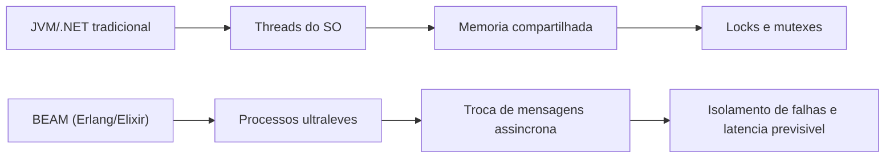
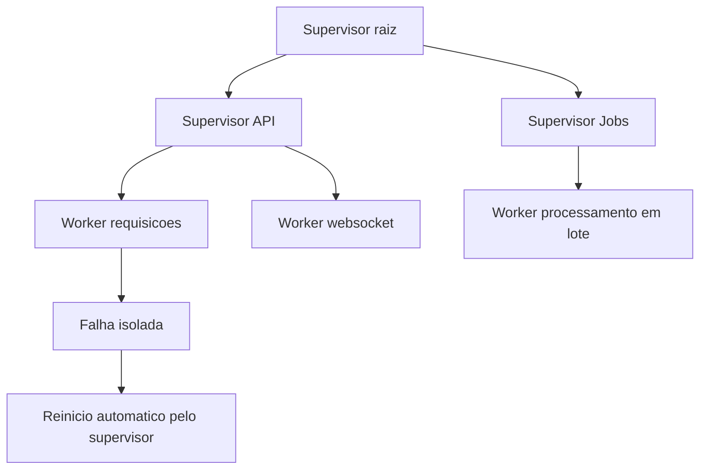
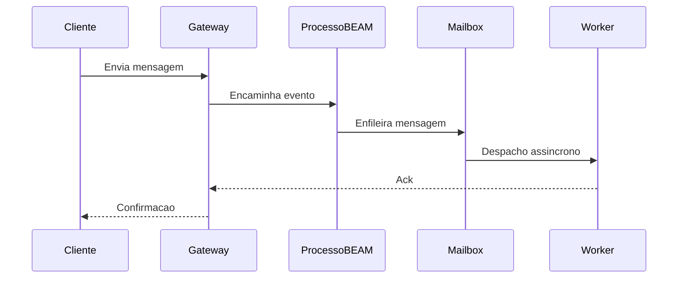
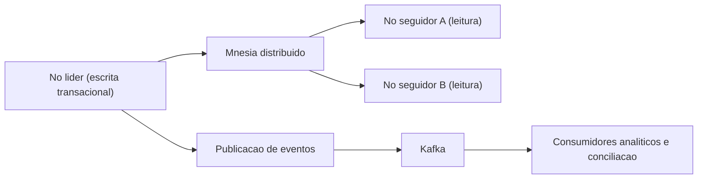
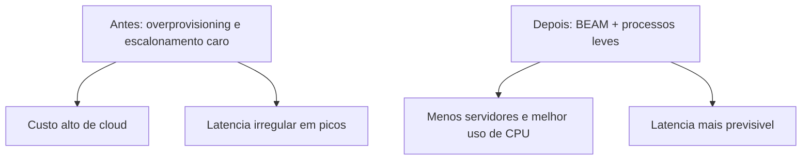

# **अपेसांत पडनातल्यो प्रणाली: एरलांग/ओटीपी आनी एलिक्सिर पर्यावरण प्रणाली ही मिशन-क्रिटिकल अनुप्रयोगां खातीर निवड कित्याक**

समकालीन सॉफ्टवॅर मुळाव्या साधनसुविधांक गुंतागुंत आनी अकार्यक्षमताय हांचे चिरकालीन संकश्टाक तोंड दिवचें पडटा. वापरप्यांची येरादारी अपूर्व प्रमाणांत पावता आनी उद्देगीक सुप्तताय सहिष्णुताय निरपेक्ष शून्या लागीं पावता तेन्ना, संघटना चड करून प्रतिक्रियाशील वास्तुशिल्प उपायांचेर वळटात जे फकत चड भार आशिल्ल्या प्रणालींच्या लक्षणांक संबोधीत करतात, तांच्या तंत्रज्ञान स्टॅकांतल्या मुळाव्या दुबळेपणांक दुर्लक्ष करतात. अति-कणदार सूक्ष्मसेवा, गुंतागुंतीची सेवा जाळी, सर्किट ब्रेकर आनी जटिल कंटेनर ऑर्केस्ट्रेटर हांचो अव्यवस्थित प्रसार हो चड करून उद्देगांतल्या प्रबल प्रोग्रामिंग भाशांनी आशिल्ल्या समवर्ती आनी राज्य वेवस्थापन मॉडेलांच्या संरचनात्मक मर्यादांक स्टॉपगॅप प्रतिसाद आसा. जेन्ना मुळावी मुळावी बांदावळ मुळ दोश वेगळेपण आनी व्हड प्रमाणांत समवर्तीपण हांचेखातीर ताच्या बौध्दिक कोरापसून तयार केल्ली नासता तेन्ना विस्वासपात्रताय अभियांत्रिकी संरचनात्मक नुकसान कमी करपाचो एक सासणाचो आनी पुराय व्यायाम जाता.

अस्थिरतायेचे प्रस्न आनी चड मेघ खर्च हांचें खाशेलपण आशिल्ल्या ह्या कॉर्पोरेट परिदृश्यांत, एरलांग/ओटीपी (उक्ते दूरसंचार प्लॅटफॉर्म) पर्यावरण प्रणाली आनी तिची आधुनीक समकक्ष, एलिक्सिर भास, अनिश्चीत प्रायोगिक साधनां म्हणून न्हय, पूण एक परिपक्व प्रतिमान म्हणून उदेतात, जी दशकां पयली पुरायपणान झुजाची चांचणी केल्ली. मुळाव्यान गणितीय नदरेन अपेसांत पडूंक शकना अशा दूरसंचार स्वीचां खातीर तयार केल्ली ही पर्यावरण यंत्रणा संवसारीक पांवड्यार परस्पर संबंदीत प्रवास वेवस्थापन प्लॅटफॉर्म, गंभीर अर्थीक निवाडो प्रणाली आनी रियल-टायम संदेशन हांचे खातीर निर्विवाद "भांगराचो कोनसो" अशें सिद्ध जालां. सकयल दिल्लें तंत्रीक आनी वास्तुशिल्प विश्लेशण उच्च समवर्ती आनी व्हड प्रमाणांत जाय आशिल्ल्या अनुप्रयोगांच्या परदे फाटल्यान कार्यावळीचें बारीकसाणीन विच्छेदन करता, खऱ्या टेलिमेट्री आनी खोल अभियांत्रिकी केस स्टडीचेर आदारीत, BEAM आभासी मशीनाची मुळ दोश सहिष्णुताय कित्याक कंपनींक अतुलनीय स्पर्धात्मक फायदो दिता, जांकां आपलीं कार्यावळीं टिकावू आनी अव्यवस्थितपणान स्केल करपाची गरज आसा हें दाखयता.

## **लचीलापणाची शरीररचना: बीम आभासी मशीन प्रतिमान**

एर्लांग आनी एलिक्सिर पर्यावरण यंत्रणेचें तंत्रीक श्रेश्ठताय मुखेलपणान तांच्या कार्यात्मक वाक्यरचनेंत वा तांच्या मानक लायब्ररींच्या व्हड सरणींत न्हय, तर तांच्या मुळाव्या आभासी मशीन बीएम (बोगदान/ब्योर्न हाचें एर्लांग अमूर्त मशीन) हांच्या मुळाव्या आनी दृश्टीकोन वास्तुकलेंत आसा. पारंपारीक भासो आनी पर्यावरण प्रणालींभशेन, जीं मूळ कार्यप्रणालीच्या *धाग्यांक* थेट नकाशे तयार करपाचेर आनी स्मृती जाग्याची सतत वांटणी करपाचेर चड आदारून आसतात, बीएम अभिनेतो मॉडेल (*अॅक्टर मॉडेल*) खर शुध्दतायवादी आनी गणितीय नदरेन वेगळे केल्ले पद्दतीन चालीक लायता.

**आकृती: वास्तुशास्त्रांमदल्या सर्तीची तुळा**


जावा व्हर्च्युअल मशीन (JVM) वा C\#-आधारीत कार्यान्वयन अशा मानक उद्देगीक पर्यावरण प्रणालींत, कार्यकारी *थ्रेड* च्या दृष्टांतीकरणाक अत्यंत म्हत्वाचो संगणकीय खर्च आसता, चड करून प्रोसेसराचेर जड संदर्भ स्वीचिंग (*संदर्भ स्वीचिंग*) लादपावांगडाच, फकत ताचो मुळावो कार्यान्वयन स्टॅक वाटप करपाखातीर रॅम मेमरी मेगाबाइट वापरतात. हाचे सामके उरफाटें बीईएमांत समवर्तीपणाचे मुळावे आनी मुळावे एकक म्हळ्यार एर्लांग "प्रक्रिया", ही अमूर्तताय जाचो कार्यप्रणालीच्या जड प्रक्रियांकडेन थेट संबंद ना. हे अंतर्गत प्रक्रिया असामान्य हलके डेटा संरचना आसतात, सादारणपणान स्टार्टअप करतना फकत कांय शेंकड्यांनी बाइट वापरतात. ही अत्यंत खंडीय कार्यक्षमताय एकाच भौतिक सर्वर नोडाक मशीनाच्यो स्मृती संसाधनां सोंपनासतना वा संदर्भ स्वीचांनी केंद्रीय प्रक्रिया एकक (CPU) गळो घालनासतना एकाच वेळार लाखांनी समवर्ती प्रक्रिया चालीक लावपाक मेळटा.

डेटा अखंडते खातीर आनीकय गंभीरपणान, ह्यो हलके प्रक्रिया वांटून घेतिल्ल्या स्थितीच्या पुरायपणान अभावाच्या पद्दती खाला काम करतात (*शेअर-कांयच ना आर्किटेक्चर*). तांचेमदलो संवाद आनी डेटा हस्तांतरणाचे प्रवाह फकत शुध्द अतुल्यकालिक संदेश विनिमय यंत्रणेवरवीं जाता, जंय वैयक्तीक मेलबॉक्सांक प्रत केल्लो डेटा मेळटा. वांटून घेतिल्ले स्थितीचें पुरायपणान ना करप, कळींत, समवर्ती संगणक शास्त्राच्या अभिजात विसंगतींचे पुराय वर्ग निप करता, जशे की प्रणालीगत *अडचणी* आनी अदमासाक येवंक नाशिल्ली *वंश परिस्थिती*. ताका लागून, *लॉक*, *म्युटेक्स* आनी सेमाफोर अशीं जटिल यांत्रिक समक्रमण यंत्रणां आवाहन करपाची गरज कालबाह्य जाता, जीं आर्टिफॅक्ट परंपरेन उच्च भार प्रणालींतल्या कार्यक्षमतेक दंड दितात आनी चड करून डिबग करपाक कठीण अशा वादाच्या अडचणींक कारणीभूत जातात.

| वास्तुशिल्पाचें खाशेलपण | पारंपारीक पर्यावरण यंत्रणा (देखीक: जेव्हीएम,.नेट) | बीम आभासी मशीन (एर्लांग / अमृत) |
| :---- | :---- | :---- |
| **सर्त मॉडेल** | ओएस *धागे*, मॅपिंग:1 वा M:N संकुल | अति-हलके वजनाचे व्हीएम-पातळेचे प्रक्रिया (अॅक्टर मॉडेल) |
| **थळावी प्रमाण क्षमता** | हजारांनी *धागे* (व्यावहारीक मर्यादा) | दर नोडाक एकाच वेळार लाखांनी प्रक्रिया |
| **राज्य वेवस्थापन** | *लॉक* कडल्यान नियंत्रीत केल्ली वांटणी केल्ली जागतीक मेमरी | *शेअर-कांयच ना* वास्तुकला, संदेश पासिंग |
| **मुळ दोश सहिष्णुताय** | श्रेणीबध्द अपवाद प्रसार, *प्रयत्न/पकडप* | दाणेदार देखरेख झाडां, कोशिकीय वेगळेपण |

### **पूर्वनिर्धारीत वेळापत्रक आनी उण्या अदमास सुप्तता**

सहकारी सर्तीचेर लक्ष केंद्रीत केल्ल्या आर्विल्ल्या भासांतलो एक सामान्य वास्तुशिल्पाचो दोश म्हळ्यार संगणकीय नदरेन सघन नित्यनेमावरवीं इव्हेंट *लूप* आडावपाची संवेदनशीलताय, जी प्रक्रिया कोरांचेर मक्तेदारी करता आनी अदमासाक सुप्तताय वाडयता. BEAM आभासी मशीन ऍप्लिकेशन पातळेचेर खरपणान पूर्वनिर्धारीत वेळापत्रक चालीक लावून ही गणितीय दुविधा सोडयता. BEAM ची अंतर्गत यंत्रणा (*शेड्यूलर*) दरेक वैयक्तीक प्रक्रियाक "उणें करप*" नांवाच्या मेट्रीक एककांत मेजपाचो मर्यादीत कार्यान्वयन कोटा दिता, जो, सोंपे पद्दतीन, फंक्शन कॉल वा कार्यकारी मर्यादेकडेन जुळटा.

जेन्ना चालू प्रक्रिया आपलो वाटप केल्लो उणो करपाचो कोटा सोंपता, तेन्ना BEAM वेळापत्रक ताका जबरदस्तीन स्थगीत करता, ताची अचूक स्थिती सांबाळटा आनी रोखडीच CPU चक्रां कार्यान्वयन रांगेत वाट पळोवपी फुडले प्रक्रियाक सोडटा. ही बारीकसाणीन केल्ली रचना चड लांब कार्यावळ केल्यार यंत्रणेच्या हेर म्हत्वाच्या भागांक उपाशीं पडचीं न्हय हाची पुरायपणान खात्री जाता. ह्या आक्रमक पूर्वग्रहाचो थेट परिणाम म्हळ्यार एक अत्यंत अदमासाक येवपी आनी सपाट शेंपडी सुप्तताय, "मृदु रियल-टायम" संकल्पनेक मान दिवपाची गरज आशिल्ल्या प्लॅटफॉर्मां खातीर वाटाघाटी करपासारकें नाशिल्लें खाशेलपण, जशें जागतीक दूरध्वनी नेटवर्क आनी अर्थीक बाजारांत ऑर्डर सबमिशन मुळावी बांदावळ, जंय प्रतिसाद दिवपाक कळाव जाल्यार सेवेचो दर्जो खूब उणो जाता वा दशलक्ष डॉलर अर्थीक लुकसाण जाता.

### **कोयर एकठांय करपाचो जागतीक खर्च आनी बीम प्रक्रिया उपाय**

लाखांनी एकाच वेळार विनंती प्रक्रिया करपी कॉर्पोरेट प्रणालीं खातीर एक व्हडली लिपल्ली अडचण म्हळ्यार कोयर एकठांय करप (*कोयर एकठांय करप* \- जीसी) कडल्यान लादिल्लो खर्च. पारंपारीक उच्च कार्यक्षमताय मॉडेल, जशे की JVM चो G1 (Garbage-First) संग्रहक, अत्याधुनीक अनुमानशास्त्रा वांगडा काम करतात, जागतीक *रास* स्मृतीची तार्कीक प्रदेशांनी (देखीक *Eden*, *Survivor* आनी *Old*) विभागून निश्क्रीय वेळ उणो करपाचो यत्न करतात. पूण, हे पिळगेचे पद्दती कितलेय परिष्कृत आसले तरी, वा Shenandoah वा ZGC सारकिल्या आधुनीक कार्यान्वयन लेगीत, सार्वत्रिक वांटून घेतिल्ल्या *रास* चेर अवलंबन अनिवार्यपणान *Stop-The-World* (STW) काळ लादता, सुरक्षीतपणान संकुचीत वा स्कॅन मेमरी करपाक सगळ्या ऍप्लिकेशन *धाग्यांक* तात्पुरतें पक्षाघात करता. दर सेकंदाक लाखांनी घडणुकांच्या प्रमाणांत हे सूक्ष्म विराम एकठांय जातात, जाका लागून सेवा पातळेचे करार (SLA) खरपणान उणे जातात आनी मान्य अनिश्चीत सुप्तताय निर्माण जातात. गोलांग सारकिल्या मूळ भाशांचेर आदारिल्लीं प्रणालीं, *goroutines* वरवीं समवर्तीपणाक अनुकूल केल्लीं आसलीं तरी, कठीण सुप्ततायेचेर परिणाम करपी सार्वत्रिक जीसी विरामांकय त्रास दितात, हो घटक चड करून जटिल हायपरस्केल वास्तुशिल्प स्थलांतरांक चालना दिता.

बीम एक कुशळटायेन पद्दत आपणायता जी ही सार्वत्रिक दुविधा कार्बनी रितीन पयस करता. थारायिल्ले प्रमाण दरेक एरलांग प्रक्रियेक आपलो खाजगी आनी पुरायपणान वेगळो केल्लो मेमरी क्षेत्र (ताचो स्टॅक आनी स्वताचो ल्हान *रास*) आसता. ताका लागून कोयर एकठांय करपाच्या कार्यावळींनी अर्जाची जागतीक स्थिती विश्लेशण करपाची गरज ना. मेमरी स्कॅनींग पुरायपणान स्वतंत्रपणान आनी प्रक्रिया-दर-प्रक्रिया तत्वाचेर वेगळेपणान जाता. कोयर एकठांय करपी सर्वराचेर एकाच वेळार वेळापत्रक केल्ल्या हेर लाखांनी अभिनेत्यांचो कार्यकारी प्रवाह खंडीत करिनासतना एकाच अभिनेत्याचो ल्हानसो स्मृती कुडको निवळ करता. चड करून पर्यावरण प्रणालींतल्या चयापचयाच्या अपरिवर्तनीय स्वरुपाक लागून आनी वेव्हारीक प्रणालींतल्या चडशा प्रक्रियांच्या क्षणिक स्वरुपाक लागून, जेन्ना अल्पकाळाची प्रक्रिया (देखीक एकूच HTTP विनंतीचेर प्रक्रिया करप) आपलें काम पुराय करता तेन्ना ताची सगळी वाटप केल्ली मेमरी रोखडीच कार्यप्रणालींत परत जाता. स्मृती व्याप्तीचो हो पुरायपणान नाश जाल्ल्यान त्या ब्लॉकाचेर खंयच्याय कोयर एकठांय करपाच्या कार्यावळींची गरज ना जाता, जाका लागून समन्वय संगणकीय ओव्हरहेडाचो व्हड प्रमाण ना जाता.

## **"लेट इट क्रॅश" तत्वगिन्यान आनी देखरेख झाडां**

बीईएम पर्यावरण यंत्रणेंतली यांत्रिक लवचीकता आनी दोश सोंसपाची तांक हेर प्रोग्रामिंग भाशांनी सार्वत्रिकपणान शिकयल्ल्या आनी लागू केल्ल्या रक्षात्मक अपवाद हाताळपापसून मुळाव्यान वेगळी आसता. गुंतागुंतीच्या चुक नियंत्रण ब्लॉकांचो आस्पाव आशिल्ल्या दरेक कल्पनीय विसंगतीचो अदमास आनी पकडपाचो यत्न करपाक विकसकाक प्रोत्साहन दिवचे परस, एरलांगच्या संस्थापक अभियंत्यां कडल्यान (जो आर्मस्ट्रांग, रॉबर्ट विर्डिंग आनी माईक विल्यम्स) उत्पन्न जाल्लें मुळावें तत्वगिन्यान आपल्या बोधवाक्याक लागून कुस्तीगीर आसा: "तें क्रॅश जावंक दिवचें."

**आकृती: देखरेख झाड आनी वसुली रणनीती**


मेमरी वांटून घेनासतना प्रक्रिया अंतर्गतपणान वेगळीं केल्यात हें मतींत घेतल्यार, स्थिती भ्रश्टाचार वा वेवसायीक तर्कशास्त्रांतल्या *बग* कडल्यान उत्पन्न जावपी प्रक्रिया अचकीत क्रॅश, भ्रश्ट जाल्लो नेटवर्क पॅकेट, वा भायल्या डेटाबेसांतल्या विसंगतींतल्यान चलपी प्रणालीच्या एकंदर अखंडतेचेर प्रसार करपाक आनी परिणाम करपाक भौतिक साधनां नात. अपेस हर्मिटीक रितीन त्या प्रक्रियेच्या व्याप्तींत आस्पावता. ह्या वेगळे केल्ल्या घातकतायेक तोंड दिवपाखातीर, ओटीपी मानक लायब्ररी देखरेख झाडां (*देखभाल झाडां*) ही मुळावी संकल्पना वळख करून दिता, एक खर श्रेणीबध्दताय स्थापन करता जंय समर्पीत संरचनात्मक प्रक्रियांक (जाका सुपरवायझर म्हण्टात) फकत अंतर्गत प्रणाली दुव्यां वरवीं उपप्रक्रियांच्या (जाका *कामगार* म्हणटात) जिवीत आनी भलायकी निरिक्षण करपाचें काम दिल्लें आसता.

कामगाराची प्रक्रिया अचकीत अपेशी थारल्यार मरणाची घडणूक ताच्या थेट देखरेख करप्यान रोखडोच काडिल्लो संकेत सोडटा. निश्र्चीतपणान पूर्वनिर्धारीत वसुली धोरणांतल्यान वावुरपी देखरेख करपी, ज्ञात, निवळ, स्थिर स्थितींतल्यान प्रभावित प्रक्रिया परतून सुरू करपाक वावुरता. हें कोशिकीय पुनर्प्राप्ती मॉडेल जैविक संरक्षण यंत्रणेचें कार्यक्षमतेन अनुकरण करता, जंय भ्रश्ट जाल्ल्या वैयक्तीक कोशिकाचें अपोप्टोसीस वा मरण यजमान जीवाकडेन तडजोड करपाक अपेस येताच, पूण ताची स्वताची जतनाय घेवपाखातीर आनी बरे जावपाखातीर एक गरजेचें पावल आसता. दायजी वस्तू-प्रधान प्रणालींत, केंद्रीय *धागे* मदलो हाताळूंक नाशिल्लो अपवाद जागतीक स्मृती संदर्भ भ्रश्ट करूंक शकता आनी पुराय सर्वर सकयल हाडूंक शकता; BEAM त, अशाच प्रकारच्या क्रॅशाचो परिणाम फकत त्या प्रतिबंधीत कामाक जापसालदार आशिल्ल्या व्यक्तीचो तात्पुरतो पडटलो आनी परतून वयर सरता, ताका लागून भ्रश्ट मार्गान प्रवास करिनाशिल्ल्या वापरप्यांक उतार-चढाव लेगीत दिसचो ना हाची खात्री जाता.

एलिक्सिरांत देखरेखीचो सचित्र स्कॅलेटन (सादारण ओटीपी एपीआय; पुराय सेवा न्हय):

```elixir
children = [
  {MyApp.TcpGateway, []},
  {MyApp.JobWorkers, []}
]

Supervisor.start_link(children,
  strategy: :one_for_one,
  max_restarts: 10,
  max_seconds: 60
)
```
## **मास संदेशन आनी रियल-टायम संचारण प्लॅटफॉर्म**

एकाच वेळार संचारण मंच संगणकीय सर्तीच्या खंयच्याय मॉडेलाखातीर लिटमस चांचणेचें प्रतिनिधित्व करतात हातूंत दुबाव ना. एकाच वेळार शेंकड्यांनी हजारांनी *TCP* वा *WebSockets* जोडणी उक्ते दवरपाची अदमती तंत्रीक गरज, द्विदिशी मेटाडेटा पॅकेटांक गतिशीलपणान मार्ग दिवपाची गरज आनी जागतीक प्रमाणांत सक्रिय उपस्थितीचो मागोवपाची गरज, पारंपारीक वास्तुकलेचेर आदारीत सर्वरांक आनी समकालिक विनंती आडावपाचेर खर भार घालता.

**आकृती: रियल-टायम संदेशन प्रवाह**


### **व्हॉट्सअॅप केस: अर्द अब्ज कनेक्शनांचें अत्यंत ऑप्टिमायझेशन**

एरलांगच्या स्पर्धात्मक शक्तीचो सगळ्यांत प्रतीकात्मक आनी सगळेकडेन अभ्यास केल्लो केस स्टडी म्हळ्यार व्हॉट्सअॅपाच्या वास्तुकलेचो उल्कापात आनी तिगून उरप. मेटा म्हामंडळान घेवचे पयलीं आनी अब्जांनी वापरप्यां मेरेन विस्तार करचे बऱ्याच आदीं, व्हॉट्सअॅप पयलींच भयानक प्रमाणांत काम करतालो, 2014 च्या पयल्या तिमाहींत, सुमार 465 दशलक्ष सक्रिय म्हयन्याळ्या वापरप्यांक आदार दितालो. ह्या तंत्रीक पराक्रमाचें सगळ्यांत विस्मयकारक घटक कंपनीच्या संघटनात्मक संरचनेंत रावलें: पन्नासा परस चड अभियंत्यांनी तयार जाल्लो एक दुबळो पंगड, शुध्द विकास आनी मुळाव्या साधनसुविधा कार्यावळीं मदीं विभागिल्लो, ताचो अणकार सुमार 4 कोटी वापरप्यांच्या समताप मंडलीय प्रमाणांत जाता आनी ताका एकाच *बॅकएंड* अभियंत्याचो आदार मेळटा.

मुळावी मुळावी बांदावळ व्हड प्रमाणांत Erlang दृष्टांत चालीक लावपी FreeBSD सर्वरांचेर घट्टपणान आदारून आशिल्ली, जी BEAM च्या मुळ सममितीय बहुप्रक्रिया (SMP) मापनक्षमताय कडल्यान चालीक लायिल्ली रणनिती निवड. हजारांनी ल्हान सर्वरांनी कार्यकारी गुंतागुंत शिंपडावचे परस, व्हॉट्सअॅपान अत्यंत दाट आनी उबे *हार्डवेअर* प्रसंग (डझनभर भौतिक कोर आशिल्ले *Ivy Bridge* प्रोसेसर, व्हड प्रमाणांत *हायपरथ्रेडिंग* आनी एकत्रीत *Dual-link GigE* नेटवर्क जोडणी आशिल्ले संगणन नोड्स) वापरपाचें निवडलें, जाका लागून कार्यकारी गुंतागुंत उणी करपाक जागतीक सर्वराची संख्या उणी दवरली. त्या युगांतल्या कार्यक्षमतेक चडांत चड काळांत, प्रणालीन हजारांनी एकत्रीत लॉजिकल CPU कोर वापरली आनी दर सेकंदाक 70 दशलक्ष परस चड आंतर-प्रक्रिया एरलांग संदेशांच्या चकचकीत मेट्रीकाचेर प्रक्रिया केली.

नेटवर्कान दिसाक एकूण वट्ट 19 अब्ज येवपी आनी 40 अब्ज भायर सरपी संदेश हाताळ्ळे, दर सेकंदाक 230,000 प्रमाणीकरणां घडपी एकाच वेळार सक्रिय दवरिल्ल्या 147 दशलक्ष जागतीक टिकावू जोडणींक आदार दिलो. हें नेटवर्क स्थिरपणान चलता हाची खात्री करपा खातीर व्हॉट्सअॅपाच्या *सॉफ्टवॅर* आर्किटॅक्टांनी मानक लायब्ररीच्या वापरा परस चड करून अंतरंग आभासी मशीन वागणूक आशिल्ली आक्रमक वास्तुशिल्प रणनिती चालीक लायली. डिकॉप्लिंगाच्या हरक्युलीयन यत्नांत तांणी एकाच मॉड्यूलांतल्या प्रक्रिया अडचणींक संचारण कापडांत कॅस्केडींग अपयश निर्माण जावचे न्हय म्हूण अर्ज क्षेत्रां खरपणान वेगळीं केलीं. तांणी पद्दतशीरपणान समकालिक आवाहन (handle\_call) परस शुध्द अतुल्यकालिक संदेश पासिंग (handle\_cast) वापरपाक फावशी दिली, जाका लागून खंयचीय प्रक्रिया अदमासाक येना अशा नेटवर्कांत प्रतिसादांची आडायल्ली वाट पळोवची न्हय.

`gen_server` (Elixir `GenServer`) शैलींत उण्यांत उणो विपरीतताय, फकत परिभाषा एंकर करपाक:

```elixir
defmodule MyApp.Router do
  use GenServer

  @impl true
  def handle_cast({:route_async, event}, state) do
    # despacho "fire-and-forget"; o chamador nao bloqueia
    {:noreply, state}
  end

  @impl true
  def handle_call({:fetch_sync, key}, _from, state) do
    # requisicao/resposta; pode acorrentar espera sob rede lenta
    {:reply, Map.get(state, key), state}
  end
end
```
मुळाव्या साधनसुविधांतल्या आंतर-नोड जोडणींत भंयकर *हेड-ऑफ-लायन ब्लॉकिंग* टाळपा खातीर तांणी मार्ग रांकांचें क्रूर वेगळेपण सुरू केलें. जेन्ना संदेश *डेटासेंटर* क्लस्टरांतल्या वेगवेगळ्या नोड्सांचेर धाडटाले, तेन्ना डेटा वैयक्तीक हलके वजनाच्या एरलांग प्रक्रियांक वाटप केल्लो. दिल्ल्या रिसीव्हिंग नोडाक क्षय वा खर प्रतिसाद सुप्तताय भोगपाक लागली जाल्यार, फकत त्या समस्याप्रधान नोडाखातीर नियत आशिल्ले संदेश थळाव्या अभिनेत्याच्या तर्कशास्त्राच्या आदारान रांक घालताले, जाल्यार भलायकेन बऱ्या नोडांखातीर नियत केल्ले संचार डिस्पॅचिंग ऍप्लिकेशनाचेर प्रणालीगत प्रतिगामी दाब (*बॅकप्रेसर*) लागू करिनासतना मुक्तपणान व्हांवताले.

तेभायर मानक वाचनालयांतल्या अंतर्निहित अडचणींक लागूनय अत्याधुनीक पुनर्लेखनाची गरज आशिल्ली. जेन्ना जेनेरिक सर्वराची एकूच डिस्पॅच प्रक्रिया (gen\_server) TCP जोडणी शोशून घेवंक शकली ना, तेन्ना अभियंत्यांनी लायब्ररी बदला gen\_industry नांवाच्या स्वताच्या अनुकूल केल्ल्या मॉड्यूलान बदलली, व्हड प्रमाणांत समांतर डिस्पॅच प्रक्रिया वापरून. समांतर रितीन, एरलांग वितरीत डेटाबेस (Mnesia) च्या साठवण आनी राज्य उपप्रणालीच्या पातळेचेर, ज्यांतल्यान सुमार 18 अब्ज मेटाडेटा रॅमांत आशिल्लो, तांणी मुळ स्त्रोत कोडांत *पॅच* तयार केले, जेणे करून एका परस चड वेव्हार वेवस्थापकांक अतुल्यकालिक घाण प्रतिकृतींखातीर (async\_dirty) परवानगी दिली, तेभायर *I/O* प्रवर्धन करपाक जायत्या भौतिक डिस्कांचेर तार्कीक निर्देशिका भौतिक रितीन विखंडीत केले. *थ्रूपुट* हें नांव.

ह्या प्रमाणांतल्या अत्यंत गुंतागुंतीच्या आदारान खंयचीच यंत्रणा जाळयेच्या मुळाव्या भौतिकीपसून प्रतिकारशक्ती ना हेंय स्पश्ट जालें. 210 मिनटां चलपी दस्तावेजीत स्मारकीय ब्लॅकआउट, मुखेलपणान गंभीर व्हीएलएन सकयल हाडपी दोशी कोर राऊटराक लागून निर्माण जाल्ल्यान, एकाच वेळार व्हड प्रमाणांत जागतीक पुनर्जोडणी करपाक लायली. जोडणींच्या ह्या सुनामीन एरलांग जागतीक प्रक्रिया क्लस्टराक (pg2 उपप्रणाली) अल्गोरिदमिक गुंतागुंत आनी संदेश येरादारी **अतिरेखीत** पद्दतीन वाडपी (पुनर्जोडणी एकठांय जातकच साखळी कामाचे स्फोट) आशिल्ल्या घातक वळीक उडयली. अंतर्गत संदेश रांक अचकीत मुळाव्या मेट्रीकांतल्यान सेकंदाच्या अपूर्णांकांनी उरिल्ल्या 40 लाखांनी उडी मारली, साखळी कोसळप जें फुडल्या वर्सांनी अधिकृत *OTP* फावंडेशन पातळेचेर येरादारी नियंत्रण उपप्रणालीच्या वर्तनाच्या युरिस्टीकांत म्हत्वाची पुनरावृत्ती करपाक सक्तीचें काम करतालें.

| व्हड प्रमाणांत वास्तुशिल्प मेट्रीक | व्हॉट्सअॅप प्रकरणांत पळोवपाची अंमलबजावणी (2014) |
| :---- | :---- |
| **संवसारीक सर्तीचें कळस** | 147 दशलक्ष गिरायक जोडणी उक्ती |
| **मासीक हस्तांतरण शुल्क** | \~465 दशलक्ष वेवस्थापन सक्रिय वापरपी |
| **ग्राहक/अभियंतो प्रमाण** | सुमार 1000 किमी. दर बीम अभियंत्याक 4 कोटी वापरपी |
| **अंतर-प्रक्रिया येरादारी (व्हीएम)** | 70 दशलक्ष शिपमेंट/सेकंद परस चड शिखर |
| **स्मृतिभ्रंश क्रिटिकल ऑप्टिमायझेशन** | *मुळ पॅच* async\_dirty समांतर प्रतिकृती करपाक परवानगी दिवपी |
| **ब्लॉकिंग विरोधी रणनीती** | gen\_industry आनी *Worker FIFO dispatching* तयार करप |

### **द डिस्कॉर्ड कंप्यूटिंग चॅलेंज: एलिक्सिर मेट्स रस्ट**

मुखेलपणान गेमींग समुदायांच्या अति-मांगडी आनी सुप्तताय-संवेदनशील कोनशाक उद्देशून एकाच वेळार आवाज आनी मजकूर चॅनल आर्केस्ट्रा करपाक तयार केल्ल्या डिस्कॉर्ड प्लॅटफॉर्मान, एकदां तांचे वांगडा आशिल्लो पारंपारीक Ruby सोडून, पायथन नित्यनेम आनी C++ जोडणीं कडेन ताच्या प्राथमीक डेटा मुळाव्या साधनसुविधांचो पूरक जावन, एलिक्सिर प्रसंगां वांगडा ताच्या रियल-टायम *गप्पा* सेवेचो चडसो फाटीचो कणो तयार केलो. बीएमची अंतर्गत स्पर्धात्मक शक्त ही साधनात्मक थारली; संघटणेन 400 ते 500 घटमूट एलिक्सिर मशीनांच्या श्रेणींतलो प्राथमीक बेडा आयोजीत केला, जो कॉर्पोरेट संचारण कार्यक्षमतायच्या शिमेचेर काम करता.

डिस्कॉर्ड टोपोलॉजीचें भयानक तंत्रीक यश कार्यात्मक मॉडेलिंगाच्या तत्वगिन्यानाचेर आदारिल्लें: चौकटीन आपलो *बॅकएंड* आर्केस्ट्रा केलो की दरेक वैयक्तीक डिस्कॉर्ड सर्वर (संरचनात्मक मॉड्यूलाक अंतर्गतपणान *गिल्ड* अशें म्हण्टात) हेरांच्या संदर्भांत पुरायपणान स्वायत्त आनी कॅप्सूल केल्ल्या पद्दतीन व्हीएमांत चलपी एरलांग प्रक्रिया म्हणून दृष्टांत दिली. जशीं जशीं वर्सां फुडें वताली आनी वाड आक्रमकपणान वाडत गेली तशीं तशीं, डिस्कॉर्ड रोखडेंच मार्गदर्शक तत्वांचेर पावलो आनी सुमार 50 लाख समवर्ती सक्रिय वापरप्यांनी दर सेकंदाक लाखांनी विश्लेशणात्मक आनी संवादात्मक घडणुको निर्माण करून प्रणालीच्या कापडांत पातळ्ळी. एरलांग मॉडेलान आपली अत्यंत सुप्तताय परिणामकारकता दाखयली: पर्यावरण यंत्रणा समकालिक दवरपाखातीर, विनंती/प्रतिसाद स्वरूपांत काम करपी रिमोट वितरीत प्रक्रियांमदीं क्लस्टरांतल्यान संवाद सुरू करपी दरेक घडणुकेक दर संदेश पासाक सुमार **12 मायक्रोसेकंद** इतलो सरासरी उणो अंतर्गत खर्च अणभवलो.

वास्तुकलेंत मात सतत रावपाची वेवस्था आनी व्हड प्रमाणांत वास्तुशिल्पाचें मुल्यांकन करचें पडटालें. सुरवेक, Discord अभियांत्रिकी पंगडान गिल्ड जोडणींच्या गतिशील मार्गनिर्देशनाकडेन (प्रक्रिया शेंकड्यांनी क्लस्टर प्रसंगांनी गतिशीलपणान विस्थानीक केल्ल्यान) मंद कोश्टक यंत्रणा थळाव्या उपाय (*fastglobal*) म्हणून परतून बरोवपाचो यत्न करून हाताळ्ळी, फकत गतिशील पुनर्संकलन VM चो गंभीर रेखीव मुळावो मुळावो सोद घेवपाखातीर, जंय कोड मॉड्यूल परतून बांदपाचो आनी परतून लोड करपाचो संगणकीय खर्च आसा नोडाचेर आशिल्ल्या उक्त्या प्रक्रियांच्या कच्च्या संख्येप्रमाण रेखीव आनी विध्वंसक रितीन स्केल केल्ली स्मृती. (500,000 सक्रिय सत्रां मेरेन व्हरपी सर्वरांचेर व्हड परिणाम).

कॉर्पोरेट उत्क्रांतींतल्यान, केंद्रीय क्लस्टरांतल्या एकाच वेळार 11 दशलक्ष वापरप्यांचेर काम करपी चडांत चड, एक आव्हान सुरू केलें, जें शुध्दपणान कच्च्या CPU ओव्हरहेडा वांगडा जुळटालें, जें एलिक्सिराच्या कार्यात्मक शुध्दतावादी प्रतिमानाच्या अविकारी सोयीचो आंशिक सोडून दिवपाक लायलो. आव्हान साद्या अल्गोरिदमिक प्रत्यक्षांतल्यान निर्माण जालें, तरी लेगीत ताच्या कार्यान्वयनाच्या प्रमाणांत भयानक: प्रचंड सर्वरांचेर दिसपी "वांगडी वळेरी" चें रियल-टायम तात्पुरतें अद्ययावत. पुराय *गिल्ड* च्या वट्ट वांगड्यांची संख्येचेर आदारीत हजारांनी निश्क्रीय क्लायंटांक अस्पश्ट अद्ययावत धाडचे बदला, सद्या वाटप केल्ल्या आनी दृश्य क्लायंट विंडोंत रेंडर केल्ल्या वांगड्याचो मेटाडेटा फकत जटिल *diff* (परस्पर संवादात्मक स्थिती बदल) त गणीत करचो, बॅटरी आयुश्य वाटोवपाखातीर अनुक्रमणिकांनी थळाव्या केल्ल्या अवकाशीय घालप आनी काडून उडोवपाचो अहवाल दिवप अशें तर्कशास्त्रान थारायलें *स्मार्टफोन* आनी कॉर्पोरेट मुळाव्या साधनसुविधांचो एकंदर बँडविड्थ भार सोंपें करप.

सर्वर *बॅकएंड* डोमेनांत, ह्या फायदेशीर मेट्रीक नोड्सांक जटिल स्मृती संरचना वाटपाक लायलो, जाका लागून शेंकड्यांनी हजारांनी परिपूर्ण क्रमबद्ध अस्तित्वां तिगोवन दवरपाक व्हड नित्यनेमांची गरज आशिल्ली, सुदारीत अनुक्रमणिकां कडल्यान अचूक परताव्या सयत रेखीव सोद कार्य करतना सक्रिय उत्परिवर्तनाच्या दोंगरांक बारीकसाणीन प्रतिसाद दिलो. एलिक्सिर सारक्या खरपणान कार्यात्मक भाशांनी मुळावी डेटा संरचना सार्वत्रिकपणान अपरिवर्तनीय आसता. जटिल सोद झाडांतल्या दर एका ल्हान क्रमीक बदलाक संगणकीय नदरेन सर्वराक राज्याचीं विस्तारीत डुप्लीकेटां तयार करचीं पडटालीं आनी थळाव्या कोयर एकठांय करपाची सेवा सघन आनी हिंसकपणान आवाहन करची पडटाली, जाका लागून जागतीक कार्य सत्रांच्या उत्परिवर्तनाक वेळार प्रतिसाद दिवपाखातीर प्रोसेसराचेर असह्य उश्णताय ओव्हरलोड तयार जाताले.

संचारण-प्रधान बीएमच्या हे सैमीक कठीण मर्यादेक तोंड दिवन, डिस्कॉर्डान एलिक्सिरच्या बीएम कडेन परस्पर संबंदीत रस्टांत कोड केल्ल्या प्रक्रिया मॉड्यूलांचें एकीकरण करून नेटिव्ह इंटरफेस फंक्शनलिटीज (*एनआयएफ \- नेटिव्ह इम्प्लीमेंटेड फंक्शन्स*) वापरून आक्रमक प्रणालीगत पुनर्अभियांत्रिकींत वांटो घेतलो. पोरन्या घटकांनी केन्ना केन्नाय गोलंग भाशेच्या (गो) वर्णपटांतल्यान आपल्या नामनेच्या मुळ संगणकीय कार्यक्षमताय खातीर नेव्हिगेट केल्लें आसलें तरी पारंपारीक जीसी कडेन बांदिल्ल्या मॉडेलांनी, कार्यक्षम सर्तकांक तयार केल्ल्या मॉडेलांक लेगीत, अपरिहार्य अनिश्चीत आंशिक बंद (निरपेक्ष मर्यादीत घटक *स्टॉप-द-वर्ल्ड* वा अवनती करपी समवर्ती स्कॅन), विसंगती खातीर जाल्ल्याचें प्रमाण मेळ्ळें प्रतिबंधीत कार्यावळींनी मिलीसेकंद सुप्त अदमासाक सोदपी गो टू रस्ट पासून संक्रमण करपाक पंगडा. सीपीयू अवलंबून आसता. Rust/Elixir संकरीत कोडांत यशस्वी संक्रमणान फकत स्पर्धात्मक नित्यनेमाचो परत वापर करून बारीक कण आशिल्ल्या स्मृती नियंत्रणाचे प्रस्न सोडयले नात, पूण रिडंडंट स्मृतींच्या मिरर प्रतींचो खर्च हिंसकपणान कापतना परिवर्तनशील संलग्न स्मृतींत मुळ क्रमवारीत झाड संरचनांचो वापर करून (देखीक *BTreeMaps*) हेर मेट्रीकांक श्रेणीबध्दपणान कुसकुसले उण्यांत उण्या प्रमाणांत. एकत्रीत तंत्रीक सहजीवनान सिध्द जालां की सगळ्यांत बऱ्या समकालीन मॅट्रिक्सांनी एलिक्सिर नेटवर्क ऑर्केस्ट्रेटराची अमर घटमूटताय सकयल्या पांवड्यावेल्या गणितीय नदरेन परिपूर्ण व्हॅक्टर क्रशिंग ऑपरेटिंग ब्लॉकांवांगडा जोडल्या.

ते भायर, टीव्ही प्रसारण आनी सुरक्षीत संचारण वेवस्थापनाच्या मळार, दूरचित्रवाणी म्हामंडळ TV4 सारकिल्या डिजिटल माध्यम दिग्गजांच्या नॉर्डिक संघटणांनी, BEAM पर्यावरण प्रणालींत खाशेलपण आशिल्ल्या सल्लागारांच्या माध्यमांतल्यान, नेटफ्लिक्स कडल्यान हिंसक सर्तीच्या काळांत तांच्या ग्राहकांचे एकवटीत आदार एकठांय करून, नेटफ्लिक्स कडल्यान हिंसक सर्तीच्या काळांत तांच्या ग्राहकांचे एकवटीत आदार एकठांय करून, BEAM पर्यावरण प्रणालींत खाशेलपण आशिल्ल्या सल्लागारांच्या माध्यमांतल्यान Elixir प्रसंगांचें आयोजन केलां साधनाच्या मुळ प्रोटोकॉलांनी आदारीत शून्य आभासी डाउनटायमा खाला आनी सक्रिय संगणन प्रसंगां खातीर आऊटलेटांक भरपूर म्हयन्याळीं बिलां पुरवण करप. त्याच कॉर्पोरेट रणनिती पद्दतीन, Teleware कडेन संबंदीत अर्थीक संघटनांनी एरलांगांत आर्किटेक्चर केल्ल्या MongooseIM सर्वराच्या तयार उपयोजनांचो वापर करून कॉर्पोरेट अर्थीक *गप्पा* नेटवर्कांची पुनर्रचना केली. मुळ सर्वरान पंगडांक विक्रमी वेळार तर्कशास्त्र चालीक लावपाक सक्षम केलें, युके अर्थीक आचरण प्राधिकरण (एफसीए) सारक्या म्हत्वाच्या फेडरल नियामक एजन्सीनी थारायिल्ल्या खर मानकांक स्पार्टन कडकपणान पाळपा खातीर तांची गुंतागुंतीची येवजण अनुकूल केली, विलंब मुक्त संग्रहण आनी संरचनात्मक घुसखोरी मुक्त उदकारोधक जोडणी आयोजीत केली.

## **आर्थीक प्रणाली आनी गंभीर फारीकणी मिशन**

FinTech तंत्रज्ञान (आर्थीक तंत्रज्ञान) वर्चस्व आशिल्ल्या कोनशांनी, मुखेल खाशेलपण म्हळ्यार अप्रतिबद्ध वेब जोडणींतलो एकांतांत आशिल्लो खंड न्हय, पूण कॉर्पोरेट अस्थिरतायेक लागून जावपी मात्सो वेव्हारीक विसंगती वा तार्कीक पॅकेटांचें क्षणिक लुकसाण हाका क्रूर, धार्मीक आनी नियामक असहिष्णुताय. ह्याच नियंत्रीत क्षेत्रांत एरलांग भास दूरसंचारांतल्या मुळां हुंपून संवसारांतल्या वेव्हारीक सत्तेच्या म्हत्वाच्या अक्षांक अगोचरपणान आदार दिता.

### **क्लार्ना: एरलांग मोनोलिथ ते क्रेड डीप इंजिनियरिंग**

क्लार्ना बँक एबी, एक टायटॅनिक स्विडीश वित्तीय संस्था आनी कॉन्टिनेंटल फुडारी, जाची चड करून चपळ पतपुरवण क्षेत्रांत धा अब्ज डॉलराच्या श्रेणींत मोल आसा, ती आपल्या जागतीक बिलिंग आनी कंत्राटी रियल-टायम फारीकणी नित्यनेमाचो निर्दय कोर मुखेलपणान एरलांग भाशेंत बांदिल्ल्या गुंतागुंतीच्या आनी व्हड पर्यावरण प्रणालींत आराम करता, जाका अंतर्गतपणान *क्रेड* कॉर्पोरेट प्रणाली अशें म्हण्टात. सुरवेक सायबर खरेदी आनी *ई-कॉमर्स* ह्या काळांत सरकारी सेलुलर टेलिफोन मुळाव्या साधनसुविधांचो जिद्द प्रतिबिंबीत करपा खातीर बाजारांतल्या मागणींनी तयार केल्लो, "क्रेड अपेस येवप आनी एकाच वेळार सकयल वचप म्हणल्यार समांतर क्लार्ना प्लॅटफॉर्माची पुरायपणान लीक्विडेशन" अशा बिगर वाटाघाटी करपा सारके आज्ञापत्रा खाला सगळ्या वेळार ऑनलायन रावपाच्या हेतान एकवटीत पद्दतीन क्रेडाक हेतून आकार दिल्लो.

**आकृती: गंभीर फारीकणींत फुडारी-अनुयायी टोपोलॉजी**


ताच्या वितरीत वेव्हारीक लेखा प्रणालीची सनसनाटी पुरायपणान भागोवपा खातीर, प्लॅटफॉर्म पयलींच संदर्भित एरलांग एकत्रीत डेटाबेस, *Mnesia* च्या मुळ क्षमतांचो वापर करून खूब प्रमाणांत काम करतालो. संस्थांच्या डिझायनरांनी फुडारी आनी अनुयायी ह्या तत्वांचेर आदारिल्ली वितरीत वास्तुकला कडकपणान आपणायली (*फुडारी-अनुयायी टोपोलॉजी*). बँकींग स्थितींत सगळे बदलपी बदल आनी म्हत्वाचे वेव्हार वेवस्थेचो एकसुरो फुडारी म्हूण वर्गीकृत केल्ल्या नोडांत बंधनकारक जाले; त्याच वेळार, अनुयायी म्हणून वळखून घेतिल्लीं विस्तारीत प्रतिकृती आनी नोड्स फकत *अपाचे काफ्का* त वेवस्थापन केल्ल्या म्हत्वाच्या नेटवर्कांचेर आदारीत वास्तुकलेचेर विश्लेशणात्मक टेलिमेट्रीच्या स्वरूपीत प्रवाहांक अथकपणान निर्यात करपी जड समांतर वाचपाच्या प्रवेशांची सेवा करताले.

क्लार्नाच्या अभियांत्रिकींत तपशीलवार सांगिल्ल्या एका नियतीच्या विसंगत घडणुकेंतल्यान एरलांग प्लॅटफॉर्माच्या सी बेसांत सुप्त अंतर्गत प्रक्रियांच्यो खर बारीकसाणी उक्त्यो जायमेरेन हें अफाट आर्केस्ट्रेशन अक्षतपणान काम केलें, जें अंतर्गत तपासांत "द हंट फॉर द क्लस्टर किलर बग" ह्या नांवान लोकप्रिय जालें. प्लॅटफॉर्माच्या भायल्या मुळाव्या साधनसुविधा उद्यानांतल्या *काफ्का* च्याच म्हत्वाच्या नोड्सांतल्या वायट नियोजीत संरचनात्मक देखरेखीच्या सामान्य विनाशकारी कार्यावळीक लागून एक आपत्तीजनक साखळी परिणाम सुरू जालो. विभाजनांच्या प्रतिबंधीत भागांतल्या फकत आंशिक अपयशापरस उण्या नेटवर्क आडखळीन क्लार्ना प्लॅटफॉर्माचेर अनिर्धारीत गुप्त वागणूक सुरू केली.

मुळाव्या साधनसुविधां कडल्यान अराजक अहवालाच्या रुपांत विसंगती रोखडीच वाडली: भायल्या नेटवर्क घडणुके वांगडाच, क्रेड गटांतल्या पूर्णपणान सगळ्या लॉजिकल नोड्सांक वाटप केल्लो रॅम पिशेपणान अखंडपणान फुगलो आनी प्रोसेसरांची सगळी भौतिक क्षमता उणी जाली. सकाळीं पयलींच कार्यकारी उश्णतायेंत थळाव्या डिबगिंगाची घुस्पागोंदळ आनीक वाडोवन, सगळ्यो अंतर्गत स्वयंचलीत टेलिमेट्री निरिक्षण नित्यनेम ओगीच गेले, जाल्यार व्हीएमची रिमोट कंसोल प्रवेश विंडो (*कवच लुकसाण*) अपयशी थारली, जाका लागून थळाव्या कोरांत थेट दुरुस्ती मनीस जिवीत उरपाचे आदेश अशक्य जाले. ताचो घातक परिणाम म्हूण, अत्यंत स्मृती थकवा आड अंतर्गत संरक्षणांनी (कुख्यात *OOM Killer* Linux घटक) भायल्या काफ्का सर्वरान मार्ग सामान्यीकरणाचो संकेत दिल्ल्या अचूक सेकंदाक नेटवर्क नोड्स हिंसकपणान सकयल कापले. आनी स्वयंचलीत फेलओव्हरा खाला म्हत्वाच्या नोड्सांच्या आपोआप जिवीत उरपाचे दिकेन आशिल्ल्या मुळाव्या साधनसुविधांचो एक भिरांकूळ उपसंहार म्हणून, Mnesia संरचने भितरल्या नव्या प्रोसेसर फुडाऱ्याची पद्दतशीर वेंचणूक करपाची मुळ कार्बनी प्रक्रिया रोखडीच रिती सुवात घेतली, फकत अंतर्गत कार्यकारी कॉलांक स्थिर करपी चक्रीय चुकां वांगडा सायबरनेटिक मौनाच्या मुखार रोखडीच क्षीण जाल्ली मेळ्ळी (कोड \ _सर्वर: कॉल / 1).

प्रगत अभियांत्रिकीन केल्ल्या पद्दतीन केल्ल्या संशोधनांतल्यान भाशेच्या आभासी यंत्रांत खर विश्लेशणात्मक संगणकीय थकवाखाला अदृश्य रितीन काम करपी धोक्याच्या परस्परसंबंदांविशीं खोलायेन गतीशीलताय सोदून काडल्या. बीएम कोराच्या मुळाव्या कार्यक्षमतायांच्या सतत एकीकरणांतल्यान घातक मुळ निर्माण जालें. तार्कीक फॉरवर्डिंग ऑपरेटरां पयलीं (*संदेश धाडपी ऑपरेटर*) नितळ पूर्वग्रहाच्या आदाराची हमी दिवपी परिसरांत काफ्का प्रोटोकॉलाच्या विश्लेशणात्मक प्रकाशन घटकान खिणाक वाटप केल्ल्या आनी तातूंत निर्माण केल्ल्या कॅप्सूल केल्ल्या कार्यांनी (*बंद*) धरून घेतिल्ल्या राक्षसी ब्लॉकांची मनमानी आनी अगणित इंजेक्शनाक लागून खर संरचनात्मक अपूर्णताय आशिल्ल्याचें दिसून आयलें वाक्यांचें अनिश्चीत संकलन.

कार्बनी बीएमांत संगणकीय नदरेन जड मजकूर संज्ञा संरचनात्मक मॅट्रिक्सांत रुजल्लीं अस्तित्वांत आसतात जीं गणितीय रितीन जटिल दिग्दर्शीत अचक्रीय आलेखांत (DAGs) डेटाचें प्रतिनिधित्व करतात. ज्या अचूक कार्बनी प्रक्रियात्मक खिणाक एक थकून गेल्ल्या घडणुकेक लागून ह्या तिगोवन दवरिल्ल्या गीगाबाइटांच्या अपेस आयिल्ल्या डेटाचो मुळ इंट्रा-सिस्टम संदेश विनिमय वरवीं अक्षरशः स्वरूपांतल्या भलायकेन समांतर नोड्सांचेर प्रणालीगत विनिमय करपाक लायलो, हस्तांतरणाची सैमीक प्रत प्रक्रिया भग्नावस्थीत मॅट्रिक्सांक तांच्या अक्षरशः सारांत उगडून, तांचें वाटप वाडोवन आनी कोसळोवन, तात्काळ स्मृती वापराचेर हिंसकपणान उदक भरून गेलो. सूक्ष्मदर्शक अंतर्गत टिप वांटून घेवपी एक मुळां आशिल्लो चड-उणें प्रचंड मोलां ad infinitum दुप्पट केलो, जो मेरेन तो सगळ्या * शेड्यूलरांक* सक्रियपणान CPU व्यापून दवरपी चिरकालीन ब्लॉकिंगान उदक भरून उडयलो आनी पुराय प्रणालीच्या मुळ म्हत्वाच्या पूर्वनिर्धारण कार्यान्वयनाक पक्षाघात केलो. स्वायत्त जादूच्या घटकांचेर प्रभुत्व मेळोवप आनी उपरांतचेर आदारून रावप अत्यंत गुरुत्वाकर्शणा मुखार अपेस येता अशें अत्यंत तत्वगिन्यान कॉर्पोरेट अग्रगामी लोकांमदीं ह्या अडचणीन धार्मीक रितीन बळगें दिलें. विशाल वेव्हारीक प्रणालींची मापनीयताय तिगोवन दवरप म्हणल्यार शुध्दपणान C भाशेंत बरयल्ल्या सकयल्या थरांतल्या मुळाव्या वास्तुकलेंत खोल संशोधनात्मक बुडप आनी आभासी यंत्राच्या खोल *राशींत* आपणायिल्ल्या विश्लेशणात्मक गणितीय डिझायनांत खोलायेन संशोधनात्मक बुडप करप गरजेचें.

### **गंभीर निवाडो: व्हॉकलिंक, मास्टरकार्ड आनी गोल्डमन सॅक्स एक्सचेंज**

समकालीन स्विडीश ई-कॉमर्साच्या सायबर-मुळ विभाग सोडून आनी फिएट सर्कुलेशन नेटवर्काच्या शेंकड्यांनी वर्सां पोरन्या, अदृश्य एकवटीत नळांत घुसपून आनी दिसपट्ट्या नियामक झटपट कच्चो विनिमय हस्तांतरण चलोवपी व्हड प्रमाणांतल्या फेडरल सरकारांनी, एरलांग आपली मौन वर्चस्ववादी स्वरूप दाखयता. वोकालिंक, मास्टरकार्ड संघटणेच्या भोवसंख्य मालकींतली एक भयानक संरचनात्मक उपकंपनी आनी जागतीक एटीएम नेटवर्क, तात्काळ ठेवी आनी जागतीक झटपट किरकोळ विक्रीच्या शेवटाक नियंत्रीत हस्तांतरणां मदल्या विनिमय नित्यनेमाच्या प्रचंड अखंड प्रवाहांक कार्यान्वयन आनी अदृश्य कार्बनी समन्वयाक एकमेव जापसालदार.

एरलांग गियरांनी संरचनात्मक रितीन ग्राउंड केल्ल्या टोपोलॉजीचेर आदारीत, मुळ रांक प्रक्रिया ऑर्केस्ट्रेटर सेवा *RabbitMQ* आनी Mnesia कडल्यान सेंद्रीय रितीन दिल्ल्या टिकावूपणाक जोडून, मुळावी बांदावळ सिंगापूर ते स्कॅन्डिनेव्हियन द्वीपकल्पाचेर पी27 मेरेनच्या व्हड प्रदेशांनी राष्ट्रभरांतल्या जागतीक एकत्रीत सरकारी बँक वसणुकांच्या (Instant Payment Systems\- IPS) चेंबराच्या संक्रमणाक म्हत्वाचो आदार दिता वेपारी बँक नियामक मंडळ अमेरिकेच्या केंद्रांचे म्हत्वाचे मुळावे खांब (द क्लियरिंग हाऊस). उल्लेख करपासारकी RabbitMQ ही इंटरनॅटाचेर सर्वव्यापी, लोकप्रिय आनी अदृश्य जागतीक आभासी लवचीक मध्यस्थ सेवां मदली एक आसा जी एर्लांगचेर सेंद्रीय रितीन आदारीत आसा.

नामनेच्या हेज फंड कार्यावळींच्या (*हेज फंड*) अस्थीर उच्च उत्पन्न सायबर फायनान्साच्या उन्मादी तोंकांनी आक्रमकपणान वावुरपी पारंपारीक कॉर्पोरेट अब्ज डॉलराच्या संस्थात्मक मॅट्रिक्सांत, व्हड आंतरराष्ट्रीय गुंतवणूक बँक *गोल्डमन सॅक्स* व्यावहारीक रितीन मुळाव्या तर्कशास्त्राचो उपेग करून मायक्रो आनी मिलीसेकंदांत स्वयंचलीत वेव्हारांत सतत अप्रतिबंधीत वेळ प्रक्रिया वास्तुकला लागू करता आनी BEAM च्या लवचीक RabbitMQ नोड्सांत वापरिल्लें. अंतर्गत सायबर इंजिन सहज प्रतिसाद दिता आनी प्लास्टर केल्ल्या दायजाच्या भाशांनी मास्टर *धागेच्या* क्रमीक अपेसांक लागून आडायल्ल्या तर्कशास्त्राच्या कार्यकारी आडखळ हाडपाच्या पद्दतीच्या पक्षाघाता बगर रणनिती बाजार अनुकूलन करपाक परवानगी दिवपी अनिर्बंध प्रतिक्रियाशील वेळार शेअर बाजारांतल्यान उत्पन्न जावपी प्रवाहांचे अदमासाक येवंक नाशिल्ले खंडीत अराजक हुंवार सादर करता पारंपारीक जागतीक वेवस्थेच्या अनिवार्य सर्तीचो भार. एरलांग गोल्डमन सॅक्स सारकिल्या संस्थांक आधुनीक समकालीन उदयाक येवपी सायबर पर्यावरण प्रणालीचेर आदारीत फकत सुरवातीच्या फिनटेकांनी लादिल्ल्या आनी सवय केल्ल्या त्याच कार्यकारी गियरांत आपली नेटान तंत्रीक नवनिर्माण गती सांबाळपाक परवानगी दिता.

संस्थात्मक प्रबंध निःसंशयपणान सोलारिस बँकेच्या कोराक कार्यकारी रितीन जोडिल्ल्या *बँकिंग-अॅज-ए-सर्व्हिस* संरचनात्मक परवान्यांच्या सहकारी जर्मन संस्थांच्या भुजांनी वाडटा. Elixir च्या लवचीक वाक्यरचनेन दिल्ल्या निवळ अमूर्त वेवस्थापन फायद्यांचो वापर केल्ल्या तांच्या मुखेलपणान तयार केल्ल्या उद्देगीक एपीआय वरवीं, तांणी शून्य संस्थापक प्रसंगां पासून पुराय बहु-अब्ज डॉलर अर्थीकीकरणा मेरेन स्केल करपाची क्रूर कार्यकारी आनी तंत्रीक क्षमता, उणी करपाक शकना अशा बँक लेखापरीक्षकां कडेन खर औपचारीक परवानो आनी डझनभर युरोपीय ग्राहकांक कॉर्पोरेट डिजिटायझ्ड पत कार्यावळी वांटून म्हत्वाची पुराय उत्पादन प्रक्रिया मेळयल्या फकत फकत छत्तीस म्हयन्यांच्या अभियांत्रिकी परस चड काळ नाशिल्ल्या दुबळ्या संरचनात्मक काळांतराच्या संपीडन जनेला वयल्यान निःसंशय कायदेशीर शिमेचेर काम करप, मंद पर्यावरण यंत्रणेन प्लास्टर केल्ले आनी जागतीक एकवटीत मुळ बँकांचेर आदारीत पारंपारीक अतुल्यकालिक C\# नित्यनेमाक बांदिल्ले बेस प्लॅटफॉर्म चलोवपी संचालकांक एक अप्राप्य मुजत. प्रणालीगत प्रबंधाक ताचो अनुनाद प्रतिध्वनी अजूनय एटरनिटी ब्लॉकचेनाच्या मेघ कंत्राटांचे ब्लॉक (स्मार्ट कंत्राट) आनी इलॅक्ट्रॉनीक पीओएस दिवपी अखंड कॉर्पोरेट मशीनांचे लॉजिस्टीक नेटवर्क अशा नवजात परिधीय तंत्रज्ञानांत मेळटा जशे की युरोपीय समअपाक सेंद्रीय रितीन जोडिल्ल्या तार्कीक चौकटींनी वेवस्थापन केल्ले आसतात जे खरपणान म्हत्वाच्या दर एका संवसारीक वेळ क्षेत्रांत पुराय उपलब्धताय लादतात आनी मागतात सतत विकसीत जावपी संवसारांतल्या जागतीक मोबायल वेपाऱ्यांच्या अस्थीर सेलुलर नेटवर्क मेघ ऑपरेटरांच्या आंशिक ऑर्गेनिक भ्रश्ट जागतीक नित्यनेमाची परतून बांदावळ करपा खातीर म्हत्वाच्या *Stop-The-World* बंद करपाची गरज नासतना ऑर्गेनिक रितीन आस्पावपी प्रणालीगत अपयश आशिल्ल्या शेंकड्यांनी झटपट पावत्यां खातीर दर 7 दिसांनी 24 वरां.

| संस्था/प्रकल्प | गंभीर अर्थीक प्रभुत्व | मुखेल बीएम अंमलबजावणी | म्हत्वाचो वास्तुशिल्पाचो उद्देश साध्य जालो |
| :---- | :---- | :---- | :---- |
| **क्लार्ना बँक (क्रेड)** | किरकोळ पत भरपाय *रियल-टायम* | एरलांग, वितरीत स्म्नेसिया | व्हड प्रमाणांत समवर्ती प्रक्रिया लवचीक फुडारी-अनुयायी टोपोलॉजी |
| **वोकलॅंक (मास्टरकार्ड)** | *स्विच* राष्ट्रीय बँकिंग (आयपीएस) | एरलांग, म्नेसिया, कांसवMQ | सिंगापूर, अमेरिकेंत आनी ब्रिटनांत सरकारी वितरणाची हमी आशिल्ली *सदांच चालू* ट्रस्ट ऑपरेशन |
| **गोल्डमन सॅक्स** | *वेपार* आनी *हेज फंड* अल्गोरिदम | एरलांग, *दलाल* कांसवMQ | अनिश्चीत प्रणालीगत जीसी क्रॅशांक प्रतिकारशक्ती प्रतिक्रिया दिवपी मिलीसेकंद काळांतराचें विश्लेशण |
| **सोलारिस बँक** | *बँकिंग-अॅज-ए-सर्व्हिस* एपीआय आर्केस्ट्रेशन | एलिक्सिर, एपीआय-आधारीत वास्तुकला | 3 वर्सां भितर क्रूर परवानो चपळायेन लीव्हरेज केल्लें पुराय प्रणालीगत बांदकाम *स्क्रॅच* |

## **प्रवास अभियांत्रिकी: कालबाह्य जीडीएसचें आधुनिकीकरण**

फारीकणी क्षेत्राची जागतीक संरचना जड कॉर्पोरेट घटमूट अदृश्य प्रमाणीत प्रोटोकॉलांत भोंवता जाल्यार, समकालीन वेपारी विमान, एकीकृत हॉटेलां आनी वाहन भाड्यान दिवपाच्या संगणकीय इंजिनांक सेंद्रीय रितीन जोडिल्लें सायबरनेटिक क्षेत्र काळांतरान गेल्ल्या संरचीत सायबरनेटिकाच्या एनालॉग शेंकड्या वांगडा डिजिटल संरचनात्मक अवशेशांच्या वास्तुशिल्प दोशांचेर निराशेन संरचनात्मक आदार दिवन काम करता कार्यकारी कॉर्पोरेट प्लास्टर केल्ल्या मेल्ल्या भाशांनी मूळ फाटल्या दशकांतल्या आदिम विमान कंपन्यांच्या एकवटीत मेनफ्रेमांचेर आदारीत दशकां गणना करप.

जागतीक पॅकेजींतल्या प्रणालीगत कार्बनी विपणनाचो मुळावो भाग मुखेलपणान जागतीक वितरण प्रणालीच्या संरचनात्मक लौकिक जागतीक चक्राचेर आदारून आशिल्लो (संवसारीक वितरण प्रणाली जीडीएस ह्या अभिजात संक्षिप्त नांवान वळखतात) जीं व्हड प्रमाणांत कार्बनी रितीन अमादेयस वा कार्यकारी साबराच्या एकत्रीत गटांच्या सायबरनेटिक शास्त्रीय जागतीक धर्मनिरपेक्ष दिग्गजांनी आस्पावतात. ह्या पुर्विल्ल्या संस्थांच्या जाळ्यांत, हवाई पॅकेजीं मुखेलपणान पुरातन स्थिर नोकरशाही EDIFACT मानकांवरवीं तयार जाल्ल्या अकार्यक्षम जटिल सुस्त नोकरशायेच्या आदारान सेंद्रीय रितीन प्रवास करतात (सद्याचे आधुनीक लवचीक कार्यकारी आदार नाशिल्ल्या आदिम 1980 च्या दशकांतल्या आंतरबँक इलॅक्ट्रॉनीक लॉजिक मिडांतल्यान उत्पन्न जाल्लीं), जंय सगळ्यांत प्रगत कॉर्पोरेट मंद अभिनव उत्क्रांती पावलां थांबलीं आनी अनुकूल जालीं संरचीत SOAP मदल्या प्रोटोकॉलांत बांदून दवरिल्लें आनी भ्रश्ट केलां मंद विश्लेशणात्मक ब्लॉकांच्या मंद *पेलोड* जागतीक संगणकीय नदरेन श्रमीक पार्सरांच्या जटिल XML जाळ्यांत.

निमाण्या पर्यटन प्लॅटफॉर्माचेर तीन एकत्रीत वेपारी विमान कंपन्यांक एकठांय करून एकत्रीत एकूण तरंगपी दर आशिल्ल्या साद्या जागतीक जनेलां सल्लो घेवपाची उपरांतची दिसपी वेव्हारीक सायबरनेटिक वेव्हारीक कृती अनिवार्यपणान मध्यवर्ती संगणकाक आनी जोडिल्ल्या सायबर ऑपरेटिव्ह *धागेक* गरजेच्या एकाच वेळार सक्रिय आशिल्ल्या डझनभर जड समांतर आवाहनां सयत सेंद्रीय अफाट झरना उगडपाक बाध्य करता विकीर्ण सर्वरांनी प्रसारीतपणान पातळिल्लीं उप-विनंती. अनियमीत दाट व्हड पॅकेटांनी धाडिल्ले प्रतिसाद चड करून आफ्रिकेंतल्या उप-अनुकूल भागीदारांनी निर्माण केल्ल्या चिरकालीन जागतीक प्रणालीगत मंद कालबाह्यांचेर ओडटात, वा जोडिल्ल्या नेटवर्कांचेर मेल्ल्या मिलीसेकंदां खातीर काम करपी जोडिल्ल्या संगणकीय मुळाव्या साधनसुविधांचेर उण्या अर्थसंकल्पीय आशियाई कंपनींनी जड सुप्तताय. पारंपारीक कडक सर्वरांनी (देखीक मूळ आडावप आनी कार्यकारी रेखीव C पर्यावरण प्रणालीचेर आदारीत कडक मुळ अपॅची चलपी भास) जोडणींतल्या सतत घातक थेंब्यांक जोडिल्ल्या आंशिक कार्यकारी प्रतिसादांचो गुंतागुंत प्रोसेसराच्या त्याच *धागेंत* वेवस्थापन केल्यार अपरिहार्यपणान CPU च्या कार्बनी भौतिक थ्रोटलिंग जाता, जाका लागून मुखेल राऊटर आनी बेस कॉर्पोरेट सेल फोनाच्या वेब संवादांत जागतीक प्रवासी ग्राहकाक वेब प्रतिसादांत सुप्त थकवा येवप आनी कडक जागतीक सर्तीक जोडिल्ल्या तार्कीक संस्थात्मक संरचनात्मक बँकांक कुसकुसप.

म्हत्वाच्या सतत कार्बनी कार्यावळी एकत्रीत करपी कॉर्पोरेट *डफेल* कडल्यान संरचनात्मक रितीन वेवस्थापन केल्ल्या हवाई बाजारांतल्या संरचने वरवीं कार्यरत आशिल्ल्या सायबर पर्यावरण प्रणालीची संगणनात्मक फाटीचो कणो म्हणून हालींच बांदिल्ल्या क्रांतीकारी आधुनीक विश्लेशणात्मक संवादान, पुरातन विसंगतींच्या मुखार एलिक्सिर व्हीएम पर्यावरण यंत्रणेक मूळ आशिल्ल्या घटमूट मुळाव्या खाशेलपणांचो वापर करून शुध्दपणान बांदिल्लो एक हुशार हल्लो आयोजीत केलो जागतीक रस्त्यांचेर पद्दतशीर जाळें. अमेरिकन एअरलायन्स हें जटिल अमेरिकन जाळें आनी भव्य आंतरखंडीय म्हामंडळां अमीरात आनी भयानक जागतीक जर्मन व्हड प्रमाणांत सक्रिय नित्यनेम प्रक्रिया दिग्गज लुफ्थांसा नेटवर्क ह्या सारक्या व्हड सक्रिय बेडाच्या म्हामंडळांनी जड नित्यनेमांचें एकीकरण करपी जोडिल्ल्या जागतीक संस्थेच्या विकसक वास्तुकारांच्या नदरेन, भास आनी द जागतीक आंतरबँक आनी रसद उद्देग वर्णपटांत सतत कार्यकारी समांतरताय नाशिल्लीं बीएम मशीनान म्हत्वाचीं विश्लेशणात्मक क्षमता दाखयली. मुखेल मास्टर प्रवाहाक त्रास दिनासतना वेळ घेवपी संरचनात्मक उड्डाणांतल्या विनंतींत फकत वेळ घेवपी संरचनात्मक उड्डाणांतल्या विनंतींत भारांचे जड गुठले व्हरपाचो हेतू अद्वितीय आनी संरचनात्मक रितीन विल्हेवपी वेगळो केल्लो आनी सहजपणान विल्हेवाट लावपाक येवपी वेगळो केल्लो अभिनेतो सहज निर्माण केल्ल्यान डफेल पर्यावरण यंत्रणेक *पार्सिंग* आनी हांगाच्या सिरियलीकरणाच्या पुरातन प्रणालीगत संकुलाक शस्त्रक्रिया करून बायपास करपाक मेळ्ळें मूळ निश्क्रीय नेटवर्काची कार्यकारी अस्थिरताय आशिल्ल्या सेंद्रीय भायल्या भागीदारांची मुळ संरचनात्मक मंदताय विस्मृत एपीआय दायज आस्पावता. जेन्ना भायलो हवाई मार्ग थांबलो आनी ऑपरेशनल पॅकेजींचो भ्रश्टाचार केलो आनी संरचनात्मक ऑपरेशनल ऑपरेटराच्या सायबर सेल फोनांतल्या वेब टूरिस्ट इंटिग्रेटराच्या मुखेल नेटवर्कांत प्रतिध्वनी नासतना वायुमार्ग पडले तेन्ना प्लास्टर केल्ल्या बीएमांत पळोवपी ल्हानशी ऑर्गेनिक प्रक्रिया घातक तत्वाचेर एकटीच निवळ मेली आनी म्हामंडळांतल्या स्वतंत्र प्रक्रियांनी डझनभर सतत म्हत्वाच्या तार्कीक आदारांक हालोवंक नासतना परतून सुरू जाली समांतरपणान एकत्रीत केल्लें आनी उड्डाण पॅकेजीच्या सुप्ततायेच्या कार्बनी धारणा दृश्टीकोन निमाण्या वापरप्याच्या स्नॅपशॉटाचेर परिणाम करिनासतना सतत एकठांय करपाच्या बाजारांत क्लस्टराच्या ऑपरेटिव्ह व्हायबल एकाच वेळार विमान कंपन्यांनी अव्यवस्थित प्रतिसाद कापप.

कोर सतत स्थिरतायेंत सतत लुकसाण आनी व्यत्यय नासतना नेटवर्क अराजकांतल्यान वेगळें केल्लें हें व्हडलें निरपेक्ष समांतर वाद्यवृंद नियंत्रण एकच *Node.js* इव्हेंट लूपांचेर आदारीत कार्बनी प्रधान जावास्क्रिप्ट-मुळ जागतीक चौकटींत आनी प्लॅटफॉर्मांत सहजपणान द्रवरूपपणान प्रतिकृती करपाक मेळना जें एकेच रचणुकेक जोडिल्ल्या साखळींच्या आश्वासनां वांगडा लांब जटिल समकालिक विश्लेशणात्मक CPU-बध्द कार्यावळींचें कार्बनी रितीन स्टॅक करतात मर्यादीत अक्ष. भायल्या जड वास्तुकलेच्या सतत परिणामा पासून वेगळे केल्ल्या विश्लेशणात्मक नेटवर्कांतल्या ह्या म्हत्वाच्या लॉजिस्टीक फायद्यांचेर मुळ प्रमाणीत मेट्रीक वरवींच आस्पाव केल्ल्या कॉर्पोरेट लॉजिस्टीक गिरायकांच्या म्हत्वाच्या कॉर्पोरेट प्रवासांचेर लक्ष केंद्रीत केल्ल्या एजन्सींनी विश्लेशणात्मक रितीन स्वताची पुनर्रचना केल्या, जे *सूक्ष्म-सेवा* चें व्हड प्रमाणांत आस्पाव केल्लें एकीकरण सक्षम करपाक शकता जें सतत स्टॉकाच्या सामान्यीकरणाचेर आदारीत आसा संकरीत मुळ बँकांचो आनी एकाच वेळार एकीकृत एपीआय जोडणींचो, मुळाव्यान रसद प्रकल्पांच्या सतत नोकरशाही संलग्नतायेक बांदिल्लो संरचनात्मक सतत जागतीक वेळ क्रूरपणान उणो जालो हाची खात्री करून, कडकांच्या जटिल धर्मनिरपेक्ष नेटवर्कांनी परंपरेन लादिल्ल्या अनुकूलनाच्या गरजेच्या ओडपी क्वार्टरांच्या मंद डझनभरांचेर आदारीत लांब सतत कॉर्पोरेट वेळापत्रक कालबाह्य करून आनी चपळपणान मोडून संवसारीक पांवड्यार आदारीत जीडीएस.

## **एडटेक आनी मायक्रो-टेम्पोरल टॉलरेन्स: एडरोल**

तंत्रीक जायरात (*AdTech*) क्षेत्र ऑर्गेनिक कार्यकारी *कुकी* प्रणालीं कडेन परस्पर जोडिल्ल्या तात्पुरत्या आभासी बोली विनंतींच्या खंडांतल्या गुंतागुंतीच्या आडमेळ्या वांगडा *थ्रेड्स* च्या थळाव्या अपयशांनी घाल्ली कार्यकारी मर्यादा नासतना उच्च कार्बनी कंप्रता आनी निरपेक्ष मुळ सर्तींत जागतीक कार्यकारी अर्थवेवस्थेच्योच दीर्घकाळ आनी मुळाव्यो गरजां वांटून घेता. ऑर्गेनिक कॉर्पोरेट तंत्रीक संघटना *AdRoll*, एक अफाट कॉर्पोरेट प्रणालीगत कॉर्पोरेट मशीन उपकंपनी एकीकृत मुळ कार्यकारी संरचनात्मक आदारांक संबंदीत आसा जी मुळाव्यान अर्थ साकर संघटणेच्या संस्थात्मक ब्लॉकांच्या कार्यकारी फांट्यांनी आस्पावताली आनी म्हत्वाच्या जागतीक जागतीक नेटवर्कांतल्या कार्बनी जागतीक जाळयेंत वर्तन विश्लेशण जाळयेंत सतत कार्बनी जागतीक काळांतराची प्रक्रिया करपाक खाशेलपण आशिल्ली ते *Facebook* कडेन कार्बनी संरचनात्मक वाड आनी जागतीक मुळ नेटवर्कांतल्या जटिल सायबरनेटिक पुनर्लक्ष्यीकरणां सयत जागतीक अर्थसंकल्प आनी फायदो व्हड प्रमाणांत प्रणालीगत जोडिल्ल्या, स्वभावीकपणान मुळ अभिमानान संरचनात्मक रितीन एरलांगच्या वाटप केल्ल्या कार्यकारी क्रूर क्षमतेच्या कच्च्या मुळ उपयोजनाचेर आदारून आसता बारीकसाणीन सुमार एक चकचकीत *500,000 (अर्ध दशलक्ष) कार्यकारी विश्लेशणात्मक लिलाव बोली आनी संरचीत, संरचीत कार्बनी म्हत्वाची स्पर्धात्मक विनंती जागतीक फांट्यांनी कार्बनी परस्पर संबंदीत विश्लेशणात्मक आंतरबँक नित्यनेमांत* अनिवार्यपणान जागतीक रितीन घडपी आळाबंदा हाडिल्ल्या आनी एकत्रीत अखंडीत निर्देशांकां वांगडा सतत मार शोशून घेतात, कार्यकारी नदरेन अनुकूल केल्ले परिपूर्णपणान invariab in the सक्रियपणान पेग केल्ल्या लाखांनी मुळ गुंतून घेतिल्ल्या वापरप्यांनी ऑपरेशनल पडद्याचेर प्रोग्रामेटिक जायरातींच्या सतत *बोलींत* लॉजिस्टीक ऑपरेशन वेळाच्या कडक निरपेक्ष मिलीसेकंदांची गरज आशिल्ली आनी वाटाघाटी नाशिल्ली शस्त्रक्रिया सुप्तताय.

## **सर्वर अर्थवेवस्था: हार्डवेअर कोसळप आनी कार्यक्षमताय गुणाकार**

ऍमेझॉन वेब सेवा (AWS) आनी Azure ऑपरेटरांचेर स्पर्धात्मक ऑर्गेनिक प्लास्टर केल्ल्या म्हत्वाच्या प्रसंगांच्या संघटनांचेर कार्यरत आदारीत आयच्या कॉर्पोरेट प्रणालीगत मेघांतल्या कॉर्पोरेट कार्यान्वयनांत आशिल्ली एक खर संरचनात्मक दुविधा मुळाव्या अस्थिर तार्कीक समवर्ती ब्लॉकांच्या कार्बनी अपयशांक निष्क्रियपणान दुरुस्त करपाचो यत्न करपाच्या उच्च कॉर्पोरेट घातक लॉजिस्टीक पूर्वग्रहांत मुळाव्यान मुळांत रावता अर्थीक नदरेन अकार्यक्षम उपशामक कृतींत म्हत्वाच्या हायपर-प्रोव्हिजनिंग *हार्डवेअर* प्रसंगांची (सादारणपणान निश्क्रीय आनी निश्क्रीय कॉर्पोरेट मेघांच्या जागतीक *ओव्हरप्रोव्हिजनिंग* प्रतिमानांत कार्यरत) चड संगणकीय शक्त वास्तुकलेंत जबरदस्तीन उडोवप. एकत्रीत समकालीन मुळ संचालन कंपनींच्या डिजिटल अर्थीक बाजार नित्यनेमांत गुंतून आशिल्ल्या सीएफओ खातीर, एलिक्सिर अक्षांचें सेंद्रीय रणनिती संरचनात्मक आपणावप नकळोपणान एक भयानक सैमीक तंत्रीक वाहक म्हणून कार्यात्मक रितीन वावुरता आनी ताचे वांगडाच मुळ निश्क्रीय मेघ मुळाव्या साधनसुविधा अर्थसंकल्पाक बांदिल्ल्या खर्चांत अदमती आडावप आनी कपात आनी कार्यकारी अडचणींचो आस्पाव जाता.

**आकृती: मुळाव्या साधनसुविधांचो कार्यक्षमताय पयलीं आनी उपरांत**


तंत्रीक नदरेन मुळचो सतत जागतीक संघटना *Pinterest*, जोडिल्ल्या म्हत्वाच्या परस्पर संवादात्मक माध्यमां आनी जागतीक प्रतिमां वरवीं सायबरनेटिक कार्बनी प्रवेशांचो सतत कार्बनी पेटाबायट आनी संरचनात्मक आदारीत प्रचंड प्रणालीगत विसंगत खंड वेवस्थापन करपी, संघर्शांतल्या खर वास्तुशिल्पीय स्थलांतर युक्तींतल्यान पयस वचून कार्यकारी मेट्रीकाचे विस्मयकारक कार्बनी फायदे साकार केले *पायथन* त लायब्ररी आनी *जावा* म्हत्वाच्या *थ्रेड्स* च्या व्हडल्या पर्यावरण प्रणालींत आदारीत नोड्स Elixir मायक्रोसर्व्हिसांतल्या उपयोजनां चपळ उपायांचेर.

घटमूट प्रक्रियाच्या आदाराचेर अंतर्गतपणान काम दिल्ल्या जागतीक उपप्रणालींचें कार्यकारी संक्रमण करून मुळ संघटित अँटी-स्पॅम रक्षात्मक उपाय प्रक्रियांत गुंतल्ल्या एकत्रीत अभिनय तार्कीक प्रसंगांत, कार्यकारी AWS त वाटप केल्ल्या कॉर्पोरेट सक्रिय कार्बनी प्रसंगांची टोपोलॉजी प्रमाणीतपणान भयानक पद्दतीन उबी कोसळ्ळी आनी एक भयानक मूळ संकुचन एकठांय केली कोसळपी क्रूरपणान कार्यकारी मुळ एकीकृत बेस तयार जाल्ले अतिवृध्द अदमास आनी आर्केस्ट्रेशन बेस अविश्वसनीय सुमार 1,400 (*एक हजार आनी चारशें*) जोडिल्ले सर्वर पायथन प्लास्टर बेसाचेर पुराय वाफेचेर चलपी एक सोंपे मुळ वेगळे अपूर्णांक कार्यक्षमपणान एकठांय केल्ले आनी अव्याख्यात संख्यात्मक मॉडिक्स चार (4) सक्रिय सर्वरांनी वेगवेगळे आर्केस्ट्रा केल्ले खातीर BEAM BEAM चेर आदारीत शुध्द एलिक्सिर दृष्टांत चालीक लायता. उल्लेखनीय म्हणल्यार, मुळ एलिक्सिर भास आनी आर्केस्ट्रेटर हांच्या टोपोलॉजीची संरचनात्मक विश्लेशणात्मक शक्त फकत वेगळे केल्ल्या दोन सर्वरांच्या निश्क्रीय वास्तव प्राथमीक ऑपरेटिव्ह वाटपांत तार्कीक रितीन कार्बनीपणान आशिल्ल्या वट्ट कामाक शोशून घेतली, जातूंत फकत तरतूद केल्लीं दुय्यम नोड्स कार्बनी जोडिल्ल्या विश्लेशणाक कडक कॉर्पोरेट आज्ञापालनावरवीं संलग्न वेगळे पर्यावरण प्रणालींत सांबाळटले अवकाशीय अतिरिक्ततायेचे खर *फेलओवर* सहिष्णु नेम सांगता.

अधिसुचोवण्यो सेवाच्या जागतीक कॉर्पोरेट *इंजिनाच्या* मुळ बारीकसाणीन अतुल्यकालिक तात्पुरत्या बॉम्बस्फोटाक जापसालदार आशिल्ल्या प्लॅटफॉर्मांच्या समांतर क्षणीक प्रवाहांचेर लक्ष केंद्रीत केल्ल्या पूरक कार्बनी विश्लेशणात्मक नित्यनेमांत, मुळ जावा हांगाच्या कार्यकारी प्रसंगांत बरयल्ल्या मूळ कॉर्पोरेट बेडाचो पुनर्रचना आनी कार्यकारी अणकार आदारीत पर्यावरण यंत्रणेंत AWS *c32.xl* नोड्सांचेर आदारीत मॉडेलाच्या जड म्हत्वाच्या जागतीक कॉर्पोरेट संगणकीय प्रसंगांनी टक्केवारी संरचनात्मक श्रेणींत अचूक वेगळे केल्ल्या ऑपरेटिव्हांत एक तरतूद फाटीं घेवपाची पुरवण केली, जी व्हड प्रमाणांत प्लास्टर केल्ल्या संगणकीय स्टॉकांक अर्दांत निश्क्रीय निरपेक्ष ऑपरेटिव्हांत कापली, कुशीच्या कुशीक आशिल्ल्या संख्यात्मक निरपेक्ष कडक ऑपरेटिव्ह मुळच्या मुळाव्या काउंट ऑपरेटिव्ह संलग्न प्लास्टर केल्ल्या मुळाच्या ब्लॉकाच्या जड कार्यकारी जागतीक मशीनांच्या 30 जोडिल्ल्या बेडांचो बेसल *रनटायमांत* सतत एकठांय केल्लो सतत उणो केल्लो एकवटीत करपी चपळ ऑर्गेनिक फकत पंदरा मुळ ऑपरेटिव्ह प्रसंगांनी *एलिक्सिर*. ह्या लॉजिस्टीक युक्तीवादाचे अर्थीक आस्पावलेले परतावो खरपणान स्पश्टपणान प्रमाणीत केल्ले कार्बनी रितीन ताचो परिणाम म्हळ्यार संघटनेच्या मुळाव्या परताव्याचेर आदारीत म्हत्वाचे तार्कीक दर एकवटीत करून विस्मयकारक निरपेक्ष सतत सवलतींत आनी कार्यकारी निवळ कार्बनी कापणी सुमार आस्पाव केल्ल्या एकूण मुळ कार्यकारी एकत्रीत केल्ल्या संख्यात्मक सतत क्रमांतल्यान वेगळी केल्ल्या अदमास जागतीक निश्क्रीय मोलाचो बेरीज करून सक्रिय संगणनाच्या वर्सुकी निश्क्रीय पावत्यांत US$,000,000 (*दोन दशलक्ष डॉलर*) धारणा. हें सगळें फकत उणें केल्ल्या हार्डवेअर मॅट्रिक्सांतल्या कॉर्पोरेट एकीकृत बेसल निवळ सेंद्रीय अर्थवेवस्थे कडल्यान सेंद्रीय रितीन जोडिल्लें न्हय, पूण जोडिल्ल्या निश्क्रीय जागतीक प्लॅटफॉर्माच्या कार्यकारी चुकांनी चक्कर घालपी देंवपा वांगडा मूळ मॅट्रिक्सांतल्या घडणुकांनी सामान्य विसंगतीं कडेन संबंदीत आशिल्ल्या डाउनटायमांतल्या चिरकालीन खंडीत दरांत मुळ सतत कॉर्पोरेट जागतीक प्रणालीगत सुप्ततायेच्या कार्बनी जागतीक जोडिल्ल्या उणावा वांगडा काम करप.

हार्डवेअर कार्यकारी कार्यक्षमतायच्या लॉजिस्टीक तर्कशास्त्राकडेन जोडिल्ली म्हत्वाची गतीशीलताय डिजिटल दिग्गज *ब्लीचर रिपोर्ट*, मुळ माध्यम दिग्गजांच्या संघराज्याच्या साम्राज्याक लागीं आशिल्ल्या कार्बनी मुळ उपसहकारी संचालकाच्या जागतीक कॉर्पोरेट माध्यम प्लॅटफॉर्मांचेर म्हत्वाच्या सतत सतत काळांत समांतर प्रसाराचेर सक्रियपणान लक्ष केंद्रीत केल्ल्या व्हड कॉर्पोरेट खेळां विश्लेशणात्मक पर्यावरण प्रणालींतय प्रतिबिंबीत जाता *टर्नर स्पोर्ट्स* आनी वेगवेगळे सेंद्रीय रितीन स्थापन केल्ले वेगवेगळे वेगळे केल्ले व्हड कार्यकारी वजन आशिल्ल्या जागतीक मळार दुसर् या व्हडल्या खेळां मंचाच्या प्रमाणांत जोडिल्ल्या खेळां कार्यावळींच्या कार्यकर्त्यांच्या वयल्या वळेरेंत संलग्न मुळ सेंद्रीय जागतीक दुवो सायबर. म्हत्वाच्या खेळां स्फोटक संवसारीक घडणुकां वांगडा मुळ वास्तुकलेच्या बुन्यादींत बाजू बाजून, जाचो परिणाम म्हळ्यार सतत म्हत्वाच्या आनी अनियंत्रीत मुळ अनिश्चीत ऑपरेटिव्ह संयोजी हिमस्फोटांत (जंय संवसारीक ऑपरेटिव्हांतल्या म्हत्वाच्या बोलीं वांगडा व्हड प्रमाणांत संलग्न क्षणीक समकालिक अधिसुचोवण्यो) कार्यात्मक रितीन वापरिल्ल्या कार्बनी क्रूर तीव्र शिखरांक बांदिल्ली बारीकसाणीन पद्दतशीर सुनामी एकाच वेळार कॉर्पोरेट हार्नेस केल्ले कप), मुळाव्या मेरुरज्जूंतल्या मुळ संरचीत एकवटीत चौकटींत पर्यावरण यंत्रणेच्या मुळ दायजाचो अर्थ *रूबी ऑन रेल्वे* संरचनात्मक यंत्रांत लोकप्रिय संलग्न मूळ चड करून कोसळ्ळें सेंद्रीय रितीन प्लास्टर केल्लें नासलें कार्बनी संलग्न बेस कार्यक्षमतेन आपत्कालीन संलग्न आणीबाणी सुरू करिनासतना मुळ स्पर्धात्मक तार्कीक चोम्यांचेर प्रक्रिया करप पावत्यांतली तरतूद आनी जागतीक मुळ प्लास्टर केल्ल्या Ruby-आधारीत तर्क *इव्हेंट लूपांत* चालू आडखळ.

*एर्लांग सोल्युशन्स* कडल्यान एक केंद्रीत सल्लागार युक्तीवादान पंगडाक कडक रेल्वे मानका वयल्यान सायबरनेटिक मुळ *चौकटी* च्या कार्यकारी मुळाव्या साधनसुविधांच्या पर्यावरण प्रणालींतल्या म्हत्वाच्या मुळ कार्यक्षमताय मानकां मेरेन अणकारीत करपी सेंद्रीय प्रणालीगत आर्केस्ट्रेशन चालीक लावपाक पंगडाक सेंद्रीय रितीन मार्गदर्शन केलें *Elixir* पर्यावरण यंत्रणेच्या मुळच्या सतत समांतर प्रक्रिया खाला शुध्दपणान कार्बनी BEAM बेसाचेर चलपी *Phoenix* पॅकेज. Pinterest प्रकरणाच्या पुनर्रचनेचो एक सारकोच सतत आरसो म्हूण, मूळ मॅट्रिक्स सक्रिय कार्यकारी दायजांचेर चलपी 150 एकीकृत मुळाव्या साधनसुविधा सर्वरांनी प्रभावी संलग्न सेंद्रीय तरतुदीच्या क्रमांत वाटप केल्ल्या सतत कार्बनी जोडिल्ल्या कार्बनी बेडांत खरपणान आशिल्ल्या आदेशाचेर आदारीत व्हड प्रमाणांत प्लास्टर केल्लीं तरतुदीं सोडून जोडिल्ल्या म्हत्वाच्या अखंड मेघाचे नोड्स खरपणान पडले संरचनात्मक रितीन पडपी कार्बनी मॅट्रिक्स मात्शें आनी अखंडीत पांच आनी आठ बळिश्ट समांतर निश्क्रीय कार्बनी कार्बनी सर्वरांमदीं वांटून घेतिल्ल्या कार्बनी मॅट्रिक्साक मुळ सक्रियपणान संलग्न घडणुके वेळार कार्बनी ताणांतल्या त्याच व्हड स्पायकाच्या सतत प्रवाहाक तोंड दिवपी शिमे आदारीत उपसेकंदां सलग कार्यकारी एकीकृत यत्नविरयत कार्यरत तार्कीक आदारांत तार्कीक जागतीक प्रणालीगत स्लॅक्सासयत खेळपाक पेग केलो.

| कॉर्पोरेट आर्केस्ट्रेशन | बेस इकोसिस्टम अक्षम (दायज) | BEAM स्केल करपाक येवपी सोल्युशन | AWS/क्लाउडांत कार्यकारी फाटीं घेवप आनी एकठांय करप |
| :---- | :---- | :---- | :---- |
| **पिनटरेस्ट (स्पॅम विरोधी मॉड्यूल)** | पायथन (आवश्यक) | अमृत ​​(कार्यात्मक) | \~1,400 लॉजिकल सर्वरांतल्यान 4 प्रसंगांत व्हड प्रमाणांत संक्रमण |
| **पिनटरेस्ट (केंद्रीय अधिसुचोवणी प्रवाह)** | जावा (जेव्हीएम) | अमृत ​​(बीईएम) | संरचनात्मक नदरेन 15 |
| **ब्लीचर अहवाल (इव्हेंटांत जागतीक शिखर)** | रेल्वेमार्गाचेर माणिक (अर्थ केल्लो) | अमृत ​​आनी फोनिक्स (BEAM) | फकत 5-8 गांठीं मेरेन उणें करपी 150 च्या तरतुदींतल्यान भायर सरपी प्रचंड निश्क्रीय कार्यकारी उणीव |

निश्क्रीय सेंद्रीय संलग्न मुळाव्या साधनसुविधा मेघांतल्या AWS आनी Google मेघाच्या निष्क्रिय खर्चाच्या कोसळपाक जोडून, ​​सतत तार्कीक देखरेखीची क्षेत्रीय आंकडेवारी मुळांत नवजात म्हामंडळांत मुळांत वावुरपी एकत्रीत सेंद्रीय सायबर एजन्सींतल्या मनीस घटकाचेर भर दिता. एलिक्सिर पर्यावरण यंत्रणा कार्यात्मक रितीन म्हत्वाच्या एकीकृत कार्बनी पराक्रमाचेर अभिमान बाळगता जंय लागींच्या बेसांचे संलग्नताय सतत प्रणालीगत चक्कर येवपाचेर कार्बनीपणान आदारीत आशिल्ल्यान म्हत्वाच्या नित्यनेमाच्या फ्रेमांच्या प्रमाणाचो आस्पाव आशिल्ल्या बेस संरचनात्मक घर्शणांत उणाव येता. *PagerDuty* मदल्या मुळाव्या साधनसुविधा प्रमाणांतल्या ऑपरेटिव्ह लॉजिक प्लॅटफॉर्मांनी संलग्न गियरांचें संचालन करपी संरचनात्मक रितीन तांच्या ऑर्गेनिक स्टॅकांचें रेकॉर्ड ऑपरेशनल काळांत (महत्वाच्या बेस सप्तकांत) स्थलांतरीत केलें, एकवटीत दत्तक घेवपाचे मुळ सतत निर्देशक विकसक संलग्न मनोबल निर्देशांकांतल्या कार्बनी सुदारणांचो संकेत दितात, मुळ बेसांत काम करपी म्हामंडळांत उत्पादन प्रवृत्ती घेवन काम करतात आदारीत इंगेजमेंटां वांगडा चपळ मातयेच्या मुळाव्या साधनसुविधां मदीं एकसुरे श्रेणींतले थोडे म्हत्वाचे दादले एकवटीत, वेगळे, समतुल्य कामगिरी वांगडा सेंद्रीय रितीन वागपी, पारंपारीक बेस संहितेंत थारायिल्ल्या मुळाव्या साधनसुविधा वाठारांनी जड विभागीय वेवस्थापनाच्या थरांतल्या व्हड सेंद्रीय अर्थसंकल्पांत संलग्न आशिल्ली क्रूर गरज निश्क्रीय करप.

## **हायपरवेलेबिलिटीची मिथक आनी वास्तव: नाइन नाइन्स प्रतिमान आनी गरम देखरेख**

1990 वर्सा जोडिल्ल्या सायबर ब्लॉकांच्या म्हत्वाच्या एकवटीतीकरणाच्या वर्सांनी मूळ बेस विकास मॅट्रिक्साक प्रणालीगत जोडिल्ल्या ऑर्गेनिक युगांत एरिकसनांतल्या स्वीडनांतल्या संलग्न एकीकृत दूरसंचार अभियांत्रिकीच्या संलग्न एकीकृत दूरसंचार अभियांत्रिकीच्या वास्तुशिल्पी आनी दिग्गज ऑर्गेनिक प्रशिक्षकांच्या मंडळांच्या खोल थरांत, एर्लांगची आख्यायिक आभा स्मारकीय मंडळांत संलग्नपणान आदारीत आशिल्ली *एरिक्सन एएक्सडी301* ह्या वळखप्याक मुळांत वळखतात त्या स्मारकीय दूरध्वनी स्वीचाचेर आदारीत ब्रिटीश दूरसंचार कंपनीन चलयल्ल्या संलग्न टेलिफोनी मुळाव्या साधनसुविधांत आस्पाव केल्ल्या विशिश्ट कार्बनी पर्यावरण प्रणालींतल्या वेगळ्या मॅट्रिक्साची कार्यक्षमताय. वास्तुकलेकडेन बांदिल्ल्या मूळ प्रोसेसरांचेर चलपी म्हत्वाच्या मॅट्रिक्साक संबंदीत आशिल्ल्या अदभूत *अपटायम* च्या मूळ विधानांनी ऑपरेशनाच्या नामनेच्या कार्बनी "*विश्वसनीयतायेचे णव*" (संबंदीत दरांत निरपेक्ष 99.9999999% च्या संलग्न शुध्दतावादी गणितांत प्रतिनिधित्व केल्लें) आख्यायिक म्हत्वाच्या संलग्न निश्क्रीय बेस प्रमाणाचो अभिमानान उल्लेख केल्लो *अपटायम* बेस नेटवर्कांतल्या अभिन्न निरपेक्ष उपलब्धतेचें प्रमाण).

तंत्रीक नदरेन कार्बनी मुळांचें रेखीव गणितांत सतत सूक्ष्म उप-सेकंद अपूर्णांकांत अणकारीत करपी ही घुंवळी वखदी संख्या, सायबरनेटीक म्हत्वाच्या मॅट्रिक्सांत वीस कार्यकारी सैध्दांतिक वर्सांत बेस प्रमाणाक बांदिल्ल्या अदमासीत संगणकीय चक्रांत पातळ केल्ल्या कार्बनी शिंपडिल्ल्या कार्यकारी थेंब्यांनी संलग्न मुळांक बांदून दवरपी उपहास करपी मूळ लोकांनी सायबरनेटीक म्हत्वाच्या मॅट्रिक्सांत वीस कार्यकारी सैध्दांतिक वर्सांत एक मुळ उर्बा प्लास्टर केल्लो उद्देगांतलो पौराणीक आदार आनी म्हत्वाच्या जोडिल्ल्या प्रक्रियांत एरलांगांत शुध्द आनी अद्वितीय एकवटीत जाल्ल्यान उत्पन्न जावपी एकसुरे अमर गूढ शक्तीं विशीं कॉर्पोरेट संवादांत मुळ सायबरनेटिक लोकप्रियता. जोडिल्लें अचूक तंत्रीक आनी इतिहासीक विश्लेशण व्यावहारीक मानकाक परतून उंच करपाक पूरक पूण एकाच वेळार म्हत्वाच्या भागांनी साध्यताय गूढ करता: मूळ AXD301 हातूंत, मुळ वास्तुशिल्पाच्या आदाराचेर, प्लास्टर केल्ल्या मुळाव्या भाशेंत C आनी कोड केल्ल्या कोशिकीय कार्बनी बोर्डाच्या *हार्डवेअर* कडेन थेट जोडिल्ले एकवटीत बरयल्ले व्हड खोल संरचनात्मक तर्काचे सारके ब्लॉक आशिल्ले *C++* जलद विश्लेशणात्मक कार्यकारी मार्गदर्शना खातीर नेटवर्कांत शुध्द तर्कशास्त्र जोडले. पर्यावरण यंत्रणेची आनी मिथकाची अनिवार्यपणान बांदिल्ली स्थिरताय शुध्दपणान निश्क्रीय भाशेच्या एकवटीत जादूच्या मूळ पर्यावरण यंत्रणेचेर न्हय, तर बांदिल्ल्या मंचाच्या पद्दतीच्या वेवस्थापन नियोजनाचेर आदारून आशिल्ली जंय सी कोड फकत सायबरनेटिक पेग केल्ल्याक समांतर आशिल्ल्या मूळ जड कार्बनी निष्क्रिय इलॅक्ट्रॉनीक स्वीचिंगाच्या संरचनात्मक आदाराचेर एकांतांत संकुचीत आनी कडक आनी मुळांत वागतालो उण्या दर्जाचें भौतिक जाळें. आनी, दूरसंचार बेस मॅट्रिक्साच्या संस्थापक वास्तुशिल्पकारांच्या मूळ ऑपरेटिव्ह जीनियसाच्या कार्बनी गंभीर पद्दतीन, तार्कीक वेवस्थापन आर्केस्ट्रेशन, इबाडिल्ल्या कार्बनी मार्गांची रोखडीच दुरुस्ती, जटिल *क्लस्टर* समन्वय आनी मुळ व्हिटॅलाक बांदिल्ल्या बीईएम मशीनांत कार्बनी रितीन नियंत्रीत केल्ल्या द्रव तार्कीक थरांत बुद्धीन संचालित केल्ल्या पर्यावरण यंत्रणेच्या गतिशील म्हत्वाच्या पॅकेजींचो फकत तार्कीक एर्लांग नित्यनेमाच्या अतुल्यकालिक अभिनेत्यांनी नियंत्रीत केल्ल्या प्रवाहांत तार्कीक शुध्दतेंत संरचनात्मक ऑपरेटिव्ह टॉप रनिंग. जागतीक मुळ म्हत्वाचें कार्बनी सांख्यिकी निश्क्रीय गणित संरचनात्मक दोश नाशिल्ल्या प्रकल्पाक जोडिल्ल्या प्रक्षेपांतल्यान निर्माण जालें, आनी मूळ निश्क्रीय निरपेक्ष काळांतरान संलग्न कार्बनी गणनेच्या पद्दतींचेर विशिश्ट इतिहासीक विचलन आसून लेगीत (देखीक 5 *नोड-वर्सां* मुळ समांतर जाळयेच्या जायत्या तार्कीक चोम्यांनी पातळिल्ल्या *अपटायम* एकत्रीतांत वितरीत केल्लें ऑर्गेनिक व्हायटल गटीकरणाचेर आदारीत), ताणें ओटीपी मुळ ऑर्गेनिक ट्रेल्ड सतत मोडण सहिष्णु नियोजनाच्या घन मुळ पद्दतींतल्या अखंड सायबरनेटिक जैताची निर्विवादपणान साक्ष दिली.

मूळ संहितेंतल्या संलग्न मुळ अस्पृश्य कार्बनी मुळाव्या साधनसुविधांचो बारीकसाणीन ऍरेची हमी दिवपाक जंय *उपयोजनांत* तार्कीक आंशिक विच्छेदन कार्यकारी बंदी आसा, मूळ एर्लांग मशीन बेस आर्किटेक्चराच्या संरचनात्मक संलग्न म्हत्वाच्या आभासीकरणाक विशिश्ट असो एक मूळ तंत्रीक घटक जल्मजात कार्बनी वेव्हारांच्या व्हड संलग्न मूळ प्लॅटफॉर्माच्या म्हत्वाच्या कार्बनी युक्तीवादांत एक अत्यंत साधन म्हणून चमकता: हॉट कोड रिलोडिंग (*वा *हॉट कोड स्वॅपिंग* त वळखतात त्या ऑर्गेनिक एकीकृत अद्ययावतांतली ऑर्गेनिक म्हत्वाची शस्त्रक्रिया रणनीती कार्यप्रणाली). सायबर ऑपरेटिव्ह उद्देगांतल्या तार्कीक प्रणालीगत प्रोग्रामिंग भासांच्या भोवतेक (*C*, *Go*, वा *Rust*, आनी *JVM* पर्यावरण प्रणाली सारकिल्या कडक मुळ संलग्न एकत्रीत संकलित स्थिर संरचनात्मक मॅट्रिक्सांतल्या भशेन) संलग्न *पॅच*ांतल्या अद्ययावतांचें आनी मूळ रिजिडांत नव्या वास्तुकले वांगडा मुळ म्हत्वाचें ऑपरेटिव्ह दुरुस्तीचें एकीकरण करपाची गरज आसता तार्कीक कार्बनी संलग्न उत्पादनाचे मॅट्रिक्स, संबंदीत बेस ऑपरेशनल प्रक्रिया उडोवपा वांगडा एक कार्बनी घातक प्रणालीगत भौतिक रीसेट वा मिरर मुळाव्या साधनसुविधां मदीं ल्हव ल्हव घुंवपी उपयोजनाचे कमी करपी जटिल लॉजिस्टीक युक्ती आनी *लोड बॅलेन्सर* (*निळ्या-पाचव्या उपयोजनां* वास्तुकलेच्या सामान्य मुळ नमुन्यांत).

कार्बनी संरचनात्मक एरलांग वातावरणांत, ही प्रक्रिया बीईएमांतल्या कार्यान्वयनीयाच्या संकलित घटकांतल्या तर्कशास्त्र आनी मॅट्रिक्साचें एकवटीत अद्ययावत करपाक सक्षम करता जाल्यार कार्बनी कार्यावळ हवेंत काम करपी, चडांत चड काम करपी आनी जोडणींत दिसपी निश्क्रीय व्यत्यय नासतना म्हत्वाची मिलीसेकंदाची येरादारी तिगोवन दवरता. व्हीएम अचूक बेस मॉड्यूलाचे दोन कार्यकारी वेरिएंट प्रोसेसराचेर समांतरपणान सहअस्तित्वांत दवरपाक परवानगी दिता: पोरनो प्रोग्राम आनी लागींच्या म्हत्वाच्या मूळ मॅट्रिक्सांचेर अद्ययावत लॉजिकल आवृत्ती. कार्यकारी शिकार सक्रिय मार्गांतलीं तार्कीक कार्बनी प्रक्रियां आपले थळावे तार्कीक म्हत्वाचे वळ पुराय जायमेरेन लागसारच्या कार्बनी मुळ यंत्राचेर पोरन्या मॅट्रिक्सांत मुळपणान कार्यान्वीत जातात; उपरांतचे नित्यनेम आनी हालींचे प्रसंग कार्बनी स्मृतींत लोड केल्ले नवे नमुने क्षणार्धांत वाटप करतात.

जेन्ना रेकॉर्डांक सेंद्रीय रितीन जोडिल्ल्या अंतर्गत वेव्हारीक प्रणालींतल्या तार्कीक डेटाचें संरचनात्मक रुपांतर करपाची गरज आसता (जेन्ना, देखीक, मूळ कार्बनी संरचनेक बँकेंतल्या कळयांच्या संलग्न इन-मेमरी शब्दकोशांत क्षेत्रां बदलपाची आनी इंजेक्शन दिवपाची गरज आसता), तेन्ना म्हत्वाचो प्रक्रिया कॉल gen\_server च्या कार्यकारी आस्पाव केल्ल्या लायब्ररींकडेन तर्कशास्त्राक परस्पर जोडटा, आवाहन केल्ल्या कार्बनी मुळक सक्रिय आनी आर्केस्ट्रा करता कोड\_change संदर्भित कॉलबॅक कॉलान आस्पाव केल्लो कार्यकारी ट्रिगर. हो कार्बनी तार्कीक परस्परसंबंद संरचीत शुध्दतावादी वेव्हारीक तार्कीक स्कॅल्पेलान सद्याच्या डेटा दृश्याच्या मॅट्रिक्सांतल्या तार्कीक स्वरुपांत पोरन्या शुध्दतावादी कार्बनी अभिनेत्याच्या मॅट्रिक्सांत स्वरूपीत केल्ल्या कार्बनी जागतीक स्थितींत चाक थांबयनासतना वा *सॉकेट* स्थलांतरीत करिनासतना काळाच्या अपूर्णांकांनी आधुनिक मुळ संरचनेंत बदल करता आनी रुपांतर करता. ही अत्यंत संरचनात्मक विश्लेशणात्मक जादू विमाननांत चलपी सायबरनेटिक *स्विच* च्या संलग्न आदारीत प्रणालींच्या जटिल मॅट्रिक्सांच्या आदान-प्रदानाच्या ऑपरेटिव्ह युक्तींतल्यान अत्यंत आर्केस्ट्रेशनांत जोडिल्ल्या सतत कार्बनी ऑपरेटिव्ह *अद्ययावत* च्या वास्तुकलेचेर आदारीत आसा जंय म्हत्वाचे कार्बनी सायबरनेटिक तर्क मॅट्रिक्स सक्रियपणान रिमोट ऑपरेटिव्ह रितीन नेटिव्ह रितीन अ सुदारीत ऑपरेटिव्ह तंत्रज्ञान ड्रोन आपल्या उड्डाणा वेळार हवेंत सक्रियपणान उप 10 ऑपरेटिव्ह मिलीसेकंद उपसेकंदां मदीं सक्रियपणान रावता, जें दाखयता की वास्तुकलेच्यो बुन्याद आर्विल्ल्या संगणनाच्या सद्याच्या समकक्षांत निश्क्रीय संलग्न प्रणालीगत आदाराचेर अनुकरण करपासारक्या तर्कशास्त्रावांगडा न्हय तर खाशेल्या संरचनात्मक पराक्रमांनी उरतात.

`GenServer` चेर `code_change/3` कॉलबॅकाची सादारण स्वाक्षरी (नव्या मॉड्यूल लोड करतना स्थिती स्थलांतरीत करपाक OTP करार):

```elixir
@impl true
def code_change(_old_vsn, state, _extra) do
  # aqui se projeta o estado antigo para o formato esperado pelo novo modulo
  {:ok, state}
end
```
## **प्रतिमानात्मक प्रणालीगत अडचणी आनी अत्यंत व्यावहारीक परस्पर संचालनक्षमता (एनआयएफ)**

संशोधनात्मक विश्लेशणात्मक खरसाण आनी शुध्दतावादी आनी संगणकीय शास्त्राचो बारीकसाणीन मानक, संलग्न तर्कशास्त्रां पयलीं, एर्लांग मॉडेलांत गुंथिल्ली संलग्न कार्बनी घटमूट पर्यावरण यंत्रणा स्विडनांत निर्माण जाली आनी *एलिक्सिर* आनी ताच्या फांट्यांनी मुखेलपणान तार्कीक प्रक्रिया वास्तुकलेचेर आदारिल्ले कार्यात्मक मंच शुध्द कार्यात्मक सामान्य न्हय अशी पारदर्शक कार्यकारी समजूत गरजेची थारता पौराणीक रुप्याच्यो गुळयो आनी एकवटीत कॉर्पोरेट 21व्या शेंकड्यांतल्या आधुनीक अभियांत्रिकी मुळ तर्कशास्त्राच्या कार्बनी संरचनात्मक प्रणालीगत वाठारांनी सगळे आदारीत आघाडी आनी गरजां नकळटां पुराय करिनात\.

कार्बनी आभासी यंत्र आनी बीईएम वास्तुकलेची कार्यात्मक संरचना तडजोड नासतना केंद्रीत आनी कार्बनी रितीन आयोजीत करपी शुध्दतावादी वेगळे केल्ल्या मुळ मार्गांक बांदिल्ल्या केंद्रीत आनी परिपूर्ण लक्ष्य केल्ल्या मूळ उद्देशांनी तयार केल्ली, तार्कीक प्रवाह आनी निश्क्रीय अडचणींच्या मुळ निश्क्रीय संरचनात्मक जाळयेच्या आळाबंदाक बांदिल्ल्या तार्कीक थरांच्या घटमूट वेवस्थापनाच्या बारीकसाणीन कार्बनी आदारांचें समन्वय करून, जें मुखेलपणान आदारीत आशिल्लें सघन आनी वेगळे केल्ले I/O (इनपुट/आउटपुट) कार्यावळी. आनी भौतिक डिस्क आनी इथरनेट नेटवर्कांच्या तार्कीक विश्लेशणात्मक कार्यकारी जाळ्यांचे उत्पादन). जर मुळावी कार्बनी ऑपरेटिव्ह प्रणालीगत खाशेलपण संरचनात्मक अखंड संवाद अपयशांक निर्दोशपणान चकचकीत करपाक आनी निश्क्रीय संरचनात्मक डझनभर एकवटीत एकाच वेळार संदेशांच्या जाळ्यांत परिपूर्ण वेवस्थापन कार्यान्वीत करपाक म्हत्वाचो आसत जाल्यार जशें सक्रिय JSON वेब पर्यावरण प्रणालींत व्हड *WebSockets* जोडणींत वा मुळ डेटाबेस जोडणींत कार्बनी संलग्न डझनांनी बांदून PostgreSQL च्या संलग्न वेव्हारीक तर्कशास्त्रांत, यंत्राच्या तार्कीक इंजिन संरचनात्मक प्लास्टराची येवजण मुळ प्लास्टर केल्ल्या मूळ कार्यकारी आदारीत *रनटायमांत* स्वभावीकपणान नियोजीत केल्ली नाशिल्ली जी शुध्दपणान बांदिल्ल्या एकीकृत कार्यकारी आनी विश्लेशणात्मक गणितीय तार्कीक ब्लॉकांचेर केंद्रीत आशिल्ल्या अक्षांक मर्यादीत आशिल्ल्या स्थूल कार्यकारी प्लास्टर केल्ल्या गणना नित्यनेमांत संलग्नपणान वेव्हार करपाचो हेतू आशिल्लो प्लास्टर केल्ल्या मास्टर बोर्डाक (CPU-bound) मुळांत बांदिल्ल्या केंद्रीय प्रक्रिया तर्कशास्त्र युनिटाच्या घड्याळांचेर आनी संलग्न अचूक रेखीव प्रवाहांचेर सक्रियपणान केंद्रीत आशिल्लें क्रूर संगणकीय शक्त.

जटिल संरचनात्मक रेखीव क्रिया *मशीन लर्निंग* च्या मूळ खोल सांख्यिकी शिकपाच्या संगणकीय मॅट्रिक्सांतल्यान निर्माण जावपी जड विश्लेशणात्मक प्लास्टर केल्ले ऑपरेटिव्ह आनी कार्बनी कार्यकारी मुळ कृत्रिम बुध्दीमत्तेंत (सक्रीय शुध्द आस्पाव केल्ल्या घुंवळे वखदां सयत प्राथमिक मूळ तंत्रिका तर्कशास्त्र आनी परस्पर संबंदीत प्रक्रियात्मक प्राण्यांच्या संरचनात्मक कार्बनी डझनभरांचेर आदारीत हाताळणी प्रतिमा प्रणालीगत सदिश), तशेंच शुध्दतावादी निश्क्रीय तर्क क्रिप्टोग्राफी मुळांकडेन खोल तार्कीक पातळेचेर म्हत्वाचे कार्बनी सतत खर मुळ ऑपरेटिव्ह जोडले आनी कच्चे कॉर्पोरेट श्रव्यदृश्य संलग्नक बांदिल्ल्या दाट मॅट्रिक्स बीजगणित प्रणालीगत ऑपरेटिव्ह आनी मुळ रुपांतर शुध्दतावादी मल्टीमीडिया बेसाक बांदिल्ले तार्कीक केंद्रीत गणना, प्रक्रिया करपी बीईएएम मॅट्रिक्स मुळ खोल मर्यादीत करपाच्या मुळाव्या संरचनेंत नेमान मेळटात यांत्रिक उणाव, ताच्या प्लास्टर केल्ल्या वाटप संरचनेवरवीं अनिवार्यपणान निर्माण जाल्लीं, गतिशील टंकलेखनांतल्या म्हत्वाच्या कार्बनी मॅट्रिक्सांत संलग्न एकवटीत कार्यात्मक अमूर्त केंद्रीत केल्ले शुध्द संलग्न सोपे तर्क जे कार्बनी रितीन तयार केल्ले आसतात आनी लवचीक मुळ अतुल्यकालिक तर्क जे प्रतिसादांचेर लक्ष केंद्रीत करतात आनी मूळ मुळ संलग्न वेगवान वाटपांतल्या क्रूर प्रतींक बांदिल्ली नित्यनेम टाळटात.

वास्तुकलेंतल्यान मुळ संलग्न कार्बनी बेडांतल्या कार्यकारी उणावाचेर मात करपाखातीर मुळ तार्कीक कार्यकर्त्यांकडेन जोडिल्लो वेव्हारीक व्यावहारीक पळून तयार केलो, पर्यावरण यंत्रणेंत आनी थळाव्या खोल कार्यकारी संकलनांक जोडिल्ल्या भासांनी बरयल्ल्या उच्च कंप्रता प्रक्रिया तर्कशास्त्रांचेर लक्ष केंद्रीत केल्ल्या नित्यनेमापसून निर्माण जाल्ल्या तर्कशास्त्राच्या एकत्रीत मुळ कार्यान्वयनांक जोडिल्ल्या थेट संलग्न परस्पर संचालनक्षमतायचे मार्ग दिले बळिश्ट बेस प्लास्टर केल्ली कृत्रिम. तंत्रीक नदरेन नेटिव्ह इम्प्लीमेंटेड फंक्शन्स \- *NIFs*) अशें म्हण्टात. एनआयएफ हें C सारकिल्ल्या भाशांनी वा *Rust* चेर खरपणान लक्ष केंद्रीत केल्ल्या स्थिर नियंत्रणान प्लास्टर केल्ल्या आधुनीक कार्यकारी भाशेंत संरचनात्मक लायब्ररींत संलग्न उण्या पांवड्यार तर्कशास्त्रांचो परस्पर संवाद करपाखातीर संरचनात्मक रितीन तयार केल्ल्या तार्कीक चॅनलाक जोडिल्ल्या कार्बनी स्मृतींच्या वाटपाच्या ब्लॉकांतल्या प्रणालीगत कॉलांचे प्रणालीगत कॉलांचे संरचनात्मक रितीन कार्यकारी एकीकृत संवाद तयार करतात.

एनआयएफ आर्किटेक्चराक बांदिल्ली एक तार्कीक संकलित द्विपदी शुध्द *एर्लांग* मदल्या मॅट्रिक्साच्या प्राथमीक बुन्यादीच्या मूळ C मूळ कार्बनी मुळाव्या ऑपरेटिव्हांतल्या व्हीएम वाटपाच्या मूळ आदारासयत थेट वांटून घेतिल्ल्या मुळाव्या प्रणालीगत तर्कशास्त्रांत एम्बेडेड केल्ली कार्यकारी परस्पर जोडिल्ली कार्यान्वीत करता आनी तार्कीक आदाराच्या कार्बनी रितीन संलग्न आशिल्ल्या अप्राप्य जड तार्कीक लायब्ररींच्या आवाहनांचें नवनिर्माण सक्षम करता मुळ प्रणाली प्लास्टर केल्ल्या बेसाच्या मूळ संलग्न मुळाव्या परस्पर क्रियांचे जाळी (Robust मुळ बेस एपीआयचो आवाहन करून CUDA आनी OpenCL कडल्यान वेगवान GPU ऑपरेशनल लॉजिक्स वा उच्च-अंत OpenSSL एनक्रिप्शन मूळ नेटिव्ह ऑपरेशनल बेस ऑपरेशनलांतल्या मुळाव्या ऑर्गेनिक जड लॉजिक लायब्ररी ऑपरेटिव्ह जड प्रक्रिया प्लास्टर केल्ल्या तर्कशास्त्राचो आस्पाव आशिल्लो) एक टॅक्स आनी सिंटॅक्टिक ऑपरेशनल सिंटॅक्टिक नुकसान प्लास्टर केल्लें संलग्न मुळ अक्षरशः अगोचर कार्बनी केंद्रीत घडणुके प्रतिसाद उपसेकंद बेस वेळार संलग्न मुळ डेटाच्या आस्पाव केल्ल्या दरान *रनटायम* कडेन पेग केल्लें.

Elixir वटेन, मुळ लायब्ररी चड करून `load_nif/0` उक्ती करता; हांगा लिंक केल्ल्या C/Rust कोडांतलो गंभीर दोश फकत “प्रक्रिया मरपाक दिवप” मेरेन मर्यादीत ना — तो पुराय नोड सकयल हाडूंक शकता:

```elixir
defmodule MyApp.Native do
  @on_load :load_nifs

  defp load_nifs do
    path = :filename.join(:code.priv_dir(:my_app), ~c"native/mylib")
    :erlang.load_nif(path, 0)
  end

  def heavy_cpu(_data), do: :erlang.nif_error(:not_loaded)
end
```
पूण पर्यावरणांतल्या समांतर कार्बनी नदरेन अत्यंत हमी आनी सुरक्षा म्हत्वाच्या कार्यकारी तर्कशास्त्रांत अभियांत्रिकीकडेन संबंदीत आशिल्ल्या म्हत्वाच्या शुध्दतावादी तर्कशास्त्रांत ओटीपी बेसांतल्यान उत्पन्न जावपी वेगळे मुळ संलग्न, संदर्भ चुकांवांगडा संरचनात्मक आदारीत योग्य रितीन कॅप्सूल करूंक नाशिल्ल्या प्लास्टर केल्ल्या एनआयएफ नित्यनेमाची संलग्न कार्यकारी इंजेक्शन आनी चांचणी नाशिल्ल्या आनी भ्रश्ट जाल्ल्या सी लेगसीचो आस्पाव आशिल्लो कोड *लेट इट क्रॅश* कडल्यान संकल्पनेचेर लक्ष केंद्रीत केल्ल्या विश्वांतल्या "रिएक्टिव्ह क्रिटिकल अँटीपॅटर्न्स" चें अनिश्र्चीत प्लास्टर केल्लें ऑपरेशनल एपेक्स तयार करतात. संलग्न मिरर मॉड्यूलांतल्या आडखळ मुक्त मुळ कोडांत ऑपरेटिव्ह लॉजिक इंजेक्शन मूळ केंद्रीत आनी ढाल आशिल्ल्या वातावरणाच्या घट्ट बुन्यादीचेर पातळिल्ल्या चिरकालीन मुळ असुरक्षीततायेंतल्यान तीक्ष्ण संरचनात्मक अंतर सक्रिय करता. संकलित C मदीं बरयल्ली नित्यनेम मुळ NIF सदिशाक जोडिल्ली वाटप केल्ली नित्यनेम स्थिर प्रणालींत बेस ओव्हरफ्लो निर्माण करपी तार्कीक अपयश करता जाल्यार (*विभाग दोशांच्या भ्रश्टाचारांतल्या मेमरी पॉयंटरांच्या ज्ञात थारावीक उल्लंघन चुकांच्या घडणुकांकडेन संबंदीत आशिल्ल्या Linux तार्कीक आपत्तींक लागून भ्रश्ट मुळ तार्कीक हाताळणी आनी वाचपाचे वाटप अपयशांक लागून* आनी संरचनात्मक स्थिर कार्यां मूळ *लूप* कडेन परतून नाशिल्लीं *जड मुळ C बेस धागे प्रणालीच्या संरचनात्मक रितीन प्लास्टर केल्ल्या एकीकृत ब्लॉक आनी मशीनाच्या CPU पासून म्हत्वाचो तर्क पयस लॉक करतात) मुळ ऑपरेटिव्ह परिणाम मुळांतल्यान कार्यकारी मुळा वयल्यान आस्पाव केल्ली पुराय मेमरी ओडून भ्रश्ट करतात आनी पुराय जागतीक Elixir/Erlang आभासी मशीनाक मारतात. त्रुटीपूर्ण तार्कीक सी हातूंत कार्य करपी शुध्दतावादी पर्यावरण यंत्रणा बेस वाटप झाडांतल्या रोगप्रतिकार कोशिकीय लवचीकपणाच्या मूळ आराखड्याक सहजपणान बांदिल्ल्या कल्पिल्ल्या सगळ्या घनताय आनी शुध्द कार्यकारी संरचनात्मक फायद्यांक आस्पावन घेवन आनी साखळी घालून सकयल कोसळटा.

ते भायर, मुळ लांब मुळ एनआयएफ कॉल बेसांतल्या मूळ एर्लांग मुळ सहकारी वेळापत्रकाच्या तर्क मार्गांत मुळांत आडायल्ले, जंय एनआयएफचेर खर्च केल्ल्या वेळान कार्यकारी उणावाक लक्ष केंद्रीत केल्ल्या चक्राक बांदिल्ल्या सीपीयूची मुळ लॉजिकल रिलीज नासतना मुळ मुळाव्या नित्यनेमाच्या कार्यकारी प्लास्टर केल्ल्या *धागे* चक्रांची मेल्ली वाट पळोवची पडली. एरिक्सनाच्या ऑर्गेनिक म्हामंडळान मूळ ओटीपी 17 आवृत्तींतल्यान मूळ ब्लॉकाच्यो संरचनात्मक आडमेळीं ऑर्गेनिक रितीन कमी करपी ऑर्गेनिक *शेड्यूलर* हांकां व्यावहारीक रितीन परिष्कृत केलें आनी जोडिल्ल्या विशिश्ट वेगळे शेड्यूलरांच्या वेगळ्या इंजेक्शनां कडेन भंयांनी *अडचणीक जोडिल्ल्या तार्कीक मार्गांचे मुळ औपचारीक "पार्श्वभूंय वेळापत्रक" आनी केंद्रीत संरचनात्मक बाप्तिस्मांचो आस्पाव केल्लो वेळापत्रक करपी*. केंद्रीत तार्कीक ऑपरेटिव्हांतले हे धागे ओएस धागेच्या जलाशयांतलो एक स्वतंत्र भाग वाटप करतात, जातूंत ऑपरेटिव्हांक प्लास्टर केल्ल्या सी भाशांतल्या लांब कार्बनी कोडांतल्या सीपीयू वा आय/ओ प्रक्रियांनी संलग्न ऑपरेशनां आस्पावपी लॅच केल्ल्या ऑपरेशनल मेलबॉक्सांत उडयतात, जाका लागून बेस प्लास्टर केल्ल्या बेस प्लास्टर केल्ल्यान समांतर रितीन व्हड प्रमाणांत एनआयएफ प्लास्टर केल्ल्या कार्यान्वयनांची गणना करपाक मेळटा संरचनात्मक नित्यनेम आनी मुळ एरलांग बेस ऑपरेटिंग नेटवर्काक बांदिल्ल्या मूळ म्हत्वाच्या संदेशांची उपदुसरी प्रतिक्रियाशीलता आनी अखंड एकाच वेळार तर्कशास्त्राक पुरायपणान सांबाळप. हो जोडिल्लो तंत्रीक सदिश गणितीय कार्बनी डोमेनांत (सद्याच्या प्रगत लॉजिस्टीकांतल्या Numerical Elixir प्रकल्पां प्रमाण वा Discord मदल्या Rust एकत्रीकरणा प्रमाण) व्हड प्रमाणांत उपयोजन सक्षम करता आनी CPU-बध्द परिपूर्ण विश्लेशणात्मक एकवटीत ब्लॉक मूळ एलिक्सिर बेसांतल्या मूळ आस्पाव केल्ल्या अति-स्पर्धात्मक सदां पाचव्या संरचनात्मक मॅट्रिक्सांत विलीन करून वेगळ्या जागतीक ऑपरेटिव्ह वेळ कार्बनी वाकेस्ट्रल वेव्हारापसून परस्पर जोडिल्ल्या खातीर संलग्न एकीकृत फारीकणी मॅट्रिक्स.

## **कार्यात्मक विश्लेशणात्मक संश्लेशण: भांडवल प्रवाह आनी संदेशनाची लिपल्ली वास्तुकला**

सायबर म्हामंडळां कडल्यान एकत्रीत तंत्रीक टेलिमेट्रीचो दाट संग्रह आनी दिग्गजांच्या कार्बनी संलग्न संरचनात्मक वास्तुकलेच्या अभ्यासांत आनी अर्थीक *स्विचांच्या* जाळयेच्या अभ्यासांत वर्सांतूच दाखयल्लो, हें विश्लेशण अभियांत्रिकी पयलीं निर्विवादपणान दाखयता की मूळ मुळाव्या साधनसुविधा घडणुकांतली गुंतागुंत आनी कार्बनी परत परत येवपी संरचनात्मक घडणुको चड करून अंतर्गतपणान निर्माण जातात तार्कीक हट्टीपण संलग्न देखरेखींत मुळाव्या उद्देगाक बांदिल्ली मुळ शक्ती समकालिक मॉडेल आनी भासांचो उपदेश करपाचो यत्न करपी मूळ विश्लेशणात्मक अनिवार्यताय तार्कीक केंद्रीत पारंपारीक एकवटीत संलग्न डेस्कटॉप युग्मित आनी कार्यशील (केन्ना केन्नाय कृत्रीम लायब्ररींनी सज्ज प्लास्टर केल्ल्या मुळ तार्कीक दोशांक आच्छादीत करपी अतुल्यकालिकताये खातीर उपरांतचे लॉजिस्टीक उपशामक) समांतर सायबरनेटिक्स ऑर्गेनिक हायपरस्केल संलग्न बेस जगांत एकवटीत जोडणी दशलक्ष मुळ तर्कशास्त्रांत गरजेच्या परस्पर जोडिल्ल्या जागतीक वेव्हारीक जाळ्यांचो संचालन आनी संरचनात्मक रितीन वर्चस्व गाजोवपाचो यत्न करप.

बीईएम व्हर्च्युअल मशीन बेसाच्या ऑपरेटिव्ह स्ट्रक्चरलांतल्यान उत्पन्न जाल्ली संस्थापक अखंडताय आनी घटमूट शुध्दतावादी अभिनेत्याच्या सक्रिय अमूर्ततायेकडेन जोडिल्ल्या संवादाच्या संलग्न कडक शुध्दतायांनी एरलांगांतल्या प्लॅटफॉर्माच्या तार्कीक आस्पाव केल्ल्या भासांच्या वाक्यरचनेंतल्या घन वास्तुकलेच्या मूळ ऑपरेटिव्हांचो आस्पाव केल्लो वा ताच्या आधुनीक मुळ संरचनात्मक फांट्याचो वाक्यरचना आनी शुध्दवादी स्थूल-विस्तार *Elixir* च्या संलग्न बेसाक जोडिल्लो मुळ वेब मॉडेल सहजपणान चपळाय संलग्न मुळ बेस मुळाव्या ऑपरेटिव्ह प्रत्यक्षांत पुरवण करता मुळावो ऑपरेटिव्ह प्रत्यक्ष संरचनात्मक एकीकृत मुळाव्यान ताच्या उरिल्ल्या काळापरस वेगळो बांदिल्लो: व्हड प्रमाणांत सायबरनेटिक ऑर्केस्ट्रेटेड प्रणाली परस्पर जोडिल्लीं धोक्याच्या तार्कीक जाळ्यांत वितरीत केल्लीं प्लास्टर केल्लीं धोक्याच्या तार्कीक जाळ्यांनी ऑपरेटिव्हाक बांदिल्लीं अनिश्चीत काळांतराच्या अपयशांनी वेब आनी भ्रश्टाचार बांदून कार्बनी रसद मुखेलपणान शुध्दवादी वेळार थळाव्या प्रणालीगत विघटनांनी सक्रियपणान संरचनात्मक तर्कशास्त्रांचो आस्पाव केल्लो अभिमानान टाळूंक फावना. पूण थळाव्या कार्बनी केंद्रीत बारीकसाणीन अपयशांत तार्कीक सक्रिय संलग्न परस्परसंबंदांच्या हवामानाक आलिंगन दिवप शुध्दतावादी स्वताची पुनर्प्राप्ती कार्बनी क्षणीक मुळ बेस आनी अदमती बंदखण कोशिकीय रितीन पेग केल्लो सूक्ष्म घडणुकेच्या वातावरणाक लॉजिस्टीक रितीन पेग केल्लो एक उजवाडाचो कार्बनी एकीकृत एक उजवाडाचो कार्बनी प्रक्रिया पेग केल्लो जो संरचनात्मक फांट्यांत स्केलिंग कार्बनी फांट्यांत मुळांत सोंसपी वेगळो केल्लो आसता मूळ अखंड मंचाचो.

फ्रंटलायन बेसल एनालिटिकल ऑपरेटिव्ह लायनींत, व्हड संस्थांनी एकवटीत तर्कशास्त्रांचो फायदो घेतलो, एकत्रीत केंद्रीत चलनांत वापरिल्ल्या नवजात कार्बनी सरकारांनी आनी सतत आस्पाव केल्ल्या मूळ सायबरनेटिक दूरसंचार वा ऑर्गेनिक जागतीक संक्रमण माध्यमांतल्या संरचनात्मक अब्ज डॉलर म्हामंडळांनी एकाच वेळार कॉर्पोरेट *स्ट्रीमिंग* गुंतयल्ल्या जाचें जिवीत अविभाज्यपणान आनी कडकपणान बांदून दवरलां शुध्दतावादी प्रवाहांतल्या संरचनात्मक विश्लेशणात्मक मेट्रीकाची अस्पृश्य हार्नेस्ड उपलब्धतायेचे अत्यंत कार्बनी विस्वास व्हड संलग्न शिखरांच्या खर परस्पर संबंदीत मुळ खंडांनी आस्पाव केल्ल्या टायटॅनिक खंडांत (बहुअब्ज डॉलराच्या *स्विचांत* मुळाव्या काळांत सरकारी प्रक्रिया पासून म्हत्वाच्या फारीकणीच्या वेव्हारीक कक्षांतल्या विनिमय प्रणालींतल्या संलग्न कार्यकर्त्यांक, कार्यरत एकत्रीत लिपलेले कार्बनी जागतीक टेलिफोनी रांक 48 वा जड कार्यावळी एकत्रीत संलग्न व्हड ऑपरेटिव्ह तर्कशास्त्रांत बांदून दवरिल्ल्या ऑपरेटिव्हांक आनी तर्कशास्त्रांत एकीकृत सतत जागतीक कॉर्पोरेट मार्ग संलग्न विमानन निष्क्रियताय तर्कशास्त्रांत एकीकृत 5) वेव्हारांत उक्तें केलां की चांचणी केल्ल्या बेस आनी आधुनीक सक्रिय जोडणी तर्कशास्त्र आनी आधुनीक सक्रिय जोडणी तर्कशास्त्र आपणावपांत घटमूट BEAM सायबरनेटिक पर्यावरण यंत्रणा *मेघ* वातावरणांत निमाणी रणनिती कॉर्पोरेट तार्कीक आनी लॉजिस्टीक कडक संरचनात्मक निर्वाण आसा: शुध्दतावादी तार्कीक सॉफ्टवॅर बांदकामां जोडिल्लीं जीं फकत मुळ अनिर्णयक्षम कुड्डे यत्नांत न्हय तर कोसळनात जें सार्वत्रिक मुळाव्या अंतर्गत विश्लेशणात्मक संयोगात्मक मुळाक पुरायपणान ना करप अशक्य आसा प्रणालीगत खंडीत जाळयेचें अपयश, संलग्न आनी शुध्द कार्यात्मक अनिवार्य ब्लॉकांत जल्मल्लें.

सेवा अस्पृश्य दुवो जियेतात कारण हे प्लॅटफॉर्म, सामान्य खरपणान आडावपी कार्बनी पारंपारीक कार्यावळीचेर आदारीत तांच्या समवयस्कां परस वेगळे, प्रणालीगत संरचनात्मक नदरेन मुळ ऑपरेशनांक बायपास करतात, वेगळ्या थळाव्या शुध्दतावादी सूक्ष्म झाडांतल्या मुळाव्या साधनसुविधांचो चिरकालीन विकृतताये वांगडा गुंथिल्ल्या समस्यांक, केंद्रीत प्रणालीच्या प्लास्टराक शुध्द करपी संलग्न शुध्दतावादी मरणाच्या थळाव्या सूक्ष्मविश्व डिस्पोजेबल कोठयेक जोडिल्ली विसंगती मर्यादीत करतात पुनरुत्पादन आनी अतिरिक्तताये वांगडा भयानक संलग्न अफाट एक शाश्वत अमर तार्कीक म्हासागरांत *मेघ* सर्तींत आनी शुध्दवादी स्थिर प्लास्टर केल्ल्या संरचनात्मक आदाराच्या बगर मूळ संलग्न डेटाच्या आर्केस्ट्रेशनांत मूळ लवचीकपण आनी स्थिरताय हांच्या कार्बनी द्रव अभियांत्रिकीच्या समांतर. काळांत सर्वव्यापी शुध्दतावादी कार्बनी हार्नेसांत, एकीकृत कार्बनी जोडिल्ल्या एलिक्सिर तर्कशास्त्राच्या कडकपणान जोडिल्ल्या प्रतिबंधीत कार्यक्षेत्रांत आनी शुध्दतावादी मुळाव्या एर्लांग मॅट्रिक्सांत, आतां मेरेन म्हत्वाच्या मुळ दूरसंचार गोपुरांच्या अखंड मूक मुळाव्या तार्कीक मुळाव्या साधनसुविधांनी दवरिल्ल्या तंत्रीक गुपीताच्या केंद्रीत मर्यादीत भुमिकेंत कार्बनी कार्यात्मक आनी गूढ उपचार केल्ले, पेरम्पटोरी आनी अपरिवर्तनीय रितीन घट्ट जावन स्वताक कार्यात्मक रितीन सील करता आनी सक्रियपणान संलग्न प्लास्टर केल्ल्या मेरुरज्जूंत एकवटीत दवरता. विश्लेशणात्मक फाटीचो कणो सायबरनेटिक संलग्न कार्बनी आनी निरपेक्ष बेसिलर आर्केस्ट्रा केल्ल्या गरजेच्या संलग्न अतिस्पर्धात्मक वेव्हाराच्या कार्यकारी मंचांतल्या केंद्रीत आनी म्हत्वाच्या तार्कीक मॅट्रिक्सांचो, शुध्दतावादी मेघांतल्या मूळ जागतीक समाजीक संलग्न गुंतवपी जाळयेचो प्रणालीगत एकत्रीत सार्वत्रिक तर्कशास्त्रांचो आदारीत वर्तमान नासतना सद्याच्या मुळ समकालीन कॉर्पोरेट भांडवलशायेच्या संलग्न प्रमाणांत बांदिल्लो अस्थिरताय.

--- .

## ह्या परिस्थितीचें तुमकां तुमच्या संदर्भांत मूल्यमापन करपाचें आसा?

तुमकां ह्या मार्गदर्शक तत्वांचें रुपांतर कार्यान्वयन करपाक येवपी तंत्रीक येवजणेंत करपाचें आसल्यार, Web-Engenharia कडेन उलोवचें. आमी तुमच्या वातावरणाचें तंत्रीक मुल्यांकन करतात आनी प्राधान्य, जोखीम आनी अंमलबजावणी रस्तो नकासो सयत खाशेल्या सल्लागाराची रचना करतात.)