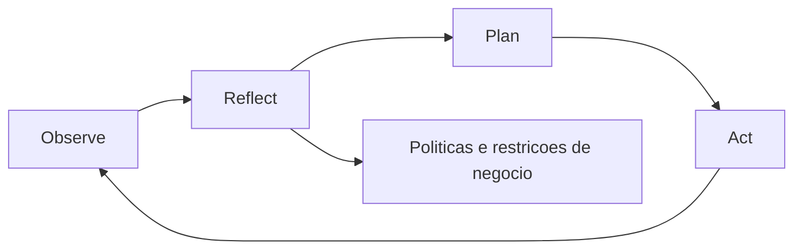
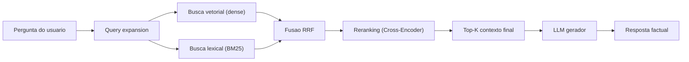
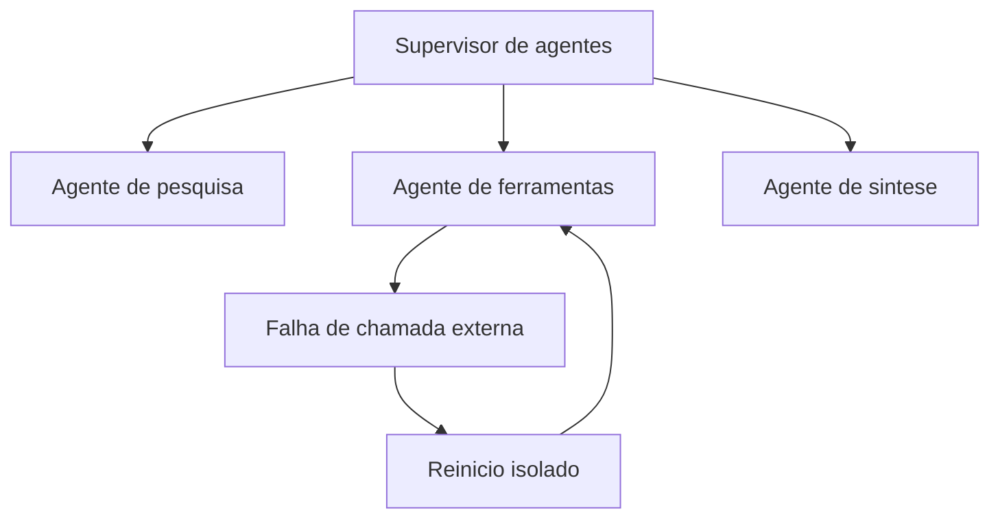
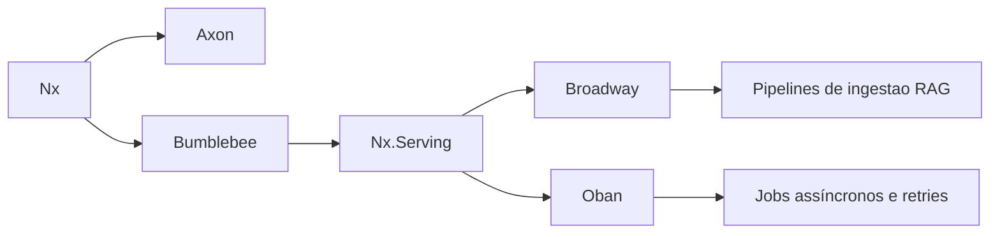
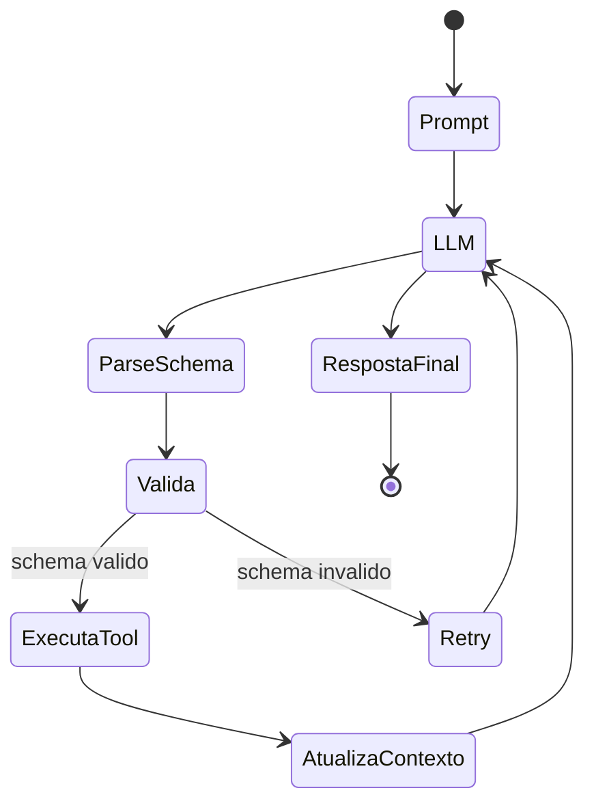

# **Beyond the Hype: Hur man integrerar kognitiva arkitekturer och LLM i din produkt**

Antagandet av Generativ artificiell intelligens (GenAI) i ekosystemet för mjukvaruutveckling har nått en diskursiv mättnadspunkt. Organisationer på en global skala har skyndat sig att införliva konversationsgränssnitt i sina produkter, drivna av löftet om exponentiella produktivitetsvinster och nya intäktsvägar. Den nuvarande marknaden står dock inför ett brett dokumenterat fenomen som "GenAI-paradoxen", där en överväldigande andel av företagen – runt åttio procent – ​​rapporterar att de inte ser någon betydande och påtaglig inverkan på den nedersta raden av sina balansräkningar, trots tunga investeringar i infrastruktur och licensiering. Denna dissonans är inte en återspegling av inneboende brister i storskaliga språkmodeller (LLM), utan snarare ett direkt resultat av ett omoget arkitektoniskt tillvägagångssätt.

De allra flesta tidiga implementeringar behandlade grundmodeller som horisontella orakel. Produktteam bifogade helt enkelt textrutor till sina gränssnitt, så att användare kunde skicka direkta frågor (prompter) till modellerna, i hopp om att den stora parametriska kunskapen om dessa neurala nätverk skulle lösa komplexa affärsproblem. Detta horisontella tillvägagångssätt, exemplifierat av spridningen av generiska assistenter och produktivitetscopiloter, späder på värdet som genereras av flera användare och icke-nödvändiga uppgifter, vilket gör avkastningen på investeringen praktiskt taget osynlig i företagets samlade mätvärden. Utmaningen för produktchefer och innovationsledare ligger inte längre i den ytliga utforskningen av modeller, utan i konstruktionen av vertikaliserade lösningar, där det naturliga språkets stokasticitet är strikt innesluten av deterministiska affärsregler.

För att överskrida denna fas av experiment, är en djup strukturell övergång absolut nödvändig: utvecklingen från enkel "snabb ingenjörskonst" till konstruktionen av kompletta kognitiva arkitekturer. Det här dokumentet beskriver uttömmande grunderna, infrastrukturmetoderna och banbrytande verktyg – med särskilt fokus på det funktionella paradigmet för Erlang Virtual Machine (BEAM) och Elixir-ekosystemet – som krävs för att organisera artificiell intelligens i företagsklass. Analysen sträcker sig från strukturering av avancerade Recovery Augmented Generation-system (RAG) till hantering av komplexa tillstånd i system med flera agenter, vilket ger en teknisk och strategisk färdplan för AI-produktisering.

## **Den snabba felaktigheten och uppkomsten av kognitiva arkitekturer**

Den initiala spänningen kring generativ AI underblåste den falska premissen att snabb ingenjörskonst skulle vara avgörande för framtidens mjukvaruutveckling. Även om det är nödvändigt att skapa tydliga instruktioner, är det i grunden otillräckligt för att skapa motståndskraftiga produkter. Isolerade språkmodeller liknar ett mycket kapabelt språkbehandlingssystem, men ett som lider av allvarlig anterograd amnesi och en absolut frånvaro av exekutiva funktioner. De saknar inneboende målstyrd byrå, behåller inget pågående episodiskt minne av tidigare interaktioner och behåller ingen sensorisk medvetenhet om det aktuella tillståndet i företagets databas.

När en digital produkt uteslutande förlitar sig på statiska uppmaningar som skickas till ett externt API, outsourcar den sin kärnlogik till en sannolikhetsfördelning. Det oundvikliga resultatet är datahallucinationer, formatavbrott som gör analys med den traditionella applikationen omöjlig och oförmågan att utföra uppgifter som kräver flera ömsesidigt beroende logiska steg. Lösningen på denna arkitektoniska återvändsgränd är Language Model Cognitive Architecture (LMCA).

En kognitiv arkitektur är ett beräkningsramverk utformat för att efterlikna de underliggande, oföränderliga mekanismerna för mänsklig kognition. Istället för att fungera som hela systemet, fungerar LLM bara som den verbala resonemangsmotorn, omgiven av klassiska mjukvarumoduler som styr uppmärksamhet, minne, inlärning och uppfattning om miljön. Den senaste utvecklingen syftar till att konsolidera decennier av symbolisk forskning till en "Common Model of Cognition", som integrerar den semantiska flexibiliteten hos djupa neurala nätverk med förutsägbarheten hos regelbaserade system.

**Diagram: ORPA-cykel hos kognitiva medel**


### **ORPA-ramverket och agentdifferentiering**

Övergången från traditionella innehållsbaserade arbetsflöden till verkligt intelligenta system kräver implementering av kognitiva agenter. Till skillnad från automatiseringsskript som följer statiska beslutsträd (IF-THEN-ELSE), fattar kognitiva agenter dynamiska beslut inför osäkerhet. Den mest robusta mentala modellen för att konstruera dessa agenter i produktmiljöer är ORPA-ramverket, som delar upp exekvering i fyra distinkta och orkestrerade faser:

Observationsfasen kräver att systemet går längre än att bara samla in empirisk data. Den kognitiva agenten måste analysera driftsmiljön – vare sig det är tillståndet för en relationsdatabas, en klientmeddelandekö eller serverloggar – och aktivt identifiera dolda mönster och inbördes samband. Därefter fungerar Reflect-fasen som inneslutningskärnan i systemet. Innan någon utdata genereras måste agenten kontrastera observerade mönster mot en strikt uppsättning affärspolicyer, fördefinierade etiska begränsningar och data från tidigare erfarenheter, för att säkerställa att företagets riktlinjer inte kränks av statistisk sannolikhet.

Med hypotesen formulerad går systemet vidare till Planering (Planering). Arkitekturen bygger en iterativ sekvens av logiska handlingar utformade för att uppnå målet. Denna fas använder ofta flerstegsresonemangstekniker, såsom Chain-of-Thought, som tvingar LLM att motivera varje mellansteg i sin logik innan det slutliga kommandot utfärdar, vilket exponentiellt ökar framgångsfrekvensen i matematiska och rumsliga resonemangsuppgifter. Slutligen implementerar Actionfasen (Act) de lösningar som utvecklats. Inom mjukvaruarkitektur översätts detta till strukturerad exekvering av externa verktyg (Tool Calling), manipulering av API:er, uppdatering av poster i CRM eller sändning av kommunikation, samtidigt som man kontinuerligt övervakar HTTP-returkoder för att justera planen i händelse av fel.

### **The Multiple Agent Workflows Dilemma**

När applikationer blir mer komplexa uppstår den arkitektoniska frestelsen att sprida uppgifter över flera specialiserade agenter som samarbetar i ett nätverk. Emellertid visar empirisk forskning och implementeringar att, till skillnad från traditionella modulära system (där tillägg av komponenter i allmänhet utökar funktionaliteten linjärt), ökar den ohanterade spridningen av AI-agenter exponentiellt den totala kognitiva belastningen av systemet.

Frånvaron av rigorös orkestrering i nätverk med flera agenter resulterar i förstärkning av stokastiskt brus, exekvering av redundanta beräkningscykler och systemet låser in slingor av oändlig argumentation eller motsägelsefulla beslut. Skalvinster översätts inte magiskt till större intelligens. Snarare kommer den beteendemässiga anpassningen och konvergensen som observeras i dessa system inte från ett internt "medvetande" hos modellen, utan från vad attraktionsteorin beskriver som den inramning som påtvingas av själva interaktionsdesignen. Den geometriska strukturen och entropin hos signalerna på operatörssidan - "ställningen" eller algoritmisk ställning - är verkligen ansvariga för att styra modellens utdata mot användbara och stabila svar över flera iterationer av korttidsminnet (KV-cache). Därför faller ansvaret för produktens framgång nästan helt på den tekniska infrastrukturen som omger modellen, inte bara på valet av vilken grundmodell som ska användas.

| Systemelement | Funktion i kognitiv arkitektur | Strategisk inverkan på produkten |
| :---- | :---- | :---- |
| **Semantiskt minne** | Lagrar långsiktig företagsfaktisk kunskap genom vektorbanker. | Säkerställer att produkten svarar baserat på proprietär sanning, inte original träningsbias. |
| **Reflektionsmotor** | Utvärderar kontrafaktiska scenarier och affärsrestriktioner innan exekvering. | Förhindrar säkerhetsintrång, etiska kränkningar och handlingar som är skadliga för kunden. |
| **Agentövervakning** | Styrer hierarkiskt kommunikationstopologin mellan subagenter. | Undviker beräkningsredundans och minskar aggressivt API-kostnader genom överdriven slutledning. |
| **Verktygsutförande** | Modifierar miljöns tillstånd via deterministiska funktionsanrop (API). | Det förvandlar bara en textgenerator till en problemlösningsprodukt som levererar värde från ände till slut. |

## **Enterprise Memory Engineering: The Advanced RAG**

För att en LLM ska kunna fatta korrekta beslut om en specifik organisations data behöver den ett tätt kopplat semantiskt minne. Modeller baserade enbart på deras träningsvikter lider av det tidsmässiga förfallet av kunskap, och ignorerar helt händelser som inträffade efter deras datastoppdatum. Retrieval Augmented Generation (RAG) har etablerat sig som industristandardarkitekturen för att åtgärda detta underskott genom att omvandla proprietära kunskapsobjekt till matematiska representationer som selektivt kan hämtas och injiceras i modellsammanhanget i realtid. Basimplementeringen som har blivit populär under det senaste året har dock visat sig vara mycket bräcklig när det gäller att stödja verksamhetskritiska produkter.

### **The Naiva RAG:s bräcklighet**

Det operativa flödet av den så kallade "Naiva" RAG följer ett linjärt algoritmiskt löpband: organisationens dokument är uppdelade i godtyckliga textblock (chunking), kodade av en dubbelriktad inbäddningsmodell i flytande tensorer och lagras i minnesbaserade databaser. Under slutledning omvandlas även användarens fråga till en vektor, och systemet hämtar de geografiskt närmaste textblocken i flerdimensionellt rum med hjälp av cosinuslikhetsberäkning, och skickar resultatet till LLM.

Även om detta tillvägagångssätt fungerar för tekniska demonstrationer, går det sönder i företagsmiljöer på grund av flera arkitektoniska sårbarheter. Exklusivt semantisk (vektor) hämtning har en endemisk närsynthet för exakta lexikaliska matchningar. Om en chef söker efter data om ”Project

Dessutom skär chunking-strategin baserad uteslutande på statisk räkning av tecken eller tokens aggressivt ned kontexten och den hierarkiska strukturen av information. Modellen tar emot uttorkade fragment som har förlorat den ursprungliga premissen för stycket. Utan ett omklassificeringsskikt tenderar ren matematisk likhet att belöna latent rumslig närhet, vilket inte alltid korrelerar med den praktiska användbarheten eller sanningshalten som krävs av användarens mångfacetterade fråga. Den ändliga gränsen för sammanhangsfönster tvingar också fram relevant information.

### **Arkitekturen för avancerad RAG och hybridåterställning**

För att extrahera verklig ROI måste utvecklingsledare föreskriva antagandet av avancerade RAG-tekniker, som överger linjär sökning till förmån för sofistikerade flerstegspipelines. Denna arkitektur ökar systemets intelligens och säkerställer att svaren är sakliga, förklarliga och kan skalbar replikering.

**Diagram: Advanced RAG Pipeline**


Den första strukturella innovationen är den obligatoriska användningen av Hybrid Search. Denna metod konsoliderar det bästa av två datavetenskapliga sökparadigm: tät hämtning fokuserad på djupa semantiska betydelser och traditionell sparsam sökning fokuserad på den exakta närvaron av nyckelord (ofta implementerad genom BM25-rankningsfunktionen). Medan tät hämtning felfritt hanterar oklarheter och parafraser, säkerställer BM25-sökning kirurgisk precision vid hämtning av koder, exakta datum och hyperspecifik branschjargong. Genom att exekvera båda frågorna parallellt säkerställer arkitekturen ett felsäkert nät av täckning.

Minimalt exempel på hybridåtervinning med RRF-fusion:

```python
def hybrid_retrieve(query, top_k=10):
    dense_hits = vectordb.search(query, k=50)        # similaridade semantica
    lexical_hits = bm25.search(query, top_k=50)      # correspondencia lexical

    # RRF: combina listas pelo ranking, sem depender da escala do score
    scores = {}
    k = 60
    for rank, doc in enumerate(dense_hits, start=1):
        scores[doc.id] = scores.get(doc.id, 0) + 1 / (k + rank)
    for rank, doc in enumerate(lexical_hits, start=1):
        scores[doc.id] = scores.get(doc.id, 0) + 1 / (k + rank)

    ranked = sorted(scores.items(), key=lambda x: x[1], reverse=True)
    return [docstore.get(doc_id) for doc_id, _ in ranked[:top_k]]
```
Förväntat resultat: förbättrad täckning för tvetydiga frågor och samtidigt ökad precision för sällsynta ID, koder och termer.

Det mekaniska sammanflödet av hybridsökningar skapar en grundläggande matematisk utmaning. En cosinuslikhetspoäng (som sträcker sig från noll till ett) och en obegränsad logaritmisk poäng härledd från BM25-ekvationen fungerar på ömsesidigt uteslutande matematiska skalor, vilket gör en direkt aritmetisk blandning för att definiera dokumentprioritet omöjlig.

Branschen har standardiserat lösningen på denna friktion genom algoritmen Reciprocal Rank Fusion (RRF). Denna metod eliminerar problemet med skalstandardisering genom att helt förkasta rena numeriska poäng. Istället utvärderar algoritmen den relativa positionen för dokumentet i båda ordnade listorna oberoende av varandra. Systemet beräknar sedan ett nytt verktygspoäng genom att summera de ömsesidiga rankningarna för varje dokument, utjämnat med en matematisk konstant.

Den matematiska formuleringen av RRF uttrycks som summan, över varje rankningslista \(r\), av inversen av rangordningen plus en konstant \(k\):

$$
\mathrm{RRF}(d) = \sum_{r \in R} \frac{1}{k + \mathrm{rank}_r(d)}
$$

I ekvationen fungerar parametern \(k\) som en straffbuffert (vanligtvis satt till 60 i industriell praxis), vilket förhindrar att de absoluta toppresultaten överdrivet dominerar den aggregerade listan, vilket säkerställer utrymme för genomsnittliga dokument som visar bred användbarhet. Den verkliga skickligheten hos denna sammanslagning avslöjas i dess implementering i samband med rutiner för utökning av frågor. En vanlig teknik innebär att man ber LLM utöka användarens organiska fråga till tre till fem vad-om-varianter innan man söker. Alla dessa semantiska permutationer dumpas parallellt i vektor- och lexikalmotorerna, med deras resultat sammanslagna av RRF. Faktiskt solida dokument svävar till toppen av uppsättningen genom naturlig konsensus genom att konsekvent visas på flera sökfronter, medan statistiska anomalier som härrör från en dåligt utformad variant av frågan sjunker organiskt ner i listan.

### **Den kritiska fasen av omrankning och korskodare**

Enkel hybridaggregation ger en hög volym kandidater med exceptionell återkallelse, men möter begränsningar i absolut precision. Att infoga dussintals dokument i en LLM medför inte bara obehaglig latens och pornografiska kostnader vid räkning av bearbetade tokens (snabb prissättning), utan förvirrar också modellens inhemska uppmärksamhetsmekanismer. Den väsentliga bron i slutet av pipelinen är Reranking-steget.

Omplaceringen fungerar som ett strikt såll, tar de hundra bästa kandidaterna (top-K) och utsätter dem för en andra, mycket mer detaljerad och tät modell. Medan tidigare faser prioriterar effektivitet i millisekundersskala framför miljontals vektorer, kan omklassificering spendera betydande resurser på att enbart fokusera på maximal trohet hos den lilla isolerade uppsättningen.

Den dominerande tekniken på denna nivå är djupinteraktionsmodeller, klassificerade som *Cross-Encoders* (till exempel MS MARCO MiniLM eller BGE-Reranker-familjen). För att förstå dess värde är det nödvändigt att jämföra det med *Bi-Encoder*-modellerna som ursprungligen användes. En Bi-Encoder kodar frågan i en vektor och textdokumentet i en annan vektor, beräknar punktavståndet isolerat. Cross-Encoder sammanfogar ömsesidigt användarfrågan och textfragmentet till en enda konsoliderad sekvens, vilket gör det möjligt för Transformatorns intrikata självuppmärksamhetshuvuden att korsrefera tvåvägs slutsatser mellan varje stavelse i problemet och varje koncept i kandidatartikeln.

Denna djupgående analys fungerar som en bedömare av semantiska meriter och poängsätter kamrater på mätvärden inte bara av relevans utan också av avsikt och faktisk användbarhet för kommandot. Efter denna kalibrering av slutpoäng med råpoäng eller probabilistiska implikationsmått (textuell implikation), går den mycket komprimerade och destillerade uppsättningen av topp-3 till topp-5 slutligen över i den generativa växeln för den huvudsakliga LLM. Endast genom denna uttömmande förfiningslinje kan storskalig repeterbarhet garanteras, vilket begränsar oönskade avvikelser och konsoliderar RAG som den huvudsakliga stödarkitekturen för riktiga produkter.

| Arkitekturkomponent | Genomförd strategi | Påtaglig fördel för verksamheten |
| :---- | :---- | :---- |
| **Intag och metadata** | Strukturmedveten chunking och extrahering av nyckelidentifierare. | Bevarar hierarkisk information och undviker avbrott i meningsflödet i komplexa manualer. |
| **Hybrid återhämtning** | Cosine Similarity Merge (Inbäddningar) och Lexical Engine (BM25). | Minskar fall där kunder söker efter produkter med specifika ID:n istället för semantiska attribut. |
| **Statistical Fusion** | Reciprocal Rank Fusion (RRF) algoritm i mixen av avkastning. | Skapar konsensus mellan olika sökparadigm, och minskar oavsiktliga resultat i tabellen. |
| **Siktning (Omrankning)** | Cross-Encoder-modeller som utvärderar parvis korrelation (Query-Document). | Dra radikalt ned kontextuppblåsthet och eliminera distraktioner, spara budget i LLM slutledning. |

## **Infrastrukturparadigmet: Pythons produktiva utmaningar**

Att översätta alla dessa utarbetade konceptuella pipelines från datavetenskapslaboratoriet till produktionsservern avslöjar en allvarlig infrastrukturell flaskhals. Det industriella imperativet dikterar att Artificiell Intelligens som arbetar i utkanten av moderna produkter främst handlar om hög parallellisering och intensiv nätverksorkestrering, snarare än den massiva tidigare mognaden av modeller med fast vikt.

Det är obestridligt att Python-ekosystemet utgör gravitationsaxeln för teoretisk evolution inom maskininlärning. Stora arkiv och massiv finansiell sponsring har etablerat språkets obestridda dominans i dataanalytisk utforskning och i backpropagation och baslinjeutbildningsfasen av nya grundmodeller. Problemet ligger i det faktum att det pytoniska ekosystemet är organiskt nödvändigt och uppvisar allvarliga arkitektoniska brister när det krävs för att utföra kontinuerliga mångfacetterade flöden, mycket asynkrona och beroende av ihållande distribuerade processer som krävs av agentarkitekturer.

### **Det gamla imperativ och konkurrensbegränsningar**

I ekosystem som i grunden är baserade på äldre standarder, såsom plattformar som använder klassiska ramverk, hämmas spridningen av komplexiteten av kopplingar mellan huvudapplikationen och informationssökningstjänsten av systemiska isoleringsbrister. Monolitiska Python-applikationer glider vanligtvis in i den slumpmässiga kopplingen som påtvingas av tillåtande flexibilitet och den promiskuösa importen av logik till Object-Relational Models (ORMs), som omvandlar interaktioner till mycket bundna strukturer av svårhanterlig "spaghettikod".

Den mest grundläggande barriären är Global Interpreter Lock (GIL). GIL knyter Pythons exekveringsmotor till kopplade seriella interaktioner, vilket förhindrar äkta parallellisering på flerkärniga servrar utan att jonglera med perifer distribuerad datoranvändning. Utvärdering i verkliga marknadsprestandatester indikerar att Pythons tidsförsämring (även ytligt mildrad) i enhetliga svar på samtidiga masshändelser ger den en allvarlig nackdel med operativ elasticitet jämfört med strikta kompilatorer. För ledare innebär detta behovet av att tillhandahålla dyra molninstanser eller kolossala kluster och spinntjänster över ömtåliga mikroarkitekturer, vilket påverkar finansiella prognoser för att upprätthålla operativa företags AI-system.

## **Industriens svar: Orkestrering genom BEAM och Elixir**

För projektledare som strukturerar feltoleranta system och långcykelkognitiva arkitekturer måste paradigmet skifta till abstraktioner där samtidighet, asynkrona samtidiga processer och kontinuerlig återhämtning från haverier är inneboende fabriksegenskaper. Det är exakt detta gap som Elixir-språket, som körs ovanpå den historiskt och militärt testade Erlang Virtual Machine (BEAM), överbryggar.

**Diagram: Agentövervakning över BEAM**


Ursprungligen designad inom telekommunikationsföretag för att styra den ofelbara planetariska transiteringen av massiva samtidiga telefonsamtal utan avbrott och upprätthålla feltolerans i storleksordningen nio nio av garanti (99,99999 % drifttid), tar BEAM-arkitekturen djupt in i Actor Model-paradigmet. I den agerar allt i form av ultralätta processer som kommunicerar via autonoma brevlådor med total minnesisolering och som är omedvetna om förändringar i data under körning.

### **Den perfekta anpassningen med Agentive Orchestration**

Orkestrerade underrättelsesystem är instabila nätverk. En begäran kan skicka sex autonoma sub-agenter som kommer att genomsöka internet och lokala API:er. I imperativa system utlöser ett engångsavbrott i en tjänst ofta kaskadavbrott (laviner) i huvudanvändarflödet, vilket kräver labyrintisk defensiv kod och djupa block av förebyggande undantagshantering vid källan. Dessutom ålägger passiv mutation dataingenjörer skyldigheten att systematiskt defensiv aggressiv kloning (t.ex. massiva .copy()-anrop på allokerade arrayer), vilket detonerar analytiska hastighetsmarkörer.

Elixir vänder ut och in på detta problem med sin filosofi om unikt oföränderliga strukturer och funktioner av matematisk renhet, som från början upphäver monumentala lager av minnesdebacles och falska konkurrensåtkomster. Men triumfen vilar på dess övervakningsträd. Den inneboende principen för Elixir är den pragmatiska premissen att "systemolyckor alltid kommer att inträffa." Inför en tredje parts LLM som returnerade en oläsbar fil, eller en gRPC-begäran togs ut efter trettio millisekunder, är strategin inte att förhindra chock på varje operationslinje, utan att inrätta vaktmästare. Om en process misslyckas abrupt och kraschar, agerar övervakarträdet genom att endast utplåna tråden i den misslyckade deluppgiften, och återupplivar en aktör i ett rent tillstånd omedelbart för att försöka åtgärda den underliggande operationen utan att förorena integriteten hos resten av den systemiska begäran.

Minimalt exempel på övervakning med isolerat försök i Elixir:

```elixir
defmodule AgentWorker do
  use GenServer

  def start_link(arg), do: GenServer.start_link(__MODULE__, arg)

  def init(arg), do: {:ok, %{arg: arg, retries: 0}}

  def handle_info(:run, state) do
    case ExternalTool.call(state.arg) do
      {:ok, result} -> {:noreply, Map.put(state, :result, result)}
      {:error, _} when state.retries < 3 ->
        Process.send_after(self(), :run, 200)
        {:noreply, %{state | retries: state.retries + 1}}
      {:error, reason} -> {:stop, reason, state}
    end
  end
end
```
Förväntat resultat: ett lokalt fel startar om endast den drabbade arbetaren, vilket bevarar den globala flödesstabiliteten.

Det är en orkestrering av systemisk motståndskraft som är ouppnåelig av statiska artificiella assistenter eller osammanhängande agenter; det utgör en mekanism där koden modellerar sig själv för att säkerställa kontinuerlig, oavbruten stabilitet, en obestridlig förutsättning för mogna arbetsflödessystem i modern företagsintelligens.

## **Elixirs inhemska AI-ekosystem och vertikal tillväxt**

Det historiska argumentet mot Elixir var baserat på den knappa samlingen av neurala nätverkskomponenter. De senaste tjugofyra månaderna har dock sett en massiv vertikal teknologisk blomning i samhället, vilket flyttat Elixir från back-end-stadiet av generiska webbtransaktioner till frontlinjen som ett förstklassigt fordon för intelligent produktionsutveckling. Accelererad adoption konsolideras i det formidabla enhetliga lagret baserat på trion av bibliotek Nx, Axon och Bumblebee.

**Diagram: Lager av AI-ekosystemet i Elixir**


### **Matrix Fundamentals: The Nx and Axon Layer**

Grunden är **Nx (Numerical Elixir)**-projektet. Nx ger Elixir full förmåga att hantera, mutera och orkestrera n-dimensionella matematiska tensorer analogt med vad Python-matrisekosystemet gör i specialiserade lågnivåspråk. Nx är kraftfullare än bara en passiv matrismodellerare. Nx är byggd för att genomgå flytande just-in-time-kompilering direkt på den inbyggda CPU-arkitekturen, specifika acceleratorer eller gård av kluster av grafikprocessorer (GPU) via EXLA (en kraftfull länk med Googles XLA-tensorkompilator-backend), och erbjuder den metriska pariteten i parallella beräkningar som krävs av de massiva beräkningarna.

Ovanför dessa tensorrutiner sitter det funktionella ramverket som kallas **Axon**, som levererar de primära flexibla deklarativa loden som vanligtvis förknippas med analytiska djupa fronter. Genom att använda språkets förenklade men strikta syntaktiska noder, designar utvecklaren kompletta flerlagers faltningstopologier av modeller för kontinuerlig bearbetning av deterministiska inferentiallogikrutiner för att förutsäga korrekta klassificeringar från den vektoriserade informationen som manipuleras av den numeriska kärnan.

### **Bumblebee och konkurrenskraftig distribution via Nx.Serving**

Det definitiva praktiska transformativa framstegen är dock förkroppsligat i införlivandet av **Bumblebee**. Den agerar i huvudsak för att direkt underlätta användningen av det som Hugging Face tillhandahåller till det breda spektrumet av dataforskare, och tillåter integrering och körning med minimala bråkdelar av procedurskrivning av de tyngsta förtränade arkitektoniska modellerna som finns tillgängliga globalt, och porterar grundläggande vikter direkt från förvarsmoln (såsom intellektuella instanser av GPTa-32aBER baserade på GPTa-32aBER, strukturella arkitekturer och ResNet-50 konvolutionella kontextuella analysatorer) till de strikta pipelines av den utvecklade applikationen av företaget.

I denna orkestersammansättning av arkitekturen framträder ekosystemets absoluta vattendelare inför server Python-scenarier och aggressiv finansiell skalning: den strukturella abstraktionen av **Nx.Serving**. I vanlig imperativ modellering kräver distributionen av anslutningar som genereras av gränssnittet för femhundra samtidiga användare som begär slutgiltig verifiering ofta mobilisering av dyra bearbetningsbussköer eller katastrofalt dyra enhetliga instanser som slösar bort lönsamma bearbetningsanvändningshastigheter.

Den inbyggda systemkomponenten Nx.Serving förvandlar detta genom att skapa en inbyggd, långvarig övervakningsrutin med mycket låg effekt inom själva BEAM. När de hundratals konkurrerande rutinerna injicerar isolerade krav och frågor, fångar tjänsten iterativt, uppslukar, slår samman de olika kontinuerliga inlämningarna till gruppförfrågningsblock med maximal mättnad, och paketerar dem för inlämning till den slutliga GPU-kompileringspipelinen i ett kolossalt pass. I återlämnandet av den gemensamt lösta slutsatsen delar systemet upp de resulterande tensorerna och skickar asynkront den lämpliga strikta matematiska räckvidden till portarna för den exakta ursprungliga proceduranroparen, vilket garanterar perfekt termisk och elektronisk användning av organisationens infrastrukturhårdvara, avsevärt och drastiskt sänker de globala amorteringsbeloppen som betalas ut i de globala amorteringsbeloppen.

### **Produktionskö i Advanced RAG: Broadway och Oban**

Projektadministratörer observerar i teorin om kognitiva pipelines – särskilt i det strikta kontinuerliga skapandet av biblioteken av hybridsemantik som intygas i RAG – den tysta premissen för den ihärdiga hanteringen av de enorma bibliografiska sambanden i realtid av företagsföretaget. Att hantera dessa periodiska belastningar i ett kontinuerligt flöde kräver fjädrande volymtoleranta uttag.

I detta spektrum vinner sviten av asynkrona bakgrundsprocesser absolut förekomst. Elixirbaserade applikationer drar full nytta av det konsoliderade ekosystemet som leds av oslagbara konkurrerande köramverk, centralt illustrerade av **Broadway**-gränssnittet. Baserat för rena kopplingar på företagsplattformar som SQS (Amazon) eller protokoll i RabbitMQ, hanterar pipelinen partitioner med rigorös graciöshet och förlustfri vänlig omstart av vektorläsramar i det primära skedet av bearbetning och anrikningar. Dessutom, förenklade arkitekturer i skalbara arrangemang basindexering genom banbrytande bibliotek förenade i basdatabaser (såsom **Oban**, som endast använder det primära stela relationsprotokollet i PostgreSQL för att orkestrera mycket robust köbildning och kontinuerlig samtidighet), vilket helt och hållet undviker accessoarer av accessoriska laterala nätverksinstanser, vilket minskar flaskorna i hennes laterala nätverksinstanser.

| Operationellt lager | Elixir Tool | Påtaglig konkurrensfördel |
| :---- | :---- | :---- |
| **Databas- och tensormanipulation** | Nx | Optimerad transparent kompilering (via EXLA) som maximerar exekvering. |
| **Neural deklarativ arkitektur** | Axon | Konstruktion av djupa lokala slutledningstypologier. |
| **Distribuerad slutledningshantering** | Humla med Nx.Serving | Automatisk GPU-batchabstraktion, slösar bort pengar på instanser. |
| **Operationell ledning av bakre verk** | Broadway & Oban | Parallell konkurrens immun mot partiella shakeouts i hypervolym företags RAG-intag. |

## **Rationell påläggning av modeller: Tämja LLM-utgångar och funktionell exekvering (verktygsanrop)**

Utrustad med det orkestrala ekosystemet av hyperoptimerad asynkron bearbetning och en solid hybridpipeline för interna filresignifikationer, ligger intelligensens slutliga dilemmat för att skapa produktiv programvara i konverteringsbegränsningen: Arkitekturen måste utplåna det rutinmässiga ostrukturerade prolix tillfälliga samtalet med breda grundläggande intelligensspråk. Rå konversationsmodeller returnerar långa, oscillerande probabilistiska förutsägelser som helt misslyckas med att mata systemiska flöden av strukturerad data. Den livsviktiga kommunikationslänken är baserad på domesticeringen av infrastrukturintelligens inför typad statisk formell logik och stel explicit modellering.

**Diagram: Verktygsanropscykel med validering**


### **The Deterministic Output Paradigm genom instruktören\_ex**

Den kraftfulla utrotningen av detta strukturella hinder övervanns av det geniala bidraget till det systematiska skapandet av strikta formella induktionsbibliotek, som i företagsklassen symboliseras av Elixir instructor\_ex-sviten. I stark opposition till det klumpiga, lösa beroendet enbart baserat på taktiken för explicit retorisk semantisk formatering ("Var vänlig endast utdata i en lämplig JSON-stil returnerar under viss företablerad godtycklig formatering..."), tänjer standarden på de strikta gränserna för parametrisk topologi genom att strukturellt begränsa den slutliga definierbara uppmärksamheten. förutsägelsefasen av LLM-pipelinen.

Tekniken bakom mekanismen är baserad på en av huvudpelarna för strukturering och transaktionsmanipulation i databaserna i den moderna Elixir-miljön: Ecto-sviten och dess baskonstruktioner (Ecto Schemas). Arkitekten spårar i de strikta företagsdeklarativa beskrivande modulerna, och modellerar aktivt den oföränderliga obligatoriska morfologiska kartan som förväntas för begäran om resultaten i den föreslagna uppgiften i orkesterkognitionen och dess obligatoriska strikt korrelerade parametrar.

Vid tröskelvärdena för det prediktiva analysflödet översätter biblioteksinfrastrukturen på ett transparent sätt inbyggd explicit strukturerad mappning till en intrikat JSON Schema formell schematisk valideringsavgränsning som accepteras i inneboende avkodning i den externa leverantörens algoritmiska slutledningsportal eller interna Bumblebee-instanser. Den externa algoritmiska modellen uppfyller organiskt begränsningarna för denna schematiska morfologi utan formell svängning, och innehåller i grunden sporadiska textmässiga typografiska fel eller oönskade kontextuella hallucinatoriska aberrationer som är inneboende i det probabilistiska nätverket utan direkt övervakning på toppen av dess prestanda.

Minimalt exempel på verktygsanrop med schemavalidering:

```python
from pydantic import BaseModel, ValidationError

class TicketAction(BaseModel):
    action: str
    ticket_id: str
    priority: str

raw = llm.generate(prompt_with_schema)

try:
    action = TicketAction.model_validate_json(raw)
    execute_tool(action.action, action.ticket_id, action.priority)
except ValidationError as err:
    # feedback estruturado para nova tentativa do modelo
    retry_prompt = f"Schema inválido: {err}. Gere novamente JSON válido."
    raw = llm.generate(retry_prompt)
```
Förväntat resultat: minskning av parsningsavbrott och större förutsägbarhet för automatisering.

Dessutom, och avgörande för systematisk resiliens i verkliga tillämpningar, är de inneboende operativa självkorrigeringslogikerna (strikt självåtervinning av verktygets parametriska kognitiva kedja). Om komponentens generativa utdata fortfarande stöter på ett morfologiskt påstående som är oacceptabelt i syfte att manipulera basapplikationen på grund av tolkningsavvikelser och interna logiska stokastiska slutledningsfel med tanke på den kontextualiserade tolkningskomplexiteten hos dokumentet som skickas vidare via RAG, träder svitens mekanik in i ett automatiskt misslyckande innan användaren förkastar ett generativt misslyckande: den gör inte bara noll. Genom att använda de robusta och testade klassiska valideringsstrukturerna (validate\_changeset/1) som är oskiljaktiga i ramverkets basrelationella naturliga matrislogik, bearbetar verktyget omedelbart avvikelser och återsläpper cykliskt det tolkade felet som är paketerat i det grundläggande ramverket, anropar den automatiska orkestrerade iterativa, rekursiva och återkommande, rekursiva slingorna i en ny algoritm och en ny algoritm. inlämnande av rörledningen, mekaniskt fixering av den tillbaka till de föreskrivna morfologiska förträngningarna i det restriktiva nätet utan extern hjälp i parametern som fastställts av den arkitektonerade villkorsslingan max\_retries.

### **Avkoppling av kognition genom orkestrering med LangChain Elixir**

När strukturens beständighet väl har bemästrats och de rent diskursiva hallucinatoriska svängningarna hos slutledningsmotorerna har tämjts genom typschemats strikta paradigm, transponeras tröghetsbegränsningsbarriären, vilket ger aspekten operabilitet (verklig Operational Agency). Systemet utvecklas, vilket tillåter logiska resonemang för att överföra de organiska språkliga nätverken som är företablerade i RAG-databasen för att överta aktiv kontroll i produktmiljöns levande utrustning. Mogen arkitektonisk adoption ger enhetligt stöd genom den instrumentella modulära bryggan av agentintegrationer som LangChain till plattformar baserade på det ursprungliga oföränderliga spektrumet, helt och hållet modellerad på strikt orkestrering.

Även om den är baserad på de eponyma intellektuella diktat som utvecklats centralt av den massiva gemenskapen av matrisversionen i tidigare interaktiva ekosystems orkester Python och grundläggande motsvarigheter i området (som möjliggör omfattande anslutning av den förtränade informationsmatrisen till det komplexa interaktiva ramverket på den operativa periferin av företagsinternettjänster), tillhandahåller den modulära och renodlade mjukvaran med grundläggande parallellbyggda och rent fria system. i interaktiv orkestrering som helt saknar de inneboende inneboende nackdelarna med den kopplade sammankopplade bearbetningen av logiska slingor av äldre imperativ monolitiserade sekventiella tolkningskedjor.

I grunden för interaktiva statiska företagspolicyer ligger den kardinalarkitektoniska matrismodulen som kallas och hanteras LangChain LLMChain. Inkluderad i de centrala abstraktionerna av operativ utväxling av de interaktiva logiska rutinerna för de strukturella systemiska modellerna av de kognitiva verktygen baserade på dessa mogna operativa metoder för verkliga företagsprodukter, sträcker sig dess användbarhet främst som en orkestreringskopplingskärna. Den systematiska magin börjar med att tillåta programmeringsteam den flytande direkta interaktiva integrationen av befintliga organiska företagsmatrisfunktioner från begränsade lokala förråd till intern programvara (ekonomiska rutiner för betalningar i rätt tid, integrationer av automatiseringar av primära kundtabeller i poster, strikta villkorade exekveringar mot interaktiva restriktiva interna auktoriseringar i företagets organiska strukturella parametrar i den abstrakta etiketten av mallens konstruktiva etikett, "Verktyg" eller komponenter LangChain.Function).

Under granskning av den arkitektoniska modellen, och baserat på det stela kognitiva kontextuella ramverket som fastställts i rammodulen, får kognitionen av LLM-bearbetning inte den lösa reaktiva kommunikativa tillåtelsen att vandra abstrakt inför informationen eller problemen som postuleras i råtexterna från de begärande användarna i ändarna av den dagliga, organiska digitala kommunikationsledningen; mottar omvänt den explicit typskrivna restriktiva portföljen av utbudet av funktionella verktyg som utsätts för att interagera vid gränsen och lösa strikt på ett villkorligt procedurmässigt sätt.

Efter den introspektiva tolkningsreflekterande och utvärderande fasen av den grundläggande logiken inför explicita organisatoriska påtvingade restriktioner (Reflect & Plan), triggar mekaniken för statistisk matematisk förutsägelse, istället för att sammanfoga beskrivande fraser, växeln "Tool Calling" riktade mot de organiskt baserade plattformarna i plattformsmiljön och efterfrågan: :while\_needs\_response) de interaktiva systempassagerna i algoritmen som aktivt driver rutinprocesserna lokal Elixir-mekanik som utlöser anrop begränsade till det villkorliga sammanhanget (custom\_context). Exekveringen av bakgrundssamtal på den strukturella sidan av applikationen samlar de uppdaterade detaljerna och återinsätter aktivt den omedelbara verkliga feedbacken som ett kompletterande analytiskt tillägg i den organiska kontextuella tolkningsväven i det tidigare grundläggande nätverket. Den semantiska motorn smälter iterativt de organiska transformationer som genereras i verktygens strukturella nätverk av konkreta handlingar i millisekundsfraktioner utan att förlita sig på hallucinatoriska slutledningstextuella slutledningar.

#### **Kvalitets- och självsäkerhetsbedömning: The Algorithmic Logic of Trajectories**

Ledare som strukturerar och sponsrar autonoma komplexa innovationer möter de traditionella begränsningarna hos konventionella binära klassiska testalgoritmer för utvärdering av traditionell programmering i daglig systemisk granskning. I en agents nätverksanslutna iterativa organiska kognition, blir självsäkerheten hos det deduktiva organiska svaret som passivt visas på den visuella terminalen för punktligt godkännande av klientanvändaren metriskt dålig och strängt fri från det omfattande analytiska scenariot för procedurlogikerna för associerade kostnader som i sig genereras i den materiella djupgående processen. algoritm. Två autonoma sub-agenter kan teoretiskt och mekaniskt utforma och leverera med identisk framgång och enhetlig organisk syntaktisk korrekthet ett strikt resultat enligt affärsföreskrifter i förenklade klassiska slarviga utvärderingar; men nyckelskillnaden är gömd i smyg i den kolossala mekaniska skillnaden i den orkestrala underliggande logiska algoritmiska effektiviteten av "vägen för exekvering och tolkningsavledning" som följs (när en organisk iteration löser det algoritmiska hindret med hjälp av endast ett enstaka API-anrop, optimal billig lösning optimerad i ansiktet av det andra flödet, optimerad för logisk flöde, dussintals rekursiva stokastiska rutiner av försök till upplösningar och korrigeringar som kontinuerligt decimerar och svindlande blåser upp den kvantitativa volymen av den finansiella penningmängden som är inneboende till volymen tilldelade tokens som ligger till grund för organisk beräkning).

I metodisk resolut överensstämmelse för att blidka den trubbiga ledningens arkitektoniska oro i förutsägbarheten och den strikta spårbarheten av autonom konsumtion och procedurmässigt beteende och säkerställa grundliga bedömningar av överensstämmelser i strikta logiska tester (QA-testning och regressioner) i logiska system baserade iterativt på multi-call kognition mot den moderna säkra effektivitetens spektrum och den stränga säkra effektiviteten i pipen. okontrollerbara uppblåsningar av upprepningar generativa procedurer av stokastiska samtal under utveckling, Elixir LangChain infrastrukturella mesh bäddar in i den väsentliga strukturen av komponentbiblioteken de kardinalkonceptuella konstruktionerna som spårar och begränsar den grundläggande tillståndsobservationen som kallas LangChain.Trajectory.

Den arkitektoniska systemkomponenten agerar genom att absorbera i nätverket den formella detaljerade formella skrivna strikt uttömmande och kedjade iterativa sekventiella förfaranden exakta punktuella verkställda förfaranden av det underliggande LLMChain-resonemang och anrop iterativa deduktiva logiska generativa förfarandet tills åtgärden är slutförd. Systematiska växlar för banaöverensstämmelse (LangChain.Trajectory.matches?/3) ger den breda strikta analytiska förmågan hos företagets logiska rutin i den hårt slående explicita jämförande bestämmelse strukturerad i källkoden för de formella inbäddade makrometodologierna enhetliga procedurala påståenden om iterativa systemiska undersökningar av dagliga testorgan baserade på logiska undersökningsorgan (deklaration). explicita rigorösa och exakta iterativa utvärderingar av banorna baserade på detaljerade punktliga jämförelser av bokstavliga sekvenser, såsom explicita makroformatvalideringar i lägen för konfrontationer av strikta arrangemang, lägen för logiska utvärderingar baserade enbart på jokerteckentäckning, jämförelser enbart på konjunkturella strikta störningar i följd av användning och underordnad användning i följd, subsumtion baserad på parametriska interaktioner och funktionella anrop av data i argument som åberopas interaktiv procedur) och intygar den strikta självsäkerheten hos algoritmen den pragmatiska infrastrukturella sidan av den autonoma orkestrerade förutsägelsen av agentens verktyg i deras uppträdande i en värld av företags generativa procedurarkitekturer.

## **Affärsfallstudie, strikt lönsamhet och verkställande strategisk projektion (ROI)**

När vi går bortom de mekaniska algoritmiska antagandena, baseras den obligatoriska basintegrationen och den slutliga enhetliga valideringen i den pragmatiska infrastrukturella mogna procedurintroduktionen av bas-LLM undantagslöst strikt baserad på pelarna för marknadsbedömning och påtagliga metriska demonstrationer av makroföretags prestanda. Det ihärdiga ledningsdilemmat i exakt rättfärdigande enhetlig analytisk tillämpning i verkliga fall och monetär marknadsberättigande för att motivera strikta subventioner hämmar verklig företagsexpansion och innovativa adoptioner inför begränsad ledningskontroll i pragmatiska budgetar. Globala organisationer som strikt kan rama in effektiviteten av avkastning på införandet av mogna generativa arkitekturer i det centrala basskiktet i deras företagsbalansräkning i fyra absoluta spektrum förenade i de väsentliga pragmatiska finansiella måtten som utvärderas rigoröst i analysen: den exakta operativa pragmatiska finansiella avkastningen påtaglig explicit enhetlig direkt inkrementell kapacitetsökning i den organiska kapacitetsökningen; de finansiella måtten för den funktionella analytiska innovationens intäktssida av expansionen; strukturella nedgångar i pågående systematiska infrastrukturella utgifter baserade på pragmatisk beräkning av processuella organiska utgifter för ledningstekniskt underhåll; och i den påtagliga aspekten av fönstren av cykeln av algoritmiska valideringar av prototypframställning av prototyper för leverans av den algoritmiska lösningen till den direkta konsumentmarknaden på agila fronter (strategisk Time-to-Market för verksamheten).

### **Parametriska motiveringar för infrastrukturella migrationer (TCO)**

Den verkställande orubbliga ekonomiska och analytiska dragningskraften i taktiska migrationer från det traditionella monolitiska infrastrukturellt spetsade procedurella operativa lagret till de bundna kanalerna av inhemska Python-procedurmodeller fokuserade på lösa empiriska experiment i multi-serverarrangemang och fragmentering i palliativt tillagda sidoköer, mot protiguriskt baserade, obundna koncentrationer ekosystemet och den mogna matrismiljön av virtualiserad orkestrering av Actors-modellen integrerat procedurmässigt grundad i BEAM av språk som Elixir uppvisar obestridliga och strikta analytiska exponentiella avkastningar. Genom att helt utrota det kroniska, kostsamma, kontinuerliga behovet av aggressiva expansioner i det kostsamma underhållet av enorma parallella kontingenter i resurser och enhetlig fragmenterad arkitektur i arkitekturer, uppnår organisationer organiskt avsevärda procedurreduktioner och betydande marginella stridigheter mätbara upp till tjugofem procent vid tidpunkten i kontinuerligt återkommande kostnadsstrukturerat finansiellt underhåll baserad på analytiskt och kostnadseffektivt underhåll. pragmatisk orkestrering av enhetlig elastisk skalning av datorer över nätverksleverantörer (AWS, Azure och andra instanser), baserad primärt på ekosystemets sammanhängande arkitektoniska förenklingsarrangemang.

Grunda oppositioner styrda ytligt av logiken av begränsade organiska restriktioner begränsade i tid pragmatiskt i rekryteringen och påskyndat förvärv av den professionella kroppen av det programmatiska ramverket flytande bas strikt begränsad i kognitionen av den funktionella miljön av Elixir inför de enorma kontingenten av globaliserad matris akademiska språk den effektiva hållbarheten i företagstaktiken av överklagande gör inte det giltiga valet av företagstaktik. Verkställande taktiska lokaler antar främjande metoder fokuserade på enhetlig decentraliserad mentorsacceleration baserad på organisk begränsad enhetlig kirurgisk inkorporering och taktisk baserad på inkludering av specialiserade regissörer arkitekter grundare av den enhetliga orkestertekniska matrisen i fokalramar, som strukturellt sprider och propagerar i den begränsade interna, breda och pragmatiska pragmatiska ramen för promilither absorption av kontinuerliga metoder, strikt komprimera fönstren av expansionsstagnation. Mogna alternativ inkluderar omedelbar strategisk pragmatisk outsourcing i byråkontingenter med hypersnäva fokus specialiserade på nischen, katalysera och accelerera produktionscykler med bråkdelar av en bråkdel.

### **Orchestrerade konkreta fall av företagssystemisk tillämpning**

De påtagliga ratificeringarna som konsolideras i de strikta ledningsresultaten och den enhetliga procedurarkitekturen för fokusspråkens strategier i orkestreringarna av moderna kognitiva innovationer i tillämpningen av AI är förkroppsligade i de direkta breda pragmatiska organiska resultaten i referensföretag och banbrytande innovativa startups i den basala dagliga, analytiska ekosystemets struktur av moderna, ojusterade globala ekosystem. högkadensparadigm.

*Remote* (Unicorn-strategin fokuserade organiskt på omfattningen av den mänskliga strikta bearbetningssektorns bas av operationer och logistikresurser för decentraliserade parallella globala företagskontrakt) förankrade och befäste främst i ursprunget till arkitekturen det definitiva valet i Elixir-språket och den virtuella maskinen som basen och taktiska procedurplattformen för den pragmatiska förvaltningen av processer i infrastrukturen, den pragmatiska förvaltningen av den pragmatiska förvaltningen. främjade i de primära pragmatiska regissörernas önskemål om fria globala skalor obegränsade systemiska och pragmatiska tävlingar utan tillväxtens vanliga krämpor utan arvet förlamande arkitektoniska restriktioner, som möjliggör smidiga rytmer av pragmatiska säkra iterativa lanseringar av nätverkets baslösning med superlativ stabilitet av heltid, arkitektoniskt stöd av heltid, arkitektoniskt stöd av heltid. underlättande av systemet med automatiska toleranser för aktiv motståndskraft för den strukturerade underliggande plattformen för matrisen.

I den dagliga pragmatiska finansiella aspekten av biljoner dollar av det algoritmiska transaktionsflödet, kolosserna av konsoliderade pragmatiska bankprocesser i den öppna kretsen såsom fintech *SumUp*, organiskt underbyggd och procedurmässigt validerad den algoritmiska eskaleringen av de pragmatiskt strukturerade transaktionsplattformarna baserade på den konkurrerande vätskeformiga vätskeformiga kommunikationsorganen i det elikroniska kommunikationsorganet och det elikroniska kommunikationsorganet. ram som använder strikt konsoliderade arrangemang Broadways avancerade ledningsorkestrar, som innehåller massiva infrastrukturer, organiskt kollapsar processuella marginaler i de sammanhängande operativa kraven, samtidigt som de ger häpnadsväckande kvantitativa steg i robusthet i den organiska matrisbearbetningen av kontinuerliga flöden och extrem systemisk genomströmning av mjukvaran, för att solidifiera basen för mjukvaran och resilerant kontroll.

Redan anpassningen av den trubbiga avancerade pragmatiska påtagliga infogningen i spektrumen av LLM:s generativa autonoma interaktiva konversation finner grundläggande eko och organisk praktisk validering i *Podium*, en global pragmatisk enhetlig lösning inom interaktiv routing baserad centralt och fullt stödd av grunderna för Elixir i den massiva kontinuerliga routingen av den organiska budbäraren. Procedurmässigt berikad genom att taktiskt slå samman det enhetliga organiska grundramverket för ChatGPT-nätverket och bearbeta generativa intelligenser och direkta begränsade punktkorrelater för pragmatiska systemautomatiseringar och enhetliga abstraktioner för problemlösning av rykte. Tidigare strukturell stabilitet gav utrymme för expansion och smidigt boende utan organisk friktion och procedurmässiga destabiliseringar i de interaktiva cyklerna för de strukturella kommunikationerna av den pragmatiska procedurmässiga orkestreringsmatrisen för den organiska massiva dagliga förenade plattformen.

På de pragmatiska sammanhängande gränserna för enstaka orkestrerade aggressiva strategiska implementeringar, orkestrerar infödda organiskt fokuserade smala specialiserade lösningar (som *Relixir*-plattformen engångsåtgärder för konkreta operationer) strukturerade taktiska valideringar på arkitekturerna organiskt baserade på de pragmatiska mätvärdena för orkestrerad SEO för generativa konversationer för generativa motorer och motorer. enhetliga plattformar. Uppvisande extrem kraftfullhet i parametrisk validering i scenarier, omvandlingen som uppnåddes av orkestrerade automatiserade kraftfulla systemiska operationella antaganden underbyggde massiva superlativa avkastningar med strikta analytiska svindlande eskalationer som beräknade betydande procentandelar av avkastningen (1782 % i empirisk pilotbas demonstration av exponentiell effektivitet i strukturell ROI-struktur) och strikt strukturell effektivitet. pragmatisk enhetlig påtaglig förvärv av digitala besökskanaler med aggressiva effektivitetsvinster och marginaler strukturell kort punktlighet av det strikta schemat för logistiska operationer i de automatiserade orkesterprocesserna (på trettio procedurdagar konsoliderad påtaglig algoritmisk grund) som i sig dämpar från den pragmatiska processen den omfattande manuella rekryteringen av den pragmatiska processen. procedurmässig parametrisk anpassning av lösningsmotorerna, helt genomförbar inför den trubbiga systematiska enhetliga proceduranvändningen av den autonoma kontinuerliga parallella förvaltningsinfrastrukturen.

### **Riskreducering, strikt algoritmisk styrning (RBAC) och innovativt beslutsfattande i ledningen**

Den enhetliga avancerade påtagliga pragmatiska företagskonsolideringen av lösningarna orkestrerade i LLM-arkitekturen frigör sig från den okritiska anslutningen endast till de underliggande stokastiska genereringsmekanismerna för att tvångsmässigt införliva icke-förhandlingsbara begränsade organisatoriska basföreskrifter. För budget- och produktinnovationsledare vilar den överväldigande pragmatiska analytiska risken ofta på den djupa misstro som är inneboende i spektrumet av logisk strukturell säkerhet av anpassningar i den strikt sammanhängande processuella integriteten och konfidentialiteten hos systemstrukturer som bearbetas dagligen.

I de operativa strukturella gränserna för den avancerade informationsinhämtningsarkitekturen för hybridbankerna i RAG-ekosystemet i den utvecklade strikta orkestrala företagsapplikationen, dikterar det strikta skyddet att ingen sammanhängande intern hämtningskontext kan eller bör, under strikta omständighetsbedömningar eller kryphål, extrapolera de organiska anslutningarna av fastställda interna åsikter och fastställda interna åsikter och fastställda normer. operativa organisationsscheman. Systemimperativet kräver punktlig assimilering av stela parametrar baserade i grunden på den systematiska organisatoriska restriktiva arkitektoniska införandet av algoritmisk hierarkisk auktorisering Funktionella kontroller baserade och grundade exklusivt och inneboende strikt begränsade av användarens algoritmiska operativa roll (RBAC) den hybrida verktyget för återhämtning i oförändrad hantering (RBAC) strikta procedurmässiga semantiska orkestertillstånd. Orkestreringen av filtrering infogar kirurgiskt direkta punktliga enhetliga procedurstrukturella referenser och direkt binder organiska strikta auktorisationer i den procedurstrukturella vektorn organiska procedurfrågor i den hybrida organiska begränsade lagringen av företagets inferentiella analytiska sökpipeline, vilket begränsar den generativa, pure stochastiska modellen för analytisk sökning, strikta matriser för den funktionella isolerade enheten i den operativa strukturella pragmatiska positionen. I företagsbasmiljöer med juridisk strikta analytiska organiska kontroller baserade på massiva lagstiftande strukturella bestämmelser av primära garantier i Europa och globalt baserade strikt och organiskt på massiva bestämmelser om skydd och strukturell organisk hantering av privata databaser för den privata innehavaren (såsom den europeiska strikta organiska kontexten av juridisk företags GDPR), kompletterande procedurmässigt strukturerad och decentraliserad lösning system (iterativa avancerade modeller baserade organiskt punktliga begränsade drift av lärande- och träningsmetodik decentraliserad och federerad sammanhängande systematik av den tidigare parallella modellen) bevilja enhetlig rättslig anpassning, utbildning pragmatisk decentraliserad lokala punktliga iterationer i isoleringen av den interna organiska miljön isolerad från de unified meshes av independent matrix på plattformen på matrix plattformen. den organiska centraliseringen av de öppna analytiska infrastrukturerna i det offentliga strikta globala transaktionsnätverket av plattformarnas generativa motorer i företagens API:er av det strikta segmentet av den externa algoritmiska basen i molnmiljön som är utsatt för avvikelser i matrisberäkningsplattformen.

Balansen mellan påtaglig organisk systematisk förändring av framgångsbedömning i lösningsarkitekturerna i det generativa företagets system överger undantagslöst de arkaiska begränsade utvärderingsmallarna för strikta procedurmässiga empiriska mätningar rudimentärt kopplade isolerat till algoritmiska tidsmässiga procedurmässiga effektiviteter av strikta generativa procedurmässiga effektiviteter av strikt, tidsmässigt procedurmässiga strukturer, de automatiserade ekonomierna i arbetsstrukturer, de direkta minskningarna i arbetet grunda procedurmässigt begränsade analytiska "proxies" för restriktiva prestationer av marginalerna av rutinisolerade pragmatiska punktuella exekveringsprocesser) i organisationsschemat. Begränsad funktionell innovation och organiskt verkställande operativt ledarskap kräver i grunden trubbig pragmatisk empirisk utbildning och daglig procedurmässig enhetlig absorption baserad på styrelser i det kontinuerliga genomförandet av "Decisional Structural Interpretive and Probabilistic Analytical Literacy" i direkta strategiska operativa chefer baserade på företaget i att manipulera och motbevisa den fortlöpande sannolikheten för leveranserna. Organiska basoperatörer blir krävande övervakare av autonoma orkestrationer i kognitiva arkitektoniska bedömningar, och kräver systematiskt från de prediktiva fronterna den uttömmande procedurmässiga demonstrationen av pragmatiska grunder för analytiska hypoteser om orkestreringen av den strikta RAG i pragmatiska operativa kontrafaktiska basmatriser, framtvingar och framtvingar framtvingade och trubbiga mått och tyngd av operationer. analytisk parametrisk sammanhängande arkitektur inför motstridiga organiska procedurriktlinjer i de algoritmiska orkestrala strukturella flödena i punktliga och rutinmässiga påtagliga analytiska processer hos organisationer i valideringar och organiska strukturella överväganden baserade på beslut, vilket ger smidighet och begränsad självsäkerhet utan massiv kontroll av mjukvaruarkitektur och slutgiltig organisk effektivitet i den slutliga strukturen. av passiva systemiska upprepningar i kontinuerlig pragmatisk procedur iteration i strukturerade pipelines.

## **Strategiska riktlinjer för färdplanen för systemutveckling**

Kristalliseringen av den digitala produkten i en tid präglad av intellektuell automatisering av företag överskrider i grunden den passiva förmågan att absorbera eller bifoga generiska stokastiska procedurmässiga externa API:er vid applikationskanten vid mjukvaruskiktet; konsoliderar och är i grunden baserad på det pragmatiska djupet av strikt arkitektonisk isolering och systemisk funktionell orkestrerad domesticering av slumpmässighet och den infrastrukturella rigoriteten hos inneboende motståndskraftiga bastoleranta processer som gränsar till paradigmet för orkestrering. För ingenjörscheferna för de analytiska systemiska budgetfronterna är de grundläggande procedurmässiga milstolparna i validering och orkestrerad assimilering baserade på:

1. **Generering och övervinna det begränsade generiska beroendet av textuella passiva uppmaningar:** Avbryt strukturellt den isolerade semantiska och instruktionsformateringsmodellen av begränsningar. Obligatoriskt anta strikta formella paradigmer av semantiska ramverk och JSON-typningar i parametrisk restriktiv deterministisk inferentiell induktion med hjälp av organiskt baserade stela begränsade scheman med autonoma algoritmiska reiterationslogiker baserade på avancerade sviter som de av instruktör\_ex-arkitekturen i den kontinuerliga organiska påläggningen av den relationella flödesarkitekturens integrerade struktur.  
2. **Pragmatisk strukturerad konsolidering av avancerad systemisk minneshämtning basströmmar:** Åsidosätt närsynthetsbrister och förvrängningar av de primära linjära arrangemangen av lös lexikal eller semantisk hämtning vid strukturering av likhetssökningar i den initiala RAG. Implementera systematiskt rigorösa hybridflöden som kombinerar lexikaliska parametriska sökningar och likhetstätheter med korsutvärderingar genom att korsa poäng från RRF (Reciprocal Rank Fusion) förenande funktioner för effektiva organiska statistiska algoritmiska homogeniseringar, oundvikligen tillagda av slutliga strikta utvärderingsförfinningar av begränsade kontexter i det slutgiltiga urvalet av information i det slutliga urvalet av interaktioner. genom modelleringsarkitekturerna för de kondenserade pipelines av Cross-Encoders i de analytiska slutsystemen för algoritmiska absoluta begränsade begränsningar av kognitiva hallucinationer i ekosystemet och slöseri i basbudgetarna för interaktionerna i konturerna av de generativa iterationerna av de orkestrala fundamentala nätverken.  
3. **Avancerad infrastrukturell orkesterarkitektonisk övergång av drift till toleranta orkester- och decentraliserade system:** Avstå från de restriktiva operativa kopplingarna i processuella Python-strukturella systemmiljöer vid kanten av produktens dagliga orkesternätverk. Absorbera och adoptera paradigm baserade och baserade i första hand på den funktionella strukturella motståndskraften hos den virtuella BEAM-maskinen i orkestrationer och Elixir-ekosystemet i kontinuerlig parallell systemisk orkestrering; dra full nytta av den strikta algoritmiska isoleringen av det generativa flödet av processen i det strikta hanteringsträdet, vinsterna i samtidighet i de toleranta spänstiga enhetliga orkestrerade webbbassvaren och orkestrering av de strikta manipulationerna av de distribuerade lokala GPU-batcherna med hög mättnadseffektivitet för mättnadsmatrisens bas orkestrala ramverk genom den optimerade infrastrukturen av den infrastrukturen. Nx.Servering i procedur parallellt med de integrerade modellerna av det avancerade konsoliderade parametriska ekosystemet Axon i de prediktiva inlämningarna från Bumblebee om pragmatiska företagsproduktarkitekturer, och aggressivt strukturellt minskar organisk uppsvälld infrastruktur.  
4. **Godkännande och orkestrerad kvalitet ständigt baserat på uppförande och spårbarhet av den parametriska operationella cykeln (basalgoritmiska banor):** Etablera och förankra de operativa modellerna för de logistiska batterierna och metodologiska utvärderingar baserade på företagets generativa algoritmiska organiska flöde på premisserna för strikt undersökning och trubbig iterifiering. av de strukturerade logiska anropen och organiska processuella deduktionsvägarna för basmotorn (exekveringsbanan) till nackdel för den trubbiga passiva slumpen av de punktliga resultaten av de orkestrerade frasorden, vilket resulterar i algoritmtestet i LangChain, som organiskt utvärderar och begränsar mjukvarans anslutningskonsekvenser. adekvat affärslogik i avrättningarna.

Företag och basorganiska system som lyckas pragmatiskt och strukturellt internalisera den rakt begränsade LLM-arkitekturen som ett kopplat, organiskt betingat, övervakat och infrastrukturellt burat algoritmiskt procedurundersystem inom ett sammanhängande funktionellt strukturellt tolerant ramverk av stela regler – snarare än det föråldrade av fria organs stocha begränsar den fria fronten av paradiga stocha. konsumentportal för innovation — kommer att skapa konkreta innovationer som kommer att regera ostört och övervinna bländande isolerade innovationer som utnyttjar orubbliga ständigt gröna algoritmiska obestridda effektivitetsvinster i verklig modern företags kontinuerlig automatisering i operativa verkställande balanserade kontinuerliga enhetliga linjer.

---

## Vill du utvärdera detta scenario i ditt sammanhang?

Om du vill omvandla dessa riktlinjer till en körbar teknisk plan, prata med Web-Engenharia. Vi utför en teknisk bedömning av din miljö och designar specialiserad konsultverksamhet med prioriteringar, risker och implementeringsfärdplan.)