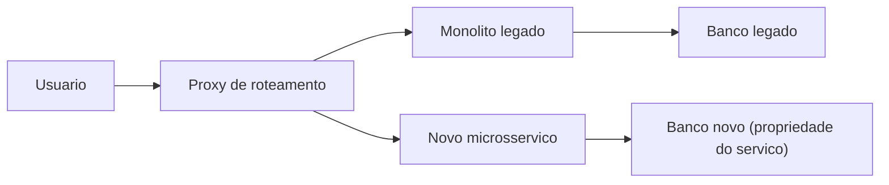
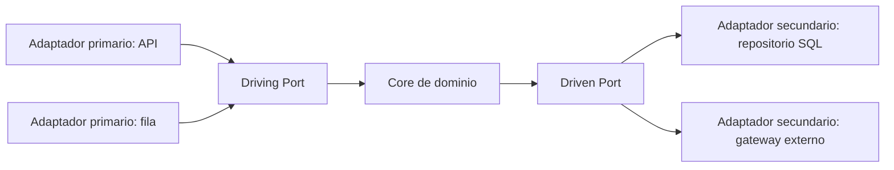
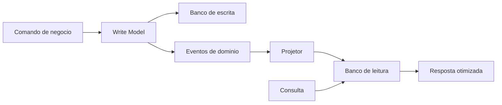
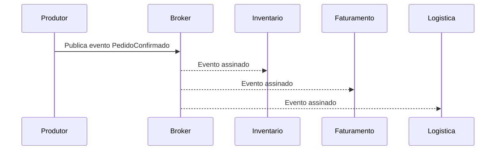
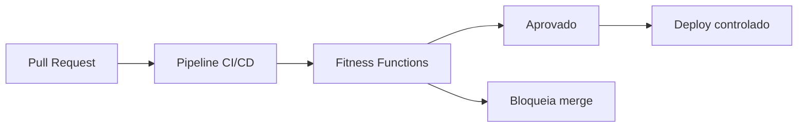

# **Bygga motståndskraftiga system: affärsvärdet bakom händelsedrivna arkitekturer och CQRS**

## **Den strategiska moderniseringens imperativ**

I det moderna digitala scenariot överskrider mjukvaruarkitekturens smidighet enbart teknisk effektivitet för att konsolidera sig själv som en primär konkurrensskillnadsfaktor och en nödvändighet för företagens överlevnad. Organisationer över branscher står inför ett obönhörligt tryck att förnya sig, anpassa sig till flyktiga marknadskrav och leverera användarupplevelser i realtid. Denna acceleration kolliderar dock våldsamt med verkligheten hos äldre infrastrukturer. System som byggdes för decennier sedan fungerar som företagsankare: de är oflexibla, farligt dyra att underhålla och ofta inkompatibla med moderna integrations- och skalningskrav. För teknikdirektörer (CTOs) och tekniska chefer (tech leads) leder administrationen av dessa system till en daglig kamp mot prestandaflaskhalsar, förlängda implementeringscykler och kvävande tekniska skulder.

Moderniseringen av äldre applikationer ses inte längre som ett rent operativt kostnadsställe som ska förstås som upplåsning av strategiskt värde. Monolitiska system, där användargränssnittet, affärslogiken och dataåtkomstskikten är inbyggt kopplade och körs i en enda process, uppvisar allvarliga begränsningar när skalning är nödvändig. Tät koppling dikterar att om en enskild funktionalitet kräver mer datorkraft måste hela applikationen replikeras, vilket resulterar i kroniskt slöseri med molnresurser. Det mest kritiska är att den monolitiska arkitekturen förstärker "sprängningsradien" för misslyckanden: ett fel i en rapporteringsmodul kan tömma serverminnet och få ner det kritiska betalningsbehandlingssystemet.

Övergången till reaktiva, modulära och evolutionära arkitekturer – med särskild tonvikt på händelsedriven arkitektur (EDA), kommando- och frågeansvarssegregation (CQRS) och hexagonal arkitektur (portar och adaptrar) – föreslår ett systemiskt botemedel mot dessa arkitekturpatologier. Den här resan kräver dock ett djupgående paradigmskifte, inte bara när det gäller att skriva kod, utan i hur organisationer ser mjukvaruteknik som en ekonomisk tillgång och hur de strukturerar sina team och operativa processer.

## **The Economics of Modernization: Measuring Technical Debt and Return on Investment (ROI)**

För att motivera att gå från kristalliserade arkitekturer till komplexa distribuerade modeller måste tekniskt ledarskap formulera fördelarna med ett övertygande finansiellt språk. Teknisk skuld ska inte behandlas som ett abstrakt ingenjörskoncept, utan kvantifieras som en verklig finansiell skuld på organisationens balansräkningar, som tillkommer "ränta" genom försämring av kodkvalitet, systemfel, förlust av utvecklingshastighet och teamutbrändhet.

Att bedöma avkastningen på investeringar (ROI) i moderniseringsinitiativ kräver en rättsmedicinsk analys av det nuvarande tillståndet. Tänk på det vanliga scenariot med ett företag som använder ett två decennium gammalt ERP-system (Enterprise Resource Planning). De årliga kostnaderna för detta system överstiger ofta hundratusentals dollar, och omfattar orimliga leverantörssupportavgifter för underhåll av föråldrad programvara, alternativkostnader kopplade till oplanerad driftstopp och avsevärd förlorad produktivitet för ingenjörer som kämpar med en oförståelig kodbas.

När man kvantifierar effekterna av modernisering, ser organisationer ofta transformativa finansiella mått. Sjukvårdsorganisationer som implementerade moderniseringsstrategier uppnådde en avkastning på 206 % under tre år, med återbetalningsperioden på mindre än sex månader. Dessa resultat möjliggjordes av direkta vinster på 30 % i produktiviteten för IT-driftsteam. Riskreducering leder också till enorma ekonomiska fördelar: studier indikerar en 50 % minskning av exponeringen för säkerhetsöverträdelser och minskade kostnader för efterlevnad av regelverk genom automatiserad bearbetning.

### **Hastighetsmått och utvärderingshorisonten**

Den mest betydande effekten av moderniseringen manifesteras i den exponentiella ökningen av utvecklingshastigheten. Organisationer ser ofta leveranshastigheten för ny funktionalitet dubbelt eller tredubblat efter konsolidering av en arkitektur baserad på väldefinierade mikrotjänster. Detta gör att samma antal ingenjörer kan leverera mer kommersiellt värde i storleksordningar, vilket drastiskt minskar *time-to-market*. Om en konkurrent kan lansera en ny funktion på två veckor på grund av dess händelsedrivna arkitektur, medan din organisation kräver tre månader för att förändra en bräcklig monolit, uppväger fördelarna med modernisering vida kostnadsbesparingarna, vilket direkt påverkar marknadspositionering och intäkter.

Men att artikulera denna ROI kräver metrologisk rigor. Den största bristen i transformationsprojekt är frånvaron av rigorösa baslinjer som fångats innan moderniseringen påbörjas. Ledarskapet måste dokumentera distributionsfrekvenser, *Lead Time* för ändringar, Mean Time to Recovery (MTTR), defektfrekvenser och detaljerade infrastrukturkostnader under minst tre månader före modernisering.

| Moderniseringsfas | Kostnadsdynamik | Inverkan på ROI (horisont 3-5 år) |
| :---- | :---- | :---- |
| **År: Övergång** | Högsta. Omstrukturering och infrastrukturkostnader parallellt (Legacy \+ New Systems). | Negativ. Kapitalintensiv investering. |
| **År: Optimering** | Genomsnitt. Förekomständring av storlek och äldre utfasning. | Breakeven. Vinsterna i hastighet och motståndskraft börjar uppväga övergångskostnaderna. |
| **År 3 till: Steady State** | Låg. Rent användningsbaserad infrastruktur (*pay-as-you-go*) och hög automatisering. | Massiv avkastning (200% till 304%). Total smidighet. |

Ekonomisk utvärdering av infrastrukturbeslut och molnplattformsförändringar bör inte baseras på 12-månadersperioder. Över korta horisonter gör kostnaden för parallellism att all migration verkar omöjlig. Men när man beräknar kostnader för det tredje till femte året blir den finansiella vändpunkten uppenbar, vilket visar att modernisering är den tekniska investering med störst absolut värde på lång sikt.

## **Nedbrytningsstrategier: Dekonstruera monoliten utan avbrott**

När migreringen väl har bestämts och budgeten säkrats genom ett datadrivet affärscase är den primära tekniska utmaningen att genomföra ersättningen utan att störa den nuvarande verksamheten. "Big Bang"-metoden – som föreskriver omskrivning av hela systemet bakom stängda dörrar och byte av all trafik i ett helgunderhållsfönster – är allmänt erkänt som den högsta risk- och felfrekvensstrategin i branschen.

För att mildra denna risk krävs ett rigoröst antagande av inkrementella migreringsstandarder som behandlar *noll driftstopp* tillgänglighet som en icke förhandlingsbar begränsning.

**Diagram: Inkrementell nedbrytning med Strangler Fig**


### **The Strangler Fig Pattern and Domain-Driven Design (DDD)**

Den definitiva metoden för att säkert strypa äldre system är *Strängler Fig*-mönstret. Denna strategi föreslår utveckling av nya mikrotjänster i periferin av det gamla systemet. Ett routinglager (proxy) fångar upp alla inkommande förfrågningar; om den begärda funktionen redan har migrerats, skickas begäran till den nya mikrotjänsten; annars dirigeras den tillbaka till monoliten.

Att utföra detta mönster kräver att man stoppar ny utveckling (frysning av funktioner) på monoliten, vilket tvingar alla nya affärsmöjligheter att bygga på den nya arkitekturen. Därefter styrs identifieringen av extraktionskandidater av principerna för *Domändriven design* (DDD). DDD dikterar att mikrotjänster inte ska delas upp av tekniska lager (en tjänst för databas, en för UI, en för affärsregler), utan snarare delas vertikalt runt "Bounded Contexts" som representerar påtagliga affärsmöjligheter, såsom "Catalog Management" eller "Payment Processing". Strikt isolering tillåter varje kontext att definiera sin egen språkliga förekomst och ha autonomi över sin livscykel.

Det absoluta kravet för DDD vid nedbrytning av mikrotjänster är decentraliserat dataägande. En mikrotjänst måste ha exklusivt ägande av sin databas, eftersom den är den enda komponenten som får skriva direkt till sitt schema. Den skadliga metoden att extrahera applikationslogik över dussintals tjänster medan de alla fortsätter att ansluta till en delad monolitisk relationsdatabas skapar anti-mönstret "Distributed Monolith", som kombinerar de värsta egenskaperna hos nätverkslatens med oförmågan att skala enskilda komponenter isolerat.

### **Kritisk datamigrering och skuggtrafik**

Databasavkoppling representerar den mest formidabla tekniska utmaningen i processen. För kritiska migreringar som stöder hög transaktionsförmåga är enkel offlinekopiering inte acceptabel. Sofistikerade schemautvecklingsstrategier krävs så att databasen kan tjäna både version N (legacy) och version N+1 (ny) samtidigt.

Shadow Table Migration-mekanismen och trafikspegling är avgörande. Shadow Traffic-applikationen kan utföras via servern eller enheten. I det serverdrivna paradigmet klonar en routningstjänst tyst inkommande produktionsförfrågningar, vidarebefordrar en kopia till den äldre infrastrukturen och en annan identisk kopia (som ofta innehåller unika identifierare för korrelation) till det nya omskrivna systemet. Den äldre servern betjänar användaren, medan de svar och bieffekter som genereras av den nya tjänsten registreras och valideras asynkront mot de äldre resultaten. Denna standard tillåter dig att uttömmande validera ny domänlogik under exakta produktionsförhållanden utan att utsätta slutanvändaren för risker. Den definitiva övergången för den nya tjänsten inträffar endast när tillstånd och prestandaparitet är statistiskt bevisad och scheman är helt synkroniserade.

*Leave-and-Layer*-mönstret visar utmärkt tillämpbarhet i detta sammanhang. Den äldre applikationen fortsätter att fungera smidigt och betjänar kunder utan avbrott. Ett tunt publiceringslager för händelser är kopplat till det (ofta med ändringsdatainsamling \- Change Data Capture, eller CDC, på databasnivå), som sänder tillståndsändringshändelser till en centraliserad buss (som AWS EventBridge). Ny affärslogik och moderna tjänster prenumererar på denna buss för att konsumera uppdateringar, asynkront integrera med den centrala databasen utan att någonsin påverka tillgängligheten för källsystemet.

## **Isolerande domänlogik: Hexagonal arkitekturs överlägsenhet (portar och adaptrar)**

Eftersom nya mikrotjänster föds för att absorbera domäner som extraherats från monoliten, är den huvudsakliga vektorn för intern försämring och teknisk skuld att bekämpa teknisk koppling. Traditionellt har applikationsramverk drivit koddesign: komplex affärslogik "läcktes" dödligt in i HTTP-webbkontroller, eller faktureringsregler kodades direkt i Object-Relational Mapper (ORM) entitetsanteckningar. Som en konsekvens av denna naiva skiktade arkitektur (där affärslogik direkt beror på databaslagret), skulle en förändring av databasleverantör eller uppdatering av ett webbramverk kräva omskrivning av grundläggande affärsregler.

Ports & Adapters Architecture, senare kallad Hexagonal Architecture av Alistair Cockburn, framstår som det strukturella svaret på teknisk immunitet. Dess centrala postulat är subversivt enkelt: applikationen måste vara systemets centrala och oberoende artefakt. Den måste kunna kontrolleras lika av webbanvändare, API-anrop, omfattande automatiserade tester eller batchskript, samtidigt som den förblir helt isolerad och omedveten om dess runtime-enheter och databasteknologier. "Hexagon" återspeglar inte en sexsidig begränsning, men illustrerar topologiskt att programvara kan ha flera godtyckliga oberoende ingångs- och utgångspunkter.

**Diagram: Hexagonal arkitektur (portar och adaptrar)**


### **Abstraktionens anatomi: portar, primära och sekundära adaptrar**

Den centrala principen för Hexagonal Architecture är Dependency Inversion, som arbetar strikt utifrån och in: alla externa tekniska och infrastrukturella lager måste uteslutande bero på det interna affärslagret (kärnan), men kärnan får aldrig bero på någon extern detalj. Denna formidabla inkapsling uppnås genom att etablera två avgörande koncept:

1. **Portar:** Representerar kontrakt (ofta implementerade som abstrakta gränssnitt i programmeringsspråk) som definierar hur applikationen interagerar med det yttre universum. Affärslogiken deklarerar exakt vad den behöver för att ta emot eller skicka genom dessa portar, på ett konsumentagnostiskt sätt. Portarna är uppdelade i *Driving Ports* (Gränssnitt som exponerar de Use Cases som applikationen erbjuder) och *Driven Ports* (Gränssnitt som kräver tjänster som applikationen behöver från omvärlden, såsom lagring av data).  
2. **Adaptrar:** Dessa är de konkreta komponenterna som bebor ringen utanför applikationen, och fungerar som översättare mellan det smutsiga språket i specifika teknikprotokoll och det rena språket i domänen.  
   * **Primära adaptrar (körning/inkommande):** De finns på vänster sida av den konceptuella hexagonen, vilket aktiverar applikationen. RESTful HTTP-kontroller, GraphQL-hanterare, RabbitMQ-köavlyssnare eller CLI-gränssnitt är primära adaptrar. De tar emot den tekniska stimulansen, packar upp den och anropar *Driving Port* (det injicerade användningsfallet).  
   * **Sekundära adaptrar (driven / utgående):** De finns på höger sida, kontrolleras av applikationen för att utföra biverkningar i omvärlden. SQL-anslutningar via ORM, klienter för anrop till tredje parts API:er (som Payment Gateways) eller eventutgivare i Kafka-ämnen. Domänen anropar *Driven Port* (till exempel IRepositorioDePagamento), och beroendeinjektion tillhandahåller, under körning, betongadaptern (till exempel AdaptadorDePagamentoStripe) som utför operationen.

### **Det omätbara affärsvärdet av isolering och testbarhet**

För CTO:er överstiger riskreduceringen i samband med att anta denna arkitektur de initiala kostnaderna för teamets inlärningskurva. Den huvudsakliga påtagliga vinsten ligger i den massiva accelerationen av automatiserad testtäckning med hög kvalitet.

I konventionella arkitekturer kräver testning av inköpsprocesslogik instansiering av en riktig databas och hela webbserverträdet, vilket gör integrationstester långsamma (minuter till timmar), vilket stryper metoderna för kontinuerlig integration och kontinuerlig driftsättning (CI/CD). Med Hexagonal Architecture kan ingenjörsteamet skapa simuleringar (*mocks* eller *stubs*) perfekt isolerade från de sekundära portarna i minnet. Således kan tusentals komplexa affärsscenarier, som omfattar alla permutationer av domänregler, testas på millisekunder, med deterministiskt förtroende, utan att någonsin initiera en egentlig databasbehållare.

Dessutom ger arkitekturen ett suveränt skydd mot *Vendor Lock-In* (teknologisk inlåsning påtvingad av molnleverantörer). Om ett styrelsebeslut kräver migrering av en Apache Solr-baserad söktjänst till Elasticsearch av licensskäl, begränsas omstruktureringen uteslutande till utvecklingen av en ny Elasticsearch Secondary Adapter som implementerar den befintliga sökporten. Det stora lagret av affärsanvändningsfall som orkestrerar sökningen, bearbetar resultaten och tillämpar säkerhetsregler kommer att förbli absolut och bevisligen orörda, vilket minskar ett projekt från månader till veckors säker utförande.

## **Lösa läs- och skrivflaskhalsen: Segregation via CQRS**

Även om Hexagonal Architecture skyddar kod från teknisk koppling, skapar transaktionsdesignen som är inneboende i mogna affärssystem kolossala prestandaflaskhalsar i datalagring. Det allestädes närvarande CRUD-mönstret (Create, Read, Update, Delete) manipulerar samma strukturella representation av domänentiteten – samma relationsdatabasmodell – oavsett om den underliggande åtgärden är en finkornig balansuppdatering eller en omfattande aggregerad finansiell rapportfråga.

När företagsmjukvara skalas, blir det tydligt att transaktionskrav (skriver) konkurrerar hårt med visualiseringskrav (läser). Asymmetrisk skalning är en obestridlig verklighet inom mjukvaruindustrin: den överväldigande majoriteten av moderna applikationer tjänar hastigheter där volymen avläsningar är tiotals eller hundratals gånger större än volymen av tillståndsmutationer (skrivningar). När den utsätts för dessa samtidiga belastningar i en enda modell (Single Data Store), lider databasen av låsstrider, motstridiga index och katastrofal försämring av respons.

CQRS-standarden (*Command Query Responsibility Segregation*) bryter avsiktligt datamodellen och förklarar att det arkitekturflöde som ändrar systemets tillstånd och flödet som frågar det måste existera absolut parallellt och optimeras separat.

**Diagram: CQRS-flöde med projektioner**


Illustrativt (TypeScript): Samma användningsfall skiljer mutationsavsikt (kommando) från läsning utan biverkningar.

```typescript
// Comando de escrita — valida invariantes e persiste no write model
type ConfirmarEmbarque = { pedidoId: string; sku: string };

async function handleConfirmarEmbarque(cmd: ConfirmarEmbarque): Promise<void> {
  // regras de domínio + emissão de eventos para projeções
}

// Consulta — apenas leitura do read model (desnormalizado)
type ResumoPedido = { pedidoId: string; status: string; total: number };

async function obterResumoPedido(pedidoId: string): Promise<ResumoPedido> {
  return readStore.buscarPorId(pedidoId); // sem JOINs pesados na hora
}
```
### **The Model Dichotomy: Commands kontra Queries**

Att använda CQRS kräver rigorös och avsiktlig trafikmodellering:

* **Kommandosidan (skrivmodellen):** Den är strikt utformad för att bearbeta operationer som ändrar data som finns kvar i systemet. Istället för anemiska uppdateringar baserade på tekniska områden (t.ex. UPDATE Status \= 2), kapslar kommandon in rika semantiska affärsavsikter (t.ex. ConfirmProductShipping). Skrivmodellen är den orubbliga väktaren av domänens regler och invarianter; den konsoliderar komplex säkerhetsvalidering och är optimerad för rent transaktionell integritet (ACID-garantier), och allokerar vanligtvis högt normaliserade data i Third Normal Form (3NF) för att eliminera uppdateringsavvikelser.  
* **Frågesidan (läsmodellen):** Däremot utför den inga tillståndsändringar. Dess enda syfte är att hämta information i mycket hög hastighet och formatera den på lämpligt sätt för användargränssnittet utan att innehålla oönskade fragment av domänlogik. Databasoptimeringar för läsmodellen föredrar kraftigt denormaliserade scheman, ofta "plattande" ut komplexa enheter för att undvika kostsamma aggregationer eller sammanfogningsoperationer (*JOINs*) under exekvering av en fråga.

### **Materialiserade projektioner och obeveklig prestanda**

Den terminala skalbarhetsfördelen som erbjuds av CQRS-standarden realiseras när modeller inte bara är logiskt åtskilda i kod, utan fysiskt separerade i distinkta databaser. Skrivmodellen kan finnas i ett kraftigt relationsdatabaskluster (som PostgreSQL) som är anpassat till strikt atomicitetsefterlevnad, medan läsmodellen kan vara en hyperskalbar dokumentbas (som MongoDB) eller ett index optimerat för textsökning (som Elasticsearch).

Denna fysiska separation gör det möjligt att använda **Projection Materialization** för att eliminera latenser i komplexa frågor. I ett monolitiskt system utan CQRS kräver kravet att bygga "Consolidated Customer Dashboard" komplexa förfrågningar som ansluter till (*JOIN*) dussintals tabeller relaterade till historiska beställningar, faktureringsstatus, supportbiljetter och returer varje gång sidan laddas, vilket förbrukar enorm disk I/O-tid med varje besök och påverkar användare som försöker göra köp.

Med CQRS och projektioner utförs inte den mödosamma beräkningen "on demand". När uppdateringar eller enskilda köp (händelser) sker i bakgrunden, lyssnar rutiner på dessa ändringar och omvandlar händelsen iterativt till ett redan bearbetat fragment av instrumentpanelen. Dessa förberäknade (materialiserade) dokument uppdateras tyst i läsmodellen. När användaren faktiskt kommer åt instrumentpanelen, utför läsmodellen en enkel och låg beräkningskostnadssökning efter en primärnyckel, som omedelbart erhåller det konsoliderade resultatet och återkommer i svarstider på mikrosekunder. Skrivmodellen fokuserar enbart på transaktionsprestanda (skrivgenomströmning) och läsmodellen belastar inte skrivandet under några omständigheter.

| Funktion | Monolitiskt mönster (Classic CRUD) | Segregerad standard (CQRS med fysiska projektioner) |
| :---- | :---- | :---- |
| **Databasarkitektur** | Enkelt, starkt kopplat system. | Olika banker; system som är lämpliga för ändamålet. |
| **Tillgång till data under läsning** | Utförande av komplexa *JOINs* i farten. | Enkel återställning av förberäknade och denormaliserade dokument. |
| **Infrastruktur Dimensionering** | Obligatorisk kostsam vertikal skalning; omöjlighet att urskilja flaskhalsar. | Asymmetrisk skalning (endast oändlig horisontell skalbarhet för lässervertyget). |
| **Kodkomplexitet** | Presentationslogik läcker in i uppdateringsregler via gigantiska ORM:er. | Brutal separation; rena kommandon baserade på affärsavsikt kontra förenklade återställningar. |

### **Eventuella konsistensavvägningar**

CTO och tekniska ledare som väljer denna sofistikerade arkitektur måste absolut förstå och hantera sin grundläggande avvägning: **Eventuell konsistens**. Frikopplingen av strömmar innebär att den framgångsrika uppdateringen av inspelningsmodellen inte sprids direkt till visualiseringslagret i alla fall.

Replikering av kommandodata till denormaliserade frågedata medför fördröjningar som kan variera från millisekunder till sekunder. Följaktligen kunde användargränssnittet registrera transaktionsändringen men visa den fördröjda posten vid omedelbart efterföljande läsning. Denna övergående "konsumentfördröjning" kräver utveckling av det mänskliga gränssnittet (Frontend) för att använda toleransenheter, vare sig man döljer begäran med optimistiska visuella svar, informerar om att data bearbetas eller tvingar omladdningar under korta intervaller (adaptiv polling). Mycket stränga finansiella institutioner övervinner denna latensbarriär genom att bygga in kompensationsmekanismer i den parallella EDA-arkitekturen för att säkerställa korrekt slutsynkronisering inom kritiska millisekunder. Det finns ingen omedelbar synkronisering i fysiskt distribuerade system och CQRS omfattar den inneboende asynkroniciteten istället för att undertrycka den genom dyra tvåfas distribuerade låssystem (2-Phase Commits).

## **The Enterprise Nervous System: Event-Driven Architecture (EDA)**

Den oöverträffade effektiviteten hos CQRS-modellen i skala beror i sig på hur synkroniseringen mellan skrivsidan och lässidan sker. Den viktiga teknologin som möjliggör en sömlös övergång av tillståndsförändringar mellan dessa oberoende domäner, utan att skapa synkrona beroendeflaskhalsar, är Event-Driven Architecture (EDA).

I icke-händelsedrivna system, när beställningstjänsten bearbetar e-handelsutcheckningen, utlöser den direkta HTTP-synkrona kommandon till inventeringstjänsten (för att minska lager), faktureringstjänsten (för att generera fakturering) och logistiktjänsten (för att skicka produkten). Denna djupa kedja (RPC-anrop) binder applikationer dödligt. Om modulen E-postmeddelanden är nere riskerar hela köptransaktionen att misslyckas eller sakta ner hela slutkonsumentens resa.

Tillkomsten av EDA etablerar ett radikalt frånkopplat och asynkront paradigm. Applikationen som genererade den livsviktiga förändringen ("Producenten") känner inte till eller bryr sig inte om existensen av de som behöver agera ("Konsumenterna"). Logiken bygger på att producera, meddela reaktioner på händelsen i realtid och omedelbart frigöra resurser.

**Diagram: Producentmäklare konsumentkedja**


I detta sammanhang använder mikrotjänster en robust mellanhand (Message Broker eller Stream Backbone) – ofta orkestrerad genom Apache Kafkas högpresterande infrastrukturekosystem, hanterade inbyggda lösningar som AWS EventBridge eller robusta meddelandenätverk via Apache Pulsar. Producenten deponerar tyst fakta ("Händelsen") hos mäklaren, som TransacaoRealizada. Konsumenter prenumererar på kanaler och vidtar åtgärder självständigt och inom sina egna handläggningstider.

### **Förökningskategorier: Från meddelande till evenemangskälla**

Arkitektonisk komplexitet och syfte driver tre viktiga delmönster inom evenemangsväven:

1. **Händelsemeddelande:** Den mest rudimentära signalen. Mikrotjänsten User Management sänder en sparsam händelse som UserDeleted (ID=990). Signalen tjänar endast till att varna lyssnare; Om de behöver djup information för kontextuella granskningar måste de skicka nya oberoende förfrågningar. Även om den är enkel och har låg bandbredd, bär denna mekaniker kostnaden för att tvinga asynkrona tjänster att falla tillbaka på synkrona räddningsanrop på den ursprungliga källan, vilket orsakar oönskade samlade latenser.  
2. **Event-Carried State Transfer \- ECST):** Denna modell förbättrar avsevärt oberoendet. Händelsen strömmar inkapslar inte bara förekomsten av faktum, utan bär också fullt ut alla oföränderliga attribut som beskriver den nya verkligheten. OrderConfirmed-händelsen länkar inte bara till ID-nyckeln utan även information om alla varor i kundvagnen, total fakturering, betalningsmetod och slutlig adress för konsumenten. CRM-system, leverans- eller faktureringsplattformar konsumerar dessa hypertäta strukturer och fyller omedelbart deras privata lokala databaser. Redundant back-to-core-trafik (efterföljande sökningar efter mer information från ursprungsdomänen) mildras nästan helt, vilket skapar full motståndskraft hos konsumenterna, som fortsätter att fungera baserat på deras aktiva kopior om den ursprungliga monoliten upplever blackouts.

Minsta exempel på *nyttolast* i ECST (i mäklaren är kontraktet vanligtvis versionerat med Avro eller JSON Schema):

```json
{
  "type": "PedidoConfirmado",
  "version": 1,
  "pedidoId": "ped-8831",
  "itens": [{ "sku": "SKU-1", "qtd": 2, "precoUnitario": 49.9 }],
  "total": 99.8,
  "metodoPagamento": "pix",
  "enderecoEntrega": { "cep": "01310-100", "cidade": "São Paulo" }
}
```
3. **Händelsekälla:** Denna teknik omdefinierar den tekniska grunden för databaslagret. Det slutliga tillståndet registreras inte, men de individuella övergångarna är; varje entitet representeras uteslutande av en kronisk och oföränderlig sekvens av delta av förändringar under hela livet, sparade i indexerade filer som är orienterade mot tilläggsbar lagring (*bifogningsbara loggar*). När programvara behöver återskapa det tillgängliga beloppet på en kontoinnehavares konto, beräknar den detta på ett deterministiskt sätt genom att applicera – händelse för händelse, genom kontinuerlig och oföränderlig reproduktion (Replaying) – varje enskild historik av uttag och insättningar som registrerats mot den banksammanslagningsidentifieringen från den primära öppningen till det önskade ögonblicket.  
   Att anta Event Sourcing kombinerat med CQRS möjliggör tidlös katastrofåterställning, vilket säkerställer revisionsspår som i sig är ogenomträngliga i finansbranschen. En enorm bas av banker är beroende av dedikerade verktyg som EventStoreDB eller Kafka logaritmiska infrastrukturer för att ge denna perennialitet mot oönskad manipulering. Denna deterministiska replikations destruktiva kraft åtföljs av en överväldigande kostnad i arkitektonisk komplexitet (extrem inlärningskurva, massiv och evig användning av lagring och behovet av periodiska "snapshotting"-rutiner som förhindrar omräkning av historik med miljontals poster).

### **Lätta systemfel med inneboende motståndskraft och elasticitet**

För att förstå affärskonsekvenserna och det obestridda förespråkandet av CTO:er över Event Mesh (EDA), fokuserar den viktiga fördelen på att isolera flaskhalsstormar i molnmiljön. Genom att frikoppla allvarliga beroenden under atypiska pulser av hypertrafik vid viktiga företagsögonblick som Black Fridays, flödar den enorma volymen av oväntad överskottsefterfrågan – vagnar som svämmar över med kort varsel – för att buffras i Event Broker-förvaret eller kösystem som är toleranta för diskfyllning utan plötslig krasch.

Shopify dokumenterar den svindlande trafiken som hanteras av Kafka-ämnesryggraden som bearbetar cirka 66 miljoner aggregerade meddelanden som arbetar per millisekund av extrem elastisk stabilitet, vilket möjliggör kontinuerliga modulära reaktioner. Till skillnad från det traditionella fasta mönstret som tvingar fram det desperata globala vertikala tillägget av AWS-datorkraft (som tar hänsyn till räkningen till det yttersta och inte reagerar på smidig efterfrågan), avleder den händelsedrivna asynkronicitetsfokuserade strukturen de brutala spikarna att vila i mäklarens säkra nätverk av kontinuerlig väntan.

Även med perifera system och betalningsberoende som inte är tillgängliga på grund av latens, skadas inget register eller ursprungligt primärt reseflöde, och varje element kommer att återaktiveras för att aktivt söka fortsättning vid tidpunkten för automatisk återställning, vilket sparar kroniska kaskader eller skärmar som innehåller fel (Fatal Timeouts) för kunden vid kassaköp.

### **The Operational Dark Side and Governance Challenges at EDA**

Inget paradigm saknar dock dolda bördor som ska mildras av högre tekniskt ledarskap. Strikt händelsestyrda system, samtidigt som de främjar frigörandet av beroenden på infrastrukturnivå, skapar djupa konceptuella fallgropar:

* **Konsumentfördröjning och begränsad observerbarhet:** Om applikationen avger händelser överdrivet över gränsen som nedströmspartitionerna kan suga (Throughput), kommer fördröjningen för att tömma retentionskön att staplas (Consumer Lag backlog), strypa i praktiken och ogiltigförklara den propagerade realtidsnaturen. Att hantera oberoende orkestrationer gör det drastiskt svårt att spåra omfattande misslyckanden: exakt var levde ett asynkront fel i en lång kedja över dussintals mikrotjänster? Det är obligatoriskt att införa i den tunga övergången av system absoluta och kostsamma spårningsmetoder med strikta identifierare som vidarebefordras från utfärdandet i det främre lagret genom DataDog, CloudWatch och New Relic (Distributed Tracing Instrumentation) kopplade till den detaljerade observationen av beteendet hos partitionerna och den tidsmässiga operativa hälsan hos alla mäklare.  
* **Systemiskt hot om duplicering av leveranser (exakt-en gång x åtminstone en gång semantik):** Fel i rutinanslutningar kommer att göra att ekosystemet alltid utlöser automatiska återsändningar av samma faktiskt fyllda signal till abonnenten som förlorade den i tomrummet ("Atminstone-en gång semantik"). Att köra meddelanden flera gånger obemärkt av dålig teknik kan orsaka oåterkalleliga affärskatastrofer, som att behandla oönskade dubbla återbetalningar på basen. Det är en obligatorisk föreskrift att koda system med *Idempotent* universell logik i sina lager för att skydda att kontinuerliga på varandra följande kausala omarbetningar av det singulara faktumet i sig aldrig manifesterar angränsande systemiska korruptioner på ödestillstånd efter den initiala ursprungshändelsen.

Typiskt försvar mot återleveranser (*minst en gång*): registrera händelseidentifieraren innan du tillämpar irreversibla biverkningar.

```typescript
async function processarReembolso(
  eventoId: string,
  payload: ReembolsoPayload
): Promise<void> {
  if (await jaProcessado(eventoId)) return;
  await aplicarCredito(payload);
  await marcarProcessado(eventoId);
}
```
* **Strikt styrning och schemabrott:** I likhet med restriktiva direkta uppdateringar (beroendebrytande API:er), förstör vårdslöst modifiering av namn eller radering av obligatoriska attribut på oföränderliga bussämnen oåterkalleligt sub-ekosystem som tyst är knutna till att ta emot den gamla, specifika fältlayouten. Strikt styrning utformad via automatiserad påtvingad kontroll i isolerade arkiv (Schema Registry Validation) kräver stela kontrakt som säkerställer kontrollerade uppdateringar, dokumenterade globalt under standardiserade format i infrastrukturen, som validerar om de är versioner som följer den universella retroaktiva övergången (Backward Compatibility Policy).

## **Säkerställa trohet: evolutionär arkitektur och fitnessfunktioner**

Utformningen av den asynkrona decentraliserade strukturen som drivs av domäner baserade på noggrant avgränsade hamnar i Hexagonal Architectures dikterar excellens i ekosystemets födelse. Men ekosystem åldras bittert och byggda arkitekturer försämras till kaotiska kopplingar med den kontinuerliga rörelsen i den intensiva rotationen av teknisk kraft, vilket läggs till marknadstrycket för den omedelbara frenetiska lanseringen av nya innovationsmöjligheter inom den föreskrivna smidigheten.

Att bevara disciplin kommer utan tvekan att kräva att man antar strukturerade mekanismer som garanterar bedömningar utan kontinuerlig manuell friktion av mänskliga misslyckanden. Grundmetoden för denna automatiska begränsning reagerar genom riktlinjer som formellt har benämnts av branschen som **Evolutionär arkitektur**, helt fokuserad på byggnadssystem som har naturlig tolerans som stödjer och vägleder kontinuerliga evolutionära förändringar som kontrolleras samtidigt i flera väsentliga icke-funktionella matriser (skalbarhet, säkerhet och tillförlitlighet).

För att stabilt förankra denna systemiska formbarhet med skyddsåtgärder utan hinder och stagnationer i styrning och processer, antar CTO:er **Architectural Fitness Functions** ingenjörskonst, vilket starkt speglar framgången för utvecklingsmetoder baserade enbart på tester (Testdriven Development \- TDD). Precis som teamet skriver minimala, avgränsade block som validerar logik och utdata innan fullständiga mjukvarubyggen, består *Fitness Functions* av hårdkodade regler, där deras kontinuerliga anrop ger omedelbar påtaglig integritet till de nödvändiga strukturella gränsreglerna, verifierar begränsande anpassningar som är viktiga för standardisering, blockerar avvikelser.

**Diagram: pipeline för arkitekturstyrning**


### **Arkenhet och effektiv övervakning av den hexagonala gränsen**

System som enbart fokuserar på gränserna för DDD via Hexagon kräver pansarisolering vid sina kanter, och det cykliska beroendet som läcker från utsidan till insidan kommer tyst att förstöra kardinalprincipen. På en företagsomfattande basis som anammats av robusta marknadsekosystem utvecklade i Java och TypeScript, manifesterar begränsningen av arkitektonisk förorening sig i den öppna blockeringen av automatiserad integration genom att koppla explicit validering av kraftfulla utvärderingsbibliotek som analyserar strukturella syntaxer, cykliska beroenden mellan djupa arkiv och interna logiker av externa logiker vid kompileringstid: **ArchUnit** verktyg.

Exempel på *fitness-funktion* i Java (regel som misslyckas med byggandet om domänpaketet börjar bero på Spring eller JPA):

```java
import com.tngtech.archunit.junit.AnalyzeClasses;
import com.tngtech.archunit.junit.ArchTest;
import com.tngtech.archunit.lang.ArchRule;

import static com.tngtech.archunit.lang.syntax.ArchRuleDefinition.noClasses;

@AnalyzeClasses(packages = "com.empresa")
class FronteiraHexagonalTest {

  @ArchTest
  static final ArchRule dominio_isolado =
      noClasses()
          .that().resideInAPackage("..domain..")
          .should().dependOnClassesThat()
          .resideInAnyPackage("org.springframework..", "jakarta.persistence..");
}
```
1. **Filosofin med enkla och flera returdörrar (enkelvägs kontra tvåvägsdörrar):**  
   Denna matris skapad av operationella direktivlogiker baserade på Amazons effektiva inhemska praxis försöker klassificera alla systemimplementeringar som kräver definitioner i den tekniska övergången, kategoriskt separera deras avkastning:  
   * **Kategoriska enkelriktade beslut (envägsdörrar):** Val av djup vikt, extremt höga kostnader, farliga och som permanent binder den organisatoriska basen till starkt rotade inneboende band utan möjlighet till vänlig och säker reträtt. Att investera massivt och förändra hela den primära basen, vilket tvingar övergången av ekosystemet att enbart fokusera på restriktiv bearbetning via spårloggning i native Event Sourcing, lösgörande av universella rena SQL-baser, kräver oerhört mycket tid som investeras, intensiva migrationer, fullständig företags radikala kognitiv förändring av teamet eller urvalet av hittad infrastruktur. Återföringar tvingar fram miljardärer att överge eller månader av uttömmande omskrivningar under katastrofala påfrestningar och regulatoriska bestraffningar (Severe Risk Buffers). De kräver mycket rigorösa globala djupgående analyser.  
   * **Flexibla dubbelriktade beslut (tvåvägsdörrar):** Dessa är övergående överväganden av arkitektur och teknik med ytlig friktion i utvecklingssfärerna, som kan inaktiveras, prövas, återkallas eller ersättas lokalt på ett extremt rent, enkelt sätt, med ignorerande kostnader och ofarlig risk för det viktiga kritiska lagret av logik i verksamheten. Kortvariga interna utgåvor i bibliotek som enbart finns i lokala primära hamnar eller mindre adoptioner i tillbehörssystem är exemplet på tvåvägs agila beslut befriade från byråkratiska avmattningar av gräsrotsstyrelserna för att driva omedelbar smidighet och oinskränkta kontinuerliga innovationer.  
2. **Operationell cementering efter beslut (arkitekturer registrerade i ADR):** Förstå utvärderingsaspekterna av envägsdörrarna som dikterar riktningen för strukturella evolutioner eller kritisk skärning av vitala moduler i äldre moderniseringar via CQRS, den verkliga begränsningen av CTO:n är baserad på friktion, som genereras av framtida rörelser i teamet. ifrågasätter arvet efter projektet och avbryter ständiga rytmer i det systemiska arbetet i rättstvister meningslöst (Relitigating Choices). Den primära artefakten som krävs i effektiva och seniora ingenjörsorganisationer är sammanfattningen och systematiskt skapande av spårbara poster som strikt finns i själva baskontrollen kopplade till källkoden och oföränderliga av de kontextuella motiveringar som baserade den tekniska design som var gällande vid den tiden, känd i utvecklingsmiljön som *Architecture Decision Records (ADRs)*. I smidiga markdown-dokument ordnade universellt under sju rena sektioner, avgränsar de på ett kirurgiskt och enhälligt sätt: Den väsentliga motivationen (The Base Context in the choice of CQRS to alleviate the dangerous containment of locks in the modules of the monolith saturated with BI-queries linked to sales spikes in the primary interface, The Accepted StrategyS/IPogrete. Kluster), The Consequences and Absurd Burdens Project Overens (Antagande av komplexiteten i att hantera eventuella problematiska konsistenser för att tillhandahålla direktörerna för kundbasen), och de konkurrerande lösningsmodellerna som formellt avvisades i rapporterna och orsaken bakom denna tidsmässiga abdikering.  
3. **Katastrofinokulerad demokrati (EA/ARB Governance Board och RACI Matrix):** Med styrning begränsar ledarskapet och cheferna för den konsoliderade arkitekturen farliga strukturella hinder i högkvarteret i överdrivna avstängningar, genom att använda universell segregation vid delegering av och transparent avgränsning av det globala ansvaret för ägaren, genom att avgränsa den globala användningen av det klassiska ansvaret. allokering i "RACI" Executive Matrix i breda beslutsarkitekturer inriktade på riskportar (Isolerat ansvar och slutligt ansvar leverantör "Accountable"; Utvecklare "Ansvarig"; Minskning till mikrostyrelser av konsulter för basråd "Konsulterat" som blockerar analyser av fatal förlamning av veto sprids utan ledningsbehov av ledningsskiktet inte i Envägs-informerade dörrar till "Informativa dörrar" styrelse i breda förändringar av den organisatoriska basen). I samband med strategiska riktningar av absolut storlek som

och driva viktiga moderniseringar till stora basplattformar som kommer att kräva kolossala integrationer med tvärgående icke-tekniska sfärer av reglerade företag (banker och hälso- och sjukvårdsflerkanalskomplex i tunga transaktionsmoderniseringar), fann den verkställande och mångsidiga panelen i Executive Board of Reviews on Standards of Guideline Evolution (Architecture Review Board \- ARB), som i huvudsak säkerställer att alla transiteringar undergår de exekveringsstrukturer. organisationen som systematiskt anpassar sig till företagets vitala mål för att skydda avkastningen av kontinuerligt värde och skydda arkitekturerna, men medveten om att aktivt ge vika fri från den stela hyperstyrningen med rena pragmatiska adoptioner via kontinuerliga och osynliga fitnessfunktioner kodade till teamen och teamen.

Genom dessa obevekliga sviter som infogats i de centrala pipelines av organisationens inhemska CI/CD-kontinuerliga distributionskedja, etablerar ledare och seniora ingenjörer programmatiska definitiva tester som uttrycker att klasser som enbart finns i paketmappar strukturellt kallade "Domän" aldrig internt kan referera till ursprunglig logik, så kallad restriktiv direkt abstrakt webbframework som kommer från företagets basplattform Spring. Vid den minsta subtila import av otillbörligt beroende av koppling till arkitekturdatabasmotor eller webbanslutningar inom den rena domänregionen på omogna isolerade recensioner av PR (Pull Requests), bryter koden aktivt mot den underliggande arkitekturprincipen, vilket gör att ArchUnits *Fitness Functions*-sviter misslyckas omedelbart globalt och underkastar alla primära appar. ingen chans till oönskad sammanslagning i den skyddade företagskoden. Automatiserade metriska lås läggs till, vilket innebär att de korsade cirkulära banden som ödelägger utvecklingen av funktionaliteter i system avvisas eller stoppar klasser som överdrivet utökar sina funktioner trots allvarligt obalanserade kognitiva komplexiteter internt fördefinierade i trösklar (Cyclomatic Complexity metrics).

### **Utvecklande transversell styrning**

Utöver de uttryckliga gränserna för fundamenten i koden via statiska kopplingsverktyg, implementeras även omfattande kontinuerlig övervakning av system som enbart syftar till live observerbara manifestationer av dynamiska mesh-beteenden (Dynamic/Runtime Fitness Functions). Stela triggers är konfigurerade i observationsnäten i AWS-nätet som är kopplat till Datadog för att aktivt ingripa när långsamma kedjade reaktioner av händelser mellan mikroapplikationer passerar den förväntade svarstidens benchmark eller överskrider den tillåtna fördröjningen som anges i företagets begränsade händelseslingmäklare, och därmed omintetgör farliga och kroniska gradvisa förluster som orsakats av att på kort sikt eller medellång konstruktion misslyckas med att respektera omstruktureringen. anpassning i aktiva arkitekturer (Regression Performance Alerts). Till och med intrikata ekologiska beacons övervakar systematiskt flaskhalsar i molnet under rigorösa krav som utvärderar operativa koldioxidavtryck i dynamisk bearbetning i datacenter, genom den *ecoCode* integrerade hållbarhetsmätaren i organisationens icke-funktionella krav (NFR).

## **Executive Decision and Governance Structuring Frameworks (CTO-ledarskap)**

Varje tät pelare fokuserad på grunderna och konstruktionen av övergångar som täcks av denna tekniska utforskning kräver förening med det holistiska pragmatiska ledningsskiktet, för att utvinna vinsten och undvika kontraintuitiva fällor som hotar adoptioner i företag strukturerade i verkligheten och begränsade resurser. Teknisk bedömning korsar undantagslöst en värld av ekonomisk komplexitet, och tekniskt verkställande ledarskap (CTOs och senior Tech Leads) formar med nödvändighet mekanismer för att metodiskt klassificera prioriteringar, mildra riskfyllda effekter, utvärdera vägar och formalisera dokumentation och åtaganden som kommer att eliminera oförutsedda politiska hinder eller kostsamma operativa omkastningar i förvaltningsstrategin.

Grunden för att konvertera dessa riktlinjer är baserad på konsoliderade metoder och milstolpar som antagits i de farligaste globala systemen som drivs inom sektorn, och baserar taxonomin på:

För ledare som formar den ständiga motståndskraften hos den samtida organisationen med en obegränsad skalbar bas genom de modulära synergistiska principerna för Ports & Adapters, den extrema tekniska komplexiteten som stöds i de analytiska standarderna för CQRS, speglad i de vitala pulserna av reaktiva system av de asynkrona meshorna i EDA, begränsar inte enkla metoders separata metodologier; bilda den obligatoriska sammanhållna taktiska arsenalen för att definitivt omvandla alla operationella begränsningar och skulder som kristalliserats i arvet av ineffektivitet i föråldrade arvsbaser till konkurrenskraftigt, autonomt, modulärt, reaktivt och odödligt intellektuellt kapital till obevekliga skalära och ständiga marknadsutmaningar i dynamiska globala marknadsutmaningar.

---

## Vill du utvärdera detta scenario i ditt sammanhang?

Om du vill omvandla dessa riktlinjer till en körbar teknisk plan, prata med Web-Engenharia. Vi utför en teknisk bedömning av din miljö och designar specialiserad konsultverksamhet med prioriteringar, risker och implementeringsfärdplan.)