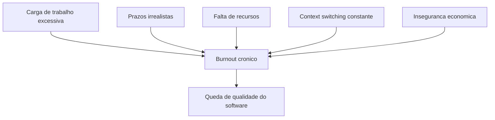
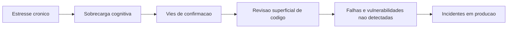
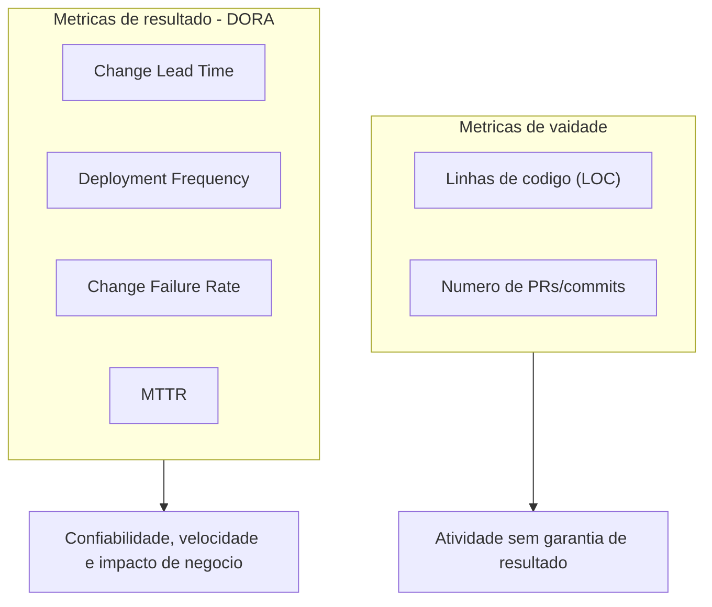
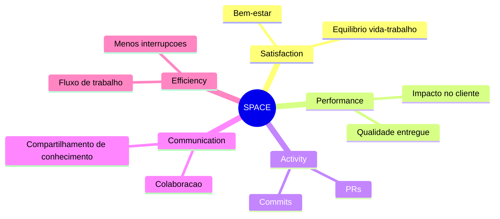
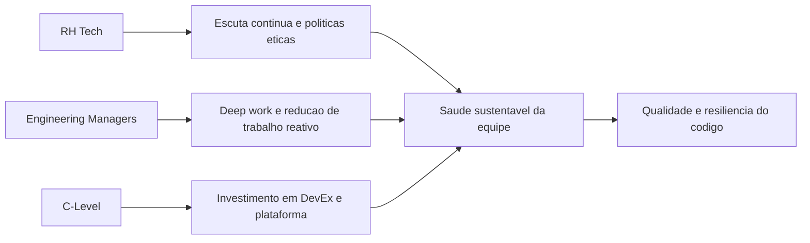

# **The Invisible Metric: Hur utvecklares hälsa och välbefinnande påverkar kodkvaliteten**

Samtida mjukvaruteknik vilar på en djup strukturell paradox: även om teknisk infrastruktur är utformad med massiva redundanser för att uppnå skalbarhet, motståndskraft och hög tillgänglighet, så skjuts den mänskliga infrastrukturen som bygger och underhåller den ofta till en punkt av systemfel. Historiskt sett har teknikindustrin och riskkapital utvärderat ingenjörsframgång genom rent mekanistiska produktionsmått, med fokus på leveranshastighet, kodvolym och serverdrifttid. En rigorös empirisk analys av mjukvaruutvecklingslivscykeln (SDLC) avslöjar dock att kvaliteten på kodbasen, säkerheten i arkitekturen och stabiliteten hos applikationer är navellänkade till ett mått som ofta är osynligt på företagets instrumentpaneler: utvecklarnas mentala hälsa, psykologiska välbefinnande och kognitiva belastning.

Mjukvaruutveckling är en i sig socioteknisk och mycket cerebral aktivitet, som kräver långvariga tillstånd av djup koncentration, kreativ problemlösning och ständig anpassning till nya språk, ramar och operativa paradigm. När yrkesverksamma som utför dessa uppgifter arbetar under kronisk stress, finns det en mätbar försämring av deras kognitiva förmågor. Denna försämring visar sig inte bara som missnöje med jobbet; det leder direkt till logiska brister i arkitekturen, exponentiell ökning av tätheten av defekter och införandet av kritiska sårbarheter i produktionssystem. Denna rapport analyserar utförligt skärningspunkten mellan proaktiv hälsoövervakning av tekniska team, begränsning av strukturell utbrändhet och kvalitetssäkring av programvara, vilket ger ett datadrivet strategiskt ramverk för ingenjörsledare, teknikfokuserade personalchefer (HR Tech) och startupgrundare.

## **Panorama av teknisk utmattning: en systemisk och kvantifierbar kris**

Det nuvarande tillståndet för arbetsstyrkan inom mjukvaruteknik indikerar en systemisk utbrändhetskris, driven av obevekliga sprintcykler, digital överbelastning, verktygsspridning och allvarliga makroekonomiska förändringar. Ny forskning målar upp en alarmerande bild av försämrat välbefinnande inom den globala teknikindustrin, vilket bevisar att utbrändhet inte är ett övergående modeord utan en yrkesepidemi. En branschövergripande undersökning beräknad för 2024 och 2025 avslöjade att 68 % av teknikarbetarna rapporterade att de upplevde akuta symtom på utbrändhet, vilket representerar en betydande ökning från de 49 % som registrerades bara tre år tidigare.

**Diagram: Strukturella vektorer för utbrändhet**


På specifika marknader och i undersökningar som riktar sig strikt till utvecklare är situationen ännu mer kritisk. Nästan tre fjärdedelar (73 %) av de europeiska yrkesverksamma inom informationsteknik rapporterade att de upplevde pågående arbetsrelaterad stress eller utbrändhet. Andra oberoende studier fokuserade på tekniska analysplattformar har visat att utbrändhet når skrämmande 83 % bland programmerare. Dessa data visar att utmattning har blivit standardtillståndet och inte en tillfällig anomali.

| Utarmningsmått | Procent rapporterad | Forskningskontext och bidragande faktorer |
| :---- | :---- | :---- |
| **Utbrändhetssymtom (allmänna)** | 68 % | Ökning jämfört med 49 % tre år tidigare; drivs av digital överbelastning och innovationshastighet. |
| **Stress/utbrändhet (Europa)** | 73 % | 61 % tillskriver det tunga arbetsbelastningar; 44 % till snäva deadlines; 43 % på grund av resursbrist. |
| **Risk för utbrändhet inom teknik** |,1% | Arbetare klassas som "hög risk" för överhängande utbrändhet. |
| **Utbrändhet för utvecklare** | 83 % | Rapporterad i utvecklaranalysplattformsstudier, med fokus på bristande autonomi och syfte. |

*Tabell: Statistisk sammanställning av yrkesutbrändhet i teknikbranschen (2024-2025).*

Rötterna till denna utbrändhet är mångfacetterade och går betydligt längre än att bara arbeta för många timmar. Utbrändhet katalyseras av orealistiska förväntningar på linjär produktivitet, alltför komplexa eller monolitiska systemarkitekturer och ett berg av äldre tekniska skulder som gör vilken kodförändring som helst till ett minfält. Mer än 60 % av yrkesverksamma tillskriver stress på jobbet till överdriven arbetsbelastning, medan strukturella faktorer som orealistiskt snäva deadlines och kronisk brist på resurser påverkar mer än 40 % av arbetsstyrkan. Kulturen med arbete dygnet runt, förvärrad av dåligt strukturerade policyer för distansarbete, har kraftigt suddat ut gränserna mellan arbete och privatliv. Den överväldigande majoriteten av utvecklarna rapporterar att de fortsätter att koda, eller mentalt lösa problem med mjukvaruarkitektur, utanför konventionella arbetstider.

Ett särskilt oroande demografiskt fenomen som avslöjats i den senaste forskningen är förändringen i profilen för den drabbade yrkesmannen. Historiskt sett var utbrändhet ofta förknippad med juniorutvecklare som kämpade för att anpassa sig till den branta inlärningskurvan och pressen från tidiga leveranser. Nya data tyder dock på att utbrändhet i mitten av karriären närmar sig epidemiska nivåer, med seniora utvecklare som rapporterar betydligt lägre tillfredsställelse än sina yngre motsvarigheter. Dessa seniora yrkesmän är inte bara utmattade av de mekaniska kraven från kodning, utan av det ohållbara spridningen av möten, ständiga sammanhangsbyten, ostrukturerade mentorskapsansvar och den psykologiska avgiften av att hålla kritiska system igång under högt tryck och jourskiften.

Utöver detta scenario som är inneboende för ingenjörskonst, finns det den förödande psykologiska effekten av makroekonomisk instabilitet. Rapporter fokuserade på ingenjörsledarskap visar att 40 % av chefer och tekniska ledare ser att deras team är betydligt mindre motiverade på grund av skuggan av uppsägningar inom tekniksektorn. Otrygghet på jobbet är inte ett abstrakt bekymmer; det genererar kronisk ångest som förbrukar den kognitiva bandbredden som behövs för komplex programmering. När en organisation misslyckas med att tillhandahålla stabilitet, tillräckliga resurser eller ledningstransparens, kollapsar den inneboende motivationen helt, vilket undergräver effektiviteten oavsett den direkta chefens skicklighet. Utbrändhet överskrider därför individuell trötthet; det är en otvetydig indikator på en patologisk arbetsmiljö där det kognitiva trycket vida överstiger individens och teamets coping-resurser.

## **Neurovetenskapen kring mjukvaruutveckling och uppkomsten av kritiska buggar**

För att förstå den exakta mekaniken för hur sjunkande välfärd direkt påverkar stabiliteten hos kod i produktionen, är det nödvändigt att överge tillverkningsanalogier och undersöka handlingen att programmera genom en strikt neurokognitiv lins. Att förstå abstrakta arkitekturer, spåra dataflödet och skriva källkod är uppgifter som kräver enorma resurser från den mänskliga hjärnans arbetsminne. När en utvecklares kognitiva belastning närmar sig eller överskrider de fysiologiska gränserna för detta arbetsminne, faller deras förmåga att förstå och visualisera komplexa system, vilket gör dem exponentiellt mer benägna att göra logiska fel som materialiseras som mjukvarufel.

Den outplånliga kopplingen mellan emotionellt tillstånd, överdriven mental belastning och införandet av kritiska buggar har underbyggts av banbrytande empiriska undersökningar med hjälp av elektroencefalografi (EEG) och funktionell magnetisk resonanstomografi (fMRI). Den kognitiva taxonomin om orsakerna till mänskliga fel bekräftar den kontraintuitiva idén för många chefer att glömska, uppmärksamhetsbortfall och mental överbelastning är de verkliga vektorerna för mjukvarusårbarheter, och inte bara en brist på teknisk skicklighet. Banbrytande studier har visat att känslor direkt påverkar kvaliteten på programmeringsuppgiften, med Frontal Asymmetry Index som fungerar som en livskraftig biomarkör för att förutsäga prestanda och uppmärksamhet under kodning.

Djupanalyser med hjälp av EEG för att kartlägga kognitiv överbelastning bekräftar dessa hypoteser. Samtida neurovetenskaplig forskning har överskridit subjektiva bedömningar av stress genom att kartlägga utvecklarens hjärna samtidigt som de utför verkliga uppgifter. Studier visar att mjukvaruutvecklingsuppgifter kräver intensiv aktivitet i Insula-regionen, ett hjärnområde som är allmänt förknippat med kognitiva processer av hög ordning och komplex problemlösning. Systematisk analys av neurologiska biomarkörer, specifikt Hjorth-parametern Activity and Total Power i frontala och centrala kanaler (F4, FC4 och C4), avslöjar att utbrändhet är ett mätbart fysiologiskt misslyckande.

Fynden från dessa skärningspunkter mellan neurovetenskap och mjukvaruteknik är tydliga: Om en programmerare arbetar under hög kognitiv överbelastning eller distraheras när han skriver eller granskar kodrader, ökar sannolikheten för att buggar ska introduceras eller att säkerhetssårbarheter förblir obemärkta. Detta blir ännu mer akut när koden i fråga redan har hög cyklomatisk komplexitet, mätt med klassiska statiska analysmått. Säsongsvariationer i kodkvalitet är därför inte resultatet av avsiktlig försummelse, utan snarare den oundvikliga biprodukten av en hjärna som arbetar under förhållanden av kronisk stress, synaptisk trötthet och känslomässig utmattning.

Förutom den minskade förmågan att bearbeta information abstrakt, påverkar det försämrade psykologiska tillståndet allvarligt den metodologiska dynamiken i utvecklingen, särskilt under de avgörande faserna av enhetstester och kodgranskning. Kognitiv psykologi beskriver fenomenet "bekräftelsebias" som den instinktiva mänskliga tendensen att söka, tolka och fokusera på information som verifierar redan existerande hypoteser snarare än att försöka motbevisa dem. När man skapar tester och granskar pull-förfrågningar bör utvecklare teoretiskt försöka att aktivt undergräva och bryta sin egen kod. Men under svår tidspress och mental stress förstärks bekräftelsebias katastrofalt; Utmattade utvecklare söker vägen för minsta motstånd mot validering och ignorerar komplexa kantfall och subtila arkitektoniska brister som skulle kräva stor kognitiv ansträngning för att spåra upp. Som ett direkt och kvantifierbart resultat av detta stressinducerade kognitiva misslyckande, sprider kritiska defekter in i produktionsmiljön, vilket ökar tätheten av mjukvarufel och risken för systemavbrott.

**Diagram: Neurokognitiv kedja till buggar i produktion**


Kvantifiering av dessa fel utförs ofta med hjälp av måttet Defektdensitet, vanligen beräknat genom att dividera antalet bekräftade defekter med storleken på mjukvarumodulen, ofta mätt i tusentals rader kod (KLOC) eller funktionspunkter. Programvaruprojekt upplever i genomsnitt 15 till 50 buggar för varje 000 rader kod som skrivs. När personalstyrkan brinner ut åsidosätter tröttheten proaktiv granskning, vilket gör att antalet defekter närmar sig den övre gränsen för detta genomsnitt. Dessutom avslöjar analys av defektmönster att buggar tenderar att samlas i specifika, hyperkomplexa områden i koden. Utan den mentala skärpan som behövs för att navigera i dessa kritiska områden upplever team ständiga avbrott.

Den sociala och kollaborativa dimensionen av mjukvaruutveckling kollapsar också under press. Kronisk stress undergräver interaktivt samarbete och professionell empati. I högtrycksmiljöer med låg moral sker en kraftig nedgång i empiriska kvalitetssäkringsmetoder som förlitar sig på sund interpersonell dynamik. Parprogrammering överges, dagliga möten (standups) blir tomma mekaniska rapporter och det sker en oroande kunskapsansamling i silor. Proffs tenderar att isolera sig för att skydda sin knappa mentala energi, tveksamma till att ta ansvar för riskabla kodrefaktoreringar eller ta upp arkitektoniska problem. Denna sammanbrott i kommunikationen innebär att små missförstånd om affärskrav tyst utvecklas till katastrofala förseningar och förödande långfristiga tekniska skulder.

## **Fefarandet av traditionella mått och uppkomsten av DORA-ramverket**

Den historiska strävan att kvantifiera intellektuellt arbete inom mjukvaruteknik har en historia av att anta reduktionistiska mått som ofta uppmuntrar paradoxala beteenden som är skadliga för långsiktig kvalitet. Det mest klassiska och utan tvekan mest felaktiga måttet, Lines of Code (LOC \- Lines of Code), anses allmänt vara ett fåfängamått. Obegränsad användning av LOC straffar algoritmisk effektivitet och elegans; en utvecklare fokuserad på kvalitet och systemhälsa kan lösa ett komplext arkitektoniskt problem genom att omstrukturera och eliminera tusen rader med äldre kod, medan en utmattad utvecklare kan leverera en spröd, uppsvälld lösning med hundratals rader bara för att signalera produktivitet. På samma sätt mäter en strikt utvärdering av prestanda genom att räkna Pull Requests (PRs) eller åtaganden endast aktivitet och kinetisk rörelse, inte faktiska framsteg mot affärsmål. Det är ett arbetsflödesberoende mått och mycket känsligt för manipulation, där utvecklare fragmenterar triviala leveranser för att blåsa upp siffror, dölja systemisk kvalitetsförsämring.

För att övervinna fokus på bruttovolym och mikrohantering, anammade branschen massivt DORA (DevOps Research and Assessment)-mått, vilket revolutionerade sättet vi utvärderar effektiviteten av mjukvaruleverans genom att koppla utvecklingsmetoder till organisatoriska resultat. DORA går bort från linjeräkning och undersöker leveranspipelines mognad och operativ prestanda (Software Delivery and Operational \- SDO) med fokus på fyra primära axlar:

**Diagram: Traditionell statistik kontra DORA**


1. **Ändra ledtid:** Tiden som förflutit från kodbekräftelse till framgångsrik implementering i produktionen.  
2. **Deployment Frequency:** Den kadens med vilken organisationen distribuerar kod till produktion.  
3. **Change Failure Rate:** Procentandelen distributioner som orsakar produktionsfel som kräver omedelbar åtgärd (snabbkorrigeringar, återställning).  
4. **Genomsnittlig återställningstid (MTTR/Failed Deployment Recovery Time):** Tiden som krävs för att återställa tjänsten i händelse av en incident eller ett fel.

DORAs longitudinella forskning har definitivt visat att prestanda för mjukvaruleverans är en direkt prediktor för organisatorisk framgång, vilket påverkar lönsamhet, marknadsandel och kundnöjdhet. Dessutom har det etablerat en obestridlig korrelation mellan hög IT-prestanda och anställdas psykologiska välbefinnande och lojalitet. Proffs i högpresterande organisationer (Elite och High) är 2 gånger mer benägna att rekommendera ditt företag som en bra arbetsplats (mätt med eNPS).

Genom att kategorisera team i elit-, hög-, medel- och lågprestationsprofiler avslöjade forskningen djupgående och lärorika skillnader i allokeringen av kognitiv tid. Den mest avslöjande aspekten av DORA-undersökningen för HR- och ingenjörsledare som är oroade över utbrändhetsepidemin ligger i hur tid konsumeras av team, vilket illustrerar bördan av reaktivt arbete:

| Prestandakategori (DORA) | Tid spenderad på nytt arbete (innovation) | Tid som spenderas på oplanerat arbete och omarbetning | Konstant åtgärdande av säkerhetsbrister | Korrigering av defekter som identifierats av användare |
| :---- | :---- | :---- | :---- | :---- |
| **Elitartister** | 50 % |,5 % | 5 % | 10 % |
| **Lågpresterande artister** | 30 % | 20 % | 10 % | 20 % |

Tabell: Ansträngningsfördelning baserad på prestandaprofil för mjukvaruleverans (DORA Accelerate State of DevOps Data).

Elitlag njuter av en god cykel av mental hälsa och teknisk excellens. Genom att implementera robusta tekniska kapaciteter minskar vad forskningen kallar "implementeringssmärta" – nivån av rädsla, ångest och kronisk stress som ingenjörer upplever när de skickar kod till produktion. Där implementeringar är mest smärtsamma och genererar nattlig ångest är de värsta organisationskulturerna och lägsta mjukvaruprestanda. Elitteam, befriade från denna smärta genom automatisering, kan avsätta hälften av sin kognitiva tid till genuint värdeskapande (50 %).

I skarp kontrast är utvecklare i lågpresterande miljöer fångade i ett reaktivt tillstånd av evig överlevnad. Dubbelt så mycket tid går åt för att släcka bränder, åtgärda säkerhetshål i sista minuten på grund av brist på tidig automatiserad testning och åtgärda en överväldigande mängd defekter som rapporterats direkt av frustrerade slutanvändare. Detta reaktiva och oplanerade arbete (omarbete) är en av de primära vektorerna för utbrändhet, kännetecknad av höga nivåer av kortisol och konstant systemisk frustration. Christina Maslachs forskning om utbrändhet, allmänt citerad i DORA, identifierar sex organisatoriska riskfaktorer för utbrändhet: arbetsöverbelastning, bristande kontroll, otillräckliga belöningar, sammanbrott i samhället, brist på rättvisa och värdekonflikter. Den lågpresterande miljön förvärrar perfekt överbelastning och brist på kontroll.

För att mildra denna oro och minska omarbetning, föreskriver DORA att specifika tekniska kapaciteter associeras med kontinuerlig leverans strikt antas. Praxis som testautomatisering (där utvecklare skapar tillförlitliga sviter som hittar riktiga fel), trunkbaserad utveckling, minimera komplexa grenar som orsakar sammansmältningshelvete), genomgripande säkerhet, löst kopplade arkitekturer och omfattande observerbarhet är inte bara goda arkitektoniska metoder. De är direkta profylaktiska ingrepp mot lagnervös utmattning. Genom att säkerställa att kvaliteten är "inbyggd från grunden" kommer teamen inte utmattade i slutet av releasecykeln.

## **SPACE-ramverket och operationaliseringen av tillfredsställelse och produktivitet**

Trots deras enorma och obestridliga värde för driftteknik har DORA-måtten en inneboende begränsning i omfattning: de mäter exakt hastigheten och den mekaniska stabiliteten hos leveranspipelinen, men de kvantifierar inte direkt den subjektiva upplevelsen, nivån av daglig friktion, kognitivt välbefinnande eller kronisk mänsklig utmattning som krävs för att bränslet ska fungera och hålla den rörledning igång. DORA-mätvärden fångar om mjukvarumaskinen körs effektivt, men de indikerar inte om det tekniska teamet är på gränsen till ett nervöst sammanbrott och arbetar bortom sina hållbara gränser för att skapa den kadensen. Dessutom, verktyg fokuserade strikt på "sysselsättningsmått" som mäter tid i möten försöker se på den mänskliga sidan, men misslyckas med att ge praktiska rekommendationer för att förbättra flödet.

För att ta itu med denna farliga siktklyfta och bekämpa den underliggande utmattningen som så småningom kommer att förstöra långsiktigt hållbar pipelineprestanda, samarbetade mjukvaruteknikforskare från GitHub, Microsoft och University of Victoria för att utveckla ett kompletterande ramverk med ett djupt holistiskt perspektiv. Resultatet blev SPACE-ramverket.

SPACE avvisar bestämt den förlegade föreställningen att intellektuell produktivitet kan reduceras till en enda dimension av produktion eller aktivitet. Den föreslår en mångfacetterad modell byggd på fem inbördes beroende axlar, som ger en 360-graders bild av ingenjörseffektivitet:

**Diagram: Karta över utrymmets ramdimensioner**


| RYMDdimension | Mätningens betydelse och fokus | Typiska indikatorer |
| :---- | :---- | :---- |
| **S (Nöjdhet & välbefinnande)** | Graden av lycka, tillfredsställelse, psykologisk trygghet och frånvaro av trötthet på jobbet. | Tillfredsställelse med balansen mellan liv och arbete; rapporterade stressnivåer; upplevd utvecklareffektivitet. |
| **P (Prestanda)** | Den slutliga effekten av arbetet och kvaliteten på programvaran som levereras till kunderna. | Slutanvändartillfredsställelse (NPS); intäktsökning i samband med funktioner; operativ hälsa och stabilitet. |
| **A (Aktivitet)** | Den traditionella räkningen av utvecklingsprocesser. | Frekvens av kodbekräftelser; antal granskade pull-förfrågningar; stängda incidentbiljetter. |
| **C (Kommunikation & samarbete)** | Hur effektivt teamet kommunicerar, upptäcker beroenden och samarbetar. | Nöjdhet med kodgranskning; hastighet och effektivitet i tvärvetenskapligt kunskapsutbyte. |
| **E (Effektivitet & flöde)** | Teamets förmåga att gå framåt arbetar med minimal friktion och få avbrott. | Uppgiftscykeltid; individuell uppfattning om förmågan att fokusera djupt utan kontextuella avbrott. |

*Tabell: Uppdelning av SPACE Framework-dimensionerna för holistisk produktivitet.*

Den första pelaren i RYMD, Tillfredsställelse och Välbefinnande, fungerar som den metodologiska grunden. Det är inte en företagsdekoration avsedd för broschyrer för intern marknadsföring; det är en kvantifierbar och förutsägbar hävstång för operativ effektivitet. Grundprinciperna för SPACE bestämmer att tillfredsställelse fungerar som en viktig ledande indikator för produktivitet. Den rigorösa forskningen som ligger till grund för ramverket visar otvetydigt att nedgångar i tillfredsställelse och engagemang inte är ett parallellt symptom på sjunkande produktivitet, utan ett tidigt varningstecken på att utbrändhet närmar sig och att produktions- och kodkvalitet alltid kommer att kollapsa i dess spår.

Giltigheten av korrelationen som föreslagits av SPACE testades och utökades av den parallella rörelsen fokuserad på Developer Experience (DevEx). För att svara på chefers krav på rigorösa finansiella data för att motivera investeringar i välbefinnande, genomförde Microsoft, GitHub och forskningsorganisationen DX omfattande statistiska studier om hur hälsan på arbetsplatsen påverkar företagens resultat. Den underliggande teorin, förankrad i Work Design Theory, hävdar att optimerade arbetsmiljöer minskar utbrändhet och ökar prestandan.

Den resulterande empiriska data är definitiv och beskriver hur mildrande friktion och psykologisk överbelastning ger drastiska utdelningar i teknisk kvalitet:

* **Fokus och flödestillstånd:** Utvecklare som kan avsätta betydande tidsblock för djupgående arbete – fria från ständiga avbrott i e-postmeddelanden, icke-brådskande varningar eller dåligt planerade synkroniseringsmöten – får en imponerande 50 % ökning av sin upplevda produktivitet. Dessutom rapporterar utvecklare som finner syfte och engagemang i sina uppgifter (i motsats till att utföra ständigt monotont underhåll) att de känner sig 30 % mer produktiva. Att skydda utvecklarens hjärna från uppmärksamhetsfragmentering är den snabbaste spaken för att öka kvaliteten på leveranser.  
* **Kognitiv lasthantering och arkitektonisk kvalitet:** Proffs som rapporterar att de besitter en hög grad av förståelse för den äldre kodbasen och den invecklade arkitekturen i systemet de arbetar på känner sig 42 % mer produktiva jämfört med de som kämpar i dunkel. Utbredd teknisk skuld, brist på tydlig intern dokumentation, dålig ombordstigning och konstant rusning är de största förstörarna av denna förståelse. När koden är oförståelig på grund av rushen av tidigare iterationer, tröttar den kognitiva belastningen (oavsett om den är inneboende eller yttre) snabbt ut programmeraren, vilket leder till mentala trötthetsinducerade fel. Intuitiva verktyg och tydliga processer gör att utvecklare känner sig 50 % mer innovativa.  
* **Återkopplingsslingornas hastighet:** Programvarukvaliteten sjunker när friktion kommer in i granskningsprocessen. Den överdrivna förseningen i feedback på nyskriven kod (stagnerande kodgranskning, besvärliga och byråkratiska godkännandeprocesser eller mycket långsamma CI/CD-byggen) bryter med våld mot resonemanget. Forskningen avslöjar ett anmärkningsvärt fynd: utvecklingsteam som snabbt kan svara på sina kollegors frågor och som implementerar agila granskningsrapporter som genererar 50 % mindre företags tekniska skulder. Dessutom gör snabba granskningscykler utvecklare 20 % mer innovativa, vilket håller dem i ett tillstånd av kontinuerlig intellektuell nyfikenhet snarare än frustrerande stagnation.

Bevisen konvergerar obevekligt till en obestridlig slutsats: glada programmerare, med stöd av adekvata verktyg och inte upptagna av logistisk stress, är empiriskt mer produktiva, mindre benägna att bli utbränd och skriver i sig säkrare, mindre buggig kod. Frånvaron av systemiska systemiska frustrationer dämpar "kognitiv inflammation", vilket gör att hjärnan kan investera sina värdefulla resurser i att förutse komplexa brister i koden, snarare än att slösa bort dem i en daglig kamp mot själva företagsbyråkratin.

## **Artificiell intelligenss paradox: skenbar produktivitet och ny kognitiv belastning**

När branschen snabbt avancerar in i eran av artificiell intelligens-stödd ingenjörskonst, läggs ett svårfångat och formidabelt nytt lager av kognitiv komplexitet till utvecklingsarbetet, vilket myntar vad globala forskningsinstitutioner har kommit att kalla "AI-paradoxen." Tillkomsten av kraftfulla kodningsassistenter som drivs av stora språkmodeller (LLM), som GitHub Copilot och GitLabs svit av AI-baserade verktyg, introducerades med det fantastiska löftet om astronomiska produktivitetsvinster. Faktum är att förmågan att snabbt generera intrikat kod, slutföra komplexa matematiska rutiner, automatiskt importera paket och till och med orkestrera genereringen av omfattande enhetstestsviter nästan omedelbart förändrar drastiskt den inledande fasen av programvaruutveckling.

De första storskaliga, djupgående analyserna av den faktiska effektiviteten av AI i företagsmiljöer avslöjar dock allvarliga andra ordningens konsekvenser för teamens mentala hälsa och långsiktig teknisk kvalitet, särskilt när dessa verktyg implementeras utan avhjälpande socioteknisk infrastruktur. Medan AI dramatiskt accelererar den mekaniska hastigheten för skrivning och genereringen av initiala kodutkast, fragmenterar den samtidigt verktygskedjor och skapar enorma nya flaskhalsar i de senare validerings- och säkerhetsstadierna av utvecklingens livscykel.

Omfattande nyligen genomförd forskning, som GitLabs globala rapport som projicerar trender fram till 2026 och kartlägger mer än 200 DevSecOps-proffs, har visat kontraintuitiva data: organisationer förlorar i genomsnitt 7 värdefulla timmar per vecka (nästan en hel arbetsdag) per teammedlem på grund av ineffektivitet av bristfällig integrerad AI-process och strikt integrerad AI-process. recensioner.

Den osynliga, utbrändhetsinducerande fällan som är inneboende i AI ligger i den massiva överföringskaraktären hos kognitiv belastning. När en LLM genererar hundratals eller tusentals rader kod på bara några sekunder, skiftar den mänskliga utvecklarens kärnansvar från att *författa* steg-för-steg-logik till att *läsa, förstå och arkitektoniskt och säkerhetsvalidera* maskingenererad kod. Det grundläggande arbetet förvandlas. Istället för att vara logikens systematiska murare måste den utmattade ingenjören plötsligt agera som senior teknisk auditör för ett enormt system byggt av en utomjordisk intelligens som är extremt snabb, troligtvis korrekt, men notoriskt benägen för hallucinationer och injicering av sårbara paket. Kognitiv psykologi visar att läsning och retrospektiv granskning av kod producerad av andra är empiriskt mer ansträngande och kostsamt för hjärnans arbetsminne än att skriva och strukturera sina egna tankar genom kod.

Denna nya accelererade dynamik resulterade i en förödande bieffekt som påpekats av oberoende forskningsinstitut för mjukvarueffektivitet. När man analyserar miljontals ändrade kodrader indikerar prognoser att *kodavgång* – definierad som procentandelen kodrader som behöver rullas tillbaka, nödåtgärdas eller omfattande uppdateras mindre än två veckor efter att de introducerats i huvudsystemet – har sett dramatiska toppar, med volymen som förväntas fördubblas som ett direkt svar på antagandet av generativa verktyg som inte övervakas. Denna hänsynslösa acceleration skapar ett virtuellt berg av tysta tekniska skulder som ackumuleras oroväckande snabbt i förvar.

Därför, om Pull Request-volymen dogmatiskt bibehålls som det primära produktivitetsmåttet i en AI-driven era, kommer chefer att fira rörelse medan fartyget sänks. Den AI-assisterade utvecklaren kommer att öppna dussintals voluminösa PR, som verkar statistiskt hyperproduktiva. Men dessa massiva PR kommer att falla till sina mänskliga kamrater för granskning. Om dessa utvecklare som utsetts som granskare redan lider av allvarlig utbrändhet och överbelastning kommer resultatet att bli katastrofalt. Kognitivt utmattade utvecklare har inte den mentala rigor, empati eller undersökande tålamod som krävs för att utföra djupgående säkerhetsgranskningar av stora LLM-utdata.

Domineras av bekräftelsebias och deadlinetryck, kommer de alltid att anta gummistämplingsbeteende, mekaniskt sanktionera farliga kodinjektioner för att möta mätningar som enbart fokuserar på mekanisk hastighet. Detta kommer att förstöra applikationens robusthet i produktionsmiljön, vilket garanterar framtida sömnlösa nätter under felincidenter. För att skörda utdelningen som utlovats av AI utan att offra teamets förnuft eller kodkvalitet, måste organisationer samtidigt och robust investera i plattformsteknik, säkerställa interna utvecklarportaler och högautomatiserade "gyllene vägar" som absorberar bördan av infrastrukturorkestrering och rutinmässig säkerhetsskanning innan den mänskliga utvärderaren uttöms.

## **Övervakningsteknik: från övervakning till holistisk teknisk intelligens**

Att förstå den teoretiska grunden för kognitiv belastning, DORA och SPACE är bara grunden; Operationaliseringen av mätning har historiskt sett stött på den praktiska svårigheten att extrahera rena data från djupt fragmenterade verktygsmatriser. För att övervinna denna tekniska barriär utan att ta till fientlig taktik, har den avancerade disciplinen Engineering Intelligence-plattformar och utvecklingen av kontinuerlig personalhanteringsteknik (People Analytics) vuxit fram under de senaste åren.

Avancerade företagsverktyg inom detta segment, såsom DX, Jellyfish, Haystack och LinearB, skiljer sig fundamentalt, metodologiskt och filosofiskt från traditionella tidsspårare, klickräknare eller ökända företagsövervakningsprogram (bossware/spyware). De fungerar enligt principen om strikt kontextuell, aggregerad och icke-invasiv övervakning. Istället för att filma skärmar, integrerar och korsrefererar de värdefull metadata från Git-förråd, problemspårningsverktyg (som Jira eller Asana) och pipelines för kontinuerlig integration och utbyggnad (CI/CD). Dessa banbrytande plattformar utgår från premissen att obearbetad systemtelemetri (såsom PR-storlek, öppnings-till-stäng-förhållande och cykeltid) förblir bedrägligt tvådimensionell om den inte infunderas med underliggande mänskligt sammanhang.

DX-verktyget sticker till exempel ut eftersom det designades direkt av elitforskare (inklusive de ursprungliga skaparna av DORA och SPACE). Den förlitar sig inte bara på maskinmätningar; plattformen kombinerar tung teknisk telemetri från SDLC med viktiga kvalitativa insikter som samlats in sömlöst från utvecklarna själva. Genom intelligent användning av Experience Sampling och snabba kontextuella frågeformulär baserade på ingenjörens nuvarande arbete kan chefer kartlägga de exakta noder av friktion där talang blir förvirrad, blockerad eller mentalt sliten av arkitekturen. Detta gav upphov till det egenutvecklade DX Core-ramverket, fokuserat samtidigt på Speed, Effectiveness, Quality och Business Impact. Detta gör det möjligt för ledare att balansera sina mätpinnar, vilket säkerställer att applåder för "snabbare leveranser" inte inträffar medan teknisk effektivitet och moral rasar.

På samma sätt fungerar Jellyfish-plattformen som en viktig översättare mellan verkstadsgolvet och det verkställande styrelserummet. Den översätter ingenjörens fragmenterade mekaniska signaler till det ekonomiska och verkställande språket för resursallokering. Plattformen gör det möjligt för ledarskap att se exakt hur mycket av dyrbar tid, mänsklig ansträngning och finansiella investeringar (FoU) som sugs in i ett svart hål av dolda tekniska skulder eller oväntat korrigerande underhåll, i motsats till sann färdplansinnovation. Den analytiska förmågan att matematiskt visa för en styrelse att ett helt tekniskt team tyst kvävs under en överväldigande operativ belastning är det första obestridliga empiriska steget för att rättfärdiga budgetar som syftar till förebyggande omstrukturering och systemisk minskning av risken för kollektiv företagsutbrändhet.

| Verktygskategori | Tillvägagångssätt och primär datainsamling | Inverkan på välbefinnande och kvalitetsledning | Representativa exempel |
| :---- | :---- | :---- | :---- |
| **Engineering Intelligence Platforms** | Korskontroll av systemtelemetri (Git, Jira, CI/CD) med forskning i arbetsflödet om utvecklarupplevelse. | Identifierar exakta arkitektoniska flaskhalsar; mäter faktiska cykeltider; fungerar genom att förhindra stagnation och kodgranskningströtthet. | DX, Maneter, Höstack, LinjärB. |
| **People Analytics & HR Tech (Continuous Listening)** | Frekventa pulsundersökningar (eNPS), Natural Language Processing (NLP)-baserad prediktiv modellering och återkopplingsmått:1. | Bedömer grunderna för psykologisk säkerhet, igenkänningsmått, risk för utbrändhet i team och anpassning av lokalt ledarskap. | Kulturförstärkare, Gitter, Workday Peakon. |
| **Plattformsteknik** | Interna utvecklarportaler (IDP), pipelineautomation, tjänstekataloger och självbetjäningsorkestrering. | Minskar dramatiskt kognitiv belastning genom att automatisera miljöprovisionering, dokumentation och säkerhet, vilket ger utvecklaren livsviktig autonomi. | Backstage, Cortex, Port, Inhouse Tools. |

*Tabell: Det moderna ekosystemet av socioteknisk övervakning och stödverktyg för utvecklare.*

Parallellt med antagandet av själva tekniska verktyg, har makrohanteringen av välbefinnande i organisationer avancerat kvalitativt med mognad av Continuous Listening-plattformar som hanteras av moderna Human Resources och People Operations-avdelningar. Framstående People Analytics-lösningar som Culture Amp, Lattice och Workday Peakon har hjälpt till att avveckla den föråldrade, långsamma och reaktiva årliga organisationsklimatundersökningen.

I stället har dessa plattformar institutionaliserat mikroskopiska, riktade och mycket frekventa feedbackinsamlingar (pulsundersökningar), integrerade med verktyg som Slack och Microsoft Teams. Med hjälp av artificiell intelligensmodeller utbildade i organisationspsykologi för naturlig språkbehandling, analyserar dessa verktyg anonyma känslor i stor skala i realtid. Detta ger ledarskap superkraften att upptäcka framväxande mönster av isolering hos distansarbetare, underliggande klagomål om obalans mellan arbete och privatliv och en allmän nedgång i psykologisk säkerhet månader innan de kulminerar i massuppsägningar eller en katastrofal arkitektonisk kollaps.

Den metodologiska giltigheten av övervakningsteknik på detta sätt kan hitta en kritisk och upplysande analogi inom området digital hälsa och förebyggande medicin: utvecklingen av Remote Patient Monitoring (RPM) fokuserad på beteendehälsa. Inom modern medicin fångar passiva IoT (Internet of Things) RPM-teknologier eller bärbara biosensorer kontinuerligt diskreta fluktuationer i hjärtfrekvensvariabilitet (HRV), sömnmönster och glykemiska trender i realtid, och använder dessa mikrodata för att varna medicinsk personal långt innan en katastrofal klinisk händelse (som en diabetisk koma eller en akut panikattack) uppstår.

Dagens teknologiskt informerade ingenjörs- och HR-ledarskap omfattar i huvudsak en "Organizational RPM"-modell. Det absoluta målet är inte, under några omständigheter, att utföra individuell mikroledningsövervakning av yrkesutövaren. Odiskutabel data bevisar att skadlig övervakning, som är snävt fokuserad på att räkna tangenttryckningar eller invasiva skärmdumpar, oundvikligen genererar allvarlig paranoia, eliminerar upplevd autonomi, förstör allt förtroende för arbetsgivaren och ökar stressmåtten till bristningsgränsen. Å andra sidan fungerar etisk, samtyckt, aggregerad och rent medkännande övervakning, som uteslutande syftar till att identifiera logistiska friktioner i utvecklingssystemet, som företagets tidiga immunförsvar och skyddar det tekniska teamet från företagets egna dysfunktioner.

## **Den ekonomiska effekten: omsättning, kvalitet och den dolda kostnaden för utmattning**

Tesen att det finns ett linjärt, allvarligt och omedelbart samband mellan immateriella mätvärden för teamets välbefinnande och lönsamheten i företagets finansiella rapportering stöds av otvetydiga data. Denna matematiska verklighet motbevisar på ett rakt sätt den föråldrade uppfattningen från många finanschefer att investeringar i mental hälsa bara är ett filantropiskt initiativ eller initiativ för företagens sociala ansvar begränsad till "mjuk HR". Den oförändrade kostnaden för akut stress inom mjukvaruutveckling visar sig i finansiell rapportering främst genom den ohållbara kostnaden för frivillig personalomsättning och den irreparable försämringen av kodbasen som leder till nedläggning av verksamhetskritiska projekt.

Att ersätta en utbränd senior ingenjör eller utvecklare, som ofta är den enda mentala väktaren av omfattande, odokumenterad empirisk kunskap om företagets komplexa delsystem, har omedelbara, överväldigande monetära effekter. Omfattande, peer-reviewed forskning inom området mänskliga resurser visar genomgående att den verkliga företagskostnaden för att ersätta en högt kvalificerad yrkesman kan vara ett svindlande belopp motsvarande upp till 0,5 gånger värdet av deras fulla årslön. Denna uppskattning inkluderar inte bara de direkta, tidskrävande och uppenbara kostnaderna för förvärv och rekrytering, utan även de omfattande formella utbildningsperioderna, den inneboende ineffektiviteten i den nya medlemmens uppstartstid och den förödande bördan som läggs på återstående utvecklare som ärver massiva supportbelastningar, vilket inducerar en sekundär dominoeffekt av teamutbrändhet.

Däremot skördar proaktiva organisationer som aktivt baserar sina arbetsmetoder och organisationskulturer på välbefinnandemått häpnadsväckande minskningar av dessa kostnader som traditionellt anses vara "dolda". Pragmatiska fallstudier vittnar om att företag som fokuserar på att lösa operativa flaskhalsar och institutionellt garantera balansen mellan utvecklarnas personliga och professionella liv kan minska de direkta kostnaderna relaterade till förlust av talang med cirka 1,2 miljoner dollar årligen.

För nystartade ekosystem – företag som historiskt har arbetat under intensiva riskkapitaltillskott och brutala scheman för burn-rate – är den utbredda utbrändheten av deras grundläggande ingenjörer eller ledande arkitekter inte bara en prestandafråga; han representerar vanligtvis företagets förutseende existentiella misslyckande. I hyperkonkurrenskraftiga uppstartsmiljöer fokuserar ingenjörsmetodik starkt på snabba, aggressiva cykler för att bygga, mäta och empiriskt iterera. Den ständiga spänningen av överansträngning förstör dock dödligt teamets intellektuella förmåga att upprätthålla smidighet att förnya och reagera på feedback från marknadsanvändare.

Resultaten från Engineering Intelligence-plattformar bevisar den enorma avkastningen på investeringen (ROI) av att anta synlighet fokuserad på friktionsfritt arbetsflöde. Organisationer och nystartade företag som anammar DX-plattformens sofistikerade telemetri illustrerar denna verklighet: bioteknikfokuserade startups som Recursion har lyckats passivt minska sin kvävande tekniska skuld med 33 % genom att identifiera osynliga smärtpunkter i det dagliga flödet, medan webbinfrastrukturföretag som Block Labs rapporterar seismiska ökningar av värde med 4 steg i produktivitetsprocess med 4 steg. flaskhals-insikter som lyfts fram av deras utvecklare genom pulsenkäter kontinuerligt.

Att automatisera utvecklarsmärta leder direkt till accelererande affärsvinster. Det gigantiska flyg- och rymdföretaget Airbus använde till exempel den systematiska automatisering som föreslagits av DevOps och Continuous Integration-plattformar som GitLab för att brutalt mildra de massiva mänskliga trötthetsinducerande rutinerna som gjorde teamen nervösa. Utdelningen av investeringen i kognitiv lättnad för dess ingenjörer mättes inte bara i lycka, utan i den dramatiska komprimeringen av tiden från en kritisk frigöringscykel från 24 mödosamma, ångestfyllda timmar till blygsamma 10 minuter av bevisad stabilitet med låg stress. På liknande sätt använder Jellyfish-kunder som Five9 insikt om tekniska mätvärden som en hörnsten, och ser djupa operativa expansioner på 35 % genom att omutbilda mellancheferna i hur man använder teambelastningskapacitetsdata för att justera realistiska deadlines med produkthantering. En av deras partners rapporterade till och med att optimerad effektivitet möjliggjorde imponerande innovationstoppar på 80 % i teamets totala bearbetningshastighet helt enkelt genom att omdirigera teamet till att fokusera på de hinder som framhävdes i deras analysprogramvara.

Att upprätthålla stödet från den psykologiska arkitekturen och kognitiva motståndskraften hos dagens arbetskraft handlar i slutändan inte om att blidka utvecklare; Det är i grunden likvärdigt med att bevara den primära operativa tillgången som driver marknadsvärderingen av det moderna teknikföretaget.

## **Väsentliga strategiska riktlinjer efter organisatorisk roll**

Att inse det obestridliga, flerdimensionella sambandet mellan förekomsten av utbrändhet hos mjukvaruutvecklare, kognitiv kollaps och den allvarliga ökningen av antalet systemfel i produktionen kräver en orkestrerad och taktisk handlingsplan av alla aktörer i företagets organisatoriska hierarkikedja. För att ingripa systemiskt och framgångsrikt vända den kroniska nedgången i teknisk moral och ren produktivitet, kan strategier och protokoll inte föreskrivas isolerat. De måste sömlöst sträcka sig från dagliga tekniska metodologiska justeringar i kodfusionskulturen till djupa strukturella omvärderingar av traditionella metoder för bolagsstyrning och personalförvaltning.

**Diagram: Samordning mellan organisatoriska roller**


### **Riktlinjer för chefer för personaltekniker och personalanalyschefer**

Ledare för mänskliga resurser fokuserade på tekniktalanger måste omedelbart överge all dogmatisk uthållighet i de arkaiska metoderna från 1900-talets företagsförflutna. Målet är att etablera ett proaktivt infrastrukturellt lyssnande. Omstrukturering av den primära talangåterkopplingsarkitekturen är inte förhandlingsbar; Genomgripande, sällsynta och långsamma klimatbedömningar, såväl som bestraffande årliga resultatgranskningsmetoder som enbart fokuserar på bruttoprodukten, måste utrotas. People Analytics-proffs måste organisera implementeringen av moderna tekniska plattformar (som Lattice, Culture Amp eller motsvarande) som möjliggör och automatiserar kontinuerlig lyssningsforskning på ett subtilt sätt, integrerat i flödet utan att störa projektens framsteg. Kadensen för denna provtagning måste vara tillräckligt regelbunden för att uppmärksamma farliga trötthetsmönster, som korsar individens eller teamets engagemang mot intern statistisk omsättningshistorik.

Samtidigt måste HR Tech hävda sig politiskt inom företaget för att fungera som en etisk väktare vid implementeringen av tekniska mätetal. Tillsammans med den tekniska styrelsen måste de utbilda mellanledningen att förankra definitionen av "exemplarisk prestation" rigoröst baserat på de holistiska pelare som föreskrivs av det hyllade SPACE-ramverket (Satisfaction, Performance, Activity, Communication, Efficiency) i radikal opposition mot råtidsräknare som loggas in i systemet. Slutligen, och av avgörande betydelse i hybridtiden, kan HR inte tolerera den smyginstallation av påträngande övervakningsprogram (som webbkameraloggare eller 24/7 musaktivitetsspårare). De måste införa drakoniska policyer som säkerställer att all telemetri som analyseras över hela företaget är aggregerad på teamnivå, strikt anonymt för högsta ledningen för att undvika häxjakt, orubbligt fokuserad på de organiska flödena av verktyg (Git, Jira) och inte på tvångsfångst av det mänskliga psyket. Att spåra smärtpunkterna i operativsystem avslöjar frustrationer långt innan de dränerar livet för dem som arbetar med dem.

### **Driftsprotokoll för ingenjörschefer**

För taktiska ledare placerade direkt i de dagliga skyttegravarna för att bygga mjukvara är aggressivt försvar av sitt teams arbetsmiljö den viktigaste uppgiften som säkerställer att affärsmålen uppnås utan att generera katastrofala buggar. För det första måste de institutionalisera den grundläggande principen om oavbrutet arbete ("Deep Work"). Som obestridlig telemetri bevisar, garanterar avsiktliga block av isolerad mental tid massiva steg i verklig produktivitet. Ingenjörschefer (EM) måste fungera som en formidabel defensiv sköld som skyddar utvecklare från lateralt pålagda grunda avbrott. Detta innebär att inrätta heliga schemaläggningsdogmer, som hela halvdagar helt fria från kroniska möten, och poliskommunikation på Slack eller Microsoft Teams för att främja asynkron kommunikation.

För det andra måste taktisk ingenjörsledning möta den beslöjade epidemin av tekniska skulder genom att genomföra en radikal och ihållande minskning av volymen av kroniskt oplanerat arbete och evigt stöd. Mogna EM:er måste beväpna sig metodologiskt med det empiriska ramverket baserat på de analytiska resultaten av DORA-matriserna. Beväpnade med dessa rapporter måste de dogmatiskt allokera betydande budgetar av isolerad tid i iterativa sprints – som kräver upp till 20 % av hela cykelbudgeten – för att strikt och exklusivt fokusera på tunga algoritmiska refaktoreringar, systematisk eliminering av död kod och proaktiv återbetalning av infrastrukturskulder som drar ner långtidsskulder och ineffektivitet. Att flytta ditt teams profil från kaotiskt reaktivt beteende som spenderar stora delar av resurserna på support, direkt till det operativa nirvana av Elite-kategorier – där mer än hälften av den värdefulla tiden fritt ägnas åt nya kreativa implementeringar – är avgörande.

Dessutom utgör obeveklig hämmande av kroniska flaskhalsar i återkopplingsslingor den ultimata praktiska hävstången för att mildra stressfrämjande störningar i kognitivt tänkande. Ogenomskinliga förseningar, dåligt utformade processer och omfattande koder krossar fullständigt motiverande intellektuellt engagemang och uppflammar allvarligt oönskad friktion och friktion. EM:er måste tvinga fram allvarlig omstrukturering genom att kräva strikt små pull-förfrågningar, som skickas in på en mycket frekvent basis, vilket säkerställer antagandet av de kortlivade integrationsantagandena som stöder den magra pipeline. Små batcharkitekturer eliminerar den djupa mänskliga psykologiska skräcken som ingjutits i monolitiska sammanslagningar, vilket minskar den känslomässiga utmattning som är involverad i smärtsamma, oprecisa manuella inspektioner.

### **Grundläggande strategier för entreprenörer och C-nivå**

För det grundläggande ledarskapsskiktet och beslutsfattare på kapitalstyrelsenivå bör bevarandet av integrerat psykologiskt välbefinnande inte förstås i kvartalsbalansräkningar under den missriktade rubriken generösa personalförmåner, utan måste budgeteras som ett kärnkapital som skyddar och maximerar kostnaden. Företagskommittén behöver finansiellt sponsra de tunga investeringar som krävs för att holistiskt förbättra "Developer Experience" (DevEx). För nystartade företag där en felaktig produkt avslutar finansieringsrundor bortom reparation, är solida interna infrastrukturverktyg oumbärliga. Underbyggande av mogen plattformsteknik-arkitektur minskar kaotiska shard-utbyggnader, ökar empiriska operationsfrekvenser, stabiliserar dramatiskt global återhämtning (lägre MTTR) vid allvarliga fel och eliminerar intellektuellt ingenjörsslöseri genom standardisering och abstraktion. Genom att anta transparenta analysplattformar som belyser produktivitetens mörka silos kan du styra uppstartens verkställande skepp med riktiga logiska data snarare än enbart subjektiv uppfattning.

Transparens måste också dominera när man hanterar den demografiska komponenten i tillfälliga kriser, vilket förhindrar etiska sår. När man hanterar kriser i den kapitalistiska situationen som kräver sporadiska uppsägningar från företagsorganet, har vd:ar och grundare det obestridliga mandatet att upprätthålla den mest uppriktiga, råa och fria vertikala kommunikation tänkbar om den nuvarande globala finansiella styrkan och stabiliteten. Att kväva och dölja rykten om omstrukturering genererar frätande spekulationer i skyttegravarna som genom slitage framkallat av konstant rädsla tömmer den dyrbara dagliga intellektuella leveranshastigheten på 40 % av kapaciteten.

Slutligen, i den transformerande gryningen som induceras av det växande imperiet av adaptiv maskininlärning, har styrelsen det yttersta ansvaret för socioteknisk integration. Teknikkommittén bör aldrig vertikalt och impulsivt driva den allestädes närvarande implementeringen av generativa artefakter från Large Language Models (LLMs) universum helt enkelt för att fylla en imponerande presentationsbild riktad mot den investerande riskfondens rådgivare. Att introducera språkassistenter med tanklös autonomi ökar drastiskt risken för sen kognitiv kollaps på grund av lavinen som genereras av de uttömmande revisionerna som krävs och utbyggnaden av farlig kronisk volatilitet hos temporär kod (kodavstötning). Autonoma verktyg måste alltid förbli utsatta och underordnade en progressiv metodisk eskalering åtföljd av starka kontrollinfrastrukturer, programmatisk validering av stel CI/CD-säkerhet, avlasta den mänskliga hjärnan istället för att utsätta den för monstruösa belastningar för att validera galna robotar i komplexa uppgifter.

## **Praktisk bilaga (valfritt): Mätning av kvalitet + välbefinnande utan övervakning**

För att hålla den här artikeln på en strategisk nivå förblir kodanvändningen minimal och uteslutande operativ. Exemplen nedan är bara för att göra utförande praktiskt per team och per sprint, utan invasiv individuell telemetri.

```sql
-- Exemplo conceitual: correlaciona qualidade de entrega
-- com sinais agregados de bem-estar por sprint e por time.
SELECT
  sprint_id,
  team_id,
  AVG(change_failure_rate) AS cfr_medio,
  AVG(mttr_horas) AS mttr_medio_horas,
  AVG(pulse_stress_score) AS estresse_medio,
  AVG(deep_work_horas_semanais) AS foco_medio_horas
FROM engineering_health_snapshot
WHERE snapshot_date >= CURRENT_DATE - INTERVAL '90 days'
GROUP BY sprint_id, team_id
ORDER BY sprint_id DESC, cfr_medio DESC;
```
Denna modell undviker påträngande individuell telemetri och låter dig se systemtrender: när den samlade stressen ökar och djupt fokus faller, tenderar CFR och MTTR att förvärras. Målet är inte att straffa människor, utan att identifiera operativa flaskhalsar för ständiga förbättringar.

Ett ytterligare enkelt och objektivt steg är att omvandla denna ögonblicksbild till en riskvarning per team:

```python
def risco_operacional(cfr_medio, mttr_medio_horas, estresse_medio, foco_medio_horas):
    # pesos iniciais calibraveis com historico interno
    score = (
        0.35 * cfr_medio
        + 0.25 * (mttr_medio_horas / 24)
        + 0.25 * (estresse_medio / 5)
        + 0.15 * max(0, (20 - foco_medio_horas) / 20)
    )
    if score >= 0.70:
        return "alto"
    if score >= 0.45:
        return "moderado"
    return "baixo"
```
Denna poäng bör inte användas för individuell bedömning. Det finns för att prioritera systemingripanden: minska reaktivt arbete, förbättra granskningscyklerna och skydda djupa arbetsfönster.

## **Syntetisk slutsats**

Uthålligheten hos den historiska industriella mentala modellen, som verkar under det godtyckliga företagsförsöket att dissociera och separera den bräckliga hälsan och psykiska hälsan hos den samtida tekniska arbetarklassens intellektuella styrka å ena sidan, från den påtagliga robustheten hos de komplexa digitala operativsystemen och skalbara arkitekturer som mänskligheten globalt konsumerar än företagens fall, å andra sidan utgör ett fall som är ett allvarligt fall. Genom att ignorera de neurovetenskapliga rötter som är direkt kopplade till abstrakt utveckling, skördar ledare sina egna grunder. Som uttömmande demonstreras genom denna grundliga strukturerade statistiska rapport om globala samtida beteendedata från informationsteknologin och molnberäkningsindustrin, fenomenet med injiceringen av fatala brister i hjärtat av mjukvaran, den ihållande ökningen av underskottet av obetalbara underliggande tekniska skulder i monolitiska arkitektoniska och logistiska problem i monolitiska och effektiva företagslogistiker. lanseringar är sällan brister som är inneboende i de tekniska teoretiska ramarna för beräkningsvetenskap i sig.

På grund av den rigorösa praktiska motsatsen som exponeras empiriskt av de mest avantgardistiska sociotekniska framstegen, logistiska avbrott, kostsamma förseningar i den livsviktiga tiden till marknaden för nya produkter, såväl som de vardagliga mardrömmar som upplevs när man hanterar den okontrollerade instabiliteten i den dagliga produktionen, genererar stiger och sjunker miljön som nästan helt hänger samman med de reflexer som hänger samman med reflexerna. hjärnans egna neurokognitiva resurser hos dem till vilka uppdraget från det ursprungliga projektet förs vidare. Geniala proffs med hög intellektuell prestation glider systematiskt och oåterkalleligt in i utmattning och dumma misstag inför dåligt designade ogenomskinliga processer, drivna av ouppnåeliga mål baserade på föråldrade mekaniska volymmått.

De direkta biologiska parallellerna som upptäcks utan fördomar i elektroencefalogrammen från valideringslaboratorier i undersökningen av automatiska mentala reaktioner förknippade med långvarig frustration på grund av utarmningen av mänsklig empati, materialiseras konsekvent i en fruktansvärd, kostsam och verklig systemisk försämring i den slutliga analytiska kvaliteten översatt i sin helhet till tusentals eller miljoner av brister i den levande logiska affärsmiljön. Men på tröskeln till innovation på dagens nya marknad, perfekt stödd och vägledd av den kraftfulla och outtröttliga intelligensen hos företagsteknik kopplad till de definitiva humaniserade mätvärdena för SPACE-stiftelserna och de mogna operativa rapporterna från DORA, kräver det mod att vända denna kroniskt förödande epidemi i sektorn.

Med den vederbörliga obegränsade adoptionen av dessa avancerade "Engineering Intelligence"-plattformar korrekt och respektfullt sammanslagna med de grundläggande ansträngningarna från de kontinuerliga och medkännande osynliga sonderna i de aktiva områdena av People Analytics, kunde den orubbliga noggrannheten i den globala bilden kring slitaget av människors intellektuella verksamhet subtraheras från det informella mörkrets slut till den informella ändan av klagomålet. obestridd klass av rent evidensbaserad telemetri.

Att förstå med djup socioteknisk medkänsla och proaktivt hantera det oundvikliga och obevekliga osynliga måttet för full hälsa, aktivt bevara individens irreducibla psykologiska välbefinnande under den oavbrutna kreativa utrustningen har utan tvekan blivit den mest nödvändiga axeln för att garantera den moderna kapitalistiska innovationsframgången. Den intelligenta och avsiktliga elimineringen av irriterande onödiga barriärer, det obegränsade stödet för okrossbar protektionistisk politik för systematiskt bevarande av asynkrona utrymmen från oordnade logistiska avbrott, kombinerat perfekt med en injektion och ett häftigt engagemang för ständiga proaktiva investeringar i abstraherade och mogna tekniska resurser och en förebyggande minskning av stödjande plattformar, och den ultimata förebyggande minskningen av stödjande plattformar. Dessa immateriella och operativa vinster går utöver lättnad av marginaler med ökningen av de berömda vitalnivåerna för den långa ekologiska produktiva perioden per anställd i arbetsstyrkan, vilket sänker de svindlande företagskostnaderna för konstant rekrytering orsakad av patologisk omsättning.

Att konsolidera styrkor i dessa väsentliga metoder är inte bara en dygd eller filosofi för innovativ HR på den moderna marknaden med stor konkurrens inom innovation, utan snarare inom kall ingenjörskonst, den grundläggande konstitutionen av själva grunden på vilken varje motståndskraftig teknologiplattform som kan visa sig vara utomordentligt snabb mot störningar kommer att banas och uppföras segrande. I den skoningslösa framtiden formas radikalt på lång sikt och otroligt accelererad i en rasande takt av den oåterkalleliga störningen som plötsligt etablerades av den oundvikliga allestädes närvarande antagandet och expansionen av maskinintelligens abstrakta krafter som nu skriver en del av de nya processerna i sig, vilket säkerställer den kognitiva stabiliteten hos det team av kritiska auditörer som sitter vid den slutliga ledningen av de mänskliga ledningarna. av ekosystemet blir inte bara obligatoriskt utan livsviktigt. Maskinen bygger för människor, men den behöver friska människor som vägleder den. Spänstig kod flödar bara från den bevarade ingenjörens intakta hjärna som inte har krossats och överväldigats under det skoningslösa oflexibla hjulet av deras egna bristfälliga och ohållbara organisatoriska ramar.